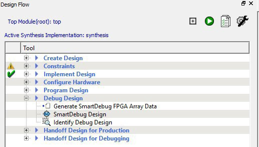

# Debug Design

## Generating SmartDebug FPGA Array Data \(PolarFire\)

The Generate SmartDebug FPGA Array Data tool generates database files used in downstream  tools. These files end with a: `*.db` extension and are used to debug  FPGA Fabric in SmartDebug.

To generate SmartDebug FPGA array data:

1.  Make sure the design completed the Place and Route step. Otherwise, Libero SoC runs implicitly the upstream tools \(Synthesis, Compile Netlist, and Place and Route\) before it generates the FPGA SmartDebug Array Data.
2.  Either double-click **Generate SmartDebug FPGA Array Data** or right-click **Generate SmartDebug FPGA Array Data** in the Design Flow window and click **Run**.

 

## Using the SmartDebug Tool

Design debug is a critical phase of FPGA design flow. Microchip's SmartDebug tool  complements design simulation by allowing verification and troubleshooting  at the hardware level. SmartDebug can provide access to Microchip FPGA  device's built-in probe logic, which allows you to check the state of inputs  and outputs in real-time without having to re-layout the design.

You can run SmartDebug in two modes:

-   [Integrated mode](GUID-379E48FA-E0B8-467F-9C7B-F8731AB58130.md#) from the Libero Design Flow
-   [Stand-alone mode](GUID-379E48FA-E0B8-467F-9C7B-F8731AB58130.md#)

### Integrated Mode

When you run SmartDebug in integrated mode from Libero, SmartDebug can access all design and programming hardware information without requiring any extra setup. Running SmartDebug in Integrated mode also makes the Probe Insertion feature available in the Debug FPGA Array.

To open SmartDebug in the Libero Design Flow window, expand **Debug Design** and double-click **SmartDebug Design**.

### Stand-alone Mode

You can install SmartDebug separately in the setup containing FlashPro Express and Job Manager.  This provides a lean installation that includes all the programming and debug tools to  be installed in a lab environment for debugging purposes. In this mode, SmartDebug is  launched outside the Libero Design Flow. Before launching SmartDebug in stand-alone  mode, perform the SmartDebug project creation and import a Design Debug Data Container  \(`.ddc`\) file that is exported from Libero to access all debug  features in the supported devices.

**Note:** In Stand-alone mode, the Probe Insertion feature is not available in FPGA Array Debug because it requires incremental routing to connect the user net to the specified I/O.

## Identifying the Debug Design

Libero SoC integrates the Identify RTL debugger tool, which allows you to probe and debug  your FPGA design directly in the source RTL. Use Identify software if the design  behavior after programming is not in accordance with the simulation results.

The following list summarizes key Identify features:

-   Instrument and debug your FPGA directly from RTL source code.
-   Internal design visibility at full speed.
-   Incremental iteration. Design changes are made to the device from the identify environment using incremental compile operations. This feature reduces the amount of time required to route the entire device.
-   Debug and display results. You gather only the data you need using unique and complex triggering mechanisms.

You must have both the Identify RTL Debugger and the Identify Instrumentor to run the  following debugging flow.

To open the Identify RTL debugger, in the Design Flow window under **Debug Design**, double-click **Instrument Design**.

To use the Identify Instrumentor and  Debugger:

1.  Create your source file as you normally would and run pre-synthesis simulation.
2.  \(Optional\) Run through an entire flow \(Synthesis - Compile - Place and Route - Generate a Programming File\) without starting Identify.
3.  Right-click **Synthesize** and choose **Open Interactively** in Libero SoC to launch Synplify.
4.  In Synplify, click **Options** &gt; **Configure Identify Launch** to set up Identify.
5.  In Synplify, click **Project** &gt; **New Identify Implementation** to create an Identify implementation.
6.  In the Implementations Options dialog box, make sure **Implementation Results** &gt; **Results Directory** points to a location under `<libero project>\synthesis\`; otherwise, Libero SoC cannot detect your resulting Verilog Netlist file.
7.  From the Instrumentor UI, specify the sample clock, breakpoints, and other signals to probe. Synplify creates a new synthesis implementation. Synthesize the design.
8.  In Libero SoC, run Synthesis, Place and Route and Generate a Programming File.

    **Note:** Libero SoC works from the edif netlist of the current active implementation, which is the implementation you created in Synplify for Identify debug.

9.  In the Design Flow window, double-click **Identify Debug Design** to launch the Identify Debugger.

