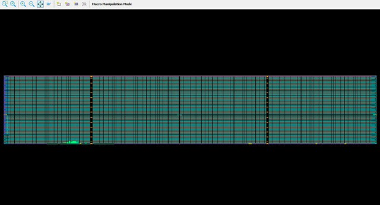
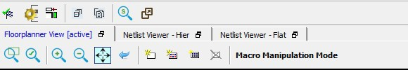
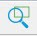
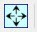
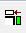
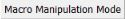
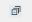
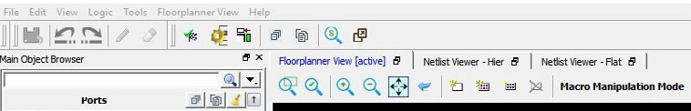
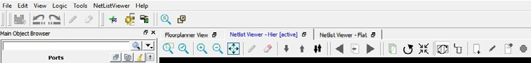

# Floorplanner View Window

The **Floorplanner View** window displays all design  elements in one window. The selections you make in the views are reflected in the  **Floorplanner View**. The color scheme used in the canvas depends on  the Layers and Colors you have selected in the **Display Options**  window.

## Operating Modes

The Floorplanner View has two modes of operation:

-   Macro Manipulation Mode. Use this mode to work with macros, such as assigning macros to location or unassigning placed macros from locations. You can also view properties of selected macros in the Floorplanner View from the properties window. You can select multiple macros from the Floorplanner View by pressing the CTRL key and selecting required macros in the Floorplanner View.
-   Region Manipulation Mode. Use this mode to work on regions such as resizing, renaming, or deleting regions, or assigning and unassigning macros or nets to regions.

Click the **Macro Manipulation Mode** or **Region Manipulation Mode**button to switch between modes.

## Floorplanner View Icons

The icons available at the top of the Floorplanner View window allow you  to zoom in, zoom out, assign I/ O banks, runs DRC checks, and create regions for  placement.

 

**Note:** If you have an IOD interface in your design, this icon  also appears in the toolbar. The following table lists the functions of each icon.

 

<table id="ID-00000997"><thead><tr id="ID-0000099D"><th id="ID-0000099E">

**Icon**

</th><th id="ID-000009A1">

**Name**

</th><th id="ID-000009A4">

**Function**

</th></tr></thead><tbody><tr id="ID-000009A7"><td id="ID-000009A8">

</td><td id="ID-000009AD">

Rubber Band Zoom

</td><td id="ID-000009B0">

Drags out an area to enlarge \(zoom\)  into.

</td></tr><tr id="ID-000009B3"><td id="ID-000009B4">

</td><td id="ID-000009B9">

Rubber Band Select

</td><td id="ID-000009BC">

Zooms into an area. Click in the Floorplanner  View and drag the mouse to delineate an area. Release the mouse and all macros  inside the delineated area are selected.Works in the Macro  Manipulation Mode.

</td></tr><tr id="ID-000009C1"><td id="ID-000009C2">

</td><td id="ID-000009C7">

Zoom In

</td><td id="ID-000009CA">

Zooms in to Floorplanner View.

</td></tr><tr id="ID-000009CD"><td id="ID-000009CE">

</td><td id="ID-000009D3">

Zoom Out

</td><td id="ID-000009D6">

Zooms out of Floorplanner View.

</td></tr><tr id="ID-000009D9"><td id="ID-000009DA">

</td><td id="ID-000009DF">

Zoom to Fit

</td><td id="ID-000009E2">

Zooms to fit the Floorplanner View.

</td></tr><tr id="ID-000009E5"><td id="ID-000009E6">

</td><td id="ID-000009EA">

Zoom to Location

</td><td id="ID-000009ED">

Zooms to a location specified by X-Y  coordinates.

</td></tr><tr id="ID-000009F0"><td id="ID-000009F1">

</td><td id="ID-000009F6">

Zoom to fit Selection

</td><td id="ID-000009F9">

Zooms to fit selected macros and ports. When  enabled, the view is centered on the selected and placed ports.

</td></tr><tr id="ID-000009FC"><td id="ID-000009FD">

</td><td id="ID-00000A02">

Check Design Rules

</td><td id="ID-00000A05">

Runs the Prelayout Checker, a preliminary  check of the netlist for possible Place and Route issues.

</td></tr><tr id="ID-00000A08"><td id="ID-00000A09">

</td><td id="ID-00000A0E">

Check DRC Rules for Selected Interfaces

</td><td id="ID-00000A11">

Run the Prelayout Checker for the selected interface, a preliminary check of the netlist for possible Place and Route issues.

</td></tr><tr id="ID-00000A14"><td id="ID-00000A15">

</td><td id="ID-00000A1A">

I/O Bank Settings

</td><td id="ID-00000A1D">

Sets the I/O bank to specific I/O  Technology.

</td></tr><tr><td>

 

</td><td>

 

</td><td>

 

</td></tr><tr><td>

  

 

</td><td>

Auto Assign I/O Bank

</td><td>

Runs the Auto I/O Bank and Globals Assigner.  Assigns a voltage to every I/O Bank that does not have a voltage assigned to it  and if required, a VREF pin.

</td></tr><tr><td>

  

 

</td><td>

Create Empty

</td><td>

Creates an empty user region.

</td></tr><tr><td>

  

 

</td><td>

Create Inclusive

</td><td>

Creates an inclusive user region.

</td></tr><tr><td>

  

 

</td><td>

Create Exclusive

</td><td>

Creates an exclusive user region.

</td></tr><tr><td>

  

 

</td><td>

Delete Region

</td><td>

Deletes the user-created region you  selected.

</td></tr><tr><td>

  

 

</td><td>

Use the Macro Manipulation Mode and Region Manipulation Mode  buttons

</td><td>

Click the Macro Manipulation Mode and Region Manipulation Mode  buttons to switch modes.

</td></tr><tr><td>

  

 

</td><td>

Zoom Floorplanner View To Fit

</td><td>

Zooms to fit the Floorplanner View.

</td></tr><tr><td>

  

 

</td><td>

Expand Floorplanner View To Minimum Zoom

</td><td>

Expands the floorplanner view to make devices  visible.

</td></tr><tr><td>

  

 

</td><td>

View Full Screen

</td><td>

Toggle button to view full screen and restore back.

</td></tr></tbody>
</table>## Netlist Viewer in Floorplanner View Window

In addition to the Chip View, the Floorplanner View window displays the  netlist views. See [Netlist Views](GUID-F0F4634F-08B9-4B9E-9FD6-2A807892EABC.md#) for details.

The Floorplanner View and the Netlist View feature different sets of icons  specific to their views. There is also a Floorplanner View/Netlist Viewer menu that toggles  between Floorplanner View and Netlist View based on the view that is active at the time.  See the following figures.

 

 

