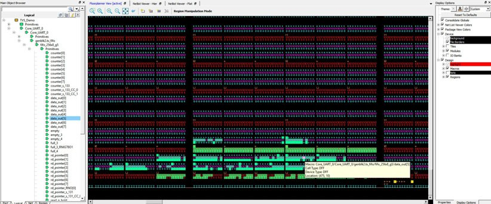
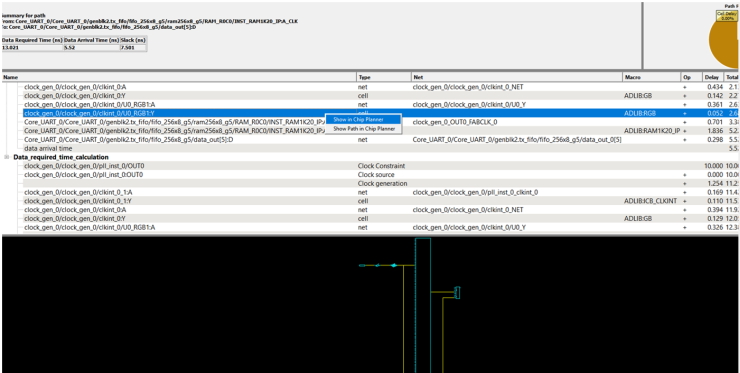
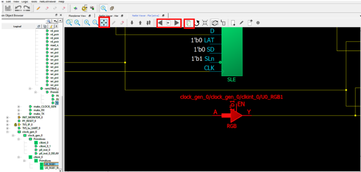
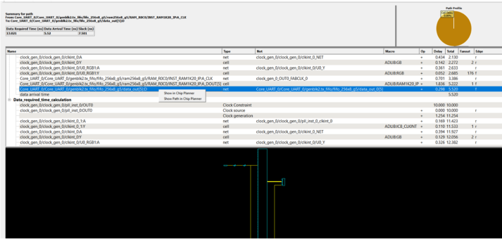
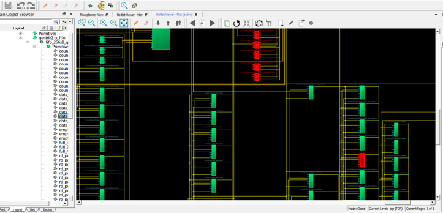
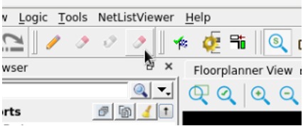

# Cross-Probing from SmartTime to Chip View or Netlist Viewer

Cross-probing allows you to select a design object in one application and see the selection  reflected in another application. When you cross-probe a design object from SmartTime to  the Chip View/ Netlist View, you will better understand how the two applications interact  with each other.

## Cross-Probing from SmartTime to Chip View

With cross-probing, a timing path not meeting timing requirements may  be fixed with relative ease when you see the less-than-optimal placement of the design  object \(in terms of timing requirement\) in Chip Planner. Cross-probing from SmartTime to  Chip Planner is available for the following design objects:

-   Macros
-   Ports
-   Nets/Paths

**Note:** Cross-probing of design objects is available from SmartTime to Chip Planner but not vice versa. Before you can cross-probe from SmartTime to Chip Planner, you must:

1.  Complete Place and Route on the design.

2.  Open both SmartTime and Chip Planner.

### Cross-Probing Examples

To cross-probe from SmartTime to Chip Planner, a design macro in the SmartTime is used as an example. You can download the example design files from the following location:

[https://www.microchip.com/en-us/products/fpgas-and-plds/documentation](https://www.microchip.com/en-us/products/fpgas-and-plds/documentation)

You can download the demo guide from the following location: [https://www.microchip.com/en-us/application-notes/dg0852.html](https://www.microchip.com/en-us/application-notes/dg0852.html)

#### Design Macro Example

1.  Make sure that the design has successfully completed the Place and Route step.

2.  Open SmartTime Maximum/Minimum Analysis view.

3.  Open Chip Planner.

4.  In the SmartTime Maximum Analysis view, right click the instance ending in data\_out\[5\] in the Timing Path Graph and choose **Show in Chip Planner**. With cross-probing, that macro is selected in Chip Planner's Logical view \(zoom in to see the selected item\) and highlighted in white in the Floorplanner View. Zoom in to see the selected item. The Properties window in Chip Planner displays the properties of the macro ending in data\_out\[5\].

    **Note:** The menu item **Show in Chip Planner**is grayed out if Chip Planner is not already open. You may need to zoom in to view the highlighted Q\[2\] macro in the Floorplanner View.

    

    

#### Timing Path Example

1.  Make sure the design completed the Place and Route step successfully.

2.  Open SmartTime Maximum/Minimum Analysis view.

3.  Open Chip Planner.

4.  In the SmartTime Maximum/Minimum Analysis view, right click the macro **Core\_UART\_0/ Core\_UART\_0/tx\_hold\_reg\[5\]**in the table and choose **Show Path in Chip Planner**. There will be a net going from the macro ending in tx\_hold\_reg\[5\] to the other macros such as PF\_RESET\_0, RAM1K20 and RAM\_R0C0 and local level global clock.

    **Note:** If Chip Planner is not already open, the menu item in **Show Path in Chip Planner** is grayed out.

    ")

     

    ")

     

#### Port Example

1.  Make sure the design completed the Place and Route step successfully.

2.  Open the SmartTime Maximum/Minimum Analysis view.

3.  Open Chip Planner.

4.  In the SmartTime Maximum/Minimum Analysis view, right click the port **TX**in the Path and choose **Show in Chip Planner**. Note that the port “TX” is selected and highlighted in Chip Planner's Port view.

**Note:** If Chip Planner is not already open, the menu item Show in Chip Planner is grayed out.

")

 

")

 

From the Properties View inside Chip Planner, you will find the  following information about the Port “CLK” you are cross-probing:

-   Port Type
-   Port Placement Location \(X-Y Coordinates\)
-   I/O Bank Number
-   I/O Standard
-   Pin Assignment

## Cross-Probing from SmartTime to Netlist Viewer

Cross-probing from SmartTime to Netlist Viewer allows you to examine and debug timing-critical paths as the first step toward timing closure. Timing paths with setup or hold time violations can be selected and cross-probed from SmartTime to Netlist Viewer to examine how the net is routed. Cross-probing can also reveal and identify routing congestion.

To cross-probe from  SmartTime to Netlist Viewer, perform the following steps:

1.  In Libero, complete the Place and Route step.

2.  Invoke the Chip Planner.

3.  In Chip Planner, select **Netlist Viewer - Flat**.

4.  In the toolbar, turn on the zoom and center option: .

5.  In the Design Flow window, open SmartTime.

6.  Open the Maximum/Minimum Delay Analysis view.

7.  To open the Timing Path display in SmartTime, click on a timing path.

8.  Right-click a cell in the timing path display or a timing path in the SmartTime table and select **Show in Chip Planner**.

     

    

     

    Netlist Viewer shows the selected item and highlights it.

     

    

     

    **Tip:** Each time you click **Show In Chip Planner** action, the selected object is added to the list of objects previously selected on the Netlist Viewer canvas. To view all selected objects, click **Zoom to Fit** on the **Netlist Viewer** toolbar. In some cases, selected objects may be located on different pages of the canvas. To navigate between these pages, use the **Previous Page** and **Next Page** buttons. To view all selected objects on a single page, disable **Page Splitting**.

9.  To view the objects in the path of the net, right-click a net in the timing path in the SmartTime table and select **Show Path in Chip Planner**.

     

    

     

    **Attention:** Cross-probing a net from the timing path display to Netlist Viewer is not supported.

     

    **Tip:** You might want to **Disable Page Splitting** settings and click on **Zoom to Fit** to view all the selected items.

     

    Netlist Viewer shows the objects in the selected net path and highlights them.

     

    

     

10. If desirable, add the highlighted objects of interest in the Netlist view to a cone view, and add Drivers or Loads to the active cone view for debugging.

    To clear all cross-probe objects and paths, click **Clear Cross Probe** from the top toolbar of the window.

    

