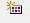
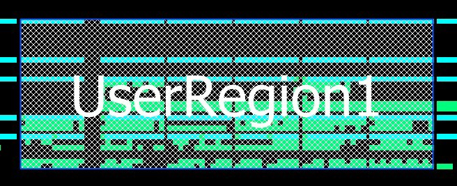
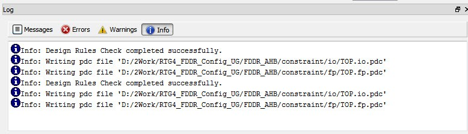
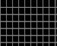
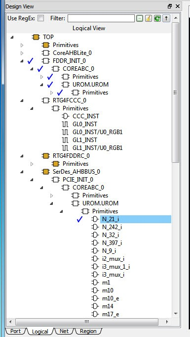
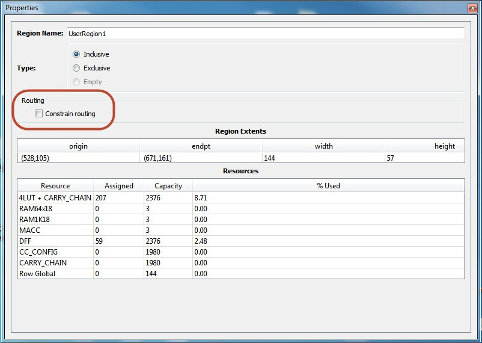
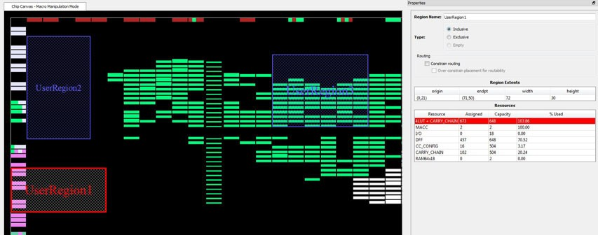

# Floorplanning Using Chip Planner

Floorplanning includes creating regions and making logic assignments to<br /> those regions. It is an optional methodology to improve the performance and routability<br /> of your design. The objective in floorplanning is to assign logic to specific regions on<br /> the chip to enhance performance and routability.

When floorplanning, you analyze your design to see if certain logic can<br /> be grouped within regions. Placement regions are especially useful for hierarchical<br /> designs with plenty of local connectivity within a block. If your timing analysis<br /> indicates several paths with negative slack, try grouping the logic included in these<br /> paths into their own regions. This forces the placement of logic within the path closer<br /> together and may improve timing performance of the design.

Use floorplanning to create Design Separation Regions for<br /> security-critical designs. For Microchip’s Design Separation Methodology, all logic<br /> should be contained in a logic placement region with dedicated Place and Route<br /> resources. For details, see the [Design Separation Methodology User Guide](https://coredocs.s3.amazonaws.com/Libero/2025_1/Tool/design_sep_methodology_ug.pdf).

Use Chip Planner before and after running layout to help you floorplan.<br /> You can:

-   Create Regions
-   Move, resize, merge, or delete regions
-   Assign logic to region
-   Assign nets to regions

## Types of Regions

Three region types can be created for floorplanning purposes:

-   Inclusive region
-   Exclusive region
-   Empty region

### Inclusive Region

In an inclusive region, the Place and Route tool places unassigned logic<br /> within its boundary. It can contain macros, both assigned and unassigned to region. Routing<br /> resources within an inclusive region are also not restricted. Logic that is placed prior to<br /> region creation is not unplaced from the region.

Use the **Create Inclusive Region** icon  to create an inclusive region.

When a region rectangle is created, you can assign logic macros, net<br /> macros, and port macros to it from the Design View window.



### Exclusive Region

In an exclusive region, the Place and Route tool does not place unassigned<br /> logic within its boundary. It can contain only macros already assigned to the region before<br /> the region is created. However, routing resources within an exclusive region are not<br /> restricted.

Use the **Create Exclusive Region**icon to create an<br /> exclusive region: <br />

When a region rectangle is created, you can assign logic macros, net<br /> macros, and port macros to it from the Design View window.

If an exclusive region rectangle is created over placed macros, the locked macros already inside the exclusive region will not be unplaced. They are automatically assigned to the region. If the macro is placed but not locked, the macros will be unplaced from the locations and will not be assigned to the exclusive region.


### Empty Region

In an empty region, neither the user nor the Place and Route tool can<br /> place any logic within its boundary. However, routing resources within an empty region can<br /> be used by the Place and Route tool.

Use the **Create Empty Region** icon to create an empty region:


You cannot assign logic macros, net macros, or port macros to an empty region.

If an empty region rectangle is created over placed macros which are<br /> not locked, the macros will be unplaced from the locations. The creation of an empty<br /> region over locked macros is not allowed.

")

## Creating Rectilinear Regions

To create a rectilinear region for floorplanning:

1.  Click the region icon: Empty/Inclusive/Exclusive.

2.  Go to the Floorplanner View and click at the location where you want to create a region.

3.  Drag the mouse diagonally to draw a rectilinear shape for the size of the region you want. The region is named UserRegion1, 2, 3, and so on by default for Inclusive and Exclusive Regions, and EmptyRegion1, 2, 3, and so on by default for Empty Regions.

4.  \(Optional\) Right click and select **Rename**to rename the region from the default name to a different name.

5.  Click **Commit**to save the changes.


The Log window prints the message that PDC files are updated/written to reflect the changes you have made in Chip Planner.

**Note:** If a user region and its boundary fall on top of a cluster boundary, the tool extends the region to include the cluster in the region.



The `floorplan.pdc` file is updated with the “define\_region” PDC<br /> command to reflect the new user region you<br /> create.

```
define_region -name EmptyRegion3 -type empty -color 2143322112 648 225 659 227
define_region -name UserRegion1 -type inclusive -color 2147442270 552 300 731 311
```

For<br /> details about PDC commands, see the [PDC Commands User Guide \(SmartFusion2, IGLOO2, RTG4](http://coredocs.s3.amazonaws.com/Libero/12_0_0/Tool/pdc_ug.pdf) or the<br /> [PDC Commands User Guide \(PolarFire\)](http://coredocs.s3.amazonaws.com/Libero/12_2_0/Tool/pf_pdc_ug.pdf).

The [Properties Window](GUID-FB359B49-296E-40DF-822B-F6D1F81EBA3B.md#) displays<br /> the properties of the region you created.

## Creating Non-Rectilinear Regions

By default, a region is created with a rectangular area. However, you can<br /> also create a non-rectilinear region by merging two or more rectangular regions.

**Note:**

-   Use inclusive or exclusive region constraints if you intend to assign logic to a region. An inclusive region constraint with no macros assigned to it has no effect. An exclusive region constraint with no macros assigned to it is equivalent to an empty region.
-   A user region in which there are macros assigned to it is identified by a vertical and horizontal

    checkered-board pattern:

    

-   A user region without any logic assigned to it is identified by a diagonal hash line pattern:

    


## Assigning Components/Macros to Regions

To assign components or macros to a user region:

1.  Right click the component or macro in the Logical View and choose **Region Assign**. A dialog box opens for you to select a user region.

2.  Click **Commit**to save the changes.

    Alternatively, you can drag-drop the component or macro from the port, Logical View, or net onto a user region in the Floorplanner View.

    The component or macro<br /> assigned to the region is identified by a blue check mark:

    

    <br />

    

    The Log window prints the message that PDC files are updated/written to<br /> reflect the changes you have made in Chip Planner.

    The<br /> `floorplan.pdc` file is updated with the assign\_region PDC<br /> command:

    ```
    define_region -name UserRegion1 -type inclusive -color 2147442270 552 300 731 311 
    assign_region UserRegion1 FDDR_INIT_0
    ```

    For<br /> details about PDC commands, see the [PDC Commands User Guide for PolarFire FPGA](http://coredocs.s3.amazonaws.com/Libero/2025_1/Tool/pf_pdc_ug.pdf) and the [PDC Commands User Guide for SmartFusion2, IGLOO2, and RTG4](http://coredocs.s3.amazonaws.com/Libero/2025_1/Tool/pdc_ug.pdf).


## Routing Inside a Constrained Region

By default, when a region is first created, the region properties<br /> \(Inclusive/Exclusive/Empty\) apply to design resources \(Placement\) only. The Place and Route<br /> tool is free to use the routing resources inside the region. To further constrain the Place<br /> and Route tool on routing resources usage inside the region, click the **Constrain Routing**check box in the Properties window.



### Constrain Routing

This option applies to all types of regions: inclusive, exclusive, and empty.

When this check box is checked, the region constraints are applied to<br /> routing, in addition to placement. The routing behavior is summarized in the following<br /> table for each type of user region.

<table id="ID-00000BAB"><thead><tr id="ID-00000BB0"><th id="ID-00000BB1">

**Region Type**

</th><th id="ID-00000BB4" align="center">

**Routing Behavior**

</th></tr></thead><tbody><tr id="ID-00000BB7"><td id="ID-00000BB8">

Inclusive

</td><td id="ID-00000BBB">

-   For all nets internal to the region \(the source and all destinations belong to the region\), routing must be inside the region \(that is, such nets cannot be assigned any routing resources that are outside the region or cross the region boundaries\).
-   Nets not internal to the region can use routing resources within the region.

</td></tr><tr id="ID-00000BC7"><td id="ID-00000BC8">

Exclusive

</td><td id="ID-00000BCB">

-   For all nets internal to the region \(the source and all destinations belong to the region\), routing must be inside the region \(that is, such nets cannot be assigned any routing resources that are outside the region or cross the region boundaries\).
-   Nets without pins inside the region cannot be assigned any routing resources that are outside the region or cross region boundaries\).

</td></tr><tr id="ID-00000BD2"><td id="ID-00000BD3">

Empty

</td><td id="ID-00000BD6">

-   No routing is allowed inside the Empty Region.
-   However, local clocks and globals can cross empty regions.

</td></tr></tbody>
</table>## Empty Region General Guidelines

Empty regions allow you to create exclusive areas on the device where no logic<br /> placement can occur. Empty regions help guide the placer to pack your logic closer<br /> together and thereby use more local routing resources to connect it. You cannot create<br /> empty regions in areas that contain locked macros. Use the following guidelines for<br /> empty regions.

### Use Empty Regions to Guide the Place and Route Process

If your design does not completely use up your target device \(for example, 60% utilization or<br /> lower\), use empty regions to cluster your logic placement into specific subareas of the chip.<br /> This helps when you have originally placed-and-routed the design into a smaller device but<br /> want to fit it to a larger part while still preserving the performance you have achieved in<br /> the smaller device.

### Use Empty Regions to Reduce Routing Congestion

Creating empty regions next to the congested area\(s\) of your design<br /> helps reduce congestion. When you place an empty region next to congested logic blocks<br /> or regions, the placer cannot place any logic next to your region or logic block. Logic<br /> which would normally be placed there is forced to be placed somewhere else. Routing<br /> resources next to the congested area are freed up and provide the router more options to<br /> route signals into the congested block.

Before deciding to place empty region\(s\), analyze your design for<br /> congestion areas. To analyze the connectivity into and out of your logic blocks or<br /> regions, navigate to the **Region** tab and select the logical<br /> elements of your design. Create empty regions in these congested areas and see it if<br /> improves the routability of your logic.

### Use Empty Regions to Reserve Device Resources

If you want to preserve the placement of your existing design but plan additional<br /> modifications in the future, create empty regions in the areas of the chip where you<br /> plan to add additional logic. As you add new logic, remove or resize your empty regions<br /> accordingly to fit your new logic. Empty regions placed over I/O pins reserve them for<br /> future use as the I/O needs of your design changes. There are some restrictions for<br /> using empty regions in this manner.

## Overbooking of Regions

Overbooking of regions \(assigning resources over 100% utilization\) is not<br /> allowed. When you try to overbook a region, Chip Planner shows the overbooked resource type<br /> in the [Properties Window](GUID-FB359B49-296E-40DF-822B-F6D1F81EBA3B.md#) of the Region and the resources are not assigned to the region. The<br /> overbooked resource is highlighted in red in the Region Properties window as shown in the<br /> following figure.



## User Action in Regions in the Floorplanner View

When you select a region on the Floorplanner View, you may see some of the<br /> following options:

-   Rename Regions
-   Delete Regions
-   Merge Regions
-   Unassign macros from Regions
-   Assign Macros inside Region
-   Clone Region
-   Unassign All
-   Unassign Selected Nets
-   Unassign Selected Components
-   Unassign Selected Ports

Floorplanner View has two operating modes:

-   Macro Manipulation Mode
-   Region Manipulation Mode

In Macro Manipulation Mode, before any region operations \(resizing, renaming,<br /> deleting, or merging\), you must first click the Region Manipulation Mode button to enter<br /> the Region Manipulation Mode.

**Note:** Any side-effects, such as unplacing or unassigning of a macro due to region creation or region resizing, are shown in the Log window.

