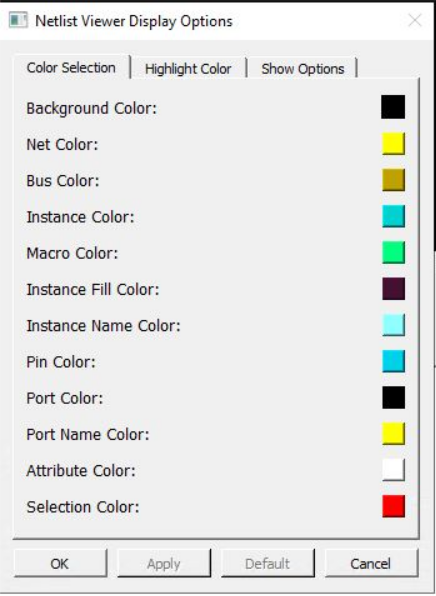

# Color Selection

The Color Selection tab allows you to set your color preferences for the different design  objects.

-   Background Color
-   Net Color
-   Bus Color
-   Instance Color
-   Macro Color
-   Instance Fill Color
-   Instance Name Color
-   Pin Color
-   Port Color
-   Port Name Color
-   Attribute Color—Color of the I/O attributes. For example, 1’b1 for a port tied to VCC or 1’b0 for a port tied to ground. The attribute color applies to the attribute label “1’b1” or “1b0”.
-   Selection Color—Color that shows when design objects such as instances, modules, nets, and pins are clicked and selected.

 

 

-   **[Changing the Color Setting](GUID-B7273502-1A58-48CC-9304-1FE6F9916E81.md)**  

**Parent topic:**[Customizing Display Preferences](GUID-A95E02AB-4644-40D0-8D87-246FA078580B.md)

