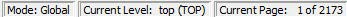

# Display Across Multiple Pages

Hierarchical or flattened netlists can span multiple pages, in which case the first page is displayed when it opens.

The current page number and the total number of pages are displayed in the status bar at the lower right corner of the window.

To go to different pages of the Netlist view, use the left-pointing arrow:

or the right-pointing arrow:

**Parent topic:**[Netlist Viewer—Flat](GUID-93306C23-94AD-4931-8E81-2B4BCD9C816A.md)

