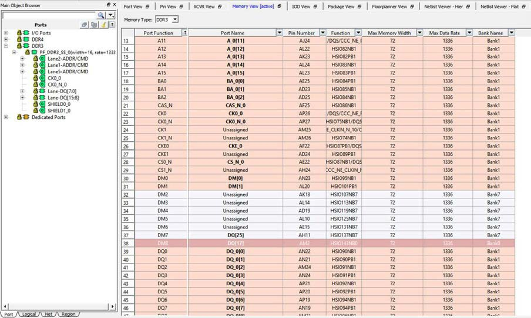

# Making I/O Assignments

To make I/O assignment for the Memory Interface instance in the design:

1.  Select the Memory Interface type from the drop-down menu.

2.  From the Ports tab in the Design Tree View, drag the Memory Interface instance and let the mouse hover over one of the Edge\_Anchor locations available for the Memory Interface type. A tooltip reports whether it is a legal or illegal location for the Interface instance.

3.  Drop the Interface instance into a legal Edge\_Anchor location.

4.   

    **Note:** DRC rules are enforced. Drag-and-drop I/O placement that violates the DRC rules are reported in the Log window. For Memory Interface, the DRC checks the Data Width and the Data Rate compliance\*. If the specific location cannot accommodate the Data Width or the Data Rate of the Memory interface, no I/O assignment is made. An error is reported in the Log Window with a message that explains why the assignment is not accepted. In the following figure, the DRC error message reports that the ddr3 instance requires 64 ports, but the SOUTH\_SE location can accommodate only 58 pins.

     

    **Note:** \*Data Rate compliance will be enforced in a later release.

    

5.  Check that no DRC error messages are reported in the Log window and the I/O assignments are accepted \(see the following figure\). The Lock icon in the Ports tab indicates that the I/O assignment is accepted and locked.

    

**Parent topic:**[Memory Interface View](GUID-04C2F3E6-C9E6-4210-AF6D-16C492A0BAAA.md)

