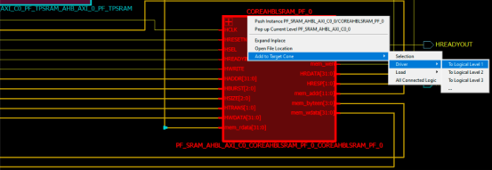

# Adding Drivers and Loads into the Logical Cone

For objects such as Ports, Nets, and Instances, the drivers or loads of these design objects, when selected, can be added to the logical cone. The driver or load of design objects can be added across multiple logical levels. That means the driver of a driver \(two logical level\) or the load of a load \(two logical levels\) can be added to the logical cone. At the expense of some runtime penalty for large designs, up to a maximum of ten logical levels of a selected design object can be added to the logical cone.

-   Click **Add to Target Cone &gt; Selection** to add a selected design object to the Target Cone.
-   Click **Add to Target Cone &gt; Driver/Load &gt; Logical Level 1/2/3** to include in the cone the driver/load of the selected object.

    If the **Do Selection Locally** feature is enabled, Netlist Viewer stops at the  hierarchical boundary when adding drivers/loads to the cone. If this feature is  disabled, Netlist Viewer crosses design hierarchy boundaries to reach the  specified number of logic levels of drivers/loads.

**Important:** To go beyond three Logic Levels, click the ellipse \(...\) and specify the number of logic levels, up to a maximum of 10, in the dialog box.

**Parent topic:**[Adding Selected Objects to a Cone](GUID-C6739B9C-9E8F-439B-A2A1-44B268132770.md)

