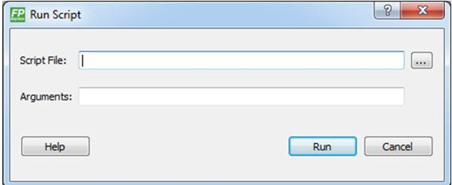
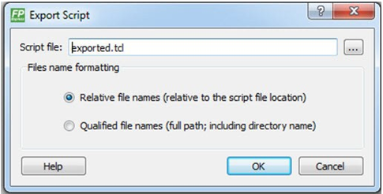

# Tcl Commands

This section describes the FlashPro Express Tcl commands.

## About Tcl Commands

A Tool Command Language \(Tcl\) file contains scripts for simple or complex tasks. You can run  scripts from the Windows command line, or store and run a series of Tcl commands in a  `*.tcl` batch file.

You can run Tcl commands from scripts or from a Windows or Linux command line. Tcl  commands are case sensitive. However, their arguments are not.

For information about all Tcl commands supported by FlashPro Express, see the [Tcl Commands Reference Guide](http://coredocs.s3.amazonaws.com/Libero/2025_1/Tool/libero_soc_tcl_cmd_ref_ug.pdf).

## Executing a Tcl Script File in FlashPro Express

To execute a Tcl script in FlashPro Express:

1.  From the **File**menu, choose **Execute Script**to display the Run Script dialog box.

    

2.  Click the **Browse**button to display the Open dialog box, in which you can go to the folder containing the script file to open. When you click **Open**, FlashPro Express enters the full path and script filename into the Run Script dialog box.
3.  In the **Arguments** box, enter the arguments to pass to your Tcl script. Separate each argument by a space character.
4.  Click **Run**.

## Running Tcl Scripts from the Command Line

You can run Tcl scripts from a Windows or Linux command line.

1.  At the prompt, type the path to the Microchip software followed by the word `SCRIPT`, a colon, and the name of the script file, as follows:

    `<location of Microchip software>/bin/FPExpress.exe SCRIPT:<filename>`

    The  following example executes in batch mode the script  *foo.tcl*:

    `<location of Microchip software>/bin/FPExpress.exe script:foo.tcl`

    The following  example executes in batch mode the script foo.tcl and exports the log in the  file *foo.txt*:

    `<location of Microchip software>/bin/FPExpress.exe script:foo.tcl logfile:foo.txt`

    The following example executes in batch mode the  script *foo.tcl*, creates a console where the log is displayed briefly, and  exports the log in the file *foo.txt*:

    `<location of Microchip software>/bin/FPExpress.exe script:foo.tcl console_mode:brief logfile:foo.txt`

    If you leave console\_mode unspecified or set  it to **hide**, FlashPro Express executes without a console  window. To leave the console window open, run the script with the console\_mode  parameter set to **show**, as in the following  example:

    `<location of Microchip software>/bin/FPExpress.exe script:foo.tcl console_mode:show logfile:foo.txt`

2.  To pass arguments to the Tcl script from the command line, use the `SCRIPT_ARGS` variable, as follows:

    `<location of Microchip software>/bin/FPExpress.exe SCRIPT:<filename> SCRIPT_ARGS:"param1 param2 param3"`

    Arguments passed to a Tcl script can be accessed through  the Tcl variables `argc` and `argv`. The following  examples show how a Tcl script accesses these arguments:

    `puts "Script name: $argv0"`

    `puts "Number of arguments: $argc" set i 0`

    `foreach arg $argv { puts "Arg $i : $arg" incr i`

    `}`

    **Note:** If the script name is protected with double quotes, script names can contain spaces. For example:

    `FPExpress script:"FPExpress tcl/foo 1.tcl"`

## Exporting Tcl Scripts from FlashPro Express

To export Tcl scripts from FlashPro Express:

1.  From the **File**menu, choose **Export Script File**.
2.  Enter the filename and click **Save**. The Export Script Options dialog appears, as shown in the following figure.

    

3.  Check the **Include commands from current project only**to export commands of the current project only. You can specify the filename formatting by selecting **Relative filenames**\(relative to the current directory\) or **Qualified filenames**\(absolute path, including the directory name\).
4.  Click **OK**.

