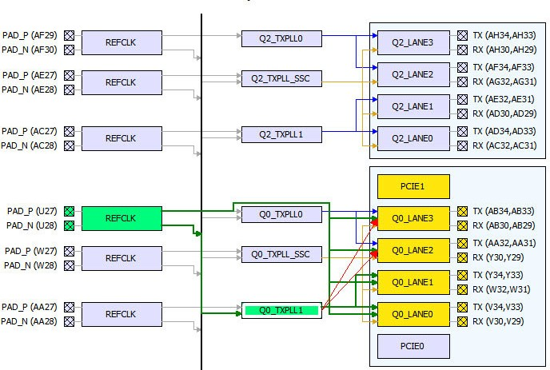
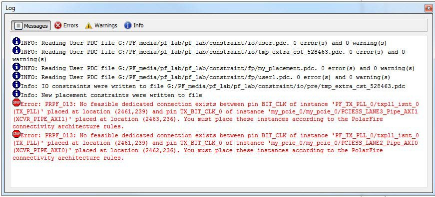

# Transmit PLL Assignment

Drag and drop the Transmit PLL instance into the desired location. Illegal locations are flagged with error messages in the Log window and the illegal connections are indicated by red lines.

The Log window displays two error messages about the illegal  assignments, one for each illegal connection. In this case, the assignment is illegal  because there are no feasible dedicated connections.

**Parent topic:**[XCVR View](GUID-7C12202D-E802-4F24-9D43-D82DA41A819B.md)

