# Handoff Design for Production

## Configuring Security Locks \(and One-Way Passcode for PolarFire SoC\) for Production

The Configure Security Locks for Production is a GUI-based tool that guides PolarFire and  PolarFire SoC users on how to configure security locks for production. The  tool also allows PolarFire SoC users to configure one-way passcode for  production.

The wizard has six steps that are executed in sequential order. One Time  Programmable \(OTP\) settings are applied to configured Security settings from  the Configure Security tool. The subsequent pages in the wizard have  read-only fields that will be affected by settings for Permanent Locks \(and  One-way Passcode for PolarFire SoC\). These settings can be configured only  by the [Configure Security](GUID-AE825DD9-DE91-4C39-95B7-F501D59B5932.md#) tool.

If you configure any Permanent Lock settings in the wizard, you will be forced to go through each  page to review the settings to make sure they are as desired. If PolarFire  SoC users enable **Enable One-way Passcode \(OWP\)**, the  **Finish** button becomes active and users are  not required to go through each page.

The settings cannot be changed once they have been programmed.

1.  [Permanent Locks](GUID-7C0FFD89-F0F2-49A8-9E21-FBB94A5C33F9.md#)
2.  [User Keys in Configure Security](GUID-AE825DD9-DE91-4C39-95B7-F501D59B5932.md#)
3.  [Update Policy in Configure Security](GUID-AE825DD9-DE91-4C39-95B7-F501D59B5932.md#)
4.  [Debug Policy in Configure Security](GUID-AE825DD9-DE91-4C39-95B7-F501D59B5932.md#)
5.  [Microsemi Factory Access in Configure Security](GUID-AE825DD9-DE91-4C39-95B7-F501D59B5932.md#)
6.  [JTAG/SPI Slave Commands Policy in Configure Security](GUID-AE825DD9-DE91-4C39-95B7-F501D59B5932.md#)

### Summary Window

The summary window displays the summary of the current page configuration settings. Based on the selection made in the first page, the summary for the subsequent pages change. The window will scroll to the current page as you move from page to page.

### Back

Click **Back**to return to the previous step.

### Next

Click **Next**to proceed to the next step.

### Finish

Click **Finish**to complete the configuration after executing the all the steps in sequential order.

### Save Summary to File

Click **Save Summary to File**to save the display in the Summary field to a file.

### Permanent Security Locks for Production

This page allows PolarFire and PolarFire SoC users to configure Permanent Locks. Security Locks  must be configured after the Design/Debug phase is completed. The settings will not be  applied to programming within Libero. They are applied only to the Export tools used for  Production programming. Once the settings are programmed, they cannot be changed.  Configuring the Security Locks for Production affects the settings on the subsequent  pages and must be reviewed carefully. The settings cannot be changed after they are  programmed.

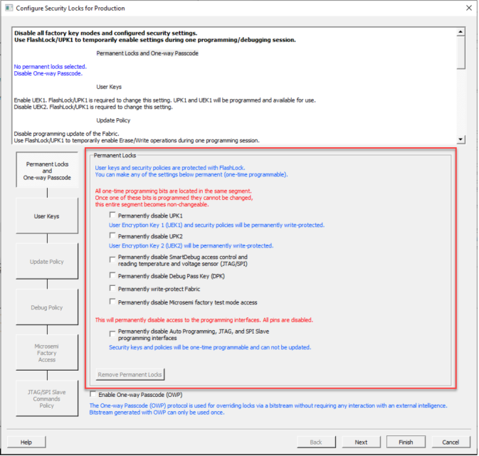

All the user keys and security policies are protected with FlashLock and can be made OTP by configuring the Permanent Lock settings.

You can select one or more of the following options to lock permanently.

|Option|Description|
|------|-----------|
|Permanently disable UPK1|Permanently disables FlashLock/UPK1 from being matched by the device. Any feature that is disabled will be disabled permanently. Any feature that is available will be available permanently.|
|Permanently disable UPK2|Permanently disables FlashLock/UPK2 from being able to be matched by the device. If UEK2 is enabled and selected for programming, it cannot be changed.|
|Permanently disable SmartDebug access control and reading temperature and voltage sensor|Permanently disables SmartDebug access control for user debug and active probes, live probes, and sNVM along with the ability to read the temperature and voltage sensor.|
|Permanently disable Debug Pass Key \(DPK\)|Permanently disables the FlashLock/DPK from being matched by the device. If DPK was programmed, it can no longer be used for SmartDebug access.|
|Permanently write-protect Fabric|Makes the Fabric OTP. Verification of the Fabric is possible. Erase/Program of the Fabric is disabled permanently.|
|Permanently disable Microsemi factory test mode access|Permanently disables Microsemi factory test mode access. Microchip will not be able to  perform Failure Analysis on this device.|
|Permanently disable Auto Programming, JTAG and SPI Slave programming interfaces|Permanently disables all programming interfaces. JTAG and SPI Slave ports are disabled, and you cannot access the device for any operations including reading the IDCODE of the device. The device becomes OTP and you cannot Erase/Program/Verify the device.|

### Remove Permanent Locks

You can remove the Permanent Lock settings by either right-clicking on the tool in the Design Tree or by clicking the button in the UI.

When selected, it removes all the Permanent Locks selected and restores to initial security settings configured in Configure Security tool. This option is highlighted only when at least one of the Permanent Locks is enabled.

### Enable One-way Passcode

The **Enable One-way Passcode \(OWP\)** option is provided for PolarFire  SoC only. This option is available when Auto Programming and IAP Services are enabled,  and either the Fabric, sNVM, or eNVM component is protected for update but not  permanently locked.

If a PolarFire SoC user enables this option, the user must provide a high watermark in  the Advanced options \(spi file only\) of the Export Bitstream file.

**Note:** After enabling one-way passcode, unlocking update protection for Fabric/sNVM and eNVM using the Configure Security tool disables one-way passcode automatically. For more information about one-way passcode, see the [PolarFire Family Security User Guide](https://ww1.microchip.com/downloads/aemDocuments/documents/FPGA/ProductDocuments/UserGuides/Microchip_PolarFire_FPGA_and_PolarFire_SoC_FPGA_Security_User_Guide_VA+%282%29.pdf).

 

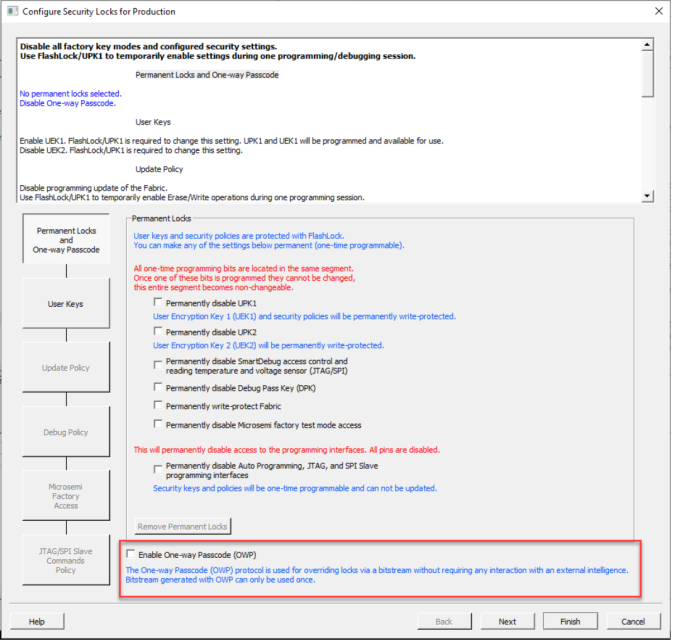

 

### Disable One-way Passcode

You can disable the One-way Passcode option by either right-clicking on the tool in the  Design Tree or by unchecking the check box in the UI.

## Exporting Bitstreams

The Export Bitstream tool allows you to export PPD, STAPL, DAT, and SPI programming  files. It also allows SmartFusion 2 users to export SVF files.

PolarFire users can use Export Bitstream to export the Fabric with sNVM. PolarFire SoC  users can use Export Bitstream to export either the Fabric with sNVM or the sNVM  component only.

To export a bitstream file:

1.  Under **Handoff Design for Production**, double click **Export Bitstream**. The Export Bitstream dialog box opens. The dialog box options depend on the device family, Custom Security settings, and [Permanent Locks](GUID-7C0FFD89-F0F2-49A8-9E21-FBB94A5C33F9.md#) \(and One-way Passcode for PolarFire SoC\) for production settings:
    -   [Device Configured with Bitstream Encryption with Default Key in the Configure Security Tool \(PolarFire and PolarFire SoC\)](GUID-7C0FFD89-F0F2-49A8-9E21-FBB94A5C33F9.md#)
    -   [Device Configured with Custom Security Option in the Configure Security Tool \(PolarFire and PolarFire SoC\)](GUID-7C0FFD89-F0F2-49A8-9E21-FBB94A5C33F9.md#)
    -   [Device Configured with Security Locks for Production Tool \(PolarFire\)](GUID-7C0FFD89-F0F2-49A8-9E21-FBB94A5C33F9.md#)
    -   [Device Configured with Bitstream Encryption with Default Key in the Security Policy Manager \(SmartFusion 2 and IGLOO 2\)](GUID-7C0FFD89-F0F2-49A8-9E21-FBB94A5C33F9.md#)
    -   [Device Configured with Custom Security Option in the Security Policy Manager \(SmartFusion 2 and IGLOO 2\)](GUID-7C0FFD89-F0F2-49A8-9E21-FBB94A5C33F9.md#)
    -   [Export Bitstream \(RTG4\)](GUID-7C0FFD89-F0F2-49A8-9E21-FBB94A5C33F9.md#)
2.  Enter your bitstream file name and select the location to export the bitstream file.
3.  Choose the options that apply to your device \(see [Export Bitstream Dialog Box Options](GUID-7C0FFD89-F0F2-49A8-9E21-FBB94A5C33F9.md#)\).
4.  Click **OK** to export the selected bitstream files.

### Export Bitstream Dialog Boxes

The following sections show the Export Bitstream dialog boxes for the various Microchip  product families.

#### Device Configured with Bitstream Encryption with Default Key in the Configure Security Tool \(PolarFire and PolarFire SoC\)

The following figures show the Export Bitstream options for PolarFire and PolarFire SoC devices configured with bitstream encryption with a default key in the Configure Security tool.

")

")

##### Advanced Options for a Fabric Programmed without Custom Security \(SPI Files Only\)

If Fabric is being programmed without custom security, all options are set automatically and cannot be changed \(see the following figure\).

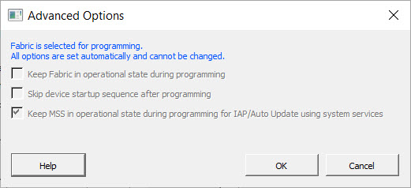

##### Advanced Options for a Fabric Not Being Programmed \(SPI Files Only\)

If Fabric is not being programmed, you can choose to **Keep Fabric in operational state during programming** \(see the following figure\).

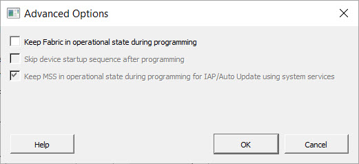

If **Keep Fabric in operational state during programming** is selected, you can also select **Skip device start-up sequence after programming** \(see the following figure\).

#### Device Configured with Custom Security Option in the Configure Security Tool \(PolarFire and PolarFire SoC\)

The following figures show the Export Bitstream options for PolarFire and PolarFire SoC devices.

")

")

##### Include Plaintext Pass Keys

The Export Bitstream with Custom Security dialog box has an **Include Plaintext Pass Keys** option for including plaintext UPK1 and plaintext UPK2 \(if set\)  in a master bitstream file and adding plaintext UPK1 in update bitstream files. You  can use this option for programming updates with protected bitstream components or  disabled programming actions \(program, authenticate, verify\) through JTAG and SPI  Slave interfaces. Programming through IAP services does not require a passkey, so  the **Include Plaintext Pass Keys** option is not supported for  SPI bitstreams.

The following product families support plaintext pass keys:

-   PolarFire
-   PolarFire SoC

Master and update bitstream files are handled in the following way:

-   For a master bitstream file, the plaintext pass keys option is allowed if UPK1 is not permanently locked or if UPK2 is set and not permanently locked.
-   For update bitstream files, the **Include Plaintext Pass Keys** option is allowed if UPK1 is not permanently locked and either:

    -   The Fabric, sNVM, or eNVM is protected.

        OR

    -   Any programming action in the security update policy is disabled.
    . The **Include Plaintext Pass Keys** option is automatically enabled when passkeys are required for updates.

##### Advanced Options for a File Encrypted with UEK1 or UEK2 when Fabric is Being Programmed

If Fabric is being programmed for a file encrypted with UEK1 or UEK2, all advanced options are set automatically and cannot be changed \(see the following figure\).

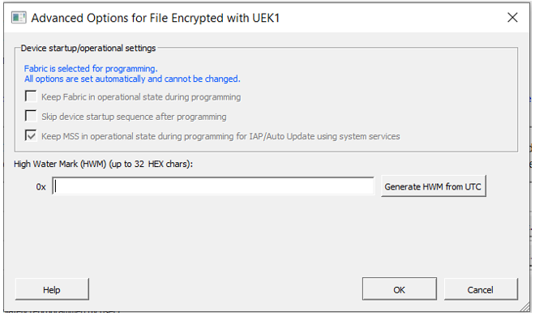

##### Advanced Options for a File Encrypted with UEK1 or UEK2 when Fabric is Not Being Programmed

PolarFire SoC no longer has advanced options for the master file. The Advanced Options dialog has been updated with **High Water Mark** options related to One-way Passcode. If Fabric is not being programmed for a file encrypted with UEK1 or UEK2, you can select **Keep Fabric in operational state during programming** \(see the following figure\).

If **Keep Fabric in operational state during programming** is selected, you can also select **Skip device start-up sequence after programming** \(see the following figure\).

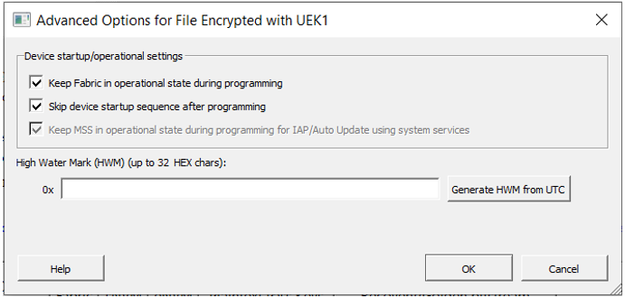

##### High Water Mark

If the **One-way Passcode \(OWP\)** option is enabled, a **High Water Mark** is required \(see the following figure\).

##### Examples of Using Bypass Back Level Protection

The following examples show how to use Bypass Back Level Protection.

|Step|Bitstream|Action|Result|Design Version|Back Level Version|Device Back Level Version|
|----|---------|------|------|--------------|------------------|-------------------------|
|1|Golden/Recovery|Auto Programming|Pass|2|1|1|
|2|IAP/Update Bitstream|Auto Update/IAP|Pass|3|2|2|
|3|IAP/Update Bitstream|Auto Update/IAP|Fail, Attempt Programming Recovery|4|N/A|2|

In the preceding example, the device will have Back Level version 2 after step 2. Trying to  program with bitstream in step 3 fails. If the device tries to reprogram, it initiates  Programming Recovery with the Golden/Recovery bitstream. Because the Golden/Recovery  Bitstream has Design version 2, which is less than or equal to the Back Level version in  the device, it fails. If the Bypass Back Level version option is selected, this back  level protection check is bypassed for the Golden/Recovery Bitstream only and it  succeeds.

|Step|Bitstream|Action|Result|Design Version|Back Level Version|Device Back Level Version|
|----|---------|------|------|--------------|------------------|-------------------------|
|1|Golden/Recovery|Auto Programming|Pass|2|1|1|
|2|IAP/Update Bitstream|Auto Update/IAP|Pass|3|1|1|
|3|IAP/Update Bitstream|Auto Update/IAP|Fail, Attempt Programming Recovery|4|N/A|1|

In this example, the device will have Back Level version 1 after step 2. If you try to program with bitstream in step 3, it succeeds because the Golden/Recovery Design version is greater than the Back Level version on the device.

|Step|Bitstream|Action|Result|Design Version|Back Level Version|Device Back Level Version|
|----|---------|------|------|--------------|------------------|-------------------------|
|1|Golden/Recovery|Auto Programming|Pass|1|1|1|
|2|IAP/Update Bitstream|Auto Update/IAP|Pass|2|1|1|
|3|IAP/Update Bitstream|Auto Update/IAP|Fail, Attempt Programming Recovery|3|N/A|1|

In this example, the device will have Back Level version 1 after step 2. Trying to program with bitstream in step 3 fails. If the device tries to reprogram, it initiates Programming Recovery with the Golden/Recovery bitstream. Because the Golden/Recovery Bitstream has Design version 1, which is less than or equal to the Back Level version in the device, it fails. If the Bypass Back Level version option is selected, this back level protection check is bypassed for the Golden/Recovery Bitstream only and it succeeds.

#### Device Configured with Security Locks for Production Tool \(PolarFire\)

If Security Locks for Production are configured along with Custom Security settings,  Export Bitstream Security options are set with the Configure Security Locks for  Production tool.

For examples of using Bypass Black Level protection, see [Device Configured with Custom Security Option in the Configure Security Tool \(PolarFire and PolarFire SoC\)](GUID-7C0FFD89-F0F2-49A8-9E21-FBB94A5C33F9.md#).

 

 

#### Device Configured with Bitstream Encryption with Default Key in the Security Policy Manager \(SmartFusion 2 and IGLOO 2\)

The following figure shows the Export Bitstream options for a SmartFusion 2 or IGLOO 2 device  configured with the default key option in the Security Policy Manager.

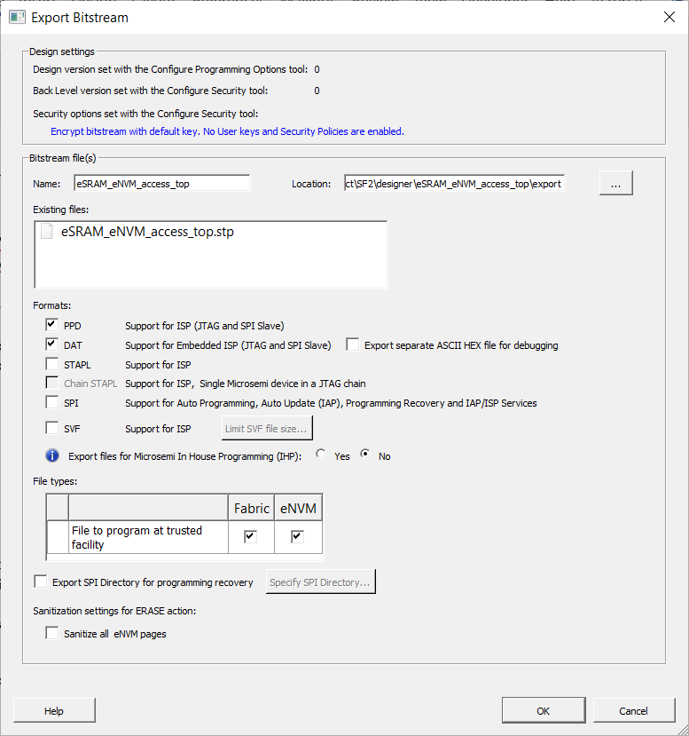

#### Device Configured with Custom Security Option in the Security Policy Manager \(SmartFusion 2 and IGLOO 2\)

The following figure shows the Export Bitstream options for a SmartFusion 2 or IGLOO 2  device configured with the Custom Security option in the Security Policy Manager.

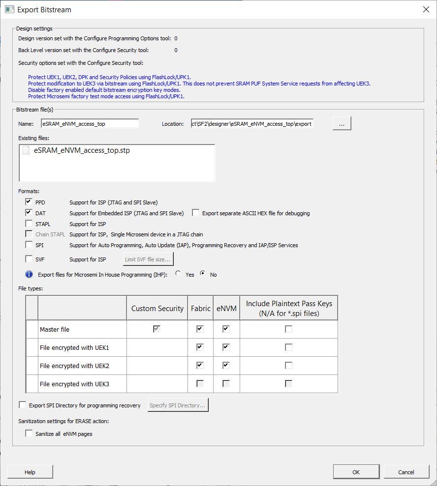

#### Export Bitstream \(RTG4\)

The following figures show the Export Bitstream options for RTG4 devices.

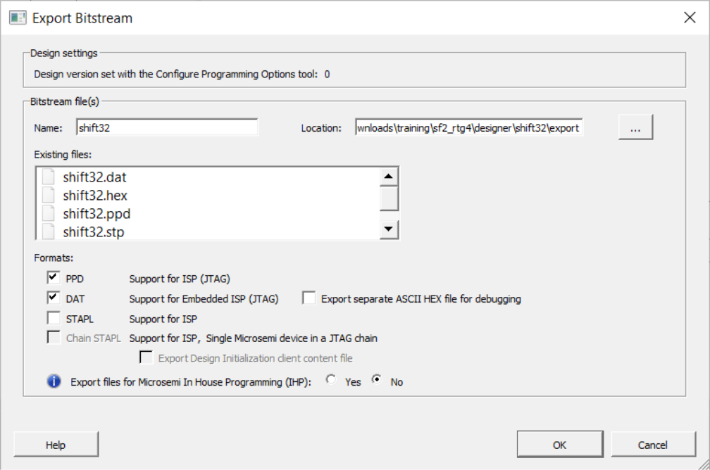

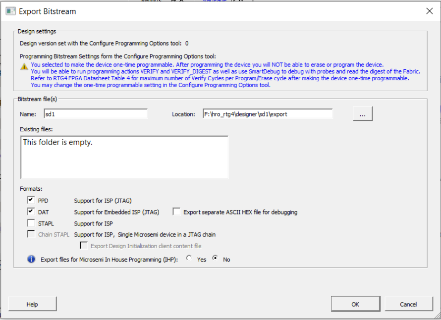

 

**Note:** If you select the **One-time programmable \(OTP\)** option in Configure Programming Options, the following message appears. Click **Yes** to continue or **No** to cancel.

 

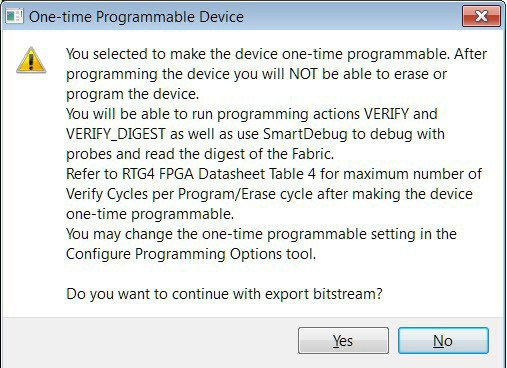

 

### Export Bitstream Dialog Box Options

The following sections describe the options in the Export Bitstream dialog boxes for the various  product families.

#### Design Settings

Read-only design settings that vary with the product family, such as design version,  back level version, and security options.

#### Bitstream Files

**Name**. Set the name of your  bitstream file. The default name is the design name. 

**Location**. Specify the location where the exported file will be saved.

#### Existing files

Programming job files at the selected location.

#### Formats

Select the bitstream file format you want to export. Choices are:

-   PPD
-   DAT
-   Export separate ASCII HEX file for debugging- Exports DAT file in HEX format. This option is available only when DAT file format is selected.
-   STAPL
-   Chain STAPL- Enabled when there are two or more devices in the chain.
-   SPI
-   SVF \(SmartFusion 2\)
-   Export separate ASCII HEX file for debugging- Exports DAT file in HEX format. This option is available only when DAT file format is selected.
-   Export files for Microchip In House Programming \(IHP\)- Check **Yes** to export DAT and STP file formats.

PPD and DAT file formats are the default file formats. If Auto programming is disabled in Configure Security, neither master nor update files can be exported in SPI format. STAPL and DAT are required for In House Programming.

For PolarFire, Auto programming is disabled if Fabric is disabled for updates or if Fabric is open but disable Auto programming option is selected. If Auto programming is enabled and an action is locked, plaintext options are disabled if only SPI format is selected and enabled otherwise.

For PolarFire SoC, Auto programming is disabled if Fabric and eNVM both are disabled for updates or disable Auto programming option is selected. If Fabric is disabled for updates but eNVM is not, then the SPI bitstream file for update cannot include a Fabric component. If Fabric is open and eNVM is locked then, SPI bitstream file for update cannot include eNVM.

#### File Types

Security-only programming must be performed on erased or new devices only. If performed on a device with Fabric programmed, the Fabric will be disabled after performing security-only programming, and you will have to reprogram the Fabric to re-enable it.

##### PolarFire, PolarFire SoC, SmartFusion 2, and IGLOO 2 with Default Security

**File to Program at trusted facility**. Available when the design is configured with Bitstream Encryption using the Default Key in the Configure Security tool. Choices are:

-   **Fabric sNVM**. Check to enable programming for Fabric/sNVM bitstream components at a trusted facility.
-   **eNVM**. Check to enable programming for eNVM bitstream components at a trusted facility. This feature is not supported for PolarFire.

##### PolarFire, PolarFire SoC, SmartFusion 2, and IGLOO 2 with Custom Security

**Master file**. The master file is used to program a trusted facility. Available when the design is configured with Custom Security options in the Configure Security tool. For PolarFire, the master file is also available when the design is configured with Permanent Locks in the Configure Permanent Locks for Production tool. Choices are:

-   **Custom Security**- Always programmed in the master file.
-   **Fabric sNVM**- Check to enable programming for Fabric/sNVM bitstream components.
-   **eNVM**- Check to enable programming for eNVM bitstream components. This feature is not supported for PolarFire.
-   **Include Plaintext Pass Keys**- Check to add plaintext pass keys to the bitstream files to be programmed. This option is available if UPK1 is not permanently locked and the Update Policy Fabric /sNVM or eNVM in PolarFire SoC is passcode protected or any of program, authenticate, or verify action is locked.

**File encrypted with UEK1**- Used to program at untrusted facility or for Broadcast field update. Choices are:

-   **Fabric sNVM**
-   **Include Plaintext Pass Keys**

**File encrypted with UEK2**- Used to program at untrusted facility or for Broadcast field update. Choices are:

-   **Fabric sNVM**
-   **Include Plaintext Pass Keys**

**File encrypted with UEK3**- Used to program at untrusted facility or for Broadcast field update. Available for M2S060, M2GL060, M2S090, M2GL090, M2S150, and M2GL150 devices. Choices are:

-   **Fabric**
-   **eNVM**
-   **Include Plaintext Pass Keys**

**Note:** Observe the following guidelines:

-   If eNVM/Fabric is OTP, it is precluded from bitstream encrypted with UEK1/2/3. Because eNVM is always open for updates, the eNVM OTP warning is not applicable for SmartFusion 2 and IGLOO 2.
-   UEK3 is available only for M2S060S, M2GL060S, M2S090S, M2GL090S, M2S150S, and M2GL150S devices.
-   If a component such as eNVM is not present in the design, it will be disabled in the bitstream component selection.

#### Export SPI Directory for Programming Recovery \(SmartFusion 2 and IGLOO 2\)

The **Export SPI Directory for programming recovery** option appears  for SmartFusion 2 and IGLOO 2 devices configured with Custom Security Option in the  Security Policy Manager.

This option allows you to export an SPI directory containing Golden and Update SPI image  addresses and design versions used in Autoupdate and Programming Recovery flow. Check  this option and click **Specify SPI Directory** to set the required  information in the SPI Directory dialog box.

#### Zeroization Actions

**Zeroization actions** appears in the Export Bitstream dialog box when a PolarFire or PolarFire SoC device is configured with:

-   The Custom Security option in the Configure Security Tool
-   Bitstream encryption with a default key in the Configure Security Tool

**Note:** **Zeroization actions** is not supported for XT and ES devices.

**Zeroization actions** can have two options, depending on the device and configured features:

-   **Like New**- Erase all user data and reprogram the device immediately.
-   **Unrecoverable**- Erase all data and destroy reprogrammability. If selected, the device must be scrapped.

#### Sanitization Settings for ERASE Action

**Sanitization settings for ERASE action** appears in the Export Bitstream dialog box when a PolarFire, PolarFire SoC, SmartFusion 2, or IGLOO 2 device is configured with:

-   The Custom Security option in the Configure Security Tool
-   Bitstream encryption with a default key in the Configure Security Tool

**Sanitization settings for ERASE action** can have two options,  depending on the device and configured features.

##### PolarFire and PolarFire SoC

-   **Sanitize all sNVM pages**. Available if Fabric/sNVM component is selected for at least one Master file or update file.

-   **Sanitize all eNVM pages**. Available for PolarFire SoC only if eNVM is configured and selected for at least one master or update file.

##### SmartFusion 2 and IGLOO 2

**Sanitize all eNVM pages**. Available only if eNVM is configured and selected for at least one master or update file.

#### STAGE3 Initialization Clients

Starting with Libero v2021.2, when you export a SPI file when SPI Flash has an `INIT_STAGE_3_SPI_CLIENT`, PolarFire and PolarFire SoC always export the STAGE3 Initialization client content file \(`.bin`\) along with a SPI file. The name of the STAGE3 Initialization file is based on the name of the SPI file: `<spi_file_name>``_stage3init.bin`. The following figure shows an example of exported STAGE3 Initialization files in the **Existing files** list.

When you configure SPI Flash and use the SPI file with STAGE3 data, the start  address for the STAGE3 Initialization client is taken from the SPI file. The SPI  file also contains a digest to verify the STAGE3 Initialization client  file.

### Security Programming Files

Expanding **Handoff Design for Production** in the Design Flow window, and  then selecting **Export Bitstream** creates  the following files.

<table id="TABLE_ZJQ_V5V_4PB"><thead><tr><th>

File

</th><th>

Description

</th></tr></thead><tbody><tr><td>

PolarFire:  &lt;filename&gt;\_master.\(stp/spi/dat\)SmartFusion2, IGLOO2, and RTG4: PolarFire:  &lt;filename&gt;\_master.\(stp/svf/spi/dat\)

</td><td>

  Created when Enable custom security options is  specified in the Security Wizard. This is the  master programming file. It includes all  programming features enabled, User Key Set 1, User  Key Set 2 \(optionally if specified\), and your  security policy settings. 

</td></tr><tr><td>

PolarFire:  &lt;filename&gt;\_security\_only\_master.\(stp/spi/dat\) SmartFusion2, IGLOO2, and  RTG4: PolarFire:  &lt;filename&gt;\_security\_only\_master.\(stp/svf/spi/dat\)

</td><td>

Created when Enable custom security options  is specified in the Security Wizard. Master  security programming file. This file includes User  Key Set 1, User Key Set 2 \(optionally if  specified\), and your security policy  settings.

</td></tr><tr><td>

PolarFire:  &lt;filename&gt;\_uek1.\(stp/spi/dat\)SmartFusion2, IGLOO2, and RTG4: PolarFire:  &lt;filename&gt;\_uek1.\(stp/svf/spi/dat\)

</td><td>

Programming file encrypted with User  Encryption Key 1 used for field updates. This file  includes all your features for programming, except  security.

</td></tr><tr><td>

PolarFire:  &lt;filename&gt;\_uek2.\(stp/spi/dat\)SmartFusion2, IGLOO2, and RTG4: PolarFire:  &lt;filename&gt;\_uek2.\(stp/svf/spi/dat\)

</td><td>

Programming file encrypted with User  Encryption Key 2 used for field updates. This file includes all your features for  programming, except security.

</td></tr><tr><td>

SmartFusion2, IGLOO2, and RTG4: &lt;filename&gt;\_uek3.\(stp/svf/spi/dat\)

</td><td>

Programming file encrypted with User Encryption Key 3 used for field updates.  This file includes all your features for programming except security.**Note:** UEK3 is available only for M2S060S, M2GL060S, M2S090S, M2GL090S, M2S150S, and M2GL150S devices.

</td></tr></tbody>
</table>## Exporting FlashPro Express Jobs

The following topics describe the exporting of FlashPro Express jobs.

### Prepare Design for Production Programming in FlashPro Express

After you export a programming job, you can handoff this programming job to the FlashPro Express  tool for production programming.

**Note:** Preparing a design for production programming in FlashPro Express is the same for all Libero device families.

1.  In FlashPro Express, from the **File** menu choose **Create Job Project From a Programming Job**. A prompt asks you to specify the Programming Job location you just exported from Libero and the location where to store the Job Project. The Job Project name uses the programming job name automatically and cannot be changed.
2.  Click **OK**. A new Job Project is created and opened for production programming.

### Export FlashPro Express Job Dialog Boxes

The following sections show the Export FlashPro Express Job dialog box for PolarFire, SmartFusion  2, IGLOO 2, and RTG4. Dialog box options vary, depending on the  device you are using and the security settings.

#### Export FlashPro Express Job \(PolarFire and PolarFire SoC\)

To program the design using the stand-alone FlashPro Express tool on Linux or Windows®, export a  FlashPro Express Job. The job file will include chain configuration, Programmer  Settings, and programming files loaded from Programming Connectivity and Interface.

**Note:** SPI Slave mode is supported by FlashPro6 for PolarFire devices. JTAG is the default interface.

The Export FlashPro Express Job uses Permanent Locks for Production configuration if Permanent Locks are configured. If Permanent Locks are not configured, it uses the Configure Security configuration.

Use the Configure Security tool before you export the programming job to add security. The Export FlashPro Express Job dialog box displays the Security Options you have configured through the Configure Security tool or Configure Permanent Locks for Production tool.

**Note:** PolarFire SoC users can use Export FlashPro Express to export either Fabric with sNVM or sNVM component only. The eNVM feature is displayed for PolarFire SoC devices when eNVM is used in the design. eNVM features are available for PolarFire SoC devices only.

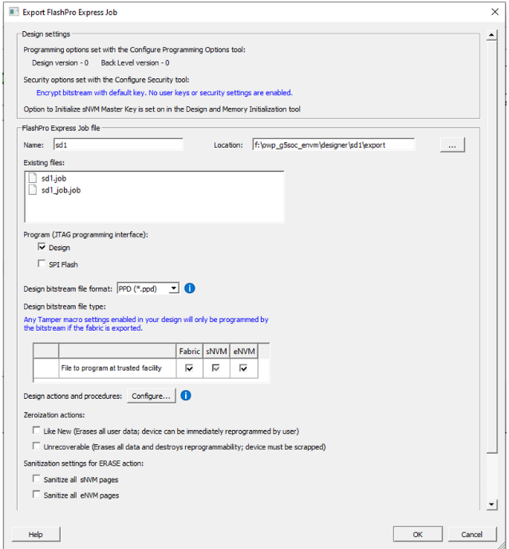

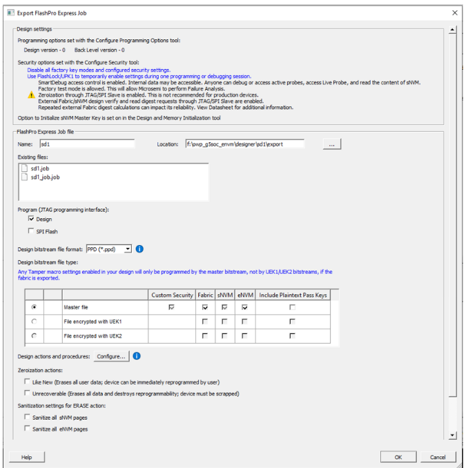

**Attention:** If exporting FlashPro Express jobs that have protected bitstream components or disabled programming actions \(program, authenticate, verify\) through JTAG and SPI slave interfaces, see section [Device Configured with Custom Security Option in the Configure Security Tool \(PolarFire and PolarFire SoC\)](GUID-7C0FFD89-F0F2-49A8-9E21-FBB94A5C33F9.md#) for information about using the **Include Plaintext Pass Keys** option.

#### Export FlashPro Express Job \(SmartFusion 2 and IGLOO 2\)

To program the design using the stand-alone FlashPro Express tool on Linux or Windows, export a  FlashPro Express Job. The job file will include chain configuration, Programmer  Settings, Programming Mode \(JTAG/SPI-Slave\), and programming files loaded from  Programming Connectivity and Interface.

**Note:** SPI Slave mode is supported by FlashPro5 for SmartFusion 2 and IGLOO 2 devices, and by FlashPro6 for SmartFusion 2 and IGLOO 2 devices. JTAG is the default interface.

For SmartFusion 2 and IGLOO 2, Security Programming is supported. Use the Security Policy Manager  to configure Security before you export the programming job. The Export FlashPro Express  Job dialog box for SmartFusion 2 and IGLOO 2 displays the Security Options you  configured in the Security Policy Manager.

The Export FlashPro Express Job dialog box options vary, depending on the device you are  using and the Security Key Mode you selected.

#### Export FlashPro Express Job \(RTG4\)

To program the design using stand-alone FlashPro Express tool on Linux or Windows,  export a FlashPro Express Job. The job file will include chain configuration, Programmer  Settings, Programming Mode \(JTAG/SPI-Slave\) and programming files loaded from  Programming Connectivity and Interface.

**Note:** SPI Slave mode is not supported for RTG4 devices. JTAG is the default interface. Security Programming is not supported for RTG4.

")

If you selected the **One-time programmable \(OTP\)** option in Configure Programming Options, the following message appears. Click **Yes** to continue or **No** to cancel.

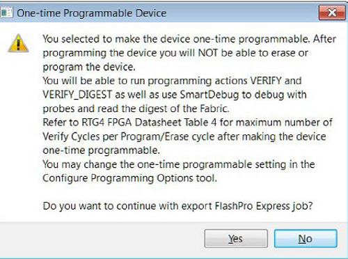

### Export FlashPro Express Job Dialog Box Options

#### Design Settings

Read-only design settings that vary with the product family, such as design version,  back level version, and security options.

#### FlashPro Express Job File

**Name**. Set the name of your job file. The default name is the  design name.

**Location**. Location to save the exported file.

#### Existing files

Programming job files at the selected location.

#### Program \(JTAG programming interface\)

This option is available for PolarFire and PolarFire SoC only. Choices are:

-   **Design**. Check to include the configured device chain with bitstream files.
-   **SPI Flash**. Check to include the configured device chain with a SPI flash binary file.

JTAG is the default programming interface for PolarFire Devices. SPI Flash option is  available only if SPI Flash is configured in the Configure Design Initialization Data  and Memories tool; otherwise, it remains grayed out. Info message appears based on the  configuration selected

#### Design Bitstream File Format

Lists all the available bitstream files, one of which will be included in the programming job for the current target device. The format of the bitstream file can be selected from the **Format** drop-down list. PPD is the default bitstream file format.

#### Design Bitstream File Type \(PolarFire, PolarFire SoC, SmartFusion 2, and IGLOO 2\)

Security-only programming must be performed on erased or new devices only. If performed on a device with Fabric programmed, the Fabric will be disabled after performing security-only programming, and you will have to reprogram the Fabric to re-enable it.

##### PolarFire, PolarFire SoC, SmartFusion 2, and IGLOO 2 with Default Security

**File to Program at trusted facility**. Available when the design is configured with Bitstream Encryption using the Default Key in the Configure Security tool. Options are:

-   **Fabric sNVM**- Check to enable programming for Fabric/sNVM bitstream components at a trusted facility.
-   **eNVM**- Check to enable programming for eNVM bitstream components at a trusted facility. This feature is not supported for PolarFire.

##### PolarFire, PolarFire SoC, SmartFusion 2, and IGLOO 2 with Custom Security

**Master file**- is used to program a trusted facility. Option is available when the design is configured with Custom Security options in the Configure Security tool. For PolarFire, the master file is also available when the design is configured with Permanent Locks in the Configure Permanent Locks for Production tool. Options are:

-   **Custom Security**- Always programmed in the master file.
-   **Fabric sNVM**- Check to enable programming for Fabric/sNVM bitstream components.
-   **eNVM**- Check to enable programming for eNVM bitstream components. This feature is not supported for PolarFire.
-   **Include Plaintext Pass Keys**- Check to add plaintext pass keys to the bitstream files to be programmed. This option is available if UPK1 is not permanently locked and the Update Policy Fabric /sNVM or eNVM in PolarFire SoC is passcode protected or any of program, authenticate, or verify action is locked.

**File encrypted with UEK1**- Used to program at untrusted facility or for Broadcast field update. Choices are:

-   Fabric sNVM
-   Include Plaintext Pass Keys

**File encrypted with UEK2**- Used to program at untrusted facility or for Broadcast field update. Choices are:

-   Fabric sNVM
-   Include Plaintext Pass Keys

**File encrypted with UEK3**- Used to program at untrusted facility or for Broadcast field update. Available for M2S060, M2GL060, M2S090, M2GL090, M2S150, and M2GL150 devices. Choices are:

-   Fabric
-   eNVM
-   Include Plaintext Pass Keys

#### Design Actions and Procedures

Clicking the **Configure** button displays the options described in [Configuring Actions and Procedures](GUID-AE825DD9-DE91-4C39-95B7-F501D59B5932.md#).

#### Zeroization Actions \(PolarFire and PolarFire SoC\)

This option is available for PolarFire only. Choices are:

-   **Like New**. Erase all user data and reprogram the device immediately.
-   **Unrecoverable**. Erase all data and destroy reprogrammability. If selected, the device must be scrapped.

#### Sanitization Settings for ERASE Action \(PolarFire and PolarFire SoC\)

##### PolarFire and PolarFire SoC

-   **Sanitize all sNVM pages**- Available if Fabric/sNVM component is selected for at least one master file or update file.
-   **Sanitize all eNVM pages**- Available for PolarFire SoC only if eNVM is configured and selected for at least one master or update file.

##### SmartFusion 2 and IGLOO 2

-   **Sanitize all eNVM pages**- Available only if eNVM is configured and selected for at least one master or update file.

## Exporting Job Manager Data

Job Manager is Microchip's HSM-based security software for job management. It is  supported by PolarFire SoC, PolarFire, SmartFusion 2, and IGLOO 2.

As a part of the SPPS flow, the Export Job Manager Data dialog box allows you to export  Libero design data to Job Manager. Exported data is used by an Operation Engineer \(OE\)  using Job Manager to prepare the manufacturing process for HSM or non-HSM flow.

**Note:** PolarFire SoC users can use Export Job Manager to export either Fabric with sNVM or sNVM component only. Job Manager data export is not supported by RTG4.

To export Job Manager data:

1.  In the Design Flow window, expand **Handoff Design for Production**.
2.  Double-click **Export Job Manager Data**.
3.  Complete the fields in the Export Job Manager Data dialog box.
4.  Click **OK**.

 

")

 

|Field|Description|
|-----|-----------|
|Name|All names use a prefix as shown in your software.|
|Location|Location of the file to be exported.|
|Existing programming data files|Existing programming job files already in your project.|
|Include bitstream components|Components of the design that can be saved to the file.|
|Include SPI Flash data \(requires Fabric/sNVM components\)|PolarFire only: If SPI Flash is configured in Configure Design  Initialization Data and Memories, use this option to include  Fabric/sNVM components.|
|Bypass Black Level protection for Recovery/Golden  bitstream|Bypasses black-level protection for the SPI bitstream.|

 

## Export a SPI Flash Image \(PolarFire and PolarFire SoC\)

The Export SPI Flash Image tool allows PolarFire and PolarFire SoC users to export a SPI Flash  Image file. The SPI Flash is defined in the [SPI Flash](GUID-AE825DD9-DE91-4C39-95B7-F501D59B5932.md#) tab  in the Configure Design Initialization Data and Memories tool.

To export the SPI Flash Image:

1.  In the **Design Flow** window, expand **Handoff Design for Production**.
2.  Double-click **Export SPI Flash Image**.
3.  Complete the fields in the **Export SPI Flash Image** dialog box.
4.  Click **OK**.

 

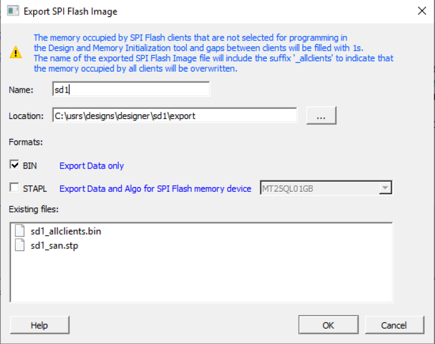

 

|Field|Description|
|-----|-----------|
|Name|All names use a prefix as shown in your software.|
|Location|Location of the file to be exported.|
|Formats|Allows you to export the SPI Flash Image file in BIN format,  STAPL format, or both formats.|
|Existing files|Existing files already in your project.|

### Name

This is the top level design name by default. Use this field to change the default name. By  default, SPI Flash Image files are exported in binary format, acquire the \*.bin file  extension, and are named &lt;design\_name&gt;\_allclients.bin.

### Location

The default location for the exported image file is: `<project_folder>\designer\<top_level_design>\export`. Use the browse button to navigate to and specify a different location for the exported SPI Flash Image file.

### Formats

Select the bitstream file format you want to export. The following file format options are  available:

-   BIN
-   STAPL

BIN files acquire a .bin file extension is added to the end of a file name and denotes that  the content of the file is in binary format.

STAPL files are used for programming and testing Programmable Logic Devices \(PLDs\) and FPGAs  through JTAG, and are in Standard Test and Programming Language \(STAPL\) format. If you select  STAPL, select a SPI Flash memory device from the dropdown menu. When the STAPL file is  generated, it acquires a STP file extension.

### Existing files

Lists existing SPI Flash Image files.

## Exporting Pin Reports

The pin report lists the pins in your device. When you export the report, you can specify whether you want the pins to be sorted by port name, package pin name, or both. Based on your selection, the pin report generates one or two files:

-   `<design>_pinrpt_name.rpt`. Pin report sorted by name.
-   `<design>_pinrpt_number.rpt`. Pin report sorted by pin number.

By default, exporting a pin report generates a Bank report with the filename `<design>-bankrpt.rpt`. Export Pin Report also generates an I/O Register Combining report that lists the I/Os that are combined into a Register to improve timing performance.

To export the pin report:

1.  In the Design Flow window, expand **Handoff Design for Production**.
2.  Double-click **Export Pin Report**.

    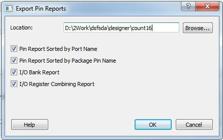

3.  Click **Browse** and go to the location where you want the pin report to be saved.
4.  Check or uncheck the check boxes to suit your requirements.
5.  Click **OK**.

## Exporting BSDL Files

The BSDL file provides a standard file format for electronics testing using JTAG. It  describes the boundary scan device package, pin description, and boundary scan cell of  the input and output pins. BSDL models are available as downloads for many Microchip SoC  devices.

To generate the BSDL file to your [Design Report](GUID-F9EBA308-305F-4288-8D09-CB856AA26995.md#):

 

1.  In the Design Flow window, expand **Handoff Design for Production**.
2.  Double-click **Export BSDL File**.
3.  When prompted, go to the location where you want the BSDL file to be exported.
4.  Click **Save**.

 

For more information about BSDL models, see the [Microchip website](https://www.microchip.com/).

## Exporting IBIS Models

Export Input Output Buffer Information Specification \(IBIS\) is supported for all PolarFire “T”  devices, except the “XT” device. The Export IBIS feature is supported in two stages:

-   Pre-Layout Flow
-   Post-Layout Flow

To export the IBIS Model in the Pre-Layout Flow, the design must pass until the Synthesis/Compile  stage. You must provide the I/O placement and configuration details in the I/O PDC files  to export the resultant IBIS files in Pre-Layout Flow.

To export the IBIS Model in the Post-Layout Flow, the design must pass until the Place and Route  stage. If a design runs through the Place and Route tool, the IBIS model for the  Post-Layout Flow will be exported by default.

To export the IBIS Model:

1.  In the Design Flow window, expand **Handoff Design for Production**.
2.  Double-click **Export IBS Model**.
3.  Complete the fields in the Export IBS Model dialog box.
4.  Click **OK**.

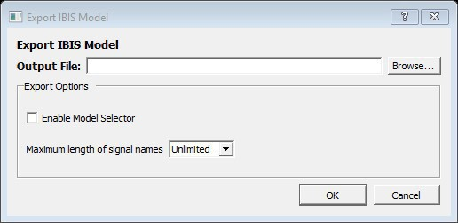

|Field|Description|
|-----|-----------|
|Output File|Click Browse and go to the location where you want to export the IBS  Model.|
|Enable Model Selector|To generate Model Selector support in the exported IBIS file, check  this box.|
|Maximum length of signal names|Length of Model Selector name or Model name referred to as the Signal  name in the IBIS file.|

### Output File

Click **Browse**to specify the location to export the IBIS output file along with the output file name.

### Export Options

The IBIS report `*.ibs` file exported from Libero SoC can optionally support the \[Model Selector\] keyword specified in the IBIS[5.0 Specifications](https://ibis.org/ver5.0). To generate Model Selector support in the exported IBIS file, check **Enable Model Selector** in the Export Options and click **OK** to export the IBIS Model. In this way, you can also optionally limit the maximum signal name to 40 characters.

The IBIS model report provides an industry-standard file format for recording parameters such as driver output impedance, rise/fall time, and input loading, which can be used by software applications such as Signal Integrity tools or IBIS simulators.

The exported IBIS file has the file extension `*.ibs` \(named `<root>.ibs`\) and appears in the **Files** tab.

In the **\[Pin\]** section of the IBIS `*.ibs` file, the Model Selector tag appears below the **model\_name**. The IBIS `*.ibs` file has a **\[Model Selector\]** section that describes the model selector and its list of models. The Model Selector tag in the **\[Pin\]** section establishes the relationship between the pin and the **\[Model Selector\]**.

The Model Selector feature allows you to load the `*.ibs` file from Libero SoC into Signal Integrity applications or IBIS simulators and switch the I/O to different models for individual I/Os on-the-fly in the tools. There is no need to go back to the Libero SoC I/O Attribute Editor to change the I/O settings and run Compile to switch to different I/O settings.

For more information, navigate to the [Microchip website](www.microchip.com), and then use the search function to search for IBIS models.

## Export Initialization Data and Memory Report \(PolarFire and PolarFire SoC\)

The Export Initialization Data and Memory report provides standard initialization data  and memory report based on the configuration performed in the Configure Design  Initialization and Memories tool.

To generate the Export Initialization Data and Memory report:

 

1.  In the Design Flow window, expand **Handoff Design for Production**.
2.  Double-click **Export Design Initialization Data and Memory Report**.
3.  When prompted, go to the location where you want the initialization data and memory report to be exported.
4.  Click **Select Folder**.

 

## Exporting μPROM Reports \(RTG4\)

RTG4 users can generate an Export μPROM report that includes the configuration file path, client details, and μPROM usage statistics.

To export a μPROM report:

1.  In the Design Flow window, expand **Handoff Design for Production**.
2.  Double-click **Export μPROM Report** to export the report. The Export μPROM Report Under dialog box appears.
3.  When prompted, go to the location where you want to save the Export μPROM report.
4.  Click **Select Folder**.

The Export uPROM report generates an XML/TEXT version of the report with the filename. For example: `uPROM_Configuration_Report.xml/ uPROM_Configuration_Report.txt`

