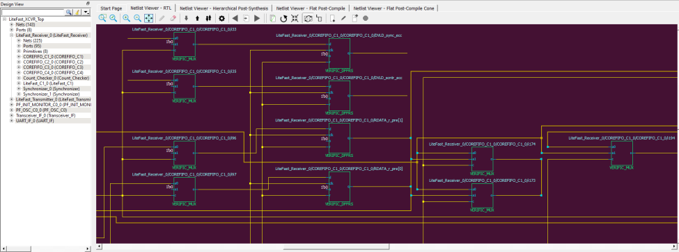
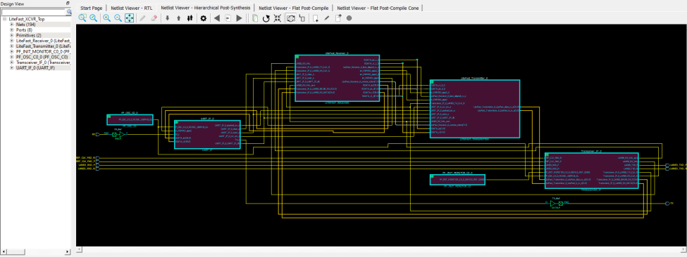
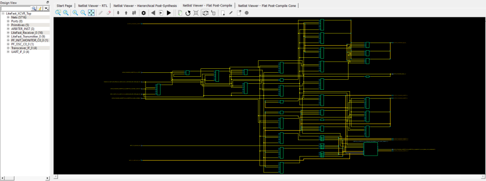
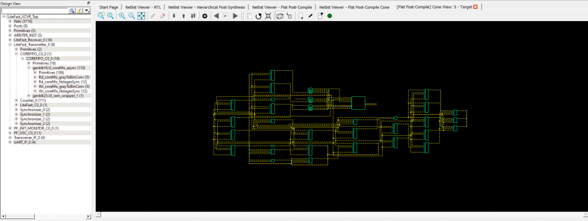

# Views

The Netlist Viewer is a Graphical User Interface \(GUI\) that displays  different views for the different stages of the design process:

-   Register Transfer Level \(RTL\) Netlist view—shows how the Verilog code appears in design format. Using this view, you can confirm whether software implemented the correct logic. Cross probing between this view and the HDL code aids in troubleshooting when the design does not work as desired.
-   Hierarchical Post-Synthesis view—hierarchical view of the netlist after synthesis and after technology mapping to the Microchip FPGA technology.
-   Flat Post-Compile Netlist view—a flattened netlist after synthesis, technology mapping and further optimization based on the Design Rules Check \(DRC\) rules of the device family and/or die.
-   Flat Post-Compile Cone view—loads the same netlist as the Flat Post-Compile view, but does not initially draw anything on the canvas. Important parts of the design can be added to the canvas from the tree or from the existing items in the view. This view opens much more quickly than the Flat Post-Compile view. It allows you to load only the parts of the design you are interested in. This view is well-suited for use with large designs. This view is not available for all families.

**Important:** A progress bar indicates that the flattened netlist is being loaded. For a large netlist, the loading may incur some runtime penalty. A **Cancel** button is available to cancel the loading.

