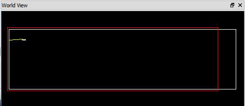
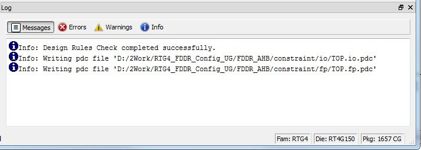

# Other Chip Planner Windows

## World View Window

The **World View** shows a red rectangle which reflects  what is visible in the Floorplanner View in the context of the Chip. Changing what is  visible in the canvas also changes the red rectangle. Changing the size or position of the  red rectangle changes what is seen in the Floorplanner View.

## Log Window

The Log window displays all messages generated by Chip Planner. You can  filter the messages according to the type of message: Error, Warning, and Info. If you made  and saved changes in Chip Planner, the Log window shows the name and location of the PDC  file\(s\) that were edited to reflect the changes.

