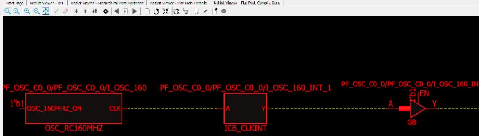

# Adding a Component

Right click a component in the Design Tree and select **Load Selection** to add a component to the view. Adding a component to the view is  the same as selecting all lower level macros and adding them to the view. The added macros  are selected.

**Important:** To save runtime for very large components with many low level macros, the macros are added, but cannot be selected.

**Parent topic:**[Displaying the Flat Post-Compile Cone View](GUID-30D775AD-ED75-4835-81B5-C7B252DB402A.md)

