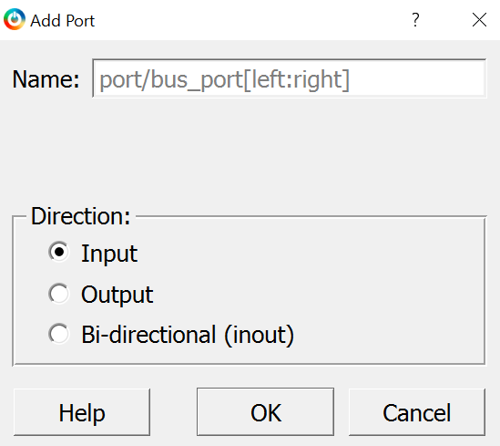
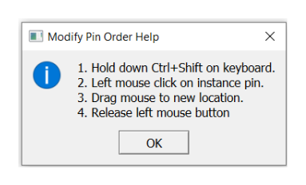
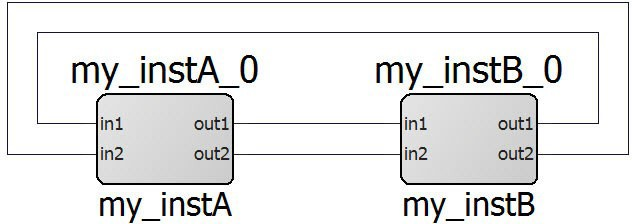
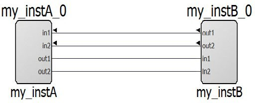
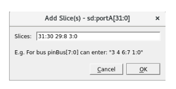
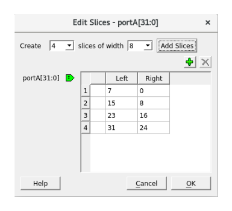
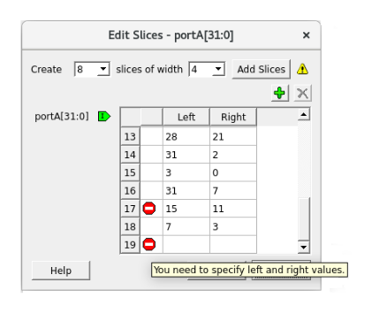
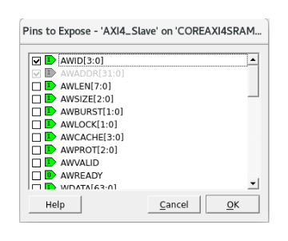

# Creating Pins and Ports for Connecting Instances in the SmartDesign

After placing the components in your SmartDesign canvas, you now need to create pins and ports to connect the various instances to complete your design.

Each pin or port has a direction and a type. Direction of the regular ports \(non-Bus Interface ports\) can be input, output, and bidirectional \(inout\).

The following is a list of types of pins or ports:

-   **Scalar**: Single unit-level signal
-   **Bus**: Array of scalar ports. The range of the bus ports are indicated by square brackets `[nFirst:nLast]`. For Example, `busName[3:0]`.
-   **Slice**: Slice is a part of a bus port. A bus slice is of any range size within the bus range. For example, `sliceName[0]`, `sliceName[2:0]`.
-   **Bus Interface \(BIF\)**: A Bus Interface is a bundle of scalar or bus ports that has functional meaning to it. BIF ports have characteristics such as functional types and roles that define how two Bus Interfaces can connect to one another. SmartDesign provides a rich set of AMBA Bus Interfaces–`AXI`, `AXI4`, `AXI4Stream`, `AHB`, `AHBLite`, and `APB3` – to help create easily AMBA sub-systems. It also provides Microchip specific Bus Interface types for easy connectivity between Microchip hardware components.

Scalar ports or pins in SmartDesign may have a PAD characteristic property. A pin or port with a  PAD property must be connected to a top-level port of the design. PAD ports eventually assign  to a package pin. In SmartDesign, these ports are automatically promoted to the top-level and  can be modified, if needed.

For better organization of the instance pins, you can create groups. Groups are displayed on an instance with a Group pin that is just a visual representation and cannot be connected. Any pin can be added or removed from the group. Groups can be collapsed to hide member pins.

## Creating Pins and Ports for your Design

After placing the components in your SmartDesign canvas, you now need to create pins and  ports to connect the various instances to complete your design.

Each pin or port has a direction and a type. Direction of the regular ports \(non-Bus  Interface ports\) can be input, output, and bidirectional \(inout\).

1.  You can create a pin or port in either of the following ways:

    -   On the menu, click **SmartDesign** &gt; **Add Port**
    -   On the SmartDesign toolbar, click **Add Port**
    **Result:** The **Add Port** dialog  appears.

    

2.  Enter an appropriate and unique name for the port in the **Name** box. You can specify a bus port by indicating the bus range directly into the name using brackets \[ \]. For example, `mybus[3:0]`.

    **Important:** If the port name violates HDL naming rules, an error message is printed in the **Log** window, and the new port is not created.

3.  Choose the pin or port type that you want to create as per the following table and then click **OK**. The chosen port type is created in the SmartDesign canvas.

    |Pin or Port Type|Representation|Purpose|
    |----------------|--------------|-------|
    |**Input**|    - Unconnected  - Connected |Input port for operating with inputs. By default, the input pins and ports  are placed on the left side of the canvas.|
    |**Output**|  - Unconnected  - Connected |  Output port for operating with outputs. By default, the output pins and ports  are placed on the right side of the canvas. |
    |**Bi-directional \(inout\)**|  - Unconnected  - Connected |Bi-directional port for operating as an input or an output pin or port. By  default, the bi-directional pins and ports are placed on the right side of the  canvas.|

**Important:** You can choose to move the ports to any location of your choice in the SmartDesign canvas.

**Tip:** To remove a port from the top-level, right-click the port, and select **Delete** from the right-click menu or select the port and press the **Delete** key.

## Modifying the Pin Order

If the outputs of one component \(instance A\) communicate with the inputs of another component  \(instance B\) and otherwise, nets may intersect with each other and the view may be cluttered.  To prevent this, the **Modify Pin Order** functionality allows you to  modify the default pin placement of the instance.

To modify the default pin placement of the instance:

1.  Right-click the component and select **Modify Pin Order** &gt; **Modify Pin Order** from the right-click menu. The **Modify Pin Order Help**  dialog box appears.

    

2.  Follow the instructions in **Modify Pin Order Help** dialog box to move the pin.

    A pin that has been moved away from default locations is identified by a bold  arrowhead. An inward-pointing arrowhead indicates an input pin and an outward-pointing  arrowhead indicates an output pin. Inout pins do not have an arrowhead when they are moved  away from the default locations \(right side of instance\).

    

    

3.  To reset the instance pin order to its default order, right-click the instance, and select **Modify Pin Order** &gt; **Reset Pin Order** from the right-click menu.

**Important:** The **Modify Pin Order** operation is unavailable when the instance is expanded in place. The modified pin order might not be preserved when an instance is expanded but retains the set order when folded.

## Performing Operations on Pins or Ports

When one or more pins or ports are selected, you can use the right-click menu to perform the  following operations on the ports and pins.

<table id="GUID-D7698C38-0C89-46D3-8B92-6D9471E6415A"><thead><tr><th>

Operation

</th><th>

Action

</th></tr></thead><tbody><tr><td>

**Connect**

</td><td>

The **Connect** command connects the selected pins and ports  with a net. If there is a net selected, it is used to make the connection. This is the  only pin or port action that takes selected nets into account. If the connection is  not possible, an error message is printed in the **Log** window. A  connection is established only if all the selected objects can be connected.

</td></tr><tr><td>

**Disconnect**

</td><td>

The **Disconnect** command disconnects all the selected  non-pad pins or ports from their attached net.

</td></tr><tr><td>

**Promote to Top-Level**

</td><td>

The **Promote to Top-Level** command is available to all  non-PAD pins. It creates a port and a net connecting the port to the pins or slices.  If a port with the same name already exists, a new unique port name is created.For  example, if a BIF \(myBIF\) pin contains a pin  \(myPort\), then the top-level myPort is named  myBIF\_myPort after the myBIF pin is promoted to  the top level.

</td></tr><tr><td>

**Go to Driver**

</td><td>

The **Go to Driver** command zooms onto the driver of the  selected pin or port. The **Go to Driver** command is not available  for output pins and input ports. The driver cannot be an inout.

</td></tr><tr><td>

**Magnify Pin**

</td><td>

Double-click a pin/port or right-click and select **Magnify Pin** to zoom into the pin/port connection. The **Magnify Pin** window shows the specified pin/port connections.If the pin has a  fanout of more than one, the number beside the + sign on the  right shows the total fanout count.Click the + sign to  see all the fanouts of the pin. You can double-click the net, pin, port, or instance  inside the Magnify window to zoom and select the  item.

</td></tr><tr><td>

**Modify/Rename**

</td><td>

The **Modify** or **Rename** command opens  a **Modify Port** dialog box. You can change the port name and the  range of the port.**Note:**

-   All slices of the bus are deleted if the range is changed.
-   When renaming BIF port, all the member ports that have BIF name prefix are renamed.

</td></tr><tr><td>

**Delete**

</td><td>

The **Delete** command deletes all the selected items that can  be deleted: slices, user created groups, group members, and ports.The  Delete command deletes all the selected items, even if the  selected items are of different types. When a group member is deleted, the member is  deleted from the group only. The actual pin is not deleted.

</td></tr><tr><td>

**Mark Unused**

</td><td>

This option is available to the output pins \(scalar, bus, and BIF\) of an  instance. The **Mark Unused** command allows you to show the output  pins that are not being used in the design and must not be flagged as a warning when  generating the design or running the DRC operation.

</td></tr><tr><td>

**Invert**

</td><td>

The **Invert** command inverts the input or output scalar pin  and port. A bubble is added to indicate inversion.

</td></tr><tr><td>

**Tie High**

</td><td>

The **Tie High** command connects the pin \(scalar and bus\) to  a logical 1. For a bus pin, this action deletes all slices. For a group, this action  is applied to all non-output member pins in the group.

</td></tr><tr><td>

**Tie Low**

</td><td>

The **Tie Low** command connects the pin \(scalar and bus\) to a  logical 0. For a bus pin, this action deletes all slices. For a group, this action is  applied to all non-output member pins in the group.

</td></tr><tr><td>

**Tie Constant**

</td><td>

The **Tie Constant** command is available only to bus pins and  slices \(except single-bit slice\). It opens the Tie to Constant dialog box for a  constant value in HEX to be entered for the bus pins and slices.

</td></tr><tr><td>

**Clear Attributes**

</td><td>

The **Clear Attributes** command clears the pin attributes  \(Tie to High, Low, Constant, Inversion, or Marked Unused\).

</td></tr><tr><td>

**Highlight**

</td><td>

The **Highlight**option opens a menu with multiple highlight  color selections. Select a color to highlight the selected items. If any items are  already highlighted, then choosing a different color highlight changes from the  previous highlight color. This option is available when a single or multiple  instances, nets, and ports are selected.If you highlight an instance, it  automatically highlights the non-highlighted pins of the instance. Click the  Unhighlight all icon \(\) in the  toolbar to remove the highlight color of all highlighted design objects, including  highlighted nets. The Highlight option is also available in  the right-click menu of the low-level instances in the Expanded Inplace  view.

</td></tr><tr><td>

**Bus and Slice** operations

</td><td>

When a bus, slice pins, or ports are selected, the right-click menu in addition  to regular pin actions have additional commands. For more information, see [Working with Bus and Slice](GUID-82D3061E-D3AC-4895-821F-64F4E22A7E41.md#).

</td></tr><tr><td>

**Add Pin to New Group** and **Add Pin to Group**

</td><td>

This menu item is available to instance pins. When a group is selected,  right-click a pin and choose **Add Pin to Group** to add the pin to  the selected group. If no group is selected, the **Add Pin to New Group** command is available and creates a new group with the default  group name, such as **Group**, **Group\_1**,  **Group\_2**, **Group\_3**, and all the selected  pins are added to the newly created group.A pin group is expanded to display the  member pins or is collapsed to hide the member pins. If a group is collapsed, pins  that are not connected to nets or have attributes \(tied low or high, tied to  constant, and marked unused\) are hidden.

</td></tr><tr><td>

**Rename \(Group\)**

</td><td>

Group pins, unlike other instance pins, can also be renamed. Right-click  **Group** and choose **Rename**. The  **Rename Group** dialog box appears. You can choose to change the  name of the group in this dialog box and click **OK** to apply the  changes.If an invalid name is entered or a pin with that name already exists,  then an error message is printed in the Log  window.

</td></tr></tbody>
</table>## Working with Bus and Slice

You can perform the following operations on a Bus or Slice using the right-click menu  options:

-   **Flip Bit Order**: This command is available only for slices. This option allows you to flip the slice range. For example, `mySlice[10:0]` is flipped to `mySlice[0:10]` of the slice. All connection or tieoff information and presentation information is retained.
-   **Create Slice**: This command opens a menu of slice options that can be created from the bus pin or ports. The custom slice\(s\) option can be used to create any slice or bit combination of your choice. For example, using a 32-bit bus with the Custom Slices option allows you to create any slice or bit combinations \(For example, a slice of 10 bits and another slice of 22 bits\). To make it convenient to create slices, common slice ranges for the selected bus are listed in the list. For example,

    -   32 slices of width 1
    -   16 slices of width 2
    -   8 slices of width 4
    -   4 slices of width 8
    -   2 slices of width 16
    

    The directions of the slices \(input or output\) are indicated by an  arrowhead and match the bus pin or port direction. On a bus port, the slices are  placed in a column behind the bus port.

    **Important:** If slices existed before, the predefined slices are created and the existing slices are deleted before creating the new ones.

-   **Custom Slices:** This command opens the **Add Slice\(s\)** dialog box for entering a list of slices.

    

    If these slices are all valid, they are added to the bus. If the slices are not valid \(For example, out-of-range slices, overlapping slices for input pins \(output ports\), or existing slices\), the error is printed in the **Log** window. The dialog box supports any separator character except colon because the colon is used to specify a range. No characters other than the colon are allowed to be adjacent to the two-range indices.

    **Tip:** Creating a **Custom Slice** does not delete any pre-existing slices.

-   **Edit Slice**: This command opens the **Edit Slices** dialog box. You can choose to delete, modify, and create a new slice, if required.

    

    Use the dialog box to change the range of the bits, add a slice, or delete  a slice. If you specify invalid range values, an error icon appears in the  **Edit Slices** dialog box. Hover your cursor over the  error icon to display the error message.

    

-   **Pins to Expose:** This command opens the **Pins to Expose** dialog box displaying all the **Bus Interface** pins that can be exposed or hidden.

    

    In the dialog box, you can check the pins in the BIF that you want to  expose and deselect the ones that you want to be hidden. Hidden BIF pins are not  visible in the SmartDesign canvas.

    **Important:** Not all pins can be exposed. If a BIF pin is already connected, none of the input pins can be exposed. If a BIF pin is not connected, every item in the menu can be exposed.

