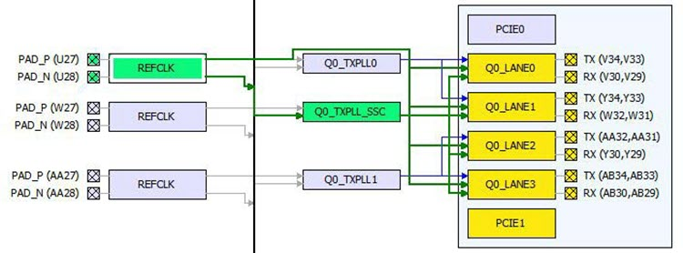
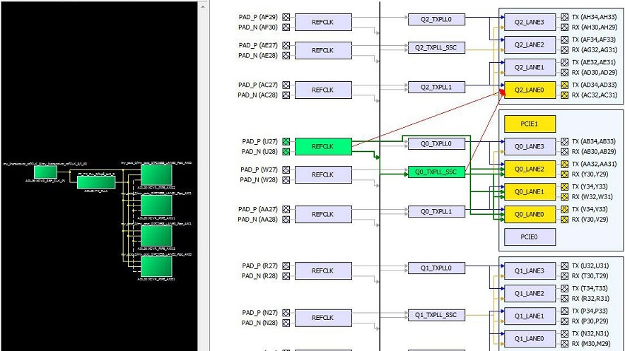
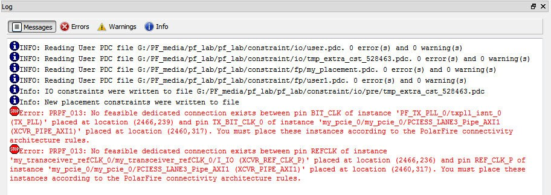

# Reference Clock \(REFCLK\) I/O Assignments

To make I/O assignments, click and drag the REFCLK pin from the Schematic View to the pin location you desire in the Graphical Placement View. If the assignment is legal \(no DRC violations\), green lines appear to denote the accepted connection between the REFCLK pin through the Q\(x\)\_TXPLL\_SSC to the Transceiver lanes.

If the I/O assignment violates the DRC rule, the assignment is not  accepted. Red arrows denotes DRC violations. The following figure shows two illegal  assignments:

-   From the Reference Clock \(REFCLK\) to the Lanes \(Red arrow from REFCLK to the Q2\_Lane0\)
-   From the Transmit PLL to the lanes \(Red arrow from TXPLL\_SSC to Q2\_Lane0\)

 

 

An error message appears in the Log window to identify the DRC rules  violated. In this case, there is no feasible dedicated connection from the REFCLK to the  Lane and from the Transmit PLL to the Lanes.

**Note:** I/O assignments can be made for REFCLK, TXPLL, and Transceiver Lanes for all Transceiver protocols except the PCIe Protocol. For the PCIe Protocol, Transceiver Lanes are assigned to predefined locations and cannot be removed.

-   **[GUID-D0B73F4D-7164-4991-83DF-AF6421563314-low.jpg](GUID-D0B73F4D-7164-4991-83DF-AF6421563314-low.jpg)**  

**Parent topic:**[XCVR View](GUID-7C12202D-E802-4F24-9D43-D82DA41A819B.md)

