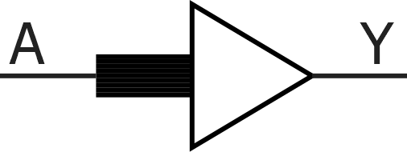
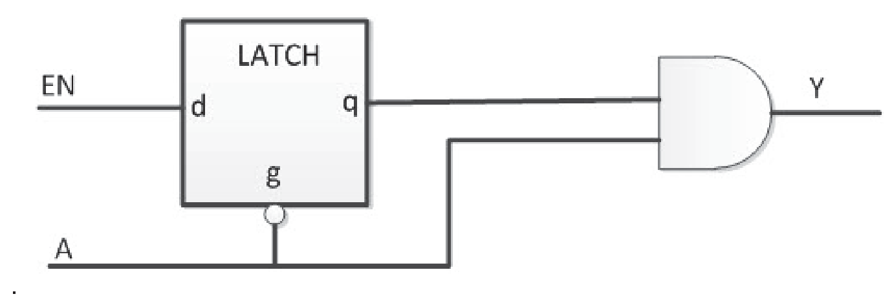

# Clocking

## CLKBIBUF

Bidirectional Buffer with Input to the global network.

 

 

|Input|Output|
|-----|------|
|D, E, PAD|PAD, Y|

|D|E|PAD|Y|
|---|---|---|---|
|X|0|Z|X|
|X|0|0|0|
|X|0|1|1|
|0|1|0|0|
|1|1|1|1|

## CLKBUF

Input Buffer to the global network.

 

 

|Input|Output|
|-----|------|
|PAD|Y|

|PAD|Y|
|---|---|
|0|0|
|1|1|

## CLKBUF\_DIFF

Differential I/O macro to the global network, Differential I/O.

|Input|Output|
|-----|------|
|PADP, PADN|Y|

|PADP|PADN|Y|
|----|----|---|
|Z|Z|Y|
|0|0|X|
|1|1|X|
|0|1|0|
|1|0|1|

## CLKINT

This macro routes an internal fabric signal to the global network.

|Input|Output|
|-----|------|
|A|Y|

|A|Y|
|---|---|
|0|0|
|1|1|

## CLKINT\_PRESERVE

This Macro routes an internal fabric signal to the global network. It has  the same functionality as CLKINT except that this clock always stays on the global clock  network and will not be demoted during design implementation.

|Input|Output|
|-----|------|
|A|Y|

|A|Y|
|---|---|
|0|0|
|1|1|

## GCLKBUF

Gated input I/O macro to the global network. The Enable signal can turn off the global network to save power.

|Input|Output|
|-----|------|
|PAD, EN|Y|

|PAD|EN|q|Y|
|---|---|---|---|
|0|0|0|0|
|0|1|1|0|
|1|X|q|q|
|Z|X|X|X|

## GCLKBUF\_DIFF

Gated differential I/O macro to global network; the Enable signal can be  used to turn off the global network.

 

 

Differential

|Input|Output|
|-----|------|
|PADP, PADN, EN|Y|

|PADP|PADN|EN|q|Y|
|----|----|---|---|---|
|0|1|0|0|0|
|0|1|1|1|0|
|1|0|X|q|q|
|0|0|X|X|X|
|1|1|X|X|X|
|Z|Z|X|X|X|

## GCLKINT

Gated macro used to route an internal fabric signal to the global network.  The Enable signal can be used to turn off the global network to save power.

 

 

|Input|Output|
|-----|------|
|A, EN|Y|

|A|EN|q \(Internal Signal\)|Y|
|---|---|---------------------|---|
|0|0|0|0|
|0|1|1|0|
|1|X|q|q|

## RCLKINT

Macro used to route an internal fabric signal to a row global buffer, thus  creating a local clock.

|Input|Output|
|-----|------|
|A|Y|

|A|Y|
|---|---|
|0|0|
|1|1|

## RGCLKINT

Gated macro used to route an internal fabric signal to a row global  buffer, thus creating a local clock. The Enable signal can be used to turn off the local  clock to save power.

 

 

|Input|Output|
|-----|------|
|A, EN|Y|

|A|EN|q \(Internal Signal\)|Y|
|---|---|---------------------|---|
|0|0|0|0|
|0|1|1|0|
|1|X|q|q|

