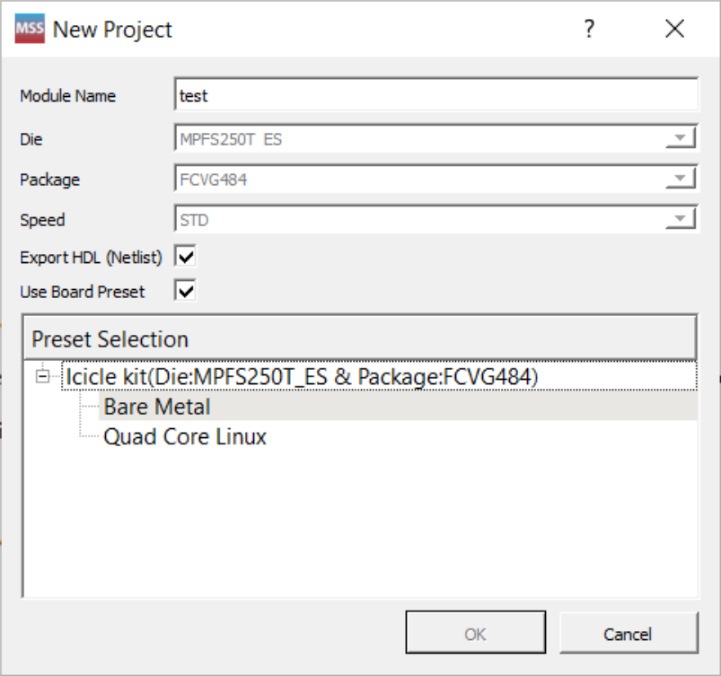
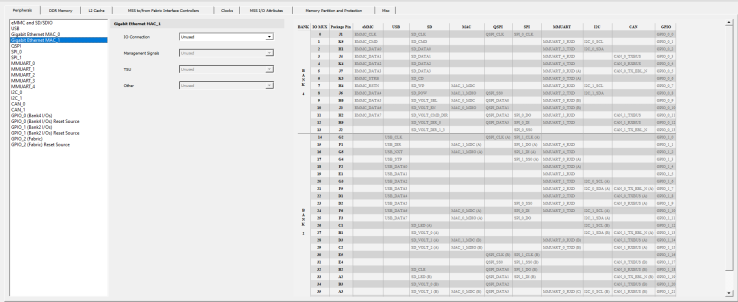

# Creating a Project and Configuring MSS

To create a project and configure MSS:

1.  Launch the PolarFire SoC MSS Configurator \(`pfsoc_mss`\) using one of the following ways:
    -   Libero SoC installation directory
    -   Standalone MSS installation area
    -   Windows Start menu
2.  Create a new project using **Project &gt; New**.
3.  Enter a module name \(for example, `PFSOC_MSS_C0`\), and then select the appropriate die, package, and speed. The module name you enter appears in the following places:

    -   File names of the PolarFire SoC MSS Configurator generated outputs at the specified output/generation directory
    -   MSS component file \(`<module_name>.cxz`\)
    -   MSS XML configuration file \(`<module_name>_mss_cfg.xml`\)
    -   MSS configuration file corresponding to the current MSS configuration that is generated \(`<module_name>.cfg`\)
    -   MSS configuration report file \(`<module_name>_Report.html`\)
    -   Component/module name of the MSS component \(`cxz`\) that can be imported to a Libero SoC project
    

    **Presets for Icicle Kit**

    When you create a New  Project, you can import one of the available presets for Icicle kit. These  presets are staged in data folder and are in ‘CFG’ format. All the  parameter/values from the CFG file are loaded, except for the following four  parameters:

    -   Module Name
    -   Die
    -   Package
    -   Speed
    User-selected values are used for Module Name, Die, Package, and  Speed parameters in the GUI. This is done to facilitate changing Module  Name/Die/Package/Speed \(from the Icicle kit preset\) to meet users  need.

    The default speed grade is STD including for the Icicle Kits. If you  open a previous release `.cfg`, which does not have speed grade  \(PolarFire SoC MSS Configurator v2021.2 or earlier\) in v2021.3, it has STD as  the default speed grade.

    The list of presets are shown using a tree  widget. By default, the ‘Default Configuration’ preset is selected in GUI and  user must explicitly select one of the presets for Icicle kit to load them. Once  a preset is selected, users cannot edit them using **Edit Settings** option as the preset tree widget is unavailable in the  **Edit Settings** dialog box.

    The following figure  shows the MSS configurator tabs.

    

4.  Configure **Clocks**, **Fabric Interface Controllers**, **I/O Configuration**, **DDR Memory**, and **Misc settings**.
5.  Click the **Save** option to save the MSS configuration to a `.cfg` file.
6.  From the **Save MSS Configuration** dialog box:
    -   Browse to a directory and create a folder. For example, create `C:\Microsemi\PFSOC_MSS_Configuration`.
    -   Enter a file name \(for example, `PFSOC_MSS_C0)` and click **Save**.

        **Note:** The file name you enter is for the stand-alone MSS project only and is not used as the component name.

The MSS Configuration is created and saved to the file specified and the Log window shows the following message: `INFO: Successfully saved MSS configuration in C:/Microsemi/PFSOC_MSS_Configuration/PFSOC_MSS_C0.cfg file`.

