# SmartPower Interface

The following sections describe the SmartPower tabs, toolbars, and menu commands.

## Summary Tab

The **Summary**tab is organized into the following sections:

-   **Power Consumption**
-   **Breakdown**
-   **Annotation Coverage**
-   **Operating Conditions**
-   **Battery**

<br />

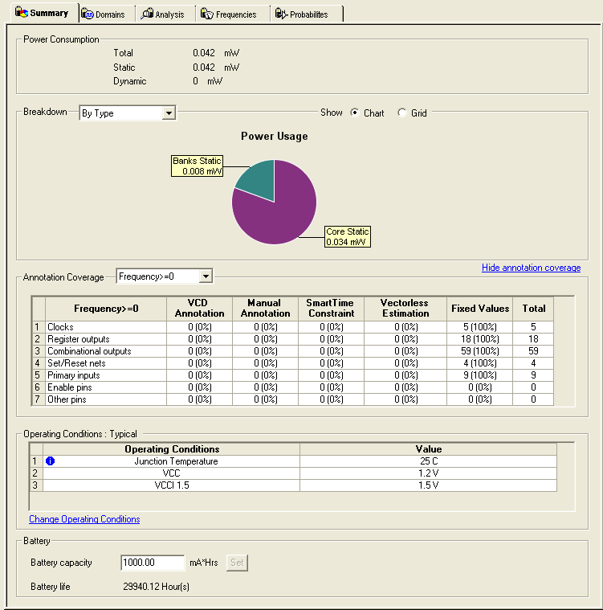

<br />

### Power Consumption

Displays the total power consumption and the static and dynamic power of the design. The<br /> information displayed is accurate after you enter your target clock and data<br /> frequencies.

### Breakdown

Displays a breakdown of power consumption in the design. A drop-down list allows you to view the<br /> power breakdown by type of component, voltage rail, or clock<br /> domain.

#### Show

Displays power usage as a chart or as a grid.

When you select **By Type**from the drop-down list, the **Summary**tab displays a breakdown of the design's power usage by the following types:

-   Net
-   Gate
-   I/O
-   Memory
-   Core Static
-   Banks Static
-   Analog \(for Fusion Designs\)

Any static power used by instances of a component in a design will be included in the appropriate<br /> category. As a result, the sum of the power in breakdown by type will be<br /> equal to the total static and dynamic power consumption of the design.<br /> Percentages displayed are fractions of the total power. Global nets are<br /> included in the net power types. To obtain the power of a clock, select<br /> breakdown by clock domain.

When you select **By Rail**from the drop-down list, the **Summary** tab displays a<br /> breakdown of the power usage by the rail that the power is drawn from and a<br /> breakdown for the current usage. The power, voltage, and current drawn for<br /> each rail are displayed.

When you select **By Clock Domain**from the drop-down list, the **Summary** tab displays a<br /> breakdown of the power usage by the clock domain that the<br /> power is drawn from. For each clock domain, the power and<br /> percentage of power drawn are displayed. Dynamic power is<br /> accounted for in breakdown by clock, but static power is<br /> not associated with any clock.

**By Mode**is available only when a [scenario](GUID-99428940-29C0-4D02-B947-C6ACA4AD2649.md#) is selected. When you select<br /> **By Mode** in the Modes and Scenarios<br /> toolbar, the **Summary** tab shows power<br /> consumption, duration, and power duration weight<br /> by mode.

After you select **By Type**, **By Rail**, **By Mode**, or **By Clock Domain**, you<br /> can customize the columns in the grid by right-clicking the column headers.<br /> To exclude a column, remove its check mark from the right-click menu.<br /> Right-click a column header to set the column default size for the selected<br /> column or for all columns, and then sort the values in ascending order,<br /> descending order, or customize the columns.

To sort the contents of a column, double-click a column header.

To export the contents of the grid to a file, from the **File**menu, choose **Export Grid**or click its associated toolbar button.

To print the grid, from the **File**menu, choose **Print Grid**or click its associated toolbar button. To copy the grid, from the **Edit**menu, choose **Copy Grid**or click its toolbar button.

To copy the chart, click the contents of the chart, and from the right-click menu, choose **Copy Chart to Clipboard**.

To export the chart, click the contents of the chart, and from the right-click menu, choose **Export Chart to File**.

To rotate the chart by 90 degrees, click the contents of the chart, and from the right-click menu, choose **Rotate Chart Clockwise**or **Rotate Chart Counter-Clockwise**.

### Annotation Coverage

Displays the number and percentage of pins annotated by each source \(VCD, manual annotation,<br /> SmartTime constraint, vectorless estimation, and fixed values\) for all clocks, register<br /> outputs, combinational outputs, set/reset nets, primary inputs, enable pins, and other<br /> pins.

-   **Hide annotation coverage** link: hides the annotation coverage.
-   **Show annotation coverage** link: shows the annotation coverage.
-   **Annotation Coverage Summary**drop-down menu: shows probability or frequency annotation statistics \(frequency=0 shows statistics for pins that have a frequency of 0\).
-   **VCD**: shows the number/percentage of pins with frequencies/probabilities imported from a VCD file.
-   **Manual annotation**: shows the percentage of pins with manually annotated frequencies/probabilities.
-   **SmartTime constraint**: shows the percentage of pins initialized with SmartTime.
-   **Fixed values**: shows the percentage of pins with default frequency/probability.
-   **Vectorless estimation**: shows the percentage of pins that have been annotated with vectorless estimation.

### Operating Conditions

The **Operating Conditions** group displays the temperature<br /> and voltage operating conditions for the selected mode or scenario specified<br /> in [Operating Conditions Dialog](GUID-99428940-29C0-4D02-B947-C6ACA4AD2649.md#).<br /> When you select a scenario, the temperature and voltage operating conditions<br /> for each mode in the scenario are displayed.

To change the operating conditions, click the **Change Operating Conditions** link or click **Tools**<br /> from the menu,and choose **Operating Conditions**.

The VPP voltage operating range is available only for SmartFusion 2, IGLOO 2, and<br /> RTG4 device families. You can choose to change the voltage operating range<br /> for the VPP at any point from 2.5V to 3.3V or 3.3V to 2.5V.

After you change the voltage operating range, you must restart the SmartPower<br /> tool to reflect the changed voltage operating range.

To change the voltage operating range for VPP, perform the following steps:

1.  In the **Design Flow** window, under the **Verify Post Layout Implementation** group, right-click **Verify Power** and choose **Configure Options**. The **Verify Power Configuration** dialog appears.
2.  Choose the required voltage operating range and click **OK**. The selected voltage operating range is set as the current range.

**Important:** You must restart the SmartPower tool to apply the new voltage operating range.

#### Battery

Allows you to set the battery capacity in mA/hr and reports the battery life.

## Domains Tab

The **Domains**tab lists existing domains along with their corresponding clock and data<br /> frequencies and probability data for clock domains and sets of pins. In this tab, you<br /> can add, edit, or remove domains or sets of pins, and change the clock and/or data<br /> frequency for a selected domain.

When you start SmartPower for the first time, it automatically initializes frequencies from<br /> SmartTime with a default data toggle rate of 10%. However, if you update your timing<br /> constraints in SmartTime, you can use the [Initialize Frequencies and Probabilities](GUID-99428940-29C0-4D02-B947-C6ACA4AD2649.md#) dialog box to update SmartPower with new<br /> frequencies from SmartTime. If you do not have timing constraints in SmartTime, you can<br /> initialize clock and data frequencies manually by directly editing the **Domains**<br /> tab grid or using the Initialize Frequencies and Probabilities dialog box.

If you import a VCD file, the **Domains** tab shows the average clock and data frequencies for<br /> each clock domain and input set. This average is calculated using VCD information.

**Note:** If you change a clock or data frequency in the **Domains** tab, it impacts only nets that use the default estimation source. Nets use the default estimation source when they have not been manually set to a specific frequency in the **Frequencies** tab, and when they have not been set by importing a VCD file. To see explicitly the list of nets using the default estimation source, refer to the [Frequencies tab](GUID-99428940-29C0-4D02-B947-C6ACA4AD2649.md#).

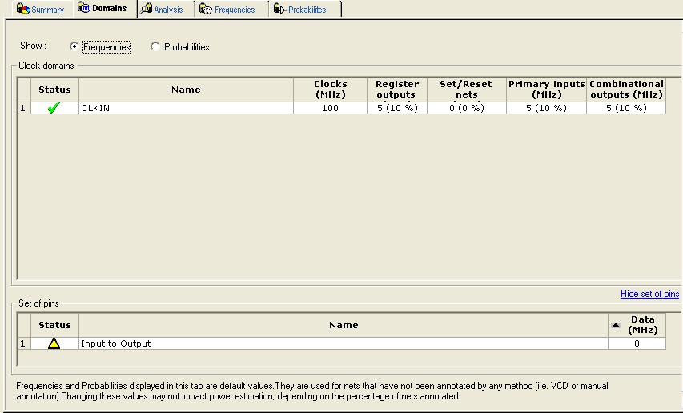

**Note:** Data and clock frequencies are set to zero automatically when in non-active modes.

To hide or display the grid for set of pins, click the **Hide/Show set of pins link**. You can<br /> edit frequency or probability data directly from the grid.

To create a new clock domain or set of pins:

1.  Right-click the clock domain or set of pins and choose **create new clock domain**or **create new set of pins**.
2.  Enter a name and click **OK**. The new clock domain or set of pins appears in the **Domains** tab.
3.  Modify the frequency and probability data as needed.

To initialize, clock domain frequencies, right-click the clock domain name and select<br /> **Initialize Frequencies and Probabilities**. If there is no frequency constraint<br /> set for the clock domain in SmartTime, the clock frequency of the domain is not<br /> changed.

The status of a clock frequency or probability is displayed in the first column by an icon. Mouse<br /> over the icon to identify the status \(see the following table\).

|Icon|Description|
|----|-----------|
||This clock has not been initialized.|
||No constraints available for this clock from SmartTime.|
||Average frequencies/probabilities imported from VCD.|
||Clock constraints imported from SmartTime.|
||This clock has been initialized manually.|

**Note:** The frequency and probability distribution feature is available only in active operating mode or when in a mode based on the Active mode.

An icon in the first column shows the status of a set of pins. Mouse over the icon to identify<br /> the status \(see the following table\).

|Icon|Description|
|----|-----------|
||This set has not been initialized.|
||Average frequencies/probabilities imported from VCD.|
||This set has been manually initialized|

**Note:** The frequency and probability distribution feature is available only in active operating mode or when in a mode based on the Active mode.

To remove one or multiple clock domains, select the clock domain\(s\) and click **Remove Selected Domains\(s\)**.

To edit a clock domain or a set of pins:

1.  Select the clock domain and from the right-click menu, and choose **Edit Domain**. The Clock Domain or Set-of- Pins window appears.

    <br />

    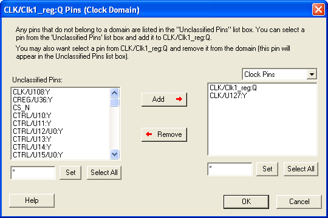

    <br />

    Any pins that do not belong to a domain appear under **Unclassified Pins**. You can select a pin from this list and add it to the current domain.<br /> You can also select a pin from the current domain and remove it from the domain<br /> \(this pin will appear under **Unclassified Pins**\).

    **Clock Pins and Data Pins:**Select **Clock Pins**from the pull-down list to display<br /> all clock pins for the selected domain, or select **Data Pins**to display<br /> registers, asynchronous signals, primary input, and combinational signals for<br /> the selected domain.

    Use the **filter**boxes to narrow your search for<br /> a specific pin. The boxes are text filters; \* is a wildcard.

2.  Click **OK**.

To delete a clock domain or a set-of-pins, select the clock domain or set-of-pins and choose<br /> **Remove Domain** from the right-click menu.

## Analysis Tab

The **Analysis**tab allows you to inspect detailed hierarchical reports of the power<br /> consumption. The **Analysis** tab consists of two windows:

-   Hierarchy of Instances window
-   Analysis window

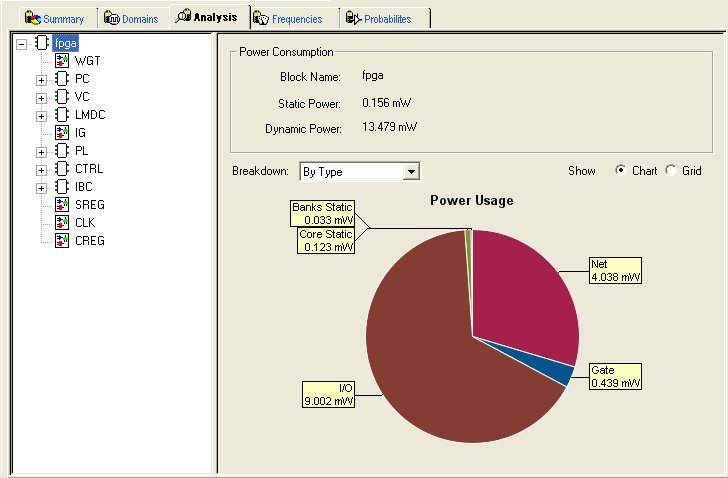

### Hierarchy of Instances Window

SmartPower lists the hierarchy of instances in the Hierarchy of Instances window. Clicking the<br /> plus sign \(+\) next to a block expands the block to show its<br /> sub-blocks. Only hierarchical blocks are displayed in this list<br /> \(no gates or nets\).

When you select a block of the hierarchical tree, SmartPower displays its name and power<br /> consumption in the Analysis window.

### Analysis Window

The Analysis window is organized into two sections:

-   **Power Consumption**
-   **Breakdown**

#### Power Consumption

Displays the name of the currently selected block from the hierarchy of instances window, as well as the static and dynamic power consumption of the selected block.

#### Breakdown

Displays a breakdown of power usage of the currently selected block. Use the drop-down<br /> list to view the power breakdown by type of component \(instance, or clock domain\).

When you select **By Type**from the drop-down list, the **Analysis** tab shows a<br /> breakdown of the selected block's power usage by the following types:

-   Net
-   Gate
-   I/O
-   Memory
-   Core Static
-   Banks Static
-   Analog

Any static power used by instances of a component in a design are included in the<br /> appropriate category.

The sum of the power in breakdown by type equals the total static and dynamic power<br /> consumption of the design. Percentages displayed are fractions of the total power.<br /> Global nets are included in the net power types. To obtain the power of a clock, select<br /> breakdown by clock domain.

When you select **By Clock Domain**from the drop-down list, the **Analysis** tab<br /> shows a breakdown of the power usage by the clock domain that the power is drawn from.<br /> For each clock domain, the power and percentage of power drawn are displayed. Dynamic<br /> power is accounted for in breakdown by clock, but static power is not associated by any<br /> clock.

When you select **By Type**, **By Instance**or **By Clock Domain**, you can<br /> customize which columns are displayed in the grid by right-clicking the column headers.<br /> To exclude a column, remove its check mark from the right-click menu. Right-click a<br /> column header to set the column default size for the selected column or for all columns,<br /> and then sort the values in ascending order, descending order, or customize the<br /> columns.

To sort the contents of a column, double-click a column header.

To export the contents of the grid to a file, choose **Export Grid** from the<br /> **File** menu, or click its associated toolbar button.

To print the grid, choose **Print Grid** from the **File** menu, or click its<br /> associated toolbar button. To copy the grid, choose **Copy Grid** from the **Edit**menu or click its toolbar button.

To copy the chart, right-click the contents of the chart and choose **Copy Chart to Clipboard**.

To export the chart, right-click the contents of the chart and choose **Export Chart to File**.

To rotate the chart by 90 degrees, click the contents of the chart and choose **Rotate Chart Clockwise**or right-click **Rotate Chart Counter-Clockwise**.

To view an instance’s properties, right-click any instance and choose **Instance Properties**. The Instance Properties window appears, with the instance name, type<br /> and power and other properties specific to each type of instance \(see the following<br /> figure\).


The Instance Properties window allows you to access a list of pins of a gate, and check<br /> their domain and frequency.

For more information, see:

-   [Analyzing Results](GUID-BA00AD86-BE87-4C16-8451-BB899140C635.md#)
-   [Advanced Analysis of I/Os](GUID-BA00AD86-BE87-4C16-8451-BB899140C635.md#)

##### Show

Displays power usage as a chart or grid.

**Note:** The power usage chart is not available when **breakdown by instance** is selected.

## Frequencies Tab

Use the **Frequencies**tab to attach switching frequency attributes to the interconnects of<br /> the design.

The **Frequencies**tab is organized into the following areas:

-   **Switching Frequencies**
-   **Average Frequencies**
-   **Annotation Statistics**

<br />

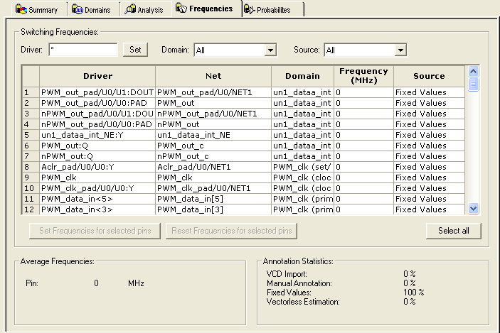

<br />

### Switching Frequencies

Displays the pins and lists the net, domain, frequency, and frequency source for each pin.

The **Driver**box allows you to filter the list of pins based on the criteria entered. Enter<br /> text in the filter box and click **Set**to apply this text as a filter. Use the **\***character to display all pins or as a wildcard.

Use the **Domain**drop-down list to select a different domain \(All, CLKIN, Default, or Input to Output\).

Use the **Source**drop-down list to select a different source \(All, Default, Manual Annotation, or VCD Import\).

To change the frequency, enter a new value in the **Frequency**column, or select multiple<br /> pins, click the **Set frequencies for selected pins**button, and enter a new<br /> frequency. Use **Reset frequencies for selected pins**to revert to the default<br /> frequency.

To select all the pins, click **Select All**.

### Average Frequencies

Displays the average frequency of all pins displayed in the grid.

Average frequencies are useful when you import a VCD file. Because these files allow you to<br /> specify the frequency of each pin individually, it is useful to know the average clock<br /> pin or data pin frequency for a particular clock domain.

If you did not specify a frequency annotation for any clock pin in this clock domain, the average<br /> value is equal to the default clock frequency of the clock<br /> domain. If you set one or several clock pins, SmartPower takes<br /> those annotations to compute an average value.

If you did not specify a frequency annotation for any data pin in this clock domain, the average<br /> value is equal to the default data frequency of the clock domain. If you set one or<br /> several data pins, SmartPower considers these annotations into account to compute an<br /> average value.

### Annotation Statistics

**VCD import**: displays the percentage of pins with frequencies imported from the \*.vcd<br /> file.

<br /> **Manual annotation**: displays the percentage of pins with manually-annotated<br /> frequencies.

**Fixed values**: displays the percentage of pins with default frequency.

## Probabilities Tab

The **Probabilities** tab displays the drivers, nets, types, polarity, rates, and<br /> source for each pin. Use the **Probabilities**tab to control the probabilities for<br /> all pins.

-   **Bidirectional and Tristate I/Os**: controls the output probability of each tristate and bidirectional I/O. The probability is the percentage of time that the I/O is used as an output. You can change the default value and set a specific value for each bidirectional or tristate I/O.
-   **Memories**: controls the read cycle probability or the write cycle<br /> probability of a memory block. The probability is the percentage of time<br /> that a memory block will be used in a read cycle or a write cycle. You can<br /> change the default value and set a specific value for each enable pin of<br /> each memory block available in the design. If an enable pin is active low,<br /> assign it a probability of 0% to completely enable the I/O or the memory<br /> block, or 100% to disable it completely.


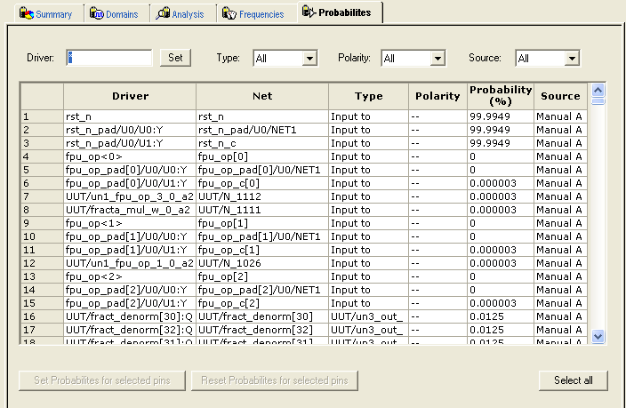

In designs with a cascaded memory, all memory enable pins are shown in the **Probabilities**<br /> tab. To simulate real-world power consumption, selectively enable only some memory<br /> enable pins, as specified in the memory cascading structure.

-   For purely vertical cascading, enable the pins that belong to one RAM block.
-   For purely horizontal cascading, enable all pins belonging to all RAM blocks of the cascaded memory.

To find which RAM block corresponds to which pin, cross-probe with the MVN<br /> NetlistViewer.

The **Driver**box allows you to filter the list of drivers based on the criteria entered.<br /> Enter text in the filter box, and click **Set**to apply this text as a filter. Use<br /> the **\***character as a wildcard.

Use the **Type**drop-down list to filter the pin list by different type \(All, All enable, CLKIN, Default, or Input to Output\).

Use the **Polarity**drop-down list to filter the pin list by polarity \(Low, High, or All\).

Use the **Source**drop-down list to filter the pin list by source \(All, Default Estimation, Manual Annotation, SDC, VCD Import\).

To change the rate, enter a new value in the **Rate**column, or select multiple pins, click<br /> the **Set Probabilities for selected pins**button, and enter a new frequency in the<br /> Set Default Probabilities dialog box.

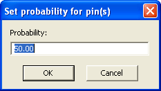

Use **Reset Probabilities for selected pins**to revert to the default polarity. You can<br /> change the default probability from the **Domains** tab.

To select all the drivers, click **Select All**.

You can set or reset the probabilities, set a default probability, copy, export, or print the grid by selecting one or multiple pins and choosing an option from the right-click menu.

For more information, see [Specifying Individual Pin Probabilities](GUID-BA00AD86-BE87-4C16-8451-BB899140C635.md#).

## Preferences Toolbar

The SmartPower Preferences toolbar appears on the right side of the row below the menus.<br /> It provides quick access to commonly used settings. Mouse over the toolbar button to<br /> view a description of the command. Use the drop-down list to select your settings.

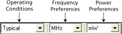

<br />

-   **Operating Conditions**: allows you to set the operating conditions: Best, Typical, or Worst. The actual voltage and temperature of a given operating condition is defined by the operating condition range selected for the current design \(COM, IND, MIL, Auto, TGrade1, TGrade2, and Custom\). For SmartPower, unlike SmartTime, the worst voltage is the upper bound of the range. That is, higher \(worst-case\) power comes from higher voltage, while higher voltage results in best-case speed.

    **Note:** Worst-case and best-case calculations are available only for certain families and devices.


<br />

-   **Frequency Preferences**: sets unit preferences for frequency: Hz, KHz, MHz.
-   **Power Preferences**: sets unit preferences for power: W, mW, or uW.

<br />

## Modes and Scenarios Toolbar

The Modes and Scenarios toolbar appears as the left pane in the SmartPower interface. It<br /> displays all predefined modes, custom modes, predefined scenarios, and custom scenarios.

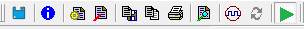

The Modes and Scenarios toolbar is shown by default, but can be closed or undocked. To<br /> view the toolbar, choose **Modes and Scenarios toolbar** from the **View**menu.

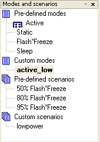

From this toolbar, you can:

-   Select a predefined mode by clicking the mode name.
-   Select a [custom mode](GUID-99428940-29C0-4D02-B947-C6ACA4AD2649.md#) by clicking the mode name.
-   Select a custom mode for power-driven layout by right-clicking the active-based mode and selecting **Use for PDPR**.
-   Re-import a VCD file from an Active mode or a custom mode by right-clicking the VCD file and selecting **Re- import VCD File**.
-   Remove a VCD file from an Active mode or a custom mode by right-clicking the VCD file and selecting **Remove VCD File from &lt;mode name&gt; Mode** or by choosing **Remove VCD File &lt;file name&gt;** from the **Simulation**menu.
-   Generate an Activity and Hazards Power report by right-clicking the VCD file and selecting **Activity and Hazards Power Report**
-   Create a new custom mode by clicking **Custom modes**and selecting **New Custom Mode**, or by clicking the **New Custom Mode**hyperlink.
-   Edit and delete a custom mode by right-clicking the mode name and selecting **Edit custom mode** or **Delete custom mode**.
-   Copy a custom or predefined mode by right-clicking the mode name and selecting **Create a copy of this mode**.
-   Select a [scenario](GUID-99428940-29C0-4D02-B947-C6ACA4AD2649.md#) by clicking the scenario name.
-   Create a new custom scenario by clicking **Scenarios**and selecting **New custom scenario**.
-   Edit and delete a custom scenario by right-clicking the scenario name and selecting **Edit custom scenario**.
-   Copy a scenario by right-clicking the scenario name and selecting **Create a copy of this scenario**.

    **Note:** When a scenario is selected, only the **Summary** tab is available.


## SmartPower Standard Toolbar and Menu Commands

The SmartPower standard toolbar contains commands for performing common SmartPower<br /> operations on your designs. Roll the mouse pointer over the toolbar button to view a<br /> description of the button. Click the button to access the command.


|Toolbar Button|Description|
|--------------|-----------|
|<br /> 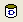<br />|<br /> [Commit](GUID-99428940-29C0-4D02-B947-C6ACA4AD2649.md#)<br />|
|<br /> <br />|<br /> [Settings Summary](GUID-99428940-29C0-4D02-B947-C6ACA4AD2649.md#)<br />|
|<br /> 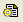<br />|<br /> [Operating Conditions](GUID-99428940-29C0-4D02-B947-C6ACA4AD2649.md#)|
|<br /> <br />|<br /> [Options](GUID-99428940-29C0-4D02-B947-C6ACA4AD2649.md#)|
|<br /> |<br /> [Export Path Grid](GUID-99428940-29C0-4D02-B947-C6ACA4AD2649.md#)|
|<br /> <br />|<br /> [Copy Path Grid](GUID-99428940-29C0-4D02-B947-C6ACA4AD2649.md#)|
|<br /> 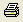<br />|<br /> [Print Grid](GUID-99428940-29C0-4D02-B947-C6ACA4AD2649.md#)|
|<br /> <br />|[Generate Power Report](GUID-99428940-29C0-4D02-B947-C6ACA4AD2649.md#)|
|<br />|[Initialize Frequencies and Probabilities](GUID-99428940-29C0-4D02-B947-C6ACA4AD2649.md#)|
|<br />|[Refresh vectorless estimation](GUID-BA00AD86-BE87-4C16-8451-BB899140C635.md#)|
||[Freeze/Unfreeze Calculations](GUID-99428940-29C0-4D02-B947-C6ACA4AD2649.md#)|

The PC and UNIX workstation versions of SmartPower have the same menus. However, some<br /> dialog boxes, field locations and names, and buttons may look slightly different on the<br /> two platforms due to the different window environments.

## File Menu

|Menu|Description|
|----|-----------|
|Commit|Commits power information. You must commit your changes if you wish to save your settings in<br /> SmartPower. If you commit your changes, the information is stored in the<br /> .adb file, and your settings are restored the next time you open your<br /> design in SmartPower.|
|Export Grid|Exports the selected area of the Report window to a text \(.txt\) file.|
|Print Grid|Prints the selected area of the Report window.|
|Settings Summary|Displays a summary of the power settings for the current design.|
|Close|Closes SmartPower.|

## Edit Menu

|Menu|Sub-Menu|Description|
|----|--------|-----------|
|Domains|New Clock Domain|Adds a clock domain.|
|New Set of Pins|Adds a set of pins.|
|Delete Domain|Deletes a clock domain.|
|Edit Domain|Edits a clock domain.|
|Modes and Scenarios|Use for Analysis &gt; *mode or scenario name*|Sets the selected mode or scenario to be used for analysis.|
|Use for PDPR &gt; *mode or scenario name*|Sets the selected mode or scenario to be used for a power-driven layout.|
|Custom Modes &gt; New Custom Mode|Creates a new custom mode.|
|Custom Modes &gt; Edit Custom Mode|Edits a custom mode.|
|Custom Modes &gt; Delete Custom Mode|Deletes a custom mode.|
|Custom Scenarios &gt; New Scenario|Creates a new custom scenario.|
|Custom Scenarios &gt; Edit Scenario|Edits a custom scenario.|
|Custom Scenarios &gt; Delete Scenario|Deletes a custom scenario.|
|Copy Grid|—|Copies the selected cells of the dynamic grid onto the Clipboard.|

## View Menu

|Menu|Description|
|----|-----------|
|Standard Toolbar|Displays or hides the Standard toolbar.|
|Preferences Toolbar|Displays or hides the [Preferences toolbar](GUID-99428940-29C0-4D02-B947-C6ACA4AD2649.md#).|
|Modes and Scenarios Toolbar|Displays or hides the [Modes and Scenarios toolbar](GUID-99428940-29C0-4D02-B947-C6ACA4AD2649.md#).|
|Unprocessed Simulation Files Toolbar|Displays or hides the Unprocessed Simulation Files toolbar.|
|Customize Columns|Selects and orders the columns displayed in the user<br /> interface.|
|Reset Window Layout|Resets the window layout to the default layout.|

## Tools Menu

|Menu|Sub-Menu|Description|
|----|--------|-----------|
|Initialize Frequencies and Probabilities|—|Imports clock constraints from SmartTime, and allows you<br /> to enter frequencies and probabilities for the design, as shown in the<br /> [Initializing Frequencies and Probabilities](GUID-99428940-29C0-4D02-B947-C6ACA4AD2649.md#) section.|
|Operating Conditions|—|Allows you to customize the [operating conditions](GUID-99428940-29C0-4D02-B947-C6ACA4AD2649.md#) used in SmartPower.|
|Options|—|Displays the [Options](GUID-99428940-29C0-4D02-B947-C6ACA4AD2649.md#) dialog box, where you can set analysis and display preferences.|
|Reports|Power Report|Generates a [power report](GUID-99428940-29C0-4D02-B947-C6ACA4AD2649.md#).|
|Scenario Power Report|Generates a [scenario power report](GUID-99428940-29C0-4D02-B947-C6ACA4AD2649.md#).|
|Activity and Hazards Power Report|Generates an [activity and hazards power report](GUID-99428940-29C0-4D02-B947-C6ACA4AD2649.md#).|
|Export Report for MPE|—|Exports a report for Microchip Power Estimator \(MPE\).|
|Freeze/Unfreeze Calculations|—|Freezes or unfreezes the<br /> computations that happen to avoid the SmartPower tool<br /> from slowing down|

## Simulation Menu

|Menu|Description|
|----|-----------|
|Import VCD File|Displays the Import VCD Options dialog box.|
|Remove VCD file|Removes the selected VCD file from the design.|
|Audit files|Audits simulation files within the project.|

## Help Menu

|Menu|Description|
|----|-----------|
|Help on *current tab*|Displays the help content for the current tab.|
|Help Topics|Opens the help files for SmartPower.|
|SmartPower User's Guide|Displays the SmartPower User's Guide.|
|Data Change History|Displays the [data change history report](GUID-BA00AD86-BE87-4C16-8451-BB899140C635.md#).|

For more information, see the [SmartPower Preferences Toolbar](GUID-99428940-29C0-4D02-B947-C6ACA4AD2649.md#).

## Power-Settings Summary

The Power-Settings Summary dialog box summarizes the power settings for the current design. To<br /> open the dialog box, choose **Settings Summary** from the **File** menu or click<br /> the  icon in the SmartPower toolbar.


The Power-Settings Summary dialog box shows the following information.

|Attribute|Description|
|---------|-----------|
|Data Source|Displays the data source.|
|Design|Displays the name of the design.|
|Family|Displays the device family used in the design.|
|Die|Displays the die.|
|Package|Displays the package.|
|Temperature Range|Displays the temperature range.|
|Voltage Range|Displays the core supply voltage.|
|Operating Condition|Displays the operating conditions that SmartPower uses to<br /> calculate static and dynamic power contributions.|
|Operating Mode|Displays the operating mode that SmartPower uses to calculate<br /> static and dynamic power contributions.|

**Note:** The status bar also shows the ambient temperature, VCCA, and speed grade.

## Initializing Frequencies and Probabilities

The Initialize Frequencies and Probabilities dialog box allows you to initialize the frequencies<br /> and probabilities for your design.

To open the Initialize Frequencies and Probabilities dialog box, choose **Initialize Frequencies and Probabilities** from the **Tools**menu, or click the  icon in the SmartPower toolbar.

**Note:** This feature is available only in the Active operating mode or in modes derived from the Active mode.

The dialog box is organized into the following panels:

-   General
-   Clocks
-   Register Outputs
-   Set/Reset Nets
-   Primary
-   Inputs
-   Combinational Outputs
-   Enables Sets of Pins
-   Other Sets of Pins

### General

<br />


<br />

**Initialize mode**: select an active-based mode for which you want to initialize<br /> the frequencies and probabilities. For pins that have not been annotated, SmartPower<br /> can estimate their frequency and probability using vectorless analysis or fixed<br /> values:

-   **Use vectorless analysis**: SmartPower initializes frequencies and probabilities with vectorless analysis.
-   **Use fixed values**: SmartPower initializes frequencies and probabilities \(%\) of all registers with a default toggle rate \(when using toggle rates\), frequency, and probability.

Based on the selected mode, a warning appears with information about the annotated pins.<br /> If the selected mode contains annotations, you can remove them by selecting one or both<br /> of the following options:

-   **Remove Simulation file \(VCD\) if any**: removes the simulation file for the selected mode.
-   **Remove any manual annotations**: removes all manual pin annotations for the selected mode.

### Clocks

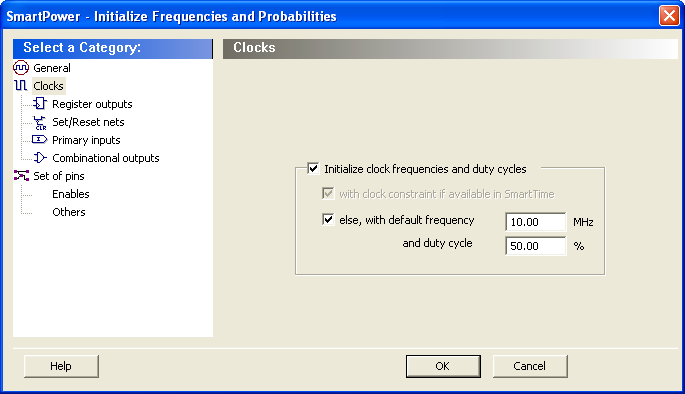

<br />

-   **Initialize clock frequencies and duty cycles**: initializes clock frequencies and duty cycles with one of the following:
    -   **with clock constraint if available in SmartTime**: when only this box is checked, SmartPower initializes all clock domains in SmartPower with clock constraints from SmartTime. If there is no frequency constraint set for this clock domain in SmartTime, the clock frequency of the domain will not be updated.
    -   **else, with default frequency \(MHz\) and duty cycle \(%\)**: when only this box is checked, SmartPower initializes all clock domains in SmartPower with the specified default frequency and duty cycle.

<br />

**Note:** When both boxes are checked, and **with clock constraint if available in SmartTime**, **else default frequency**, and **and duty cycle** selected, SmartPower initializes all clock domains with clock constraints from SmartTime. If there is no frequency constraint set for a clock domain in SmartTime, it is initialized with the specified default frequency and duty cycle.

### Register Outputs

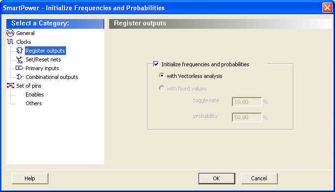

**Initialize frequencies and probabilities**: initializes frequencies and probabilities for<br /> register outputs in your design.

**with Vectorless analysis**: SmartPower initializes frequencies and probabilities using<br /> vectorless analysis.

**with fixed values**: SmartPower initializes frequencies and probabilities \(%\) of all<br /> register outputs with a default toggle rate \(available only when using toggle rates\) or<br /> frequency \(when not using toggle rates\), and a default probability.

### Set/Reset Nets

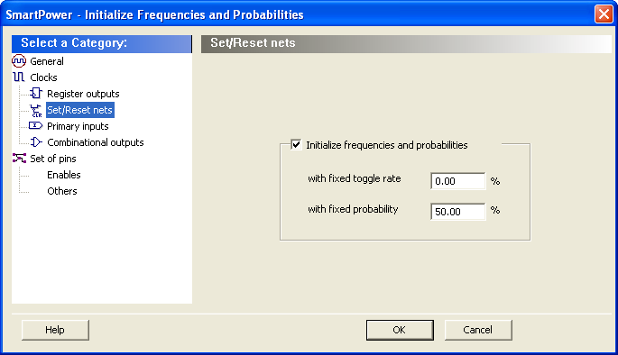

**Initialize frequencies and probabilities**: initializes frequencies and probabilities for<br /> set/reset nets in your design.

**with fixed frequency \(MHz\)**: SmartPower initializes all primary inputs in<br /> SmartPower with the specified fixed frequency. This option is available only when not<br /> using toggle rates.

**with fixed toggle rate \(%\)**: SmartPower initializes frequencies and probabilities of all<br /> set/reset nets with the specified fixed toggle rate. This option is available only when<br /> using toggle rates.

**with fixed probability \(%\)**: SmartPower initializes probabilities of all set/reset nets<br /> with the specified fixed probability.

### Primary Inputs

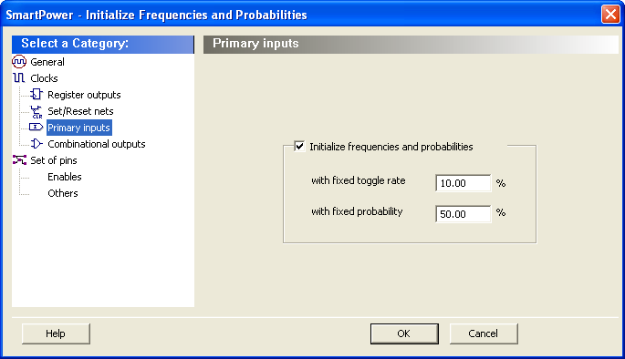

**Initialize frequencies and probabilities**: initializes frequencies and probabilities for<br /> the primary inputs in your design.

**with fixed toggle rate \(%\)**: SmartPower initializes frequencies and probabilities of all<br /> primary inputs with the specified fixed toggle rate. This option is available only when<br /> using toggle rates.

**with fixed frequency \(MHz\)**: SmartPower initializes all primary inputs in SmartPower with<br /> the specified default frequency. This option is available only when not using toggle<br /> rates.

**with fixed probability \(%\)**: SmartPower initializes probabilities of all primary inputs<br /> with the specified fixed probability.

### Combinational Outputs


**Initialize frequencies and probabilities**: initializes frequencies and probabilities for<br /> the combinational outputs in your design.

**with Vectorless analysis**: SmartPower initializes frequencies and probabilities with<br /> vectorless analysis.

**with fixed values**: SmartPower initializes frequencies and probabilities \(%\) of all<br /> combinational outputs with a default toggle rate \(available only when using toggle<br /> rates\) or frequency \(when not using toggle rates\), and a default probability.

#### Enables

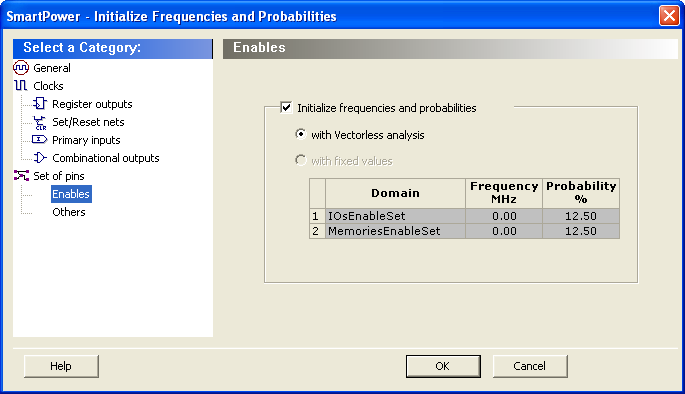

**Initialize frequencies and probabilities**: initializes frequencies and probabilities for<br /> the enable sets of pins in your design.

**with Vectorless analysis**: SmartPower initializes frequencies and probabilities with<br /> vectorless analysis.

**with fixed values**: SmartPower initializes frequencies and probabilities of all enables<br /> sets of pins with the specified default probability and frequency.

#### Others

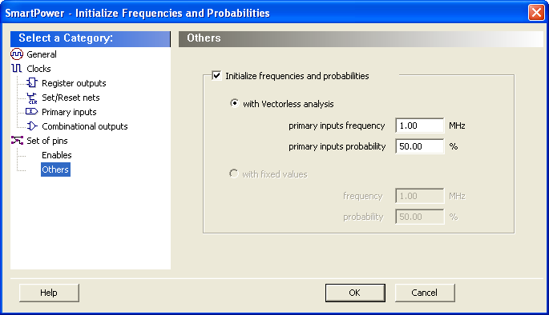

**Initialize frequencies and probabilities**: initializes frequencies and probabilities for<br /> the other sets of pins in your design with default values.

**with Vectorless analysis**: SmartPower initializes frequencies and probabilities with<br /> vectorless analysis as specified in the primary inputs frequency and probability.

**with fixed values**: SmartPower initializes frequencies and probabilities \(%\) of all other<br /> sets of pins with a default frequency and probability.

## Operating Conditions Dialog

The SmartPower Operating Conditions dialog box allows you to customize the operating<br /> conditions used in SmartPower for voltage and temperature.

**Note:** Changes will apply only to SmartPower and will not change the operating conditions set in Designer.

The **General** panel allows you to select the operating condition you<br /> want to apply to SmartPower: Best, Typical, or Worst.

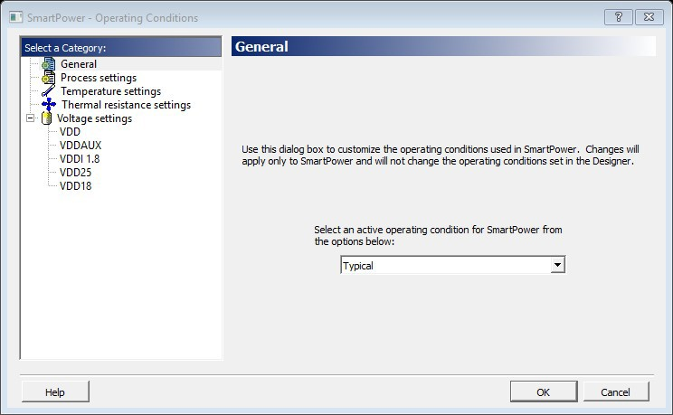

The process settings panel allows you to select the process characteristic.

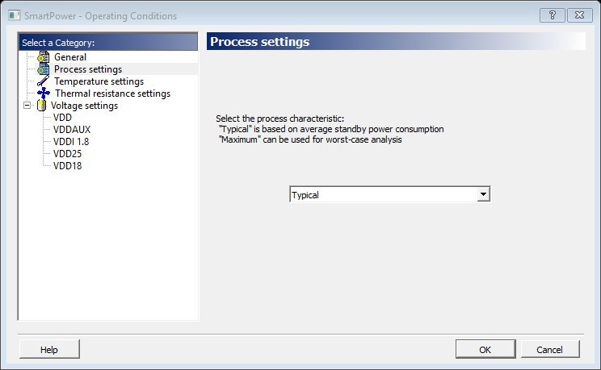

You can customize temperature settings in the Temperature Settings panel, and the voltage<br /> settings in the Voltage Settings panels—each VCC voltage used in the design appears<br /> under Voltage settings.


Select one of three options to specify the temperature or voltage settings:

-   **Design operating range \(default\)**: sets the temperature or voltage operating range as specified in your Project Settings.
-   **Custom operating range**: sets the temperature \(junction or ambient\) or voltage operating range for the current design in SmartPower only. Enter temperature values in degrees Celsius and voltage values in volts for Best, Typical, and Worst.
-   **Mode by mode operating range**: sets the temperature \(junction or ambient\) or voltage for each mode in SmartPower only. Use the grid to enter temperature values in degrees Celsius and voltage values in volts for each mode, or select multiple modes in the grid, and click the **Set values for selected modes** button to enter the same values for all selected modes.

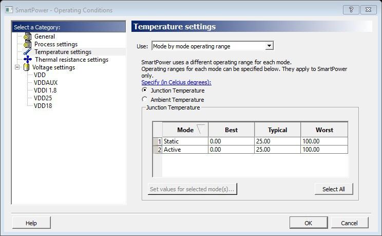

The junction temperature and static power are computed iteratively until they converge.<br /> The formulas are:

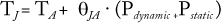

If the computed junction temperature is outside the operating condition range \(smaller<br /> than the best case value or greater than the worst case value\), a violation warning will<br /> be reported.

Both TJand Pstatic is re-computed when any of the following<br /> parameters are changed:

-   Ambient temperature
-   Cooling style
-   Custom thermal resistance or any parameters/options that affect the static or dynamic power values:
-   Junction Temperature Display Mode
-   Operating Condition \(Affect dynamic power\)
-   Operating Mode \(Affect dynamic power\)
-   Any of the clock domain frequencies \(Affect dynamic power\)

If you specified the Ambient temperature in the Temperature Settings panel, you can<br /> select the thermal characteristic for θJA.

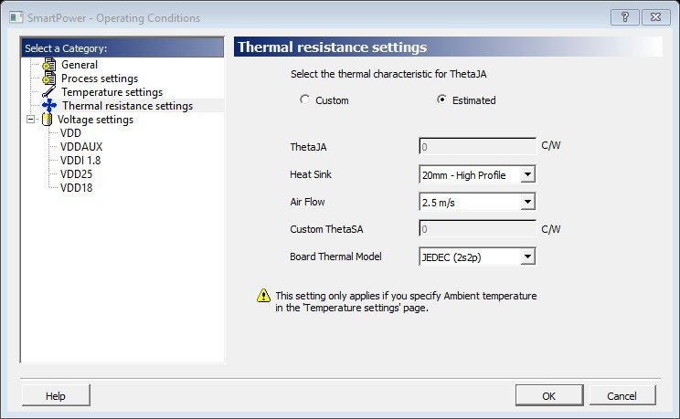

The thermal resistance is predefined for Still Air, 300 ft/min and Case Cooling. To enter<br /> a custom thermal resistance, select **Custom** from the thermal<br /> characteristic for θJA

SmartPower also reports the thermal resistance θJA.

### Custom Operating Modes

SmartPower allows you to use predefined and custom operating modes. A predefined<br /> operating mode is an inherent mode of a family of devices that comes with a number of<br /> hard availability constraints on the FPGA resources. Custom operating modes are<br /> user-defined modes based on one of the predefined modes available for the family, where<br /> parameters such as clock, data, and toggle rate frequencies have been customized. A<br /> custom mode can also be linked to a VCD.

Custom modes can be used:

-   To define additional modes where the chip is in the active predefined mode, but where the clock frequencies or the toggle rates are scaled up or down.
-   To import multiple VCD files that capture individual steps that take place in different modes.
-   To define a sequence of modes with a duration for each mode and get an estimate of the overall power consumption, from which extrapolate the battery life for the application. The Scenario Power report allows you to define a sequence of modes and estimate the weighted average of the power consumption of the chip over the entire sequence.
-   To define additional modes where the chip is in a predefined mode, but the junction/ambient temperature or the rails' voltage modes are different.

#### Setting the Current Mode

To set the current mode:

1.  From the **Edit** menu in SmartPower, choose **Modes and Scenarios &gt; Use for Analysis &gt; _mode name_** or select the mode in the Modes and Scenarios toolbar.

    Enter the result of your step here \(optional\).


#### Creating a New Custom Mode

To create a new custom mode:

1.  From the **Edit**menu in SmartPower, choose **Modes and Scenarios &gt; Custom Modes &gt; New Custom Mode** or click **Custom Modes**in the Modes and Scenarios toolbar, and select **New custom mode**.

    The New Custom Mode dialog box appears.

    

2.  Enter the mode name, select the base mode, and enter comments that describe the mode. The base mode can be either a user-defined custom mode or the active mode. The new mode will inherit all clock and data frequencies and annotations of its base mode.

3.  Click **OK**. The newly created operating mode is set as default in the Modes and Scenarios toolbar.


#### Editing a Custom Mode

To edit a custom mode:

1.  From the **Edit**menu in SmartPower, choose **Modes and Scenarios &gt; Custom Modes &gt; Edit Custom Mode**, or right-click the mode in the Modes and Scenarios toolbar and select **Edit custom mode**.

    The Edit Custom Mode dialog box appears.

    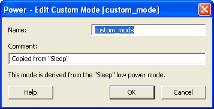

2.  Edit the mode name and comments.

3.  Click **OK**.

    **Note:** You can only use the Edit Mode dialog box to edit the name and comment of the current mode. To edit the mode properties, such as clock and data frequencies, use the SmartPower tabs.


#### Copying a Custom Mode

To copy a custom mode:

1.  Right-click the mode in the Modes and Scenarios toolbar and choose **Create a copy of this mode**.

    The New Custom Mode dialog box appears.

    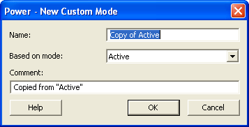

2.  Edit the mode name and comments.

3.  Click **OK**.


#### Deleting a Custom Mode

To delete a custom mode:

1.  From the **Edit**menu in SmartPower, choose **Modes and Scenarios &gt; Custom Modes &gt; Delete Custom Mode**; or right-click the mode in the Modes and Scenarios toolbar, and select **Delete Mode**. This brings up the Delete Custom Mode dialog box.

    The Delete Custom Mode appears.

    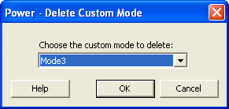

2.  Select the mode from the pull down and click **OK**.

    **Note:** You can delete only custom operating modes. You cannot delete predefined modes.


## Scenarios

A scenario is a sequence of previously defined operating modes with a specific duration<br /> for each mode. When you create a new design, SmartPower will create predefined scenarios<br /> automatically that can be used as is, or copied to create a new scenario based on the<br /> predefined one.

**Note:** You cannot edit or delete predefined scenarios.

### Creating a New Custom Scenario

To create a new custom scenario:

1.  From the **Edit**menu in SmartPower, choose **Modes and Scenarios &gt; Custom Scenarios &gt; New Custom Scenario**; or click **Scenarios**in the Modes and Scenarios toolbar, and select **New custom scenario**.

2.  Enter the scenario name, enter a duration \(total duration for the sequence must equal to 100%\) and select previously defined operating modes for this sequence.

3.  Click **OK**.

    The newly created scenario is set as default in the Modes and Scenarios toolbar.


### Editing a Custom Scenario

To edit a custom scenario:

1.  From the **Edit**menu in SmartPower, choose **Modes and Scenarios &gt; Custom Scenarios &gt; Edit Custom Scenario**; or right-click the scenario in the Modes and Scenarios toolbar, and select **Edit custom scenario**.

    The Edit Custom Scenario dialog box appears.

    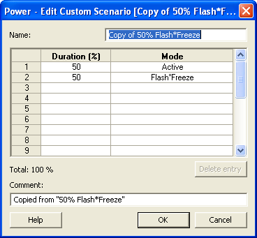

2.  Edit the information.

3.  Click **OK**.


### Copying a Scenario

To copy a scenario:

1.  Right-click the scenario in the Modes and Scenarios toolbar, and select **Create a copy of this scenario**.

    The New Custom Scenario dialog box appears.

    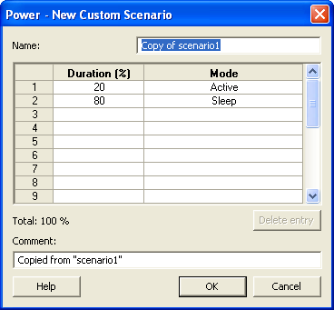

2.  Edit the information.

3.  Click **OK**.


### Deleting a Custom Scenario

To delete a custom scenario:

1.  From the **Edit**menu in SmartPower, choose **Modes and Scenarios &gt; Custom Scenarios &gt; Delete Custom Scenario** or right-click the scenario in the Modes and Scenarios toolbar, and select **Delete Scenario**.

    The Delete Custom Scenario dialog box appears.

    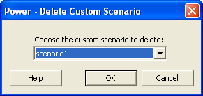

2.  Select the scenario from the pull down and click **OK**.


### Breakdown by Instance

Using the **Breakdown by Instance** panel, you can include the breakdown by instance in the<br /> report and set specific options.

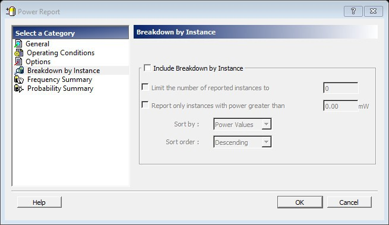

**Include Breakdown by Instance**: shows the power consumption of each element that has been<br /> instantiated in the design: gates, nets, memories, and I/Os. The breakdown by instance<br /> can be filtered by:

-   **Limit the number of reported instances to**: limits the number of instances reported to the specified number.
-   **Report only instances with power greater than**: does not report instances with power consumption below the selected value.

This section can be sorted by selecting the preferred method:

-   **Sort by**: sorts by name \(alphabetical\) or power values.
-   **Sort order**: sorts by ascending or descending order.

    **Note:** The filter reduces the number of lines in the report by one per instance.


## Power Reports

The Power report allows you to identify power consumption problems in your design. You can<br /> generate this report from the **Tools** menu and from SmartPower.

The Power Report dialog box is organized into the following panels:

<br />

-   General
-   Operating Conditions
-   Options
-   Breakdown by Instance
-   Frequency Summary
-   Probability Summary

<br />

### Generating Power Reports from the Tools Menu

To generate Power reports from the **Tools** menu:

1.  From the **Tools**menu, choose **Reports &gt; Power**.

    The Power Report dialog box appears.

2.  Select the options you want to include in the report.

3.  Click **OK**.

    The Power Report appears in a separate window.


### Generating Power Reports from within SmartPower

To generate Power reports from within SmartPower:

1.  From the **Tools**menu, choose **Reports &gt; Power Report** or click the **Report**button to open the Report dialog box. By default, the report includes global design information and a power summary.

2.  Specify which results you want to display by selecting the categories and their options.


### General

The **General** panel allows you to select what to include in the report, the report<br /> format, and the report mode.

<br />


<br />

### Include in the Report

Select the options you want to include in the Power report:

**Power summary**: reports the static, dynamic, and total power consumption of the design.

**Breakdown by rail**: shows the power consumption of each rail.

**Breakdown by type**: reports power consumption according to gates, nets, clocks, core<br /> static, I/Os, and memories.

**Breakdown by clock domain**: reports power consumption of each clock domain.

**Thermal summary**: includes a thermal report. The ambient temperature can be defined by<br /> operating conditions or ambient temperature.

When operating conditions is selected, the following characteristics are reported:

-   Operating conditions
-   Temperature range
-   Junction temperature

When ambient temperature is selected, the following characteristics are reported:

-   Ambient temperature
-   Cooling style
-   Package
-   Thermal resistance Theta-JA
-   Junction temperature
-   Temperature range
-   Junction temperature range limits specification

**Battery life**: reports the battery life.

**Clock Domain summary**: reports clock and data frequencies for each clock domain.

**Operating Condition Summary**: reports operating conditions.

**Annotation Coverage**: reports the number and percentage of pins annotated by each source<br /> \(VCD, manual annotation, SDC constraint, vectorless estimation,<br /> and fixed values\) for all clocks, register outputs,<br /> combinational outputs, set/reset nets, primary inputs, enable<br /> pins, and other pins.

### Report Format

Select **Text**, **XML**, or **CSV**\(comma-separated value\) as the desired export<br /> format.

### Mode

Select a mode for generating the report.

### Operating Conditions

The **Operating Conditions** panel allows you to select the operating conditions for the<br /> current report.

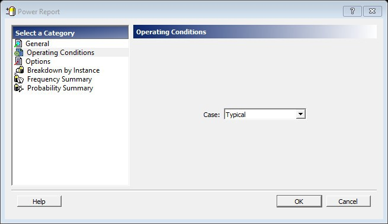

### Options

The **Options** panel allows you to select power and frequency units and to use toggle<br /> rates.

<br />


<br />

#### Units

**Frequency**: sets unit preferences for frequency: Hz, KHz, MHz.

**Power**: sets unit preferences for power: W, mW, or uW.

#### Use Toggle Rates

When toggle rates are active \(**Use Toggle Rates** box is checked\), the data frequency of all<br /> the clock domains is defined as a function of the clock frequency. This updates the data<br /> frequency automatically when you update the clock frequency. Toggle rates allow you to<br /> specify the data frequency as a percentage of clock frequency; however, you can specify<br /> the data frequency only as a percentage of the clock frequency, not as a number. To set<br /> the data frequency again, clear the **Use Toggle Rates** option.

### Breakdown by Instance

Using the **Breakdown by Instance** panel, you can include the breakdown by instance in the<br /> report and set specific options.


**Include Breakdown by Instance**: shows the power consumption of each element that has been<br /> instantiated in the design: gates, nets, memories, and I/Os. The breakdown by instance<br /> can be filtered by:

-   **Limit the number of reported instances to**: limits the number of instances reported to the specified number.
-   **Report only instances with power greater than**: does not report instances with power consumption below the selected value.

This section can be sorted by selecting the preferred method:

-   **Sort by**: sorts by name \(alphabetical\) or power values.
-   **Sort order**: sorts by ascending or descending order.

    **Note:** The filter reduces the number of lines in the report by one per instance.


### Frequency Summary

Using the **Frequency Summary** panel you can include the frequency summary in the report and<br /> set specific options.

<br />

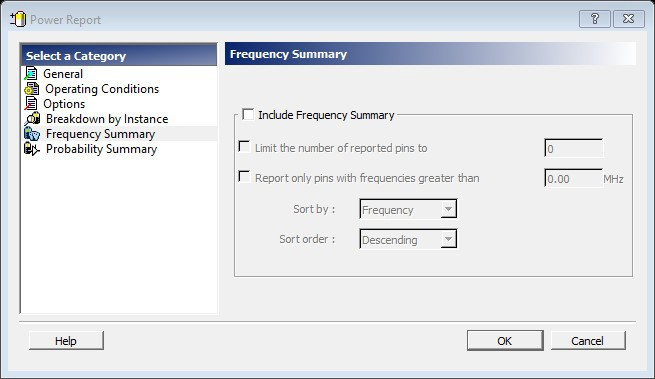

<br />

**Include Frequency Summary**: section shows the frequency summary and reports the pin, net,<br /> domain, frequency, and frequency source for each pin.

The frequency summary can be filtered by:

-   **Limit the number of reported pins to**: limits the number of pins reported to the specified number.
-   **Report only pins with frequencies greater than**: any pin with a frequency below the selected value is not reported.

This section can be sorted by selecting the preferred method:

-   **Sort by**: sorts by pin name, net name, domain, frequency, or source.
-   **Sort order**: sorts by ascending or descending order.

### Probability Summary

Using the **Probability Summary** panel you can include the probability summary in the<br /> report and set specific options.

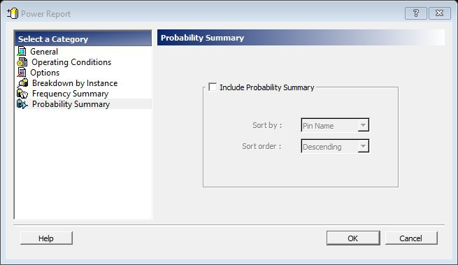

**Include Probability Summary**: shows the probability summary and reports the driver,<br /> net, rate, source, and type for each pin. This section can be sorted by selecting the<br /> preferred method:

-   **Sort by**: sorts by pin name, net name, rate, source, or type.
-   **Sort order**: sorts by ascending or descending order.

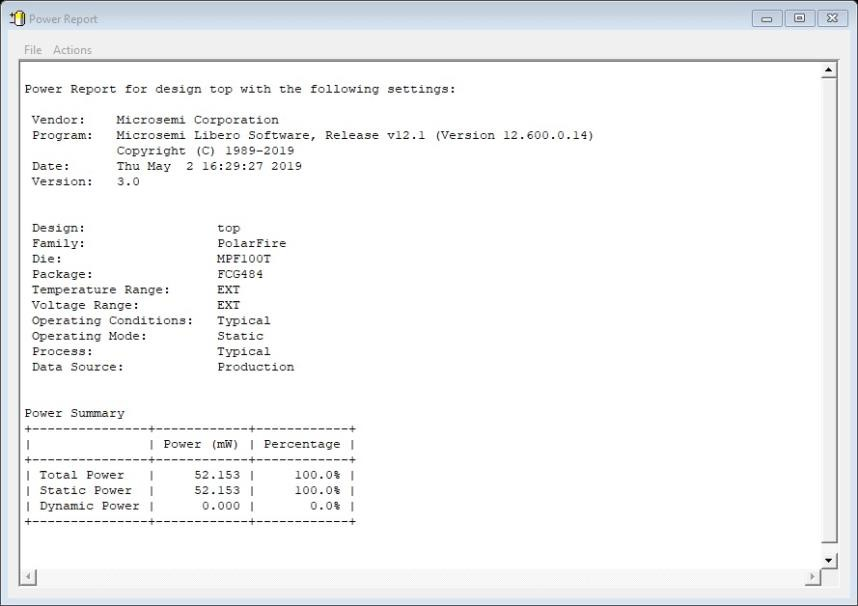

In addition to the information selected on the Power Reports dialog box, the report<br /> contains global design information.

**Global design information**: shows the target family, the package and the die. It<br /> also shows information about the operating conditions, speed grade, and power mode. This<br /> option is set by default.

## Scenario Power Report

The Scenario Power report allows you to select a previously defined scenario and calculate the<br /> average power consumption and the battery life for this scenario. You can generate this<br /> report from the **Tools** menu and from within SmartPower.

The Scenario Power Report dialog box is organized into the following panels:

-   General
-   Operating Conditions
-   Options
-   Battery life

### Generating Scenario Power Reports from the Tools Menu

Make sure your design contains one or more scenarios.

To generate a Scenario Power report from the **Tools** menu:

1.  From the **Tools**menu, choose **Reports &gt; Power &gt; Scenario Power Report**.

    The Scenario Power Report dialog box appears.

2.  Select the options you want to include in the report, and then click **OK**.

    The Scenario Power report appears in a separate window.


### Generating Scenario Power Reports from within SmartPower

Make sure your design contains one or more scenarios.

To generate Scenario Power reports from within SmartPower:

1.  From the **Tools**menu, choose **Reports &gt; Scenario Power Report** or click the **Scenario Power Report**button to open the Power Scenarios dialog box. By default, the report includes global design information and power sequencer summary.

2.  Specify which results you want to display by checking the boxes to be included in the report.


### General

The **General** panel allows you to select what to include in the report, the report format,<br /> and the scenario for which you want to generate the report.

<br />

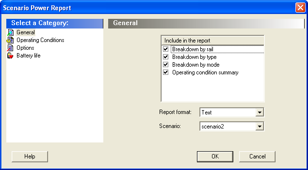

<br />

### Include in the report

**Breakdown by rail**: shows the power consumption of each rail.

**Breakdown by type**: reports on the power consumption according to: gates, nets, clocks,<br /> core static, I/Os, and memories.

**Breakdown by mode**: reports on power consumption by mode.

**Operating condition summary**: reports the operating conditions.

#### Report format

Select **Text**or **CSV**\(comma-separated value\) as the desired export format.

#### Scenario

Select a previously defined scenario to generate the report from.

### Operating Conditions

The **Operating Conditions** panel allows you to select the operating conditions case for the<br /> current design.

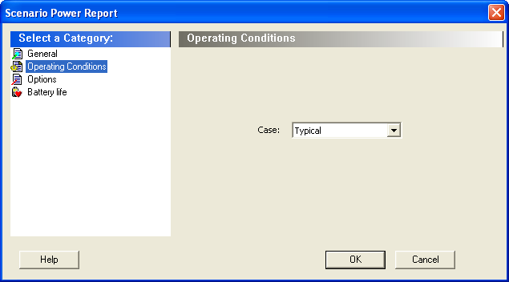

### Options

The **Options** panel allows you to select power and frequency units and use toggle rates.

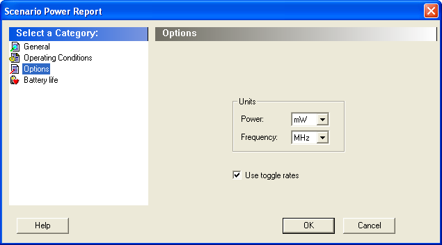

### Units

**Frequency**: sets unit preferences for frequency \(Hz, KHz, MHz\).

**Power**: sets unit preferences for power \(W, mW, or ʋW\).

### Use Toggle Rates

When toggle rates are active \(**Use Toggle Rates** box is checked\), the data frequency of all<br /> the clock domains is defined as a function of the clock frequency. This updates the data<br /> frequency automatically when you update the clock frequency. Toggle rates allow you to<br /> specify the data frequency as a percentage of clock frequency; however, you can specify<br /> the data frequency only as a percentage of the clock frequency, not as a number. To set<br /> the data frequency again, clear the **Use Toggle Rates** option.

### Battery life

The **Battery life** panel reports the battery capacity and the battery life. Enter a battery<br /> capacity in MA/Hrs.

<br />


<br />

The SmartPower Scenario Power report returns the average power consumption and battery life for<br /> this sequence.

<br />


<br />

In addition to the information selected in the Scenario Power Reports dialog box, the report<br /> contains global design information, a mode summary, and the sequence average power.

**Global design information**: shows the target family, the package and the die. It also shows<br /> information about the operating conditions, speed grade, and power mode. This option is<br /> set by default.

**Power Summary**: reports the power consumption of the sequence by mode. This option is set<br /> by default.

**Sequence Average Power**: reports the average power consumption of the sequence. This option<br /> is set by default.

## Activity and Hazards Reports

Traditional Power Analysis based on a VCD simulation file reports an average power value<br /> that will account for all nets switching in the design. This switching includes<br /> functional transitions and spurious transitions. Due to the delay of each gate, paths<br /> arriving at one internal gate may have different propagation delays. Therefore, a gate<br /> may exhibit multiple spurious transitions before settling to the correct logic level.

The Activity and Hazards Power report allows to identify gates and nets of the design<br /> that consume power because of spurious transitions. This is helpful to understand and<br /> further minimize power consumption. The activity and hazards report reads a VCD file and<br /> reports transitions and hazards for each clock cycle of the VCD file.

The Activity and Hazards report dialog box is organized into the following panels:

-   General
-   Partial Parsing
-   Top-Level Name
-   Glitch Filtering
-   Clock Domains

### Generating Activity and Hazard Reports from the Tools Menu

To generate Activity and Hazard reports from the **Tools** menu:

1.  From the **Tools**menu, choose **Reports &gt; Power &gt; Activity and Hazards Report**.

    The Activity and Hazards Power Report dialog box appears.

2.  Select the options you want to include in the report, and then click **OK**.

    The Activity and Hazards report appears in a separate window.


### Generating Activity and Hazard Reports from within SmartPower

To generate Activity and Hazard reports from within SmartPower:

1.  From the **Tools**menu, choose **Reports &gt; Activity and Hazards Report**, or select a VCD file from the Modes and Scenarios toolbar and from the right-click menu, select **Tools &gt; Power Activity and Hazards**.


### General

<br />

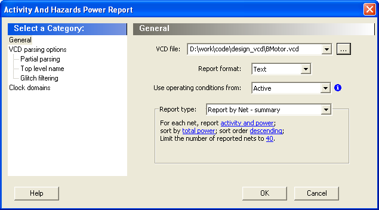

<br />

**VCD file**: select the VCD file you want to import.

**Report format**: select **Text**or **CSV**\(comma-separated value\) as the desired<br /> export format.

**Use operating conditions from**: select the mode from which the operating conditions will be<br /> used.

**Report type**: select the report type:

-   Report by Net – summary: summary report by net.
-   Report by Net – detailed: detailed report by cycle.
-   Report by Cycle – summary: summary report by net.
-   Report by Cycle – detailed: detailed report by cycle. The selected report type reports activity and power for each net sorted by power in descending order and limits the number of reported nets to 40 by default. To change these options, click each option and from the pop-up menu, select the desired option:
    -   Report: select the query report type: activity, power, or activity and power.
    -   Sort by: select the query sort by functional power, functional transitions, spurious power, spurious transitions, or total power.
    -   Sort order: select the query sort order: ascending or descending.
    -   Limit the number of reported nets: enter the query filter limit.

### Partial parsing

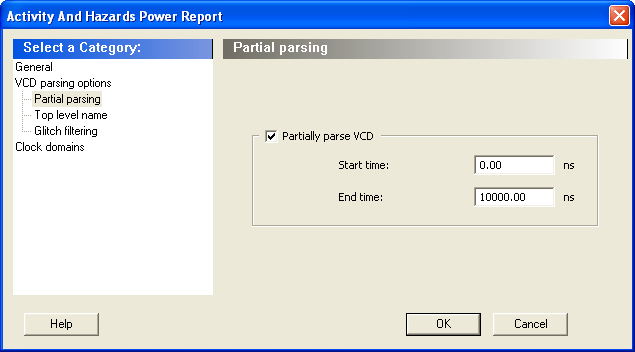

**Partially parse VCD**: specify the **Start time** and **End time** to partially parse<br /> the VCD file. This option can be used for large VCD files.

### Top level name

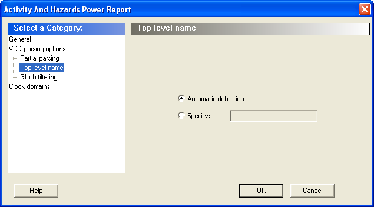

This option allows you to select how the top-level name is specified. Select **Automatic detection**to let the VCD reader detect the top-level name of the design<br /> automatically or select **Specify**to specify the top-level name manually.

### Glitch Filtering

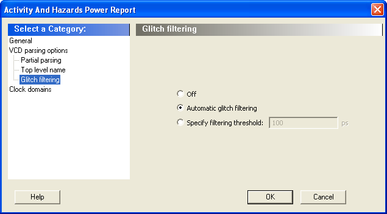

This option allows you to filter out pulses of short durations by selecting **Automatic glitch filtering**or by entering a value in the **Specify filtering threshold**field. The default glitch filtering option is **Automatic glitch filtering**.

### Clock Domains


The clock domain can be automatically constructed or specified by you.

**Automatic construction**: constructs the clock domain automatically. SmartPower analyzes<br /> your design automatically to assess if a clock is active and what is the active<br /> edge.

**Specify**: select this option to specify the period and first edge.

Use the clock domain table to set the active edge \(rising, falling or both\) and to set a clock as<br /> transparent. The results are displayed in the following Activity and Hazards Power<br /> report.

<br />

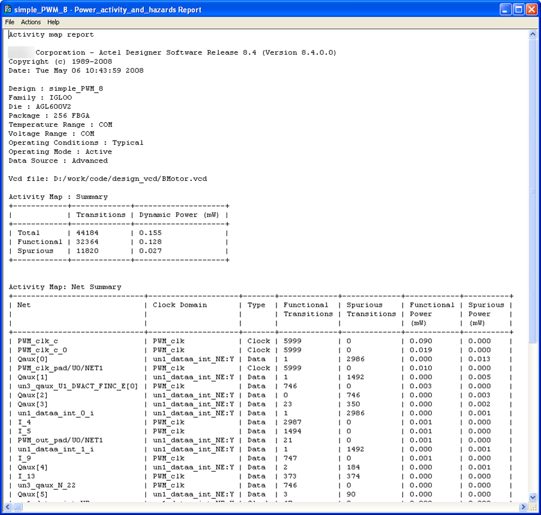

<br />

## Export Report for Microchip Power Estimator \(MPE\)

This option exports an .xml report from SmartPower, which can be imported into the MPE tool. To<br /> export the MPE report, go to **Tools &gt; Export Report for MPE.**

The generated .xml report contains the following information:

-   Device Settings

-   Thermal Settings

-   Voltage Source

-   Clocks

-   Logic Breakdown

-   LSRAM Breakdown with Advanced Settings

-   uSRAM Breakdown with Advanced Settings

-   Math Breakdown with Advanced Settings

-   PLL and DLL

-   I/Os

-   Crypto

-   Transceivers


In addition, the following information is available for PolarFire SoC devices:

-   MSS RISC-V \(Quad U54\)

-   AXI MSS/Fabric Interfaces

-   MDDR

-   MSS I/O Interfaces

-   User Crypto


MPE has an import feature, which allows the user to import either the existing MPE spreadsheet<br /> \(.xls format\) or Power estimation results from Libero® SoC SmartPower \(.xml format\), as shown<br /> in the following figure.

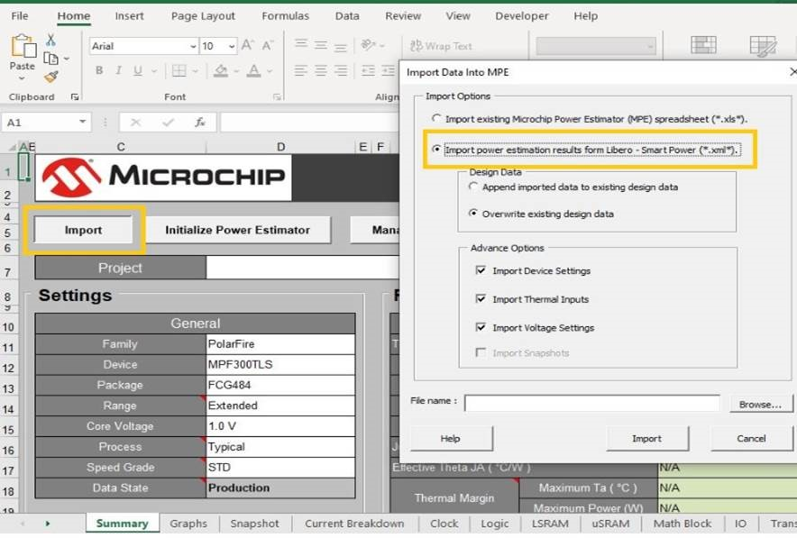

## Freeze/Unfreeze Calculations

Freeze/Unfreeze calculation option allows a more responsive User Interface and avoids runtime slowness due to a re-computation that occurs on every value changes. A toggle play pause button is provided to freeze the computation until the user is ready to re-compute. Only when the user clicks the play button, all the changes done will be computed and the User Interface gets updated.

To Freeze/Unfreeze Calculations, go to **Tools &gt; Freeze/Unfreeze Calculations**.

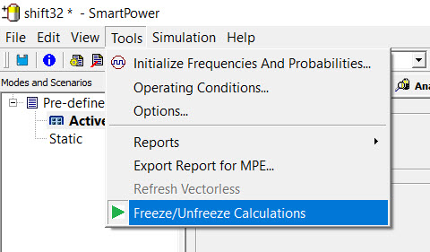

## Importing a VCD File

The VCD file is a simulation file. The format of this file is specified in the IEEE® 1364 standard.

You can configure the Project Manager to generate VCD files automatically using QuestaSim. You can also generate a VCD file with a QuestaSim simulator using the following commands:

``` {#CODEBLOCK_MYS_MQY_QSB}
vcd file example.vcd
vcd add -r /testbench/<top>_0/* 
run 1 us
vcd flush
```

This example creates a VCD file called `example.vcd`, adds all signals recursively, runs the simulation for one microsecond, and quits. You must quit QuestaSim to obtain an accurate result from SmartPower.

If you have not completed the layout of the design, the design software guides you through Place-and-Route. Hence, you can import the VCD file. To annotate your VCD values to the design, complete Place-and-Route even if you had generated VCD files using timing simulation \(pre-layout\).

**Note:** SmartPower is validated with the QuestaSim generated VCD files. However, you might use any Verilog/VHDL simulator that offers a VCD dump feature.

For more information about how to generate a VCD file, see the user manual for your simulation tool.

To Import VCD files in SmartPower and access the available importing options, perform the following steps:

1.  From the **Simulation** menu, choose **Import VCD File**.

    The Import VCD Options dialog box appears.

    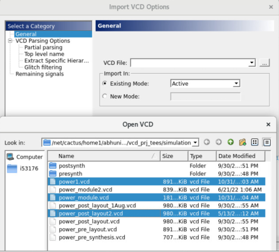

2.  Select the VCD file that you want to import and select a mode to import it in, or click **New mode**and enter a mode name.

    **Important:** The user can select multiple VCD files from the same directory. This will also help the user to import multiple VCDs for different blocks from different designs, and multiple VCDs for different modules for the same design.

3.  Select the options you want to specify:

    -   **Partial parsing**: Specify the **Start time** and **End time**to partially parse the VCD file. This option can be used for large VCD files.

        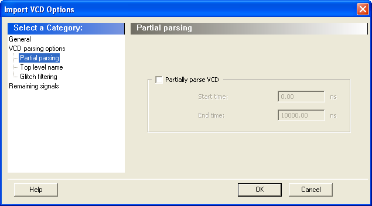

    -   **Top level name**: Allows you to select how the top-level name is specified. The **Top level name** is the instance name of your design instantiated in the simulation testbench. Select **Automatic detection**to let the VCD reader detect the top-level name of the design automatically or select **Specify**to specify the top-level name manually.

        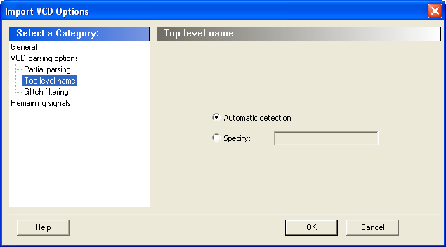

    -   **Extract Specific Hierarchy**: Allows you to specify the hierarchy level of the design to be annotated.

        **Note:** Currently, this option is supported for VCD generated for full design and not for a block/module VCD.

        

    -   **Glitch filtering**: Allows you to filter pulses of short durations by selecting **Automatic glitch filtering** or by entering a value in the **Specify filtering threshold** field. The default option is **Automatic glitch filtering**.

        

    -   **Remaining signals**: A few signals might not be annotated by the VCD reader. It generally happens with VCD files created from a behavioral or a post-synthesis simulation. For those signals, you can either complete the annotation with the vectorless analysis or with the average values computed from the VCD file.

        

4.  Click **OK**.

    When the VCD file is imported successfully, the file appears under the Imported mode in the Modes and Scenarios toolbar, and the following messages appear in the Designer Log window:

    ```
    ``Info:`
    VCD:34 glitch(es) filtered with 1000 ps threshold`
    ```

    The preceding message reports the number of glitches that are filtered by the VCD reader.

    ```
    `Info:
    `VCD: Annotation Statistics Percentage of Annotated Pins:100.00 % Percentage of Unannotated Pins:0.00 %`
    `Percentage of Annotated Pins with Zero Frequency: 25.99 %``
    
    ```

    If the percentage of annotated pins is less than 50.00%, a<br /> warning message is generated.

    If the percentage of annotated pins is<br /> low, you might want to verify that signals at all levels of hierarchy are<br /> added recursively \(for example, using `vcd add –r`in<br /> QuestaSim\).

    If you simulate a pre-synthesis netlist or a<br /> post-synthesis RTL netlist, it is possible to get a low percentage of<br /> annotated pins. This happens because not all logic elements are in the<br /> pre-synthesis netlist and the post-synthesis RTL netlist. For accurate power<br /> estimation, it is best to run post-layout simulation with a back-annotated<br /> netlist.

    To see which pins are not annotated, open the SmartPower<br /> **Frequencies** tab. If your file is imported<br /> successfully, a list of pins with annotated individual frequencies,<br /> displayed with **VCD Import,** appear as a source. The<br /> unannotated pins are displayed with **Default Estimation** as source. If your design has enabled pins, open<br /> the SmartPower **Probabilities** tab.

    Another<br /> feature enables to annotate different parts of the hierarchy depending on<br /> the instructions.

    -   When a VCD is generated at a lower level of hierarchy inside the design, import the VCD and annotate the level of hierarchy present in the VCD.

        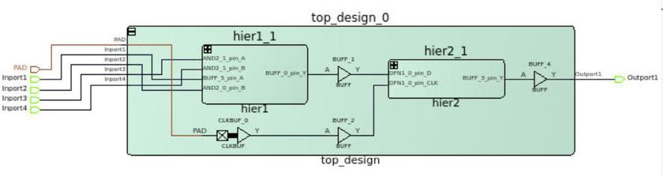

    -   The design contains a block and the VCD is generated for that block, only for the annotated block.

        ")

    After completing the import VCD process, you can create a custom mode based on the active mode. This custom mode inherits all the clock and toggle frequencies of the active mode you set through the VCD import. This final step is optional. It gives you the flexibility to modify the active mode frequencies while saving the VCD scenario in SmartPower. For more information, see [Custom Operating Modes](GUID-99428940-29C0-4D02-B947-C6ACA4AD2649.md#).


## Removing a VCD File

The VCD file is a simulation file whose format conforms to the IEEE 1364 standard.

To remove a VCD file, perform one of the following steps:

-   Select the VCD file from Active mode or a custom mode, right-click the VCD file and select **Remove VCD File from &lt;mode name&gt; Mode**.
-   From the **Simulation**menu, choose **Remove VCD File &gt; &lt;file name&gt;**

    <br />

    **Note:** The annotation is removed when you remove the VCD file.

    <br />


## Auditing Files

When you start SmartPower, it performs an audit automatically. During the audit, SmartPower<br /> checks the time stamps of VCD files and reports any missing or out-of-date files. You<br /> can also initiate a file audit manually from the **Simulation**menu by choosing<br /> **Audit Files**. After an audit is run, an icon displaying the file status<br /> appears in the Modes and Scenarios toolbar next to the VCD file. Mousing over the icon<br /> displays more information.

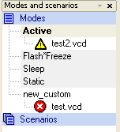

|Icon|Description|
|----|-----------|
||Indicates that the VCD file has been modified|
||Indicates that the VCD file is missing|

To re-import the VCD file, right-click the VCD file and select **Re-import VCD File**. Then<br /> use the Import VCD Options dialog box to re-import the file.

