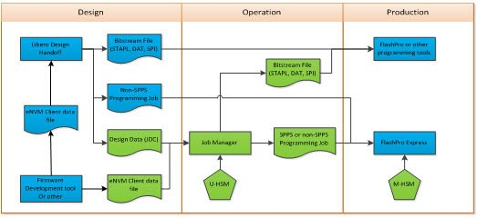
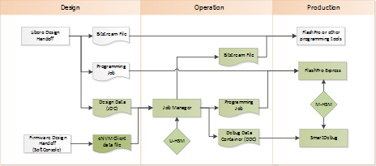

# Programming Production

The following figure shows the Microchip programming production flow. The flow supports simple  programming jobs and bit stream file exports directly from the Libero tool, represented with  the blue components in the following figure. Libero-based production flow only supports  non-secured programming, based on KLK key mode. For more information, see the [Libero SoC Design Flow User Guide](http://coredocs.s3.amazonaws.com/Libero/2025_1/Tool/libero_ecf_ug.pdf).

The Job Manager extends that capability: allowing bit stream file and programming job generation  outside of the Libero tool, and the support of SPPS flow, represented with green components in  the following figure.

Bitstream files \(STAPL, DAT, and SPI\) are programmed using FlashPro,  DirectC, or Silicon Sculptor. STAPL file can be used by third party JTAG production  programming tools to program Microchip devices. Programming jobs are supported by FlashPro  Express only. The following figure shows the debug flow. It allows DDC generation outside of  the Libero tool supports SPPS flow, represented with green components.

The main SPPS flow is based on the use of HSM in the Operation and  Production site. It supports the advanced production the programming models and SmartDebug as  described in the following sections.

-   **[Main SPPS Flow](GUID-466BE726-BA36-4B47-B413-30BD08FB949B.md)**  

-   **[Non-HSM Flow](GUID-D3F4A27F-9150-44FB-A266-6E0C81044D55.md#)**  

-   **[Bitstream Initialization](GUID-91BD584E-2625-40ED-B312-8F9D514B4F24.md#)**  

-   **[Creation of Programming Bitstream Files](GUID-FB2667A8-B381-4758-9FC5-FAB61B1069B6.md)**  

-   **[Creation and Execution of non-HSM Jobs](GUID-6710F9F8-7F22-4FA1-A755-A6B027BBBA5A.md)**  

-   **[Creation of SPI Directory](GUID-0966DEE7-D2F8-4B7A-BA71-D3ABCD835E6B.md)**  

