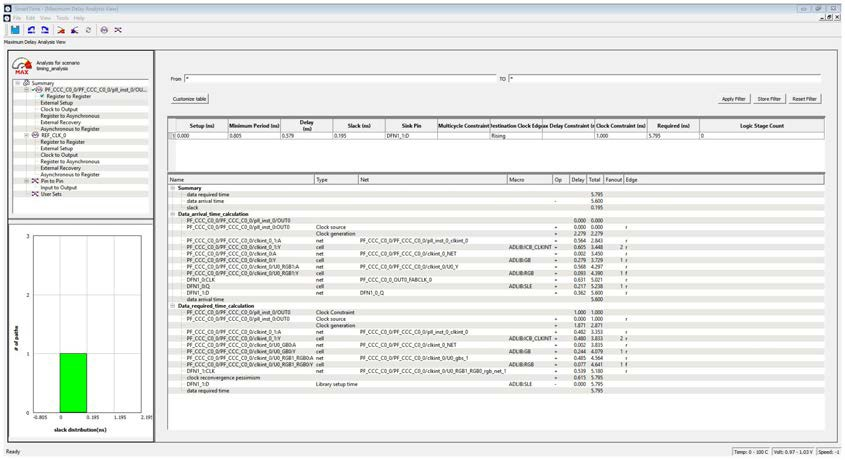
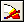
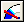
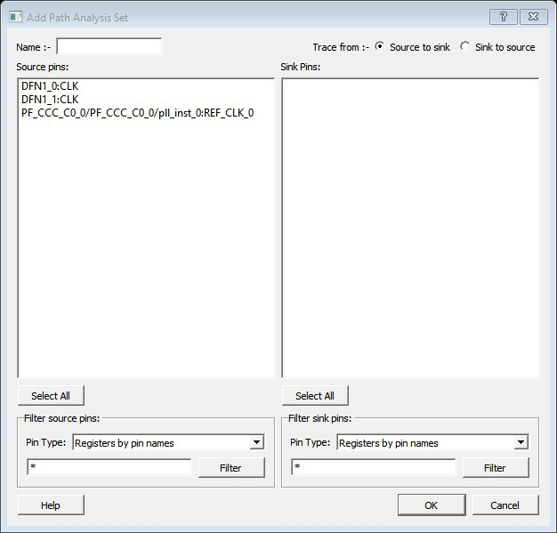
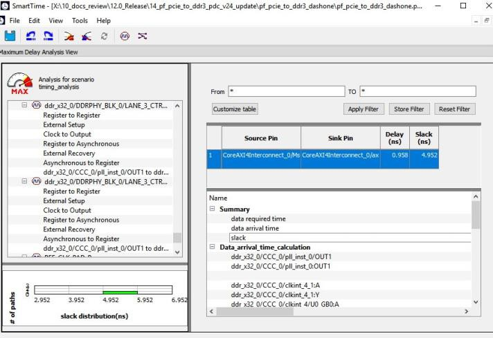
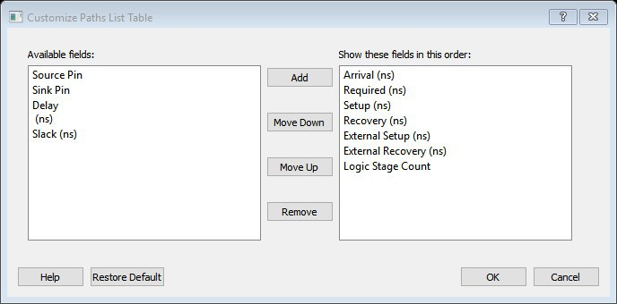
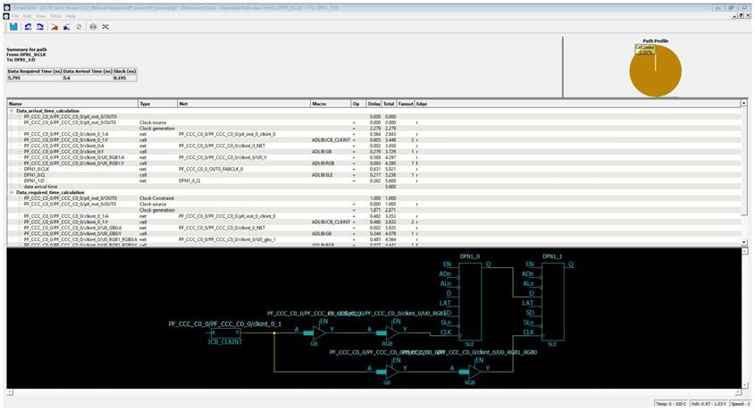
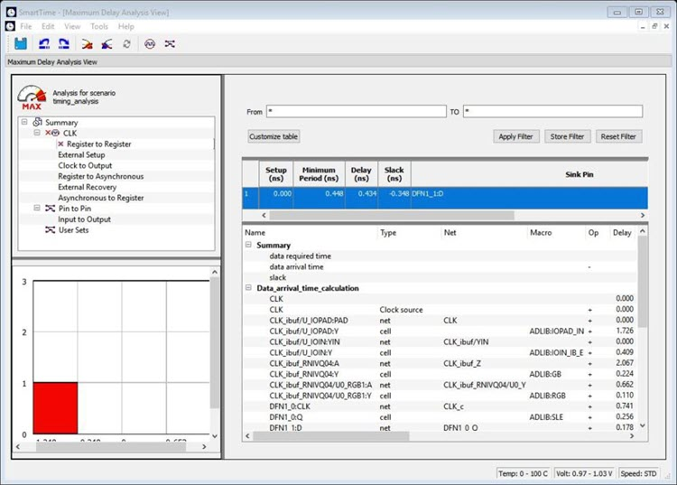
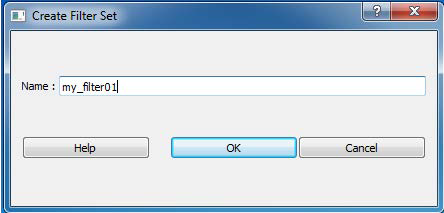
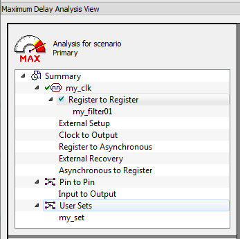

# SmartTime Timing Analyzer

The following sections describe the SmartTime Timing Analyzer functions.

## SmartTime Analyzer Components

SmartTime Timing Analyzer consists of the following components:

-   Domain Browser: Alows you to perform your timing analysis on a per domain basis.
-   Path List: Shows paths in a specific set within a given domain sorted by slack.
-   Path Details: Shows detailed timing analysis of a selected path in the paths list.
-   Analysis View Filter: Allows you to filter the content of the paths list.
-   Path Slack Histogram: When a set is selected in the Domain Browser, Path Slack Histogram shows a distribution of the path slacks for that set. Selecting one or multiple bars in the Path Slack Histogram filters the paths shown in the Path List.

The following figure shows the SmartTime Timing Analyzer Components. You can copy and  change the resolution and number of bars of the chart from the right-click menu.

## Analyzing Your Design

The timing engine uses the following priorities when analyzing paths and calculating slack:

1.  False path
2.  Max/Min delay
3.  Multi-cycle path
4.  Clock

If multiple constraints of the same priority apply to a path, the timing engine uses the tightest  constraint.

You can perform two types of timing analysis:

 

-   Maximum Delay Analysis
-   Minimum Delay Analysis

 

To perform the basic timing analysis, use one of the following methods to open the Timing  Analysis View:

-   From the SmartTime **Tools** menu, choose **Timing Maximum Delay Analysis** or **Minimum Delay Analysis**.
-   From the SmartTime window, click the  icon for Maximum Delay Analysis or the  icon for Minimum Delay Analysis.

**Note:** When you open the Timing Analyzer from Designer, the Maximum Delay Analysis window appears by default.

## Maximum Delay Analysis View

To enter Maximum Delay Analysis View:

1.  In the Domain Browser, select the clock domain. Clock domains with a  indicate that the timing requirements in these domains were met. Clock domains with an x indicate that there are violations within these domains. **Paths List** shows the timing paths sorted by slack. The path with the lowest slack \(biggest violation\) is at the top of the list.

2.  Select the path you want to view.

    **Path Details** below the **Paths List** shows detailed information about how the slack was computed by detailing the arrival time and required time calculation. If a path is violated, the slack is negative and shown in red.

3.  To display a separate view that includes the path details and schematic, double-click the path.

4.  Repeat this procedure as necessary.

    **Note:** If the minimum pulse width of one element on the critical path limits the maximum frequency for the clock, an icon for the clock name appears in the **Summary List**. Clicking the icon displays the name of the pin that limits the clock frequency.

## Managing Clock Domains

In SmartTime, timing paths are organized by clock domains.

By default, SmartTime displays domains with explicit clocks. Each clock domain includes at least three path sets:

-   Register to Register
-   External Setup \(in the Maximum Analysis View\) or External Hold \(in the Minimum Analysis View\)
-   Clock to Out

You must select a path set to display a list of paths in that specific set.

To manage the clock domains:

1.  Right-click anywhere in the Domain Browser and choose **Manage Clock Domains**.

    The [Manage Clock Domains](GUID-EBAC6EE2-DB87-4372-9845-ABE75A08F71F.md#) dialog box appears.

    **Tip:** You can click the  icon in the SmartTime window bar to display the Manage Clock Domains dialog box.

2.  To add a new domain, select a clock domain from the **Available clock domains** list and click **Add**. To add a non-explicit clock domain, click **New Clock**.

    The Choose the Clock Source Pin dialog box appears, and you can select the clock source pin. You can choose to filter the available pins and search.

    

3.  To remove a displayed domain, select a clock domain from the **Show the clock domains in this order** list and click **Remove**.

4.  To change the display order in the Domain Browser, select a clock domain from the **Show the clock domains in this order** list, and then use **Move Up** or **Move Down** to change the order in the list.

5.  Click **OK**.

    SmartTime updates the Domain Browser based on your specifications. If you added a new clock domain, it includes at least three path sets, as mentioned in the preceding step.

## Managing Path Sets

You can create and manage custom path sets for timing analysis and tracking purposes.

Path sets appear below **Custom Path Sets** at the bottom of the Domain Browser.

To  manage path sets:

1.  Right-click anywhere in the Domain Browser and choose **Add Set**.

    The [Add Path Analysis Set dialog box](GUID-F96D2B4E-7DDD-4507-8621-C49A84F55C81.md#) appears.

    **Tip:** You can click the  icon in the SmartTime window bar to display the Add Path Analysis Set dialog box.

    

2.  Enter a name for the path set.

3.  Select the source and sink pins. You can use the [Using Filters](GUID-ACBC75AF-8281-4EC9-8923-D807DC7097AB.md#) to control the type of pins displayed.

4.  Click **OK**.

    The new path set appears below **User Sets** in the Domain Browser.

    

5.  To rename a path:

    1.  Select the path set from **User Sets** in the Domain Browser.

    2.  Right-click the set you want to rename, and then choose **Rename Set** from the right click menu.

    3.  Edit the name directly in the Domain Browser.

6.  To remove a path:

    1.  Select the path set from **User Sets** in the Domain Browser.

    2.  Right-click the set you want to delete, and then choose **Delete Set** from the right click menu.

## Displaying Path List Timing Information

Path List in the Timing Analysis View shows the timing information required to verify  the timing requirements and identify violating paths. The Path List is organized in  a grid where each row represents a timing path with the corresponding timing  information displayed in columns. Timing information is customizable, allowing you  to add or remove columns for each type of set.

By default, each type of set displays the following subset of columns:

-   Register to Register: Source Pin, Sink Pin, Delay, Slack, Arrival, Required, Setup, Minimum Period, and Skew.
-   External Setup: Source Pin, Sink Pin, Delay, Slack, Arrival, Required, Setup, and External Setup.
-   Clock to Out: Source Pin, Sink Pin, Delay, Slack, Arrival, Required, and Clock to Out.
-   Input to Output: Source Pin, Sink Pin, Delay, and Slack.
-   Custom Path Sets: Source Pin, Sink Pin, Delay, and Slack. You can add the following columns for each type of set:
    -   Register to Register: Clock, Source Clock Edge, Destination Clock Edge, Logic Stage Count, Max Fanout, Clock Constraint, Maximum Delay Constraint, and Multicycle Constraint.
    -   External Setup: Clock, Destination Clock Edge, Logic Stage Count, Max Fanout, Clock Constraint, Input Delay Constraint, Required External Setup, Maximum Delay Constraint, and Multicycle Constraint.
    -   Clock to Out: Clock, Source Clock Edge, Logic Stage Count, Max Fanout, Clock Constraint, Output Delay Constraint, Required Maximum Clock to Out, Maximum Delay Constraint, and Multicycle Constraint.
    -   Input to Output: Arrival, Required, Setup, Hold, Logic Stage Count, and Max Fanout.
    -   Custom Path Sets

To customize the set of timing information in the Path List:

1.  Choose **Customize table** on the top-left corner of path list to open the [Customize Paths List Table dialog box](GUID-D8221A0E-5959-42AE-B9C8-EDF0D74E2F71.md#).

    

2.  To add one or more columns, select the fields to add from the **Available fields** list and click **Add**.

3.  To remove one or more columns, select the fields to remove from the **Show these fields in this order**list, and click **Remove**.

4.  To change the order in which the fields appear, select fields in the **Show these fields in this order** list and click **Move Up** or **Move Down**.

5.  Click **OK** to add or remove the selected columns.

    SmartTime updates the Timing Analysis View.

## Displaying Expanded Path Timing Information

SmartTime displays the list of paths and path details for all parallel paths.

The Path Details grid displays the path details for all parallel paths. The Path List displays all parallel paths in your design.

To display the Expanded Path View:

1.  From the Path List, double-click the path, or right-click a path and select **expand selected paths**.

2.  From the Expanded Path View, double-click the path, or right-click the path and select **expand path**.

    

    The Expanded Path Summary provides a summary of all parallel paths for the  selected path. The Path Profile chart shows the percentage of time taken by  cells and nets for the selected path. If no parallel path is selected in  this view, the Path Profile shows the percentage for all paths. By default,  SmartTime shows only one path for each Expanded Path. To change this  default, use the SmartTime Options dialog box.

    The Expanded Path View includes a schematic of the path and a path profile  chart for the paths selected in the Expanded Path Summary.

## Using Filters

You can use filters in SmartTime to limit the Path List content \(that is, create a filtered list on the source and sink pin names\).

Filtering options appear at the top of the Timing Analysis View. You can save these  filters one level below the set under which they have been created.

To use the filter:

1.  Select a set in the Domain Browser to display a given number of paths, depending on your [SmartTime Options](GUID-0E342BFD-075D-492F-9087-E125B356879B.md#) settings \(100 paths by default\).

2.  Enter the filter criteria in both the From and To fields, and then click **Apply Filter**.

    The display limits the paths to those that match your filter criteria.

    

3.  Click **Store Filter** to save your filter criteria with a special name.

    The Create Filter Set dialog box appears.

    

4.  Enter a name for the filter, such as myfilter01, and click **OK**.

    Your new filter name appears below the set under which it was created.

    

5.  Repeat this procedure to cascade as many sets as you need using the filtering mechanism.

6.  To edit a filter in the set:

    1.  Select the filter you want to edit.

    2.  Right-click the filter and choose **Edit Set** from the shortcut menu.

7.  To rename a set created with filters:

    1.  Select the set that uses filters.

    2.  Right-click the set, and choose **Rename Set** from the shortcut menu.

    3.  Edit the name directly in the Domain Browser.

