# Program Design

The following topics provide program design considerations.

## Generating FPGA Array Data

The Generate FPGA Array Data tool generates database files used in the following<br /> downstream tools:

-   `*.map` files used for Programming
-   RAM structural information used in Configure Design Initialization and Memories tools

To generate FPGA array data:

1.  Make sure the design completed the Place and Route step. If not, Libero SoC runs the upstream tools \(Synthesis, Compile Netlist, and Place and Route\) implicitly before it generates the FPGA Array Data.
2.  Double-click **Generate FPGA Array Data** or right-click **Generate FPGA Array Data** in the Design Flow window and click **Run**


## Initializing Design Blocks \(PolarFire and PolarFire SoC\)

The Configure Design Initialization Data and Memories tool allows you to initialize design blocks such as LSRAM, uSRAM, XCVR \(transceivers\), and PCIe using data stored in non-volatile uPROM, sNVM, or external SPI Flash storage memory. The tool has the following tabs for defining the specification of the design initialization sequence and the specification of the initialization clients:

-   [Design Initialization tab](GUID-AE825DD9-DE91-4C39-95B7-F501D59B5932.md#)
-   [uPROM tab](GUID-AE825DD9-DE91-4C39-95B7-F501D59B5932.md#)
-   [sNVM tab](GUID-AE825DD9-DE91-4C39-95B7-F501D59B5932.md#)
-   [SPI Flash tab](GUID-AE825DD9-DE91-4C39-95B7-F501D59B5932.md#)
-   [eNVM tab](GUID-AE825DD9-DE91-4C39-95B7-F501D59B5932.md#) \(applies to PolarFire SoC only\)
-   [Fabric RAMs tab](GUID-AE825DD9-DE91-4C39-95B7-F501D59B5932.md#)

**Note:** The Configure Design Initialization Data and Memories tool can be started only after completing the Generate FPGA Array Data step.

Use tabs in the tool to configure the design initialization data and memories. If a tab title has an asterisk \(\*\) next to it, it means an item on that tab has been changed but not yet applied. The following table describes the buttons common to every tab.

|Button|Description|
|------|-----------|
|Apply|Click this button to save the changes made in a tab. The Apply button saves configuration changes only. For the initialization of the memory block to take effect, click **Generate Initialization Clients** on the **Device Initialization** tab.|
|Discard|Click this button to cancel any changes made in a tab.|

After completing the configuration, perform the following steps to program the initialization data:

1.  Generate initialization clients.
2.  Generate or export the bitstream.
3.  Program the device.

While importing memory files, note that the option **Use relative path** allows you to choose the path relative to project or relative to environment variable, depending on the setting used in Libero. This option is extended to all memory files that are referenced in various configurators, as well as to sNVM/uPROM/SPI-Flash update tools.

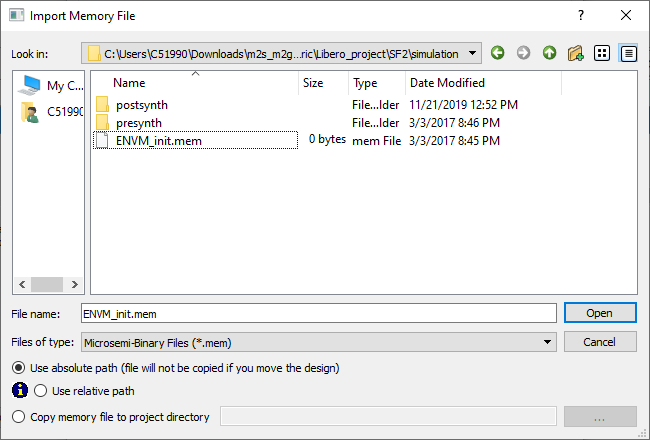

### Design Initialization Tab

**Design Initialization** is the first tab in the Configure Design<br /> Initialization Data and Memories tool. The following topics describe the options in this<br /> tab.

<br />

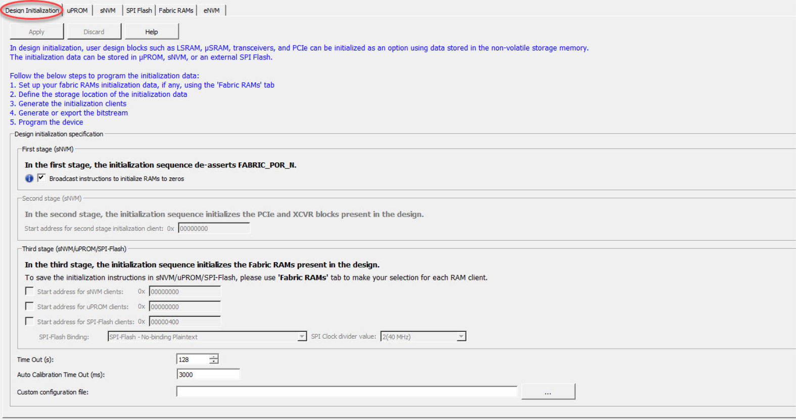

<br />

#### First Stage \(sNVM\)

In the first stage, the initialization sequence de-asserts the FABRIC\_POR\_N signal and starts the<br /> I/O calibration routine. The initialization client for this stage is always placed in<br /> sNVM. It uses the last two pages of the sNVM memory space. There is one configuration<br /> option for this stage.

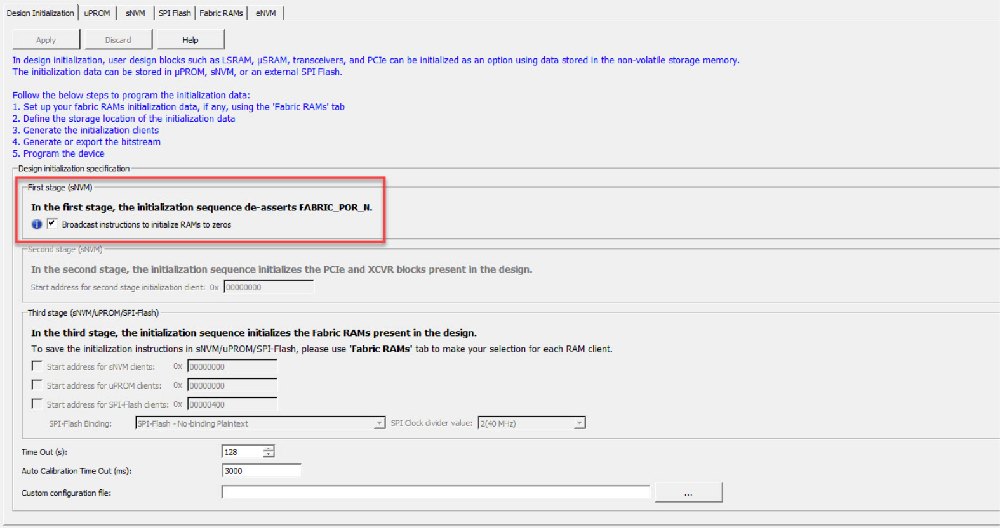

|Configuration Option|Description|
|--------------------|-----------|
|Broadcast instructions to initialize RAMs to zeros|Affects all LSRAM and uSRAM blocks in the device. Selecting this<br /> option initializes all RAM blocks to zeros before FABRIC PoR is<br /> asserted. To accommodate the additional instructions, the sNVM start<br /> page will be 202. To initialize the individual logical RAM blocks to<br /> zeros without using this global option, select the **Content filled with 0s** option in the Add Data Storage Client<br /> dialog box, and then wait for the corresponding RAM INIT complete signal<br /> before accessing those RAMs \(see the [PolarFire Family Power-Up and Resets User Guide](https://ww1.microchip.com/downloads/aemDocuments/documents/FPGA/ProductDocuments/UserGuides/Microchip_PolarFire_FPGA_and_PolarFire_SoC_FPGA_Power_Up_and_Reset_User_Guide_VC.pdf), which describes the INIT DONE/COMPLETE signals\). If this<br /> global option is not selected, the sNVM start page will be<br /> 219.|

#### Second Stage \(sNVM\)

In the second stage, the initialization sequence initializes the PCIe and XCVR blocks present in the design. This stage is grayed out if the design does not have PCIe or XCVR Blocks.

The initialization client for this stage is named INIT\_STAGE\_2\_SNVM\_CLIENT. It is always placed in sNVM at the start address of your choice. The start address can be at the start of an sNVM page \(page boundary\) only.

Each sNVM page is 256 bytes in size, so the valid start hexadecimal addresses are 0x0, 0x100, 0x200, and so on. Only the plaintext non-authenticated client is supported for initialization.

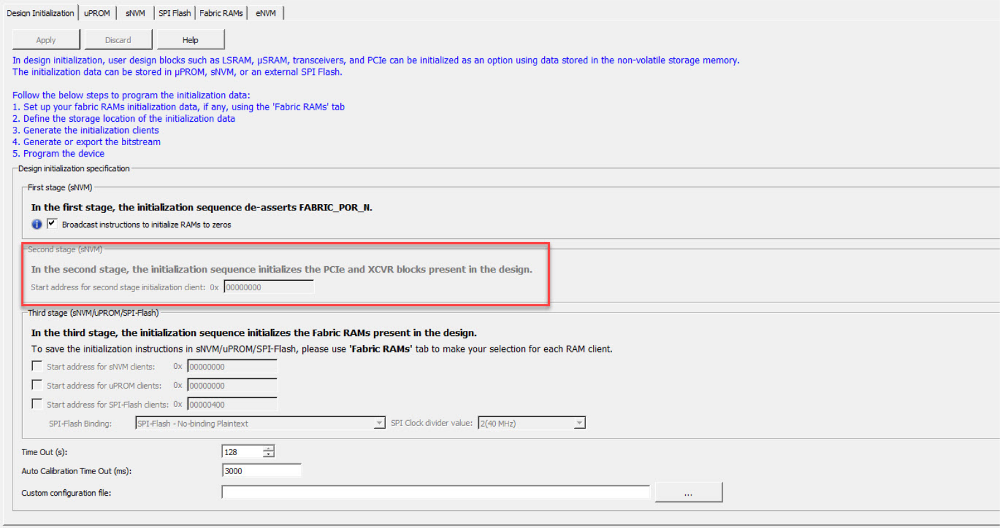

#### Third Stage \(uPROM/sNVM/SPI Flash\)

In the third stage, the initialization sequence initializes the Fabric RAMs present in the design. The initialization client for this stage is placed in the memory type of your choice \(uPROM/sNVM/External SPI Flash\). If the design does not have any Fabric RAMs, this stage of the initialization sequence is not needed and is grayed out. Each logical RAM block can be initialized from any of the three memory types. Use the **Fabric RAMs** configuration tab to assign the memory type to the logical RAM blocks.

Only the memory types used by the design, as defined in the **Fabric RAMs** configuration tab, are selected and enabled.

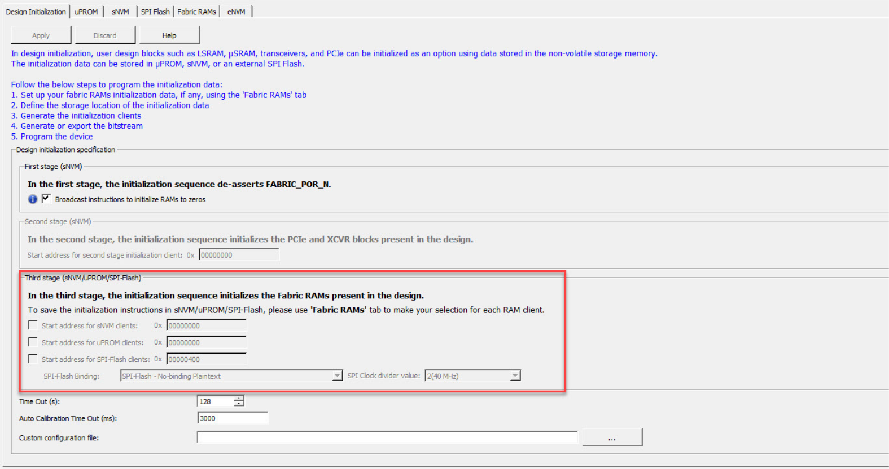

The following table describes the types of memory.

<table id="TABLE_R4T_ZW3_K4B"><thead><tr><th>

Memory Type

</th><th>

Description

</th></tr></thead><tbody><tr><td>

μPROM

</td><td>

Name of the initialization client is INIT\_STAGE\_3\_UPROM\_CLIENT. Its start<br /> address is your choice, subject to the limitation that the start address can only be<br /> at the start of a uPROM block. Each μPROM block is 256 words, so the allowed<br /> hexadecimal start addresses are 0x0, 0x100, 0x200, and so on.

</td></tr><tr><td>

sNVM

</td><td>

If there are no PCIe or XCVR blocks used in the design, the name of the sNVM<br /> initialization client for this stage is INIT\_STAGE\_3\_SNVM\_CLIENT. If there are PCIe<br /> or XCVR blocks used in the design along with Fabric RAMs, the name of the sNVM<br /> initialization client for this stage is INIT\_STAGE\_2\_3\_SNVM\_CLIENT, which has the<br /> initialization sequence/instructions for the PCIe or XCVR blocks followed by Fabric<br /> RAMs. Its start address is your choice, subject to the limitation that the start<br /> address can only be at the start of an sNVM page \(page boundary\). Each sNVM page is<br /> 256 bytes long, so the allowed hexadecimal start addresses are 0x0, 0x100, 0x200,<br /> and so on.

</td></tr><tr><td>

SPI-Flash

</td><td>

Name of the initialization client is INIT\_STAGE\_3\_SPIFLASH\_CLIENT.

</td></tr><tr><td>

SPI-Flash Binding

</td><td>

Four binding options are available:-   No Binding Plaintext: `<root>_uic.bin` file is a script file that can be opened to see readable text.
-   Binding Encrypted with Default Key: `<root>_uic.bin` file is encrypted with the default encryption key. The design version is displayed and can be modified from Configure Programming Options. If Default key is selected, you do not need to specify any other details.
-   Binding Encrypted with User Encryption Key 1 \(UEK1\): `<root>_uic.bin` file is encrypted with UEK1. The design version is displayed and can be modified from Configure Programming Options. You must configure SPM along with UEK1. If UEK1 is not specified, the Generate SPI Flash Image and Export SPI Flash Image steps cause an error. UEK1 can be configured using the Configure Security Tool.
-   Binding Encrypted with User Encryption Key 2 \(UEK2\): `<root>_uic.bin` file is encrypted with UEK2. The design version is displayed and can be modified from Configure Programming Options. You must configure SPM along with UEK2. If UEK2 is not specified, the Generate SPI Flash Image and Export SPI Flash Image steps cause an error. UEK2 can be configured using the Configure Security Tool.

See the following table for various combinations of bindings that are valid<br /> or invalid in relation to security options.

</td></tr><tr><td>

SPI Clock divider value

</td><td>

Clock divider value for the clock that is generated by the System Controller.<br /> Choose the value that meets the minimum clock width requirement of the external SPI<br /> Flash.Range: 1, 2, 4, 6Default: 2

</td></tr></tbody>
</table>The following table lists combinations of bitstream types and stage 3 client binding.

|Exported SPI Bitstream|Stage 3 Client Binding|Security|Security|Security|Security|
|Default|UEK1|UEK2|UEK1|UEK2|UEK1|UEK2|
|Set|Set|Unset|Set|Set|Unset|Set|
|----------------------|----------------------|--------|--------|--------|--------|
|-------|----|----|----|----|----|----|
|---|---|-----|---|---|-----|---|
|Trusted Facility|No binding|Valid|—|—|—|
|Default Security Binding|Valid|—|—|—|
|UEK1 binding|Invalid|—|—|—|
|UEK2 binding|Invalid|—|—|—|
|Update UEK1|No binding|—|Valid|Valid|—|
|Default Security Binding|—|Invalid|Invalid|—|
|UEK1 binding|—|Valid|Valid|—|
|UEK2 binding|—|Invalid|Valid|—|
|Update UEK2|No binding|—|—|Valid|Valid|
|Default Security Binding|—|—|Invalid|Invalid|
|UEK1 binding|—|—|Valid|Invalid|
|UEK2 binding|—|—|Valid|Valid|

#### Time Out\(s\)

Use the **Time Out \(s\)** drop-down list to select a time-out for completing all three stages of the initialization process. The default setting is 128, which is the maximum value.

")

#### Auto Calibration Time Out

The **Auto Calibration Time Out** value specifies the time-out before which<br /> the I/O calibration instructions must be completed. The default<br /> value is 3000 milliseconds. This time-out value applies to<br /> MPF100T, MPF200T, MPF300T, and MPF500T devices.

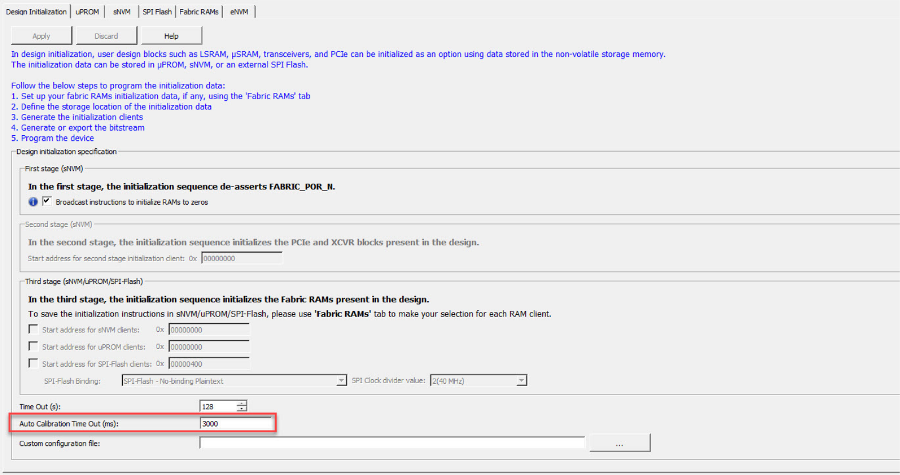

#### Custom Configuration File

The **Custom Configuration file** contains signal integrity parameters for<br /> Transceivers. Click the **Browse** button at the far right to navigate to<br /> and select a custom configuration file for Transceiver solutions.

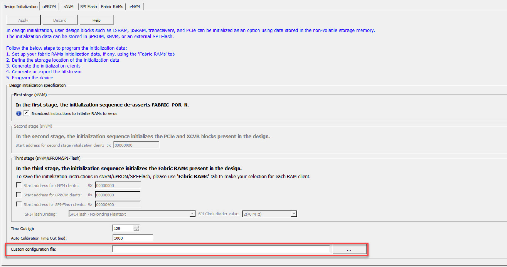

### μPROM Tab

**μPROM** is the second tab in the Configure Design Initialization Data and Memories tool. Use this tab to manage data clients targeted for μPROM memory.

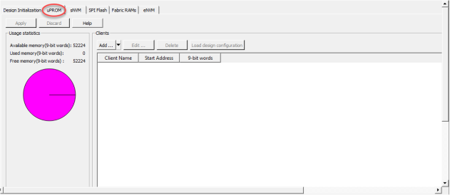

The following table describes the elements in the **μPROM** tab.

|Element|Description|
|-------|-----------|
|Add|[Adds uPROM clients](GUID-AE825DD9-DE91-4C39-95B7-F501D59B5932.md#).|
|Edit|[Edits uPROM clients](GUID-AE825DD9-DE91-4C39-95B7-F501D59B5932.md#).|
|Delete|[Deletes uPROM clients](GUID-AE825DD9-DE91-4C39-95B7-F501D59B5932.md#).|
|Load Design Configuration button|Loads the design’s original µPROM configuration file into the `<project>/component/work/UPROM.cfg` file. This button is grayed out if the design does not have an original μPROM configuration file.This configuration changes when the design is updated in the design window. If changes are made to the design configuration after you click Apply, info icons appear next to the Load design configuration button and the title of the μPROM tab.The tooltip for both icons contains the time-stamp information of the design configuration file. The icons disappear the next time you click Apply.|
|Usage Statistics pie chart|Shows memory usage for the μPROM.|

#### Adding μPROM Clients

1.  In the **uPROM** tab, click **Add**.
2.  When the Add Data Storage Client dialog box appears, complete the fields \(see the following figure and table\).
3.  Click **OK**.
4.  Click the **Apply** button. The client is added to the [uPROM clients table](GUID-AE825DD9-DE91-4C39-95B7-F501D59B5932.md#).


<table id="TABLE_SBF_FJD_L4B"><thead><tr><th>

Field

</th><th>

Description

</th></tr></thead><tbody><tr><td>

Client name

</td><td>

Name of the uPROM client to be added.

</td></tr><tr><td>

Content from file

</td><td>

Navigate to and select a file whose content will be used to fill the uPROM.

</td></tr><tr><td>

Format

</td><td>

Memory file types. Choices are:-   Micro Binary 9-bit \(*default*\)
-   Micro Binary 32-bit
-   Intel-Hex
-   Motorola-S
-   Simple-Hex

</td></tr><tr><td>

Content filled with 0s

</td><td>

Populates the uPROM with zeros.

</td></tr><tr><td>

Start address

</td><td>

Start address, in hexadecimal notation, of the uPROM client. If there are multiple uPROM<br /> clients, the start address must not overlap; otherwise, a warning<br /> message appears.Range: 0–CBFF \(Hex\)

</td></tr><tr><td>

Number of 9-bit words

</td><td>

Number, in decimal notation, of 9-bit words to populate the uPROM. If the number of 9-bit words exceeds the memory size of the uPROM, an “out-of-bounds” warning message appears.

</td></tr><tr><td>

Use for initialization of RAMs

</td><td>

Disabled and unavailable.

</td></tr><tr><td>

Use content for simulation

</td><td>

Disabled and unavailable.

</td></tr></tbody>
</table>##### uPROM Clients Table

The uPROM clients table shows the uPROM clients you add.

Each uPROM client appears on its own row. After you add a uPROM client, you can select it in this table to [edit](GUID-AE825DD9-DE91-4C39-95B7-F501D59B5932.md#) or [delete](GUID-AE825DD9-DE91-4C39-95B7-F501D59B5932.md#) the client.

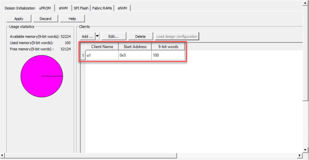

|Column|Description|
|------|-----------|
|Client Name|Name you gave to the client.|
|Start Address|Starting address, you gave to the client.|
|9-bit words|Number of 9-bit words in the client.|

#### Editing uPROM Clients

If you need to change the settings for a uPROM client, you can edit the client.

To edit a uPROM client:

1.  In the table of the **uPROM** tab, perform one of the following steps:
    -   Double-click the client you want to edit.
    -   Click the client you want to edit, and click the **Edit** button.
    -   Right-click the client you want to edit and select **Edit**.
2.  When the Edit Data Storage Client dialog box appears, complete the fields \(see the following table\).
3.  Click **OK**.
4.  Click the **Apply** button.

    |Field|Description|
    |-----|-----------|
    |Client name|Read-only field that shows the name of the uPROM client.|
    |Content from file|Navigate to and specify a file whose content will be used to fill the uPROM.|
    |Content filled with 0s|Populates the uPROM with zeros.|
    |Start address|Start address, in hexadecimal notation, of the uPROM client. If there are multiple uPROM<br /> clients, the start address must not overlap; otherwise, a<br /> warning message appears.Range: 0–CBFF \(Hex\)|
    |Number of 9-bit words|Number, in decimal notation, of 9-bit words to populate the uPROM. If the number of 9-bit words exceeds the memory size of the uPROM, an “out-of –bounds” warning message appears.|
    |Use for initialization of RAMs|Disabled and unavailable.|
    |Use content for simulation|Disabled and unavailable.|


#### Deleting uPROM Clients

If you no longer need a uPROM client, you can delete the client.

CAUTION:

A warning message does not appear before you delete a client. Therefore, ensure you no longer need a client before you delete it.

To delete a uPROM client:

1.  In the table at the bottom of the **uPROM** tab, perform one of the following steps:
    -   Click the client you want to delete, and click the **Delete** button.
    -   Right-click the client you want to delete and select **Delete**.
2.  Click the **Apply** button.

### sNVM Tab

**sNVM** is the third tab in the Configure Design Initialization Data and Memories tool. Use this tab to manage data clients targeted for sNVM memory. The table in the tab is automatically populated if **Broadcast instructions to initialize RAM’s to zero’s** is checked in the **Design Initialization** tab.

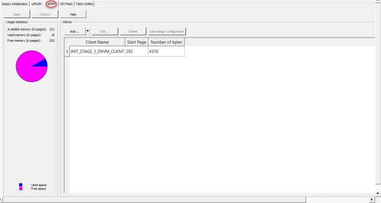

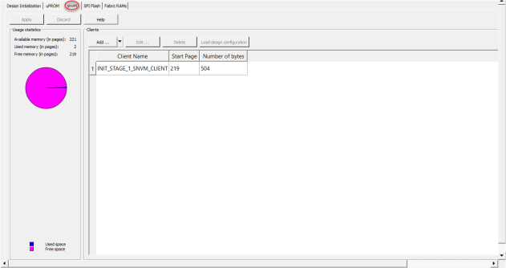

The following table describes the elements in the **sNVM** tab.

|Element|Description|
|-------|-----------|
|Add|[Adds sNVM clients](GUID-AE825DD9-DE91-4C39-95B7-F501D59B5932.md#).|
|Edit|[Edits sNVM clients](GUID-AE825DD9-DE91-4C39-95B7-F501D59B5932.md#).|
|Delete|[Deletes sNVM clients](GUID-AE825DD9-DE91-4C39-95B7-F501D59B5932.md#).|
|Load Design Configuration|Loads the design’s original sNVM configuration file into the<br /> `<project>/component/work/sNVM.cfg` file.<br /> This button is grayed out if the design does not have an<br /> original sNVM configuration file.This configuration<br /> changes when the design is updated in the design window. If<br /> changes are made to the design configuration after you click<br /> Apply, info icons appear next to the<br /> Load design configuration button and the title of the sNVM<br /> tab.The tooltip for both icons contains the time-stamp<br /> information of the design configuration file. The icons<br /> disappear the next time you click<br /> Apply.|
|Usage Statistics pie chart|Shows available, used, and free memory, in pages, for all sNVM clients.|

#### Adding sNVM Clients

1.  In the **sNVM** tab, click the **Add** drop-down list, and then select the client you want to add \(see the following figure\).


2.  Complete the fields in the dialog box, and then click **OK** \(see the following sections\).
3.  Click the **Apply** button. The client is added to the [sNVM clients table](GUID-AE825DD9-DE91-4C39-95B7-F501D59B5932.md#).

##### Settings for Add PlainText and Add CipherText Clients

In the **sNVM** tab, from **Add** drop-down list, select<br /> **Add PlainText NonAuthenticated Client** to add the client to<br /> the [sNVM clients table](GUID-AE825DD9-DE91-4C39-95B7-F501D59B5932.md#).

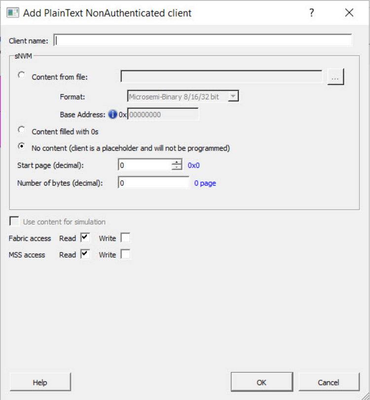

<table id="TABLE_YNL_BS2_L4B"><thead><tr><th>

Field

</th><th>

Description

</th></tr></thead><tbody><tr><td>

Client name

</td><td>

Name of the sNVM client to be added.

</td></tr><tr><td>

Content from file

</td><td>

Navigate to and specify a file whose content will be used to fill the sNVM.**Note:** If you select the Intel-HEX format, the Base address specified is subtracted from user address records. Intel-Hex files have Extended Linear and Extended Segment addresses. The Complete Starting address of the Linear or Segment address in the Hex file must be specified. For example, if the Intel-Hex file has the Extended Linear address 2022, specify the base address 20220000.

</td></tr><tr><td>

Content filled with 0s

</td><td>

Populates the sNVM with zero.

</td></tr><tr><td>

No content

</td><td>

Client is a placeholder and will not be programmed.

</td></tr><tr><td>

Start page

</td><td>

Start page, in decimal notation, of the sNVM client. sNVM client address starts at page<br /> boundaries. If there are multiple sNVM clients, their start page cannot<br /> be the same; otherwise, a warning message appears. Range: 0–220<br /> \(decimal\)

</td></tr><tr><td>

Number of bytes

</td><td>

Total number, in decimal notation, of bytes to populate the sNVM. If the number of bytes<br /> exceeds the memory size of the sNVM, an out-of–bounds warning message<br /> appears. Range: 1–47376

</td></tr><tr><td>

Use content for simulation

</td><td>

Check if this client must be loaded for the simulation run.

</td></tr><tr><td>

Fabric access

</td><td>

Allows you to read from Fabric, write to Fabric, or both.

</td></tr><tr><td>

MSS access

</td><td>

Allows you to read from MSS, write to MSS, or both.

</td></tr></tbody>
</table>##### Settings for Boot Mode 2 Clients \(PolarFire SoC\)

PolarFire SoC supports Boot Mode 2. In this boot mode, you specify the start page in sNVM. All authenticated/encrypted clients will share the same USK. If you add authenticated/encrypted clients, you must create a USK client to specify the USK.

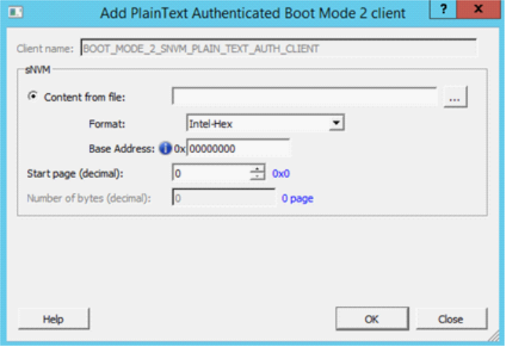

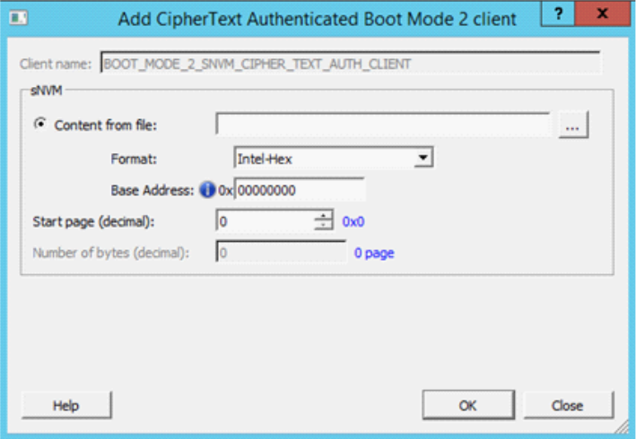

<table id="TABLE_THX_12T_L4B"><thead><tr><th>

Field

</th><th>

Description

</th></tr></thead><tbody><tr><td>

Client name

</td><td>

Read-only field that shows the name of the sNVM client.

</td></tr><tr><td>

Content from file

</td><td>

Navigate to and specify a file whose content will be used to fill the sNVM.**Note:** If you select the Intel-HEX format, the Base address specified is subtracted from user address records. Intel-Hex files have Extended Linear and Extended Segment addresses. The Complete Starting address of the Linear or Segment address in the Hex file must be specified. For example, if the Intel-Hex file has the Extended Linear address 2022, specify the base address 20220000.

</td></tr><tr><td>

Format

</td><td>

Memory file types. Choice is Intel-Hex. The Intel-Hex file is generated using Soft Console.

</td></tr><tr><td>

Base Address

</td><td>

Base address that is subtracted from the user address records for Intel-Hex files.

</td></tr><tr><td>

Start page

</td><td>

Start page, in decimal notation, of the sNVM client. sNVM client address starts at page<br /> boundaries. If there are multiple sNVM clients, their start page cannot<br /> be the same; otherwise, a warning message appears. Range: 0–220<br /> \(decimal\)

</td></tr><tr><td>

Number of bytes

</td><td>

Read-only field that shows the total number of bytes to populate the sNVM. The value is shown<br /> in decimal notation. If the number of bytes exceeds the memory size of<br /> the sNVM, an out-of–bounds warning message appears. Range:<br /> 1–47376

</td></tr></tbody>
</table>##### Settings for Add USK Clients

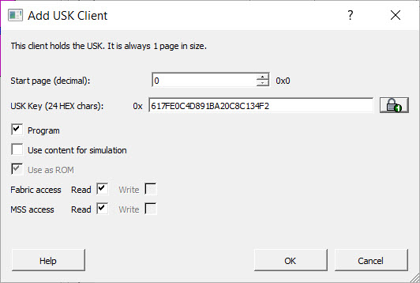

|Field|Description|
|-----|-----------|
|Start page|Start page can vary between 0 and 220.|
|USK Key|USK key \(24 hexadecimal characters\). A random key can be generated by clicking the padlock icon to the right of this field.|
|Reprogram|Check if this client must be programmed.|
|Use content for simulation|Check if this client must be loaded for the simulation run.|
|Use as ROM|Check if this client must be used as ROM.|
|Fabric Access|Allows you to read from Fabric.|
|MSS Access|Allows you to read from MSS.|

**Note:**

Atleast one of Fabric or MSS Access should be selected for Read, else a DRC error will be generated as "**Atleast Fabric or MSS should be selected for Read**".

##### sNVM Clients Table

The sNVM clients table shows the sNVM clients you add.

Each sNVM client appears on its own row. After you add an sNVM client, you can select it in this table to edit or delete the client.

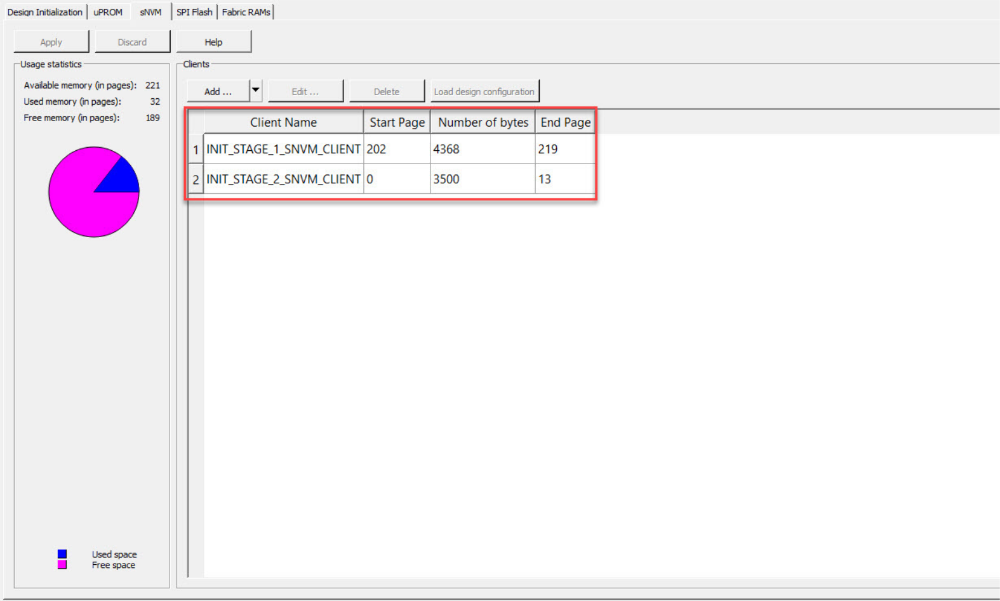

The following table describes the columns in the sNVM client's table.

|Column|Description|
|------|-----------|
|Client Name|Name you gave to the client.|
|Start Page|Starting page, you gave to the client.|
|Number of bytes|Number of bytes in the client.|
|End Page|Ending page that Libero SoC determined based on the start page you provided.|

#### Editing sNVM Clients

If you need to change the settings for an sNVM client, you can edit the client.

To edit an sNVM client:

1.  In the table of the **sNVM** tab, perform one of the following steps:
    -   Double-click the client you want to edit.
    -   Click the client you want to edit, and click the **Edit** button.
    -   Right-click the client you want to edit and select **Edit**.
2.  When the dialog box appears, complete the fields \(see [Settings for Add PlainText and Add CipherText Clients](GUID-AE825DD9-DE91-4C39-95B7-F501D59B5932.md#), [Settings for Boot Mode 2 Clients](GUID-AE825DD9-DE91-4C39-95B7-F501D59B5932.md#), or [Settings for Add USK Clients](GUID-AE825DD9-DE91-4C39-95B7-F501D59B5932.md#)\).
3.  Click **OK**.
4.  Click the **Apply** button.

#### Deleting sNVM Clients

If you no longer need an sNVM client, you can delete the client.

CAUTION:

A warning message does not appear before you delete a client. Therefore, ensure you no longer need a client before you delete it.

To delete an sNVM client:

1.  In the table at the bottom of the **sNVM** tab, perform one of the following steps:
    -   Click the client you want to delete, and click the **Delete** button.
    -   Right-click the client you want to delete and select **Delete**.
2.  Click the **Apply** button.

### SPI Flash Tab

**SPI Flash** is the fourth tab in the Configure Design Initialization Data<br /> and Memories tool. Use this tab to configure SPI Flash, select the memory size, and<br /> enable auto updating for parts of the SPI Flash configuration. The configuration is<br /> saved in the `spiflash.cfg` file in the Libero design implementation<br /> folder.

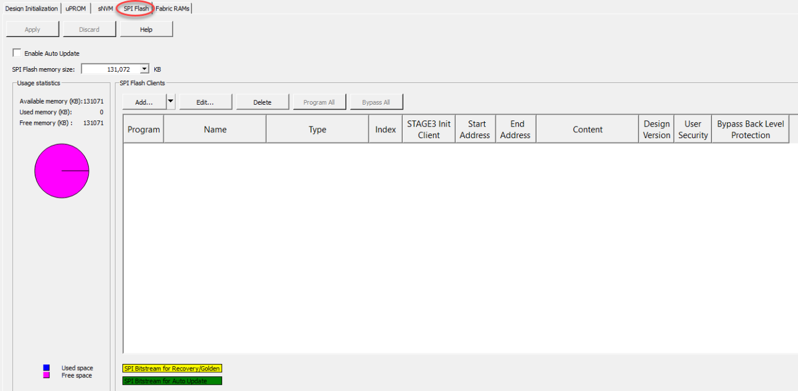

The following table describes the elements in the **SPI Flash** tab.

|Element|Description|
|-------|-----------|
|Add button|[Adds SPI Flash clients](GUID-AE825DD9-DE91-4C39-95B7-F501D59B5932.md#).|
|Edit button|[Edits SPI Flash clients](GUID-AE825DD9-DE91-4C39-95B7-F501D59B5932.md#).|
|Delete button|[Deletes SPI Flash clients](GUID-AE825DD9-DE91-4C39-95B7-F501D59B5932.md#).|
|<br /> Program All<br />|<br /> This option selects all clients for programming at once. It is<br /> enabled when there is at least one unselected client.<br />|
|<br /> Bypass All<br />|<br /> This option unselects all clients, except for STAGE 3<br /> Initialization client. It is enabled if there is at least one<br /> client besides the STAGE 3 Initialization that is selected for<br /> programming \(STAGE 3 Initialization client must always be<br /> programmed\).<br />|
|Enable Auto Update check<br /> box|<br /> Enables auto update on the target device. The bitstream generated<br /> in Libero enables this feature.<br /> If you check this option, the SPI Bitstream for the Auto update<br /> client can be added. Auto update is set to index 1<br /> automatically.<br />|
|SPI Flash memory size|Selects the memory size, in<br /> KB, for the SPI Flash.|
|Usage Statistics pie<br /> chart|Shows available, used, and<br /> free memory, in KB, for all SPI Flash clients.|

#### Adding SPI Flash Clients

1.  In the **SPI Flash** tab, click the **Add** drop-down list, and then select the client you want to add \(see the following figure\).

    <br />

    

    <br />

2.  Complete the fields in the dialog box \(see the following sections\).
3.  Click **OK** to add the client to the [SPI Flash clients table](GUID-AE825DD9-DE91-4C39-95B7-F501D59B5932.md#).
4.  Click the **Apply** button to save the configuration.


##### SPI Flash Clients Table

The SPI Flash clients table shows the SPI Flash clients you add.

Each SPI Flash client appears on its own row. After you add a SPI Flash client, you can select it in this table to [edit](GUID-AE825DD9-DE91-4C39-95B7-F501D59B5932.md#) or [delete](GUID-AE825DD9-DE91-4C39-95B7-F501D59B5932.md#) the client.

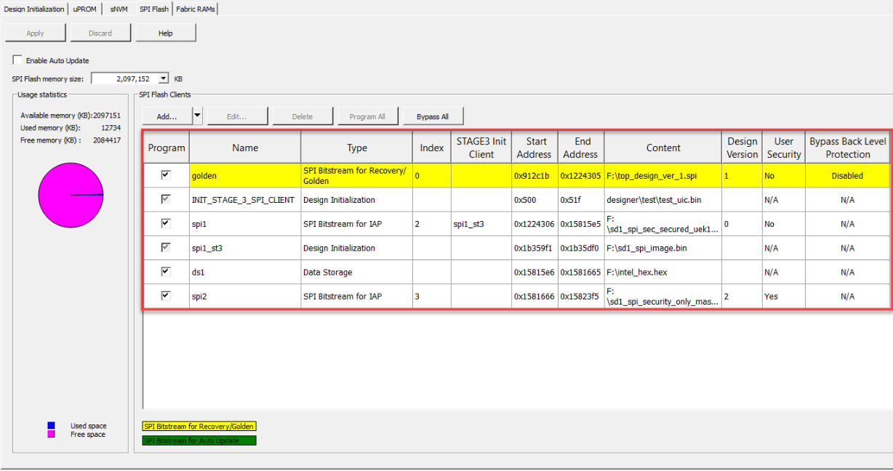

<table id="TABLE_AFL_X3S_L4B"><thead><tr><th>

Column

</th><th>

Description

</th></tr></thead><tbody><tr><td>

Program

</td><td>

Check boxes for selecting clients that will be enabled or disabled for programming. Clients whose content is filled with 1s cannot be enabled for programming.

</td></tr><tr><td>

Name

</td><td>

Name you gave to the client.

</td></tr><tr><td>

Type

</td><td>

Type of client. Choices are:-   SPI Bitstream for Recovery/Golden
-   SPI Bitstream for IAP
-   SPI Bitstream for Auto Update
-   Data Storage
-   Design Initalization

</td></tr><tr><td>

Index

</td><td>

-   Index 0 is reserved for SPI Bitstream for Recovery/Golden.
-   Index 1 is reserved for auto update.

The index for an IAP client can be in the range of 2 - 255.

</td></tr><tr><td>

STAGE3 INIT Client

</td><td>

If SPI Flash has a STAGE3 Initialization client, this columns shows the name of the client.

</td></tr><tr><td>

Start Address

</td><td>

Starting address, you gave to the client.

</td></tr><tr><td>

End Address

</td><td>

Ending address that Libero SoC determined based on the start address you provided.

</td></tr><tr><td>

Content

</td><td>

Choices are:-   .spi file: SPI bitstream clients.
-   intel-hex \(.hex or .ihx\): Data storage clients.
-   Binary \(\*.bin\): Data storage or design initialization client.

</td></tr><tr><td>

Design Version

</td><td>

Client design version.

</td></tr><tr><td>

User Security

</td><td>

Denotes where the SPI Bitstream client programs custom user security

</td></tr><tr><td>

Bypass Back LevelProtection for Recovery/Golden bitstream

</td><td>

This feature is enabled for only the SPI Bitstream clients for Recovery/Golden.

</td></tr></tbody>
</table>##### Settings for Add SPI Bitstream Client

Observe the following guidelines while using a SPI file generated with Libero 2022.2 or later version to create or edit a SPI bitstream client:

-   If you use a SPI file with custom security to create or edit the client, an error message tells you that the SPI file cannot contain security.
-   The SPI bitstream file used for SPI bitstream client must match the Libero target device. A SPI bitstream file from one family or device cannot be used to create or edit a client for another family or device. If you try to do so, an error message tells you that your current device does not match the SPI file.


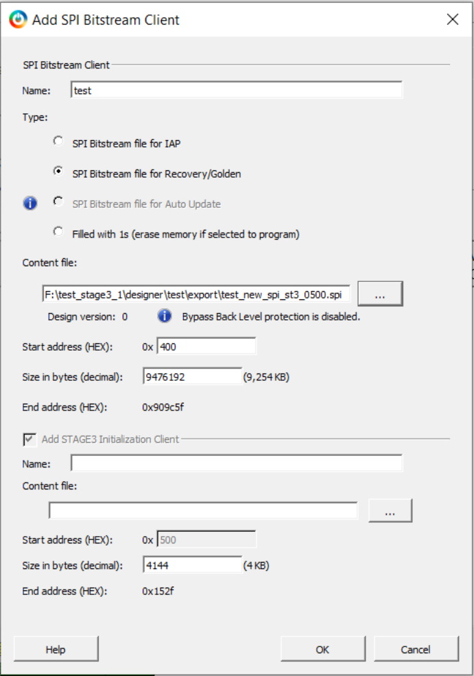

<table id="TABLE_QFJ_JTJ_L4B"><thead><tr><th>

Client

</th><th>

Guideline

</th></tr></thead><tbody><tr><td>

Name

</td><td>

Name of the SPI bitstream client.

</td></tr><tr><td>

Type

</td><td>

Type of the SPI bitstream client. The following are the choices.-   SPI Bitstream Client for IAP: Adds a SPI Client for IAP. The total number of SPI Bitstream Clients allowed including Recovery/Golden and Auto Update Clients is 255. Index range: 2–255

-   SPI Bitstream Client for Recovery/Golden: Highlighted in yellow in the client table in this tab. Required if a SPI Bitstream is added. There can be only one SPI Bitstream configured as Recovery/Golden. An error message appears if none is configured or more than one is configured. Index 0 is reserved for this client.

    -   If Auto Update is enabled, then the SPI Bitstream Client for Recovery/Golden must have a Design version smaller than the Design version for the SPI Bitstream Client for Auto update.
    -   Do not use the master file for Recovery/Golden client with IAP.
    -   If Back Level Protection is enabled in the Configure Security tool, then Programming Recovery fails if the Back Level version programmed in the device is greater than or equal to the Design version of the SPI Bitstream Client for Recovery/Golden.
    -   To allow for programming Recovery to pass, import a Bitstream that has been exported with the Bypass Back Level Protection option.
**Note:** Bypass Back Level protection feature is supported only for SPI Bitstream clients for Recovery/Golden.

-   SPI Bitstream Client for Auto Update: In this tab, highlighted in green in the client table. To add a SPI Client for Auto update, check the Enable Auto Update check box in this tab. This client is optional. The Design version of this client must be greater than the Design version for the SPI Bitstream Client for Recovery/Golden. Index 1 is reserved for this client.

**Note:** The tool rejects a Bitstream file with Bypass Back Level Protection enabled for this type of client.

-   Filled with 1s: Populates the SPI bitstream client with one’s.

</td></tr><tr><td>

Content file

</td><td>

Choice is spi file: SPI Bitstream clients.

</td></tr><tr><td>

Start address

</td><td>

Start address, in hexadecimal notation, of the SPI bitstream client.

</td></tr><tr><td>

Size in bytes

</td><td>

Size \(in bytes\) of the SPI bitstream client.

</td></tr><tr><td>

End address

</td><td>

Read-only field that shows the end address in hexadecimal notation.

</td></tr><tr><td>

Add STAGE3 Initialization Client

</td><td>

If the SPI file was generated with Libero® v2021.2, then this check box is checked or unchecked automatically, based on data from the SPI Bitstream content file. If a SPI file was generated with Libero versions earlier than v2021.2, you can add STAGE3 init data manually by checking this option.

</td></tr><tr><td>

Name

</td><td>

If Add STAGE3 Initialization Client is checked, enter a name for the STAGE3 init client.

</td></tr><tr><td>

Content file

</td><td>

If Add STAGE3 Initialization Client is checked, select the STAGE3 Initialization client content file. The file must be in `.bin` format.

</td></tr><tr><td>

Start address

</td><td>

If Add STAGE3 Initialization Client is checked, and the SPI file was generated with Libero v2021.2, the start address, in hexadecimal notation, of the STAGE3 Initialization client is populated automatically based on the data from the SPI file. Otherwise, you must enter the start address manually.**Note:** To prevent conflicts, the tool checks that no other SPI Flash clients have the same start address.

</td></tr><tr><td>

Size in bytes

</td><td>

Shown automatically after the content file is loaded. The size is based on the size of the content file. You can increase this value if desired.

</td></tr><tr><td>

End address

</td><td>

If Add STAGE3 Initialization Client is checked, then this read-only field shows the end address in hexadecimal notation of the STAGE3 Initialization client.

</td></tr></tbody>
</table>##### Settings for Add Data Storage Client


<table id="TABLE_AWW_XS1_M4B"><thead><tr><th>

Client

</th><th>

Guideline

</th></tr></thead><tbody><tr><td>

Name

</td><td>

Name of the SPI flash data storage client

</td></tr><tr><td>

Content

</td><td>

The following are the choices.-   Intel: Hex Files \(`*.hex *.ihx`\).
-   Binary \(`*.bin`\).
-   Filled with 1s: Populates the data storage client with one’s.

</td></tr><tr><td>

Start address

</td><td>

Start address, in hexadecimal notation, of the data storage<br /> client.

</td></tr><tr><td>

Size in bytes

</td><td>

Size of byte in decimal notation, of the data storage<br /> client.

</td></tr><tr><td>

End Address

</td><td>

Shows the end address of the client based on the value<br /> entered in the Size in Bytes field.

</td></tr></tbody>
</table>##### Automatically Generated Design Initialization Client

The Generate Design Initialization tool adds a Design Initialization client automatically to the **SPI Flash** tab. Double clicking this client displays the dialog box shown in the following figure.

For more information about the Initialization clients that can be generated, see [Generating Initialization Clients \(PolarFire\)](GUID-AE825DD9-DE91-4C39-95B7-F501D59B5932.md#).

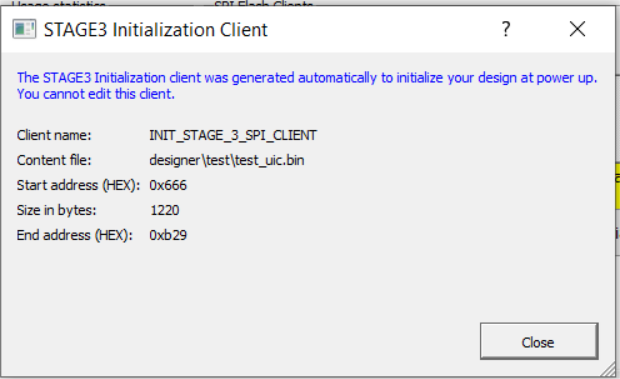

#### Editing SPI Flash Clients

If you need to change the settings for a SPI Flash client, you can edit the client.

To edit a SPI Flash client:

1.  In the table of the **SPI Flash** tab, perform one of the following steps:
    -   Double click the client you want to edit.
    -   Click the client you want to edit, and click the **Edit** button.
    -   Right click the client you want to edit and select **Edit**.
2.  When the dialog box appears, complete the fields \(see [Settings for Add SPI Bitstream Client](GUID-AE825DD9-DE91-4C39-95B7-F501D59B5932.md#) or [Settings for Add Data Storage Client](GUID-AE825DD9-DE91-4C39-95B7-F501D59B5932.md#)\).
3.  Click **OK**.
4.  Click the **Apply** button.

#### Deleting SPI Flash Clients

If you no longer need a SPI Flash client, you can delete the client.

CAUTION:

A warning message does not appear before you delete a client. Therefore, ensure you no longer need a client before you delete it.

To delete a SPI Flash client:

1.  In the table at the bottom of the **SPI Flash** tab, perform one of the following steps:
    -   Click the client you want to delete, and click the **Delete** button.
    -   Right click the client you want to delete and select **Delete**.
2.  Click the **Apply** button.

### Fabric RAMs Tab

The **Fabric RAMs** tab allows you to select initialization options for Dual-Port SRAM, Two-Port SRAM, and μSRAM memory blocks in your design.

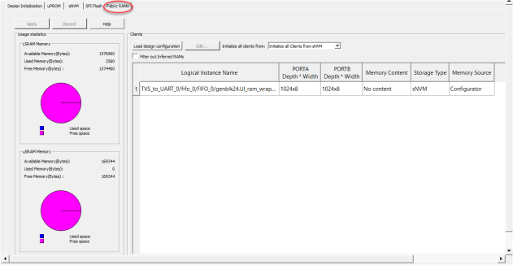

The following table describes the elements in the **Flash RAMs** tab.

|Element|Description|
|-------|-----------|
|Load design configuration button|Resets all Fabric RAM clients to the initial configuration that was in effect the first time you clicked Apply. Clicking this button overrides any subsequent commands you applied and resets the Fabric RAM client's table.|
|Edit button|[Edits Fabric RAMs clients](GUID-AE825DD9-DE91-4C39-95B7-F501D59B5932.md#).|
|Initialize all clients from drop-down list|[Initializes clients from SmartDesign](GUID-AE825DD9-DE91-4C39-95B7-F501D59B5932.md#).|
|Filtered out Inferred RAMs check box|Filters the inferred RAMs and shows only the RAMs that were generated using the Configurator.|
|Usage Statistics, LSRAM pie chart|Shows available, used, and free memory, in bytes, for large static random access memory \(LSRAM\).|
|Usage Statistics, uSRAM pie chart|Shows available, used, and free memory, in bytes, for micro SRAMs \(μSRAM\).|

#### Initializing Fabric RAM Clients

1.  In the **Fabric RAMs** tab, click the **Initialize all clients from** drop-down list, and then select the client you want to initialize \(see the following figure\). Your selection appears in the **Storage Type** column in the [Fabric RAMS client table](GUID-AE825DD9-DE91-4C39-95B7-F501D59B5932.md#).

    **Note:** Selecting **User Selection** indicates that each Fabric RAM client will be configured separately.

    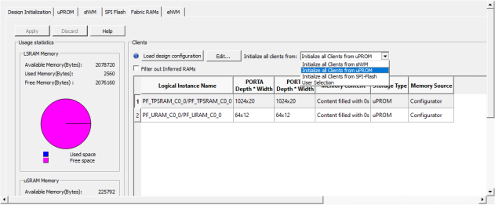


##### Fabric RAMs Clients Table

The Fabric RAMs clients table shows the Fabric RAM clients you initialize.

Each Fabric RAM client appears on its own row. After you add a Fabric RAM client, you can select<br /> it in this table to [edit the client](GUID-AE825DD9-DE91-4C39-95B7-F501D59B5932.md#).

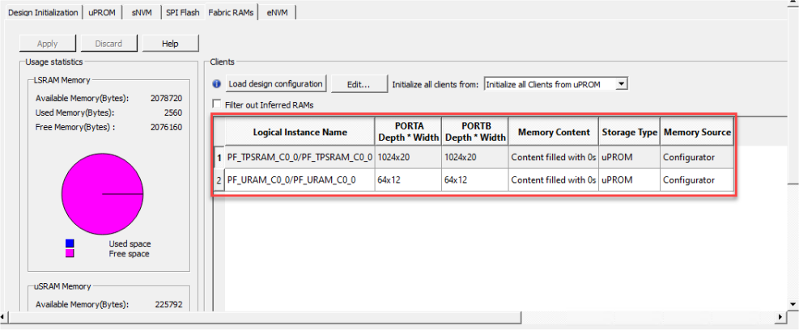

<br />

|Column|Description|
|------|-----------|
|Logical Instance Name|Name of the logical instance that indicates the memory<br /> type.|
|PortADepth\*Width|Depth and width of Port A.|
|PortBDepth\*Width|Depth and width of Port B.|
|Memory Content|Shows information about the content held in memory.|
|Storage Type|Storage type you selected for the client.|
|Memory Source|Shows the memory source \(for example, Synthesis, Configurator,<br /> and so on\).|

<br />

#### Editing Fabric RAM Clients

If you need to change the settings for a Fabric RAM client, you can edit the client.

To edit a Fabric RAM client:

1.  In the table of the **Fabric RAM** tab, perform one of the following steps:
    -   Double-click the client you want to edit.
    -   Click the client you want to edit, and click the **Edit** button.
    -   Right-click the client you want to edit and select **Edit**.
2.  When the Edit Fabric RAM Initialization dialog box appears, complete the fields \(see the following figure and table\).
3.  Click **OK**.
4.  Click the **Apply** button.

    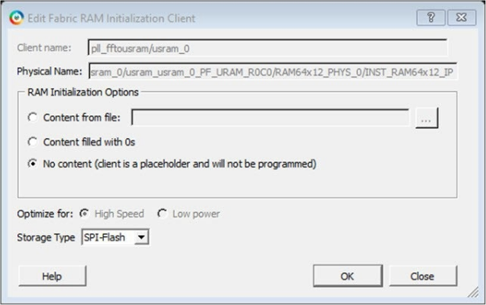

<table id="TABLE_UBZ_2HK_L4B"><thead><tr><th>

Option

</th><th>

Description

</th></tr></thead><tbody><tr><td>

Client name

</td><td>

Read-only field that shows the name of the client.

</td></tr><tr><td>

Physical Name

</td><td>

Read-only field that shows the physical name of the client.

</td></tr><tr><td>

RAM Initialization Options

</td><td>

Choices are:-   Content from file: Click the Browse button to go to the location of a memory file, and then import the file to the memory block. By default, the same memory file specified in the memory configurator is used. Supported memory file formats are:
    -   Intel-HEX \(`*.hex`\)
    -   Motorola \(`*.s`\)
    -   Simple-Hex \(`*.shx`\)
    -   Microsemi-Binary \(`*.mem`\)
-   Content Filled with 0s: Memory block is filled with zeros for initialization.
-   No Content: Memory block is not initialized.


</td></tr><tr><td>

Optimize for

</td><td>

Read-only field.

</td></tr><tr><td>

Storage Type

</td><td>

If you change the storage type for a client to a selection other than the one previously chosen for all clients, the Initialize all clients from value also changes. Choices are:-   sNVM \(*default*\)
-   uPROM
-   SPI-Flash


</td></tr></tbody>
</table>
### eNVM Tab \(PolarFire SoC Only\)

PolarFire SoC users can use the **eNVM** tab to manage and configure<br /> eNVM clients. Libero SoC supports 512 pages.

The procedures for adding, editing, and deleting eNVM clients are similar as those for<br /> adding, editing, and deleting sNVM clients, except that you can add only Plaintext Boot<br /> Mode 1 and Plaintext Boot Mode 3.

<br />


<br />

#### Adding eNVM Clients

<br />

1.  In the **eNVM** tab, click the **Add** drop-down list, and then select the client you want to add \(see the following figure\).

    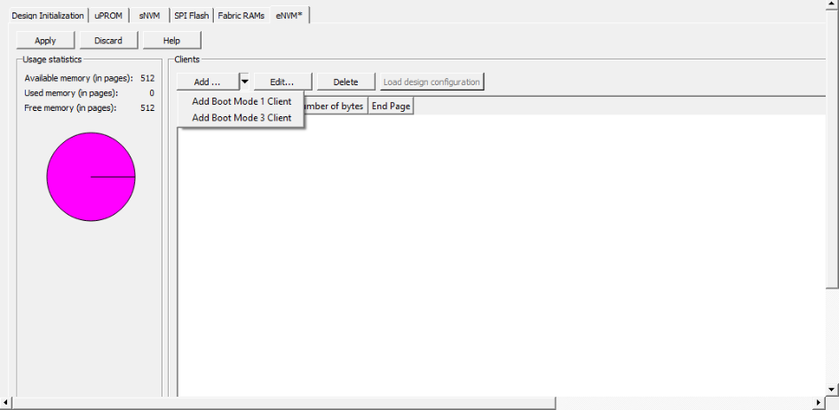

2.  Complete the fields in the dialog box, and then click **OK** \(see the following sections\).
3.  Click the **Apply** button. The client is added to the [eNVM clients table](GUID-AE825DD9-DE91-4C39-95B7-F501D59B5932.md#).

<br />

##### Settings for Boot Mode 1 Clients

In this Boot mode, the Core Complex boots directly from a specified address in eNVM with no authentication. The start page of Boot mode 1 client cannot be modified.

**Note:** The eNVM memory can have one client only: Boot Mode 1 or [Boot Mode 3](GUID-AE825DD9-DE91-4C39-95B7-F501D59B5932.md#).


<table id="TABLE_THX_12T_L4B"><thead><tr><th>

Field

</th><th>

Description

</th></tr></thead><tbody><tr><td>

Client name

</td><td>

Read-only field that shows the name of the eNVM client.

</td></tr><tr><td>

Content from file

</td><td>

Navigate to and specify a file whose content will be used to fill<br /> the eNVM.**Note:** If you select the Intel-HEX format, the Base address specified is subtracted from user address records. Intel-Hex files have Extended Linear and Extended Segment addresses. The Complete Starting address of the Linear or Segment address in the Hex file must be specified. For example, if the Intel-Hex file has the Extended Linear address 2022, specify the base address 20220000.

</td></tr><tr><td>

Format

</td><td>

Memory file types.<br /> Choice<br /> is Intel-Hex. The Intel-Hex file is generated using<br /> SoftConsole.

</td></tr><tr><td>

Base Address

</td><td>

Read-only field that shows the base address that is subtracted<br /> from the user address records for Intel-Hex files.

</td></tr><tr><td>

Start page

</td><td>

Read-only field that shows the start page, in decimal notation,<br /> of the eNVM client. eNVM client address starts at page boundaries.<br /> If there are multiple eNVM clients, then their start page cannot be<br /> the same. Otherwise, a warning message appears. Range: 0–220<br /> \(decimal\)

</td></tr><tr><td>

Number of bytes

</td><td>

Read-only field that shows the total number of bytes to populate<br /> the eNVM. The value is shown in decimal notation. If the number of<br /> bytes exceeds the memory size of the eNVM, an out-of-bounds warning<br /> message appears. Range: 1–47376

</td></tr><tr><td>

Include this client in eNVM digest calculation

</td><td>

Check to include this client in the eNVM digest calculation if<br /> the client is updated via bitstream \(JTAG, SPI slave, or SPI master<br /> programming\). Client must not be included if it is updated using any<br /> other methods. If included, this client page\(s\) will be checked<br /> while running the VERIFY\_DIGEST action.

</td></tr></tbody>
</table>##### Settings for Boot Mode 3 Clients \(PolarFire SoC\)

PolarFire SoC supports Boot mode 3. In this Boot mode, you specify the start page in eNVM. You must specify the public key X and Y. See the following table.

|Field|Description|
|-----|-----------|
|Public Key X coordinate|Secure Boot mode 3 public key elliptical curve point X coordinate|
|Public Key Y coordinate|Secure Boot mode 3 public key elliptical curve point Y coordinate|

**Note:** An eNVM client can have one client only: [Boot Mode 1](GUID-AE825DD9-DE91-4C39-95B7-F501D59B5932.md#) or Boot Mode 3.


<table id="TABLE_THX_12T_L4B"><thead><tr><th>

Field

</th><th>

Description

</th></tr></thead><tbody><tr><td>

Client name

</td><td>

Read-only field that shows the name of the eNVM client.

</td></tr><tr><td>

Content from file

</td><td>

Navigate to and specify a file whose content will be used to fill<br /> the eNVM.**Note:** If you select the Intel-HEX format, the Base address specified is subtracted from user address records. Intel-Hex files have Extended Linear and Extended Segment addresses. The Complete Starting address of the Linear or Segment address in the Hex file must be specified. For example, if the Intel-Hex file has the Extended Linear address 2022, specify the base address 20220000.

</td></tr><tr><td>

Format

</td><td>

Memory file types. Choice is Intel-Hex. The Intel-Hex file is<br /> generated using SoftConsole.

</td></tr><tr><td>

Base Address

</td><td>

Read-only field that shows the base address that is subtracted<br /> from the user address records for Intel-Hex files.

</td></tr><tr><td>

Start page

</td><td>

Read-only field that shows the start page, in decimal notation,<br /> of the eNVM client. eNVM client address starts at page boundaries.<br /> If there are multiple eNVM clients, their start page cannot be the<br /> same; otherwise, a warning message appears. Range: 0–220<br /> \(decimal\)

</td></tr><tr><td>

Number of bytes

</td><td>

Read-only field that shows the total number of bytes to populate<br /> the eNVM. The value is shown in decimal notation. If the number of<br /> bytes exceeds the memory size of the eNVM, an out-of–bounds warning<br /> message appears. Range: 1–47376

</td></tr><tr><td>

Public Key X

</td><td>

A unique secret number is generated and known only to the<br /> generated person. For more information, see [https://x9.org/](https://x9.org/).

</td></tr><tr><td>

Public Key Y

</td><td>

A number that corresponds to a private key, but does not need to<br /> be kept secret. The public key can be used to determine whether a<br /> signature is genuine without requiring the private key to be<br /> divulged. For more information, see [https://x9.org/](https://x9.org/).

</td></tr><tr><td>

Include this client in eNVM digest calculation

</td><td>

Check to include this client in the eNVM digest calculation if<br /> the client is updated via bitstream \(JTAG, SPI slave, or SPI master<br /> programming\). Client should not be included if it is updated using<br /> any other methods. If included, this client page\(s\) will be checked<br /> when running the VERIFY\_DIGEST action.

</td></tr></tbody>
</table>##### eNVM Clients Table

The following figure shows the eNVM Clients table.


The following table lists the eNVM clients you initialize. Each eNVM client appears on its own<br /> row. After you add an eNVM client, you can select it in this table to edit the<br /> client.

<br />

|Column|Description|
|------|-----------|
|Client Name|Name you gave to the client.|
|Start Page|Starting page, you gave to the client.|
|Number of bytes|Number of bytes in the client.|
|End page|Ending page that Libero SoC determined based on the start page<br /> you provided.|

<br />

#### Editing eNVM Clients

If you need to change the settings for an eNVM client, you can edit the client.

To edit an eNVM client:

1.  In the table of the **eNVM** tab, perform one of the following steps:
    -   Double-click the client you want to edit.
    -   Click the client you want to edit, and click the **Edit** button.
    -   Right-click the client you want to edit and select **Edit**.
2.  When the dialog box appears, complete the fields \(see [Settings for Boot Mode 1 Clients](GUID-AE825DD9-DE91-4C39-95B7-F501D59B5932.md#) or [Settings for Boot Mode 3 Clients \(PolarFire SoC\)](GUID-AE825DD9-DE91-4C39-95B7-F501D59B5932.md#)\).
3.  Click **OK**.
4.  Click the **Apply** button.

### Deleting eNVM Clients

If you no longer need an eNVM client, you can delete the client.

CAUTION:

A warning message does not appear before you delete a client. Therefore, ensure you no longer need a client before you delete it.

To delete an eNVM client:

1.  In the table at the bottom of the **eNVM** tab, perform one of the following steps:
    -   Click the client you want to delete, and click the **Delete** button.
    -   Right-click the client you want to delete and select **Delete**.
2.  Click the **Apply** button.

## Generating Initialization Clients \(PolarFire\)

To generate the initialization clients, perform one of the following steps in the Design Flow window:

-   Double click **Generate Design Initialization Data**.

    or

-   Right click **Generate Design Initialization Data** and choose **Run**.

Either step causes Libero SoC to perform the following actions:

-   Generates memory files corresponding to the three stages of the initialization sequence.
-   Removes all pre-existing initialization clients.
-   Creates initialization clients for each stage and places them in their target memories \(see the following table\). For more information, see [Initializing Design Blocks \(PolarFire and PolarFire SoC\)](GUID-AE825DD9-DE91-4C39-95B7-F501D59B5932.md#).

    |Stage|Description|
    |-----|-----------|
    |First stage initialization client|Client is always placed in sNVM. The default start address is<br /> either 0xca00 \(page 202\), or 0xdb00 \(page 219\) if Broadcast<br /> instructions to initialize RAM’s to zero’s is disabled in the<br /> Design Initialization tab.|
    |Second stage initialization client|Client is created when there are PCIe blocks or Transceiver<br /> blocks in the design. The client is always placed in sNVM at the<br /> start address you specified in the Design Initialization tab of<br /> the Configure Design Initialization Data and Memories<br /> tool.|
    |Third stage initialization client|Client is created only when there are Fabric RAMs in the<br /> design. The client can be placed in any uPROM, sNVM, or SPI<br /> memories at a start address you specify. You can specify the<br /> target memory for each Fabric RAM separately or for all Fabric<br /> RAMs at once in the Fabric RAMs tab, and then specify the start<br /> address of the target memory in the Design Initialization tab of<br /> the Configure Design Initialization Data and Memories tool.If<br /> there are PCIe or XCVR blocks used in the design along with<br /> Fabric RAMs with target memory type set to sNVM, a combined<br /> initialization client is created for sNVM that has the<br /> initialization sequence/instructions for the PCIe or XCVR<br /> blocks followed by Fabric RAM.|


## Update uPROM Memory Content \(RTG4\)

If you reserved space in the uPROM Configurator and want to make changes to the uPROM clients<br /> after Place and Route, use the Update uPROM Memory Content tool. After you update the<br /> uPROM memory content, you do not need to rerun Place and Route.

To update the uPROM memory content:

1.  In the Design Flow window, right-click **Update uPROM Memory Content** and choose **Configure Options**.

    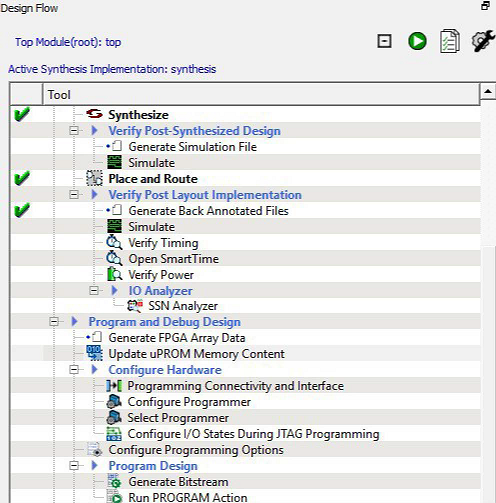

2.  When the uPROM Update Tool appears, right-click the Memory Client you want to update and choose **Edit**.

    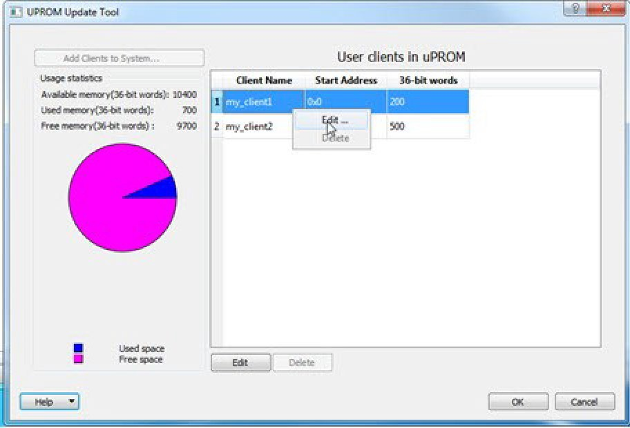

3.  When the Edit Data Storage Client dialog box appears, you can make the following changes:

    -   Rename a client
    -   Change the memory content, memory size and start address of the client
    -   Decide whether use content for simulation
    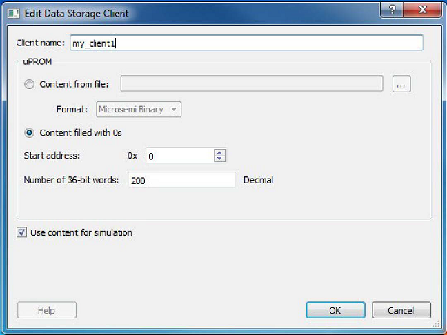

4.  When you finish, click **OK**.

**Note:** You cannot use the Update uPROM tool to add or delete a client. To add or delete a client, use the uPROM Configurator to reconfigure your clients and regenerate your uPROM component and your design.

## Update eNVM Memory Content \(SmartFusion 2 and IGLOO 2\)

The eNVM Update dialog box allows you to update your eNVM content without having to rerun Compile and Place and Route. It is useful, for example, if you reserved space in the eNVM configurator within the MSS for firmware development. Use the eNVM Update dialog box after you complete your firmware development and want to incorporate your updated firmware image file into the project.

To display the eNVM Update dialog box, right-click **Update eNVM Memory Content**and choose **Configure Options**or double-click **Update eNVM Memory Content**to display the dialog box.

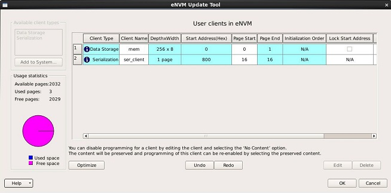

**Note:** To disable a client for programming, modify the client and select **No Content \(Client is a placeholder and will not be programmed**\). The content from the memory file, serialization data file, or auto- incremented serialization content will be preserved if you later decide to enable this client for programming. Clients disabled for programming will not be included in the generated bitstream and will not be programmed.

To delete, create, or rename an eNVM client, return to the MSS/System Builder eNVM Configurator. See the [MSS Configuration - eNVM \(User Guide\)](https://coredocs.s3.amazonaws.com/Libero/SmartFusion2MSS/MSS_ENVM/sf2_mss_envm_config_ug_1.pdf).

## Modify Data Storage Client \(SmartFusion 2 and IGLOO 2\)

The Modify Data Storage Client dialog box allows you to import a memory file, fill eNVM<br /> content with zero’s, and assign no content \(eNVM as a placeholder\). The last option<br /> excludes the client from the programming bitstream and does not program the client. You<br /> can also specify the start address where the data for that client starts, the word size,<br /> and the number of words to reserve for the data storage client.

To display the Modify Data Storage Client dialog box, double-click the storage client.

**Note:** You cannot add, delete, or rename a data storage client at this point using the Modify Data Storage Client dialog box. To make such changes, return to the MSS or System Builder eNVM configuration step.

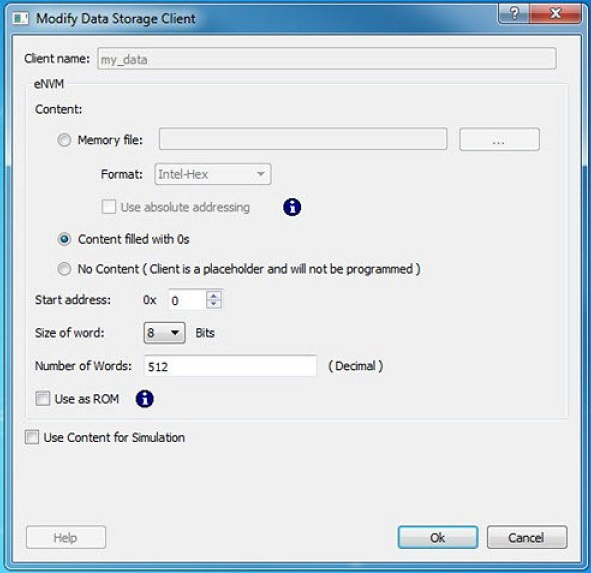

If you completed Place and Route and imported a memory file for the eNVM content, you do not have<br /> to rerun Compile or Place and Route. You can program or export your programming file<br /> directly. Programming generates a new programming file that includes your updated eNVM<br /> content.

## Modify Serialization Client \(SmartFusion 2 and IGLOO 2\)

The Modify Serialization Client dialog box allows you to import a memory file, fill eNVM content with zero’s, and assign no content \(eNVM as a placeholder\). The last option excludes the client from the programming bitstream and does not program the client. You can also specify the start address where the data for that client starts, the word size, and the number of words to reserve for the data storage client. You can also specify the start address where the data for the serialization client starts, the number of pages, and the maximum number of devices into which you want to program serialization data.

Setting a maximum number of devices to program for Serialization clients generates a programming bitstream file that has serialization content for the number of devices specified. The maximum number of devices to program must match for all serialization clients. To program a subset of the devices during production programming, use the FlashPro Express tool, which allows you to select a range of indices desired for programming for that serialization programming session. For more information, see the [Macro Library User Guide for SmartFusion2 and IGLOO2](http://coredocs.s3.amazonaws.com/Libero/2025_1/Tool/sf2_mlg.pdf).

To open the Modify Serialization Client dialog box, double-click the serialization client.

**Note:** You cannot add, delete, or rename a serialization client in the Modify serialization client dialog box. Go to the eNVM configurator inside the MSS/HPMS Configurator or the System Builder Memory page \(eNVM tab\) to make these changes.

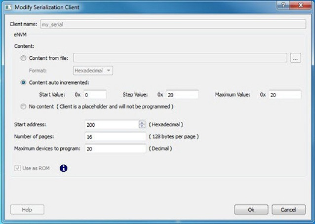

If you completed Place and Route and imported a memory file for the eNVM content, you do not have to rerun Compile or Place and Route. You can program or export your programming file directly. Programming will generate a new programming file that includes your updated eNVM content.

## Configuring I/O States During JTAG Programming

In the Libero SoC Design Flow window, expand the Program Design and double-click<br /> **Configure I/O States During JTAG Programming**. The default<br /> state for all I/Os is Tri-state.

### Specifying I/O States During Programming

Use the following procedure to specify I/O states during programming or while exporting a bitstream.

1.  Click a column header to sort the entries by that header, and then select the I/Os you want to modify.
2.  Set the I/O output state using either basic I/O settings to accept the default I/O settings for your pins \(see the following table\) or [custom I/O settings](GUID-AE825DD9-DE91-4C39-95B7-F501D59B5932.md#) to customize the settings for each pin.

    |Setting|Description|
    |-------|-----------|
    |1|I/O is set to drive out logic High.|
    |0|I/O is set to drive out logic Low.|
    |Last Known State|I/O is set to the last value that was driven out prior<br /> to entering the programming mode, and then held at that<br /> value during programming.|
    |Z - Tri-State|\(PolarFire\) I/O is tristated with weak pull-up \(10k<br /> Ω\).|

    

3.  Click **OK** to save your settings.

#### Configuring Custom I/O Settings

The I/O States During Programming dialog box allows you to specify custom settings for I/Os in<br /> your programming file. This is useful if you want to set an I/O to drive out specific<br /> logic, or if you want to use a custom I/O state to manage settings for each Input,<br /> Output Enable, and Output associated with an I/O.

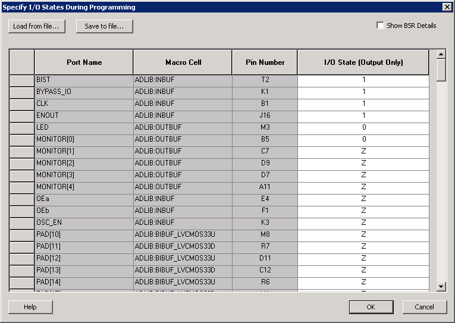

<table id="TABLE_BSV_1SY_N4B"><thead><tr><th>

Element

</th><th>

Description

</th></tr></thead><tbody><tr><td>

Load from file button

</td><td>

<br /> Loads an I/O settings \(\*.ios\) file you can use<br /> to import saved custom settings for your I/Os. The exported IOS<br /> file has the following format:<br /> -   Used I/Os have a file entry with the following format:

`set_prog_io_state -portName {<design_port_name>} -input <value> -outputEnable <value> - output <value>`


<br /> -   Unused I/Os have a file entry with the following format:

`set_prog_io_state -pinNumber {<device_pinNumber>} -input <value> -outputEnable <value> - output <value>`


<br /> In the preceding formats, &lt;value&gt; is one<br /> of the values shown in the key in the Default I/O Output Settings following<br /> table.<br />

</td></tr><tr><td>

Save to file button

</td><td>

Saves your I/O Settings File \(`*.ios`\) for future<br /> use. This is useful if you set custom states for your I/Os and want<br /> to use them again later with a PDC file.

</td></tr><tr><td>

Port Name column

</td><td>

Names of all the ports in your design.

</td></tr><tr><td>

Macro Cell column

</td><td>

I/O types, such as INBUF, OUTBUF, PLLs, and so on.

</td></tr><tr><td>

Pin Number column

</td><td>

Package pin associated with the I/O.

</td></tr><tr><td>

I/O State \(Output Only\) column

</td><td>

Sets your I/O states during programming \(see the following [Default I/O Output Settings](GUID-AE825DD9-DE91-4C39-95B7-F501D59B5932.md#GUID-739E082B-B784-487D-829D-25FBCEA206DE) table\). This<br /> column header changes to Boundary Scan Register if you select the<br /> **Show BSR Details** check box.

</td></tr><tr><td>

Boundary Scan Registers - Enabled with Show BSR Details

</td><td>

<br /> Sets your I/O state to a specific output value during programming<br /> and allows you to customize the values for the Boundary Scan<br /> Register \(Input, Output Enable, and Output\). You can change any<br /> Don't Care value in Boundary Scan Register States without<br /> changing the Output State of the pin \(as shown in the following<br /> BSR Details I/O Output Settings<br /> table\).<br /> Examples:To Tri-State a pin during programming, set Output Enable<br /> to 0; the Don't Care indicates that the other two values<br /> are immaterial.To have a pin drive a logic High and have a logic 1<br /> stored in the Input Boundary scan cell during<br /> programming, set all the values to 1.<br />

</td></tr></tbody>
</table><table id="GUID-2271C697-9645-425F-AD08-FDADE20377C0"><thead><tr><th rowspan="2">

Output State

</th><th colspan="3" align="center">

Settings

</th></tr><tr><th>

Input

</th><th>

Control \(Output Enable\)

</th><th>

Output

</th></tr></thead><tbody><tr><td>

<br /> Z \(Tri-State\)<br />

</td><td align="center">

<br /> 1<br />

</td><td align="center">

<br /> 0<br />

</td><td align="center">

<br /> 0<br />

</td></tr><tr><td>

<br /> 0 \(Low\)<br />

</td><td align="center">

<br /> 1<br />

</td><td align="center">

<br /> 1<br />

</td><td align="center">

<br /> 0<br />

</td></tr><tr><td>

<br /> 1 \(High\)<br />

</td><td align="center">

<br /> 0<br />

</td><td align="center">

<br /> 1<br />

</td><td align="center">

<br /> 1<br />

</td></tr><tr><td>

<br /> Last\_Known\_State<br />

</td><td>

<br /> Last\_Known\_State<br />

</td><td>

<br /> Last\_Known\_State<br />

</td><td>

<br /> Last\_Known\_State<br />

</td></tr><tr><td colspan="4">

<br /> Table Key:<br /> -   1: I/Os are set to drive out logic High.
-   0: I/Os are set to drive out logic Low.
-   Last\_Known\_State: I/Os are set to the last value that was driven out prior to entering the programming mode, and then held at that value during programming.
-   Z: Tri-State: I/O is tri-stated.

<br />

</td></tr></tbody>
</table><table id="GUID-1F374AA7-171D-4C89-9385-FF685A723F46"><thead><tr><th rowspan="2">

Output State

</th><th colspan="3" align="center">

Settings

</th></tr><tr><th>

Input

</th><th>

Output Enable

</th><th>

Output

</th></tr></thead><tbody><tr><td>

Z \(Tri-State\)

</td><td align="right">

Don't Care

</td><td align="center">

0

</td><td>

Don't Care

</td></tr><tr><td>

0 \(Low\)

</td><td align="right">

Don't Care

</td><td align="center">

1

</td><td align="center">

0

</td></tr><tr><td>

1 \(High\)

</td><td align="right">

Don't Care

</td><td align="center">

<br /> 1<br />

</td><td align="center">

1

</td></tr><tr><td>

Last Known State

</td><td align="right">

Last State

</td><td>

Last State

</td><td>

Last State

</td></tr><tr><td colspan="4">

<br /> Table Key:<br /> -   1: I/Os are set to drive out logic High.
-   0: I/Os are set to drive out logic Low.
-   Don't Care: Don’t Care values have no impact on the other settings.
-   Last\_Known\_State: I/Os are set to the last value that was driven out prior to entering the programming mode, and then held at that value during programming.
-   Z: I/O is tri-stated.

<br />

</td></tr></tbody>
</table>The following figure shows an example of Boundary Scan Register settings.


## Configuring Programming Options

The program options you can configure depend on the device you are programming. The<br /> following topics describe the options available to all product families.

To configure programming options, from the Design Flow window, double-click<br /> **Configure Programming Options** or right-click it and choose<br /> **Configure Options**. The Configure Programming Options dialog<br /> box appears with the appropriate options \(see the remaining topics in this section for<br /> more information\).


### PolarFire Programming Options

The following figure shows the programming options for PolarFire. The table following the figure<br /> describes the options.

**Note:** SPI file programming for Auto Programming, Auto Update \(IAP\), and IAP/ISP Services can program security only one time with the master file. Update files cannot update the Security settings. In addition, Silicon signature and Tamper Macro can be programmed with the master file only and cannot be updated.

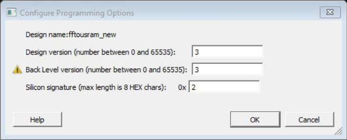

|Option|Description|
|------|-----------|
|Design name|Read-only field that identifies your design.|
|Design version|Design version to be programmed into the device. This value is also<br /> used for Back Level protection in the [Update Policy](GUID-AE825DD9-DE91-4C39-95B7-F501D59B5932.md#) step of the Configure Security tool.|
|Black Level version|Back Level version to be programmed to the device. This value must<br /> be less than or equal to the Design version number. This value is used<br /> for Back Level protection \(if enabled\) in the [Update Policy](GUID-AE825DD9-DE91-4C39-95B7-F501D59B5932.md#) step of the Configure Security tool.|
|Silicon signature|32-bit user configurable silicon signature to be programmed into the<br /> device. This field can be read from the device using the JTAG \(IEEE<br /> 1149-1\) USERCODE instruction or by running the DEVICE\_INFO programming<br /> action.|

### SmartFusion 2 and IGLOO 2 Programming Options

The following figure shows the programming options for SmartFusion 2 and IGLOO 2. The table<br /> following the figure describes the options.

**Note:** SPI file programming for Auto Programming, Auto Update \(IAP\), and IAP/ISP Services can program security only one time with the master file. Update files cannot update the Security settings. In addition, Silicon signature and Tamper Macro can be programmed with the master file only and cannot be updated.

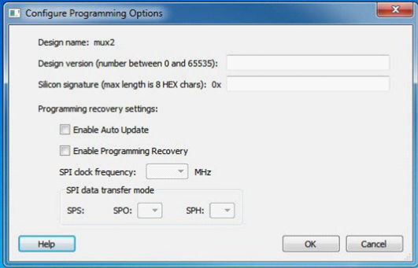

<table id="TABLE_MP5_KFT_P4B"><thead><tr><th>

Option

</th><th>

Description

</th></tr></thead><tbody><tr><td>

Design name

</td><td>

Read-only field that identifies your design.

</td></tr><tr><td>

Design version

</td><td>

Design Version used for Auto Update Programming or for Back Level protection. Enter a number between 0 and 65535 for the design version.

</td></tr><tr><td>

Silicon signature

</td><td>

Enter up to eight hexadecimal characters.

</td></tr><tr><td>

Enable Auto Update

</td><td>

Click to auto update the SPI update image at power-up. Auto update compares your update SPI image Design Version against the Design Version programmed in the device, and then auto updates the programming on your SPI update Image if the:-   Device is programmed

and

-   Update SPI image Design Version is greater than the Design Version on the device

 Auto Recovery also allows the device to automatically reprogram itself if there is a power failure during programming.**Note:** If this option is enabled, the programming recovery option must also be enabled, which disables this check box.

</td></tr><tr><td>

Enable Programming Recovery

</td><td>

Click to enable programming recovery in case a power failure occurs during programming.**Note:** Programming Recovery cannot be updated with \_UEK1 or \_UEK2 programming files. Only the master programming file can be used.

</td></tr><tr><td>

SPI clock frequency

</td><td>

Sets your SPI clock frequency. SPI is a full duplex, four-wire synchronous transfer protocol that<br /> supports programmable clock polarity \(SPO\) and clock phase \(SPH\).<br /> The state of the SPO and SPH control bits decides the data transfer<br /> modes. For more information, see the SmartFusion 2 Microcontroller<br /> Subsystem User's Guide or the IGLOO 2 High Performance Memory<br /> Subsystem User's Guide.Choices are in MHz:-   1.00
-   2.08
-   3.13
-   4.16
-   5.00
-   6.25
-   8.30
-   12.50

</td></tr><tr><td>

SPI data transfer mode

</td><td>

Sets your SPI data transfer mode for SPO and SPH. The SPO control bit determines the polarity<br /> of the clock and SPS defines the slave select behavior. SPS is hardcoded<br /> to b’1 and cannot be changed. The SPH control bit determines the clock<br /> edge that captures the data. For more information, see the [SmartFusion 2 Microcontroller Subsystem User's Guide](https://ww1.microchip.com/downloads/aemDocuments/documents/FPGA/ProductDocuments/SoC/microsemi_smartfusion2_microcontroller_subsystem_user_guide_ug0331_v15.pdf) or the [IGLOO 2 High Performance Memory Subsystem User's Guide](https://ww1.microchip.com/downloads/aemDocuments/documents/FPGA/ProductDocuments/UserGuides/Microchip_IGLOO2_FPGA_HPMS_UG0448_V9.pdf).

</td></tr></tbody>
</table>**Note:** SPI file programming for Auto Programming, Auto Update \(IAP\), Programming Recovery, and IAP/ISP Services can program security only once with the master file. Update files cannot update the security settings. In addition, Programming Recovery, Silicon Signature, Firewall, and Tamper Macro can be programmed with the master file only and cannot be updated.

### RTG4 Programming Options

The following figures show the programming options for RTG4. The tables following the figure describe the elements and options.


 Selected")

<table id="TABLE_SF1_VMQ_P4B"><thead><tr><th>

Element

</th><th>

Description

</th></tr></thead><tbody><tr><td>

Design name field

</td><td>

Read-only field that identifies your design.

</td></tr><tr><td>

Design version field

</td><td>

Enter a number between 0 and 65535 for the design version.

</td></tr><tr><td>

Silicon signature field

</td><td>

Enter up to eight hexadecimal characters.

</td></tr><tr><td>

Programming Bitstream Settings field

</td><td>

Choices are:-   Custom: Allows you to customize the settings using the check box options below these radio buttons \(see the following table\).
-   One-time programmable \(OTP\): Makes the device one-time programmable and disables the check box options. After programming the device, you cannot erase or reprogram the device. You can run programming actions VERIFY and VERIFY\_DIGEST, use SmartDebug to debug with probes, and read the digest of the Fabric

</td></tr><tr><td>

Selected settings

</td><td>

Summarizes the settings configured and informs you about the expected behavior of the device with these options.

</td></tr><tr><td>

Reset to default button

</td><td>

Click to reset settings to their default values.

</td></tr></tbody>
</table><table id="TABLE_NTW_LBR_P4B"><thead><tr><th>

Option

</th><th>

Description

</th></tr></thead><tbody><tr><td>

Enable System Controller Suspend mode

</td><td>

Check to enable System Controller Suspend mode when TRSTB is LOW during device power-up. You can exit System Controller Suspend mode by driving TRSTB HIGH during device power-up. Default: Disabled \(not checked\)**Note:** When this option is selected, the JTAG interface is disabled to ensure proper hardening during System Controller Suspend mode.

</td></tr><tr><td>

Disable JTAG interface

</td><td>

Check to disable the JTAG interface when TRSTB is LOW during device power-up. You can enable the JTAG interface by driving TRSTB HIGH during device power-up. Default: Enabled \(not checked\)**Note:** If you select this option, check the following options: Fabric Erase/Write/Verify, Disable Probe Read/Write, and Disable Digest Check.

</td></tr><tr><td>

Disable SPI interface

</td><td>

Unavailable because the SPI interface is not supported for RGT4.

</td></tr><tr><td>

Disable Fabric Erase/Write/Verify

</td><td>

Check to disable Fabric Erase/Write/Verify when TRSTB is LOW during device power-up. You can enable Fabric Erase/Write/Verify by driving TRSTB HIGH during device power-up. Default: Enabled \(not checked\)

</td></tr><tr><td>

Disable Probe Read/Write

</td><td>

Check to disable Probe Read/Write when TRSTB is LOW during device power-up. You can enable Probe Read/Write by driving TRSTB HIGH during device power-up. Default: Enabled \(not checked\)For this option to be available, check the Manage Constraints tool to reserve dedicated probe pins. Otherwise, pins can be used as regular user I/Os.

</td></tr><tr><td>

Disable Digest Check

</td><td>

Check to disable all Fabric reads, such as verify digest, read digest, or reading design or programming information in DEVICE\_INFO when TRSTB is LOW during device power-up. You can enable Digest Check by driving TRSTB HIGH during device power-up.

</td></tr></tbody>
</table>## Configuring Security

The following sections describe how to configure security for your device.

-   PolarFire and Polar Fire SoC users: see [Configure Security Wizard \(PolarFire and PolarFire SoC\)](GUID-AE825DD9-DE91-4C39-95B7-F501D59B5932.md#).
-   SmartFusion 2 and IGLOO 2: see [Configure Security Policy Manager \(SmartFusion 2 and IGLOO 2\)](GUID-AE825DD9-DE91-4C39-95B7-F501D59B5932.md#).

**Important:** If you use an SPI file generated with Libero v2022.2 or later version with custom security to create or edit the SPI bitstream client, then an error message tells you that the SPI file cannot contain security.

### Configure Security Wizard \(PolarFire and PolarFire SoC\)

The Configure Security Wizard guides PolarFire and PolarFire SoC users through the procedure for<br /> configuring custom security settings. The wizard consists of the following five<br /> steps:

1.  [User keys](GUID-AE825DD9-DE91-4C39-95B7-F501D59B5932.md#)
2.  [Update Policy](GUID-AE825DD9-DE91-4C39-95B7-F501D59B5932.md#)
3.  [Debug Policy](GUID-AE825DD9-DE91-4C39-95B7-F501D59B5932.md#)
4.  [Microsemi Policy](GUID-AE825DD9-DE91-4C39-95B7-F501D59B5932.md#)
5.  [JTAG/SPI Slave Commands](GUID-AE825DD9-DE91-4C39-95B7-F501D59B5932.md#)

    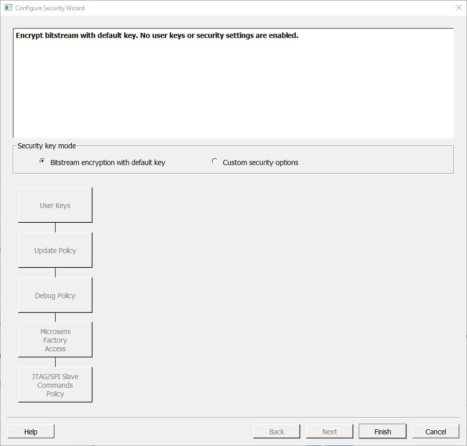

    The following table describes the elements in the Configure Security Wizard.

<table id="TABLE_YBF_CGG_44B"><thead><tr><th>

Element

</th><th>

Description

</th></tr></thead><tbody><tr><td>

Summary window

</td><td>

Displays the summary of the current configuration settings. The window scrolls to the current page as you move from page to page.

</td></tr><tr><td>

Security key mode

</td><td>

Two security key modes are available:-   Bitstream encryption with default key: Use the default encryption key for security. The Next and Back buttons are disabled. All steps are disabled. Custom User Keys and security settings are disabled.
-   Custom security Mode: Configures custom security keys and settings. All steps are enabled, as are the Next and Back buttons.


</td></tr><tr><td>

Back

</td><td>

Click to return to previous step.

</td></tr><tr><td>

Next

</td><td>

Click to proceed to next step.

</td></tr><tr><td>

Finish

</td><td>

Click to skip steps and complete the configuration.

</td></tr></tbody>
</table>
#### Step 1: User Keys

In step 1 of the Configure Security Wizard, you configure user keys. All keys are 256 bits \(64<br /> HEX characters\).

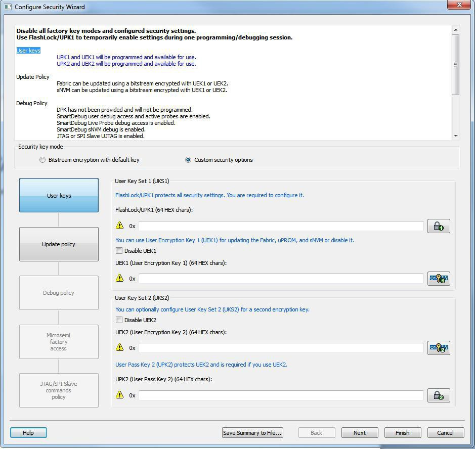

The following table describes the options in this step.

|Option|Description|
|------|-----------|
|FlashLock/UPK1|Protects all security settings. This key is required and must be a<br /> string of 64 HEX characters. Enter the key or click the padlock icon<br /> at the far right to generate a random key.Default:<br /> enabled|
|User Encryption Key 1 \(UEK1\)|Used for updating the Fabric, uPROM, and sNVM. This key is required<br /> and must be a string of 64 HEX characters. Enter the key or click the<br /> padlock icon at the far right to generate a random key. To disable<br /> it, click Disable.Default: enabled|
|User Encryption Key 2 \(UEK2\)|Used as a second encryption key for updating the Fabric, uPROM, and<br /> sNVM. This key is required and must be a string of 64 HEX<br /> characters.Enter the key or click the padlock icon at the far<br /> right to generate a random key. To disable it, click<br /> Disable.Default: enabled|
|User Pass Key 2 \(UPK2\)|UPK2 is required if UEK2 is enabled.Enter the key or click the<br /> padlock icon at the far right to generate a random key.|

#### Step 2: Update Policy

In step 2 of the Configure Security Wizard, you disable field updates and specify field-update<br /> protection parameters. Field updates are enabled by default.

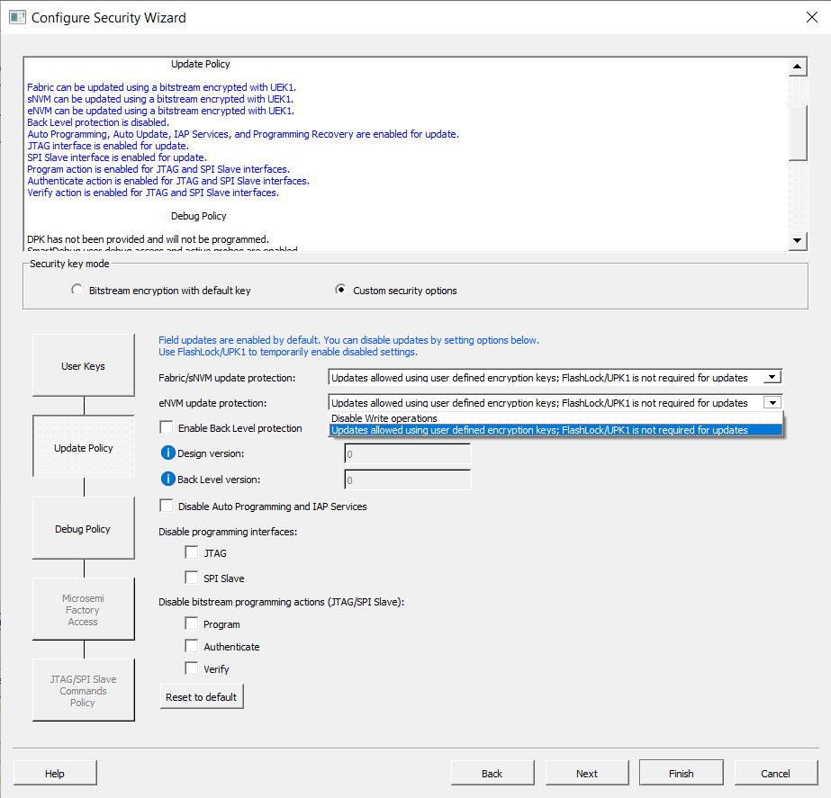

The following table describes the options in this step.

<table id="TABLE_NJD_1TM_44B"><thead><tr><th>

Option

</th><th>

Description

</th></tr></thead><tbody><tr><td>

Fabric/sNVM update protection

</td><td>

Choices are:-   Disable Erase/Write operations.

**Note:** The field-update files encrypted with UEK1 and UEK2 include plaintext FlashLock/UPK1.

-   Updates allowed using user-defined encryption keys: FlashLock/UPK1 is not required for updates.


</td></tr><tr><td>

eNVM update protection

</td><td>

\(PolarFire SoC only\) Updates allowed using user-defined encryption keys;<br /> FlashLock/UPK1 is not required for updates.

</td></tr><tr><td>

Enable Back Level protection

</td><td>

When checked, a field update design being programmed must be a version higher than the Back Level version value in the programmed device. This safeguard prevents field update designs with back level versions less than or equal to the design version programmed in the device.Design version \(number between 0–65535\): Display<br /> the current Design version set in the Configure Programming<br /> Options tool. Back Level version \(number between 0–65535\):<br /> Display the current Back Level version set in the Configure<br /> Programming Options tool\). Back Level version uses the<br /> Design version value to determine which bitstreams are<br /> allowed for programming. The Back Level version must be<br /> smaller than or equal to Design version.If Back Level Protection is disabled and Back Level version is greater than zero, Generate Bitstream and Export Bitstream tools error out.The examples in the following tables show Back Level protection enabled in the Configure Security tool.

</td></tr><tr><td>

Disable Auto Programming and IAP Services

</td><td>

When this option is selected, Auto Programming, Auto Update, IAP Services, and Programming Recovery are disabled. FlashLock/UPK1 unlocking is only available for JTAG and SPI Slave interfaces.<br /> **Note:** If a PolarFire SoC user disables this option manually, the **Enable One-way passcode** options in the [Configure Security Wizard](GUID-7C0FFD89-F0F2-49A8-9E21-FBB94A5C33F9.md#) is not available and SPI files cannot be exported.

</td></tr><tr><td>

Disable programming interfaces

</td><td>

You can disable the following programming interfaces:-   JTAG
-   SPI Slave

You cannot disable Auto Programming and IAP Services and both<br /> the programming interfaces. If you try, an error message<br /> appears.If you check JTAG, Libero<br /> checks the following options automatically:Disable UTAG command through JTAG<br /> interfaceDisable JTAG boundary scanIf you enable back the JTAG programming interface by<br /> unchecking JTAG, the options<br /> Disable UTAG commands through JTAG<br /> interface and Disable JTAG boundary<br /> scan remain checked.

</td></tr><tr><td>

Disable bitstream programming actions \(JTAG/SPI Slave\)

</td><td>

Choices are:-   Program
-   Authenticate
-   Verify

For PolarFire SoC devices, disabling the Program action,<br /> disables the programming action for all the interfaces.**Note:** The field-update files encrypted with UEK1 and UEK2 include plaintext FlashLock/UPK1.

</td></tr><tr><td>

Reset to default

</td><td>

Reset the options to default values. All options are unchecked.

</td></tr></tbody>
</table>|Step|Bitstream|Action|Bitstream Design Version|Bitstream Back Level Version|Device Back Level Version|Result|
|----|---------|------|------------------------|----------------------------|-------------------------|------|
|1|\_master|PROGRAM|1|1|1|Pass|
|2|\_master|VERIFY|1|1|1|Pass if device has UPK1|
|3|\_master|ERASE|1|1|1|Pass if device has UPK1|
|4|\_master|AUTHENTICATE|1|1|1|Pass if device has UPK1|
|5|\_master|DEVICE\_INFO|1|1|1|Always passes|
|6|\_uek1|PROGRAM|2|2|2|Pass|
|7|\_master|PROGRAM|1|1|2|Fail due to back level protection|

|Step|Bitstream|Action|Bitstream Design version|Bitstream Back Level version|Device Back Level version|Result|
|----|---------|------|------------------------|----------------------------|-------------------------|------|
|1|\_master|PROGRAM|2|1|1|Pass|
|2|\_uek1|PROGRAM|3|1|1|Pass|
|3|\_uek1\_1|PROGRAM|4|1|1|Pass|
|4|\_uek1\_2|PROGRAM|5|4|4|Pass|
|5|\_master|PROGRAM|2|1|4|Fail due to back level protection|
|6|\_uek1|PROGRAM|3|1|4|Fail due to back level protection|
|7|\_uek1\_1|PROGRAM|4|1|1|Fail due to back level protection|
|8|uek1\_2|VERIFY|5|4|4|Pass|

#### Step 3: Debug Policy

Debugging is enabled by default. Use this page to configure Debug Protections.

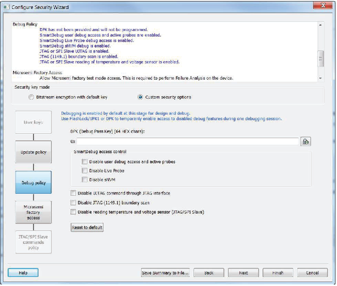

<table id="TABLE_R2Q_3VM_44B"><thead><tr><th>

Element

</th><th>

Description

</th></tr></thead><tbody><tr><td>

Debug with DPK \(Debug Pass Key\)

</td><td>

Protect Debug with a 256-bit \(64-character HEX\) Debug Pass Key. Enter<br /> the key in the field or click the padlock icon at the far right to<br /> generate a random key. This key is optional if you want a separate<br /> passkey to enable access to disabled debug features during one debugging<br /> session.If the DPK key is entered, check at least one<br /> option.

</td></tr><tr><td>

SmartDebug Access Control

</td><td>

All the following are enabled by default for SmartDebug access. Check<br /> to disable access.-   Disable User Debug Access and Active Probe
-   Disable Live Probe
-   Disable sNVM

**Warning:** Leaving SmartDebug access control enabled on production devices will allow anyone to debug or access active probes, access Live Probe, or read the content of sNVM.

**Warning:** Leaving SmartDebug access control enabled on production devices will allow anyone to debug or access active probes, access Live Probe, or read the content of sNVM.

Three additional<br /> options are:-   Disable UJTAG command through JTAG Interface.
-   Disable JTAG \(1149.1\) boundary scan: Imposes the following limitations:

    -   JTAG \(1149.1\) boundary scan is disabled.

    -   During JTAG device programming, all I/Os are<br /> tristated and weakly pulled-up.

    -   BSR control during JTAG programming is disabled.

    -   User modifications to the default I/O States during<br /> JTAG programming are not applied.

    -   The following JTAG instructions are disabled: EXTEST,<br /> INTEST, CLAMP, SAMPLE, PRELOAD, and HIGHZ.

    -   BYPASS, IDCODE, and USERCODE instructions remain<br /> functional.

    -   Boundary scan cannot be unlocked with the<br /> FlashLock/UPK1 key or DPK key.

To remove these limitations, reprogram the device with updated security settings that re-enable the JTAG \(1149.1\) boundary scan.

-   Disable reading temperature and voltage sensor \(JTAG/SPI Slave\): The summary at the top of the page displays the results of the selection.

</td></tr></tbody>
</table>#### Step 4: Microsemi Factory Access Policy

In step 4 of the Configure Security Wizard, you configure the policy for Microsemi test mode<br /> access. Field updates are enabled by default. Test mode access is required for failure<br /> analysis on the device.

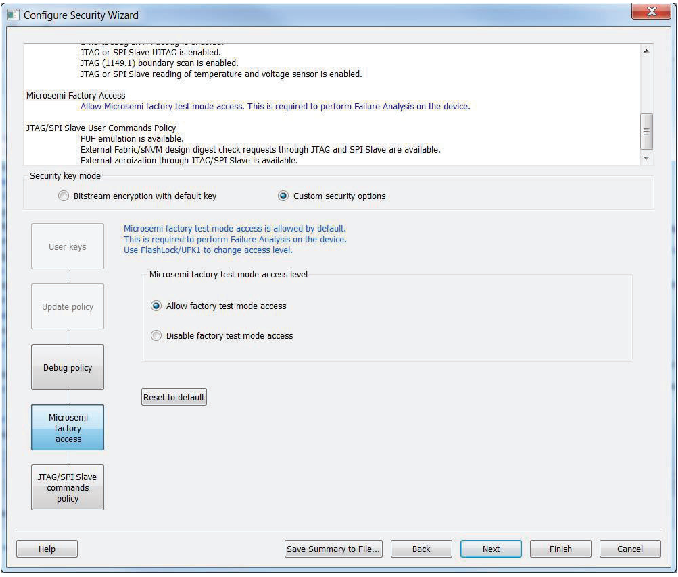

<table id="TABLE_ZRW_P34_44B"><thead><tr><th>

Option

</th><th>

Description

</th></tr></thead><tbody><tr><td>

Microsemi factory access level

</td><td>

Choices are:-   Allow factory test mode access: Do not use this setting for production devices. \(*default\)*
-   Disable factory test mode access.

<br /> Use<br /> FlashLock/UPK1 to change access level.<br />

</td></tr></tbody>
</table>#### Step 5: JTAG/SPI Slave Command Policy

In step 5 of the Configure Security Wizard, you configure the policy for JTAG/SPI slave user<br /> commands.

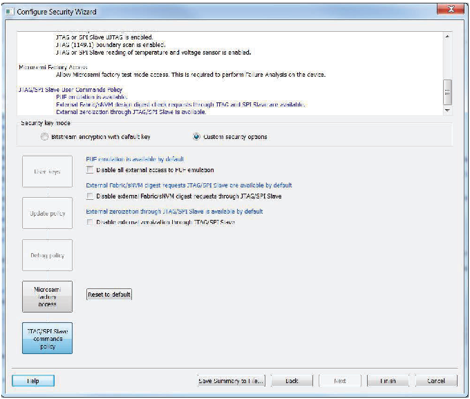

<br />

<table id="TABLE_P5W_GL4_44B"><thead><tr><th>

Option

</th><th>

Description

</th></tr></thead><tbody><tr><td>

Disable all external access to PUF emulation

</td><td>

Determines whether PUF emulation is available by default. Choices<br /> are:-   Checked: Disable all external access to PUF emulation through the JTAG/SPI slave.
-   Not checked: Enable all external access to PUF emulation through the JTAG/SPI slave. \(*default*\)

</td></tr><tr><td>

Disable external Fabric/sNVM digest requests through JTAG/SPI<br /> Slave

</td><td>

Determines whether external Fabric/sNVM digest requests through<br /> the JTAG/SPI slave are available by default. Choices are:-   Checked: Disable external Fabric/sNVM digest requests through JTAG/SPI slave.
-   Not checked: Enable external Fabric/sNVM digest requests through JTAG/SPI slave. \(*default*\)

**Warning:** Repeated external Fabric digest calculations can impact device reliability. For more information, see the product data sheet.

</td></tr><tr><td>

Disable external zeroization through JTAG/SPI Slave

</td><td>

Determines whether external zeroization through the JTAG/SPI<br /> slave is available by default. Choices are:-   Checked: Disable external zeroization through JTAG/SPI slave.
-   Not checked: Enable external zeroization through JTAG/SPI slave. \(*default*\)

**Warning:** Do not enable zeroization for production devices.

</td></tr></tbody>
</table><br />

### Configure Security Policy Manager \(SmartFusion 2 and IGLOO 2\)

In the Design Flow window, double-click **Configure Security**to open the<br /> Security Policy Manager dialog box and customize the security settings in your<br /> design.

Use this dialog box to set your User Keys, Security Policies, and Microchip factory test mode<br /> access level.

**Note:** Microchip-enabled default bitstream encryption key modes are disabled after user security is programmed.

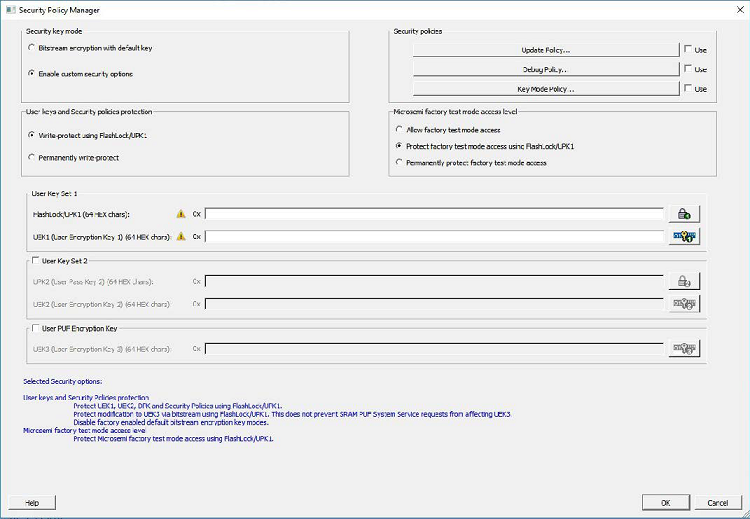

")

#### Security Key Mode

-   **Bitstream encryption with default key**- Encrypt bitstream files with Microchip default key \(pre-placed key in silicon\). When this option is selected, user keys, security, and Microchip factory test mode access level configurations are disabled.
-   **Enable custom security options**- Enables you to set User Keys, Security Policies and Microchip factory test mode access level \(see the following description\).

#### User keys and Security policies protection

-   **Write-protect using FlashLock/UPK1**- Protect UEK1 \(User Encryption Key 1\), UEK2 \(User Encryption Key 2\), DPK \(Debug Pass Key\), and Security Policies using FlashLock/ UPK1. Protect modification to UEK3 via bitstream using FlashLock/UPK1. SRAM-PUF System services can still modify UEK3 after programming Security settings.

    **Note:** UEK2 \(User Encryption Key2\) is protected by UPK2 \(User Pass Key 2\). UEK3 is only available for M2S060, M2GL060, M2S090, M2GL090, M2S150, and M2GL150 devices.

-   **Permanently write-protect**- Permanently protect UEK1 \(User Encryption Key 1\), UPK2 \(User Pass Key 2\), UEK2 \(User Encryption Key 2\), DPK \(Debug Pass Key\), Security Policies, and Microchip factory test mode access level. Permanently protect modification to UEK3 via bitstream. Note that even after programming Security settings, SRAM-PUF System services can still modify UEK3 This setting, once programmed will not be modified in the device. Microchip enabled default bitstream encryption key modes are permanently disabled as well.

    **Note:** When this option is selected, you cannot specify the FlashLock/UPK 1 and UPK2 \(User Pass Key 2\) value because the value cannot be used to unlock the corresponding protected features. UEK3 is only available for M2S060, M2GL060, M2S090, M2GL090, M2S150, and M2GL150 devices.


#### Microchip Factory Test Mode Access Level

-   **Allow factory test mode access**- Allows access to Microchip factory test mode.
-   **Protect factory test mode access using FlashLock/UPK1**- Protects access to Microchip factory test mode using Flashlock/ UPK1.
-   **Permanently protect factory test mode access**- Permanently locks access to Microchip factory test mode.

**Note:** When this option is selected, User Key Set 2 is permanently write-protected. Once programmed, User Key Set 2 cannot be changed in the device. You can specify UEK2 \(User Encryption Key 2\). However, you cannot specify UPK2 \(User Pass Key 2\) because the value cannot be used to unlock User Key Set 2.

#### Security Policies

-   **Update Policy**- Sets your Fabric, eNVM and Back Level protections. It also allows you to disable access to certain programming interfaces. See the [Update Policy](GUID-AE825DD9-DE91-4C39-95B7-F501D59B5932.md#) topic for more information.

    **Note:** If Update Policy is enabled and Fabric update is protected by UPK1:


Fabric update is disabled for Auto Programming, IAP/ISP services, Programming<br /> Recovery and Auto update. FlashLock/UPK1 unlocking is only available for JTAG and<br /> SPI slave programming. See the following example.


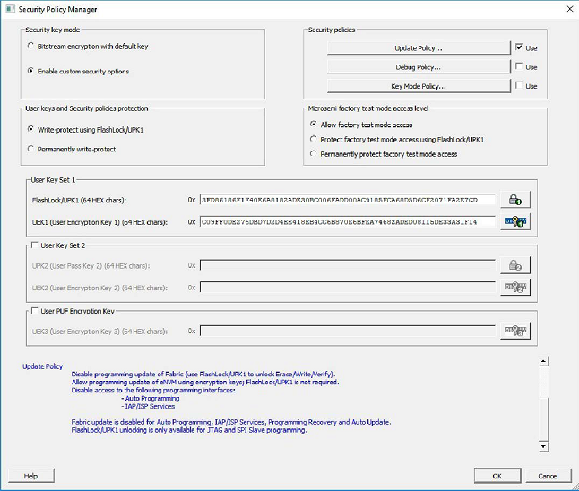

-   **Debug Policy**- Enables and sets your Debug Pass Key and debug options. See the [Debug Policy topic](GUID-AE825DD9-DE91-4C39-95B7-F501D59B5932.md#) for more information.
-   **Key Mode Policy**- Configures the key mode to enable or disable. See the [Key Mode Policy](GUID-AE825DD9-DE91-4C39-95B7-F501D59B5932.md#) topic for more information.

#### Configuring User Keys

-   **User Key Set 1**is required. User Key Set 1 includes FlashLock/UPK1 \(User Pass Key 1\) and UEK1 \(User Encryption Key 1\).
-   **User Key Set 2**is optional. User Key Set 2 includes UPK2 \(User Pass Key 2\) and UEK2 \(User Encryption Key 2\). Note that User Pass Key 2 \(UPK2\) protects only User Encryption Key 2 \(UEK2\).
-   **User PUF Encryption Key**is optional. User PUF Encryption Key includes UEK3 \(User Encryption Key 3\).

**Note:** UEK3 is only available for M2S060, M2GL060, M2S090, M2GL090, M2S150, and M2GL150 devices.

#### Update Policy

This dialog box enables you to specify components that can be updated in the field, and their field-update protection parameters.

Choose your protection options from the drop-down menus; click the appropriate check box to set<br /> your programming protection preferences.

##### Fabric Update Protection

-   **Use FlashLock/UPK1 to unlock Erase/Write/Verify operations**- Select this option to require UPK1 to erase, write, or verify the Fabric.

**Note:** Fabric update is disabled for Auto Programming, IAP/ISP services, Programming Recovery, and Auto update. FlashLock/UPK1 unlocking is only available for JTAG and SPI slave.

-   **Updates allowed using UEK1 or UEK2 or UEK3; FlashLock/UPK1 is not required for updates**- Encrypted update is allowed with either UEK1 or UEK2 \(if enabled\).

**Note:** UEK3 is only available for M2S060, M2GL060, M2S090, M2GL090, M2S150, and M2GL150 devices.

##### eNVM Update Protection

-   **Use FlashLock/UPK1 to unlock Write/Verify/Read operations**- Select this option to require UPK1 to write, verify or read to the eNVM.

**Note:** eNVM update is disabled for Auto Programming, IAP/ISP Services, Programming Recovery, and Auto Update. FlashLock/UPK1 unlocking is only available for JTAG and SPI Slave programming.

-   **Updates allowed using UEK1 or UEK2 or UEK3; Flashlock/UPK1 is not required for updates**- Encrypted update is allowed with either UEK1 or UEK2 \(if enabled\) or UEK3 \(if enabled\).

**Note:** UEK3 is only available for M2S060, M2GL060, M2S090, M2GL090, M2S150, and M2GL150 devices.

**Back Level protection**- When enabled, a design being loaded must be of a version higher than the Back Level version value in the programmed device.

-   **Back Level Protection**- Limits the design versions that the device can update. Only programming bitstreams with Designer Version greater than the Back Level version are allowed for programming.
-   **Design version**- Displays the current Design version \(set in the [Configuring Programming Options](GUID-AE825DD9-DE91-4C39-95B7-F501D59B5932.md#)\). Back level uses the Design version value to determine which bitstreams are allowed for programming.
-   **Back Level Bypass**- If selected, design is programmed irrespective of Back Level version.

**Note:** Back Level Bypass should be set if you allow programming recover with recovery image lower than the Back Level version selected. Alternatively, you should update the design version of the recovery image so that it is always greater than the Back Level version.

##### Disable Access to the Following Programming Interfaces

These settings protect the following programming interfaces:

-   Auto Programming
-   IAP/ISP services
-   JTAG \(use FlashLock to/UPK1 to unlock\)
-   SPI Slave \(use FlashLock/UPK1 to unlock\)

For more technical information on the Protect Programming Interface with Pass Key option see the<br /> [SmartFusion 2 Programming User's Guide](https://ww1.microchip.com/downloads/aemDocuments/documents/FPGA/ProductDocuments/SoC/microsemi_smartfusion2_igloo2_programming_user_guide_ug0451_v9.pdf)<br />

**Note:** When the Permanently write-protect option is selected for User keys and Security policies protection in SPM, the dialog box informs you of features that are no longer reprogrammable. In this case, if Use FlashLock/UPK1 to unlock option is selected for Fabric/eNVM update protection then Fabric/eNVM will be One Time Programmable.

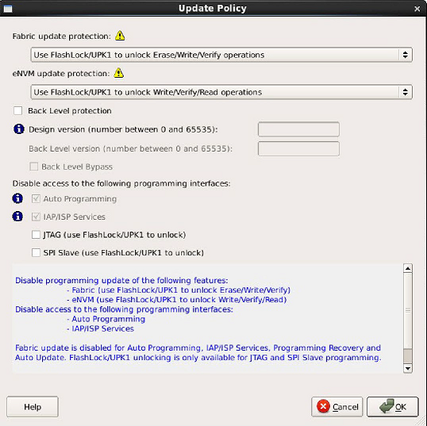

#### Debug Security Policy

Debug access to the embedded systems can be<br /> controlled via the customer Debug Policy.


##### Protect Embedded Debug with DPK \(Debug Pass Key\)

**Restrict UJTAG access**- Restricts access to UJTAG; DPK is required for access.

**Restrict Cortex M3 debug \(SmartFusion 2 Only\)**- Restricts Cortex M3 debug/SoftConsole use;<br /> DPK is required for debug.

##### SmartDebug Access Control

Access control available during debug mode.

**Full Access \(No restrictions to SmartDebug architecture; DPK is not required\)**- Enables full debug access to eNVM, uSRAM, LSRAM, eSRAM0/1, DDRAM and Fabric probing.

**No debug \(Restrict read/write access to SmartDebug architecture; DPK is required for read/write access\)**- Blocks all debug access to eNVM, uSRAM, LSRAM, eSRAM0/1, DDRAM and Fabric probing.

##### DPK \(Debug Pass Key\) \(length is 64 HEX characters\)

Specify a Debug Pass Key to unlock features protected by DPK.

**Restrict external Fabric/eNVM design digest check request via JTAG and SPI. Use FlashLock/UPK1 to allow digest check.**- Protects design digest check request with FlashLock/UPK1.

**Disable debug access through JTAG \(1149.1\).**- Disables JTAG \(1149.1\) test<br /> instructions. The following JTAG test instructions will be disabled: HIGHZ, EXTEST,<br /> INTEST, CLAMP, SAMPLE, and PRELOAD. I/Os will be tri-stated when in JTAG programming<br /> mode and BSR control during programming is disabled. BYPASS, IDCODE, and USERCODE<br /> instructions will remain functional.

#### Key Mode Policy

Protect user encryption key modes with FlashLock/UPK1. If a key mode is disabled, then FlashLock/UPK1 is required to program with that key mode.

The following key modes can be disabled:

-   UEK1 \(User Encryption Key 1\)
-   UEK2 \(User Encryption Key 2\)
-   UEK3 \(User Encryption Key 3\)

**Note:** UEK3 is only available for M2S060, M2GL060, M2S090, M2GL090, M2S150, and M2GL150 devices.

If all key modes are disabled, device update is impossible and a warning message is<br /> displayed.

**Note:** If a key mode is disabled, the corresponding bitstream file will be disabled.

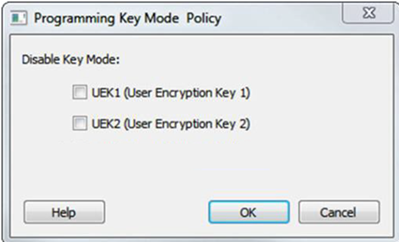

")

#### Security Programming Files

[Exporting Bitstreams](GUID-7C0FFD89-F0F2-49A8-9E21-FBB94A5C33F9.md#)\(expand Handoff<br /> Design for Production in the Design Flow window\) creates the following files:

**&lt;filename&gt;\_master.\(stp/svf/spi/dat\)**- Created when Enable custom security<br /> options is specified in the [Configuring Security](GUID-AE825DD9-DE91-4C39-95B7-F501D59B5932.md#). This is the master programming file; it includes all programming<br /> features enabled, User Key Set 1, User Key Set 2 \(optionally if specified\), and your<br /> security policy settings.

**&lt;filename&gt;\_security\_only\_master.\(stp /svf/spi/dat\)**– Created when Enable<br /> custom security options is specified in the [Configuring Security](GUID-AE825DD9-DE91-4C39-95B7-F501D59B5932.md#). Master security<br /> programming file; includes User Key Set 1, User Key Set 2 \(optionally if specified\), and<br /> your security policy settings.

**&lt;filename&gt;\_uek1.\(stp/svf/spi/dat\)**– Programming file encrypted with User<br /> Encryption Key 1 used for field updates; includes all your features for programming<br /> except security.

**&lt;filename&gt;\_uek2.\(stp/svf/spi/dat\)**– Programming file encrypted with User<br /> Encryption Key 2 used for field updates; includes all your features for programming<br /> except security.

**&lt;filename&gt;\_uek3.\(stp/svf/spi/dat\)**– Programming file encrypted with User<br /> Encryption Key 3 used for field updates; includes all your features for programming<br /> except security.

**Note:** UEK3 is available only for M2S060S, M2GL060S, M2S090S, M2GL090S, M2S150S, and M2GL150S devices.

## Configuring Bitstreams

### Configure Bitstream \(PolarFire and PolarFire SoC\)

The Configure Bitstream dialog box allows you to select which components you wish to<br /> program. Only features that are added to your design are available for programming. To<br /> display the dialog box, right click **Generate Bitstream** in the<br /> Design Flow window and choose **Configure Options**.

In the dialog box, the option **Sanitize all sNVM pages in ERASE action** is supported for PolarFire and PolarFire SoC. The option is<br /> enabled in the dialog box if the **Fabric/sNVM** option is selected.<br /> If the design includes uPROM, it will be included in the Fabric.

")

PolarFire SoC devices also provide an **eNVM** option if eNVM<br /> clients are present and being programmed.

<br />

")

<br />

Observe the following guidelines:

**Note:**

-   Custom security is enabled if security was configured.
-   All available features are selected by default.
-   sNVM is always programmed with Fabric for PolarFire devices. PolarFire SoC allows you to program either Fabric with sNVM or sNVM only.

### Configure Bitstream \(RTG4, SmartFusion 2, and IGLOO 2\)

Right-click **Generate Bitstream**in the Design Flow window and choose **Configure Options**to open the Configure Bitstream dialog box.

The Configure Bitstream dialog box enables you to select which components you wish to program. Only features that are added to your design are available for programming. For example, you cannot select eNVM for programming if you do not have eNVM in your design.

")

**Note:** The Custom security and eNVM components are not available for RTG4 devices.

**Sanitize all eNVM pages in ERASE action** - eNVM option will be available only if eNVM clients are present and are being programmed.

## Generating the Bitstream

The Generate Bitstream option generates the bitstream for use with the Run PROGRAM Action tool.

The tool incorporates the Fabric design, sNVM configuration, eNVM configuration \(if configured\)<br /> and custom security settings \(if configured\) to generate the bitstream file. Before you<br /> generate the bitstream, configure the bitstream. Otherwise, default settings with all<br /> available features included are used. To display the Configure Bitstream dialog box,<br /> expand **Program Design**, right-click **Generate Bitstream** and choose **Configure Options** to select<br /> the components you want to program. Only features that are added to your design are<br /> available for programming. When the process is complete, a green check mark appears next<br /> to the operation in the Design Flow window \(as shown in the following figure\) and<br /> information messages appear in the Log window.

Observe the following guidelines:

-   If the design includes uPROM, it will be included in the Fabric.
-   The **eNVM** option will be available for PolarFire SoC, SmartFusion 2, and IGLOO 2 devices only if eNVM clients are present and being programmed.
-   Modifications to the Fabric design, sNVM configuration, eNVM configuration, or security settings will invalidate this tool and require regeneration of the bitstream file.
-   The Fabric programming data will be regenerated only if you make changes to the Fabric design, such as in the Create Design, Create Constraints, and Implement Design sections of the Design Flow window.

")

## Configuring Actions and Procedures

The Configure Actions and Procedures tool allows you to configure actions with optional or<br /> recommended procedures for a Libero target device. The information is saved and can be<br /> used by the Run Action tool.

Observe the following guidelines when using this tool:

-   Available actions and their procedures depend on current bitstream components selected in the Generate Bitstream and Configure Options tools.
-   Changing procedures for the action selected to run invalidates the Run Action tool state. Changing any other action does not affect the Run Action tool state.

To run the Configure Actions and Procedures tool, from the Libero Design Flow window, expand<br /> **Program Design** and double-click **Configure Actions and Procedures**.


The Configure Actions and Procedures dialog box opens. The actions and procedures shown depend on<br /> the device family you use and the bitstream components selected in the Generate<br /> Bitstream and Configure Options tools.

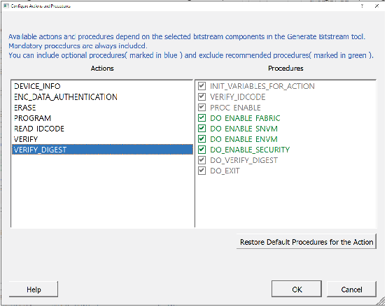

### Programming File Actions and Supported Procedures

The following table lists programming file actions and supported procedures.

-   Mandatory procedures are grayed out and not selectable, and must be performed.
-   Recommended procedures are shown in green and can be included or excluded.
-   Optional procedures are shown in blue and can be included or excluded.

<table id="GUID-EB51C26A-FE04-4FDB-A8C5-2E55278114A3"><thead><tr><th>

Action

</th><th>

Procedures

</th></tr></thead><tbody><tr><td>

DEVICE\_INFO

</td><td>

-   INIT\_VARIABLES\_FOR\_ACTION
-   SET\_DEVICE\_INFO\_ACTIONTYPE
-   VERIFY\_IDCODE
-   DO\_DEVICE\_INFO
-   DO\_EXIT


</td></tr><tr><td>

ENC\_DATA\_AUTHENTICATION

</td><td>

-   INIT\_VARIABLES\_FOR\_ACTION
-   SET\_AUTHORIZATION\_ACTIONTYPE
-   VERIFY\_IDCODE
-   DO\_AUTHENTICATION
-   DO\_EXIT


</td></tr><tr><td>

ERASE

</td><td>

-   INIT\_VARIABLES\_FOR\_ACTION
-   SET\_ERASE\_ACTIONTYPE
-   VERIFY\_IDCODE
-   PROC\_ENABLE
-   DO ERASE DO\_EXIT


</td></tr><tr><td>

PROGRAM

</td><td>

-   INIT\_VARIABLES\_FOR\_ACTION
-   SET\_PROGRAM\_ACTIONTYPE
-   VERIFY\_IDCODE
-   PROC\_ENABLE
-   DO\_PROGRAM
-   DO\_VERIFY \(optional\)
-   DO\_EXIT


</td></tr><tr><td>

READ\_IDCODE

</td><td>

-   INIT\_VARIABLES\_FOR\_ACTION
-   SET\_READ\_IDCODE
-   VERIFY\_IDCODE
-   PRINT\_IDCODE
-   DO\_EXIT


</td></tr><tr><td>

VERIFY

</td><td>

-   INIT\_VARIABLES\_FOR\_ACTION
-   SET\_VERIFY\_ACTIONTYPE
-   VERIFY\_IDCODE
-   PROC\_ENABLE
-   DO\_VERIFY
-   DO\_EXIT


</td></tr><tr><td>

VERIFY\_DIGEST

</td><td>

-   INIT\_VARIABLES\_FOR\_ACTION
-   VERIFY\_IDCODE PROC\_ENABLE
-   DO\_ENABLE\_FABRIC \(recommended\)
-   DO\_ENABLE\_SNVM \(recommended\)
-   DO\_ENABLE\_ENVM\(recommended\)
-   DO\_ENABLE\_SECURITY \(recommended\)
-   DO\_VERIFY\_DIGEST \(recommended\)
-   DO\_EXIT
VERIFY\_DIGEST also exports \(that is, prints in the programming log\) the newly calculated digests<br /> and compares them with the stored digests.

</td></tr><tr><td>

ZEROIZE\_LIKE\_NEW

</td><td>

-   INIT\_VARIABLES\_FOR\_ACTION
-   VERIFY\_IDCODE
-   DO\_ZEROIZE\_LIKE\_NEW DO\_EXIT


</td></tr><tr><td>

ZEROIZE\_UNRECOVERABLE

</td><td>

-   INIT\_VARIABLES\_FOR\_ACTION
-   VERIFY\_IDCODE
-   DO\_ZEROIZE\_UNRECOVERABLE
-   DO\_EXIT


</td></tr></tbody>
</table>
### Programming File Actions and Descriptions

The following table lists programming file actions and descriptions.

|Action|Description|
|------|-----------|
|<br /> PROGRAM<br />|<br /> Programs all selected bitstream components: FPGA<br /> ArrayTargeted sNVM<br /> clientsTargeted eNVM<br /> clientsSecurity<br /> settings<br /> For more information, see FPGA Programmed Content Integrity<br /> Checking and Programming File Tracking using Cryptographic<br /> Digests.<br />|
|<br /> ERASE<br />|<br /> Erases the selected family features for: FPGA<br /> ArraySecurity<br /> settings<br />|
|<br /> VERIFY\_DIGEST<br />|<br /> Calculates the digests for the components \(Custom Security, Fabric,<br /> or sNVM\) included in the bitstream from the device and compares them<br /> against the programmed/stored digest values in the fabric security<br /> segment of the device.<br /> VERIFY\_DIGEST also exports \(that is, prints in the programing log\)<br /> the newly calculated digests and compares them with the stored<br /> digests.<br />|
|<br /> VERIFY<br />|<br /> Verifies all selected family features for: FPGA<br /> ArrayTargeted sNVM<br /> clientsTargeted eNVM<br /> clientsSecurity<br /> settings<br />|
|<br /> ENC\_DATA\_AUTHENTICATION<br />|<br /> Encrypted bitstream authentication data.<br />|
|<br /> READ\_IDCODE<br />|<br /> Reads the device ID code from the device.<br />|
|<br /> DEVICE\_INFO<br />|<br /> Displays the IDCODE, design name, checksum, and device security<br /> settings and programming environment information programmed into the<br /> device.<br />|

### Options for Specific Programming Actions

The following table lists the options available for specific programming actions.

To configure actions for other JTAG devices, use the [Programming Connectivity and Interface](GUID-A531C6A0-F3E1-4A31-8957-19DBC92948EC.md#) tool.

**Note:** The eNVM feature is available for PolarFire SoC devices only.

|Action|Option|Description|
|------|------|-----------|
|<br /> PROGRAM<br />|DO\_VERIFY|<br /> Enable or disable programming verification.<br />|
|<br /> VERIFY\_DIGEST<br />|DO\_ENABLE\_FABRIC|<br /> Include Fabric and Fabric configuration in the digest check.<br />|
|<br /> VERIFY\_DIGEST<br />|DO\_ENABLE\_SNVM|<br /> Include the sNVM in the digest check.<br />|
|<br /> VERIFY\_DIGEST<br />|DO\_ENABLE\_ENVM|<br /> Include the eNVM in the digest check.<br />|
|<br /> VERIFY\_DIGEST<br />|DO\_ENABLE\_SECURITY|<br /> Include security policy settings, and UPK1, UEK1, User Key Set 2<br /> \(UPK2 and UEK2\), DPK, and SMK security segments in the digest<br /> check.<br />|

## Running Programming Device Actions

If you have a device programmer connected, double click **Run PROGRAM Action** to execute your program in batch mode with default settings.

CAUTION:

Do not interrupt programming action when it runs as shown in the pop-up. Otherwise, it might damage the part.

If your programmer is not connected or if your default settings are invalid, then the Reports<br /> view lists the errors. To select a programming action to run:

1.  Right click **Run PROGRAM Action** and choose **Select Action**. The **Select Action** dialog box appears.

    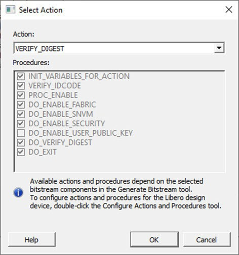

2.  Select a programming action from the drop-down list and click **OK**.

To configure programming actions, use the [Configure Actions and Procedures](GUID-AE825DD9-DE91-4C39-95B7-F501D59B5932.md#) tool.

### Programming File Actions

Libero SoC enables you to program security settings, FPGA Array, sNVM, and eNVM features.

**Note:**

-   eNVM features are available for PolarFire SoC, SmartFusion 2, and IGLOO 2 devices only.
-   If the design includes μPROM, it will be included in the Fabric.

You can program these features separately using different programming files or you can combine them into one programming file.

In the Design Flow window, expand **Program Design**, click **Run PROGRAM Action**, and right click **Select Action**.

The Select Action dialog box opens.


For details about configuring actions and procedures, see [Configuring Actions and Procedures](GUID-AE825DD9-DE91-4C39-95B7-F501D59B5932.md#).

|Error Code|Exit Message|Exit Code|Possible Cause|Possible Solution|
|----------|------------|---------|--------------|-----------------|
| |Passed \(no error\)|0|—|—|
|0x8002|Failed to disable programming modeFailed to set programming mode|5|Unstable voltage levelSignal integrity issues on JTAG pins|Monitor related power supplies that cause the issue during programming, check for transients outside of Microchip specifications. See your device data sheet for more information on transient specifications.Monitor JTAG supply pins during programming; measure JTAG signals for noise or reflection.|
|0x8032|Device is busy|5|Unstable VDDIx voltage level|Monitor related power supplies that cause the issue during programming, check for transients outside of Microchip specifications. See your device data sheet for more information on transient specifications.|
|0x8003|Failed to enter programming mode|5|Unstable voltage levelSignal integrity issues on JTAG pins DEVRST\_N is tied to LOW|Monitor related power supplies that cause the issue during programming, check for transients outside of Microchip specifications. See your device data sheet for more information on transient specifications.Monitor JTAG supply pins during programming; measure JTAG signals for noise or reflection.Tie DEVRST\_N to HIGH prior to programming the device.|
|0x8004|Failed to verify IDCODE|6|Incorrect programming fileIncorrect device in chainSignal integrity issues on JTAG pins|Choose the correct programming file and select the correct device in the chain.Measure JTAG pins and noise for reflection. If TRST is left floating, then add pull-up to pin.Reduce the length of Ground connection.|
|0x80050x80060x80070x80080x8009|Failed to verify FPGA ArrayFailed to verify Fabric ConfigurationFailed to verify Security Failed to verify sNVM Failed to verify eNVM|11|Device is programmed with a different design, or the component is blankUnstable voltage levelSignal integrity issues on JTAG pins|Verify that the device is programmed with the correct data/design.Monitor related power supplies that cause the issue during programming, check for transients outside of Microchip specifications. See your device data sheet for more information on transient specifications.Monitor JTAG supply pins during programming; measure JTAG signals for noise or reflection.|
|0x8013|External digest check via JTAG/SPI Slave is disabled.|-18|External Digest check via JTAG/SPI Slave is disabled|Need to use a bitstream file which has a valid FlashLock/UPK1 to enable external digest check via JTAG/SPI Slave.|
|0x8015|FPGA Fabric digest verification: FAILDeselect procedure DO\_ENABLE\_FABRIC to remove this digest check.|-20|FPGA Fabric is either erased or the data are corrupted or tampered with|If the Fabric is erased, deselect procedure **DO\_ENABLE\_FABRIC**from action **VERIFY\_DIGEST**|
|0x8016|sNVM digest verification: FAILDeselect procedure DO\_ENABLE\_SNVM to remove this digest check.|-20|sNVM is either erased or the data are corrupted or tampered with|If the sNVM is erased, deselect procedure **DO\_ENABLE\_SNVM** from action **VERIFY\_DIGEST**|
|0x8018|User security policies segment digest verification: FAILDeselect procedure DO\_ENABLE\_SECURITY to remove this digest check.|-20|Security segment is either erased or the data are corrupted or tampered with|If the security is erased, deselect procedure **DO\_ENABLE\_SECURITY** from action **VERIFY\_DIGEST**|
|0x8019|UPK1 segment digest verification: FAILDeselect procedure DO\_ENABLE\_SECURITY to remove this digest check.|-20|UPK1 segment is either erased or the data are corrupted or tampered with|If the UPK1 is erased, deselect procedure **DO\_ENABLE\_SECURITY** from action **VERIFY\_DIGEST**|
|0x801A|UPK2 segment digest verification: FAILDeselect procedure DO\_ENABLE\_UKS2 toremove this digest check.|-20|UPK2 segment is either erased or the data are corrupted or tampered with|If the UPK2 is erased, deselect procedure **DO\_ENABLE\_UKS2** from action **VERIFY\_DIGEST**|
|0x801B|Factory row and factory key segment digest verification: FAIL|-20|Factory row and factory key segment is erased through zeroization or the data has been corrupted or tampered with|—|
|0x801C|Fabric configuration segment digest verification: FAILDeselect procedure DO\_ENABLE\_FABRICto remove this digest check.|-20|Fabric configuration segment is either erased or has been corrupted or tampered with|If the Fabric configuration is erased, deselect procedure **DO\_ENABLE\_FABRIC** from action **VERIFY\_DIGEST**|
|0x8052|UEK1 segment digest verification: FAILDeselect procedure DO\_ENABLE\_UEK1 to remove this digest check.|-20|UEK1 segment is either erased or the data has been corrupted or tampered with|If the UEK1 is erased, deselect procedure **DO\_ENABLE\_UEK1** from action **VERIFY\_DIGEST**|
|0x8053|UEK2 segment digest verification: FAILDeselect procedure DO\_ENABLE\_UEK2 to remove this digest check.|-20|UEK2 segment is either erased or the data has been corrupted or tampered with|If the UEK2 is erased, deselect procedure **DO\_ENABLE\_UEK2** from action **VERIFY\_DIGEST**|
|0x8054|DPK segment digest verification: FAILDeselect procedure DO\_ENABLE\_DPK to remove this digest check.|-20|DPK segment is either erased or the data has been corrupted or tampered with|If the DPK is erased, deselect procedure**DO\_ENABLE\_DPK** from action **VERIFY\_DIGEST**|
|0x8057|SMK segment digest verification: FAIL|-20|SMK segment is either erased or the data has been corrupted or tampered with|If the SMK is erased, deselect procedure**DO\_ENABLE\_SMK** from action **VERIFY\_DIGEST**|
|0x8058|User Public Key segment digest verification: FAIL|-20|User Public Key segment is either erased or the data has been corrupted or tampered with|If the User Public Key is erased, deselect procedure **DO\_ENABLE\_USER\_PUBLIC\_KEY** from action **VERIFY\_DIGEST**|
|0x801D|Device security prevented operation|-21|The device is protected with user pass key 1 and the bitstream file does not contain user pass key 1.User pass key 1 in the bitstream file does not match the device.|Run DEVICE\_INFO to view security features that are protected.Provide a bitstream file with a user pass key 1 that matches the user pass key 1 programmed into the device.|
|0x801F|Programming Error.Bitstream or data are corrupted or noisy|-22|Bitstream file has been corrupted or was incorrectly generatedUnstable voltage levelSignal integrity issues on JTAG pins|Regenerate bitstream fileMonitor related power supplies that cause the issue during programming, check for transients outside of Microchip specifications. See your device data sheet for more information on transient specifications. Monitor JTAG supply pins during programming; measure JTAG signals for noise or reflection.|
|0x8021|Programming Error.Invalid/Corrupted encryption key|-23|File contains an encrypted key that does not match the deviceFile contains user encryption key, but device is programmed with the user encryption key|Provide a programming file with an encryption key with the one matches that on the device.First program security with master programming file, then program with user encryption 1/2 field update programming files.|
|0x8023|Programming Error.Back level not satisfied|-24|Design version is not higher than the back-level programmed device.|Generate a programming file with a design version higher than the back level version.|
|0x8001|Failure to read DSN|-24|Device is in System Controller Suspend mode Check board connections.|TRSTB must be driven HIGH or disable "System Controller Suspend Mode."|
|0x8027|Programming Error.Insufficient device capabilities|-26|Device does not support the capabilities specified in the programming file.|Generate a programming file with the correct capabilities for the target device.|
|0x8029|Programming Error. Incorrect DEVICEID|-27|Incorrect programming fileIncorrect device in chainSignal integrity issues on JTAG pins|Choose the correct programming file and select the correct device in chain.Measure JTAG pins and noise or reflection. If TRST is left floating, then add pull-up to pin.Reduce the length of ground connection.|
|0x802B|Programming Error.Programming file is out of date, regenerate.|-28|Programming file version is out of date|Generate programming file with the latest version of Libero SoC.|
|0x8030|Programming ErrorInvalid or inaccessible Device Certificate|-31|**FAB\_RESET\_N**is tied to ground|**FAB\_RESET\_N** must be tied to HIGH|
|0x80320x80340x80360x8038|Instruction timed out|-32|Unstable voltage levelSignal integrity issues on JTAG pins|Monitor related power supplies that cause the issue during programming, check for transients outside of Microchip specifications. See your device data sheet for more information on transient specifications.Monitor JTAG supply pins during programming; measure JTAG signals for noise or reflection.|
|0x8010|Failed to unlock user pass key 1|-35|Pass key in file does not match device|Provide a programming file with a pass key that matches pass key programmed into the device.|
|0x8011|Failed to unlock user pass key 2|-35|Pass key in file does not match device|Provide a programming file with a pass key that matches pass key programmed into the device.|
|0x804F|Bitstream programming action is disabled|-38|Unstable voltage levelBitstream programming action is disabled in Security Policy Manager|Monitor related power supplies that cause the issue during programming, check for transients outside of Microchip specifications. See your device data sheet for more information on transient specifications.Need to use a bitstream file which has a valid FlashLock/UPK1 to enable the bitstream programming action.|
|0x805B|Error, security must be either programmed on a blank device or with the FPGA Fabric design|-42|Security only bitstream programming on a programmed device|Use this bitstream on a blank device or generate a new bitstream that contains the FPGA Fabric design along with the security.|
|0x805C|eNVM digest verification: FAILDeselect procedure DO\_ENABLE\_ENVM to remove this digest check|-20|eNVM is either erased or the data are corrupted or tampered with.|If the eNVM is erased, deselect procedure **DO\_ENABLE\_ENVM** from action **VERIFY\_DIGEST**.|

## Programming SPI Flash Image \(PolarFire and PolarFire SoC\)

The following topics describe how to program a SPI Flash image on PolarFire and PolarFire SoC<br /> devices.

### Generating a SPI Flash Image

The Generate SPI Flash Image tool generates a `<design>_spi_flash.bin` file in the implementation folder. The tool depends on the Configure Design Initialization Data and Memories tool and the Generate Design Initialization Data tool. While running, the tool verifies that the SPI Flash configuration data is saved and valid, and that the SPI Flash initialization client was generated successfully \(if required\).

To run this tool, expand **Program SPI Flash Image**, right-click **Generate SPI Flash Image**, and select **Run**.

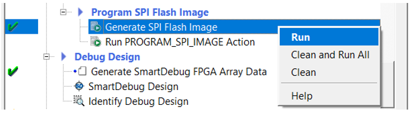

### Configure SPI Flash Image Actions and Procedures

If SPI Flash is configured, you can select supported SPI Flash Image actions and procedures in the Select Action and Procedures dialog box. See the following example.

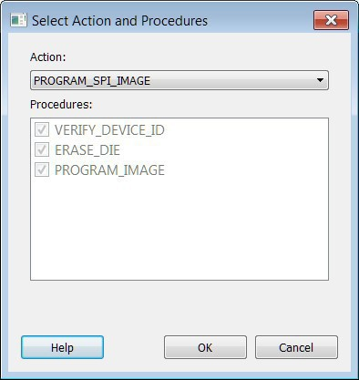

The following table lists the actions and procedures for the Run PROGRAM\_SPI\_Flash tool.

|Action|Mandatory Procedures|Description|
|------|--------------------|-----------|
|PROGRAM\_SPI\_IMAGE|VERIFY\_DEVICE\_I D ERASE\_DIE PROGRAM\_IMAGE|This action erases the entire SPI flash then program the SPI image.|
|VERIFY\_SPI\_IMAGE|VERIFY\_DEVICE\_I D VERIFY\_IMAGE|This action verifies the SPI Image on the SPI Flash.|
|READ\_SPI\_IMAGE|VERIFY\_DEVICE\_I D READ\_IMAGE|This action reads the SPI Image from the SPI Flash.|
|ERASE\_SPI\_FLASH|VERIFY\_DEVICE\_I D ERASE\_DIE|This action erases the entire SPI Flash.Note: Partial programming of the SPI flash is supported when using PolarFire®/PolarFire SoC FPGAs and the FlashPro6 programmer. In this case, the ERASE\_SPI\_FLASH action allows you to erase only selected clients.|

**Note:** If the device ID does not match while running any action, the action will fail.

### Running Programming SPI Flash Actions

The Run Programming SPI Flash Actions tool allows you to program the SPI Flash device connected to the PolarFire device through the JTAG programming interface. Only the Micron 1Gb SPI flash furnished with the Evaluation Kit is supported. This feature minimizes cost by not requiring a MUX and external SPI pins on the board for SPI flash programming by another tool. This tool always erases the entire SPI flash prior to programming. Programming starts at address 0 of the SPI flash until the last client. Any gaps in the SPI flash are programmed with all 1’s.

**Note:** This version of the programmer does not support SPI Flash security. Disable device security options such as **Hardware Write Protect** for the External SPI Flash device.

If SPI Flash is configured, you can execute the Run PROGRAM\_SPI\_IMAGE Action and select SPI Flash Image actions and procedures. In the Design Flow window, expand **Program SPI Flash Image**, right-click **Run PROGRAM\_SPI\_Image Action**, and select **Configure Action/Procedures**.


**Note:** The SPI pins are controlled by the Boundary Scan Register one bit at a time.

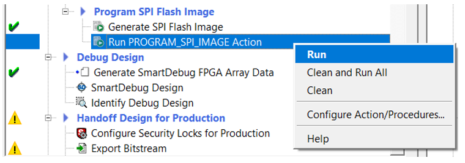

The following table provides the expectations of programming the SPI flash with an FlashPro5 programmer. Future programmers are planned and must greatly improve programming times. Timing is indicated in hh:mm:ss.

|SPISize|ERASE|PROGRAM|VERIFY/READ|TCK|Programmer|
|-------|-----|-------|-----------|---|----------|
|1 MB|3:55|00:00:45|00:10:46|4 MHz|FP5|
|1 MB|3:55|00:00:28|00:10:05|15 MHz|FP5|
|9 MB|3:55|00:06:38|01:19:15|4 MHz|FP5|
|9 MB|3:55|00:04:26|01:08:49|10 MHz|FP5|
|18MB|3:55|00:09:04|02:32:43|10 MHz|FP5|
|128MB|3:55|00:58:38|22:07:55|15 MHz|FP5|

Observe the following recommendations:

-   Because the verify time is currently not optimized, it is recommended to authenticate the SPI bitstreams with system services for quicker verification.
-   Because this tool erases the SPI flash prior to programming and currently does not support Data Storage clients for user data, it is recommended to program the SPI Flash with Libero before programming other data on the SPI Flash.
-   Because programming time is currently not optimized, it is recommended to not have huge gaps between clients in the SPI flash, since gaps are currently programmed with 1’s.

### Partial Programming Support

#### eFP6/FP6 Partial Support

This feature allows you to program clients anywhere within the SPI-Flash memory space connected to PolarFire and PolarFire SoC devices.

Every client is programmed at a specified target Start Address, from the lowest address to the highest. The Libero generated Look-up Table \(LUT\) is programmed first, followed by INIT\_STATGE\_3\_SPI\_CLIENT, SPI bitstream for IAP, Recovery/Golden, and Auto Update.

The following image is a sample list of clients:

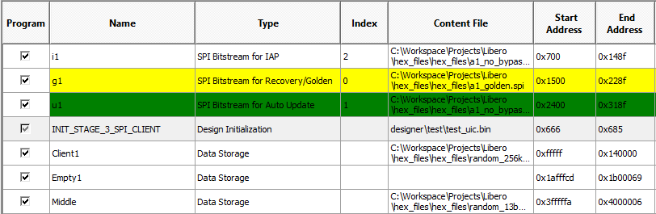

The memory regions between the clients are left intact. However, SPI-Flash erases data in the selected sector, subsector, or block if the client’s target Start Address is outside of sector, subsector, or block boundaries.

The software reports an error code along with messages that indicate if original data is lost.

The verify operation verifies only the data of the selected clients.

The following example is a sample log from FlashProExpress SPI Flash programming:

```
programmer '138000A' : Scan Chain...
programmer '138000A' : Scan and Check Chain PASSED.
programmer '138000A' : device 'MPF200T' : Executing action PROGRAM_SPI_IMAGE
programmer '138000A' : JTAG TCK frequency = 4 MHz
Performing SPI-Flash action. Please wait...
Warning: It is recommended that the target client addresses align to sector, subsector or block boundaries. Else, during erase or program actions, the software will erase and restore data that is partly outside of target memory regions. If restoring data operation fails, the user must reprogram the original clients covering the affected failed areas. 
Processing SPI-Flash Client 0: Target Address = 0x0. Size = 1024 Bytes
FP6 acceleration mode enabled with PPD file. Please wait...
Programmer '138000A' : JTAG TCK frequency = 4 MHz
FP6 Messages:
================================================================================
JTAG DirectC Version: 5.1
Identifying FPGA device...
ActID = 0x0f8121cf
Micron device is found.
SPI-Flash IDCode = 0x21ba20
Device size (MBytes) = 128
Performing SPI Flash Program Action:
SPI-Flash memory target address = 0x00. Image byte size = 1024
SPI Flash memory region to erase: 0x00 - 0x03ff. Please wait...
Restoring data at address = 0x0400 - 0x0fff
Programming image from address = 0x00 - 0x03ff
Programming data at address: 0x00 - 0x03ff
Operation Status: Passed
================================================================================
Processing SPI-Flash Client 1: Target Address = 0x666. Size = 32 Bytes
FP6 acceleration mode enabled with PPD file. Please wait...
Programmer '138000A' : JTAG TCK frequency = 4 MHz
FP6 Messages:
================================================================================
JTAG DirectC Version: 5.1
Identifying FPGA device...
ActID = 0x0f8121cf
Micron device is found.
SPI-Flash IDCode = 0x21ba20
Device size (MBytes) = 128
Performing SPI Flash Program Action:
SPI-Flash memory target address = 0x0666. Image byte size = 32 
SPI Flash memory region to erase: 0x0666 - 0x0685. Please wait...
Restoring data at address = 0x00 - 0x0665
Restoring data at address = 0x0686 - 0x0fff 
Programming image from address = 0x0666 - 0x0685 
Programming data at address: 0x0666 - 0x0685 
Operation Status: Passed
================================================================================
Processing SPI-Flash Client 6: Target Address = 0x1AFFFCD. Size = 157 Bytes
FP6 acceleration mode enabled with PPD file. Please wait...
Programmer '138000A' : JTAG TCK frequency = 4 MHz
FP6 Messages:
================================================================================
JTAG DirectC Version: 5.1
Identifying FPGA device...
ActID = 0x0f8121cf
Micron device is found.
SPI-Flash IDCode = 0x21ba20
Device size (MBytes) = 128
Performing SPI Flash Image Erase Action:
SPI-Flash memory target address = 0x01afffcd. Image byte size = 157
SPI Flash memory region to erase: 0x01afffcd - 0x01b00069. Please wait...
Restoring data at address = 0x01aff000 - 0x01afffcc
Restoring data at address = 0x01b0006a - 0x01b00fff
Operation Status: Passed
```

#### FlashPro3, FlashPro4, and FlashPro5 Partial Support

The partial programming support described for eFP6 and FP6 does not apply for FP3, FP4, or FP5 programmers. FP3, FP4, and FP5 programmers deal with partial clients by generating on the fly one bitstream containing the data of all the clients, as shown in the previous example. Memory gaps between the clients are filled with 0xff. The entire SPI-Flash memory device is erased first, and then the generated bitstream is programmed, starting with address 0.

The verify operation verifies that the client data and the memory gaps between the clients are verified against 0xff.

The following example is a sample output for programming the previous clients using FlashPro5 programmer.

```
programmer 'S2001KZSR7' : Scan Chain...
Programmer 'S2001KZSR7' : JTAG TCK / SPI SCK frequency = 1 MHz
programmer 'S2001KZSR7' : Check Chain...
programmer 'S2001KZSR7' : Scan and Check Chain PASSED.
programmer 'S2001KZSR7' : device 'MPF200T' : Executing action PROGRAM_SPI_IMAGE
Programmer 'S2001KZSR7' : JTAG TCK / SPI SCK frequency = 4 MHz
?Warning: FP3, FP4, and FP5 programmers do not support partial SPI-Flash programming. The entire SPI-Flash device will be erased and programmed with the currently enabled clients.
ID: 00441021ba20
Erasing SPI flash die...
ERASE SPI Flash Finished : Fri Feb 19 15:31:05 2021 (Elapsed time 00:00:05)
Programming SPI image...
Program SPI image Finished : Fri Feb 19 15:31:07 2021 (Elapsed time 00:00:02)
programmer 'S2001KZSR7' : device 'MPF200T' : Executing action PROGRAM_SPI_IMAGE PASSED.
programmer 'S2001KZSR7' : Chain programming PASSED.
Chain Programming Finished: Fri Feb 19 15:31:07 2021 (Elapsed time 00:00:07)
```

Observe the following guidelines:

-   Backward Compatibility: FlashPro3/4/5/6 that use the software version 2021.1 release support all jobs created using older versions of the Libero software. Do not use older FlashProExpress versions of software with FlashProExpress jobs created by Libero version 2021.1 and later releases. If used, the entire bitstream, including header contents, will be programmed into the SPI-Flash memory device, which is not the intended behavior.

-   Programmers used: Jobs programmed with FlashPro6 but verified with FlashPro3/4/5 programmers might fail using software version 2021.1 release. These jobs fail because the memory gap between clients is skipped during verification but are verified against 0xff if FlashPro3/4/5 programmers are used.

-   SPI address table: If only storage clients are created, Libero generates a 1024-byte SPI address lookup table automatically while adding any SPI-Flash client. Erasing a client using eFlashPro6/FlashPro6 programmers also erases the SPI lookup address table. For FlashPro3/4/5 programmers, erase operations erase the entire SPI-Flash memory device.


### SPI-Flash Bitstream Format

For versions prior to Libero SoC v2021.1, the SPI-Flash Bitstream is the payload.

For Libero SoC v2021.1 and later, the SPI-Flash Bitstream format is defined in the following table.

<table id="TABLE_XPP_TXC_Z4B"><thead><tr><th>

Number of Bytes

</th><th>

Value

</th><th>

Description

</th></tr></thead><tbody><tr><td>

4

</td><td>

FF FF FF FF

</td><td>

Tag to indicate new version of bitstream.

</td></tr><tr><td>

2

</td><td>

XX XX

</td><td>

Major Version of bitstream.

</td></tr><tr><td>

2

</td><td>

XX XX

</td><td>

Minor Version of bitstream.

</td></tr><tr><td>

4

</td><td>

XX XX XX XX

</td><td>

Client0 Target Address.

</td></tr><tr><td>

4

</td><td>

FF FF FF FF

</td><td>

Client0 Byte Size.

</td></tr><tr><td>

1

</td><td>

XX

</td><td>

Flag. If set to 1, Payload will follow.If set to 0, Payload is not present and memory region will be erased.

</td></tr><tr><td>

X

</td><td>

X

</td><td>

Payload based on previous flag

</td></tr><tr><td>

4

</td><td>

XX XX XX XX

</td><td>

Client1 Target Address

</td></tr><tr><td>

4

</td><td>

XX XX XX XX

</td><td>

Client1 Byte Size

</td></tr><tr><td>

1

</td><td>

XX

</td><td>

Flag. -   If set to 1, Payload will follow.
-   If set to 0, no Payload is present and memory region will be erased.

</td></tr><tr><td>

X

</td><td>

X

</td><td>

Payload based on previous flag

</td></tr><tr><td colspan="3" align="center">

Repeat for other clients

</td></tr><tr><td>

4

</td><td>

FF FF FF FF

</td><td>

End Tag

</td></tr></tbody>
</table>