# Debugging

This topic introduces how to use the debugger to gather the device status and to view the<br /> diagnostics.

## Common Debug Elements

The following sections describe the debug elements common to PolarFire, SmartFusion 2, IGLOO 2, and RTG4 devices.

### Debug FPGA Array

In the Debug FPGA Array dialog box, you can view your Live<br /> Probes, Active Probes, Memory Blocks, and Insert<br /> Probes \(Probe Insertion\) in either the [Hierarchical View](GUID-AFCD4A75-089E-4BD6-AFD4-FC526F201B3D.md#) or the<br /> [Netlist View](GUID-AFCD4A75-089E-4BD6-AFD4-FC526F201B3D.md#).

The Debug FPGA Array dialog box includes the following four<br /> tabs:

-   [Live Probes](GUID-AFCD4A75-089E-4BD6-AFD4-FC526F201B3D.md#)
-   [Active Probes](GUID-AFCD4A75-089E-4BD6-AFD4-FC526F201B3D.md#)
-   [Memory Blocks](GUID-AFCD4A75-089E-4BD6-AFD4-FC526F201B3D.md#)
-   [Probe Insertion](GUID-AFCD4A75-089E-4BD6-AFD4-FC526F201B3D.md#)

It also includes the FPGA Hardware Breakpoint \(FHB\) controls,<br /> consisting of the following tabs:

-   [Event Counter](GUID-AFCD4A75-089E-4BD6-AFD4-FC526F201B3D.md#)
-   [Frequency Monitor](GUID-AFCD4A75-089E-4BD6-AFD4-FC526F201B3D.md#)
-   [User Clock Frequencies](GUID-AFCD4A75-089E-4BD6-AFD4-FC526F201B3D.md#)

### Hierarchical View

The Hierarchical View lets you view the instance level hierarchy of the design programmed on the device and select the signals to add to the Live Probes, Active Probes, and Probe Insertion tabs in the Debug FPGA Array dialog box. Logical and physical Memory Blocks can also be selected.

-   **Filter**: In Live Probes, Active Probes, Memory Blocks, and the Probe Insertion UI, a search option is available in the Hierarchical View. You can use wildcard characters such as \* or ? in the search column for wildcard matching. Probe points of leaf level instances resulting from a search pattern can only be added to Live Probes, Active Probes, and the Probe Insertion UI. You cannot add instances of search results in the Hierarchical View.
-   **Instance\(s\)**: Displays the probe points available at the instance level.
-   **Primitives**: Displays the lowest level of probe-able points in the hierarchy for the corresponding component such as leaf cells \(hard macros on the device\).
-   **Highlight Selected**: Check to highlight selected active, live, or probe insertion probes in their respective tabs within the Hierarchical View. By default, this check box is checked.

You can expand the hierarchy tree to see lower level logic. Signals with the same name are<br /> grouped automatically into a bus that is presented at instance level in the instance<br /> tree.

The probe points can be added by selecting any instance or the leaf level instance in the<br /> Hierarchical View. Adding an instance adds all the probe-able points available in the<br /> instance to Live Probes, Active Probes, and Probe Insertion.

<br />


<br />

Use the **Highlight Selected** check box to show selected active,<br /> live, or probe insertion probes in the Hierarchical view.

")

")

### Netlist View

The Netlist View displays a flattened net view of all the probe-able points present in the design, along with the associated cell type.

A search option is available in the Netlist View for Live Probes, Active Probes, and<br /> Probe Insertion. You can use wildcard characters such as \* or ? in the search column for<br /> wildcard matching.

<br />


<br />

### Live Probes

The same circuitry for programming the flash switches that have access to these points at the<br /> DFFs of every LE is re-purposed for debugging. SmartDebug controls these signal points<br /> with the JTAG interface to either allow asynchronous reads from and writes to these<br /> DFFs, or to use an additional muxing circuit that allows two signal points to be<br /> rerouted to special pins called "channels." These signal points are I/O pads present on<br /> the FPGA boards that could be used to connect to the oscilloscope to monitor dynamic<br /> signals.

Live Probes is a design debug option that uses non-intrusive real time scoping of up to two probe<br /> points with no design changes. The **Live Probes** tab in the Debug<br /> FPGA Array dialog box displays a table with the probe names and pin types. There are two<br /> channels, and Live Probe can be assigned or unassigned independently.

**Attention:** The **Live Probe** tab is disabled and a tooltip is shown if the user design has live probe I/Os enabled as input.

Two probe channels are available for PolarFire, SmartFusion 2, and IGLOO 2 devices. When a probe<br /> name is selected, it can be assigned to any channel. Both probes can be assigned or<br /> unassigned independently.

To assign a probe to a channel, either:

-   Right click a probe in the table and choose **Assign to Channel** for PolarFire and PolarFire SoC or **Assign to probe read data pin** for RTG4.
-   Click **Assign to Channel** for PolarFire and PolarFire SoC or **Assign to probe read data pin** for RTG4 to assign the probe selected in the table to the channel.

When the assignment is complete, the probe name appears to the right of the button for that<br /> channel, and SmartDebug configures the channel I/Os to monitor the desired probe points.<br /> Because there are only two channels, a maximum of two internal signals can be probed<br /> simultaneously.

Click **Unassign Channels** for PolarFire and PolarFire SoC or<br /> **Unassign probe read data pin** for RTG4 to clear the live probe<br /> names to the right of the channel buttons and discontinue the live probe function during<br /> debug.

**Note:** RTG4 devices support one probe channel.

The **Save**button saves the list of live probes currently shown in the SmartDebug Live Probe UI to file. The **Load**button loads the list of live probes from a file to SmartDebug Live Probe UI.

During save or load, check whether the appropriate signals saved or loaded match the signals in SmartDebug Live Probe UI and in the saved file.

**Note:** Sequential elements and outputs related to LSRAM, USRAM, and MATH are supported. Combinational logic and registers related to I/O pads are not supported.

#### Live Probes in Demo Mode

You can assign and unassign Live Probes Channel A and Channel B in Demo Mode.

### Active Probes

The active probes design debug option reads and writes to one or many probe points in the<br /> design through JTAG. This option uses the same circuitry that is used for programming<br /> the fabric. It is also non-intrusive and works asynchronously with the design clocks. In<br /> PolarFire, 18 DFFs are read at a time from the device that are physically placed<br /> adjacent to each other in the fabric. If you want to debug the design related to timing<br /> issue, then it is recommended to stop the design clocks. The FHB feature can be used to<br /> stop the design clock and then probe all the DFFs in the design.

In the left pane of the **Active Probes** tab, all available Probe<br /> Points are listed in instance-level hierarchy in the Hierarchical View. All Probe Names<br /> are listed with the Name and Type \(which is the physical location of the flip-flop\) in<br /> the Netlist View.

Select probe points from the Hierarchical View or Netlist View, right click and choose<br /> **Add**to add them to the Active Probes UI. You can also add the<br /> selected probe points by clicking the **Add**button. The probes list<br /> can be filtered with the Filter box.

When you select the desired probe, points appear in the **Active Probe** data chart and you can read and write multiple probes, as shown in<br /> the following figure.

**Attention:** Assign to Channel A and Unassign from Channel A RMB options are hidden in the Active Probes table, if the user design has live probe I/Os enabled as input.

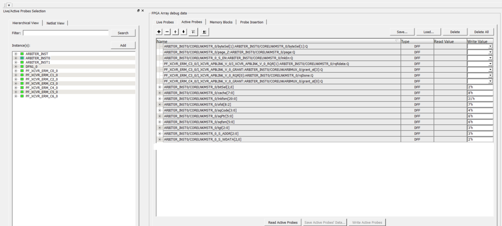

Use the following options in the **Write Value** column to modify the<br /> probe signal added to the SmartDebug FPGA Array debug data dialog box:

-   Drop-down menu with values 0 and 1 for individual probe signals
-   Editable field to enter data in hex or binary for a probe group or a bus

<br />

**Note:** Sequential elements and outputs related to LSRAM, USRAM and MATH are supported. Combinational logic and registers related to I/O pads are not supported.

<br />

#### Active Probes in Demo Mode

In the demo mode, a temporary probe data file with details of current and previous<br /> values of probes added in the **Active Probes** tab is created in<br /> the designer folder. The write values of probes are updated to this file, and the<br /> GUI is updated with values from this file when you click **Write Active Probes**. Data is read from this file when you click**Read Active Probes**. If there is no existing data for a probe in the file,<br /> the read value displays all 0s. The value is updated based on your changes.

### Probe Grouping \(Active Probes Only\)

During the debug cycle of the design, designers often want to examine the different signals. In<br /> large designs, there can be many signals to manage. The Probe Grouping feature assists<br /> in comprehending multiple signals as a single entity. This feature is applicable to<br /> Active Probes only. Probe nets with the same name are automatically grouped in a bus<br /> when they are added to the **Active Probes** tab. Custom probe groups<br /> can also be created by manually selecting probe nets of a different name and adding them<br /> into the group.


The **Active Probes** tab provides the following options for probe points that<br /> are added from the Hierarchical View/Netlist View:

-   Display bus name. An automatically generated bus name cannot be modified. Only custom bus names can be modified.
-   Expand/collapse bus or probe group
-   Move Up/Down the signal, bus, or probe group
-   Save \(Active Probes list\)
-   Load \(already saved Active Probes list\)
-   Delete \(applicable to a single probe point added to the **Active Probes** tab\)
-   Delete All \(deletes all probe points added to the **Active Probes** tab\)

Green entries in the **Write Value** column indicate that the<br /> operation was successful. Blue entries in the **Read Value** column<br /> indicate values that have changed since the last read.

In addition, the context \(right click\) menu provides the following operations:

-   Create Group, Add/Move signals to Group, Remove signals from Group
-   Ungroup
-   Reverse bit order, Change Radix for a bus or probe group
-   Read, Write, or Delete the signal or bus or probe group

#### Context Menu of Probe Points Added to the Active Probes UI

When you right click a signal or bus, you will see the following menu options:

<table id="TABLE_TGG_L1N_KNB"><thead><tr><th>

Situation

</th><th>

Options

</th><th>

User Interface

</th></tr></thead><tbody><tr><td>

For individual signals that are not part of a probe group or<br /> bus

</td><td>

<br /> -   Read
-   Delete
-   Poll
-   Create Group

<br />

</td><td>


</td></tr><tr><td>

For individual signals in a probe group

</td><td>

<br /> -   Read
-   Delete
-   Poll
-   Create Group
-   Add to Group
-   Move to Group
-   Remove from Group

<br />

</td><td>


</td></tr><tr><td>

For individual signals in a bus

</td><td>

<br /> -   Read
-   Delete
-   Poll
-   Create Group
-   Add to Group

<br />

</td><td>

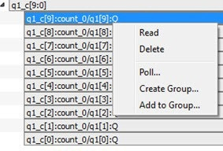

</td></tr><tr><td>

For a bus

</td><td>

<br /> -   Delete
-   Reverse Bit Order
-   Change Radix to Binary
-   Poll
-   Create Group

<br />

</td><td>

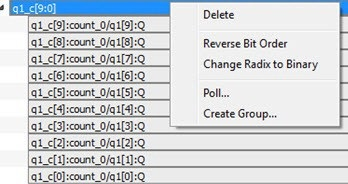

</td></tr><tr><td>

For a probe group

</td><td>

<br /> -   Delete
-   Reverse Bit Order
-   Change Radix to Binary
-   Poll
-   Create Group
-   Ungroup

<br />

</td><td>


</td></tr></tbody>
</table>#### Differences Between a Bus and a Probe Group

A bus is created automatically by grouping selected probe nets with the same name into a bus.<br />

**Note:** A bus cannot be ungrouped.

A Probe Group is a custom group created by adding a group of signals in the **Active Probes** tab into the group. The members of a Probe Group are not<br /> associated by their names.

**Note:** A Probe group can be ungrouped.

In addition, certain operations are also restricted to the member of a bus, whereas they are allowed in a probe group.

The following operations are not allowed in a bus.

-   **Move to Group**: Moving a signal to a probe group
-   **Remove from Group**: Removing a signal from a probe group

### Memory Blocks

Memory debug accesses the RAMs present in the fabric. Large SRAM or micro SRAM can be<br /> accessed through JTAG. SmartDebug takes the access from the user interface via fabric<br /> control bus \(FCB\) to read and write into the locations. Once the read operation is<br /> performed, the interface is relinquished and given back to the user interface. During<br /> this operation, any data read may be outdated or unreliable and you may not be able to<br /> access the memory until the SmartDebug has finished its operation.

The **Memory Blocks** tab in the Debug FPGA Array dialog box shows the<br /> hierarchical view of all memory blocks in the design. You determine the depth and width<br /> of blocks shown in the logical view in SmartDesign, RTL, or IP cores using memory<br /> blocks.

**Note:**

-   You cannot access RAM when SmartDebug accesses RAM blocks.
-   You cannot access RAM is not accessible during a read or write operation.
    -   During a single location write, the RAM block is not accessible. If multiple locations are written, the RAM block is accessed and released for each write.
    -   When each write is completed, access returns to the user, so the access time is a single write operation time.

The following figure shows the hierarchical view of the **Memory Blocks** tab. You can view logical blocks and physical blocks. Logical<br /> blocks are shown with an **L**\( \), and physical blocks are shown with a **P**\( \).

<br />

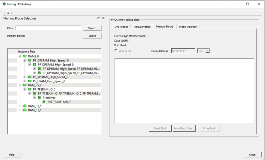

<br />

You can select only one block at a time. You can select and add blocks in the following<br /> ways:

-   Right click the name of a memory block and click **Add**, as shown in the following figure.

    

-   Click a name in the list and then click **Select**.
-   Click a name, drag it to the right, and drop it into the **Memory Blocks** tab.
-   Enter a memory block name in the Filter box and click **Search**or press **Enter**. Wildcard search is supported.

**Note:** Only memory blocks with an **L** or a **P** icon can be selected in the hierarchical view.

A **View in 2D** check box allows you to toggle between a<br /> 1-dimensional or 2-dimensional view of the memory block \(default is 2 dimensional\). The<br /> **Go to Address** option to the right of the check box allows you<br /> to navigate to an offset address location in either hexadecimal or decimal format.

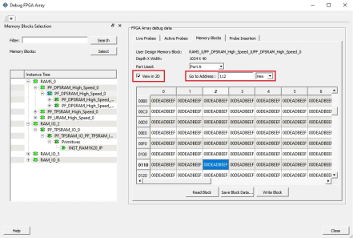

#### Memory Block Fields

The following memory block fields appear in the **Memory Blocks** tab.

##### User Design Memory Block

The selected block name appears on the right side. If the block selected is logical,<br /> the name from the top of the block is shown.

##### Data Width

If a block is logical, the depth and width is retrieved from each physical block,<br /> consolidated, and displayed.

Values vary with the device family. For PolarFire devices, if the block is physical,<br /> the value of "Depth × Width" is 64 × 12 for μSRAM blocks, 16384 × 1, 8192 × 2, 4096<br /> × 5, 2048 × 10, 1024 × 20 for LSRAM blocks, and 512 × 40 \(512 × 33 if Error<br /> Correcting Code is enabled where 512 × 7 is dedicated for ECC\) for Two-Port<br /> RAM\(TPSRAM\) physical block. Corresponding values for other Microchip devices can be<br /> found in their respective datasheets.

##### Port Used

This field is displayed only in the logical block view. Because configurators can have<br /> asymmetric ports, memory location can have different widths. The port shown can<br /> either be Port A or Port B. For TPSRAM, where both ports are used for reading, Port<br /> A is used. This field is hidden for physical blocks, as the values shown will be<br /> irrespective of read ports.

##### Memory Block Views

The following figure shows the **Memory Blocks** tab fields for a<br /> logical block view.

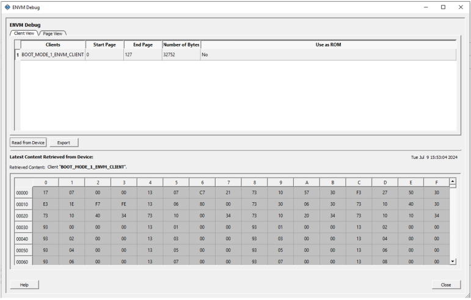

The following figure shows the **Memory Blocks** tab fields for a<br /> physical block view.

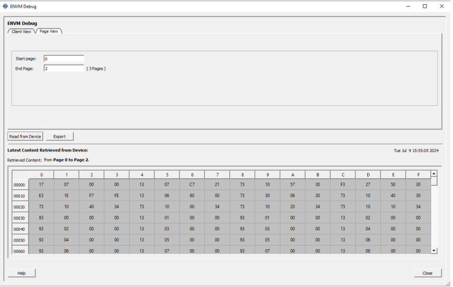

#### Read Block

Memory blocks can be read once they are selected. If the block name appears on the right side,<br /> the **Read Block** button is enabled. Click **Read Block** to read the memory block.

##### Logical Block Read

A logical block shows three fields. User Design Memory Block and Depth X Width are<br /> read-only fields, and the Port Used field has options. If the design uses both<br /> ports, Port A and Port B are shown under options. If only one port is used, only<br /> that port is shown.

")

")

The data shown is in hexadecimal format. In the preceding figure, data width is 40.<br /> Because each hexadecimal character has 4 bits of information, you can see 10<br /> characters corresponding to 40 bits. Each row has 16 locations \(shown in the column<br /> headers\), which are numbered in hexadecimal from 0 to F.

**Note:** For all logical blocks that cannot be inferred from physical blocks, the corresponding icon does not contain a letter. The following are the scenarios where logical block cannot be constructed:

-   If the inference flow \(RTL – synthesis\) is used in the design, the inference guidelines provided by Synopsys have to be followed.
-   Because few IPs deviate from inference guidelines, no logical reconstruction is supported.
-   If your design has output pins of RAM \(A\_DOUT and B\_DOUT\) that have been partially promoted to top, physical blocks corresponding to remaining pins may be optimized. As a result, reconstruction may not be done.

##### Logical Block Read for ECC-Enabled Blocks \(PolarFire, PolarFire SoC, and RTG4\)

Two-Port RAMs on PolarFire, PolarFire SoC, and RTG4 devices support Error Correcting<br /> Code \(ECC\) that provides Single Error Correction and Double Error Detection<br /> \(SECDED\). The logical block view for ECC-enabled blocks highlights the data in case<br /> any corruption is detected. All erroneous data is highlighted in red. Hover your<br /> cursor over the error to display a tooltip that shows the ECC error with the offset<br /> details. After the logical block is read, all the physical block data is recorded<br /> for navigating to the respective physical block, so you can view the respective<br /> physical block without having to read from the device again.

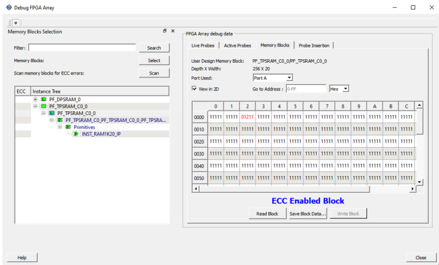

##### Physical Block Read

When a physical block is selected, only the **User Design Memory Block** and **Depth X Width** fields are shown.

")

")

##### Physical Block Read for ECC-Enabled Blocks

Instead of data being shown in a matrix form, ECC-enabled blocks are shown with data<br /> internally spread across Port A and Port B. As a result, they are concatenated to<br /> show the 33-bit data offset value in a single column. Similarly, ECC bits are<br /> concatenated from the two ports and shown in the adjacent column.

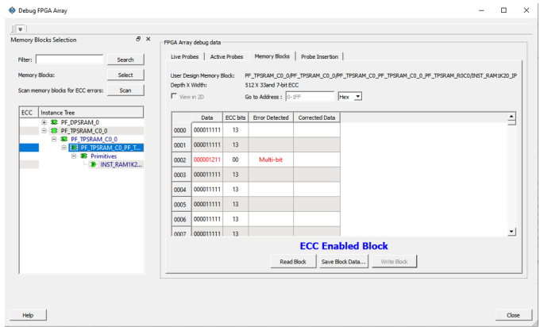

The following table describes the columns displayed in the physical block view.

|Column|Description|
|------|-----------|
|Data|PolarFire and PolarFire SoC devices: 33-bit physical block data<br /> offset value.RTG4 devices: 18-bit physical block data offset<br /> value.|
|ECC Bits|PolarFire and PolarFire SoC devices: 7-bit ECC value.RTG4<br /> devices: 6-bit ECC value.|
|Error Detected|Displays identified error type. The error type value displayed<br /> can be either **Single-Bit** or<br /> **Multi-Bit**.|
|Corrected Data|If the error is a single-bit error, then the tool suggests the<br /> corrected data. The suggested data can be copied to the data cell in<br /> order to write into the device. Right click on the corrected data<br /> to view an option to copy the data automatically to the<br /> Data cell.|

After the block is read, a log is generated and all the erroneous locations are<br /> listed. This log is also seen during a physical block read or when navigated from<br /> logical block view to physical. The same is true when navigating from physical to<br /> logical block view.

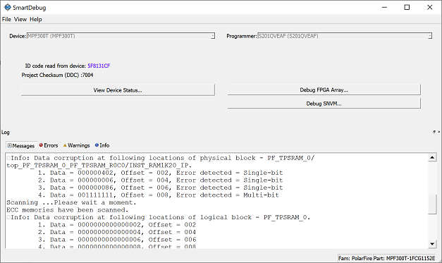

#### Write Block

##### Logical Block Write

A memory block write can be done on each location individually. A logical block shows<br /> each location of width. The written format is hexadecimal numbers from 0 to F. Width<br /> is shown in bits, and values are shown in hexadecimal format. If an entered value<br /> exceeds the maximum value, SmartDebug displays a message showing the range of<br /> allowed values.

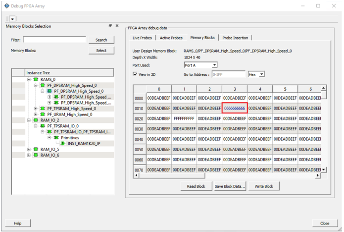

##### Logical Block Write for ECC-Enabled Blocks

You can inject error into the logical block by writing onto the location. To verify<br /> whether data is corrupted, read on the logical block to highlight the corresponding<br /> location.

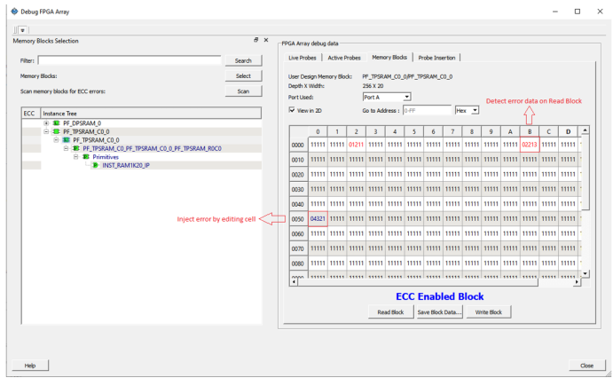

##### Physical Block Write

Physical blocks have a fixed width of 129 bits for uSRAM and the maximum value that<br /> can be written in hexadecimal format is FFF. Similarly, for LSRAM blocks, a range of<br /> values are possible \(1, 2, 5, 10, and 20\) and the maximum values can be 1, 3, 1F,<br /> 3FF, and FFFFF, respectively. If an entered value exceeds the limit, a message shows<br /> the range of permitted values that can be entered.

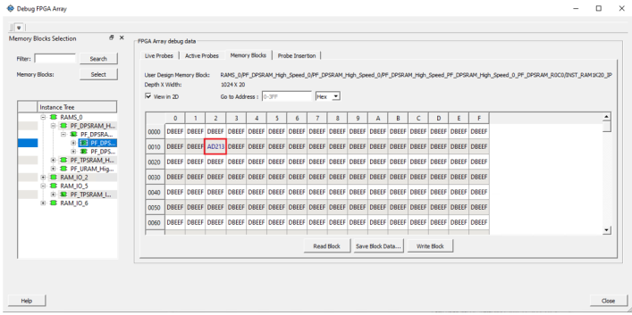

##### Physical Block Write for ECC-Enabled Blocks

You can inject error into the physical block by writing onto the location. To verify<br /> whether data is corrupted, read on the physical block to display any erroneous data,<br /> location, and suggest corrected data if it is a single bit.

**Note:** If corrupted data is written onto a physical block location, the logical block is outdated. Navigating to the logical view updates the locations of corrupted data after you click **Read Block**.

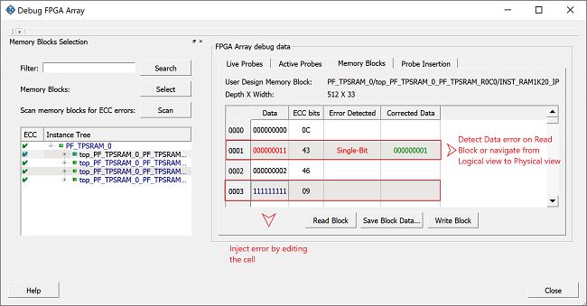

##### Limitation of Injecting Errors

**Note:** Error injection is discretionary. Generally, the ECC algorithm has limitations when it comes to Multi-bit detection. Data corrupted beyond 3 or 4 bits might result in one of the following scenarios:

-   An incorrect Single-bit corrected data is suggested.
-   Error might not be detected because the ECC calculated for the corrupted data might be the same that ECC calculated originally.

#### Scan Memory

Memory Hierarchy in the **Debug FPGA Array** window is enhanced to<br /> display whether the ECC-enabled memory blocks are corrupted or not by providing a scan<br /> option.

Click **Scan** to scan the ECC-enabled memory blocks for errors. If<br /> there are no errors in a memory block, a green tick appears on to the left of memory<br /> block name. Otherwise, a red circle indicates that the data is corrupted.

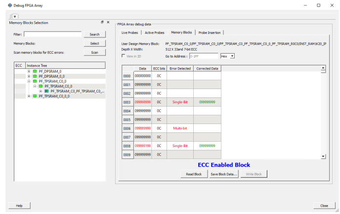

#### Unsupported Memory Blocks

If RTL is used to configure memory blocks, it is recommended that you follow the Microchip RAM block inference guidelines in the application note for your Microchip device \(see Related Application Notes below\).

SmartDebug may or may not be able to support logical view for memory blocks that are inferred using RTL coding.

**Related Application Notes**

-   PolarFire: [Inferring Microchip PolarFire RAM Blocks Application Note](https://ww1.microchip.com/downloads/aemdocuments/documents/fpga/ProductDocuments/ReleaseNotes/polarfire_math_block_inferring.pdf)
-   RTG4: [Inferring Microchip RTG4 RAM Blocks Application Note](https://ww1.microchip.com/downloads/aemDocuments/documents/FPGA/ApplicationNotes/ApplicationNotes/rtg4_ram_inferring.pdf)
-   SmartFusion 2: [Inferring Microchip SmartFusion 2 RAM Blocks Application Note](https://ww1.microchip.com/downloads/aemDocuments/documents/FPGA/ApplicationNotes/ApplicationNotes/smartfusion2_ram_inferencing.pdf)

#### Memory Blocks in Demo Mode

A temporary memory data file is created in the designer folder for each type of RAM selected. All memory data of all instances of USRAM, LSRAM, and other RAM types is written to their respective data files. The default value of all memory locations is shown as 0s, and is updated based on your changes.

Both physical block view and logical block view are supported.

### Probe Insertion \(Post-Layout\)

Probe insertion is a post-layout debug process that enables internal nets in the FPGA<br /> design to be routed to unused I/Os. Nets are selected and assigned to probes using the<br /> Probe Insertion window in SmartDebug. The rerouted design can then be programmed into<br /> the FPGA, where an external logic analyzer or oscilloscope can be used to view the<br /> activity of the probed signal.

**Note:** This feature is not available in Standalone mode because of the need to run incremental routing.

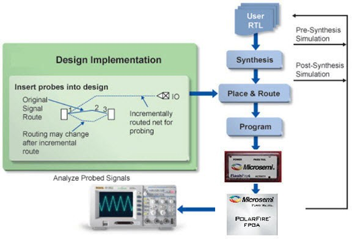

The Probe Insertion debug feature is complementary to Live Probes and Active Probes. Live<br /> Probes and Active Probes use a special dedicated probe circuitry.

#### Inserting Probe and Programming the Device

To insert probe\(s\) and program the device:

1.  Double click **SmartDebug Design**in the Design Flow window to open the SmartDebug window.

    **Note:** FlashPro Programmer must be connected for SmartDebug.

2.  Select **Debug FPGA Array**, and then select the **Probe Insertion** tab.

    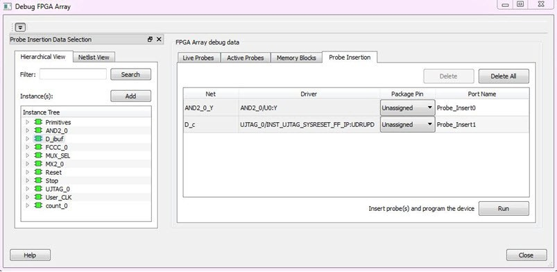

    In the left pane of the **Probe Insertion** tab, all available Probe Points are listed in instance level hierarchy in the Hierarchical view. All probe names are shown with the Name and Type in the Netlist View.

3.  Select probe points from the Hierarchical View or Netlist View, right click and choose **Add** to add them to the Active Probes UI. You can also add the selected probe points by clicking the **Add** button. The probes list can be filtered with the **Filter** box.

    Each entry has a Net and Driver name that identifies that probe point.

    The selected net\(s\) appear in the Probes table in the **Probe Insertion** tab \(see the following figure\). SmartDebug<br /> automatically generates the Port Name for the probe. You can change the<br /> default Port Name if desired.

4.  Assign a package pin to the probe using the drop-down list in the Package Pin column. You can assign the probe to any unused package pin \(spare I/O\).

    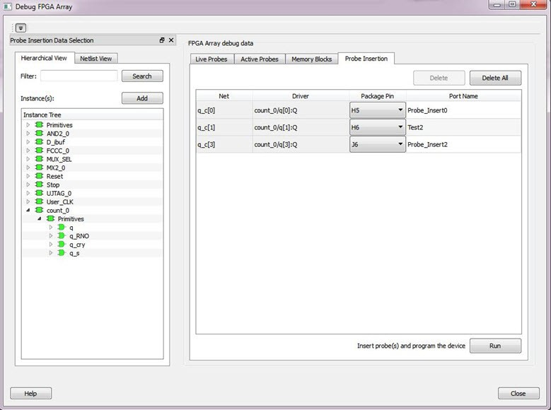

5.  Click **Run**.

    This triggers Place and Route in incremental mode, and the selected probe nets are routed to the selected package pin. After incremental Place and Route, Libero automatically reprograms the device with the added probes.

    The log window shows the status of the Probe Insertion run.


#### Deleting a Probe

To delete a probe, select the probe and click **Delete**. To delete all<br /> probes, click **Delete All**.

**Note:** Deleting probes from the probes list without clicking **Run**does not automatically remove the probes from the design.

#### Reverting to the Original Design

To revert to the original design after you have finished debugging:

1.  In SmartDebug, click **Delete All** to delete all probes.
2.  Click **Run**.
3.  Wait until the action has completed by monitoring the activity indicator \(spinning blue circle\). Action is completed when the activity indicator disappears.
4.  Close SmartDebug.

### Event Counter

Enabling FPGA Hardware Breakpoint enables Event Counter in the SmartDebug tool \(see section [FPGA Hardware Breakpoint Auto Instantiation](GUID-AFCD4A75-089E-4BD6-AFD4-FC526F201B3D.md#)\). This feature is<br /> used for any pseudo-static signal that does not toggle often. It counts the number of<br /> positive-edge transitions. Activate Event Counter is enabled when any signal or probe<br /> point from the selected list is assigned to Channel A via Live Probe. If you click<br /> **Activate Event Counter**, the count begins and the time elapsed<br /> is updated. Counting continues until the event counter is stopped using the<br /> **Stop** option. When Event counter is active, other tabs and<br /> features, such as **Active Probes**, **Memory Blocks**, and **Probe Insertion** are disabled.

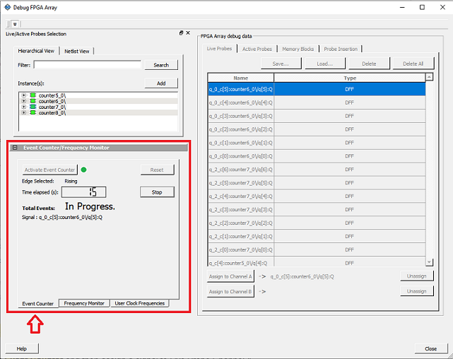

#### Activating the Event Counter

To activate the Event Counter, assign a signal to Probe Channel A, and then click<br /> **Activate Event Counter**.

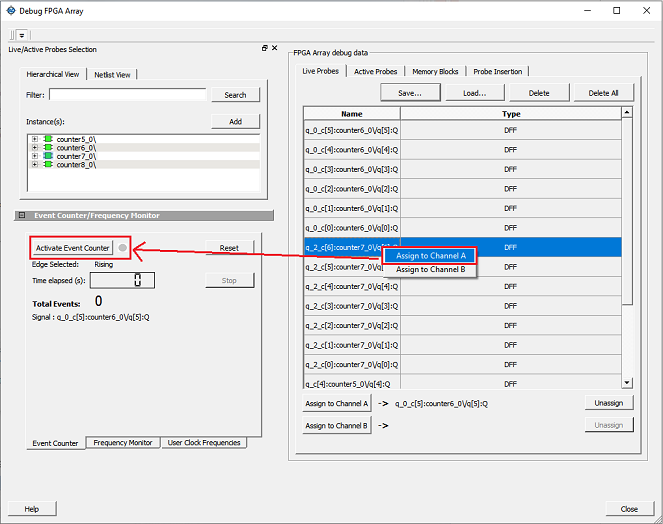

#### Running the Event Counter

When the Event Counter is active and in progress, a green LED appears next to the button as shown<br /> in the following figure. Time elapsed is shown in seconds. The<br /> **Stop** button is enabled to stop the counter. FPGA Array debug<br /> data and the control tabs in the Event Counter panel are disabled while running the<br /> Event Counter.

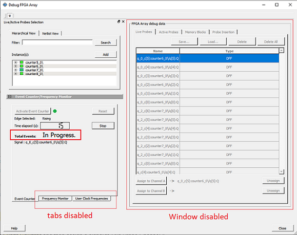

#### Stopping the Event Counter

To stop the Event Counter from counting, click the **Stop** button. A red LED<br /> appears when the Event Counter has stopped. FPGA Array debug data and the control tabs<br /> in the Event Counter panel are enabled when the Event Counter is not running.

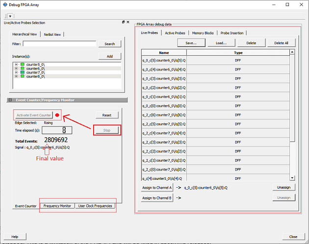

**Note:** If a DC signal \(signal tied to logic ‘0’\) is assigned to Live Probe Channel A, or if there are no transitions on the signal assigned to Live Probe Channel A with initial state ‘0’, the Event Counter value is updated as ‘1’ when the counter stops. This is a limitation of the FHB IP, and will be fixed in upcoming releases.

For more information, see [Frequency Monitor](GUID-AFCD4A75-089E-4BD6-AFD4-FC526F201B3D.md#) and [User Clock Frequencies](GUID-AFCD4A75-089E-4BD6-AFD4-FC526F201B3D.md#).

### Frequency Monitor

Enabling FPGA Hardware Breakpoint enables Frequency Monitor in the SmartDebug tool \(see section<br /> [FPGA Hardware Breakpoint Auto Instantiation](GUID-AFCD4A75-089E-4BD6-AFD4-FC526F201B3D.md#)\). The<br /> Frequency Monitor calculates the frequency of any signal in the design that can be<br /> assigned to Live Probe channel A. The Frequency Monitor is enabled when a probe point is<br /> assigned to Channel A via Live Probe.

The drop-down menu allows you to select the time to monitor the signal before the frequency is<br /> calculated. The accuracy of results increases as the monitor time increases. The unit of<br /> measurement is displayed in Megahertz \(MHz\). During the run, progress is displayed in<br /> the pane.

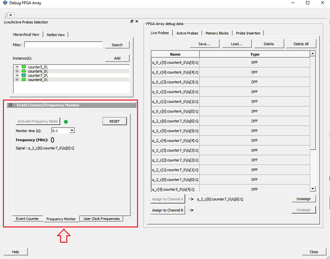

In the **Frequency Monitor** tab, you can activate the Frequency Monitor,<br /> change the monitor time \(delay to calculate frequency\), reset the monitor, and set the<br /> frequency in megahertz \(MHz\). Click the drop-down list to select monitor time value.<br /> During the frequency calculation, all tabs on the right side of the window are disabled,<br /> as well as the tabs in the FHB pane.

#### Activating the Frequency Monitor

Assign a signal to Channel A, click the **Live Probe**tab, click the<br /> **Frequency Monitor**tab, and then click **Activate Frequency Monitor**.

-   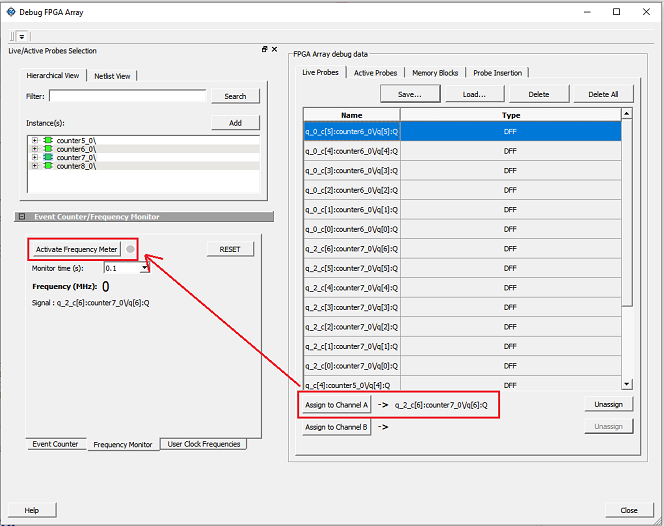


#### Running the Frequency Monitor

The Frequency Monitor runs automatically, and is indicated by a green LED. While it is running,<br /> FPGA Array debug data and the control tabs in the panel are disabled. A progress bar<br /> shows the monitor time progress when it is 1 second and above \(see the following<br /> figure\). The **Reset** button is also disabled during the run.

When a signal is assigned, the signal name appears next to **Signal**.

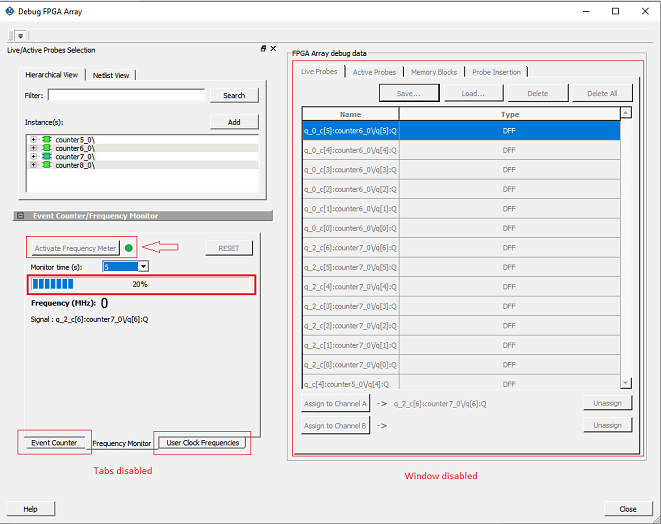

#### Stopping the Frequency Monitor

The Frequency Monitor stops when the specified monitor time elapses. This is indicated by a red<br /> LED. The result appears next to **Frequency**. The window and the<br /> tabs on the control panel are enabled. The **Reset** button is also<br /> enabled to reset the Frequency to 0 to start over the next iteration. The progress bar<br /> is hidden when the Frequency Monitor stops.

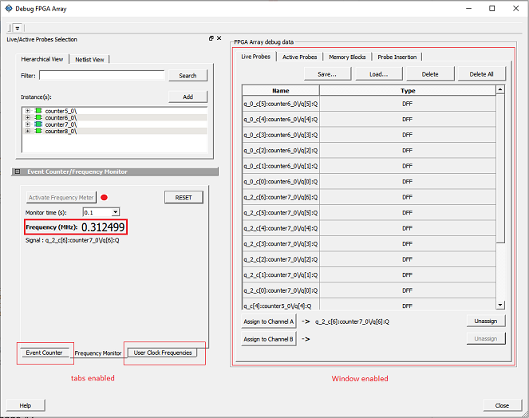

For more information, see [Frequency Monitor](GUID-AFCD4A75-089E-4BD6-AFD4-FC526F201B3D.md#) and [User Clock Frequencies](GUID-AFCD4A75-089E-4BD6-AFD4-FC526F201B3D.md#).

### FPGA Hardware Breakpoint Auto Instantiation

The FPGA Hardware Breakpoints \(FHB\) auto-instantiation feature automatically instantiates<br /> an FHB instance per clock domain that uses clocks \(GL0, GL1, GL2, and GL3\) from an FCCC<br /> instance. In PolarFire and PolarFire SoC, the instantiation is not limited to FCCC, it<br /> can be done on any of the four CLKINT types, such as CLKINT, GCLKINT, RCLKINT, and<br /> RGCLKINT. Enabling FHB auto-instantiation also enables the Event Counter and Frequency<br /> Monitor. The FHB instances gate the clock domain they are instantiated on. These<br /> instances can be used to force halt the design or halt the design through a live probe<br /> signal. After halting a selected clock domain or all clock domains, you can play or step<br /> on the clock domains. The FHB controls in the SmartDebug UI allow you to control the<br /> debugging cycle.

To enable this option:

1.  Launch **Libero**.
2.  Select **Project** &gt; **Project Settings**. The **Project settings** dialog box appears.
3.  Select **Design flow** from the options available on the left pane of the dialog box.
4.  Select the **Enable FPGA Hardware Breakpoints Auto Instantiation** check box from the **Root top** options that appear on the right pane of the dialog box.
5.  In PolarFire and PolarFire SoC, you must create an NDC constraints file in Constraint Manager and enter the following command in the file to instantiate an FHB IP: `auto_instantiate_fhb -inst_name {<clkint name here>}`. To instantiate FHB in all clock domains in the design, those many commands must be entered in the NDC file. This is auto-generated for other family devices.

**Note:** Observe the following:

-   FHB auto-instantiation can also be done in the “Import netlist as VM file” flow.
-   In PolarFire and PolarFire SoC, FHB can also be instantiated in the designs that have secured or encrypted components.
-   The Spatial Debug Widget and FHB feature are hidden, and an INFO message is printed in the log if the user design has live probe I/Os enabled as input.

#### FHB Operations

If there is an auto-instantiated FHB instance in the design, FHB controls appear in the<br /> **FPGA Operations** tab.

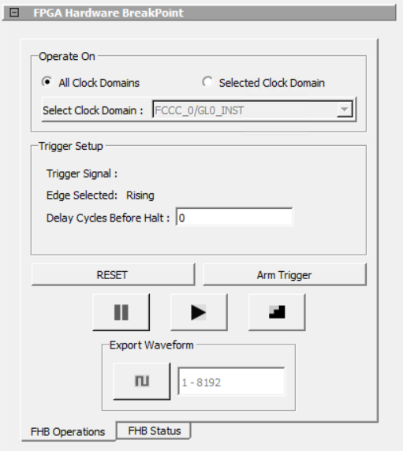

##### Selecting a Clock Domain Mode

Select **All Clock Domains**or **Selected Clock Domain** to set the FHB instances to the appropriate mode.

-   If you select **All Clock Domains**, use the Halt \(Pause\) , Play , and Step  buttons to navigate through all clock domains.
-   If you select **Selected Clock Domain**, select a<br /> clock domain from the **Select Clock Domain**<br /> drop-down. Use the Halt \(Pause\), Play, and Step buttons to navigate<br /> through the selected clock domain. If you switch clock domains, previous<br /> clock domain settings are not retained.


##### Specifying a Trigger

After you assign the Live Probe PROBE\_A connection, determine whether a certain number of<br /> clock cycles is required before halting the clock domain after triggering.

-   If clock cycles are not required, click **Arm Trigger** to stop the DUT on the next positive edge that occurs on the signal connected to Live Probe PROBE\_A.
-   If clock cycles are required, enter a value between 0 and 255 for **Delay Cycles Before Halt**, and then click **Arm Trigger**. This setting configures the FHBs to trigger after the specified delay from the rising edge trigger. The delay is not applied to a forced Halt.

Observe the following guidelines:

-   The Trigger Signal appears as **Not Connected** until a live probe is assigned.
-   When a probe is assigned to Live Probe PROBE\_A, the Trigger Signal updates.
-   Clicking **Arm Trigger** when a live probe connection is made disables FHB functions until the trigger is disarmed automatically or the design is force halted.

##### Live Probe Halt

To halt a selected clock domain or all clock domains \(based on your clock mode<br /> selection\), assign a signal to Live Probe PROBE\_A in the **Live Probes**tab in the Debug FPGA Array dialog box, and then click the<br /> **Active Probe**tab to see the FPGA Hardware Breakpoint<br /> controls.

To arm the FHBs to look for a trigger on the signal connected to Live Probe PROBE\_A,<br /> click **Arm Trigger**. After the trigger occurs, the clock<br /> domains are halted. If only one clock domain is halted, other clock domains continue<br /> to run, and you should anticipate results accordingly.

<br />

**Note:** You can delay Live Probe Halt up to 255 clock cycles. The actual delay realized on hardware is calculated by the following equation:

<br />

```
Actual delay cycles on hardware =
#Delay clock cycles before halt mentioned in smartdebug * (DUT clock frequency/FHB clock frequency)
```

where :

```
FHB clock frequency
```

is device specific. For PolarFire,<br /> the frequency is 160 MHz.

For more information, see [Assumptions and Limitations](GUID-AFCD4A75-089E-4BD6-AFD4-FC526F201B3D.md#).

##### Force Halt

To force halt a selected clock domain or all clock domains \(based on your clock mode<br /> selection\) without having to wait for a trigger from a live probe signal. Click the<br /> **Halt**button in the FPGA Hardware Breakpoint \(FHB\)<br /> controls.

-   In the **Operate on Selected Clock Domain**mode, the state of the **Halt** button is updated based on the state of the clock domain selected.
-   In the **Operate on all Clock Domains**mode, the **Halt** button is disabled only when all clock domains are halted. Each clock domain is halted sequentially in the order shown in the**Select Clock Domain** combo box.

**Note:** If only one clock domain is halted, other clock domains continue to run, and you should anticipate results accordingly.

##### Play Button

When the clock domain is in a halted state \(live probe halt or force halt\), clicking<br /> **Play**in the FPGA Hardware Breakpoint controls resumes the<br /> clock domain from the halted state.

In **Operate on all Clock Domains**mode, each clock domain runs<br /> sequentially in the order shown in **Select Clock Domain**.

##### Step Button

Once the clock domain is in a halted state \(live probe halt or force halt\), you can<br /> click the **Step**button in the FPGA Hardware Breakpoint<br /> controls. Clicking this button advances the clock domain by one clock cycle and<br /> holds the state of the clock domain. In **All Clock Domains**mode, each clock domain steps sequentially in the order shown in<br /> **Select Clock Domain**.

##### Waveform Capture

You can save the waveform view of the selected active probes using Export Waveform by<br /> specifying the number of clock cycles to capture in text box and then clicking<br /> **Capture Waveform**. The waveform is saved to a<br /> `.vcd` file. The valid range for capture depth is 1 to 8K<br /> \(8192\).

To view the waveforms, import the `.vcd` file. You can then view<br /> the waveform file using a waveform viewer that supports the<br /> `.vcd` file format.

##### Trigger Input

To have an event in the DUT trigger the FHB IP \(for example, a particular state in<br /> the FSM or counter value\) when this signal is asserted, use the trigger input<br /> signal. If the trigger signal is already asserted \(HIGH\) when the FHB is armed, the<br /> DUT halts immediately.

Force Halt, Play, and Step operations are performed using the FHB controls. After the<br /> clock domain is halted, you can either force Play the clock domain or Step the clock<br /> domain by 1 clock cycle. To save the waveform view of the selected active probes,<br /> use Export Waveform by specifying the number of clock cycles to capture. The<br /> waveform is saved to a `.vcd` file.

#### FHB Status

You can now view the status of all the FHB clock domains at the same time using the<br /> **FHB Status** tab on the **FPGA Hardware Breakpoint** widget. There is no Tcl command equivalent to this<br /> function.

The status of all FHB clocks in a sample design is shown in the following figure.

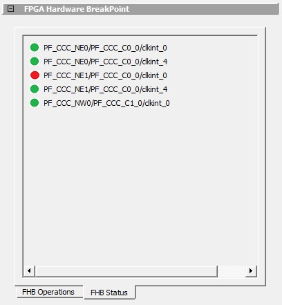

#### Assumptions and Limitations

-   If you select the auto instantiation option in Libero and ran Synthesis, you must rerun Synthesis for the FHB-related functionality.
-   In SmartFusion 2, IGLOO 2, and RTG4 devices, FHB is inserted on the Global clock outputs from CCC only.
-   CLKINT\_PRESERVE – FHB is not auto-instantiated if the user design contains this macro.
-   In SmartFusion 2, IGLOO 2, and RTG4 devices, FHB instantiation is not supported in designs that have encrypted IP cores.
-   EDIF using constraints flow is not supported.
-   Live Probe triggering occurs on the Positive Edge only.
-   In SmartFusion 2, IGLOO 2, and RTG4 devices, for imported verilog netlist files \(.vm files\), you must rerun synthesis to get FHB-related functionality. If synthesis is disabled and the netlist is compiled directly, FHB functionality is not inferred.
-   If only one clock domain halts during operations, other clock domains continue to run, and you should anticipate results accordingly.
-   FHB performance can only be characterized against the clock which it is running at \(that is, 160 MHz\).
    -   If the DUT clock is running at or less than 160 MHz, the DUT clock halts within one clock cycle \(1 or less\).
    -   For frequencies higher than 160 MHz, the point at which the DUT halts cannot be ensured.
    -   FHB cannot be instantiated if a design has system controller Suspend Mode enabled.
-   For all device families, FHB cannot be added to designs with System Controller Suspend Mode set to ON.
-   For PolarFire and PolarFire SoC, the FHB auto-generates the FHB SDC file, obviating the need for you to create this file. However, the file does not appear in the Constraint Manager and is not available for you to manage. For other product families, the FHB SDC file is auto-generated and auto-associated by the FHB flow, and you can manage the SDC file through the Constraint Manager.

### User Clock Frequencies

The **User Clock Frequencies** tab shows the frequencies that have been<br /> configured from the FCCC block. If assigned, live probe channels are temporarily<br /> unassigned, and reassigned after user clock frequencies have been calculated. The<br /> **Refresh** button \(circled in the following figure\) recalculates<br /> frequencies if clocks have been changed.


For related information, see [Event Counter](GUID-AFCD4A75-089E-4BD6-AFD4-FC526F201B3D.md#) and [Frequency Monitor](GUID-AFCD4A75-089E-4BD6-AFD4-FC526F201B3D.md#).

### Pseudo Static Signal Polling

With Active Probes you can check the current state of any probe in the design. However, in most<br /> cases, you may not be able to time the active probe read to capture its intended value.<br /> For these cases, you can use Pseudo Static Signal Polling, in which the SmartDebug<br /> software polls the signal at intervals of one second to check if the probe has the<br /> intended value. This feature is useful in probing signals that reach the intended state<br /> and stay in that state.

From the **Active Probes** tab in the Debug FPGA Array dialog box, right click<br /> a signal, bus, or group and select **Poll** to open the Pseudo-static<br /> signal polling dialog box as shown in the following figure.

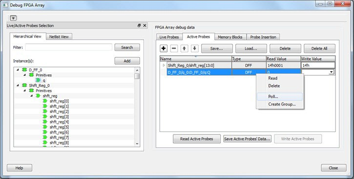

#### Scalar Signal Polling

To poll scalar signals, select **Poll for 0**or **Poll for 1**.

The selected signal is polled once per second. It should be used for pseudo-static<br /> signals that do not change frequently. The elapsed time is shown next to **Time Elapsed in seconds**.

To begin polling, click **Start Polling** as shown in the following<br /> figure.

 - Start Polling")

To end polling, click **Stop Polling** as shown in the following<br /> figure.

 - Stop Polling")

**Note:** You cannot change the poll value or close the polling dialog box while polling is in progress.

The elapsed time is updated in seconds until the polled value is found. When the polled<br /> value is found, **User value matched**is displayed in green in the<br /> dialog box as shown in the following figure.

 - User Value Matched")

#### Vector Signal Polling

To poll vector signals, enter a value in the text box. The entered value is checked and<br /> validated. If an invalid value is entered, start polling is disabled and an example<br /> shows the required format.

")

<br />

 - After Validation")

<br />

When you enter a valid value and click **Start Polling**, polling begins.

To end polling, click **Stop Polling**.

**Note:** You cannot change the poll value or close the polling dialog box while polling is in progress.

The elapsed time is updated in seconds until the polled value is found. When the polled value is<br /> found, **User value matched**is displayed in green in the dialog<br /> box.

## PolarFire and PolarFire SoC Debug Elements

The following sections describe the debug elements for PolarFire and PolarFire SoC.

### Debug sNVM

The sNVM block stores User data and UIC data. This data is stored as clients and can be<br /> configured in the Libero design. The USK \(User Secret Key\) security key secures pages<br /> within the memory. Authenticated data can be plain text or encrypted text, and<br /> non-authenticated data is plain text. SmartDebug helps the user read the page content of<br /> the sNVM block.

The sNVM Debug window has two tabs – [Client View](GUID-AFCD4A75-089E-4BD6-AFD4-FC526F201B3D.md#) and [Page View](GUID-AFCD4A75-089E-4BD6-AFD4-FC526F201B3D.md#).

#### Client View

When the sNVM window opens, two tabs appear. Client information appears in the **Client View** tab when it is configured in the Libero design. Select a client to<br /> expand the table and see pages and page status inside the client. Click the<br /> **Read From Device**button to view the memory content.

You can select only one client at a time. Pages inside the client cannot be selected. The Start<br /> Page, End Page, and Number of Bytes are displayed for the selected client.


Click the **View All Page Status**button to see information for all pages in<br /> the client as shown in the following figure. Click the **Export**<br /> button to export the sNVM data to a text file.

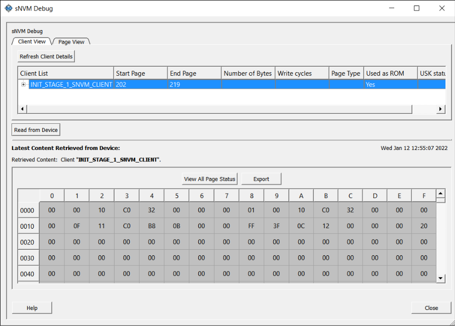

#### Page View

Page View is used to read a range of pages where start and end page have been specified.

If a page is secured, the default USK is used by SmartDebug to get the page status. If<br /> successful, the USK automatically reads the page. If a different USK has been set using<br /> system services, use the option to enter the USK, as shown in the following figure.

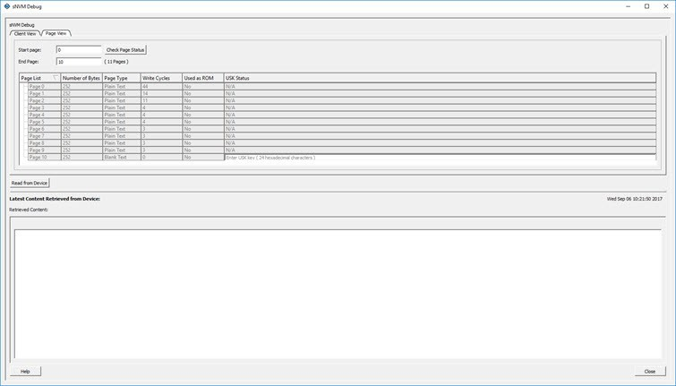

The following figure shows the specified page range.


The following figure shows the page status.


#### Read Operation

##### Client View

The Client View displays all the clients that are configured in the design. When a<br /> client is expanded, a table listing all pages is displayed.

When a client is selected, the **Read from Device** button is<br /> enabled. Click **Read from Device**to read the content of the<br /> client. A client can have one or more pages. Refresh Client Details option is given<br /> to the user to refresh the table. Click **Refresh Client Details**to update the information in SmartDebug and refresh the table. This is<br /> helpful when a client configuration is changed using system services.

##### Page View

Entering valid parameters and clicking **Check Page Status**<br /> displays a table of all pages with page status information. Pages in the table are<br /> read-only and cannot be selected. The page range included in Start Page and End Page<br /> is validated, and the **Read from Device** button is enabled.<br /> Click **Read from Device**to read the content.

#### Runtime Operations

After a design is programmed into the device, you can do the following:

-   Change the content of a page.
-   Authenticate a page.
-   Change the security key of each configured page.

The preceding operations are not possible if the page is used as ROM. You can refresh page status<br /> in SmartDebug:

-   Click the **Refresh Client Details**button in the **Client View** tab to refresh the client view table and update it with the latest changes.
-   Click the **Check Page Status**button in the **Page View** tab to refresh the pages in the table.

If the security key has been changed, SmartDebug prompts you to enter the USK manually.<br /> Enter the USK in the USK Status column \(**Client View** tab and<br /> **Page View** tab\). By default, the USK entered in the<br /> configurator as the USK client is used to authenticate the page.

#### Demo Mode

Debug sNVM is supported in Demo Mode. The Client View and Page View are supported. Data from device initialization and configurators is shown in the Client View and User Design View.

### Debug Transceiver

The Debug Transceiver feature in SmartDebug checks the lane functionality and health for<br /> different settings of the lane parameters.

By default, lanes are configured in full duplex mode. Half duplex mode is also supported<br /> for each lane in the Quads. More information about half duplex mode lane configuration<br /> is provided in the following sections:

-   [Configuration Report](GUID-AFCD4A75-089E-4BD6-AFD4-FC526F201B3D.md#)
-   [SmartBERT](GUID-AFCD4A75-089E-4BD6-AFD4-FC526F201B3D.md#)
-   [Loopback Modes](GUID-AFCD4A75-089E-4BD6-AFD4-FC526F201B3D.md#)
-   [Static Pattern Transmit](GUID-AFCD4A75-089E-4BD6-AFD4-FC526F201B3D.md#)
-   [Eye Monitor](GUID-AFCD4A75-089E-4BD6-AFD4-FC526F201B3D.md#)
-   [Register Access](GUID-AFCD4A75-089E-4BD6-AFD4-FC526F201B3D.md#)
-   [Signal Integrity](GUID-AFCD4A75-089E-4BD6-AFD4-FC526F201B3D.md#)
-   [Optimize Receiver](GUID-AFCD4A75-089E-4BD6-AFD4-FC526F201B3D.md#)

To access the Debug Transceiver feature in SmartDebug, click **Debug Transceiver** in the main SmartDebug window. This opens the Debug<br /> TRANSCEIVER dialog box.

#### Configuration Report

Configuration Report is the first tab in the **Debug TRANSCEIVER** dialog box,<br /> and is shown by default when the dialog box opens. The **Configuration Report** shows the physical location, status/health, and data width for<br /> all lanes of all the quads enabled in the system controller.

Click the **Refresh**button to refresh the information.

**Note:** The report refreshes automatically when you navigate from another tab.


Parameter information is shown in a tabular format, with lane numbers as rows and<br /> transceiver instance names as columns. The lane parameters are as follows:

-   **Physical Location**: Physical block and lane location in the system controller.
-   **Tx PMA Ready**: Indicates if the Tx of the lane is powered up and ready for transactions. Rx-only lane in half duplex mode is shown as "NA".
-   **Rx PMA Ready**: Indicates if the Rx of the lane is powered up and ready for transactions. Tx-only lane in half duplex mode is shown as "NA".
-   **TX PLL**: Indicates if the lane is locked onto TX PLL. Rx-only lane in half duplex mode is shown as "NA".
-   **RX PLL**: Indicates if the lane is locked onto RX PLL. Tx-only lane in half duplex mode is shown as "NA".
-   **RX CDR PLL**: Indicates if the lane is locked onto the incoming data. Tx-only lane in half duplex mode is shown as "NA".

**Note:** For the preceding parameters, green indicates true and red indicates false.

#### Transceiver Hierarchy

Transceiver Hierarchy view is a lane hierarchy with all the lanes instantiated in the design<br /> shown with respect to top level instance.

Transceiver Hierarchy view appears on the following tabs:

-   [SmartBERT](GUID-AFCD4A75-089E-4BD6-AFD4-FC526F201B3D.md#)
-   [Loopback Modes](GUID-AFCD4A75-089E-4BD6-AFD4-FC526F201B3D.md#)
-   [Static Pattern Transmit](GUID-AFCD4A75-089E-4BD6-AFD4-FC526F201B3D.md#)
-   [Eye Monitor](GUID-AFCD4A75-089E-4BD6-AFD4-FC526F201B3D.md#)

On the SmartBERT, Loopback Modes, and Static Pattern Transmit pages, check boxes allow multiple<br /> lanes to be selected for debug, as shown in the following figure.

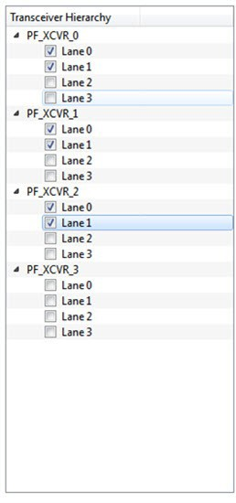

On the Eye Monitor page, eye monitoring is done one lane at a time, as shown in the following<br /> figure.


#### SmartBERT

You can select lanes in the Transceiver Hierarchy and use debug options to run SmartBERT<br /> tests on the SmartBERT page of the Debug TRANSCEIVER dialog box.

Click the **SmartBERT**tab in the Debug TRANSCEIVER dialog box to open<br /> the SmartBERT page.

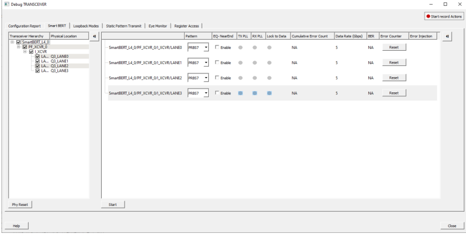

The following input options and outputs are represented as columns:

-   **Pattern**: Input option. Select a PRBS pattern type from the drop-down list: PRBS7, PRBS9, PRBS15, PRBS23, or PRBS31. The default is PRBS7.
-   **EQ-NearEnd**: Input option. When checked, enables EQ-NearEnd loopback from Lane Tx to Lane Rx. Disabled for half duplex mode.
-   **TX PLL**: Indicates whether a lane is locked onto TX PLL when the SmartBERT test is in progress. Rx Only lane in half duplex mode is shown as "NA".
    -   Gray indicates test is not in progress.
    -   Green indicates lane is locked onto TX PLL.
    -   Red indicates lane is not locked onto TX PLL.
-   **RX PLL**: Indicates if lane is locked onto RX PLL when the SmartBERT test is in progress. Tx Only lane in half duplex mode is shown as "NA".
    -   Gray: Indicates test is not in progress
    -   Green: Indicates lane is locked onto TX PLL
    -   Red: Indicates lane is not locked onto TX PLL
-   **Lock to Data**: Indicates if lane is locked onto incoming data / RX CDR PLL when the SmartBERT test is in progress. Tx Only lane in half duplex mode is shown as "NA".
    -   Gray: Indicates test is not in progress
    -   Green: Indicates lane is locked onto TX PLL
    -   Red: Indicates lane is not locked onto TX PLL
-   **Cumulative Error Count**: Displays the error count when the SmartBERT test is in progress.
-   **Data Rate**: Data rates are shown according to the configured data rates for all duplex modes except for Independent TxRx, where both Tx data rate and Rx data rate are shown. See the preceding figure.
-   **BER**: Calculates the Bit Error Rate \(BER\) from the cumulative error count and data rate and displays it in the column.
-   **Error Counter Reset**: Resets the error counter and BER of the lane. A reset can be done at any time.

All output parameters are updated approximately once per second, with their values retrieved<br /> from the device. To add lanes, in the Transceiver Hierarchy, check the boxes next to the lanes<br /> to be added. To remove lanes, uncheck the boxes next to the lanes to be removed.

Select the desired options and click **Start**to start the Smart BERT<br /> test on all selected lanes. A popup message appears if a test cannot be started on one lane,<br /> multiple lanes, or all lanes. Tests will start normally on all unaffected lanes.

Click the **Phy Reset**button to do a Phy reset on all checked lanes in<br /> the Transceiver Hierarchy. This button is disabled when a PRBS test is in progress.

Edit the signal integrity option of any lane by selecting the lane in the PRBS tree and<br /> modifying the option in the Signal Integrity group box.

**Note:** You can navigate to other tabs when a SmartBERT test is in progress, but you cannot perform any debug activity except to use Plot Eye for any lane on the Eye Monitor page.

**Note:** You cannot close the SmartBERT window when a test is in progress. Attempting to do so will result in the following message:

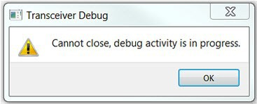

Click the **Stop**button to stop the SmartBERT test on all lanes<br /> simultaneously.

**Note:** SmartBERT tests are disabled for PCIe® lanes.

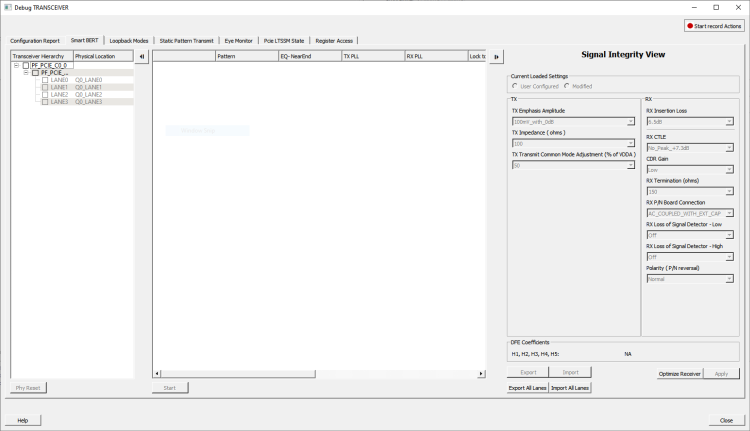

PCIe lanes x1 configuration exposes unused lanes that are disabled on all the tabs in the<br /> Debug TRANSCEIVER window.

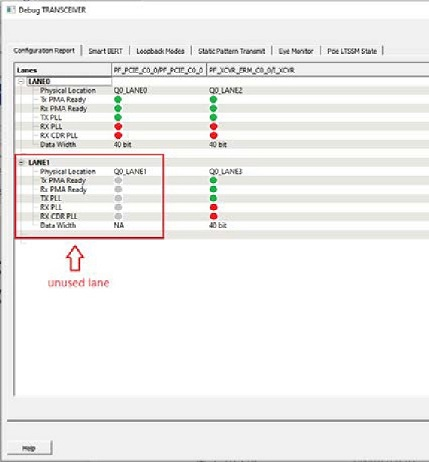

##### SmartBERT IP

The CoreSmartBERT core provides a broad-based evaluation and demonstration platform for PolarFire<br /> transceivers \(PF\_XCVR\). Parameterizable to use different transceivers and clocking<br /> topologies, the SmartBERT core can also be customized to use different line rates and<br /> reference clock rates. Data pattern generators and checkers are included for each<br /> PF\_XCVR, giving several different Pseudo-random binary sequences PRBS<br /> \(2**7**,2**23**, 2**15**, and 2**31**\).

Each SmartBERT IP can have four lanes configured. Each Lane can have the pattern type PRBS7, PRBS9, PRBS23, or PRBS31 configured.

SmartDebug identifies the lanes that are used by the SmartBERT IP and distinguishes them by<br /> adding "\_IP" to the SmartBERT IP instance name in the Transceiver Hierarchy.

You can expand a SmartBERT IP instance to see all the lanes. Check the check box next to a lane<br /> to add the lane to the SmartBERT IP page and include the lane in a PRBS test. If the box<br /> is unchecked, it will not be added as shown in the following figure.

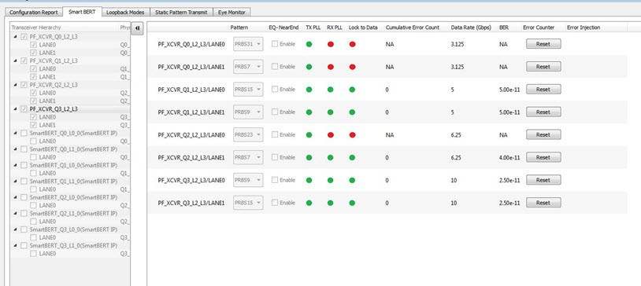

You can select patterns for the added lane\(s\) from a drop-down list as shown in the following<br /> figure.

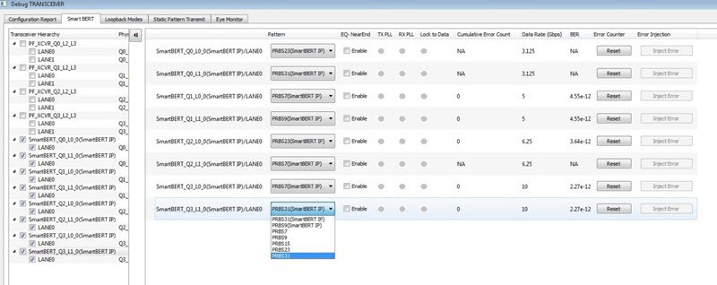

After the lane\(s\) have been added and the patterns\(s\) selected, click **Start**to enable the transmitter and receiver for the added lanes and patterns.

###### Error Injection

When SmartBERT IP lanes are added, you will see the **Error Injection** column and **Error Inject** button.<br /> Errors can be injected by clicking the **Error Inject**button<br /> when a PRBS test is running. This feature tests whether the error is identified by<br /> the pattern checker.

**Note:** This column does not appear for non-SmartBERT IP lanes, or if a non-configured PRBS pattern has been selected.

###### Error Count

Error Count is shown when a lane is added and a PRBS pattern is run. The error count<br /> can be cleared by clicking the **Reset**button under the<br /> **Error Counter** column.

The following figure shows the **Reset** and **Inject Error** buttons.

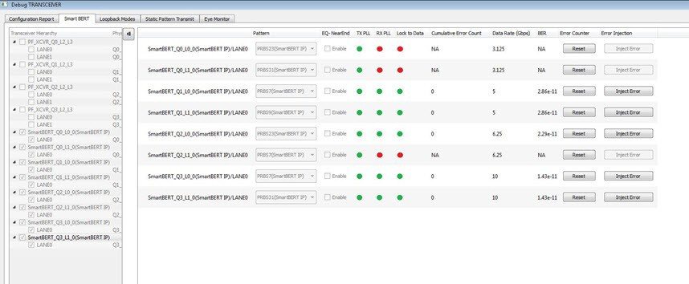

#### Loopback Modes

The Loopback Modes page in the Debug TRANSCEIVER dialog box allows you to select lanes<br /> from the Transceiver Hierarchy and use Loopback Mode debug options.

Click the **Loopback Modes** tab in the Debug TRANSCEIVER dialog<br /> box.

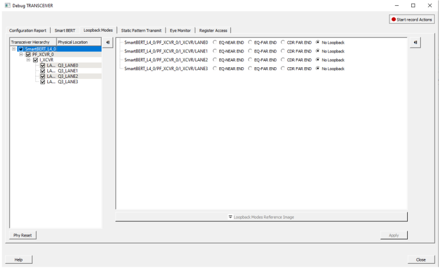

You can select the desired loopback type \(EQ-NEAREND, EQ-FAREND, CDRFAREND, or No<br /> Loopback\) for each lane.

**Note:** These loopback types \(EQ-NEAREND, EQ-FAREND, CDRFAREND, No Loopback\) are enabled only for full duplex modes and are disabled for the three half duplex modes. See the preceding figure.

-   **EQ-NEAR END**: Set EQ-Near End loopback from Lane Tx to Lane Rx. This loopback mode is supported up to 10.3125 Gbps.
-   **EQ-FAR END**: Set EQ-Far End loopback from Lane Tx to Lane Rx.
-   **CDR FAR END**: Set CDR Far End loopback from Lane Rx to Lane Tx.
-   **No Loopback**: Set this option to have no loopback between Lane Tx and Lane Rx. \(For external loopback using PCB backplane or High Speed Loopback cables.\)

Click **Apply** to enable the selected loopback mode on the<br /> lane\(s\).

**Note:** If you proceed to another tab without applying your changes to loopback modes, the following popup message appears:

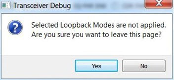

Click **Yes**to ignore the changed selections and move to another<br /> selected page. Click **No**to remain on the current page.

#### Static Pattern Transmit

In the Static Pattern Transmit page of the Debug TRANSCEIVER dialog box, you can select<br /> lanes from the Transceiver Hierarchy and use Static Pattern Transmit debug options.

Click the **Static Pattern Transmit** tab in the Debug TRANSCEIVER<br /> dialog box to open the Static Pattern Transmit page.

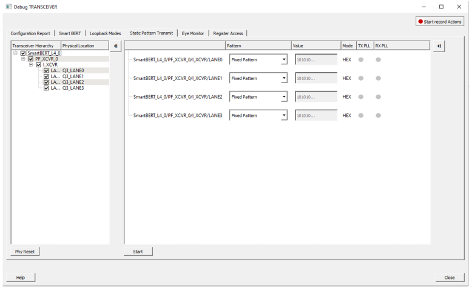

When a lane is added from the Transceiver Hierarchy, the following debugging options can<br /> be selected:

-   **Pattern**: Pattern selection is available/enabled for all modes except Rx Only, because it is applicable only for Tx. \(and Tx is present in Full Duplex, Tx Only, and Independent TxRx\)
    -   Fixed Pattern is a 10101010... pattern. Length is equal to the data width of the Tx Lane.
    -   Max Run Length Pattern is a 1111000... pattern. Length is equal to the data width of the Tx Lane, with half 1s and half 0s.
    -   User Pattern is a user defined pattern in the value column. Length is equal to the data width.
-   **Value**: Editor available only with the User Pattern type. For other pattern type selections, it is disabled.
    -   Takes the input pattern to transmit from the Lane Tx of selected lanes.
    -   Pattern type should be Hex numbers, and not larger than the data width selected.
    -   Internal validators dynamically check the pattern and indicate when an incorrect pattern is given as input.
-   **Mode**: Currently, HEX mode is supported for pattern type.
-   **TX PLL**: Indicates Lane lock onto TX PLL when Static Pattern Transmit is in progress.
    -   *Gray*: Test is not in progress.
    -   *Green*: Lane is locked onto TXPLL.
    -   *Red*: Lane is not locked onto TXPLL.
-   **RX PLL**: Indicates Lane lock onto RX PLL when Static Pattern Transmit is in progress.
    -   *Gray*: Test is not in progress.
    -   *Green*: Lane is locked onto RXPLL.
    -   *Red*: Lane is not locked onto RXPLL.

Click **Start**to start the Static Pattern Transmit on selected<br /> lanes. Click **Stop**to stop the Static Pattern Transmit test on<br /> selected lanes.

#### Eye Monitor

You can determine signal integrity with the Eye Monitor feature. It allows you to<br /> create an eye diagram to measure signal quality. Eye Monitoring estimates the<br /> horizontal eye-opening at the receiver serial data sampling point and helps you<br /> select an optimum data sampling point at the receiver.

To use the Eye Monitor feature, perform the following:

1.  Start SmartDebug from Libero.

2.  Click the **Eye Monitor** tab in the Debug TRANSCEIVER dialog box.


##### Eye Scan Mode

Eye Monitor can be run in one of two modes: [Normal mode](GUID-AFCD4A75-089E-4BD6-AFD4-FC526F201B3D.md#) or [Infinite Persistent mode](GUID-AFCD4A75-089E-4BD6-AFD4-FC526F201B3D.md#).<br /> Choose the desired mode in the **Eye Scan Mode** drop-down.

**Important:** Eye plot is disabled for lanes with a data-rate less than 3 Gbps.

###### Normal Mode

**Note:** This feature is not available for the **Tx Only** mode. In this mode, all the **Eye Monitor** buttons and the **Optimize Receiver** button are disabled \(grayed out\).

In the Normal mode, **Plot Eye** performs single eye scanning and displays the<br /> Eye diagram as shown in the following example figure.

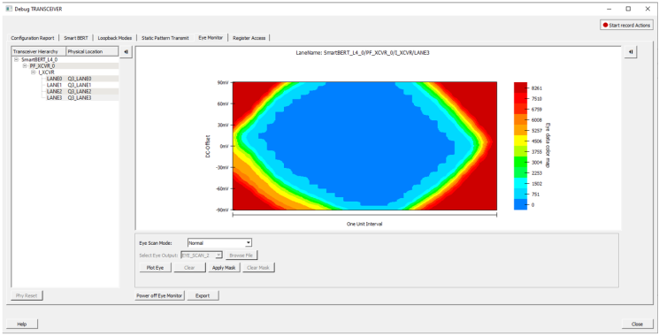

###### Infinite Persistent Mode

When the Infinite Persistent mode is selected, the **Plot Eye** button changes<br /> to **Start Plot Eye**.

**Important:**

-   This feature is not available for Tx Only mode
-   Eye plot is disabled for lanes with a data-rate less than 3 Gbps

Click **Start Plot Eye**to start Infinite Persistent eye<br /> monitoring as shown in the following figure.

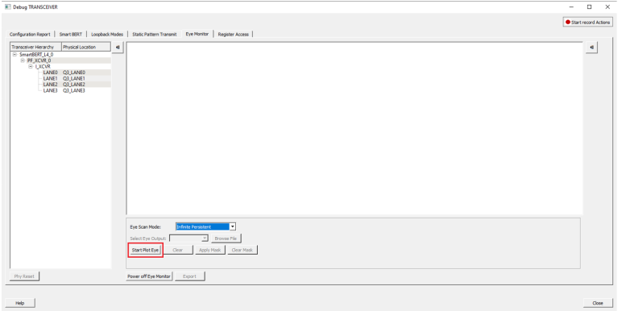

The **Start Plot Eye**button changes to **Stop Plot Eye**and the infinite scanning and cumulation process begins. In every iteration,<br /> the eye is cumulated with all previous eyes to make a single “cumulative eye”. This<br /> cumulative eye appears with a color scheme in the GUI, as shown in the following figure.<br /> The completed iteration number, and the cumulative BER is updated and appears after<br /> every iteration, along with the cumulative eye. To stop cumulative eye monitoring, click<br /> **Stop Plot Eye**. The process halts after the current iteration<br /> completes.

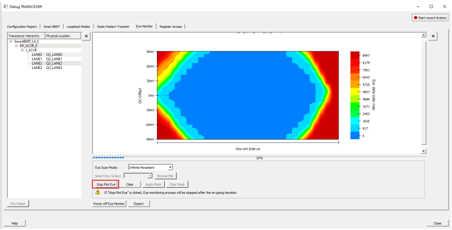

###### Clear

The **Clear**button is enabled for Infinite Persistent eye scan mode and is<br /> disabled for Normal eye scan mode. At any time during Infinite Persistent eye<br /> monitoring, clicking the **Clear**button clears the cumulative<br /> eye computation and then starts a new cumulative eye computation.

**Note:** The Current Iteration count does not reset. Only the cumulative eye is cleared.

###### Additional Eye Output Text Files

Data files are generated in Normal mode and Infinite Persistent mode. These files contain the eye<br /> data errors in the matrix format. The name of the file is<br /> `Plot_Eye*.txt`, where `*` stands for<br /> numbering starting from 1.

The files are generated in the `designer` folder of the Libero project<br /> for integrated SmartDebug from Libero and in the `standalone` project<br /> folder for the standalone SmartDebug.

-   In the Normal mode, one eye data error file is generated, as eye scanning is done only once.
-   In Infinite Persistent mode, one file is generated per iteration.

Ensure to have sufficient space in the project location when running Infinite Persistent<br /> eye monitoring. The numbering used in the file naming continues to increment until the<br /> infinite persistent mode eye plot activity is in progress.

**Note:** When you close and restart SmartDebug, the file numbering begins again from 1. Be sure to save these files before starting Eye Monitoring again from a different SmartDebug session; otherwise, they will be overwritten.

###### Error Handling

Eye Scanning can be performed successfully only if there is data traffic on the Lane Rx when Eye Monitoring is in progress. In Normal Mode, when an Eye Scan fails, a popup message is displayed. In Infinite Persistent mode, when an Eye Scan fails in any iteration, a popup message is displayed and Eye scanning terminates.

###### Eye Mask

The Eye mask feature has been added to both the normal and infinite persistent modes in the<br /> Libero SoC v12.5 release. Eye mask provides a guide to where the best eye opening with<br /> least errors can be seen. Both the **Apply Mask** and the<br /> **Clear Mask** buttons are disabled in the Default View. Click<br /> **Plot Eye** to enable the **Apply Mask**<br /> button.

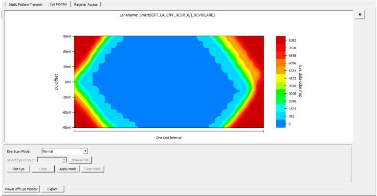

After applying the mask, the **Clear Mask** button is enabled and the Eye Mask<br /> for the Eye Plot appears.

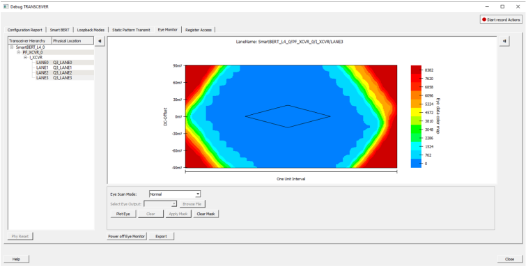

Click **Clear Mask** to clear the Eye Mask for the current Eye Plot and enable<br /> the **Apply Mask** button.

##### Design Initiated Eye Plots

After you run Eye Monitor in an embedded application such as IAR Embedded Workbench using<br /> the PolarFire Transceiver driver, you can display the associated eye plots. When the eye<br /> monitor firmware is run, the terminal log is stored in a text file located in the root<br /> folder. This file is compatible with SmartDebug to view the eye plots.

**Attention:** Do not edit the Eye Plot log in any way before you import it into SmartDebug. Otherwise, an error message appears and the log will not be imported.

To access design-initiated eye plots, perform the following steps:

1.  Select **Eye Scan Mode Design Initiated Eye Plot**. The **Browse** option becomes enabled.
2.  Select the eye plot log files from the dialog box. The **Select Eye Output** drop-down menu is enabled.
3.  In the **Select Eye Output** drop-down menu, select a plot by its tag-name. The Plot Eye option is enabled.
4.  Click **Plot Eye**. The eye diagram loads on the canvas.

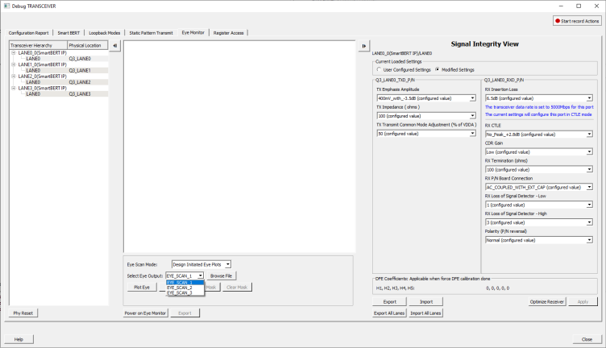

To start eye monitoring for the lane, select Eye output from the Select Eye Output drop-down, and<br /> click **Plot Eye**. The Eye diagram appears, as shown in the<br /> following figure.

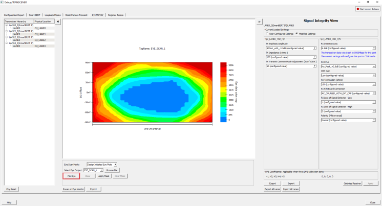

**Note:** The TagName for the selected eye output is shown in the preceding eye diagram. Ensure data transmission on Lane Rx for successful monitoring.

##### Power On/Off Eye Monitor

###### Switching Off Power to the Eye Monitor Core

To save power, switch off the power to the eye monitor core.

The default option is provided after reading the status from the device. To power off the<br /> eye monitor, click **Power Off Eye Monitor** \(the button toggles to<br /> **Power on Eye Monitor**\). Clicking the button again powers on<br /> the eye monitor.

**Attention:** Eye Plot is not affected if the eye monitor is powered off, because the debug tool internally powers on the eye monitor core and restores the state when the plot is done.

#### Register Access

The Register Access page in the Debug TRANSCEIVER window allows you to perform register<br /> read, write, export, hide, and export all register operations. The list at the top of<br /> the page allows you to show all registers or show only the registers whose read value<br /> has been changed. By default, **Show All Registers** is selected. The<br /> exported register details are saved in a `.csv` file.

The following table describes the various interface elements on the page.

<table id="TABLE_SP4_R2Z_RNB"><thead><tr><th>

Option

</th><th>

Description

</th></tr></thead><tbody><tr><td>

Register Hierarchy

</td><td>

Lists the design specific registers in a collapsible tree view<br /> format.

</td></tr><tr><td>

Register Name

</td><td>

Displays the name of the register that can be looked up in the<br /> Register Hierarchy.

</td></tr><tr><td>

Register Address

</td><td>

Displays the physical address of a register. The address is shown in<br /> hexadecimal format. The address is calculated based on the Quad, lane<br /> number, register type, and offset.

</td></tr><tr><td>

Access Type

</td><td>

Specifies the register access type. This column also indicates the<br /> field access types when a register is expanded.

</td></tr><tr><td>

Field Name

</td><td>

Displays the field name based on the register information read from<br /> the `PF_XCVR.xml` file.

</td></tr><tr><td>

Field Bits

</td><td>

Displays bit value based on the field offset and the width of the<br /> register.

</td></tr><tr><td>

Prev Read Value

</td><td>

Displays the previously read value. By default, unread is<br /> displayed.

</td></tr><tr><td>

Curr Read Value

</td><td>

Displays a register's current value.

</td></tr><tr><td>

Read Value

</td><td>

Displays the value read from the device. Click the<br /> **Read** button to retrieve the value from the<br /> device. By default, **unread** is displayed.

</td></tr><tr><td>

Write Value \(Hexadecimal\)

</td><td>

Enter a hexadecimal register value.

</td></tr><tr><td>

Import

</td><td>

Click to load the registers from a `.csv` file that is<br /> exported. This option loads the register list in the selected pane. Any<br /> registers selected earlier will be prompted to delete or cancel the load<br /> operation.

</td></tr><tr><td>

Delete All

</td><td>

Click to delete all selected registers.

</td></tr><tr><td>

Read

</td><td>

Click to retrieve the register value from the device.**Note:** The **Read** button is disabled when no register is selected in the **Register Hierarchy** tree view or when SmartDebug is running in the Demo mode.

</td></tr><tr><td>

Write

</td><td>

Click to write the user specified register value. **Note:** The **Write** button is disabled when no value is specified in the **Write Value\(Hexadecimal\)** text box of the selected register or when SmartDebug is running in the Demo mode.

</td></tr><tr><td>

Export

</td><td>

Click to save the selected register details to a<br /> `.csv` file. When clicked, the<br /> **Register Access Export Action** dialog box<br /> appears. Specify the file name and the location of the file in the<br /> dialog box.**Note:** The **Export** button is disabled when SmartDebug is running in the Demo mode.

</td></tr><tr><td>

Export All

</td><td>

Click to save all the register details to a `.csv`<br /> file. When clicked, the **Register Access Export All Action** dialog box appears. Specify the file name and the<br /> location of the file in the dialog box.The exported<br /> .csv file contains the register name,<br /> address, field name, field bits, read, and write values of<br /> registers. The first row of the file contains the header<br /> information. Register values are written from the second row<br /> onwards.

</td></tr><tr><td>

Hide register

</td><td>

Select register\(s\) and right click to view this option. The<br /> **Hide registers** context menu option helps you<br /> remove the selected register\(s\) from the **Register Access** table.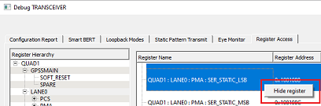

</td></tr></tbody>
</table>#### Signal Integrity

The Signal Integrity feature in SmartDebug works with Signal Integrity in the I/O Editor,<br /> allowing the import and export of `.pdc` files.

The Signal Integrity pane appears in the following SmartDebug pages:

-   [SmartBERT](GUID-AFCD4A75-089E-4BD6-AFD4-FC526F201B3D.md#)
-   [Loopback Modes](GUID-AFCD4A75-089E-4BD6-AFD4-FC526F201B3D.md#)
-   [Static Pattern Transmit](GUID-AFCD4A75-089E-4BD6-AFD4-FC526F201B3D.md#)
-   [Eye Monitor](GUID-AFCD4A75-089E-4BD6-AFD4-FC526F201B3D.md#)

When you open Debug Transceiver in SmartDebug and click the **SmartBERT**,<br /> **Loopback Modes**, **Static Pattern Transmit**, or **Eye Monitor** tab, all parameters in<br /> the **Signal Integrity** pane are shown as<br /> **Undefined**. Only the **Export All Lanes**<br /> and **Import All Lanes** buttons are enabled. See the following<br /> figure.

<br />

")

<br />

In full duplex mode, all parameters \(Tx and Rx\) are imported/exported.

The following figure shows Signal Integrity for Tx Only Mode. In this mode, only Tx parameters<br /> are imported and exported.


The following figure shows Signal Integrity for Rx Only mode. In this mode, only Rx<br /> parameters are imported and exported.


When a lane is selected in the **SmartBERT**, **Loopback Modes**, **Static Pattern Transmit**, or **Eye Monitor** pages, the corresponding Signal Integrity parameters \(configured<br /> in the I/O Editor or changed in SmartDebug\) are enabled and shown in the Signal<br /> Integrity pane.

<br />

**Attention:** If the Signal Integrity Parameters were modified in the previous debug session, the following popup message prompts users to select either modified settings or user-configured settings.

<br />


Click **Yes** to load the settings from the previous SmartDebug<br /> session or click **No** to load user-configured settings.

The selected lane instance name is displayed in the **Signal Integrity** box,<br /> and the **Export** and **Import** buttons are<br /> enabled.

You can select options for each parameter from the drop-down for that parameter. Click<br /> **Apply** to set the selected transceiver instance with the<br /> selected options.

The **Current Loaded Settings Group** box shows the currently selected<br /> settings. You can change the selection to either **User Configured Settings\*** or **Modified Settings\***, and then click<br /> **Apply** to apply the settings on the device.

-   **User Configured Settings**. Clicking this radio button loads the Signal Integrity Parameters that were selected in the Libero Design flow run and present in the bitstream.
-   **Modified Settings**. Selecting the **Modified Settings** radio box loads the Signal Integrity parameters that were modified in the previous debug sessions.

The `Polarity (P/N reversal)` parameter has been added. You can choose<br /> **Normal** or **Inverted** from the drop-down<br /> menu. This parameter is not available for MPF300T\_ES \(Rev C\) or MPF300T\_XT \(Rev E\)<br /> devices.

The `CDR Gain` parameter has been added for MPF300T, MPF100T, MPF200T, and MPF500T<br /> devices, and you can select the **High** or<br /> **Low** option from the drop-down. This parameter is supported<br /> for Export, Export All, Import, Import All, and Apply flows of Signal Integrity. This<br /> parameter is not available for MPF300T\_ES \(Rev C\) or MPF300T\_XT \(Rev E\) devices.

**Note:** The **Apply** button is enabled when you make a selection for any parameter.

If you change parameter options **Tcl** and click another lane, move to<br /> another tab, or click **Import**, **Import All**<br /> without applying the changes, the following message appears: *Some Signal Integrity options are modified. How do you wish to continue?*

Click **Apply** to apply the changes or **Discard** to<br /> discard the changes.

**Important:** If you change any register setting related to Signal Integrity, power cycle the board, or perform a user reset of the device, the XCVR lane signal integrity state may be different than what is shown in the SmartDebug **Signal Integrity** tab.

To ensure that the Signal Integrity in SmartDebug is in sync with the Signal Integrity state of<br /> the device, click **User Configured** settings from the<br /> **Current Loaded Settings Group Box** in SmartDebug, and then<br /> click **Apply**. This sets the SI in the **Signal Integrity** tab to the design constraints \(SI parameter values chosen from<br /> the I/O Editor\).

##### Export

Clicking the **Export** button exports the current selected parameter options<br /> and other physical information for the selected lane instance to an external PDC file. A<br /> pop-up box prompts you to choose the location where you want the `.pdc`<br /> file to be exported.

The exported content will be in the form of two set\_io commands, one for the TXP port and one for the RXP port of the selected lane instance.

###### Export All Lanes

Clicking the **Export All Lanes** button exports the current selected<br /> parameter options and other physical information for all lane instances in the design to<br /> an external PDC file. A pop-up box prompts you to choose the location where you want the<br /> `.pdc` file to be exported.

##### Import

Clicking the **Import** button imports Signal Integrity parameter options and<br /> other physical information for the selected lane from an external PDC file.

The Signal Integrity parameter options are applied to the device and updated in Modified Constraints.

###### Import All Lanes

Clicking the **Import All Lanes** button imports Signal Integrity parameter<br /> options and other physical information for all lanes from an external PDC file.

The Signal Integrity parameter options are applied to the device and updated in Modified Constraints.

##### Signal Integrity and Calibration Report

You can generate and extract an additional report containing Signal Integrity parameters and<br /> options, CTLE register settings, and DFE coefficients by clicking<br /> **Export** or **Export all** in SmartDebug.<br /> Click **Export** to export the report only for the selected lane.<br /> Click **Export all** to export a report for all the lanes. This<br /> report is a text file that contains the Signal Integrity parameters and options, CTLE<br /> register values \{CST1, RST1, CST2, RST2\}, and DFE coefficient values \{H1, H2, H3, H4,<br /> H5\}. The exported file has a `.txt` extension with the same name as<br /> the `.pdc` file, and is exported in the same location. DFE<br /> Coefficients are exported only for DFE configured lanes. See the following report.

```
SIGNAL INTEGRITY AND CALIBRATION REPORT
=========================================================================== PF_XCVR_3/LANE0
Signal Integrity: 
TX_EMPHASIS_AMPLITUDE=400mV_with_-3.5dB 
TX_IMPEDANCE=150 TX_TRANSMIT_COMMON_MODE_ADJUSTMENT=50
TX_POLARITY=Normal 
TXPLL_BANDWIDTH=LOW 
RX_INSERTION_LOSS=6.5dB 
RX_CTLE=3GHz_+5.5dB_2.1dB 
RX_TERMINATION=100
RX_PN_BOARD_CONNECTION=AC_COUPLED_WITH_EXT_CAP 
RX_LOSS_OF_SIGNAL_DETECTOR_LOW=PCIE 
RX_LOSS_OF_SIGNAL_DETECTOR_HIGH=PCIE
RX_POLARITY=Normal
- 
CTLE Coefficients:
CST1, RST1, CST2, RST2 = 3, 3, 1, 2
- 
DFE Coefficients:
H1, H2, H3, H4, H5 = 0, -1, 2, 6, 3
===================================================================================
PF_XCVR_3/LANE0
Signal Integrity: 
TX_EMPHASIS_AMPLITUDE=400mV_with_-3.5dB 
TX_IMPEDANCE=100 
TX_TRANSMIT_COMMON_MODE_ADJUSTMENT=80
TX_POLARITY=Normal 
TXPLL_BANDWIDTH=LOW 
RX_INSERTION_LOSS=17.0dB 
RX_CTLE=3GHz_+5.5dB_2.1dB 
RX_TERMINATION=100
RX_PN_BOARD_CONNECTION=AC_COUPLED_WITH_EXT_CAP 
RX_LOSS_OF_SIGNAL_DETECTOR_LOW=PCIE 
RX_LOSS_OF_SIGNAL_DETECTOR_HIGH=PCIE
RX_POLARITY=Normal
- 
CTLE Coefficients:
CST1, RST1, CST2, RST2 = 3, 1, 2, 2
- 
DFE Coefficients:
H1, H2, H3, H4, H5 = Not applicable for CDR configured lane
```

##### Signal Integrity Parameters in Half Duplex Modes

###### Tx Only XCVR Mode

-   The Signal Integrity view shows only Tx parameters.
-   Lane information is also shown in the Signal Integrity view.
-   Optimize Receiver is disabled.
-   The Export option exports only Tx parameters.
-   The Import option imports only Tx parameters. If Rx parameters are present, the tool errors out.

###### Rx Only XCVR Mode

-   The Signal Integrity view shows only Rx parameters.
-   Lane information is also shown in the Signal Integrity view as a header.
-   Optimize Receiver is enabled.
-   The Export option exports only Rx parameters.
-   The Import option imports only Rx parameters. If Tx parameters are present, the tool errors out.

###### Independent TxRx XCVR Mode

This mode is displayed as full duplex mode \(no changes\).

##### Optimize Receiver

**Note:** This feature is available for MPF300T, MPF100T, MPF200T, and MPF500T devices.

The Optimize Receiver function allows you to optimize the DFE coefficients and/or CTLE<br /> settings for the selected lanes, depending on receiver mode. For CDR mode receivers,<br /> CTLE settings and/or DFE coefficients can be optimized. For DFE mode receivers, CTLE<br /> settings and DFE coefficients can be optimized.

For DFE coefficients, the optimize function runs through an algorithm for each lane and<br /> sets the best available coefficients for each selected lane for the current temperature,<br /> voltage, and data pattern conditions. After the optimization is complete, the<br /> transceiver lanes are set to these coefficients for the user to continue debugging.

For information about how to use the optimized coefficients without SmartDebug, see the<br /> [PolarFire Family Transceiver User Guide](https://ww1.microchip.com/downloads/aemDocuments/documents/FPGA/ProductDocuments/UserGuides/PolarFire_FPGA_and_PolarFire_SoC_FPGA_Transceiver_User_Guide_VB.pdf)


Click **Optimize Receiver** to open the Optimize Receiver dialog box.<br /> Full duplex, Rx Only, and Independent TxRx are shown \(Tx Only lanes are not shown\).


Select the lanes on which to run Optimize Receiver and click **Optimize Receiver on Selected Lanes**. You can select any combination of lanes including<br /> those configured in CDR or DFE. The hardware performs Full calibration for DFE mode<br /> receivers and may perform CTLE calibration only or CTLE and DFE calibration on CDR mode<br /> receivers.

##### Display DFE Coefficient Values

The DFE coefficients H1, H2, H3, H4, and H5 are displayed as non-editable in the<br /> **Signal Integrity** pane for any lane configured in the DFE or<br /> CDR mode. See the following figure.


-   DFE coefficients are shown for CDR mode receivers if force DFE calibration is selected. This can be done from the check box provided inside the Optimize Receiver dialog box \(shown in section [Optimize Receiver](GUID-AFCD4A75-089E-4BD6-AFD4-FC526F201B3D.md#)\).
-   The DFE coefficients are read from the register fields as follows:

    ```
    H1 = H1_MON
    H2 = H2_MON 
    H3 = H3_MON 
    H4 = H4_MON 
    H5 = H5_MON
    ```

-   DFE coefficients are read back from the device in the following scenarios:
    -   When the lane is selected in the SmartBert, Loopback Modes, Static Pattern Transmit, and Eye Monitor pages.
    -   When a test is started/stopped on selected lane in the SmartBert page.
    -   When a test is started/stopped on selected lane in the Static Pattern Transmit page.
    -   When Optimize Receiver is executed on the selected lane.

##### Exporting DFE Coefficients

Optimized DFE coefficient values are saved in a `*.txt` file when you click<br /> **Export**. The text file is saved in the same location where the<br /> physical design constraint \(`*.pdc`\) file is saved when the<br /> **Export** or **Export All** operation is<br /> performed.

During the export process, a Physical Design Constraints \(`*.pdc`\) file is<br /> generated, which includes the `set_io` command along with the DFE Coefficient<br /> parameters such as `RX_DFE_COEFFICIENT_H1`.

**Important:** Coefficients in the Physical Design Constraints file are initialized to their default settings. To update these values, move the optimized DFE coefficient values from the Signal Integrity and Calibration report \(contained in the `*.txt` file\) to the `*.pdc` file, ensuring they are arranged in the correct sequence, from H1 to H5.

#### PCIe Debug

The Pcie LTSSM State page is available in Debug TRANSCEIVER when PCIe has been instantiated in a design.

The Pcie LTSSM State page shows the PCIe Design Hierarchy. It contains the tree hierarchy of the PCIe instance in the design, as shown in the following figure. The physical location of the PCIe instance is shown beside the PCIe instance in second column.

**Attention:** All parameters shown on the Pcie LTSSM State page are read-only and cannot be changed.


##### Lane Status and Lane Link Error Status

When a PCIe instance is selected \(without selecting any other hierarchy level above\), the Lane status, SEC Error status, and DED Error status is shown to the right of the PCIe Hierarchy. The logical names of the lanes are also shown. See the following figure.


##### LTSSM State Machine

The Pcie LTSSM State page shows the LTSSM state machine to the right of PCIe Design Hierarchy and under the lane status, as shown in the following figure.


When you click a PCIe instance in the PCIe Hierarchy, the active LTSSM state is retrieved from register LTSSM\_STATE:PL\_LTSSM\_OUT, the active state is highlighted in the state machine, and the substate information is shown. The LTSSM state output is also logged in the SmartDebug log window. See the following figure.


##### Config Space Parameter Information

When you click on a PCIe instance in the PCIe Hierarchy, the config space parameter data is retrieved from the device and displayed to the right of the LTSSM state machine, as shown in the following example figure. When no PCIe instance is selected, or any level of hierarchy instance except for the PCIe instance is selected, the parameter values are displayed as “NA”. If there is an error retrieving parameter data, the value displayed is “Error” in the GUI.


The list of config parameters and values is also logged in the SmartDebug log window, as shown in the following figure.


Click the **Refresh** button to update all PCIe data displayed in the GUI.

The following table describes the config space parameters.

<table id="GUID-8C1AAEA5-5416-4B29-AB5D-2B6630DB4049"><thead><tr><th colspan="2">

PCIe Config Space Parameters

</th><th>

Description

</th></tr></thead><tbody><tr><td rowspan="3">

1

</td><td>

BAR0

</td><td>

—

</td></tr><tr><td>

Assignment Address Offset

</td><td>

Defines the starting address of the address translation space.

</td></tr><tr><td>

Assignment Offset Size

</td><td>

Defines the address translation space size.

</td></tr><tr><td rowspan="3">

2

</td><td>

BAR1

</td><td>

—

</td></tr><tr><td>

Assignment Address Offset

</td><td>

Defines the starting address of the address translation space.

</td></tr><tr><td>

Assignment Offset Size

</td><td>

Defines the address translation space size.

</td></tr><tr><td rowspan="3">

3

</td><td>

BAR2

</td><td>

—

</td></tr><tr><td>

Assignment Address Offset

</td><td>

Defines the starting address of the address translation space.

</td></tr><tr><td>

Assignment Offset Size

</td><td>

Defines the address translation space size.

</td></tr><tr><td rowspan="3">

4

</td><td>

BAR3

</td><td>

—

</td></tr><tr><td>

Assignment Address Offset

</td><td>

Defines the starting address of the address translation space.

</td></tr><tr><td>

Assignment Offset Size

</td><td>

Defines the address translation space size.

</td></tr><tr><td rowspan="3">

5

</td><td>

BAR4

</td><td>

—

</td></tr><tr><td>

Assignment Address Offset

</td><td>

Defines the starting address of the address translation space.

</td></tr><tr><td>

Assignment Offset Size

</td><td>

Defines the address translation space size.

</td></tr><tr><td rowspan="3">

6

</td><td>

BAR5

</td><td>

—

</td></tr><tr><td>

Assignment Address Offset

</td><td>

Defines the starting address of the address translation space.

</td></tr><tr><td>

Assignment Offset Size

</td><td>

Defines the address translation space size.

</td></tr><tr><td>

7

</td><td>

Device/Port Type

</td><td>

PCIe Port Type

</td></tr><tr><td>

8

</td><td>

Negotiated Max PayLoad

</td><td>

Negotiated maximum Payload of the PCIe link

</td></tr><tr><td>

9

</td><td>

Max Read Request Size

</td><td>

Negotiated maximum read request size of the PCIe link

</td></tr><tr><td>

10

</td><td>

Negotiated Link Speed

</td><td>

Negotiated link speed of the PCIe link. Supported values are:-   2.5 Gbps
-   5.0 Gbps
-   8.0 Gbps

</td></tr><tr><td>

11

</td><td>

Negotiated Link Width

</td><td>

Negotiated link width of the PCIe link. Supported values are:-   x1
-   x2
-   x4
-   x8
-   x16

</td></tr><tr><td>

12

</td><td>

MSI Interrupt Count

</td><td>

Number of Message Signaled Interrupts \(MSI\) messages. This parameter is not applicable for Rootport.Range: 1–128

</td></tr></tbody>
</table>#### Record Actions

This option is used to record the register sequence of XCVR operations into a file. The<br /> **Start record Actions** option is shown at the top-right corner<br /> as an option to click to start recording.


This option is hidden in Demo Mode. When you click **Start record Actions**, recording starts and the option changes to **Stop recording…**.

When you click **Stop recording…** to stop the recording, a window<br /> prompts you to save the output a text \(`.txt`\) file. After saving the<br /> file, the Debug TRANSCEIVER window reverts to default state.


##### Recorded Content

The saved file is in plain text<br /> \(`.txt`\) format.

The first five lines contain the header. The header says that the following sequence is a read-modify-write operation. It also has the date and time of recording.

The operation sequence always starts with the name of the operation followed by the Quad and lane information if applicable.

The following snippet is an example demo file which records PRBS start sequence. Interpreting the text is as follows:

###### Example 1

1.  Start PRBS test on LANE2 QUAD0 using PRBS7 means:
    1.  The lane selected on the **SmartBERT** tab is Q0\_ANE0 and the pattern selected is XCVR PMA PRBS7.
    2.  The first set of lines has the following four subheadings:

        **Register Name**:<br /> Register name that can be looked up in the register map.

        **Address**: The physical address of this<br /> register is 7 hexadecimal digits. It is calculated based on the<br /> Quad, lane number, register type, and offset.

        **Write Mask**: Write mask is an 8 hexadecimal-digit number<br /> that indicates the mask value to be applied on the register read<br /> value.

        **Write Value**: The write value is 8<br /> hexadecimal digits number to be written after the mask is<br /> applied.

        If the<br /> value is 0, the operation is basically read the register value and<br /> apply the mask on it and write in the register.

    3.  End of start PRBS test sequence denotes that the sequence for that lane is completed and the next sequence is initiated.


The following are XCVR operations for which Record Actions is supported:

-   SmartBERT tests
-   Loopback tests
-   Static Pattern tests
-   Power ON/OFF Eye Monitor
-   Signal Integrity
-   Transceiver PHY Reset
-   Poll PCIe LTSSM State
-   Read PCIe configuration space

The following are XCVR operations for which Record Actions is not supported:

-   Eye Monitor
-   Optimize Receiver
-   PRBS tests from SmartBERT IP

###### Example 2

LTSSM state on PCIe lane

Register Name and Address will be<br /> common to all the register sequence.

**Read Mask:**This<br /> means the sequence is only a read register operation. The mask value is the mask to<br /> extract the required field value. Here, the mask value is 0x1F, which means reg\[4:0\]<br /> is the value to be read, hence the mask value.

**LTSSM STATE:**This is the result that is obtained after the<br /> mask is applied to the read value.

<br />


<br />

### MSS Register Access \(PolarFire SoC\)

For PolarFire SoC devices, SmartDebug provides the **MSS Register Access** option to read and write to the device and export register read<br /> details to a `.csv` file. Click **MSS Register Access** on the main SmartDebug window to access this feature.

**Note:** The **MSS Register Access** button is visible and available for use only if the MSS component is configured and used in the Libero design.

The **MSS Register Access** window comprises the **Register Selection** and **Register Operations** panes.

**Note:** Memory Protection Unit \(MPU\) in MSS component must be enabled or configured before accessing the MSS registers.


**Note:** Selected registers are retained even if you close and re-open the SmartDebug project in the standalone SmartDebug tool.

The following table describes the various options available on the **MSS Register Access** window.

<table id="TABLE_E2C_HJW_54B"><thead><tr><th>

Option

</th><th>

Description

</th></tr></thead><tbody><tr><td>

**Register Selection**

</td><td>

Lists all the instances of the MSS block as described in the MSS<br /> register map.Peripherals are shown based on the configuration from the MSS component. Apart from peripherals,<br /> the following six instances of registers are always shown in the<br /> pane as they are the configuration registers and are always<br /> accessible. -   AXISW
-   MPUCFG
-   ENVMCFG
-   IOSCBCFG
-   PFSOC\_MSS\_TOP\_SCB\_REGS
-   PFSOC\_MSS\_TOP\_SYSREG

</td></tr><tr><td>

**Register Filter**

</td><td>

Allows you to search for instances/register by their names. Supports wildcard \(\*\) searches.-   The search is real time.
-   Enter an asterisk \( \* \) to display all registers having instance names expanded.
-   Names entered without asterisk look for exact match.

</td></tr><tr><td>

**Register Hierarchy**

</td><td>

Displays Instance name and Register name in a two-level<br /> hierarchy-level format.-   You can select multiple names.
-   Right click and select 'Add' to add the registers to the operation pane.
-   Drag and drop the register names to the Register Operation pane.

</td></tr><tr><td>

**Export All**

</td><td>

Exports information of all registers that are displayed in the<br /> selection pane to the specified.csv file.<br /> -   The exported `.csv` file contains six sections:
    -   Register Name
    -   Register Address \(hexadecimal number\)
    -   Register Field Name
    -   Register Field Range
    -   Register Field Value \(hexadecimal number\)
    -   Register Value \(hexadecimal number\)
    -   Comments \(message to show if read register was successful or not\)

</td></tr><tr><td>

**Register Operations**

</td><td>

Lists the registers selected for access operations such as read,<br /> write, and export.**Note:** Selected registers are retained even if you close and re-open the SmartDebug project in the standalone SmartDebug tool.

-   The **Register Operations** pane has six columns - Name, address, access type, field bits, read value, and write value.
-   The register has a sub-tree where all the register fields are listed.
-   Select **Hide Register** from the context menu to remove the selected register.

**Note:** You cannot remove a field inside the register.

-   Write value column is populated with `0x` to indicate that it supports hexadecimal values.
    -   Click a specific register row under the write column to edit the value.
    -   The text entered is validated based on the range \(field bits\) of a field or a register.

**Note:** Non-hexadecimal character will not be inserted.


</td></tr><tr><td>

**Import**

</td><td>

Click to load the registers from a `.csv` file that is<br /> exported. This option loads the register list in the selected pane. Any<br /> registers selected earlier will be prompted to delete or cancel the load<br /> operation..

</td></tr><tr><td>

**Delete All**

</td><td>

Click to delete all selected registers.

</td></tr><tr><td>

**Read**

</td><td>

Read all selected registers by their register names and display the<br /> values in the hexadecimal format.

</td></tr><tr><td>

**Write**

</td><td>

Each cell in the table of selected registers can be accessed<br /> individually to write the values in hexadecimal format.-   If there is a conflict in the values where full register write values and also field values of the same register, then a full register write is executed and field write is ignored.
-   Write to specific registers such as MPUCFG:PMPCFG\_SCB\_\* will result in undesired SmartDebug tool behavior because these registers are responsible for configuring MPU block in MSS.
-   You cannot edit the write field if the register has read-only access type.
-   Write onto a field is a read-modify-write operation.

</td></tr><tr><td>

**Export**

</td><td>

Reads the values of selected registers and saves them in the<br /> specified .csv file. The exported<br /> .csv file contains six sections Register<br /> NameRegister<br /> Address \( hexadecimal number \)Register<br /> Field NameRegister<br /> Field RangeRegister<br /> Field Value \( hexadecimal number \) Register<br /> Value \( hexadecimal number \)

</td></tr></tbody>
</table>### Debug IOD

SmartDebug provides the IOD Tap Delays feature for designs where the<br /> `PF_IOD_GENERIC_RX` IP instance is configured as Dynamic or<br /> Fractional Dynamic mode in the design. Click the **Debug IOD** button<br /> on the main SmartDebug window to access this feature.

**Note:** The **Debug IOD** button is not available for designs where the IP in the modes mentioned is not used. The feature is supported by designs for PolarFire and PolarFire SoC family devices.

The **IOD Tap Delays** window lists the<br /> `PF_IOD_GENERIC_RX` IP instances available in the design in the<br /> **Choose IOD** drop-down list. Select an IOD instance and click<br /> the **Get Training Data** button to view the Bit Align IP instances<br /> and corresponding Delay Tap values.


The following figure shows a design example with two instances of<br /> `CORERXIODBITALIGN` IP and the tap delay values read from those<br /> instances.

**Important:** `CORERXIODBITALIGN IP` must have the output debug pins either connected or promoted to the top for SmartDebug to detect and identify the debug signals.


The following figure shows the SmartDebug **Log** window when the<br /> training is successful.


The following figure shows the **IOD Tap Delays** window when the<br /> training fails.


The following figure shows the SmartDebug **Log** window when the<br /> training fails.


### Debug UPROM

You can debug clients configured in a design and debug µPROM memory address information<br /> with the Debug UPROM feature.

In the main SmartDebug window, click **Debug UPROM**.

If a µPROM memory block is used in the Libero design, the **UPROM Debug** window appears.


#### User Design View

The **User Design View** tab in the µPROM Debug window lists all clients<br /> configured in the design. Selecting a client in the list enables the **Read from Device** button.

Click the **Read from Device** button to display a table showing the data in<br /> the location at the selected client address. See the following figure.


The Client address is associated with *Start Address*and *Number of 9-bit words*. Therefore, the table will contain as many locations as the number of 9-bit words.

In the preceding example, *Number of 9-bit words*is 52224, so 52224 words will be shown in<br /> the table. Column headers are numbered 0 to F in hexadecimal format, representing 16<br /> words in a row.

Row addresses begin with a word address associated with *Start Address*. For example, if the<br /> *Start Address*is 0x15 \(hex\), the starting row has an address of 0x0010.


Hover your cursor over a cell to see the cell’s address and value, as shown in the following<br /> figure.


#### Direct Address View

The **Direct Address View** tab in the µPROM Debug window provides<br /> access to µPROM memory. You can read a part of a client or more than one client by<br /> specifying the *Start Address*and *Number of 9-bit words*.

**Start Address**: Hexadecimal value \(0 -9, A-F, upper/lower case\)

Values are validated and errors are indicated by a red "**STOP**"<br /> icon. The error message displays when you hover your cursor over the icon.

**Number of 9-bit words**: Positive integer value

Values are validated and errors are indicated by a red "**STOP**". The<br /> error message displays when you hover your cursor over the icon.

**Read from Device**: Disabled until valid values are entered in the<br /> fields.

Invalid or blank values are indicated by a red "**STOP**". The error<br /> message displays when you hover your cursor over the icon.

**Note:** If the word falls within the 16 words that are placed in a row, the start location and the end location are highlighted in the row to show the starting point of the data. All preceding locations show ‘NR’ \(Not Read\). See the following figure.


**Note:** Observe the following:

-   When one field is entered, both fields are validated and the **Read from Device** button is enabled.
-   If fields change after enabling **Read from Device**, values are validated again and Read from Device may be disabled if invalid values are entered.
-   If the **µPROM Debug** window is closed and reopened, the session is retained. The µPROM Debug session is lost only if the main **SmartDebug** window is closed.

#### Demo Mode

Debug µPROM is supported in Demo Mode. The User Design View and Direct Address View are supported, and data from device initialization and configurators is shown.

### Debug Fabric DDR IO Margin

To access the Debug Fabric DDR IO margin feature in<br /> SmartDebug, click **Debug Fabric DDR Memory…** in the main SmartDebug window.<br /> This option is available only for DDR3/DDR4/LPDDR3 memory<br /> configurations on PolarFire and PolarFire SoC devices. This<br /> option is not visible when DDR memory is not used in the<br /> design.

FPGA memory controller sub-systems train the DDR interface channel for optimal signal integrity<br /> in both the time and voltage domains. The memory controller goes<br /> through various training phases to adjust and compensate for<br /> unbalanced loading. You must be familiar with the start-up and<br /> training phases used with external memory interfaces. The Fabric<br /> DDR IO Margin feature assists users to analyze and understand<br /> the interface results of the training algorithms. For more<br /> information on the memory controller training and optimization,<br /> see the *[PolarFire® FPGA and PolarFire® SoC Memory Controller User Guide](https://ww1.microchip.com/downloads/aemDocuments/documents/FPGA/ProductDocuments/UserGuides/PolarFire_FPGA_PolarFire_SoC_FPGA_Memory_Controller_User_Guide_VB.pdf)*.


When you click **Debug Fabric DDR Memory…** in the main SmartDebug window,<br /> the following **Fabric DDR IO Margin** dialog box opens, as shown in the<br /> following figure.


Initially, all options in the **Fabric DDR IO Margin** dialog box are<br /> disabled. To view the training data for specific DDR instances, select the desired instance<br /> and click the **Get Training Data** button. Clicking this button runs a<br /> script that fetches the training data, which takes approximately two minutes. During this<br /> time, the **Fabric DDR IO Margin** dialog box displays information based on<br /> the selected DDR instance, as shown in the following figures. **First stage**, **Overall Training Status** is marked as<br /> **Passed** if all subsequent stages are completed successfully. If any<br /> stage fails, the status is marked as **Failed**.


SmartDebug informs users about errors generated while getting training data, as shown in the<br /> following figures and tables. Additional error information can be displayed as tooltips by<br /> hovering over the elements in the **FPGA INITIALIZATION**, **DDR PHY CLOCK TRAINING**, **DDR PHY I/O TRAINING**, and<br /> **OTHERS** categories. The following table outlines the stages, reasons<br /> for failure, and suggested actions to address and eliminate these failures.

<br />

<table id="TABLE_BNR_Q3C_1FC"><thead><tr><th>

Stages

</th><th>

Reason\(s\) for Failure

</th><th>

Suggested Actions to Remove Failure

</th></tr></thead><tbody><tr><td rowspan="2">

FPGA Initialization

</td><td>

Memory controller is held in reset.

</td><td>

Make sure the controller is not held in<br /> reset, check SYS\_RESET\_N.

</td></tr><tr><td>

PLL\_REF\_CLK is undriven.

</td><td>

Make sure the controller input clock,<br /> PLL\_REF\_CLK, is toggling.

</td></tr><tr><td>

HS\_IO\_CLK-to-SYS\_CLK Training

</td><td>

PLL\_REF\_CLK is undriven.

</td><td>

<br /> -   Make sure the controller input clock, PLL\_REF\_CLK, is toggling.
-   Check PLL\_LOCK and SYS\_CLK for valid signals.

<br />

</td></tr><tr><td>

CK-to-CA Training

</td><td>

<br /> -   Signal-integrity issues occur on CA/CK due to mismatched drive and termination settings.
-   CK/CA default offset is not optimal for the system.

<br />

</td><td>

<br /> Memory chip - mode registers. Configure<br /> the output drive strength and/or the ODT values<br /> using the Memory<br /> Initialization tab in the DDRx<br /> configurator.<br /> FPGA - IO attribute editor. Configure<br /> the output drive strength and/or the ODT values<br /> using the IO attribute editor.<br />

</td></tr><tr><td>

Write Leveling

</td><td>

Signal-integrity issues occur on<br /> DQ/DQS.

</td><td>

<br /> Memory chip - mode registers. Configure<br /> the output drive strength and/or the ODT values<br /> using the Memory<br /> Initialization tab in the DDRx<br /> configurator.<br /> FPGA - IO attribute editor. Configure<br /> the output drive strength and/or the ODT values<br /> using the IO attribute editor.<br />

</td></tr><tr><td>

Read DQ/DQS Optimization

</td><td>

Signal-integrity issues occur on<br /> DQ/DQS.

</td><td>

<br /> Memory chip - mode registers. Configure<br /> the output drive strength and/or the ODT values<br /> using the Memory<br /> Initialization tab in the DDRx<br /> configurator.<br /> FPGA - IO attribute editor. Configure<br /> the output drive strength and/or the ODT values<br /> using the IO attribute editor.<br />

</td></tr><tr><td>

Write Calibration

</td><td>

Signal-integrity issues occur on<br /> DQ/DQS.

</td><td>

<br /> Memory chip - mode registers. Configure<br /> the output drive strength and/or the ODT values<br /> using the Memory<br /> Initialization tab in the DDRx<br /> configurator.<br /> FPGA - IO attribute editor. Configure<br /> the output drive strength and/or the ODT values<br /> using the IO attribute editor.<br />

</td></tr><tr><td>

Training Iterator

</td><td>

Training was not successful after 10<br /> attempts.

</td><td>

<br /> See the above actions for specific failure<br /> reasons.<br />

</td></tr></tbody>
</table><br />

<br />


<br />


<br />

<br />


<br />


<br />


### Debug MSS DDR IO Margin

The MSS DDR-PHY is an integral part of PolarFire SOC memory subsystem that runs the<br /> initialization and training sequence. The training steps include:

-   Clock alignment
-   Command/Address training
-   Memory initialization
-   Write leveling
-   Read gate leveling
-   DQ/DQS optimization
-   Write calibration

SmartDebug shows the training sequence results and supplies a probable reason for<br /> failure and action required to ensure that the training passes.

To access the Debug MSS DDR IO Margin feature in SmartDebug, click **Debug MSS DDR Memory...** in the main SmartDebug window. This option is not shown when MSS DDR<br /> memory is not used in the design.

<br />


<br />

This opens the **Debug MSS DDR IO Margin** dialog box shown in the<br /> following figure.

<br />


<br />

Initially, all options in the **Debug MSS DDR IO Margin** dialog box are<br /> disabled. To access the training data, click the **Get Training Data**<br /> button. Clicking this button prompts SmartDebug to read the device registers and retrieve the<br /> training data. During this time, the **MSS DDR IO Margin** dialog box shows<br /> information similar to that shown in the following figures. First stage, **Overall Training Status** is marked as **Passed** if all subsequent<br /> stages are completed successfully. If any stage fails, the status is marked as<br /> **Failed**.

<br />


<br />


<br />


<br />


<br />


<br />


<br />

SmartDebug informs you about errors generated while getting training data, as shown in the<br /> following figures. Additional error details can be viewed as tooltips by hovering over the<br /> cross icons and in the **Group Box** at the bottom of the page. These<br /> details include potential reasons for the failure and suggested Actions in **FPGA INITIALIZATION**, **PHY I/O TRAINING**, and<br /> **OTHERS** categories, as shown in the following example.


### Debug eNVM \(PolarFire SoC\)

Debug eNVM is applicable for PolarFire SoC devices only. ENVM memory is present in the<br /> MSS core. This memory can be used to store user or application data of an SoC design.<br /> The total space that ENVM memory can hold is 128 Kbytes. ENVM is divided into four<br /> sectors - Sector 0, 1, 2, and 3. Libero tool can be used to configure the memory and<br /> place the data from a file or override the locations.

The configurator for ENVM memory has divided the memory into pages. A total of 512 pages<br /> each comprising 256 bytes of data. Multiple clients can be configured, and each client<br /> can hold data in multiple pages.

**Important:** The contents of eNVM cannot be debugged in boot mode 0. Therefore, before using SmartDebug, Debug eNVM requires a device to be in an active boot mode \(that is, a boot mode other than 0\) and have a valid embedded software application running that enables the MPU.

|Size| |Offset|Description|MSS Address|
|----|---|------|-----------|-----------|
|128 Kbytes|8K|0x00000000|Sector 2|0x20220000|
|56K|0x00002000|Sector 0|0x20222000|
|56K|0x00010000|Sector 1|0x20230000|
|8K|0x0001E000|Sector 3|0x2023E000|

There are two views present in the ENVM Debug window - [Client View](GUID-AFCD4A75-089E-4BD6-AFD4-FC526F201B3D.md#) and [Page View](GUID-AFCD4A75-089E-4BD6-AFD4-FC526F201B3D.md#).

#### Client View

SmartDebug shows clients configured through the Configure Design Initialization Data and Memories<br /> tool in the Design Flow. Client view allows the user to select a client and read the<br /> data present from the device. The **ENVM Debug** window shows the<br /> client name, client start page number, client end page number, number of bytes used and<br /> whether the client is used as a ROM \(see the following figure\).

<br />


<br />

A single client can be selected at a time to view the content. Once a client is selected, the<br /> **Read from Device** button is enabled.

<br />


<br />

Click the **Read from Device** button to see the content displayed as a matrix<br /> of cells. The headers are added to show the MSS address offsets to each of the locations<br /> as well as on the row headers. Click the **Export** button to export<br /> the eNVM data to a text file.

<br />


<br />

#### Page View

Page view can be seen when the **Page View** tab is selected in the<br /> **ENVM Debug** Window.

Start page and end page number options can be edited to input valid page numbers. Start page can be between 0 to 511. End Page can be between start page and 511.

Error messages will be displayed if incorrect entries are entered. **Read from Device** button will be enabled only after entering valid entries.

Click the **Read from Device** button to see the page content.

<br />


<br />

### Measuring Die Temperature and Voltages

SmartDebug provides a TVS Sensor Monitor feature that measures the die temperature and<br /> voltages on a hardware device.

To use this feature:

1.  In the Smart Debug main window, click **TVS Monitor**. The TVS Monitor dialog box appears.

    **Note:** The **TVS Monitor** button appears in the window only if the TVS IP core is used in the Libero design.

    

2.  To save the monitoring information in a `.csv`-formatted file, check **Log**, and then use the **Log File** field and **Browse** button to select a location for the file.
3.  By default, TVS Sensor Monitor reads channel values at 1-second intervals. To use a different time interval, change the **Interval** value. Valid ranges are 1 to 60 seconds.
4.  Click **Start Monitoring**. TVS Sensor Monitor uses a 4-channel ADC to read all four channel values at the specified time interval and displays the information in a table and graphs \(see the example and descriptions below\).
5.  To stop monitoring, click the **Stop Monitoring** button.

The following figure shows an example of the table and graphs that TVS Sensor Monitor<br /> uses to display the channel and die information being read.


The table in the TVS Monitor dialog box shows the following information.

|Row|Description|
|---|-----------|
|0|VDD \(V\)|
|1|VDD18 \(V\)|
|2|VDD25 \(V\)|
|3|Die temperature shown in Celsius|

The graphs in the TVS Monitor dialog box show the actual values from column 1 in<br /> the table above the graphs. The plotted values are rotational. Initially, 60 period<br /> values are plotted for each channel. After 60 points are shown on each channel, older<br /> values are replaced by new values.

|Column|Description|
|------|-----------|
|Upper Measurement|Channel maximum value read from the device.|
|Lower Measurement|Channel minimum value read from the device.|
|Voltage graph|Actual values of channels 0, 1, and 2.|
|Temperature graph|Die temperature.|

If you output the information to a log file, the data appears in the following<br /> format:

``` {#CODEBLOCK_I2T_MWP_1VB}
TimeStamp, VDD (V), VDD18 (V), VDD25 (V), Die Temperature (Deg C)
20:58:24, 1.04488, 1.80988, 2.49988, 35.7875
20:58:25, 1.04887, 1.80587, 2.49988, 35.7875
20:58:26, 1.04488, 1.80988, 2.50388, 35.7875

```

**Note:** You can read TVS values using the TCL command [tvs\_monitor](GUID-100B5CCD-A3B5-49A1-9B74-4293990ABCA2.md). If you run TVS Monitor from the user interface, however, it does not record the TCL command. As a result, using the **Export Script File** option in the **Project** menu does not export this command to a script file.

## SmartFusion 2, IGLOO 2, and RTG4 Debug Elements

The following sections describe the debug elements for SmartFusion 2, IGLOO 2, and RTG4.

### Debug SerDes

You can examine and debug the SerDes blocks in your design in the Debug SerDes dialog box \(shown in the following figure\).

To Debug SerDes, expand **SmartDebug**in the Design Flow window and double click **Debug SerDes**.

**SerDes Block** identifies which SerDes block you are configuring. Use the drop-down menu to select from the list of SerDes blocks in your design.

#### Debug SerDes - Configuration

##### Configuration Report

The Configuration Report output depends on the options you select in your PRBS Test and Loopback Tests. The default report lists the following for each lane in your SerDes block.

|Report Element|Description|
|--------------|-----------|
|Lane mode|Programmed mode on a SerDes lane as defined by the SerDes system register.|
|PMA Ready|Shows whether PMA completed its internal calibration sequence for the specific lane and<br /> whether the PMA is operational. For details, see the [UG0447: SmartFusion2 and IGLOO2 FPGA High-Speed Serial Interfaces User Guide](https://ww1.microchip.com/downloads/aemDocuments/documents/FPGA/ProductDocuments/UserGuides/Microchip_SmartFusion2_IGLOO2_High_Speed_Serial_Interfaces_User_Guide_UG0447_V10.pdf).|
|TxPll status|Loss-of-lock status for the TXPLL is asserted and remains asserted until the PLL reacquires lock.|
|RxPLL status|Shows whether the CDR PLL frequency is not grossly out of range of with incoming data stream.|
|Refresh Report|Click to update the contents of your SerDes Configuration Report. Changes to the specified SerDes register programming can be read back to the report.|

##### SerDes Register Read or Write

You can provide a script to read/write commands to access the SerDes control/status register map. Enter the script file path in the **Script** text box or click the **Browse** button to navigate to your script file. Click **Execute**to run the script.

**Attention:** SmartDebug TCL scripts that write to the<br /> `UPDATE_SETTINGS` register may not work in a few scenarios, if<br /> default values on some of the registers are changed by the user while configuring the<br /> SerDes using the configuration GUI. This is applicable to RTG4, SmartFusion 2, and IGLOO<br /> 2, when configuring SerDes in XAUI, EPCS, or PCIe mode.

**Background:** When the user configures a `SERDES_with_initialization`<br /> block in the Libero GUI, the user has the option to adjust register values such as<br /> `RE_AMP_RATIO`, `RE_CUT_RATIO`,<br /> `TX_AMP_RATIO`, `TX_PST_RATIO`, and<br /> `TX_PRE_RATIO` to non-default values. When configuration is done,<br /> Libero generates an HDL file that implements the<br /> `SERDES_with_initialization` module. This module contains SerDes IP,<br /> CoreABC, and CoreAPB3 \(a bridge connection between CoreABC and SerDes IP\). CoreABC is a<br /> programmable state machine/microcontroller that initializes the SerDes IP to function<br /> according to what the user selects in the SerDes configuration GUI. This initialization<br /> runs at power-up or at system reset. The user’s configuration is contained in a set of<br /> simple programming instructions inside CoreABC.

**The Issue:**If a user configures a `SERDES_with_initialization`<br /> block in the Libero GUI and changes default values on some of the registers, the CoreABC<br /> programming instructions will contain writes to the `SERDES UPDATE_SETTINGS` register. If the user subsequently uses SmartDebug Tcl<br /> scripts to modify SerDes registers \(for example, to tune SerDes lane performance\), the<br /> user might find that his Tcl script does not update the SerDes registers when the<br /> `UPDATE_SETTINGS` register is written.

**Recommendation:** When the user configures the<br /> `SERDES_with_initialization` block, do not alter the default register<br /> settings for registers such as `RE_AMP_RATIO`,<br /> `RE_CUT_RATIO`, `TX_AMP_RATIO`,<br /> `TX_PST_RATIO`, `TX_PRE_RATIO`, and so on. Leaving<br /> register values as default will prevent any issue during SmartDebug TCL script SerDes<br /> register access.

**Workaround:**If the user needs to configure a<br /> `SERDES_with_initialization` block with non-default register values<br /> and will subsequently use SmartDebug Tcl scripts to adjust SerDes register values, the<br /> user will also have to add the SmartDebug command `serdes_lane_reset` to<br /> his Tcl script. The`serdes_lane_reset` command is added after writes to<br /> the `UPDATE_SETTING`s register command. Adding the<br /> `serdes_lane_reset` command to the Tcl script will allow the expected<br /> register updates to occur.

Helpful hint for SmartDebug TCL scripts that access SerDes registers: Setting<br /> `CONFIG_PHY_MODE_1` in SmartDebug TCL script is not needed, as it is<br /> done by the tool during `serdes_read_register` or<br /> `serdes_write_register` command.

Helpful hint for SerDes configuration: Setting `SYSTEM_CONFIG_PHY_MODE_1`<br /> for each lane is required in CoreABC code or any other code that will directly configure<br /> the SerDes IP via the SerDes IP APB bus.


**Note:** The PCIe and XAUI protocols only support PRBS7. The EPCS protocol supports PRBS7/11/23/31.

### Debug SerDes – Loopback Test

Loopback data stream patterns are generated and checked by the internal SerDes block. These are used to self-test signal integrity of the device. You can switch the device through predefined tests.

**SerDes Block** identifies which SerDes block you are configuring. Use the drop-down menu to select from the list of SerDes blocks in your design.

#### SerDes Lanes

Select the **Lane**and **Lane Status**on which to run the Loopback test. Lane mode indicates the programmed mode on a SerDes lane as defined by the SerDes system register.

##### Test Type

The following table describes the test type options. For details, see the [UG0447: SmartFusion2 and IGLOO2 FPGA High-Speed Serial Interfaces User Guide](https://ww1.microchip.com/downloads/aemDocuments/documents/FPGA/ProductDocuments/UserGuides/Microchip_SmartFusion2_IGLOO2_High_Speed_Serial_Interfaces_User_Guide_UG0447_V10.pdf).

|Option|Description|
|------|-----------|
|PCS Far End PMA RX to TX Loopback|This loopback brings data into the device and deserializes and<br /> serializes the data before sending it off-chip. This loopback<br /> requires 0PPM clock variation between the TX and RX SerDes<br /> clocks.|
|Near End Loopback \(On Die\)|To enable, select this option and click<br /> **Start**. To disable this option, click<br /> **Stop**. Using this option allows you to<br /> send and receive user data without sending traffic off-chip. You can<br /> test design functionality without introducing other issues on the<br /> PCB.|


#### Running Loopback Tests in Demo Mode

You can run Loopback tests in demo mode. The Debug SerDes demo mode is provided to graphically demonstrate the SerDes features. By default, all channels are enabled. As shown in the following figure, the mode displays working channels and channels with connectivity issues to help you see the available options.


### Debug SerDes – PRBS Test

PRBS data stream patterns are generated and checked by the internal SerDes block. These are used to self- test signal integrity of the device. You can switch the device through several predefined patterns.

**SerDes Block** identifies which SerDes block you are configuring. Use the drop-down menu to select from the list of SerDes blocks in your design.

#### SerDes Lanes

Check the box or boxes to select the lane\(s\) on which to run the PRBS test. Then select the Lane<br /> Status, test type, and pattern for each lane you have selected. Lane mode indicates the<br /> programmed mode on a SerDes lane as defined by the SerDes system register. See the<br /> following examples.


#### Test Type

The following table describes test type options. If more than one SerDes Lane has been selected, the test type can be selected per lane. In the following example, Near End Serial Loopback \(On-Die\) is selected for Lane 0 and Lane 3, and Serial Data \(Off-Die\) has been selected for Lane 1 and Lane 2.

|Option|Description|
|------|-----------|
|Near End Serial Loopback \(On-Die\)|Enables a self-test of the device. The serial data stream is sent internally from the SerDes TX output and folded back onto the SerDes RX input.|
|Serial Data \(Off-Die\)|Normal system operation where the data stream is sent off-chip from the TX output and must be connected to the RX input via a cable or other type of electrical interconnection.|


#### Pattern

The SerDesIF includes an embedded test pattern generator and checker used to perform serial diagnostics on the serial channel, as shown in the following table. If more than one lane is selected, the PRBS pattern can be selected per lane.

|Pattern|Type|
|-------|----|
|PRBS7|Pseudo-Random data stream of 2^7 polynomial sequences.|
|PRBS11|Pseudo-Random data stream of 2^11 polynomial sequences.|
|PRBS23|Pseudo-Random data stream of 2^23 polynomial sequences.|
|PRBS31|Pseudo-Random data stream of 2^31 polynomial sequences.|

#### Cumulative Error Count

Lists the number of cumulative errors after running your PRBS test. To reset the error<br /> count to zero, select the lane\(s\) and click **Reset**. By default,<br /> Cumulative Error Count = 0, the Data Rate text box is blank, and Bit Error Rate =<br /> NA.


**Note:** If the design uses SerDes PCIe, PRBS7 is the only available option for PRBS tests.

#### Bit Error Rate

The Bit Error Rate is displayed per lane. If you did not specify a Data Rate, the Bit Error Rate displays the default NA. When the PRBS test is started, the Cumulative Error Count and Bit Error Rate are updated every second.

You can select specific lanes and click **Reset Error Count**to clear the<br /> Cumulative Error Count and Bit Error Rate fields of the selected lanes.

In the following example, the Bit Error Rate is displayed for all lanes.


In the following example, Lane 1 and Lane 2 are selected and **Reset Error Count**is clicked.


#### Running PRBS Tests in Demo Mode

You can run Multi-Lane PRBS tests in demo mode. The Debug SerDes demo mode is provided to graphically demonstrate the SerDes features. By default, all channels are enabled. As shown in the following figure, the mode displays working channels and channels with connectivity issues to help you see the available options.


##### Notes

-   The formula for calculating the BER is as follows:

    ```
    BER = (#bit errors+1)/#bits sent #bits sent = Elapsed time/bit period
    ```

-   When you click the **Start** button, the BER is updated every second for the entered data rate and errors are observed. If you do not enter any data rate, the BER is set to the default NA.
-   When you click the **Stop** button, the BER resets to default.
-   When you click the **Reset** button, the BER resets to default.
-   If no test is in progress, the BER remains in the default value.
-   If the PRBS test is in progress, the BER calculation restarts.

### Debug SerDes – PHY Reset

SerDes PMA registers \(for example, TX\_AMP\_RATIO\) modified using a Tcl script from the **Configuration** tab require a soft reset for the new values to be updated. Lane Reset for individual lanes achieves this functionality. Depending on the SerDes lanes used in the design, the corresponding **Lane Reset** buttons are enabled.

#### Lane Reset Behavior for SerDes Protocols Used in the Design

-   EPCS: Reset is independent for individual lanes. Reset to Lane X \(where X = 0,1,2,3\) resets the Xth lane.
-   PCIe: Reset to Lane X \(where X = 0,1,2,3\) resets all lanes present in the PCIe link and PCIe controller.

For more information about soft reset, see the [UG0447: SmartFusion2 and IGLOO2 FPGA High-Speed Serial Interfaces User Guide](https://ww1.microchip.com/downloads/aemDocuments/documents/FPGA/ProductDocuments/UserGuides/Microchip_SmartFusion2_IGLOO2_High_Speed_Serial_Interfaces_User_Guide_UG0447_V10.pdf).

