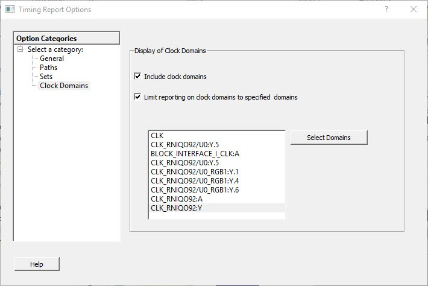

# Clock Domains

The following figure shows the Timing Report Options—Clock Domains dialog box.

-   **[Display of Clock Domains](GUID-42559F70-D71E-4D82-8F6F-93CD6B2F9E9C.md)**  

-   **[Include Clock Domains](GUID-BDFFC4A8-5CDF-4207-8D68-F6CD0A5C5DCC.md)**  

-   **[Limit Reporting on Clock Domains to Specified Domains](GUID-08B856E0-AD6E-459D-8D11-CA4F193957C6.md)**  

**Parent topic:**[Timing Report Options Dialog Box](GUID-29A2149F-C54F-4D59-B99E-CCC19A108FF0.md)

