# I/O

## BIBUF

Bidirectional Buffer.

 

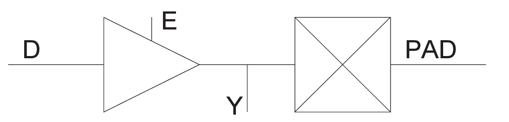

 

|Input|Output|
|-----|------|
|D, E, PAD|PAD, Y|

|MODE|E|D|PAD|Y|
|----|---|---|---|---|
|OUTPUT|1|D|D|D|
|INPUT|0|X|Z|X|
|INPUT|0|X|PAD|PAD|

## BIBUF\_DIFF

Bidirectional Buffer, Differential I/O.

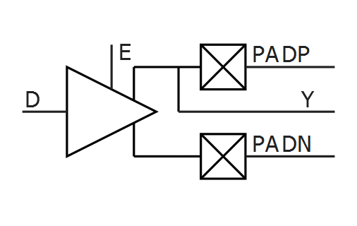

|Input|Output|
|-----|------|
|D, E, PADP, PADN|PADP, PADN, Y|

|MODE|E|D|PADP|PADN|Y|
|----|---|---|----|----|---|
|OUTPUT|1|0|0|1|0|
|OUTPUT|1|1|1|0|1|
|INPUT|0|X|Z|Z|X|
|INPUT|0|X|0|0|X|
|INPUT|0|X|1|1|X|
|INPUT|0|X|0|1|0|
|INPUT|0|X|1|0|1|

## CLKBIBUF

Bidirectional Buffer with Input to the global network.

 

 

|Input|Output|
|-----|------|
|D, E, PAD|PAD, Y|

|D|E|PAD|Y|
|---|---|---|---|
|X|0|Z|X|
|X|0|0|0|
|X|0|1|1|
|0|1|0|0|
|1|1|1|1|

## CLKBUF

Input Buffer to the global network.

 

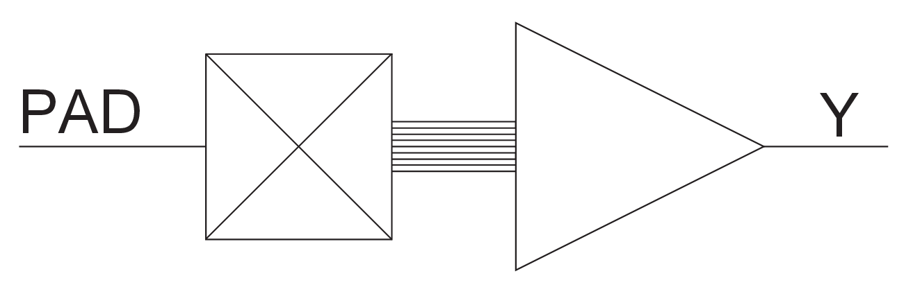

 

|Input|Output|
|-----|------|
|PAD|Y|

|PAD|Y|
|---|---|
|0|0|
|1|1|

## CLKBUF\_DIFF

Differential I/O macro to the global network, Differential I/O.

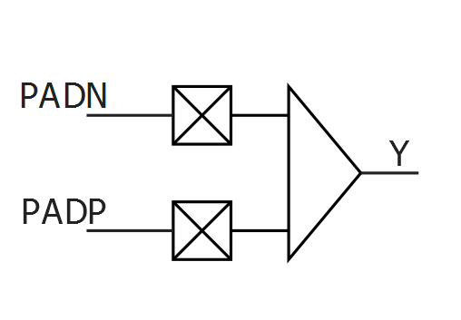

|Input|Output|
|-----|------|
|PADP, PADN|Y|

|PADP|PADN|Y|
|----|----|---|
|Z|Z|Y|
|0|0|X|
|1|1|X|
|0|1|0|
|1|0|1|

## GCLKBUF

Gated input I/O macro to the global network. The Enable signal can turn off the global network to save power.

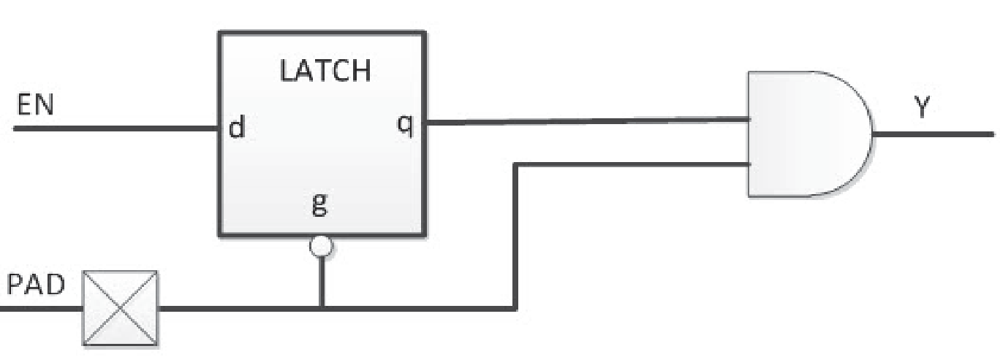

|Input|Output|
|-----|------|
|PAD, EN|Y|

|PAD|EN|q|Y|
|---|---|---|---|
|0|0|0|0|
|0|1|1|0|
|1|X|q|q|
|Z|X|X|X|

## GCLKBUF\_DIFF

Gated differential I/O macro to global network; the Enable signal can be  used to turn off the global network.

 

 

Differential

|Input|Output|
|-----|------|
|PADP, PADN, EN|Y|

|PADP|PADN|EN|q|Y|
|----|----|---|---|---|
|0|1|0|0|0|
|0|1|1|1|0|
|1|0|X|q|q|
|0|0|X|X|X|
|1|1|X|X|X|
|Z|Z|X|X|X|

## INBUF

Input Buffer.

 

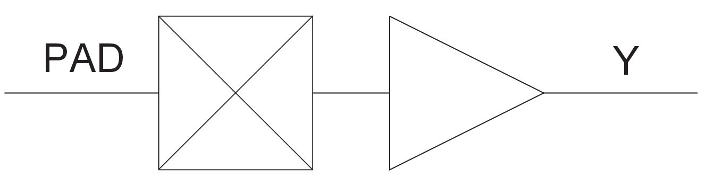

 

|Input|Output|
|-----|------|
|PAD|Y|

|PAD|Y|
|---|---|
|Z|X|
|0|0|
|1|1|

## INBUF\_DIFF

Input Buffer, Differential I/O.

|Input|Output|
|-----|------|
|PADP, PADN|Y|

|PADP|PADN|Y|
|----|----|---|
|Z|Z|X|
|0|0|X|
|1|1|X|
|0|1|0|
|1|0|1|

## OUTBUF

Output buffer.

 

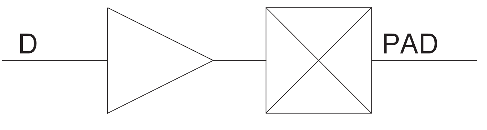

 

|Input|Output|
|-----|------|
|D|PAD|

|D|PAD|
|---|---|
|0|0|
|1|1|

## OUTBUF\_DIFF

Output buffer, Differential I/O.

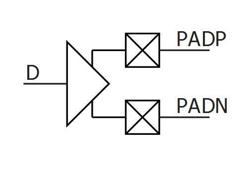

|Input|Output|
|-----|------|
|D|PADP, PADN|

|D|PADP|PADN|
|---|----|----|
|0|0|1|
|1|1|0|

## TRIBUFF

Tristate output buffer.

 

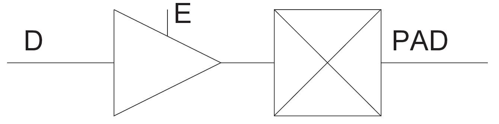

 

|Input|Output|
|-----|------|
|D, E|PAD|

|D|E|PAD|
|---|---|---|
|X|0|Z|
|D|1|D|

## TRIBUFF\_DIFF

Tristate output buffer, Differential I/O.

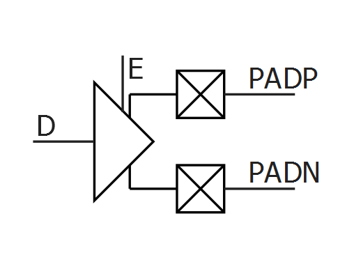

|Input|Output|
|-----|------|
|D, E|PADP, PADN|

|D|E|PADP|PADN|
|---|---|----|----|
|X|0|Z|Z|
|0|1|0|1|
|1|1|1|0|

## UJTAG

The UJTAG macro is a special purpose macro. It allows access to the user JTAG circuitry on board the chip.

You must instantiate a UJTAG macro in your design if you plan to make use of the user JTAG feature. The TMS, TDI, TCK, TRSTB, and TDO pins of the macro must be connected to top level ports of the design.

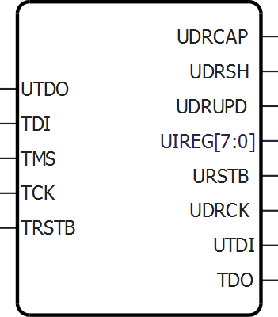

<table id="ID-00000EFB"><thead><tr id="ID-00000F06"><th id="ID-00000F07">

Port

</th><th id="ID-00000F09">

Direction

</th><th id="ID-00000F0B">

Polarity

</th><th id="ID-00000F0D">

Description

</th></tr></thead><tbody><tr id="ID-00000F10"><td id="ID-00000F11">

UIREG\[7:0\]

</td><td id="ID-00000F13">

Output

</td><td id="ID-00000F15">

—

</td><td id="ID-00000F17">

This 8-bit bus carries the contents of the JTAG instruction register of each device. Instruction values 16 to 127 are not reserved and can be employed as user-defined instructions.

</td></tr><tr id="ID-00000F19"><td id="ID-00000F1A">

URSTB

</td><td id="ID-00000F1C">

Output

</td><td id="ID-00000F1E">

Low

</td><td id="ID-00000F20">

URSTB is an Active-Low signal and is asserted when the TAP controller is in Test-Logic-Reset mode. URSTB is asserted at power-up, and a Power-on Reset signal resets the TAP controller state.

</td></tr><tr id="ID-00000F22"><td id="ID-00000F23">

UTDI

</td><td id="ID-00000F25">

Output

</td><td id="ID-00000F27">

—

</td><td id="ID-00000F29">

This port is directly connected to the TAP's TDI signal.

</td></tr><tr id="ID-00000F2B"><td id="ID-00000F2C">

UTDO

</td><td id="ID-00000F2E">

Input

</td><td id="ID-00000F30">

—

</td><td id="ID-00000F32">

This port is the user TDO output. Inputs to the UTDO port are sent to the TAP TDO output MUX when the IR addess is in user range.

</td></tr><tr id="ID-00000F34"><td id="ID-00000F35">

UDRSH

</td><td id="ID-00000F37">

Output

</td><td id="ID-00000F39">

High

</td><td id="ID-00000F3B">

Active-High signal enabled in the Shift\_DR TAP state.

</td></tr><tr id="ID-00000F3D"><td id="ID-00000F3E">

UDRCAP

</td><td id="ID-00000F40">

Output

</td><td id="ID-00000F42">

High

</td><td id="ID-00000F44">

Active-High signal enabled in the Capture\_DR\_TAP state.

</td></tr><tr id="ID-00000F46"><td id="ID-00000F47">

UDRCK

</td><td id="ID-00000F49">

Output

</td><td id="ID-00000F4B">

—

</td><td id="ID-00000F4D">

This port is directly connected to the TAP's TCK signal.**Note:** UDRCK must be connected to a global macro such as CLKINT. If this is not done, Synthesis/Compile will add it to the netlist to legalize it.

</td></tr><tr id="ID-00000F50"><td id="ID-00000F51">

UDRUPD

</td><td id="ID-00000F53">

Output

</td><td id="ID-00000F55">

High

</td><td id="ID-00000F57">

Active-High signal enabled in the Update\_DR\_TAP state.

</td></tr><tr id="ID-00000F59"><td id="ID-00000F5A">

TCK

</td><td id="ID-00000F5C">

Input

</td><td id="ID-00000F5E">

—

</td><td id="ID-00000F60">

Test Clock. Serial input for JTAG boundary scan, ISP, and  UJTAG. The TCK pin does not have an internal pull-up/pull-down resistor.  Connect TCK to GND or +3.3V through a resistor \(500-1 KΩ\) placed closed  to the FPGA pin to prevent totem-pole current on the input buffer and  TMS from entering into an undesired state.If JTAG is  not used, connect it to GND.

</td></tr><tr id="ID-00000F64"><td id="ID-00000F65">

TDI

</td><td id="ID-00000F67">

Input

</td><td id="ID-00000F69">

—

</td><td id="ID-00000F6B">

Test Data In. Serial input for JTAG boundary scan. There is an internal weak pull-up resistor on the TDI pin.

</td></tr><tr id="ID-00000F6D"><td id="ID-00000F6E">

TDO

</td><td id="ID-00000F70">

Output

</td><td id="ID-00000F72">

—

</td><td id="ID-00000F74">

Test Data Out. Serial output for JTAG boundary scan. The TDO pin does not have an internal pull-up/pull-down resistor.

</td></tr><tr id="ID-00000F76"><td id="ID-00000F77">

TMS

</td><td id="ID-00000F79">

Input

</td><td id="ID-00000F7B">

—

</td><td id="ID-00000F7D">

Test mode select. The TMS pin controls the use of the IEEE®1532 boundary scan pins \(TCK, TDI, TDO, and TRST\).  There is an internal weak pull-up resistor on the TMS pin.

</td></tr><tr id="ID-00000F7F"><td id="ID-00000F80">

TRSTB

</td><td id="ID-00000F82">

Input

</td><td id="ID-00000F84">

Low

</td><td id="ID-00000F86">

Test reset. The TRSTB pin is an active-low input. It  synchronously initializes \(or resets\) the boundary scan circuitry. There  is an internal weak pull-up resistor on the TRSTB pin.To hold the JTAG in reset mode and prevent it from  entering into undesired states in critical applications, connect  TRSTB to GND through a 1 KΩ resistor \(placed close to the FPGA  pin\).

</td></tr></tbody>
</table>## UJTAG\_SEC

The UJTAG\_SEC macro is a special purpose macro. It allows access to the user JTAG circuitry on board the chip.

You must instantiate a UJTAG\_SEC macro in your design if you plan to make  use of the user JTAG feature. The TMS, TDI, TCK, TRSTB, and TDO pins of the macro must be  connected to top level ports of the design.

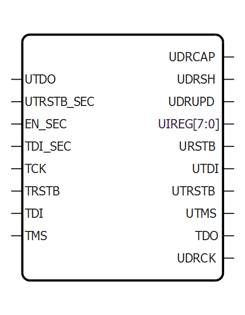

<table id="ID-00000F92"><thead><tr id="ID-00000F9D"><th id="ID-00000F9E">

Port

</th><th id="ID-00000FA0">

Direction

</th><th id="ID-00000FA2">

Polarity

</th><th id="ID-00000FA4">

Description

</th></tr></thead><tbody><tr id="ID-00000FA7"><td id="ID-00000FA8">

UIREG\[7:0\]

</td><td id="ID-00000FAA">

Output

</td><td id="ID-00000FAC">

—

</td><td id="ID-00000FAE">

This 8-bit bus carries the contents of the JTAG instruction register of each device. Instruction values 16 to 127 are not reserved and can be employed as user- defined instructions.

</td></tr><tr id="ID-00000FB0"><td id="ID-00000FB1">

URSTB

</td><td id="ID-00000FB3">

Output

</td><td id="ID-00000FB5">

Low

</td><td id="ID-00000FB7">

URSTB is an Active Low signal and is asserted  when the TAP controller is in Test-Logic-Reset mode. URSTB is asserted at  power-up, and a Power-on Reset signal resets the TAP controller state.

</td></tr><tr id="ID-00000FB9"><td id="ID-00000FBA">

UTDI

</td><td id="ID-00000FBC">

Output

</td><td id="ID-00000FBE">

—

</td><td id="ID-00000FC0">

This port is directly connected to the TAP's TDI signal.

</td></tr><tr id="ID-00000FC2"><td id="ID-00000FC3">

UTDO

</td><td id="ID-00000FC5">

Input

</td><td id="ID-00000FC7">

—

</td><td id="ID-00000FC9">

This port is the user TDO output. Inputs to the UTDO port are sent to the TAP TDO output MUX when the IR addess is in user range.

</td></tr><tr id="ID-00000FCB"><td id="ID-00000FCC">

UDRSH

</td><td id="ID-00000FCE">

Output

</td><td id="ID-00000FD0">

High

</td><td id="ID-00000FD2">

Active High signal enabled in the Shift\_DR TAP state.

</td></tr><tr id="ID-00000FD4"><td id="ID-00000FD5">

UDRCAP

</td><td id="ID-00000FD7">

Output

</td><td id="ID-00000FD9">

High

</td><td id="ID-00000FDB">

Active High signal enabled in the Capture\_DR\_TAP state.

</td></tr><tr id="ID-00000FDD"><td id="ID-00000FDE">

UDRCK

</td><td id="ID-00000FE0">

Output

</td><td id="ID-00000FE2">

—

</td><td id="ID-00000FE4">

This port is directly connected to the TAP's  TCK signal.**Note:** UDRCK must be connected to a global macro such as CLKINT. If this is not done, Synthesis/Compile will add it to the netlist to legalize it.

</td></tr><tr id="ID-00000FE7"><td id="ID-00000FE8">

UDRUPD

</td><td id="ID-00000FEA">

Output

</td><td id="ID-00000FEC">

High

</td><td id="ID-00000FEE">

Active High signal enabled in the Update\_DR\_TAP state.

</td></tr><tr id="ID-00000FF0"><td id="ID-00000FF1">

TCK

</td><td id="ID-00000FF3">

Input

</td><td id="ID-00000FF5">

—

</td><td id="ID-00000FF7">

Test Clock. Serial input for JTAG boundary  scan, ISP, and UJTAG. The TCK pin does not have an internal pull-up/pull- down  resistor. Connect TCK to GND or 3.3V through a resistor \(500–1 KΩ\) placed  closed to the FPGA pin to prevent totem-pole current on the input buffer and  TMS from entering into an undesired state.If JTAG is not  used, connect it to GND.

</td></tr><tr id="ID-00000FFB"><td id="ID-00000FFC">

TDI

</td><td id="ID-00000FFE">

Input

</td><td id="ID-00001000">

—

</td><td id="ID-00001002">

Test Data In. Serial input for JTAG boundary scan. There is an internal weak pull-up resistor on the TDI pin.

</td></tr><tr id="ID-00001004"><td id="ID-00001005">

TDO

</td><td id="ID-00001007">

Output

</td><td id="ID-00001009">

—

</td><td id="ID-0000100B">

Test Data Out. Serial output for JTAG boundary scan. The TDO pin does not have an internal pull-up/pull-down resistor.

</td></tr><tr id="ID-0000100D"><td id="ID-0000100E">

TMS

</td><td id="ID-00001010">

Input

</td><td id="ID-00001012">

—

</td><td id="ID-00001014">

Test mode select. The TMS pin controls the  use of the IEEE®1532 boundary scan pins \(TCK, TDI, TDO, and  TRST\). There is an internal weak pull- up resistor on the TMS pin.

</td></tr><tr id="ID-00001016"><td id="ID-00001017">

TRSTB

</td><td id="ID-00001019">

Input

</td><td id="ID-0000101B">

Low

</td><td id="ID-0000101D">

Test reset. The TRSTB pin is an active-low  input. It synchronously initializes \(or resets\) the boundary scan circuitry.  There is an internal weak pull-up resistor on the TRSTB pin.To hold the JTAG in reset mode and prevent it from entering into undesired  states in critical applications, connect TRSTB to GND through a 1 KΩ  resistor \(placed close to the FPGA pin\).

</td></tr><tr id="ID-00001021"><td id="ID-00001022">

EN\_SEC

</td><td id="ID-00001024">

Input

</td><td id="ID-00001026">

High

</td><td id="ID-00001028">

Enable Security. Enables the user design to override the external TDI and TRSTB input to the TAP.Need to tie LOW in the design when not used.

</td></tr><tr id="ID-0000102B"><td id="ID-0000102C">

TDI\_SEC

</td><td id="ID-0000102E">

Input

</td><td id="ID-00001030">

—

</td><td id="ID-00001032">

TDI Security override. Overrides the external TDI input to the TAP when SEC\_EN is HIGH.

</td></tr><tr id="ID-00001034"><td id="ID-00001035">

TRSTB\_SEC

</td><td id="ID-00001037">

Input

</td><td id="ID-00001039">

Low

</td><td id="ID-0000103B">

TRSTB Security override. Overrides the external TRSTB input to the TAP when SEC\_EN is HIGH.

</td></tr></tbody>
</table>