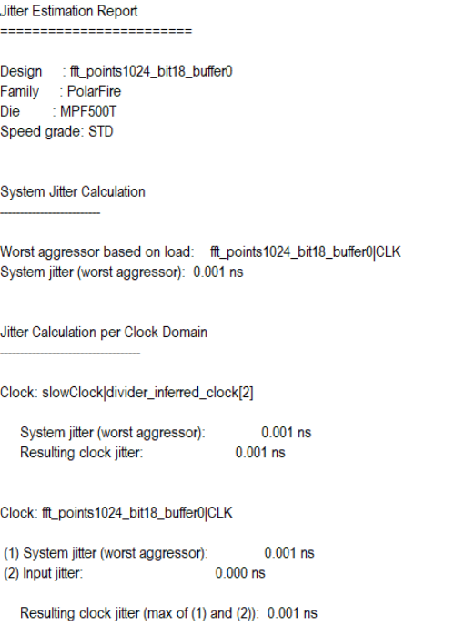
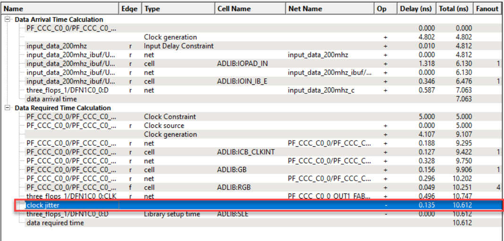
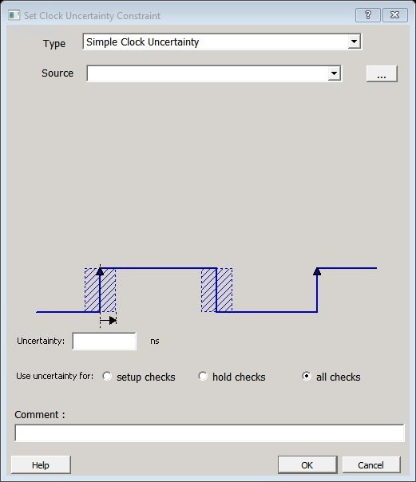
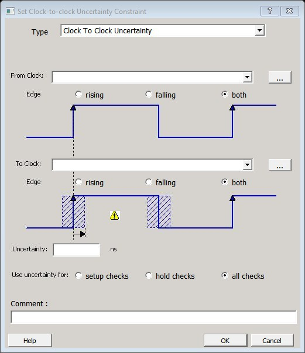
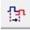
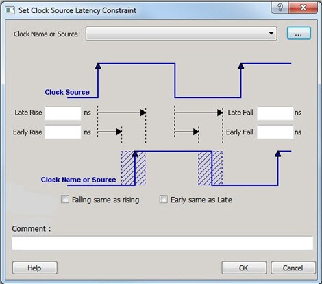

# Adjusting Clock Information

After you define all required constraints, including clock information, enter any  information related to clock noise when such information is not or cannot be generated  automatically by the tools. This is generally the case for external clock jitter  information occurring at the primary inputs of the device. There can be multiple sources  of clock jitter including:

-   Global jitter \(or internal system jitter\)
-   PLL/DLL jitter
-   External jitter

For more information about these types of jitter, see the appropriate product datasheets  and documents.

Starting with Libero SoC v2022.1, the automatic computation of system clock jitter for  Place &amp; Route and Static Timing Analysis was introduced to the design flow for  PolarFire and PolarFire SoC devices. With this feature, you need only specify the clock  jitter of any FPGA primary input using the `set_input_jitter` constraint.  These jitter components are analyzed automatically, and a specific jitter value computed  for each clock is passed on to the appropriate design flow steps. With the automatic  clock jitter flow, you can add a margin to the estimated jitter of a clock using the  `set_clock_uncertainty` constraint.

In rare cases or when instructed by user guides, you can use the  `set_system_jitter` constraint to override the automatically computed  global jitter value. System jitter is estimated based on the count of registers and RAM  blocks in the synthesized netlist. A report similar to the following, detailing the  jitter estimate, is generated upon completing the Place &amp; Route and Verify Timing  steps.

The expanded timing analysis path reports include the clock jitter as an extra line  item.

You can also provide the latency of a clock from its source outside the device to the  primary input using the `set_clock_latency` constraint.

For more information about clock jitters, see the [PolarFire Family Clocking Resources User Guide](https://ww1.microchip.com/downloads/aemDocuments/documents/FPGA/ProductDocuments/UserGuides/Microchip_PolarFire_FPGA_and_PolarFire_SoC_FPGA_Clocking_Resources_User_Guide_VB.pdf).

## Set a Clock Input Jitter Value

Use the `set_input_jitter` constraint to specify the peak-to-peak jitter  value at the primary input of the clock \(see section [set\_input\_jitter](GUID-104B5D4C-AD1F-406A-B2DA-5B321AFBE506.md)\).

## Set a Clock Uncertainty Constraint

Use the **Set Clock Uncertainty Constraint** dialog  box to    set  either the  [Simple Clock Uncertainty](GUID-D35DA016-318E-44F3-8D1B-F551EF3343D8.md#) constraint or  the  [Clock To Clock Uncertainty](GUID-D35DA016-318E-44F3-8D1B-F551EF3343D8.md#) constraint from the  **Type**  drop-down menu. The default is  [Simple Clock Uncertainty](GUID-D35DA016-318E-44F3-8D1B-F551EF3343D8.md#).

### Set Simple Clock Uncertainty Constraint

To open the **Set Clock Uncertainty Constraint**dialog box from the  **Constraints**menu, choose **Clock Uncertainty**and select **Simple Clock Uncertainty**from the  **Type**drop-down menu in **Set Clock Uncertainty Constraint** dialog box.

The following table describes the **Set Clock Uncertainty Constraint**  dialog box options.

|Option|Description|
|------|-----------|
|Type|  Select Simple Clock Uncertainty \(default\) to  set clock uncertainty constraint on a single clock. |
|Source|  Specifies the clock name as the uncertainty source. To set the source  clock, click the Browse button to open the  Select Source for Simple Uncertainty  Constraint dialog box.  The following options are available in the Select Source  for Simple Uncertainty Constraint dialog box:Type: Displays the type of  available pins in the design. The available Pin  Type options are:Clock  PinsAll  PinsAll  PortsPattern: Default is \*, which is  a wild-card match for all. You can specify any string value.  Click Search to filter the available  pins based on the specified Pin Type and Pattern.Available Pins: Displays the  available clock pins or ports \(ports are defined as clock  signal in the design\). If you change the pattern value, the  list box displays the available pins or ports based on the  filter.Use Add/Add  All to add the clock pins from the  Available Pins list to the Assigned Pins list or  Remove/Remove  All to delete the clock pins from the  Assigned Pins list.Assigned Pins: Displays pins  selected from the Available Pins list. Select Pins from this  list and click OK to add the source  to the constraint. |
|Uncertainity|Enter the time in `ns` that represents the amount of  deviation between two clock edges.|
|Use uncertainty for|Enables you to select whether the uncertainty constraint applies to  setup, hold, or all checks.|
|Comment|Enables you to save a single line of text that describes this  constraint.|

### Set Clock-to-Clock Uncertainty Constraint

To open the **Set Clock-to-clock Uncertainty Constraint** dialog box  from the **Constraints**menu, choose **Clock Uncertainty**, and select **Clock To Clock Uncertainty**from the **Type**drop-down menu.

The following table describes the **Set Clock-to-clock Uncertainty Constraint** dialog box options.

|Option|Description|
|------|-----------|
|Type|Select **Clock To Clock Uncertainty**.|
|From Clock|Specifies clock name as the uncertainty source.To set the From  Clock, click the Browse button to open the  Select Source Clock List for Clock-to-clock  Uncertainty dialog box.The following options  are available in the Select Source Clock List for  Clock-to-clock Uncertainty dialog box:Type: Displays the type of  available pins in the design. The only choice available for  Pin Type is Clock Pins.Pattern: Default is \*, which is  a wild-card match for all. You can specify any string value.  Click Search to filter the available  pins based on the specified Pin Type and Pattern.Available Pins: Displays the  available clock pins. If you change the pattern value, the  list box displays the available pins based on the  filter.Use Add/Add  All to add the clock pins from the  Available Pins list to the Assigned Pins list or  Remove/Remove  All to delete the clock pins from the  Assigned Pins list.Assigned Pins: Displays pins  selected from the Available Pins list. Select Pins from this  list and click OK to add the source  clock for the Clock-to-Clock Uncertainty constraint.|
|Edge|Enables you to select if the clock-to-clock uncertainty applies to  rising, falling, or both edges.|
|To Clock|Specifies clock name as the uncertainty destination.To set the To  Clock, click the Browse button to open the  Select Destination Clock List for Clock-to-clock  Uncertainty Constraint dialog box.The  following options are available in the Select Destination  Clock List for Clock-to-clock Uncertainty Constraint  dialog box:Type: Displays the type of  available pins in the design. The only valid selection is  Clock Pins.Pattern: Default is \*, which is  a wild-card match for all. You can specify any string value.  Click Search to filter the available  pins based on the specified Pin Type and Pattern.Available Pins: Displays the  available clock pins. If you change the pattern value, the  list box displays the available pins based on the  filter.Use Add/Add  All to add the clock pins from the  Available Pins list to the Assigned Pins list or  Remove/Remove  All to delete the clock pins from the  Assigned Pins list.Assigned Pins: Displays pins  selected from the Available Pins list. Select Pins from this  list and click OK to add the  destination clock for the Clock-to-Clock Uncertainty  constraint.|
|Uncertainty|Enter the time in `ns` that represents the amount of  deviation between two clock edges.|
|Use Uncertainty For|Enables you to select whether the uncertainty constraint applies to  setup, hold, or all checks.|
|Comment|Enables you to save a single line of text that describes this  constraint.|

## Set Clock Source Latency Constraint

Use the clock source latency constraint to specify the delay from the clock generation point to  the clock definition point in the design.

Clock source latency defines the delay between an external clock source and the definition pin of  a clock.

You can specify both an "early" delay and a "late" delay for this latency, providing an  uncertainty that the timing analyzer can use for propagating through its calculations.  Rising and falling edges of the same clock can have different latencies. If only one  clock source latency value is provided, the value is taken as the exact latency value  for both rising and falling edges.

To specify a Clock Source Latency constraint, open the **Set Clock Source Latency Constraint** dialog box in one of the following four ways:

-   In the **Constraints Browser**, double-click **Clock Source Latency**.
-   Click the **Clock Source Latency Constraint**  icon.
-   From the **Constraints** menu, click **Clock Source Latency**.
-   Right-click any row of **Clock Latency Constraints Table** and click **Add Clock Source Latency**. The **Set Clock Source Latency Constraint** dialog box appears.

The following table describes the **Set Clock Source Latency Constraint** dialog box options.

|Option|Description|
|------|-----------|
|Clock Name or Source|To select the clock source, click the **Browse**  button to open the **Choose the Clock Source Pin**  dialog box.The only choice available for Pin Type is  Clock Pins.|
|Late Rise|Specifies the largest possible latency \(in nanoseconds\) of the rising  clock edge at the clock port or pin selected with respect to its source.  Negative values are acceptable, but may lead to overly optimistic  analysis.|
|Late Fall|Specifies the largest possible latency \(in nanoseconds\) of the  falling clock edge at the clock port or pin selected with respect to its  source. Negative values are acceptable, but may lead to overly  optimistic analysis.|
|Early Rise|Specifies the smallest possible latency \(in nanoseconds\) of the  rising clock edge at the clock port or pin selected with respect to its  source. Negative values are acceptable, but may lead to overly  optimistic analysis.|
|Early Fall|Specifies the smallest possible latency \(in nanoseconds\) of the  falling clock edge at the clock port or pin selected with respect to its  source. Negative values are acceptable, but may lead to overly  optimistic analysis.|
|Falling same as rising|Specifies that the rising and falling clock edges have the same  latency.|
|Early same as Late|  Specifies that the clock source latency must be considered a single  value, not a range from early to late. |
|Comment|Enter a one-line comment to describe the clock source  latency.|

## Set a Clock Group

To add or delete a  clock  group  constraint, open the **Add Clock Groups Constraint** dialog box in  one of the  following  ways:

-   From the **Constraints** menu, click **Clock Groups**.
-   In the **Constraints Browser**, double-click **Clock Groups**.
-   Right-click any row of **Clock Groups Constraints Table** and click **Add Clock Groups**.

The following table describes the **Add Clock Groups Constraints**  dialog box options.

<table id="TABLE_FYL_C1K_VNB"><thead><tr><th>

Option

</th><th>

Description

</th></tr></thead><tbody><tr><td>

ClockGroupsName

</td><td>

Enter a name for the  clock  groups  to be added.

</td></tr><tr><td>

Exclusive Flag

</td><td>

Choose one of the following three clock group attributes for the  clock group:-   **Logically Exclusive**: Use this setting for clocks that can exist physically on the device at the same time, but are logically exclusive \(for example, multiplexed clocks\).
-   **Physically Exclusive**: Use this setting for clocks that cannot exist physically on the device at the same time \(for example, multiple clocks defined on the same pin\).
-   **Asynchronous**: Use this setting when there are valid timing paths between the two clock groups, but the two clocks have no frequency or phase relationship and therefore these timing paths can be excluded from timing analysis.

</td></tr><tr><td>

Add Group

</td><td>

Click **Add**to open a dialog  box  to add clocks to a clock group. In the  **Available Pins** list, click the clocks, and  then click **Add**to move them  to  the   **Assigned Pins** list. Click  **OK**.

</td></tr><tr><td>

Delete Group

</td><td>

Delete the clocks from a  clock  group.  Select the group of clocks to be deleted and click **Delete Group**. This will delete the clock group.

</td></tr></tbody>
</table>## Modifying a System Jitter Value

Use the `set_system_jitter` constraint to adjust the global jitter that is  automatically generated by Libero.

