# All Macros

## AND2

2-Input AND.

 

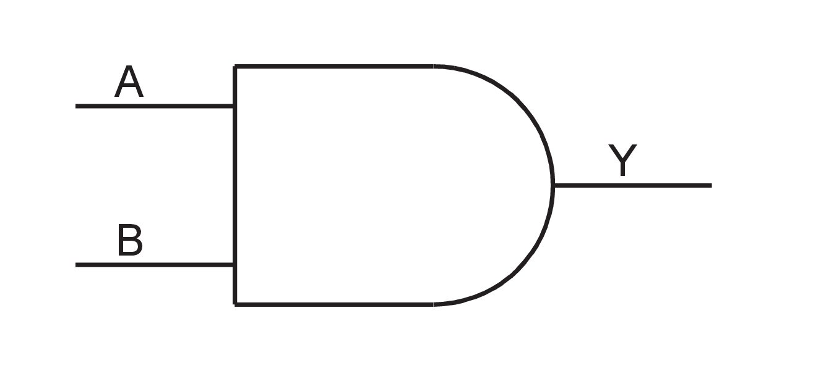

 

|Inputs|Output|
|------|------|
|A, B|Y|

|A|B|Y|
|---|---|---|
|X|0|0|
|0|X|0|
|1|1|1|

## AND3

3-Input AND.

 

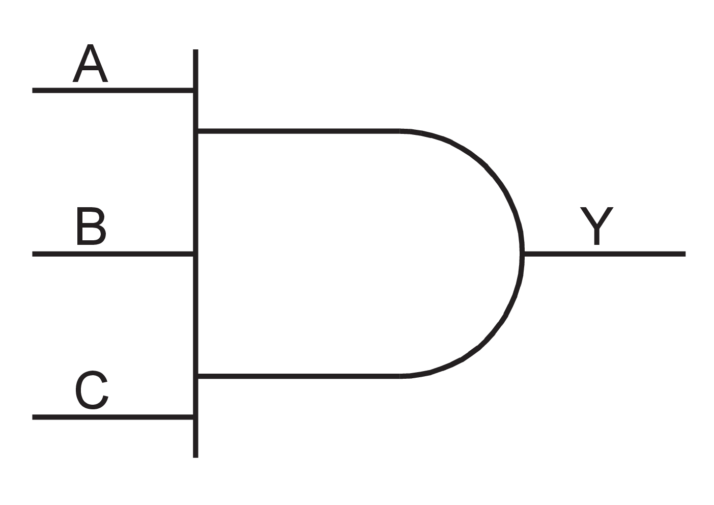

 

|Input|Output|
|-----|------|
|A, B, C|Y|

|A|B|C|Y|
|---|---|---|---|
|X|X|0|0|
|X|0|X|0|
|0|X|X|0|
|1|1|1|1|

## AND4

4-Input AND.

 

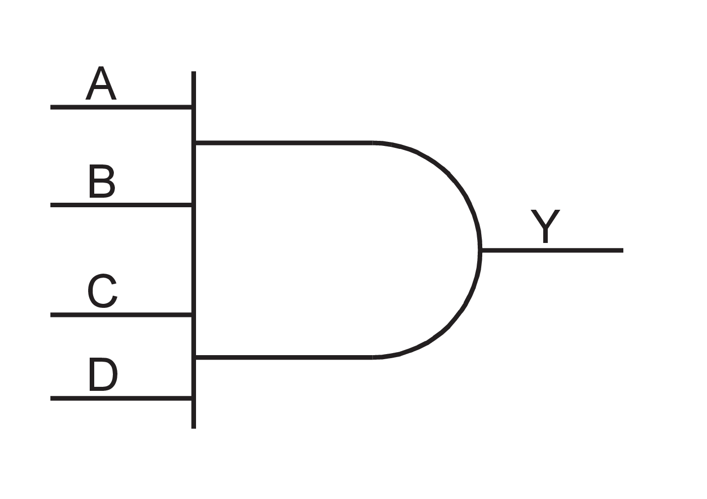

 

|Input|Output|
|-----|------|
|A, B, C, D|Y|

|A|B|C|D|Y|
|---|---|---|---|---|
|X|X|X|0|0|
|X|X|0|X|0|
|X|0|X|X|0|
|0|X|X|X|0|
|1|1|1|1|1|

## CFG1/2/3/4 and Look-Up Tables \(LUTs\)

CFG1, CFG2, CFG3, and CFG4 are post-layout LUTs that implement any 1-input, 2-input, 3-input, and 4-input combinational logic functions respectively. Each of the CFG1/2/3/4 macros has an INIT string parameter that determines the logic functions of the macro. The output Y is dependent on the INIT string parameter and the values of the inputs.

## CFG2

Post-layout macro implements any 2-input combinational logic function.  Output Y is dependent on the INIT string parameter and the value of A and B. The INIT  string parameter is 4 bits wide.

|Input|Output|
|-----|------|
|A,B|Y = f \(INIT, A, B\)|

|BA|Y|
|---|---|
|00|INIT\[0\]|
|01|INIT\[1\]|
|10|INIT\[2\]|
|11|INIT\[3\]|

## CFG3

Post-layout macro used to implement any 3-input combinational logic  function. Output Y is dependent on the INIT string parameter and the value of A, B, and C.  The INIT string parameter is 8 bits wide.

 

 

|Input|Output|
|-----|------|
|A, B, C|Y = f \(INIT, A,B, C\)|

|CBA|Y|
|---|---|
|000|INIT\[0\]|
|001|INIT\[1\]|
|010|INIT\[2\]|
|011|INIT\[3\]|
|100|INIT\[4\]|
|101|INIT\[5\]|
|110|INIT\[6\]|
|111|INIT\[7\]|

## CFG4

Post-layout macro used to implement any 4-input combinational logic  function. Output Y is dependent on the INIT string parameter and the value of A, B, C, and  D. The INIT string parameter is 16 bits wide.

 

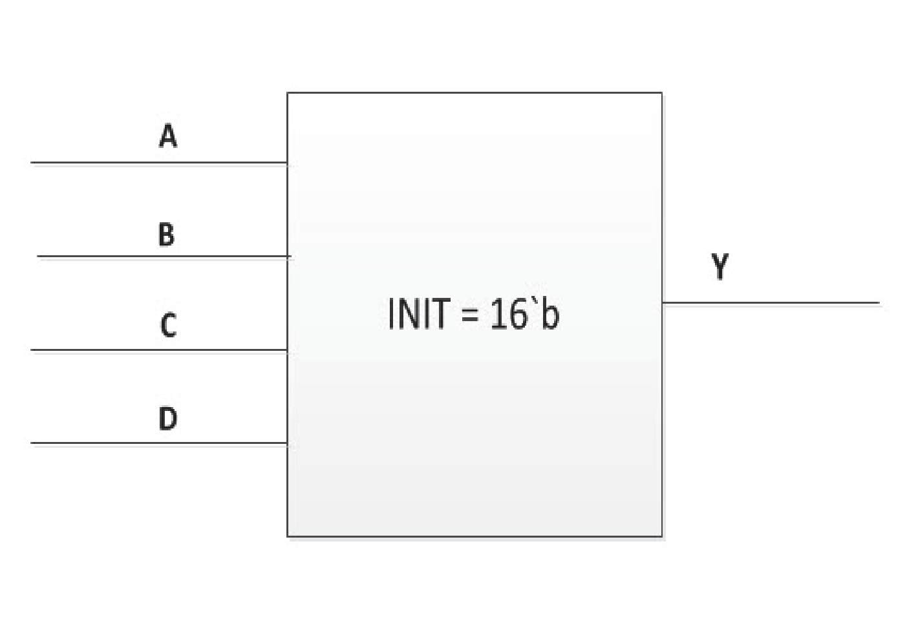

 

|Input|Output|
|-----|------|
|A, B, C, D|Y = f \(INIT, A,B, C, D\)|

|DCBA|Y|
|----|---|
|0000|INIT\[0\]|
|0001|INIT\[1\]|
|0010|INIT\[2\]|
|0011|INIT\[3\]|
|0100|INIT\[4\]|
|0101|INIT\[5\]|
|0110|INIT\[6\]|
|0111|INIT\[7\]|
|1000|INIT\[8\]|
|1001|INIT\[9\]|
|1010|INIT\[10\]|
|1011|INIT\[11\]|
|1100|INIT\[12\]|
|1101|INIT\[13\]|
|1110|INIT\[14\]|
|1111|INIT\[15\]|

## BUFF

Buffer.

|Input|Output|
|-----|------|
|A|Y|

|A|Y|
|---|---|
|0|0|
|1|1|

## BUFD

Buffer.

**Note:** The compile optimization does not remove this macro.

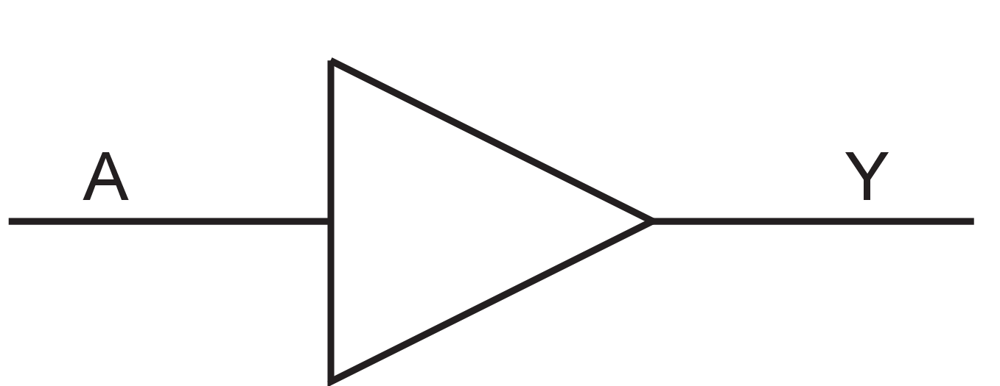

|Input|Output|
|-----|------|
|A|Y|

|A|Y|
|---|---|
|0|0|
|1|1|

## BUFD\_DELAY

Buffer. The cell delay of BUFD\_DELAY is about 0.4 ns at Military operating  conditions. Its delay is longer than that of BUFD.

**Note:** Compile optimization will not remove this macro.

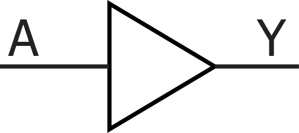

|Input|Output|
|-----|------|
|A|Y|

|A|Y|
|---|---|
|0|0|
|1|1|

## CLKINT

This macro routes an internal fabric signal to the global network.

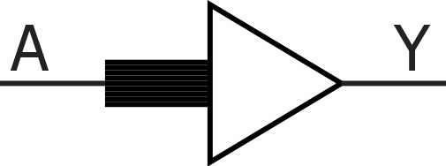

|Input|Output|
|-----|------|
|A|Y|

|A|Y|
|---|---|
|0|0|
|1|1|

## GBR

Back-annotated macro that routes an internal fabric signal to global  network.

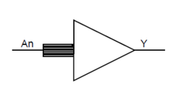

|Input|Output|
|-----|------|
|An|Y|

|An|Y|
|---|---|
|0|0|
|1|1|

## CLKINT\_PRESERVE

This Macro routes an internal fabric signal to the global network. It has  the same functionality as CLKINT except that this clock always stays on the global clock  network and will not be demoted during design implementation.

|Input|Output|
|-----|------|
|A|Y|

|A|Y|
|---|---|
|0|0|
|1|1|

## GRESET

This Macro connects an I/O or route an internal fabric signal to the  global reset network. The connection to the GRESET is hardened for radiation only if the  driver is an I/O fixed at a package pin with GRESET in its function name. Routing an  internal fabric signal through the GRESET macro is hardened by the radiation.

|A|Y|
|---|---|
|0|0|
|1|1|

## RCLKINT

This Macro routes an internal fabric signal to a row global buffer, thus  creating a local clock.

|Input|Output|
|-----|------|
|A|Y|

|A|Y|
|---|---|
|0|0|
|1|1|

## RGB

Back-annotated macro that routes an internal fabric signal to a row global  buffer.

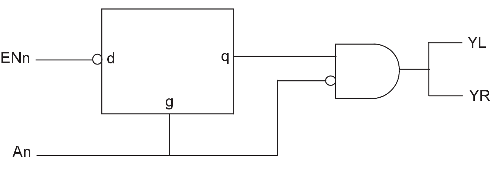

|Input|Output|
|-----|------|
|An|YL, YR|

|An|YL|YR|
|---|---|---|
|0|0|0|
|1|1|1|

## RGRESET

Macro used to route a triplicated fabric signal to a row global buffer and create a local reset. The three input bits must be driven by three separate logic cones replicating the paths from the source registers.

|A\[2\]|A\[1\]|A\[0\]|Y|
|------|------|------|---|
|X|0|0|0|
|0|X|0|0|
|0|0|X|0|
|X|1|1|1|
|1|X|1|1|
|1|1|X|1|

## SLE

Sequential Logic Element.

")

|Input|Output|
|Name|Function|Name|
|-----|------|
|----|--------|----|
|D|Data input|Q|
|CLK|Clock input|
|EN|Active-High CLK enable|
|ALn|Asynchronous Load. This active-low signal  either sets the register or clears the register depending on the value of  ADn.|
|ADn[1](GUID-CEB1BC36-BDC1-4986-B0B4-70AE88A7572D.md#GUID-94FA4D8D-6652-435D-B320-ABA81EE75433)|Static asynchronous load data. When ALn is active, Q goes to the complement of ADn.|
|SLn|Synchronous load. This active-low signal  either sets the register or clears the register depending on the value of SD,  at the rising edge of the clock.|
|SD[1](GUID-CEB1BC36-BDC1-4986-B0B4-70AE88A7572D.md#GUID-94FA4D8D-6652-435D-B320-ABA81EE75433)|Static synchronous load data. When SLn is  active \(that is, low\), Q goes to the value of SD at the rising edge of  CLK.|
|LAT[1](GUID-CEB1BC36-BDC1-4986-B0B4-70AE88A7572D.md#GUID-94FA4D8D-6652-435D-B320-ABA81EE75433)|LAT is always tied to low. Q output is invalid when LAT=1.|

**Note:**

1.  ADn, SD, and LAT are static signals defined at design time and need to be tied to 0 or 1.

|ALn|ADn|LAT|CLK|EN|SLn|SD|D|Qn+1|
|---|---|---|---|---|---|---|---|----|
|0|ADn|X|X|X|X|X|X|!ADn|
|1|X|0|Not rising|X|X|X|X|Qn|
|1|X|0|↑|0|X|X|X|Qn|
|1|X|0|↑|1|0|SD|X|SD|
|1|X|0|↑|1|1|X|D|D|
|X|X|1|X|X|X|X|X|Invalid|

## SLE\_RT

Sequential Logic Element macro available only in post-layout netlist.

")

|Input|Output|
|-----|------|
|Name|Function|Q|
|D|Data input|
|CLK|Clock input|
|EN|Active High CLK enable|
|ALn|Asynchronous Load. This active low signal either sets the register or clears the register depending on the value of ADn.|
|ADn[1](GUID-CEB1BC36-BDC1-4986-B0B4-70AE88A7572D.md#GUID-FA136187-0681-4596-BB69-AC7ED13BAF3C)|Static asynchronous load data. When ALn is active, Q goes to the complement of ADn.|
|SLn|Synchronous load. This active low signal either sets the register or clears the register depending on the value of SD, at the rising edge of the clock.|
|SD[1](GUID-CEB1BC36-BDC1-4986-B0B4-70AE88A7572D.md#GUID-FA136187-0681-4596-BB69-AC7ED13BAF3C)|Static synchronous load data. When SLn is  active \(that is, low\), Q goes to the value of SD at the rising edge of  CLK.|
|DELEN[1](GUID-CEB1BC36-BDC1-4986-B0B4-70AE88A7572D.md#GUID-FA136187-0681-4596-BB69-AC7ED13BAF3C)|Enable Single-event Transient  mitigation.|

**Note:**

1.  ADn, SD, and DELEN are static signals defined at design time and need to be tied to 0 or 1.

|ALn|ADn|CLK|EN|SLn|SD|D|Qn+1|
|---|---|---|---|---|---|---|----|
|0|ADn|X|X|X|X|X|!ADn|
|1|X|Not rising|X|X|X|X|Qn|
|1|X|↑|0|X|X|X|Qn|
|1|X|↑|1|0|SD|X|SD|
|1|X|↑|1|1|X|D|D|

## ARI1

The ARI1 macro is responsible for representing all arithmetic operations in the pre-layout phase.

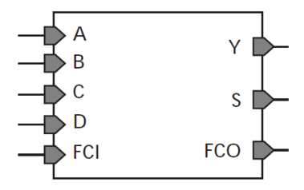

|Input|Output|
|-----|------|
|A, B, C, D, FCI|Y, S, FCO|

The ARI1 cell has a 20 bit INIT string parameter that is used to configure  its functionality. The interpretation of the 16 LSB of the INIT string is shown in the  following table. F0 is the value of Y when A = 0 and F1 is the value of Y when A = 1.

|ADCB|Y| |
|----|---|---|
|0000|INIT\[0\]|F0|
|0001|INIT\[1\]|
|0010|INIT\[2\]|
|0011|INIT\[3\]|
|0100|INIT\[4\]|
|0101|INIT\[5\]|
|0110|INIT\[6\]|
|0111|INIT\[7\]|
|1000|INIT\[8\]|F1|
|1001|INIT\[9\]|
|1010|INIT\[10\]|
|1011|INIT\[11\]|
|1100|INIT\[12\]|
|1101|INIT\[13\]|
|1110|INIT\[14\]|
|1111|INIT\[15\]|

|Y|FCI|S|
|---|---|---|
|0|0|0|
|0|1|1|
|1|0|1|
|1|1|0|

ARI1 LOGIC

The 4 MSB of the INIT string controls the output of the carry bits. The carry is generated using carry propagation and generation bits, which are evaluated according to the following tables.

|INIT\[17\]|INIT\[16\]|G|
|----------|----------|---|
|0|0|0|
|0|1|F0|
|1|0|1|
|1|1|F1|

|INIT\[19\]|INIT\[18\]|P|
|----------|----------|---|
|0|0|0|
|0|1|Y|
|1|X|1|

|P|G|FCI|FCO|
|---|---|---|---|
|0|G|X|G|
|1|X|FCI|FCI|

## ARI1\_CC

The ARI1\_CC macro is responsible for representing all arithmetic  operations in the post-layout phase. It performs all the functions of the ARI1 macro except  that it does not generate the Final Carry Out \(FCO\).

**Note:** FC1 and FC0 do not perform any functionalities.

|Input|Output|
|-----|------|
|A, B, C, D, CC|Y, S, P, UB|

The ARI1\_CC cell has a 20-bit INIT string parameter that is used to  configure its functionality. The interpretation of the 16 LSB of the INIT string is shown  in the following table. F0 is the value of Y when A = 0 and F1 is the value of Y when A =  1. The following table shows the interpretation of 16 LSB of the INIT string for  AR1\_CC.

|ADCB|Y| |
|----|---|---|
|0000|INIT\[0\]|F0|
|0001|INIT\[1\]|
|0010|INIT\[2\]|
|0011|INIT\[3\]|
|0100|INIT\[4\]|
|0101|INIT\[5\]|
|0110|INIT\[6\]|
|0111|INIT\[7\]|
|1000|INIT\[8\]|F1|
|1001|INIT\[9\]|
|1010|INIT\[10\]|
|1011|INIT\[11\]|
|1100|INIT\[12\]|
|1101|INIT\[13\]|
|1110|INIT\[14\]|
|1111|INIT\[15\]|

The 4 MSB of the INIT string controls the output of the carry bits. The carry is generated using carry propagation and generation bits, which are evaluated according to the following tables.

|INIT\[17\]|INIT\[16\]|UB|
|----------|----------|---|
|0|0|1|
|0|1|!F0|
|1|0|0|
|1|1|!F1|

|INIT\[19\]|INIT\[18\]|P|
|----------|----------|---|
|0|0|0|
|0|1|Y|
|1|X|1|

The equation of S is given by:

S=Y^CC

## CC\_CONFIG

The CC\_CONFIG macro is responsible for generating the Carry bit for each  ARI1\_CC cell in the cluster.

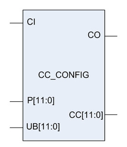

|Input|Output|
|-----|------|
|CI, P, UB|CO, CC|

CI and CO are the carry-in and carry-out, respectively, to the cell. The  intermediate carry-bits are given by CC\[11:0\]. The functionality of the CC\_CONFIG is  basically evaluating CC using

CC\[n\] = !Px!UB+PxCC\[n-1\]

where CC\[-1\] is CI and CC\[12\] is CO.

Inside every cluster, there are 12 ARI1\_CC cells and only one CC\_CONFIG  cell. The CC\_CONFIG takes as input the P and UB outputs of each ARI1\_CC cell in the cluster  and generated the CC \(carry-out bit\), which is then fed to the next ARI1\_CC cell in the  cluster as the carry-in.

## FCEND\_BUFF

Buffer, driven by the FCO pin of the last macro in the Carry-Chain.

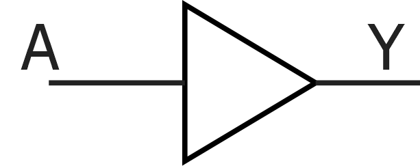

|Input|Output|
|-----|------|
|A|Y|

|A|Y|
|---|---|
|0|0|
|1|1|

### FCINT\_BUFF

Name special Buffer, used to initialize the FCI pin of the first macro in the Carry-Chain.

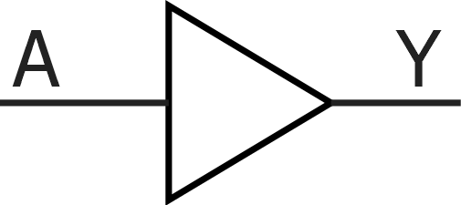

|  Input |  Output |
|----------------------------------------------|-----------------------------------------------|
|  A |  Y |

|A|Y|
|---|---|
|0|0|
|1|1|

## RCOSC\_50MHZ

The RCOSC\_50MHZ oscillator is an RC oscillator that provides a  free-running clock of 50 MHz at CLKOUT.

## SYSRESET

It is a special-purpose macro. The Output POWER\_ON\_RESET\_N goes low at  power-up and when DEVRST\_N goes low.

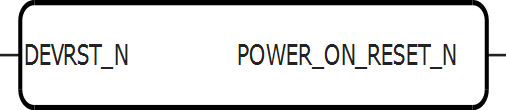

|Input|Output|
|-----|------|
|DEVRST\_N|POWER\_ON\_RESET\_N|

|DEVRST\_N|POWER\_ON\_RESET\_N|
|---------|-------------------|
|0|0|
|1|1|

## SYSCTRL\_RESET\_STATUS

This special-purpose macro checks the status of the System Controller. The output port RESET\_STATUS goes high when the System Controller is in reset. To enable this macro, select the "**Enable System Controller Suspend Mode**" option in the "**__Configure Programming Bitstream Settings__**" tool in Libero. After programming, the device enters System Controller Suspend Mode if TRSTB is tied low during power-up.

**Important:** This macro does not support simulation. To simulate the System Controller suspend mode, add the following pseudo-code to the simulation testbench:

-   At simulation time t = 0, set `RESET_STATUS` = 0.
-   1.46 µs after observing `POWER_ON_RESET_N` = 1, set `RESET_STATUS` = 1 to indicate that the system controller has entered suspend mode.

## DFN1

D-Type Flip-Flop.

|Input|Output|
|-----|------|
|D, CLK|Q|

|CLK|D|Qn+1|
|---|---|----|
|not Rising|X|Qn|
|—|D|D|

## DFN1C0

D-Type Flip-Flop with active-low Clear.

|Input|Output|
|-----|------|
|D, CLK, CLR|Q|

|CLR|CLK|D|Qn+1|
|---|---|---|----|
|0|X|X|0|
|1|not Rising|X|Qn|
|1|—|D|D|

## DFN1E1

D-Type Flip-Flop with active high Enable.

 

 

|Input|Output|
|-----|------|
|D, E, CLK|Q|

|E|CLK|D|Qn+1|
|---|---|---|----|
|0|X|X|Qn|
|1|not Rising|X|Qn|
|1|—|D|D|

## DFN1E1C0

D-Type Flip-Flop, with active-high Enable and active-low Clear.

|Input|Output|
|-----|------|
|CLR, D, E, CLK|Q|

|CLR|E|CLK|D|Qn+1|
|---|---|---|---|----|
|0|X|X|X|0|
|1|0|X|X|Qn|
|1|1|not Rising|X|Qn|
|1|1|—|D|D|

## DFN1E1P0

D-Type Flip-Flop with active-high Enable and active-low Preset.

|Input|Output|
|-----|------|
|D, E, PRE, CLK|Q|

|PRE|E|CLK|D|Qn+1|
|---|---|---|---|----|
|0|X|X|X|1|
|1|0|X|X|Qn|
|1|1|not Rising|X|Qn|
|1|1|↑|D|D|

## DFN1P0

D-Type Flip-Flop with active-Low Preset.

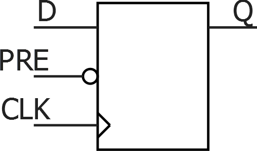

|Input|Output|
|-----|------|
|D, PRE, CLK|Q|

|PRE|CLK|D|Qn+1|
|---|---|---|----|
|0|X|X|1|
|1|not Rising|X|Qn|
|1|—|D|D|

