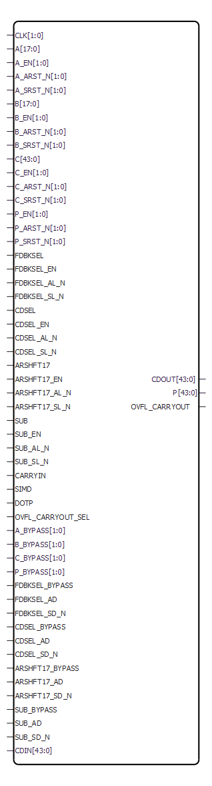

# MACC

18 bit x 18 bit multiply-accumulate MACC block.

The MACC block can accumulate the current multiplication product with a  previous result, a constant, a dynamic value, or a result from another MACC block. Each  MACC block can also be configured to perform a Dot-product operation. All the signals of  the MACC block \(except CDIN and CDOUT\) have optional registers.

<table id="ID-000004E5"><thead><tr id="ID-000004F1"><th id="ID-000004F2">

Port Name

</th><th id="ID-000004F4">

Direction

</th><th id="ID-000004F6">

Type

</th><th id="ID-000004F8">

Polarity

</th><th id="ID-000004FA">

Description

</th></tr></thead><tbody><tr id="ID-000004FD"><td id="ID-000004FE">

DOTP

</td><td id="ID-00000500">

Input

</td><td id="ID-00000502">

Static

</td><td id="ID-00000504">

High

</td><td id="ID-00000506">

Dot-product mode.When DOTP = 1, MACC block performs Dot-product of two pairs of  9-bit operands.When DOTP = 0, it is called  the normal mode.

</td></tr><tr id="ID-0000050A"><td id="ID-0000050B">

SIMD

</td><td id="ID-0000050D">

Input

</td><td id="ID-0000050F">

Static

</td><td id="ID-00000511">

—

</td><td id="ID-00000513">

Reserved. Must be 0.

</td></tr><tr id="ID-00000518"><td id="ID-00000519">

CLK\[1:0\]

</td><td id="ID-0000051C">

Input

</td><td id="ID-0000051E">

Dynamic

</td><td id="ID-00000520">

Rising edge

</td><td id="ID-00000522">

Input clocks:-   CLK\[1\] is the clock for A\[17:9\], B\[17:9\], C\[43:18\], P\[43:18\], OVFL\_CARRYOUT, ARSHFT17, CDSEL, FDBKSEL and SUB registers.
-   CLK\[0\] is the clock for A\[8:0\], B\[8:0\], C\[17:0\], CARRYIN and P\[17:0\].

In normal mode,  ensure CLK\[1\] = CLK\[0\].

</td></tr><tr id="ID-0000052C"><td id="ID-0000052D">

A\[17:0\]

</td><td id="ID-00000530">

Input

</td><td id="ID-00000532">

Dynamic

</td><td id="ID-00000534">

High

</td><td id="ID-00000536">

Input data A.

</td></tr><tr id="ID-00000538"><td id="ID-00000539">

A\_BYPASS\[1:0\]

</td><td id="ID-0000053B">

Input

</td><td id="ID-0000053D">

Static

</td><td id="ID-0000053F">

High

</td><td id="ID-00000541">

Bypass data A registers:-   A\_BYPASS\[1\] is for A\[17:9\]. Connect to 1, if not registered.
-   A\_BYPASS\[0\] is for A\[8:0\]. Connect to 1, if not registered.

In normal mode, ensure  
A\_BYPASS\[0\] = A\_BYPASS\[1\].

</td></tr><tr id="ID-00000548"><td id="ID-00000549">

A\_ARST\_N\[1:0\]

</td><td id="ID-0000054B">

Input

</td><td id="ID-0000054D">

Dynamic

</td><td id="ID-0000054F">

Low

</td><td id="ID-00000551">

Asynchronous reset for data A  registers:-   A\_ARST\_N\[1\] is for A\[17:9\]. Connect to 1, if not registered.
-   A\_ARST\_N\[0\] is for A\[8:0\]. Connect to 1, if not registered.

In normal mode, ensure  
A\_ARST\_N\[1\] = A\_ARST\_N\[0\].

</td></tr><tr id="ID-00000558"><td id="ID-00000559">

A\_SRST\_N\[1:0\]

</td><td id="ID-0000055B">

Input

</td><td id="ID-0000055D">

Dynamic

</td><td id="ID-0000055F">

Low

</td><td id="ID-00000561">

Synchronous reset for data A  registers:-   A\_SRST\_N\[1\] is for A\[17:9\]. Connect to 1, if not registered.
-   A\_SRST\_N\[0\] is for A\[8:0\]. Connect to 1, if not registered.

In normal mode, ensure  
A\_SRST\_N\[1\] = A\_SRST\_N\[0\].

</td></tr><tr id="ID-00000568"><td id="ID-00000569">

A\_EN\[1:0\]

</td><td id="ID-0000056B">

Input

</td><td id="ID-0000056D">

Dynamic

</td><td id="ID-0000056F">

High

</td><td id="ID-00000571">

Enable for data A registers:-   A\_EN\[1\] is for A\[17:9\]. Connect to 1, if not registered.
-   A\_EN\[0\] is for A\[8:0\]. Connect to 1, if not registered.

In normal mode, ensure  A\_EN\[1\] = A\_EN\[0\].

</td></tr><tr id="ID-0000057B"><td id="ID-0000057C">

B\[17:0\]

</td><td id="ID-0000057F">

Input

</td><td id="ID-00000581">

Dynamic

</td><td id="ID-00000583">

High

</td><td id="ID-00000585">

Input data B.

</td></tr><tr id="ID-00000587"><td id="ID-00000588">

B\_BYPASS\[1:0\]

</td><td id="ID-0000058A">

Input

</td><td id="ID-0000058C">

Static

</td><td id="ID-0000058E">

High

</td><td id="ID-00000590">

Bypass data B registers:-   B\_BYPASS\[1\] is for B\[17:9\]. Connect to 1, if not registered.
-   B\_BYPASS\[0\] is for B\[8:0\]. Connect to 1, if not registered.

In normal mode, ensure  
B\_BYPASS\[0\] = B\_BYPASS\[1\].

</td></tr><tr id="ID-00000597"><td id="ID-00000598">

B\_ARST\_N\[1:0\]

</td><td id="ID-0000059A">

Input

</td><td id="ID-0000059C">

Dynamic

</td><td id="ID-0000059E">

Low

</td><td id="ID-000005A0">

Asynchronous reset for data B  registers:-   B\_ARST\_N\[1\] is for B\[17:9\]. Connect to 1, if not registered.
-   B\_ARST\_N\[0\] is for B\[8:0\]. Connect to 1, if not registered.

In normal mode, ensure  
B\_ARST\_N\[1\] = B\_ARST\_N\[0\].

</td></tr><tr id="ID-000005A7"><td id="ID-000005A8">

B\_SRST\_N\[1:0\]

</td><td id="ID-000005AA">

Input

</td><td id="ID-000005AC">

Dynamic

</td><td id="ID-000005AE">

Low

</td><td id="ID-000005B0">

Synchronous reset for data B  registers:-   B\_SRST\_N\[1\] is for B\[17:9\]. Connect to 1, if not registered.
-   B\_SRST\_N\[0\] is for B\[8:0\]. Connect to 1, if not registered.

In normal mode, ensure  
B\_SRST\_N\[1\] = B\_SRST\_N\[0\].

</td></tr><tr id="ID-000005B7"><td id="ID-000005B8">

B\_EN\[1:0\]

</td><td id="ID-000005BA">

Input

</td><td id="ID-000005BC">

Dynamic

</td><td id="ID-000005BE">

High

</td><td id="ID-000005C0">

Enable for data B registers:-   B\_EN\[1\] is for B\[17:9\]. Connect to 1, if not registered.
-   B\_EN\[0\] is for B\[8:0\]. Connect to 1, if not registered.

In normal mode, ensure  B\_EN\[1\] = B\_EN\[0\].

</td></tr><tr id="ID-000005CA"><td id="ID-000005CB">

P\[43:0\]

</td><td id="ID-000005CE">

Output

</td><td id="ID-000005D0">

—

</td><td id="ID-000005D2">

High

</td><td id="ID-000005D4">

Result data.Normal  mode:-   P = D + \(CARRYIN + C\) + \(A \* B\), when SUB = 0
-   P = D + \(CARRYIN + C\) - \(A \* B\), when SUB = 1

Dot-product mode

-   P = D + \(CARRYIN + C\) + 512 \* \(\(AL \* BH\) + \(AH \* BL\)\), when SUB = 0
-   P = D + \(CARRYIN + C\) - 512 \* \(\(AL \* BH\) + \(AH \* BL\)\), when SUB = 1

Notation:

-   AL = A\[8:0\], AH = A\[17:9\]
-   BL = B\[8:0\], BH = B\[17:9\]

See  [Table   4](GUID-D4919C34-BFFC-4D49-9E83-2F028F32D5EF.md#ID-00000975) to see how  operand D is obtained from P, CDIN or 0.

</td></tr><tr id="ID-000005F3"><td id="ID-000005F4">

OVFL\_CARRYOUT

</td><td id="ID-000005F6">

Output

</td><td id="ID-000005F8">

—

</td><td id="ID-000005FA">

High

</td><td id="ID-000005FC">

Overflow or CarryOut:-   Overflow when OVFL\_CARRYOUT\_SEL = 0 
OVFL\_CARRYOUT = \(SUM\[45\] ^ SUM\[44\]\) \| \(SUM\[44\] ^ SUM\[43\]\)
-   CarryOut when OVFL\_CARRYOUT\_SEL = 1 
OVFL\_CARRYOUT = C\[43\] ^ D\[43\] ^ SUM\[44\]

</td></tr><tr id="ID-00000602"><td id="ID-00000603">

P\_BYPASS\[1:0\]

</td><td id="ID-00000605">

Input

</td><td id="ID-00000607">

Static

</td><td id="ID-00000609">

High

</td><td id="ID-0000060B">

Bypass result P registers:-   P\_BYPASS\[1\] is for P\[43:18\] and OVFL\_CARRYOUT. Connect to 1, if not registered.
-   P\_BYPASS\[0\] is for P\[17:0\]. Connect to 1, if not registered.

In normal mode, ensure  
P\_BYPASS\[0\] = P\_BYPASS\[1\].

</td></tr><tr id="ID-00000612"><td id="ID-00000613">

P\_ARST\_N\[1:0\]

</td><td id="ID-00000615">

Input

</td><td id="ID-00000617">

Dynamic

</td><td id="ID-00000619">

Low

</td><td id="ID-0000061B">

Asynchronous reset for result P  registers:-   P\_ARST\_N\[1\] is for P\[43:18\] and OVFL\_CARRYOUT. Connect to 1, if not registered.
-   P\_ARST\_N\[0\] is for P\[17:0\]. Connect to 1, if not registered.

In normal mode, ensure  
P\_ARST\_N\[1\] = P\_ARST\_N\[0\].

</td></tr><tr id="ID-00000622"><td id="ID-00000623">

P\_SRST\_N\[1:0\]

</td><td id="ID-00000625">

Input

</td><td id="ID-00000627">

Dynamic

</td><td id="ID-00000629">

Low

</td><td id="ID-0000062B">

Synchronous reset for result P  registers:-   P\_SRST\_N\[1\] is for P\[43:18\] and OVFL\_CARRYOUT. Connect to 1, if not registered.
-   P\_SRST\_N\[0\] is for P\[17:0\]. Connect to 1, if not registered.

In normal mode, ensure  
P\_SRST\_N\[1\] = P\_SRST\_N\[0\].

</td></tr><tr id="ID-00000632"><td id="ID-00000633">

P\_EN\[1:0\]

</td><td id="ID-00000635">

Input

</td><td id="ID-00000637">

Dynamic

</td><td id="ID-00000639">

High

</td><td id="ID-0000063B">

Enable for result P registers:-   P\_EN\[1\] is for P\[43:18\] and OVFL\_CARRYOUT. Connect to 1, if not registered.
-   P\_EN\[0\] is for P\[17:0\]. Connect to 1, if not registered.

In normal mode, ensure  P\_EN\[1\] = P\_EN\[0\].

</td></tr><tr id="ID-00000645"><td id="ID-00000646">

CDOUT\[43:0\]

</td><td id="ID-00000649">

Output

</td><td id="ID-0000064B">

Cascade

</td><td id="ID-0000064D">

High

</td><td id="ID-0000064F">

Cascade output of result P.CDOUT is the same as P. The entire bus must either  be dangling or drive an entire CDIN of another MACC block in  cascaded mode.

</td></tr><tr id="ID-00000655"><td id="ID-00000656">

CARRYIN

</td><td id="ID-00000658">

Input

</td><td id="ID-0000065A">

Dynamic

</td><td id="ID-0000065C">

High

</td><td id="ID-0000065E">

CarryIn for operand C.

</td></tr><tr id="ID-00000660"><td id="ID-00000661">

C\[43:0\]

</td><td id="ID-00000664">

Input

</td><td id="ID-00000666">

Dynamic

</td><td id="ID-00000668">

High

</td><td id="ID-0000066A">

Routed input for operand C.In Dot-product mode, connect C\[8:0\] to the  CARRYIN.

</td></tr><tr id="ID-0000066D"><td id="ID-0000066E">

C\_BYPASS\[1:0\]

</td><td id="ID-00000670">

Input

</td><td id="ID-00000672">

Static

</td><td id="ID-00000674">

High

</td><td id="ID-00000676">

Bypass data C registers:-   C\_BYPASS\[1\] is for C\[43:18\]. Connect to 1, if not registered.
-   C\_BYPASS\[0\] is for C\[17:0\] and CARRYIN. Connect to 1, if not registered.

In normal mode,  ensure 
C\_BYPASS\[0\] = C\_BYPASS\[1\].

</td></tr><tr id="ID-0000067D"><td id="ID-0000067E">

C\_ARST\_N\[1:0\]

</td><td id="ID-00000680">

Input

</td><td id="ID-00000682">

Dynamic

</td><td id="ID-00000684">

Low

</td><td id="ID-00000686">

Asynchronous reset for data C  registers:-   C\_ARST\_N\[1\] is for C\[43:18\] . Connect to 1, if not registered.
-   C\_ARST\_N\[0\] is for C\[17:0\] and CARRYIN. Connect to 1, if not registered.

In normal mode,  ensure 
C\_ARST\_N\[1\] = C\_ARST\_N\[0\].

</td></tr><tr id="ID-0000068D"><td id="ID-0000068E">

C\_SRST\_N\[1:0\]

</td><td id="ID-00000690">

Input

</td><td id="ID-00000692">

Dynamic

</td><td id="ID-00000694">

Low

</td><td id="ID-00000696">

Synchronous reset for data C  registers:-   C\_SRST\_N\[1\] is for C\[43:18\]. Connect to 1, if not registered.
-   C\_SRST\_N\[0\] is for C\[17:0\] and CARRYIN. Connect to 1, if not registered.

In normal mode,  ensure 
C\_SRST\_N\[1\] = C\_SRST\_N\[0\].

</td></tr><tr id="ID-0000069D"><td id="ID-0000069E">

C\_EN\[1:0\]

</td><td id="ID-000006A0">

Input

</td><td id="ID-000006A2">

Dynamic

</td><td id="ID-000006A4">

High

</td><td id="ID-000006A6">

Enable for data C registers:-   C\_EN\[1\] is for C\[43:18\]. Connect to 1, if not registered.
-   C\_EN\[0\] is for C\[17:0\] and CARRYIN. Connect to 1, if not registered.

In normal mode, ensure  C\_EN\[1\] = C\_EN\[0\].

</td></tr><tr id="ID-000006AD"><td id="ID-000006AE">

CDIN\[43:0\]

</td><td id="ID-000006B0">

Input

</td><td id="ID-000006B2">

Cascade

</td><td id="ID-000006B4">

High

</td><td id="ID-000006B6">

Cascaded input for operand D.The entire bus must be driven by an entire CDOUT of  another MACC block. In Dot-product mode the CDOUT must also be  generated by a MACC block in Dot-product mode.See Table   4 to  see how CDIN is propagated to operand D.

</td></tr><tr id="ID-000006BE"><td id="ID-000006BF">

ARSHFT17

</td><td id="ID-000006C1">

Input

</td><td id="ID-000006C3">

Dynamic

</td><td id="ID-000006C5">

High

</td><td id="ID-000006C7">

Arithmetic right-shift for operand D.When asserted, a 17-bit arithmetic right-shift is  performed on operand D going into the accumulator.See Table   4 to  see how operand D is obtained from P, CDIN or 0.

</td></tr><tr id="ID-000006CC"><td id="ID-000006CD">

ARSHFT17\_BYPASS

</td><td id="ID-000006CF">

Input

</td><td id="ID-000006D1">

Static

</td><td id="ID-000006D3">

High

</td><td id="ID-000006D5">

Bypass ARSHFT17 register. Connect to 1,  if not registered.

</td></tr><tr id="ID-000006D7"><td id="ID-000006D8">

ARSHFT17\_AL\_N

</td><td id="ID-000006DA">

Input

</td><td id="ID-000006DC">

Dynamic

</td><td id="ID-000006DE">

Low

</td><td id="ID-000006E0">

Asynchronous load for ARSHFT17  register. Connect to 1, if not registered.When  asserted, ARSHFT17 register is loaded with ARSHFT17\_AD.

</td></tr><tr id="ID-000006E3"><td id="ID-000006E4">

ARSHFT17\_AD

</td><td id="ID-000006E6">

Input

</td><td id="ID-000006E8">

Static

</td><td id="ID-000006EA">

High

</td><td id="ID-000006EC">

Asynchronous load data for ARSHFT17  register.

</td></tr><tr id="ID-000006EE"><td id="ID-000006EF">

ARSHFT17\_SL\_N

</td><td id="ID-000006F1">

Input

</td><td id="ID-000006F3">

Dynamic

</td><td id="ID-000006F5">

Low

</td><td id="ID-000006F7">

Synchronous load for ARSHFT17 register.  Connect to 1, if not registered. See [Table   2](GUID-D4919C34-BFFC-4D49-9E83-2F028F32D5EF.md#ID-00000816).

</td></tr><tr id="ID-000006FA"><td id="ID-000006FB">

ARSHFT17\_SD\_N

</td><td id="ID-000006FD">

Input

</td><td id="ID-000006FF">

Static

</td><td id="ID-00000701">

Low

</td><td id="ID-00000703">

Synchronous load data for ARSHFT17  register. See [Table   2](GUID-D4919C34-BFFC-4D49-9E83-2F028F32D5EF.md#ID-00000816).

</td></tr><tr id="ID-00000706"><td id="ID-00000707">

ARSHFT17\_EN

</td><td id="ID-00000709">

Input

</td><td id="ID-0000070B">

Dynamic

</td><td id="ID-0000070D">

High

</td><td id="ID-0000070F">

Enable for ARSHFT17 register. Connect  to 1, if not registered. See [Table   2](GUID-D4919C34-BFFC-4D49-9E83-2F028F32D5EF.md#ID-00000816).

</td></tr><tr id="ID-00000712"><td id="ID-00000713" colspan="5">

 

</td></tr><tr id="ID-00000715"><td id="ID-00000716">

CDSEL

</td><td id="ID-00000718">

Input

</td><td id="ID-0000071A">

Dynamic

</td><td id="ID-0000071C">

High

</td><td id="ID-0000071E">

Select CDIN for operand D.When CDSEL = 1, propagate CDIN.When CDSEL = 0, propagate 0 or P depending on  FDBKSEL.See Table   2 to see how operand D is obtained from P,  CDIN or 0.

</td></tr><tr id="ID-00000724"><td id="ID-00000725">

CDSEL\_BYPASS

</td><td id="ID-00000727">

Input

</td><td id="ID-00000729">

Static

</td><td id="ID-0000072B">

High

</td><td id="ID-0000072D">

Bypass CDSEL register. Connect to 1, if  not registered.

</td></tr><tr id="ID-0000072F"><td id="ID-00000730">

CDSEL\_AL\_N

</td><td id="ID-00000732">

Input

</td><td id="ID-00000734">

Dynamic

</td><td id="ID-00000736">

Low

</td><td id="ID-00000738">

Asynchronous load for CDSEL register.  Connect to 1, if not registered.When asserted, CDSEL  register is loaded with CDSEL\_AD.

</td></tr><tr id="ID-0000073B"><td id="ID-0000073C">

CDSEL\_AD

</td><td id="ID-0000073E">

Input

</td><td id="ID-00000740">

Static

</td><td id="ID-00000742">

High

</td><td id="ID-00000744">

Asynchronous load data for CDSEL  register.

</td></tr><tr id="ID-00000746"><td id="ID-00000747">

CDSEL\_SL\_N

</td><td id="ID-00000749">

Input

</td><td id="ID-0000074B">

Dynamic

</td><td id="ID-0000074D">

Low

</td><td id="ID-0000074F">

Synchronous load for CDSEL register.  Connect to 1, if not registered. See [Table   2](GUID-D4919C34-BFFC-4D49-9E83-2F028F32D5EF.md#ID-00000816).

</td></tr><tr id="ID-00000752"><td id="ID-00000753">

CDSEL\_SD\_N

</td><td id="ID-00000755">

Input

</td><td id="ID-00000757">

Static

</td><td id="ID-00000759">

Low

</td><td id="ID-0000075B">

Synchronous load data for CDSEL  register. See [Table   2](GUID-D4919C34-BFFC-4D49-9E83-2F028F32D5EF.md#ID-00000816).

</td></tr><tr id="ID-0000075E"><td id="ID-0000075F">

CDSEL\_EN

</td><td id="ID-00000761">

Input

</td><td id="ID-00000763">

Dynamic

</td><td id="ID-00000765">

High

</td><td id="ID-00000767">

Enable for CDSEL register. Connect to  1, if not registered. See [Table   2](GUID-D4919C34-BFFC-4D49-9E83-2F028F32D5EF.md#ID-00000816).

</td></tr><tr id="ID-0000076D"><td id="ID-0000076E">

FDBKSEL

</td><td id="ID-00000770">

Input

</td><td id="ID-00000772">

Dynamic

</td><td id="ID-00000774">

High

</td><td id="ID-00000776">

Select the feedback from P for operand  D.When FDBKSEL = 1, propagate the current value  of result P register. Ensure P\_BYPASS\[1\] = 0 and CDSEL = 0.When FDBKSEL = 0, propagate 0. Ensure CDSEL =  0.See Table   4 to see how operand D is obtained from P,  CDIN or 0.

</td></tr><tr id="ID-0000077C"><td id="ID-0000077D">

FDBKSEL\_BYPASS

</td><td id="ID-0000077F">

Input

</td><td id="ID-00000781">

Static

</td><td id="ID-00000783">

High

</td><td id="ID-00000785">

Bypass FDBKSEL register. Connect to 1,  if not registered.

</td></tr><tr id="ID-00000787"><td id="ID-00000788">

FDBKSEL\_AL\_N

</td><td id="ID-0000078A">

Input

</td><td id="ID-0000078C">

Dynamic

</td><td id="ID-0000078E">

Low

</td><td id="ID-00000790">

Asynchronous load for FDBKSEL register.  Connect to 1, if not registered.When asserted,  FDBKSEL register is loaded with FDBKSEL\_AD.

</td></tr><tr id="ID-00000793"><td id="ID-00000794">

FDBKSEL\_AD

</td><td id="ID-00000796">

Input

</td><td id="ID-00000798">

Static

</td><td id="ID-0000079A">

High

</td><td id="ID-0000079C">

Asynchronous load data for FDBKSEL  register.

</td></tr><tr id="ID-0000079E"><td id="ID-0000079F">

FDBKSEL\_SL\_N

</td><td id="ID-000007A1">

Input

</td><td id="ID-000007A3">

Dynamic

</td><td id="ID-000007A5">

Low

</td><td id="ID-000007A7">

Synchronous load for FDBKSEL register.  Connect to 1, if not registered. See [Table   2](GUID-D4919C34-BFFC-4D49-9E83-2F028F32D5EF.md#ID-00000816).

</td></tr><tr id="ID-000007AA"><td id="ID-000007AB">

FDBKSEL\_SD\_N

</td><td id="ID-000007AD">

Input

</td><td id="ID-000007AF">

Static

</td><td id="ID-000007B1">

Low

</td><td id="ID-000007B3">

Synchronous load data for FDBKSEL  register. See [Table   2](GUID-D4919C34-BFFC-4D49-9E83-2F028F32D5EF.md#ID-00000816).

</td></tr><tr id="ID-000007B6"><td id="ID-000007B7">

FDBKSEL\_EN

</td><td id="ID-000007B9">

Input

</td><td id="ID-000007BB">

Dynamic

</td><td id="ID-000007BD">

High

</td><td id="ID-000007BF">

Enable for FDBKSEL register. Connect to  1, if not registered. See [Table   2](GUID-D4919C34-BFFC-4D49-9E83-2F028F32D5EF.md#ID-00000816).

</td></tr><tr id="ID-000007C5"><td id="ID-000007C6">

SUB

</td><td id="ID-000007C8">

Input

</td><td id="ID-000007CA">

Dynamic

</td><td id="ID-000007CC">

High

</td><td id="ID-000007CE">

Subtract operation.

</td></tr><tr id="ID-000007D0"><td id="ID-000007D1">

SUB\_BYPASS

</td><td id="ID-000007D3">

Input

</td><td id="ID-000007D5">

Static

</td><td id="ID-000007D7">

High

</td><td id="ID-000007D9">

Bypass SUB register. Connect to 1, if  not registered.

</td></tr><tr id="ID-000007DB"><td id="ID-000007DC">

SUB\_AL\_N

</td><td id="ID-000007DE">

Input

</td><td id="ID-000007E0">

Dynamic

</td><td id="ID-000007E2">

Low

</td><td id="ID-000007E4">

Asynchronous load for SUB register.  Connect to 1, if not registered.When asserted, SUB  register is loaded with SUB\_AD.

</td></tr><tr id="ID-000007E7"><td id="ID-000007E8">

SUB\_AD

</td><td id="ID-000007EA">

Input

</td><td id="ID-000007EC">

Static

</td><td id="ID-000007EE">

High

</td><td id="ID-000007F0">

Asynchronous load data for SUB  register.

</td></tr><tr id="ID-000007F2"><td id="ID-000007F3">

SUB\_SL\_N

</td><td id="ID-000007F5">

Input

</td><td id="ID-000007F7">

Dynamic

</td><td id="ID-000007F9">

Low

</td><td id="ID-000007FB">

Synchronous load for SUB register.  Connect to 1, if not registered. See [Table   2](GUID-D4919C34-BFFC-4D49-9E83-2F028F32D5EF.md#ID-00000816).

</td></tr><tr id="ID-000007FE"><td id="ID-000007FF">

SUB\_SD\_N

</td><td id="ID-00000801">

Input

</td><td id="ID-00000803">

Static

</td><td id="ID-00000805">

Low

</td><td id="ID-00000807">

Synchronous load data for SUB register.  See [Table   2](GUID-D4919C34-BFFC-4D49-9E83-2F028F32D5EF.md#ID-00000816).

</td></tr><tr id="ID-0000080A"><td id="ID-0000080B">

SUB\_EN

</td><td id="ID-0000080D">

Input

</td><td id="ID-0000080F">

Dynamic

</td><td id="ID-00000811">

High

</td><td id="ID-00000813">

Enable for SUB register. Connect to 1,  if not registered. See [Table   2](GUID-D4919C34-BFFC-4D49-9E83-2F028F32D5EF.md#ID-00000816).

</td></tr></tbody>
</table>|\_AL\_N|\_AD|\_BYPASS|\_CLK|\_EN|\_SL\_N|\_SD\_N|D|Qn+1|
|-------|----|--------|-----|----|-------|-------|---|----|
|0|AD|X|X|X|X|X|X|AD|
|1|X|0|Not rising|X|X|X|X|Qn|
|1|X|0|—|0|X|X|X|Qn|
|1|X|0|—|1|0|SDn|X|!SDn|
|1|X|0|—|1|1|X|D|D|
|1|X|1|X|0|X|X|X|Qn|
|1|X|1|X|1|0|SDn|X|!SDn|
|1|X|1|X|1|1|X|D|D|

|\_ARST\_N|\_BYPASS|\_CLK|\_EN|\_SRST\_N|D|Qn+1|
|---------|--------|-----|----|---------|---|----|
|0|X|X|X|X|X|0|
|1|0|Not rising|X|X|X|Qn|
|1|0|—|0|X|X|Qn|
|1|0|—|1|0|X|0|
|1|0|—|1|1|D|D|
|1|1|X|0|X|X|Qn|
|1|1|X|1|0|X|0|
|1|1|X|1|1|D|D|

|FDBKSEL|CDSEL|ARSHFT17|Operand D|
|-------|-----|--------|---------|
|0|0|x|44'b0|
|x|1|0|CDIN\[43:0\]|
|x|1|1|\{\{17\{CDIN\[43\]\}\},CDIN\[43:17\]\}|
|1|0|0|P\[43:0\]|
|1|0|1|\{\{17\{P\[43\]\}\},P\[43:17\]\}|

