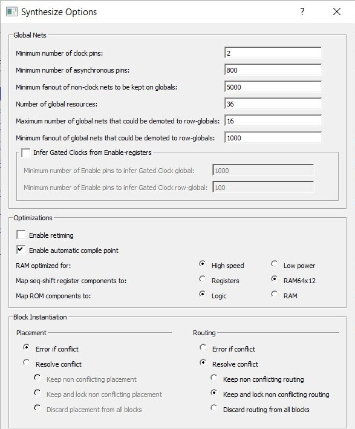

# Synthesis Options to Resolve Place and Route Conflicts

If there are multiple blocks instantiated in the top-level design, users can use the synthesis options to resolve the conflicts. These options appear only if there are blocks in the design. Use the synthesis options \(**Design Flow** &gt; **Synthesize** &gt; **Configure Options**\) to resolve place and route conflicts.

-   **[Placement](GUID-D1823ABB-2A15-4D23-82C9-E038674DE643.md)**  

-   **[Routing](GUID-78BC0557-BF67-4E9C-ABBA-85BE52DA440E.md)**  

**Parent topic:**[Resolving Place and Route Conflicts](GUID-FA0E342F-18A4-40FB-84FE-D60C549ACAB2.md)

