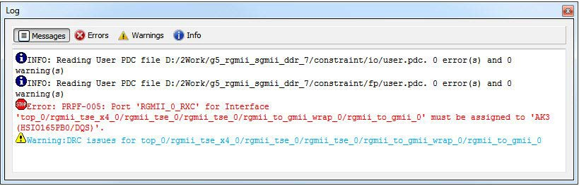

# Log Window

The Log window displays all messages generated by I/O Editor. You can filter the messages according to the type of message: Error, Warning, and Info. If you have made and saved changes in I/O Editor, the Log window displays the name and location of the PDC file\(s\) which have been edited/updated to reflect the changes.

**Parent topic:**[Other I/O Editor Windows](GUID-A5B625D0-E38D-4817-90D7-344E263F7AA6.md)

