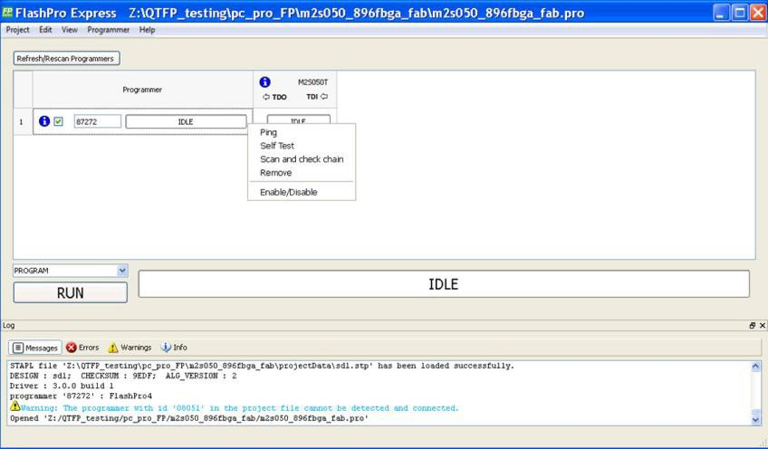
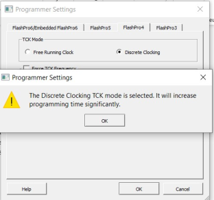
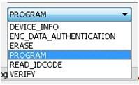

# Programmer Settings and Operations

This section describes the FlashPro Express settings and operation.

## Introduction

The FlashPro Express software allows you to connect multiple programmers to your computer. With  each programmer you select, you can perform a ping, conduct a self-test, scan and check  the chain, and remove, enable, or disable the JTAG chain, as shown in the following  figure.

## Programmer Settings

To view the Programmer Settings dialog box, in the Libero SoC Design Flow window, expand  **Configure Hardware**, double click **Configure Programmer** or right click **Configure Programmer**  and choose **Programmer Settings**.

For the JTAG interface, you can set specific voltage and force TCK frequency values for your  programmer in this dialog box. For the SPI Target interface, you can force SCK frequency  values for your programmer. SPI Target mode is supported by FlashPro5 for SmartFusion 2  and IGLOO 2 devices, and by FlashPro6 for SmartFusion 2, IGLOO 2, and PolarFire devices.  SPI Target mode is not supported for RTG4 devices. JTAG is the default interface.

The Programmer Settings dialog box includes options for FlashPro6/5/4/3/3X. Limitations of the TCK frequency for the selected programmer are:

-   FlashPro6: 1, 2, 3, 4, 5, 6, 7, 8, 9, 10, 11, 12, 13, 14, 15, 16, 17, 18, 19, 20 MHz
-   FlashPro5: 1, 2, 3, 4, 5, 6, 10, 15, 30 MHz
-   FlashPro4: 1, 2, 3, 4, 5, 6 MHz
-   FlashPro3/3X: 1, 2, 3, 4, 6 MHz TCK frequency limits by target device \(refer to the target device data sheet\)

During execution, the frequency set by the FREQUENCY statement in the PDB/STAPL file overrides the TCK frequency settings you select in the Programmer Settings dialog box, unless you also select the **Force TCK Frequency** check box.

Limitation of the SCK frequency for the selected programmer are: 1.00, 2.00, 2.50, 3.33, 4.00, 5.00, 6.67, 8.00, 10.00, 13.33, and 20.00 MHz

### FlashPro5/4/3/3X Programmer Settings

For FlashPro5/4/3/3X, if you choose the **Force TCK Frequency**,  select the appropriate MHz frequency. For FlashPro4/3X settings, you can switch the TCK  mode between a Free Running Clock and a Discrete Clocking. Use Discrete Clocking when  there is a JTAG non-compliant device in a chain with Microchip devices. After selecting,  click **OK**.

**Attention:** When the **Discrete Clocking** mode is selected, a warning pop-up appears, which states that using the Discrete Clocking TCK mode will increase the programming time significantly, as shown in the following figure.

After the pop-up is closed by the user, a warning icon with a message tooltip  appears next to the **Discrete Clocking** radio button. The icon  and the tooltip appear when the programmer settings dialog is re-opened.

#### Default Settings

-   The **Force TCK Frequency** option is unchecked to instruct the FlashPro5/4/3/3X to use the TCK frequency specified by the Frequency statement in the PDB/STAPL file\(s\).
-   The FlashPro5/4/3/3X default TCK mode setting is **Free running clock**.

### TCK Setting for Force TCK Frequency

If **Force TCK Frequency** is checked in the **Programmer Setting**, the selected TCK value  is set for the programmer and the Frequency statement in the PDB/STAPL file is  ignored.

### Default TCK Frequency

If the IPD/STAPL file or Chain does not exist, the default TCK frequency is set to 4 MHz.

If more than one Microchip flash device is targeted in the chain, the FlashPro Express software passes through all the files and searches for the "freq" keyword and the "MAX\_FREQ" **Note** field. The FlashPro Express software uses the lesser value of all the TCK frequency settings and the "MAX\_FREQ" **Note** field values.

## Ping Programmers

Right-click a programmer and choose Ping.

**Note:** To ping new programmers quickly, click the **Refresh/Rescan for Programmers** button.

## Performing a Self-Test

Before performing a self-test, connect the programmer to the self-test board that came with your  programmer. Then right-click the programmer you want to self-test and choose  **Self Test**.

**Note:** Self-test is not supported with FlashPro5/4 programmers. These programmers are tested rigorously at the factory during production.

## Scanning and Checking a Chain

The scan chain operation scans and analyzes the JTAG chain connected to programmers you selected  and checks that a scanned chain matches the chain configured in FlashPro Express.

To scan a chain, right-click the programmer you want to scan and choose **Scan and check chain**.

## Enabling and Disabling Programmers

After loading a job project, you can enable, disable, or remove a programmer, as well as  ping, self-test, run scan, and check chain on any of the connected programmers. These  actions are available in the right-click menu for each programmer in the programmer  column.

Check the check box next to a programmer in the **Programmer** column  to enable the programmer or uncheck the check box to disable the programmer.

## Renaming a Programmer

Enter a new programmer name in the Programmer window to rename the programmer. By default, the  programmer name is the same as the programmer ID.

## Removing a Programmer

To remove a programmer, right-click the programmer and choose **Remove**.

## Selecting and Running an Action

FlashPro Express supports the following programming actions:

-   DEVICE\_INFO - This action queries the device and gets the information about type and family of device, information about design programmed on the device \(if any\), the number of times the device has been programmed, information about security settings and prints out digests of various components/segments.

    **Attention:** If the erase operation is interrupted for any reason, the cycle count value is lost. However, the device can still be programmed.

-   ENC\_DATA\_AUTHENTICATION - This is visible when each device in the chain contains encrypted bit stream files. Selecting this action checks each bit stream file for authentication.
-   ERASE
-   PROGRAM - This action programs the bitstream file on the device and the resulting programming log contains information about component digests that are generated while programming the bitstream file as well as digests that are read out from device after the bitstream has been programmed. The log also contains the entire bitstream digest that has been precalculated during bitstream file generation.

    **Attention:** The component digests printed during programming differ in value and count from the digests that are read out from the device.

-   READ\_IDCODE
-   VERIFY

To select a programming action, select an action from the **Programming Action** drop-down menu in FlashPro Express, as shown in the following figure.

To run the selected programming action, click the **RUN** button below the **Programming Action** drop-down menu.

CAUTION:

Do not interrupt programming action while its running, else it might damage the part.

