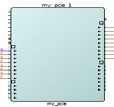
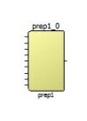
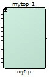
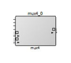
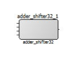
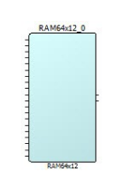

# Appendix D – Component Types

A component instance is a block-like item with pins on either side, connected to create designs. You might have multiple instances of a single component in your design. You usually have custom connections for each instance that differ from other instances of the same component.

The following table lists the component types and its diagrammatic representation in the SmartDesign canvas.

<table id="GUID-9E501813-091D-4710-9689-D859ABA03041"><thead><tr><th>

Icon

</th><th>

Types of Design Components

</th><th>

Tooltip Information

</th></tr></thead><tbody><tr><td>

</td><td>

Configured IP Core Component

</td><td>

Component: my\_pcie Core: PF\_PCIE 1.0.217

</td></tr><tr><td>

</td><td>

IP Core directly instantiated from the Catalog

</td><td>

Core: PF\_PCIE 1.0.217

</td></tr><tr><td>

</td><td>

Block Component

</td><td>

Block: prep1

</td></tr><tr><td>

</td><td>

SmartDesign Component

</td><td>

SmartDesign: mytop

</td></tr><tr><td>

  

 

</td><td>

Parameterized HDL Core Modules

</td><td>

HDL Core: mux4

</td></tr><tr><td>

  

 

</td><td>

HDL Module

</td><td>

HDL:adder\_shifter32

</td></tr><tr><td>

  

 

</td><td>

Library Macro

</td><td>

Macro: RAM64x12

</td></tr></tbody>
</table>