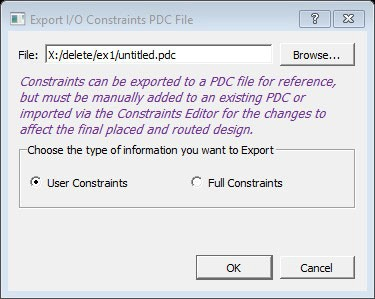
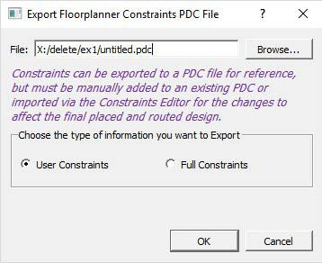

# Export Physical Constraints \(PDC\)

The I/O Editor allows you to export the physical constraints \(I/O  Constraints and Floorplan Constraints\) of the design in a PDC file to any file location on  your disk. You can export the User constraints or the Full constraints of the design. The  I/O PDC files can be exported \(**File &gt; Export Physical Constraint \(PDC\) &gt; I/O Constraint**\), as shown in the following figure.

The fp.pdc file can be exported \(**File &gt; Export Physical Constraint \(PDC\) &gt; Floorplan Constraint**\), as shown in the following  figure.

