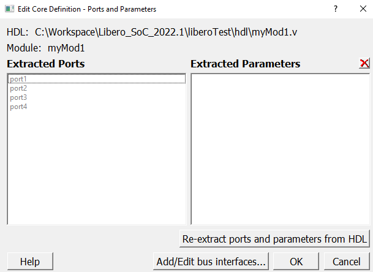
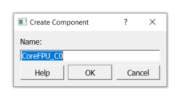
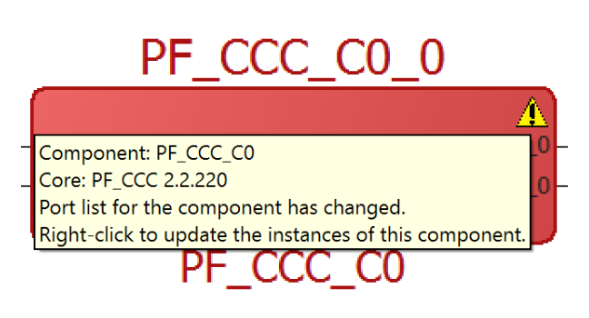

# Instantiating User HDL Modules, IP Cores, and Components in SmartDesign

You can add one or more HDL modules, building blocks, and components from the **Design Hierarchy** tab to your design. The components can be IP cores from the  **IP Catalog** tab, basic macros, design blocks, and other SmartDesign  components available from the **Components** node in the **Design Hierarchy** tree or from the **Components** tab.

## Instantiating a User HDL Module in your Design

To instantiate a user HDL source module, use either of the following procedures:

-   On the **Design Hierarchy** tab, select the user HDL module of interest, drag and drop it onto the canvas.
-   On the **Design Hierarchy** tab, right-click the user HDL module of interest and select **Instantiate in &lt;active\_SD\_name&gt;** from the right-click menu.

**Result:** The selected module is instantiated in the SmartDesign canvas.

 

**Tip:** Repeat these steps to instantiate all the user HDL source modules of interest in your SmartDesign canvas.

 

## Creating a HDL+ Core from an User HDL Source Module

To create a HDL+ core from a user HDL source module, perform the following steps:

1.  On the **Design Hierarchy** tab, right-click the user HDL file and select **Create Core from HDL** from the right-click menu. The **Edit Core Definitions – Ports and Parameters** dialog box appears.

    

2.  Specify the ports and parameters as required and click **OK**. A BIF might also be added to the HDL core. It shows up in the SmartDesign with a BIF pin that can easily connect to the compatible instance BIF pins.

**Result:** The selected user HDL module is converted to an HDL+ core and can  be instantiated in your SmartDesign canvas.

## Configuring and Instantiating Instances in your Design

You can choose to configure and instantiate the following components in your design:

-   SmartDesign component
-   IP Core components
-   User HDL cores
-   Design blocks

**Important:** Only IP core components can be configured.

### Configuring and Instantiating an IP Core Component

Microchip offers a large portfolio of configurable cores. These cores are available from the  **Catalog** tab. To instantiate an IP core component in your design, you  must first configure the component.

1.  To configure and instantiate an IP core component, use either of the following procedures:

    -   On the **Catalog** tab, select the IP core component of interest, drag and drop it onto the canvas.
    -   On the **Catalog** tab, right-click the IP core component of interest and select **Instantiate in &lt;active\_SD\_name&gt;** from the right-click menu.
    -   On the **Catalog** tab, right-click the IP core component of interest and select **Configure core** from the right-click menu.
    **Result:** The **Create Component** dialog  box appears.

    

    By default, the selected IP core’s name is displayed in the  **Name** box. You can use the next step to change the core’s name to  a name of your choice.

2.  Enter an appropriate and unique name for your core component in the **Name** box and click **OK**. The **Configurator** window appears.

    

3.  Configure the core component as per your design requirements and click **OK**.
4.  \(Optional\) To re-configure an existing component, right-click the component and choose **Configure**. The **Configurator** window appears. Proceed with step 3 to modify the existing configuration.

**Result**: The configured IP core component is made available in the  **Design Hierarchy** tab, **Components** tab, and is  instantiated in your SmartDesign canvas.

**Tip:** Repeat these steps to instantiate the necessary IP core components of interest in your SmartDesign.

**Important:** If you observe that the core component that you are looking for appears in italicized-gray color in the **Catalog** tab, it means that the core component is yet to be downloaded from the Microchip IP Core Repository to your hard disk \(vault\).

Download the core component of interest from the **Catalog** tab, in either of  the following ways.

-   Double-click the core component of interest.
-   Right-click the core component of interest and click **Download**.

**Result:**The core component of interest is downloaded from the Microchip  vault to your local vault and is made available for configuration and instantiation.

For information on the types of available core components and its color representation, see [Appendix D – Component Types](GUID-E6ED604B-36DA-4285-89F9-3AA0E053FB0A.md).

### Instantiating SmartDesign Components, User HDL Cores, and Design Blocks in your Design

To instantiate a SmartDesign component, a user HDL core, or a design block use either of the  following procedures:

-   On the **Design Hierarchy** tab, select the SmartDesign component, user HDL core, or the design block of interest, drag, and drop it onto the canvas.
-   On the **Design Hierarchy** tab, right-click the SmartDesign component, user HDL core, or the design block of interest, and select **Instantiate in &lt;active\_SD\_name&gt;** from the right-click menu.

**Result:** The selected components are instantiated in your SmartDesign.

**Tip:**

-   Repeat these steps to include the necessary SmartDesign components, user HDL cores, or design blocks of interest in your design.
-   A component is either created within the existing project or imported into the existing project. Once in the project, the method for instantiating a component in your SmartDesign is the same regardless of the component type.

## Replacing an Instance Component with a Different Component

You can choose to replace an instance\(s\) component with a different component or a different implementation while preserving the current instance’s interface \(port\) connections.

To replace an instance component with a different component, perform the following steps:

1.  Right-click the instance component and select **Replace Component** from the right-click menu. The **Replace Component for Instance\(s\)** dialog box appears.

     Dialog Box")

    The instance\(s\) section shows the following information:

    -   **All Instances**: Lists all instances of the component.
    -   **Selected Instance**: Shows the selected instance that will be replaced with the new component.
    -   **Component**: The component of the selected instance.
2.  From the **New Component** dropdown list, select the replacement component of your choice.
3.  By default, the **Replace all instances using &lt;component\_name&gt; with new selected component**option is selected. When this option is selected, every instance of the selected component in the current design \(the list of instances shown under the **All Instances** group\) are replaced with the new component specified in step 2.

**Important:**

-   As a result of the replace action, if the instance port list changes, then some pins connections might be dropped. The information related to the dropped pins connection in printed in the **Log** window.
-   If the **Replace all instances using &lt;component\_name&gt; with new selected component**option is deselected, only the selected instance is replaced in the design.
-   If you select an instance and click **OK**for a non-valid component, the dialog box closes automatically, and an error message is printed in the **Log** window.

## Updating a Component Core Version

The **Update Component Version** functionality enables you to update a  component of an instance with another version. You can restore or update your component  without creating a new instance or losing your connections.

1.  You can update a component version in your design in either of the following ways:

    -   On the **Design Hierarchy** tab, right-click the component and select **Update Component Version** from the right-click menu.
    -   On the SmartDesign canvas, right-click the component and select **Update Component Version** from the right-click menu.
    **Result:** The **Update Component Version**dialog box appears.

    

2.  The **Change to version** dropdown list contains all the versions of the selected core available in the vault. In the **Change to version** dropdown box, select the version you want to upgrade to and click **OK**.

    **Result:** The core is automatically  downloaded to the vault if it does not already exist in the vault. If the core exists in  the vault, the component in the SmartDesign canvas is upgraded with the selected  version.

**Important:** You cannot upgrade to a different version of the core that is not in your vault and if the vault is read-only.

## Updating the Component Instance Port List

When the lower-level component port list is modified, the higher-level component is highlighted  in red color and an exclamation symbol in shown within a red colored triangle at the top right  corner of the component as shown in the following figure. This means that the instance port  list needs to be updated.

Perform the following steps in the recommended order when the port list of the lower-level component is modified:

1.  Go to the next higher-level of the design hierarchy containing lower-port modifications.
2.  Right-click the lower-level component and select **Update Instance** from the right-click menu.
3.  Generate the higher-level component in which the instance is updated.

**Result:**The red colored triangle at the top right corner of the component disappears if the  component update is successful.

## Performing Additional Operations on Components

When one or more instances are selected, you can use the right-click menu to perform the  following operations.

**Note:** Some operations are applicable only on a single instance.

<table id="GUID-497982FE-D88F-443B-89D1-C4D31457C4D0"><thead><tr><th>

Operation

</th><th>

Action

</th></tr></thead><tbody><tr><td>

**Configure**

</td><td>

If the selected instance is a configured core component or parametrized HDL core,  the **Configure**option opens the **Configurator**dialog box for the core to be configured.If the instance is a  SmartDesign component, the Configure option brings up the  SmartDesign canvas for edits.If the selected instance is an HDL module, the  Configure option brings up the HDL code editor to edit the  instance module. The configure operation is equivalent to double-clicking the  instance. The Configure option is available only when a  single instance is selected.For more information, see Instantiating SmartDesign Components, User HDL Cores, and Design Blocks in your Design 

</td></tr><tr><td>

**Modify HDL**

</td><td>

The **Modify HDL**option brings up the HDL code editor to  edit the HDL source file of the instance module. This option is available only when an  instance of an HDL core is selected.**Note:** The **Modify HDL**option is only available for HDL modules. For an HDL module, double-click the HDL component in the SmartDesign canvas or right-click the HDL component and choose **Configure** to open the HDL file in the HDL code editor.

</td></tr><tr><td>

**Replace Component**

</td><td>

The **Replace Component** option allows you to replace an  instance component with a different component or a different implementation while  preserving the current instance’s interface \(port\) connections.For more  information, see Replacing an Instance Component with a Different Component

</td></tr><tr><td>

**Update Component Version**

</td><td>

The **Update Component Version** option allows you to update a  component of an instance with another version. For more information, see Updating a Component Core Version

</td></tr><tr><td>

**Rename**

</td><td>

The **Rename** option prompts you to modify the selected  instance name. Provide a new unique name for the instance and then click  **OK.****Note:** An error message is shown in the **Log**window if the instance name does not follow the HDL naming rules.

</td></tr><tr><td>

**Delete**

</td><td>

The **Delete**option deletes the selected item. When multiple  items are selected, all of them are deleted.**Note:** Not all design objects can be deleted.

</td></tr><tr><td>

  Create Hierarchical SmartDesign and  Flatten Hierarchical SmartDesign 

</td><td>

You can choose to select one or more instances in your SmartDesign and create a  new SmartDesign out of it \(all the nets and connections from the instance are  retained\). or you can choose to flatten a hierarchical SmartDesign component.For  more information, see Working with Hierarchical SmartDesigns

</td></tr><tr><td>

**Remove Connections**

</td><td>

The **Remove Connections**option disconnects all pins that  can be disconnected from nets. Pins that cannot be disconnected \(for example, pins  connected to pads\) are logged in the **Log**window.

</td></tr><tr><td>

**Highlight**

</td><td>

The **Highlight**option opens a menu with multiple highlight  color options. Select a color of your choice and the selected instances are  highlighted with the chosen color. If any selected instances already have a different  highlight, then such instances are highlighted with the chosen new color. This option  is available when a single or multiple instances, nets, or ports are selected.If  you highlight an instance, it automatically highlights the non-highlighted pins of  the instance. Click Unhighlight all in the SmartDesign  toolbar to remove the highlight color of all highlighted design objects, including  highlighted nets. The Highlight option is also available in  the right-click menu of the low-level instances in the Expanded  Inplace view.

</td></tr><tr><td>

**Help**

</td><td>

This option brings up the handbook, the release notes, or the configuration user  guides for the core.

</td></tr></tbody>
</table>