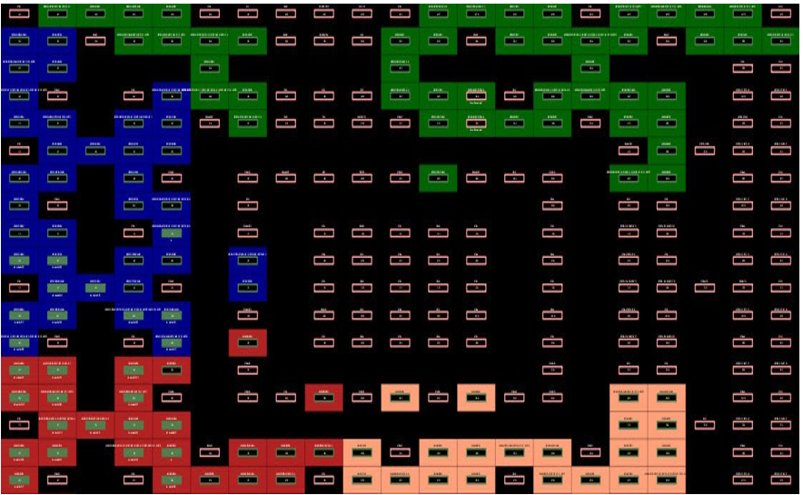

# Package View

The Package View displays the Package pin views of the particular  die/package of the PolarFire device. The color for the display of the pins are determined  by the settings in Display Options. The following figure shows the regular pins in green,  special pins in blue, reserved pins in red, and unconnected pins in grey.

