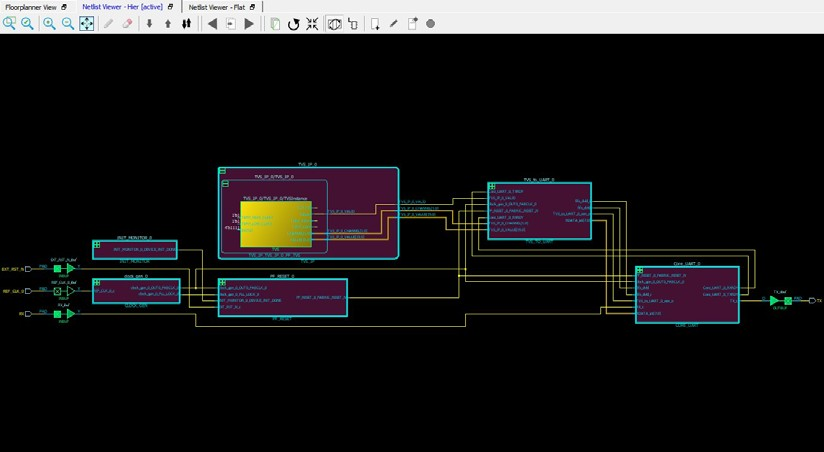
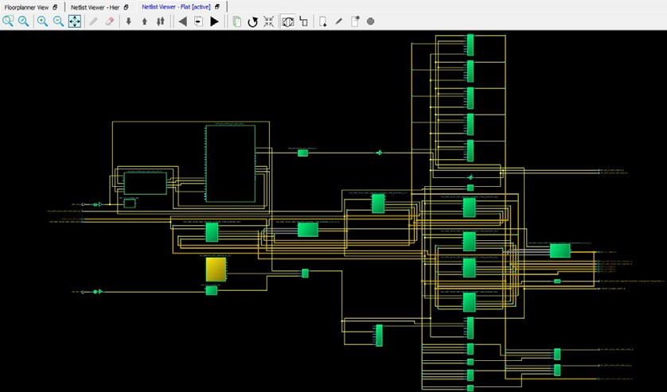
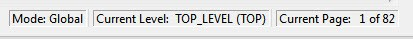

# Netlist Views

In addition to the chip view for floorplanning purposes, Chip Planner displays a schematic view of the design to make it easier to trace nets and debug the design.

Two netlist types can be displayed in the **Floorplanner View** window:

-   Post-Synthesis Hierarchical View \(**Netlist Viewer - Hier**\)
-   Post-compile flattened Netlist View \(**Netlist Viewer - Flat**\)

The **Floorplanner View** window and **Netlist Viewer - Hier** and **Netlist Viewer - Flat** tabs are  present when Chip Planner is opened.

## Netlist Viewer - Hier

The Post-Synthesis Hierarchical View \(**Netlist Viewer - Hier**\) is a hierarchical view of the netlist after synthesis and after  technology mapping to the Microchip FPGA technology. Click the **Hierarchical View** window to display this view. The Chip Planner loads the netlist into  the system memory and displays it in this window.

When the netlist loads into memory for the first time, a pop-up progress  bar shows the progress of the loading process. Load times may incur a runtime penalty for  large netlists.

## Netlist Viewer - Flat

The **Netlist Viewer - Flat** View is the flattened  \(non-hierarchical\) netlist generated after synthesis, technology mapping, and further  optimization based on the DRC rules of the device family and/or die. Click on the Canvas to  load the 'Flat' view in the **Netlist Viewer - Flat** window to display  this view. The Chip Planner loads the netlist into the system memory and displays it in  this window, as shown in the following figure.

When the netlist loads into memory for the first time, a pop-up progress  bar shows the progress of the loading process. Load times may incur a runtime penalty for  large flattened netlists.

## Display Across Multiple Pages

If a hierarchical or flattened netlist spans across multiple pages, the  first page is displayed when it opens.

The current page number and the total number of pages are shown in the  status bar at the lower right corner of the window.

**Status Bar**

To go to different pages of the Netlist view, use the left-pointing  arrow:

 

 

or the right-pointing arrow:

.

## Netlist Viewer Features

For information about the Netlist Viewer features, see the [Netlist Viewer User Guide](http://coredocs.s3.amazonaws.com/Libero/2025_1/Tool/stdalone_nlv_ug.pdf).

