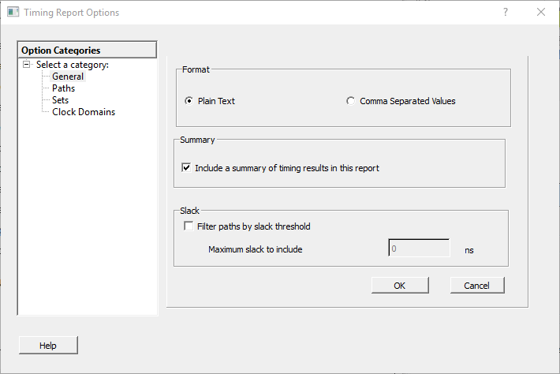

# General

The following figure shows the Timing Report Options—General dialog box.

-   **[Format](GUID-91D9B9FA-5F2D-45D2-A760-DB52932A87F5.md)**  

-   **[Summary](GUID-71AA6DE8-8E3B-4F44-A9C3-6FAA7E3C53C8.md)**  

-   **[Analysis](GUID-62000D1C-D5A1-4462-AF9C-1ADD4616E142.md)**  

-   **[Slack](GUID-1E18665A-E785-434E-B80C-274B6A17CF4F.md)**  

**Parent topic:**[Timing Report Options Dialog Box](GUID-29A2149F-C54F-4D59-B99E-CCC19A108FF0.md)

