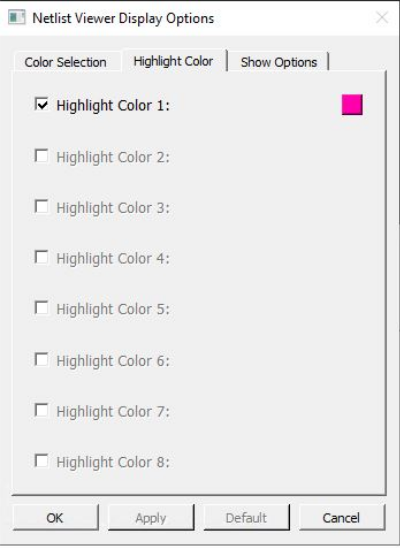

# Highlight Color

The Highlight Color is the color of the design objects \(nets, instances, and pins\) when you  highlight them with the Highlight icon. The Highlight Color tab allows you to change the color  from the default settings to your own personal preferences.

This tabs allows up to eight highlight colors of your own preferences. The selections and  settings of the highlight colors, up to a maximum of eight, is cycled through the  selected design objects when the Highlight Mode is enabled. To unhighlight an object,  click the **Unhighlight All** button or re-highlight the object with  the same color.

-   **[Changing the Color Setting](GUID-8A0674E2-DDB0-4A62-94E6-D7901E785721.md)**  

**Parent topic:**[Customizing Display Preferences](GUID-A95E02AB-4644-40D0-8D87-246FA078580B.md)

