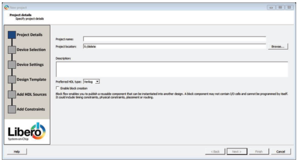
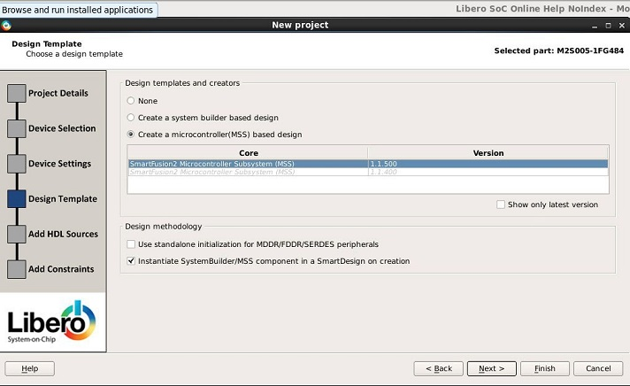
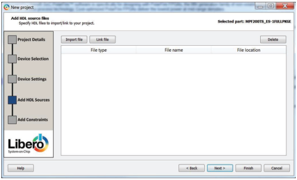
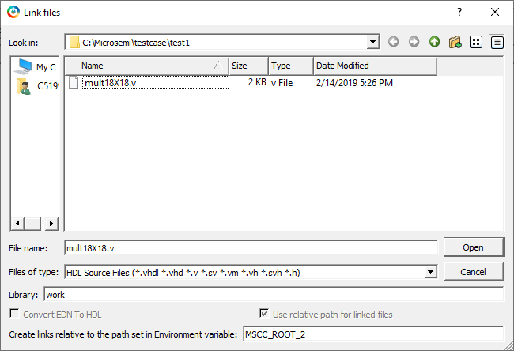
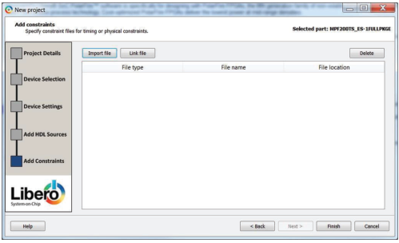
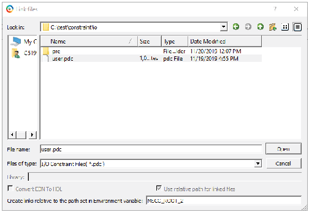
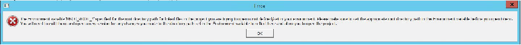
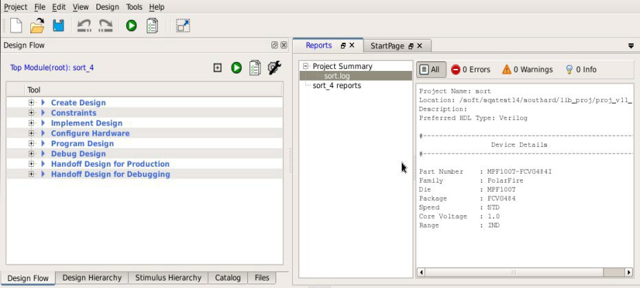

# Getting Started

The following sections describe how to start using Libero SoC.

## Starting Libero SoC

When you start Libero SoC, the Welcome screen appears. In the left pane, links under **Projects** allow you to create a new Libero SoC project or open an existing one.

-   Clicking **New** starts the [New Project Creation Wizard](GUID-F9EBA308-305F-4288-8D09-CB856AA26995.md#). Use this wizard to create new Libero SoC projects.
-   Clicking **Open** opens an [existing Libero SoC project](GUID-F9EBA308-305F-4288-8D09-CB856AA26995.md#).

## Design Report

The **Design Report** tab lists the reports available for your design. Reports  are added automatically as you move through design development.  For example, timing reports are added when you run timing  analysis on your design. Reports are updated each time you run a  timing analysis.

To display the **Design Report** tab, click **Design &gt; Reports**.

If a report is not listed in the tab, you might have to create it manually. For example, you must  start **Verify Power** manually before its report is available.

The following table lists the reports you can view in the **Design Report** tab.

<table id="TABLE_FXC_Q42_C4B"><thead><tr><th>

Category

</th><th>

Report

</th></tr></thead><tbody><tr><td>

Project Summary

</td><td>

-   [Synthesize](GUID-16AC6815-2A39-4FFC-8AE9-F7A82337A198.md#)
-   [Place and Route](GUID-16AC6815-2A39-4FFC-8AE9-F7A82337A198.md#)
-   [Verify Timing](GUID-16AC6815-2A39-4FFC-8AE9-F7A82337A198.md#)
-   [Verify Power](GUID-16AC6815-2A39-4FFC-8AE9-F7A82337A198.md#)

</td></tr><tr><td>

Programming

</td><td>

-   [Generate FPGA Array Data](GUID-AE825DD9-DE91-4C39-95B7-F501D59B5932.md#)
-   [Generate Bitstream](GUID-AE825DD9-DE91-4C39-95B7-F501D59B5932.md#)

</td></tr><tr><td>

Export

</td><td>

-   [Export Pin Report](GUID-7C0FFD89-F0F2-49A8-9E21-FBB94A5C33F9.md#)
-   [Export BSDL File](GUID-7C0FFD89-F0F2-49A8-9E21-FBB94A5C33F9.md#)

</td></tr></tbody>
</table>## Creating a New Project

To simplify project creation, Libero SoC provides a wizard that takes you through the  process of creating a new Libero SoC project.

To start a new Libero SoC project, click **Project &gt; New**. The  following table summarizes the screens in the wizard.

|Screen|Description|
|------|-----------|
|[Project Details](GUID-F9EBA308-305F-4288-8D09-CB856AA26995.md#)|Specify the name and location of your project, device family and  parts, I/O standards, and HDL source files and design constraint  files.|
|[Device Selection](GUID-F9EBA308-305F-4288-8D09-CB856AA26995.md#)|Select a device for your project. After you select a device, or  in any wizard screen that follows, you can click the  **Finish** button to create the project and  exit the wizard.|
|SmartFusion 2 and IGLOO 2: [Device Settings](GUID-F9EBA308-305F-4288-8D09-CB856AA26995.md#)|Specify the device I/O technology and reserve pins for  probes.|
|[Design Template](GUID-F9EBA308-305F-4288-8D09-CB856AA26995.md#)|This dialog box might not be available if there are no design  templates for the chosen technology.|
|[Add HDL Sources](GUID-F9EBA308-305F-4288-8D09-CB856AA26995.md#)|Add HDL design source files to your Libero SoC project.|
|[Add Constraints](GUID-F9EBA308-305F-4288-8D09-CB856AA26995.md#)|Add timing and physical constraints files to your Libero SoC  project.|

### New Project Creation Wizard: Project Details

Project Details is the first screen that appears in the New Project Creation Wizard.

The following table describes the fields in the Project Details screen. After you complete the fields, click **Next** to go to [Device Selection](GUID-F9EBA308-305F-4288-8D09-CB856AA26995.md#).

<table id="TABLE_KFN_2Y2_C4B"><thead><tr><th>

Field

</th><th>

Description

</th></tr></thead><tbody><tr><td>

Project Name

</td><td>

Identifies your project name. Do not use spaces or reserved Verilog or VHDL keywords.

</td></tr><tr><td>

Project Location

</td><td>

Identifies your project location on disk.

</td></tr><tr><td>

Description

</td><td>

General information about your design and project.

</td></tr><tr><td>

Preferred HDL Type

</td><td>

Sets your HDL type to one of the following:-   Verilog
-   VHDL

Libero-generated files \(SmartDesigns, SmartGen cores, and so on\) are created in the HDL type you specify. Libero SoC supports mixed HDL designs.

</td></tr><tr><td>

Enable Block Creation

</td><td>

Allows you to build blocks for your design. These blocks can be assembled in other designs, with partial layout, and been optimized for timing and power performance for a specific Microchip device. Once optimized, you can use the same blocks in multiple designs.

</td></tr></tbody>
</table>### New Project Creation Wizard: Device Selection

The Device Selection screen is where you can specify the Microchip device for your  project. Use the filters and drop-down lists to refine your search for the right part to  use for your design.

This screen contains a table of all the parts, with associated FPGA resource details  generated based on a value you enter in a filter. When you select a filter value:

-   The parts table is updated to reflect the result of the new filtered value.
-   All other filters are updated, and only relevant items are available in the filter drop-down lists. For example, if you select **PolarFire** in the **Family** filter, the parts table includes only PolarFire parts, and the **Die** filter includes only PolarFire dies in the **Die** drop-down list.

    

    The following table describes the fields in the **Device Selection** screen. After you complete the fields, click  **Next** to go to the [Device Settings](GUID-F9EBA308-305F-4288-8D09-CB856AA26995.md#) screen or click **Finish** to create the  new project by accepting all of the remaining default settings.

<table id="TABLE_DQG_DBF_C4B"><thead><tr><th>

Field

</th><th>

Description

</th></tr></thead><tbody><tr><td>

Family

</td><td>

Microchip device family. Only devices that belong to the  family appear in the parts table.

</td></tr><tr><td>

Die/Package/Speed

</td><td>

Device die, package, and speed grade. Use the  Die/Package/Speed filters to view only the selections that  interest you. The Die/Package/Speed grades available for  selection depend on the level of [Libero SoC license](GUID-002B1810-11AC-4FDF-B9FA-41C838A297CF.md#) you have \(Evaluation, Silver, Gold,  or Platinum\). For more information, see the [Libero SoC Licensing](https://www.microchip.com/en-us/products/fpgas-and-plds/fpga-and-soc-design-tools/fpga/licensing) web page.

</td></tr><tr><td>

Core Voltage

</td><td>

Core voltage for your device. Two numbers separated by a  “~” are shown if a wide range voltage is supported. For  example, 1.2~1.5 means that the device core voltage can vary  between 1.2 and 1.5 volts.

</td></tr><tr><td>

Range \(PolarFire\)

</td><td>

Voltage and temperature range a device might encounter in  your application. Tools such as SmartTime, SmartPower,  timing-driven layout, power-driven layout, the timing  report, and back-annotated simulation are affected by  operating conditions. Select the appropriate option for  your device. Supported operating condition ranges vary  according to your device and package. To find your  recommended temperature range, see your device  datasheet. Choices are:-   **All**: All ranges
-   **EXT**: Extended
-   **IND**: Industrial
-   MIL: Military

</td></tr><tr><td>

Range \(SmartFusion 2, IGLOO 2, and RTG4\)

</td><td>

Temperature ranges a device can encounter in your  application. Junction temperature is a function of ambient  temperature, air flow, and power consumption. Tools such as  SmartTime, SmartPower, timing-driven layout, power-driven  layout, the timing report, and back-annotated simulation are  affected by operating conditions. Choices are:-   **ALL**: All ranges
-   **EXT**: Extended
-   **COM**: Commercial \(not available for RTG4 devices\)
-   **IND**: Industrial
-   **TGrade1**: Automotive \(not available for RTG4 devices\)
-   **TGrade2**: Automotive \(not available for RTG4 devices\)
-   **MIL**: Military
Supported operating condition ranges vary according  to your device and package. Refer to the device  datasheet to find your recommended temperature range.  The temperature range corresponding to the value  selected from the pick list can also be found by  checking Project Settings &gt; Analysis operating  conditions.

</td></tr><tr><td>

Reset Filters

</td><td>

Resets all filters to the default ALL option except  Family.

</td></tr><tr><td>

Search Parts

</td><td>

Character-by-character search for parts. Search results  appear in the parts table.

</td></tr></tbody>
</table>
### New Project Creation Wizard: Device Settings

Device settings vary by device family.

#### PolarFire Device Settings

For PolarFire, the Device Settings page is where you can set the core voltage, default  I/O technology, and enable reserve pins for probes.

")

The following table describes the fields in the Device Settings screen. After you  complete the fields, click **Next** to go to the next screen or click  **Finish** to create the new project by accepting all of the  remaining default settings.

|Field|Description|
|-----|-----------|
|Core Voltage|Set the core voltage for your device.|
|Default I/O technology|Set all your I/Os to a default value. You can change the values  for individual I/Os in the I/O Attribute Editor. The I/O Technology  available is family-dependent.|
|Reserve pins for probes|Reserve your pins for probing if you intend to debug using  SmartDebug. If unchecked, the I/Os can be used as General Purpose  I/Os.|

#### SmartFusion 2 and IGLOO 2 Device Settings

For SmartFusion 2 and IGLOO 2, the Device Settings page is where you can set the device  I/O technology, enable reserve pins for probes, set power supplies, and enable system  controller suspended mode.

")

The following table describes the fields in the Device Settings screen for SmartFusion 2  and IGLOO 2. After you complete the fields, click **Next** to go to  the next screen or click **Finish** to create the new project by  accepting all of the remaining default settings.

|Field|Description|
|-----|-----------|
|Default I/O technology|Set all your I/Os to a default value. You can change the values  for individual I/Os in the I/O Attribute Editor. The I/O Technology  available is family-dependent.|
|Reserve pins for probes|Reserve your pins for probing if you intend to debug using  SmartDebug. If unchecked, the I/Os can be used as General Purpose  I/Os.|
|PLL supply voltage \(V\)|Set the voltage for the power supply that you plan to connect to  all the PLLs in your design, such as MDDR, FDDR, SERDES, and  FCCC.|
|VDD Supply Ramp Time|Power-up management circuitry is designed into every SmartFusion  2 and IGLOO 2 FPGA. These circuits ensure easy transition from the  powered-off state to the powered-up state of the device. The  SmartFusion 2, IGLOO 2, and RTG4 system controller is responsible  for systematic power-on reset whenever the device is powered on or  reset. All I/Os are held in a high-impedance state by the system  controller until all power supplies are at their required levels and  the system controller has completed the reset sequence.The  power-on reset circuitry in SmartFusion 2 and IGLOO 2 devices  requires the VDD and VPP supplies to ramp  monotonically from 0 V to the minimum recommended operating  voltage within a predefined time. There is no sequencing  requirement on VDD and VPP. Four ramp rate options are available  during design generation: 50 μs, 1 ms, 10 ms, and 100 ms. Each  selection represents the maximum ramp rate to apply to VDD and  VPP.Device information \(such as Die, Package, and Speed\)  can be modified later in the Project Settings dialog  box.|
|System controller suspended mode|Suspends operation of the System Controller. Checking this box  places the System Controller in a reset state when the device is  powered up. This suspends all system services from being performed.  For a list of system services for SmartFusion 2 and IGLOO 2, see the  System Controller User's Guide for your device.|

#### RTG4 Device Settings

For RTG4, the Device Settings page is where you can set the default I/O technology and  activate reserve pins for probes and enable single event transient mitigation.

")

The following table describes the fields in the Device Settings screen for RTG4. After  you complete the fields, click **Next** to go to the next screen or  click **Finish** to create the new project by accepting all of the  remaining default settings.

|Field|Description|
|-----|-----------|
|Default I/O technology|Set all your I/Os to a default value. You can change the values  for individual I/Os in the I/O Attribute Editor. The I/O Technology  available is family-dependent.|
|Reserve pins for probes|Reserve your pins for probing if you intend to debug using  SmartDebug. If unchecked, the I/Os can be used as General Purpose  I/Os.|
|Enable Single Event Transient mitigation|Controls the mitigation of Single Event Transient \(SET\) in the  FPGA fabric. When this box is checked, SET filters are turned on  globally to help mitigate radiation-induced transients. By default,  this box is not checked.|

### New Project Creation Wizard: Design Template \(SmartFusion 2 and IGLOO 2\)

The Design Template page is where you can use Libero SoC’s built-in template to automate  your SmartFusion 2 or IGLOO 2 design process. The template uses the System Builder tool  for system-level design or the Microcontroller Subsystem \(MSS\) in your design. Both will  speed up the design process.

The following table describes the fields in the Device Template screen. After you  complete the fields, click **Next** to go to the Add HDL Sources page  or click **Finish** to create the new project by accepting all of the  remaining default settings.

|Field|Description|
|-----|-----------|
|None|Select if you do not want to use a design template.|
|Create a System Builder based design|Use System Builder to generate your top-level design.|
|Create a Microcontroller \(MSS\) based design|Instantiate a Microcontroller \(MSS\) in your design. The version of  the MSS cores available in your vault is displayed. Select the version  you desire.|
|Use Standalone Initialization for MDDR/FDDR/SERDES  Peripherals|Check if you want to create your own peripheral initialization logic  in SmartDesign for each design peripheral \(MDDR/FDDR/SERDES\). When  checked, System Builder does not build the peripherals initialization  logic for you. Stand-alone initialization is useful if you want to make  the initialization logic of each peripheral separate from and  independent of each other.|
|Instantiate System Builder/MSS component in a SmartDesign on  creation|Uncheck if you are using this project to create System Builder or MSS  components and do not plan on using them in a SmartDesign based design.  This is especially useful for design flows where the System Builder or  MSS components are stitched in a design using HDL.|

### New Project Creation Wizard: Add HDL Source Files

The Add HDL Source Files screen is where you can add HDL design source files to your  Libero SoC project. The HDL source files can be imported or linked to the Libero SoC  project.

The following table describes the elements in the Add HDL Source Files screen. After you  complete the fields, click **Next** to go to the [Add Constraints](GUID-F9EBA308-305F-4288-8D09-CB856AA26995.md#) screen or click **Finish** to create the  new project by accepting all of the remaining default settings.

<table id="TABLE_DQG_DBF_C4B"><thead><tr><th>

Element

</th><th>

Description

</th></tr></thead><tbody><tr><td>

Import File button

</td><td>

Imports an HDL source file. When the dialog box appears, go to  the location where the HDL source resides, select the HDL file, and  click **Open**. The HDL file is copied to the  `<prj_folder>/hdl` folder in your Libero  project.

</td></tr><tr><td>

Link File button

</td><td>

Allows you to continue with an absolute or relative path for  linked files. When the Link files dialog box appears \(see the  following figure\), go to the location where the HDL source resides,  select the HDL file, and click **Open**. 

</td></tr><tr><td>

Create links relative to the path set in Environment  variable

</td><td>

  Available when you click the Link File  button. The HDL file is linked to the Libero project. Check this  check box if the HDL source file is located and maintained  outside the Libero project. This option requires you to specify  an environment variable that has a relative path set to it.  Links are created relative to the path set in the environment  variable.  **Note:** If you select relative path and provide an environment variable for the relative path, you cannot switch to absolute path. After the environment variable is set, this option becomes read-only in all other link files dialog boxes.

 

</td></tr><tr><td>

Delete button

</td><td>

Deletes the selected HDL source file from your project. If the  HDL source file is linked to the Libero project, the link will be  removed.

</td></tr></tbody>
</table>

### New Project Creation Wizard: Add Constraints

The Add Constraints screen is where you add timing constraints and physical constraints files to  your Libero SoC project. The constraints file can be imported or linked to the Libero  SoC project.

The following table describes the elements in the Add Constraints screen.

<table id="TABLE_DQG_DBF_C4B"><thead><tr><th>

Element

</th><th>

Description

</th></tr></thead><tbody><tr><td>

Import File button

</td><td>

Go to the location where the constraints file resides. Select the  constraints file and click **Open**. The  constraints file is copied to the  `<prj_folder>/constraint` folder in your  Libero project.

</td></tr><tr><td>

Link File button

</td><td>

Click this button if the constraint file is located and  maintained outside the Libero project. When the Link files dialog  box appears \(see the following figure\), specify an absolute path or  choose a relative path for linked files. Go to the location where  the constraints file resides. Select the constraints file and click  **Open**. The constraints file is linked to  the Libero project.

</td></tr><tr><td>

Create links relative to the path set in Environment  variable

</td><td>

  Available when you click the Link File  button. The constraints file is linked to the Libero project.  Check this check box if the constraints file is located and  maintained outside the Libero project. This option requires you  to specify an environment variable that has a relative path set  to it. Links are created relative to the path set in the  environment variable.  **Note:** If you select relative path and provide an environment variable for the relative path, you cannot switch to absolute path. After the environment variable is set, this option becomes read-only in all other link files dialog boxes.

 

</td></tr><tr><td>

Delete button

</td><td>

Deletes the selected constraints file from your project. If the  constraints file is linked to the Libero project, the link will be  removed.

</td></tr></tbody>
</table>

After you complete the fields, click **Finish** to complete new  project creation. The **Reports** tab shows the result of your new  project.

## Opening a Project

To open a project:

1.  From the **File** menu, choose **Open Project**.
2.  Select the project file you want to open. The file ends in the extension `.prjx`.
3.  Click **Open**.

**Note:** Opening a project created using a relative path for linked files displays the following error message if the environment variable does not exist or the path set in the environment variable is empty and cancels opening the project.

When you open an existing Libero SoC project:

-   A Design Flow window appears on the left side.
-   A log and message window appear at the bottom.
-   Project information windows appear on the right side.

The following figure is an example of a newly created project, with only the top-level Design Flow window steps shown.

The Design Flow window might appear different for each technology family. However, all flows  include some version of the following design steps:

-   Create Design
-   Constraints
-   Implement Design
-   Configure Hardware
-   Program Design
-   Debug Design
-   Handoff Design for Production
-   Handoff Design for Debugging

