# Chip Planner Views

When the Chip Planner launches, it opens the following windows:

-   **Design View** window
-   **Floorplanner View** window
-   **Log** window
-   **Display Options** window
-   **Properties** window
-   **World View** window

All windows can be docked or undocked \(floating\), turned on or off,  resized, or moved to the right, left, top, or bottom of the Chip Planner application.  Docked windows can be stacked horizontally or vertically.

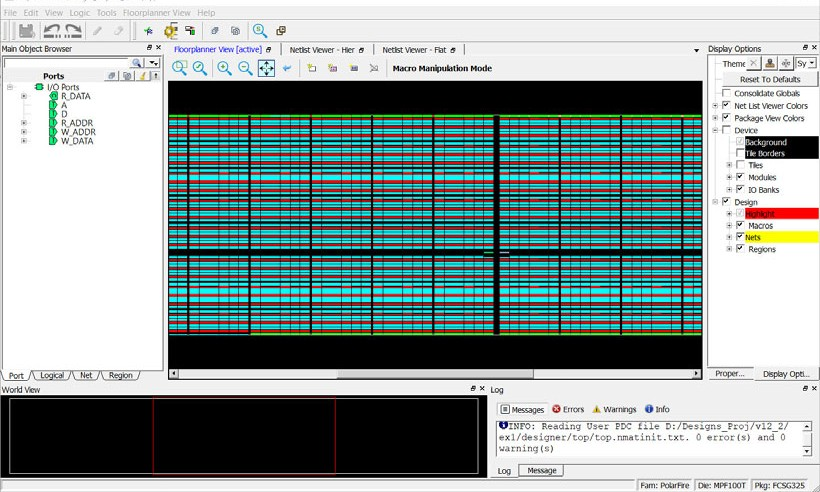

The **Design View** window provides the following  view tabs for the design:

-   Port
-   Logical
-   Net
-   Region
-   Block \(only when the design instantiates a design block\)

The following table lists the icons in the toolbar. Hover the mouse on  the icon shown in the **Floorplanner View** to see the tooltip.

<table id="ID-00000114"><thead><tr id="ID-0000011A"><th id="ID-0000011B">

**Icon**

</th><th id="ID-0000011E">

**Name**

</th><th id="ID-00000121">

**Function**

</th></tr></thead><tbody><tr id="ID-00000124"><td id="ID-00000125">

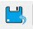

</td><td id="ID-0000012A">

Commit

</td><td id="ID-0000012D">

Commit and Save behaves as follows:-   Runs Chip Planner DRC before saving the changes.
-   Writes/updates PDC files.

</td></tr><tr id="ID-00000136"><td id="ID-00000137">

</td><td id="ID-0000013C">

Undo

</td><td id="ID-0000013F">

Reverses your last action.

</td></tr><tr id="ID-00000142"><td id="ID-00000143">

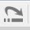

</td><td id="ID-00000148">

Redo

</td><td id="ID-0000014B">

Reverses the action of your last Undo  command.

</td></tr><tr id="ID-0000014E"><td id="ID-0000014F">

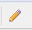

</td><td id="ID-00000153">

Highlight

</td><td id="ID-00000156">

Highlights a net, macro, or port.

</td></tr><tr id="ID-00000159"><td id="ID-0000015A">

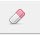

</td><td id="ID-0000015E">

Unhighlight All

</td><td id="ID-00000161">

Unhighlights all highlighted selections  \(macro, net, or port\).

</td></tr></tbody>
</table>**Clone and Clear Options**

The Clone and Clear options appear when you right click on the main object  browser/design view window. The following table describes these options.

<table id="ID-0000016D"><thead><tr id="ID-00000173"><th id="ID-00000174">

**Icon**

</th><th id="ID-00000177">

**Name**

</th><th id="ID-0000017A">

**Function**

</th></tr></thead><tbody><tr id="ID-0000017D"><td id="ID-0000017E">

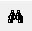

</td><td id="ID-00000184">

Clone new filter

</td><td id="ID-00000187">

Clones a Find window for a specific view  \(Logical/ Port/Net/Region/Block\) depending on the view you are in when you  click this icon or CTRL + F. Multiple Find windows may be cloned, each with a  different set of filtering criteria, to provide multiple filtered views of  design elements.

</td></tr><tr id="ID-0000018A"><td id="ID-0000018B" rowspan="5">

  

 

</td><td id="ID-00000190">

Delete all filter browsers

</td><td id="ID-00000193">

Deletes all cloned Find windows.

</td></tr><tr><td>

Delete all port filter browsers

</td><td>

Deletes all cloned port filter windows.

</td></tr><tr><td>

Delete all net filter browsers

</td><td>

Deletes all cloned net filter windows.

</td></tr><tr><td>

Delete all region filter browsers

</td><td>

Deletes all cloned region filter windows.

</td></tr><tr><td>

Delete all block filter browsers

</td><td>

Deletes all cloned block filter windows.

</td></tr><tr id="ID-00000196"><td id="ID-00000197">

</td><td id="ID-0000019C">

Rename

</td><td id="ID-0000019F">

Renames the cloned window to a name other  than the default name.

</td></tr></tbody>
</table>In addition, all five views share the following special icons:

-   Port
-   Logical
-   Net Region
-   Block

A tooltip is available for each icon. The following table lists these special  icons.

<table id="ID-000001A3"><thead><tr id="ID-000001A9"><th id="ID-000001AA">

**Icon**

</th><th id="ID-000001AD">

**Name**

</th><th id="ID-000001B0">

**Function**

</th></tr></thead><tbody><tr id="ID-000001B3"><td id="ID-000001B4">

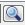

</td><td id="ID-000001B8">

Reapply the Filter

</td><td id="ID-000001BB">

Reapplies the filter and sort.

</td></tr><tr id="ID-000001BE"><td id="ID-000001BF">

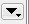

</td><td id="ID-000001C3">

Filter

</td><td id="ID-000001C6">

Applies the filter to design object  display.

</td></tr><tr id="ID-000001C9"><td id="ID-000001CA">

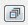

</td><td id="ID-000001CE">

Collapse

</td><td id="ID-000001D1">

Collapses the hierarchical display in the  view.

</td></tr><tr id="ID-000001D4"><td id="ID-000001D5">

</td><td id="ID-000001D9">

Expand

</td><td id="ID-000001DC">

Expands the selected design object.

</td></tr><tr id="ID-000001DF"><td id="ID-000001E0">

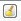

</td><td id="ID-000001E4">

Clear

</td><td id="ID-000001E7">

Clears the Filter and refreshes the tree  reflecting no filters applied.

</td></tr><tr id="ID-000001EA"><td id="ID-000001EB">

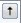

</td><td id="ID-000001F1">

Change Sort Order and allow Additional Filtering

</td><td id="ID-000001F4" align="justify">

Changes sort order between  ascending and descending, or applies additional filtering.Sort and Filter criteria vary with the view.

</td></tr><tr id="ID-000001FA"><td id="ID-000001FB">

</td><td id="ID-00000200">

Dock

</td><td id="ID-00000203">

Docks the cloned Find window. This option is  available only in the cloned Find window.

</td></tr><tr id="ID-00000208"><td id="ID-00000209">

</td><td id="ID-0000020E">

Maximize

</td><td id="ID-00000211">

Maximizes the cloned Find window. This option  is available only in the cloned Find window.

</td></tr><tr id="ID-00000216"><td id="ID-00000217">

</td><td id="ID-0000021C">

Restore

</td><td id="ID-0000021F">

Restores back to the cloned Find window. This  option is available only in the maximized clone Find window.

</td></tr></tbody>
</table>All Chip Planner windows can be docked or undocked.

<table id="ID-0000022B"><thead><tr id="ID-00000231"><th id="ID-00000232">

**Icon**

</th><th id="ID-00000235">

**Name**

</th><th id="ID-00000238">

**Function**

</th></tr></thead><tbody><tr id="ID-0000023B"><td id="ID-0000023C">

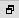

</td><td id="ID-00000240">

Dock/Undock

</td><td id="ID-00000243">

Docks or undocks \(floats\) the window.

</td></tr><tr id="ID-00000246"><td id="ID-00000247">

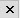

</td><td id="ID-0000024B">

Close

</td><td id="ID-0000024E">

Closes the window.

</td></tr></tbody>
</table>Chip Planner provides the following special keys and hot keys.

|**Special Keys/Hot Keys**|**Function**|
|-------------------------|------------|
|CTRL + F|Find/Search function. Creates a cloned Find  window.|
|CTRL + Z|Undoes the last action/command.|
|CTRL + S|Saves all changes.|
|CTRL + Y|Redoes last action/command.|
|Home|Scrolls to the first selected item in the  view.|
|End|Scrolls to the last selected item in the  view.|
|Tab|Scrolls to the next selected item in the  view.|
|Shift + Tab|Scrolls to the previous selected  item.|
|CTRL + Q|Exits Chip Planner.|
|CTRL + ++|Zooms in.|
|CTRL + --|Zooms out.|
|CTRL + 0|Zooms to fit.|
|CTRL + H|Locks all macros.|
|SHIFT + CTRL + H|Unlocks all macros.|
|Hold SHIFT + Left\_Mouse Click|Selects multiple elements in Design View  Windows. If you select two items, the items and all items between them are  selected.|
|Hold CTRL + Left Mouse click|Selects multiple elements in Design View  windows.|
|ESC|Unselects all selected items and removes any  pop-up windows.|
|&lt;Right Arrow key&gt;|Selects the element at next level of  hierarchy in the Design Flow window.|
|&lt;Left Arrow key&gt;|Selects the element at previous level of  hierarchy in the Design Flow window.|
|&lt;Down Arrow key&gt;|Selects the next element at the same level of  hierarchy in the Design Flow window.|
|&lt;Up Arrow key&gt;|Selects the previous element at the same  level of hierarchy in the Design Flow window.|

## Design View Window and View Tabs

When Chip Planner opens, it presents a Design View window with five view  tabs:

-   Port
-   Logical
-   Net
-   Region
-   Block - only if user blocks \(\*.cxz files\) exist in the design

Each of the view tabs displays a design view. A selection of a design  element in one view is reflected in other views. For example, when you click and select  a bus port in the Port View, the Logical View shows the OUTBUF/INBUF primitives \(for the  bus\) selected and the Net View shows the net \(connected to the INBUF/OUTBUF of the port\)  selected.

Similarly, when a user region is selected in the Region View, the  selection is reflected in the Floorplanner View as well.

The Design View window can be docked and undocked.

## Find Window

Chip Planner provides a Find window for each of the five design views to  search for design elements. You can also use the CTRL + F Hot Key. Multiple Find windows  can be created for the same design view \(Port/Logical/Net/Region/Block\).

When the Find window opens, it is associated with a specific design view. Only design elements specific to the particular view are displayed. The view name \(Port/Logical/Net/Region/Block\) is displayed across the top of the window.

You can create multiple cloned Find windows for each view. Cloned Find  windows are floating when they are opened and can be resized, moved, docked, or undocked  \(floating\).

When the Find window is invoked in the Logical view, for example, the find window opens with the name Find \(Logical\) across the top of the window and the name Find \# \(Logical\) across the top of the window when there are multiple cloned Find windows for the same View.

By default, each cloned Find window is named sequentially as Find 1  \(&lt;view\_name&gt;\), Find 2 \(&lt;view\_name&gt;\), Find 3 \(&lt;view\_name&gt;\), and so on. The  cloned Find windows can be renamed to a name different from the default.

A cloned Find window has the same features and functionality as the main  view window. In addition, a cloned Find window has an additional icon called Rename Tree,  which renames the cloned Find window to a name other than the default name.

Multiple Find windows are useful in floorplanning. For example, if your  design has both a RAM and a MACC block, and want to filter, select both, and display them  in the Floorplanner View, you need two Find windows for the logical view: one with the  filter based on Macro type &gt; RAM and the other with the filter based on Macro type &gt;  MACC.

")

### Search and Filter

Search and Filter operations are available for the five views \(Port, Logical, Net, Region, and Block\).

1.  Open the Find windows and search for specific design elements.

2.  Click the **Filter** icon \(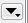\) in the Design View window or any cloned Find windows to search and filter the display. Three types of searches are available:-   Wildcard Filter—such as “\*” or “?” in the filter for wildcard matching. For example, when you type **FDDR\*** in the filter, the FDDR component and all its lower level primitives are displayed.
-   Use Regular Match Filter.
-   Regular Expressions—posix case insensitive regular expression search.
 **Note:** All filtering is case-insensitive.

## Port View

The Port View shows a hierarchical view of a design’s Input, Output, and  Inout ports. Regular I/Os and Dedicated I/Os are displayed as follows:

-   Regular I/O ports—Input/Output/Inout ports that you can change or reassign. These appear under the **I/O Ports**tree.
-   Dedicated I/Os—Special-purpose I/Os that cannot be changed or reassigned by you. These are shown under **the Dedicated Ports** tree.

    ")

### Port Buses

Scalar members of a bus port are grouped under the bus. All bus ports can  be collapsed or expanded as shown in the following figure.

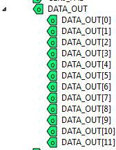

### Port Properties

To see the properties of the port, select the port. The properties of the  port you selected is displayed in the [Properties Window](GUID-FB359B49-296E-40DF-822B-F6D1F81EBA3B.md#). The selected  port is also highlighted in the Floorplanner View and the World View.

### User Actions in Port View

In the Port View, you can:

-   Place ports to locations—Select a port, and then drag and drop it into the Floorplanner View at a valid resource location to assign the element to that location. All valid port locations are highlighted when you drag the selected element into the Floorplanner View.
-   Unplace ports from locations—Right click the port and choose **Unplace From Location**to unassign a port.
-   Lock Port to location—Right click the port and choose **Lock Placement**to lock selected port to the assigned location. This option is enabled only when the port is already placed in a location.
-   Unlock Port from location—Right click the port and choose **Unlock Placement**to unassign the port. This option is enabled only when the port is already locked to a location.
-   Region Assign—Right click a port and choose **Region Assign**. The Select Region dialog opens, and shows the regions available to assign that element. This dialog opens even if there are no User regions to which the selected item can be assigned. See the following figure.

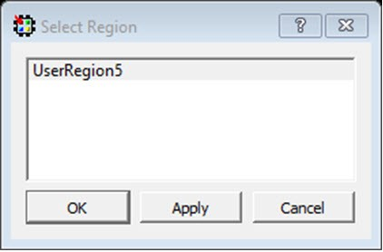

-   Unassign Port from Region—Right click the port and choose **Unassign Macro to Region**to unassign a port macro from a region. This option is enabled only if the port is already assigned to a region.
-   Unassign All—Right click the port and choose **Unassign All**to unassign all the ports that are assigned to regions.
-   Unassign Selected Ports—Right click the port and choose **Unassign Selected Ports** to unassign all the selected ports that are assigned to regions.
-   Check DRC rules of selected interface—For a selected interface, DRC rules can be verified by selecting this option. A message in the Log window informs you whether the DRC rule check is successful.

### Port Sorting

Click the sort icon to sort the Ports by ascending or descending order,  type, and port state:

### Port Filtering

Either the traditional match filter or Regular Expression match filter is  available. Enter a port name in the Filter text box to filter ports. Enable the **Use RegEx**check box to use Regular Expression match filtering.

#### Filter According to Port Types

The Port Filter list varies with the family and die.

#### Filter According to Port States

Port States filtering includes:

-   Placeable—All I/Os that you can place.
-   Unplaceable—All I/Os that you cannot place \(for example, dedicated I/O\).
-   Assigned to location—All I/Os that can be assigned to a location.
-   Not assigned to location—All I/Os that cannot be assigned to a location.
-   Assigned to region—All I/Os that can be assigned to a region.
-   Not assigned to region—All I/Os that cannot be assigned to a region.
-   Locked—All I/Os that are locked.
-   Unlocked—All I/Os that are not locked.

The following table lists the icons and the functions of the ports in the  Port View.

<table id="ID-000003F9"><thead><tr id="ID-000003FF"><th id="ID-00000400">

**Icon**

</th><th id="ID-00000403">

**Name**

</th><th id="ID-00000406">

**Function**

</th></tr></thead><tbody><tr id="ID-00000409"><td id="ID-0000040A">

</td><td id="ID-0000040F">

Input Port

</td><td id="ID-00000412">

Represents an Input port.

</td></tr><tr id="ID-00000415"><td id="ID-00000416">

</td><td id="ID-0000041B">

Output Port

</td><td id="ID-0000041E">

Represents an Output port.

</td></tr><tr id="ID-00000421"><td id="ID-00000422">

</td><td id="ID-00000427">

Bidirectional Port

</td><td id="ID-0000042A">

Represents a Bi-Directional port.

</td></tr><tr id="ID-0000042D"><td id="ID-0000042E">

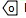

</td><td id="ID-00000433">

White Background

</td><td id="ID-00000436">

Represents a port that is not placed.

</td></tr><tr id="ID-00000439"><td id="ID-0000043A">

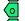

</td><td id="ID-0000043F">

Green Background

</td><td id="ID-00000442">

Represents a port that is placed.

</td></tr><tr id="ID-00000445"><td id="ID-00000446">

</td><td id="ID-0000044B">

Blue Tick Mark

</td><td id="ID-0000044E">

Represents an I/O that has been assigned to a region.

</td></tr><tr id="ID-00000451"><td id="ID-00000452">

</td><td id="ID-00000457">

Lock Icon

</td><td id="ID-0000045A">

Represents an I/O that is fixed/locked to a  location.

</td></tr></tbody>
</table>## Logical View

The logical view is accessible from the Logical tab of the Design View window.

It displays a hierarchical view of all the logic inside the chip. The displayed Logic levels are:

-   Component—Displays the logic at the component level. This represents the hierarchy in the design.
-   Primitives—Displays the lowest level of the hierarchy \(hard macro level\). You can expand the hierarchy tree to see the lower level logic.

### **Logic Element Properties**

Click the component/primitive to find out the properties of the logic  element you have selected. The properties of the component/primitive are displayed in the  [Properties Window](GUID-FB359B49-296E-40DF-822B-F6D1F81EBA3B.md#). The selected design element is also highlighted in the Floorplanner View  and in the World View.

### **User Action in Logical View**

Select a design element to:

-   Assign elements to locations—Right click a design element and choose **Place to Location**to assign the element to that location. All valid resource locations are highlighted in the Floorplanner View when you drag the selected element into the Floorplanner View. Only a single element can be assigned at a time.
-   Unassign element from location—Right click a design element and choose **Unplace from Location**. You can select multiple design elements/components and unassign them.
-   Lock element to location—Right click a design element and choose **Lock Placement**to lock the selected element to an assigned location. This option is enabled only when the element is already placed in a location. You can select multiple design elements/components and lock them.
-   Unlock element from location—Right click a design element and choose **Unlock Placement**to unlock or unfix a design element that is already locked to a location. This option is enabled when the element is already locked to a location. You can select multiple design elements/components and unlock them.
-   Region assign—Right click a design element and choose **Region Assign**. A new Select Region dialog box provides you different regions available to assign that element. This dialog box appears even if there are no User regions to which the selected item can be assigned. You can also drag and drop the selected elements directly into a region in the Floorplanner View. If the selected elements are not compatible or over-booked for the desired region, the selection is not assigned to the region and invalid elements are shown in red in the Properties window.
-   Unassign element from region—Right click a design element and choose **Unassign Macro from Region** to unassign a design element/macro from a region. This option is enabled only if the element is already assigned to a region. You can select multiple design elements/components and unassign them from a region.
-   Unassign all—Right click the port and choose **Unassign All**to unassign all the elements that are assigned to regions.
-   Unassign selected ports—Right click the port and choose **Unassign Selected Ports** to unassign all the selected elements that are assigned to regions.

### **Logical Filtering**

Enter a macro name in the Filter text box to filter the design elements. From the pull-down menu of the Sort icon, choose either the traditional match filtering, wildcard filtering, or Regular Expression match filtering.

### Logical Sorting

Click the Sort icon:

to sort in ascending or descending order, the type \(Filter by Macro Type\), and state  \(Filter by State\) of the logic element.

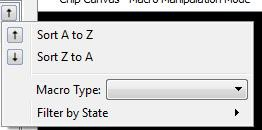

### Logical Filtering

Enter a macro name in the Filter text box to filter the design elements. From the pull-down menu of the Sort icon, choose either traditional match filtering, wildcard filtering, or Regular Expression match filtering.

#### Filtering by Macro Types

Available Macro types are family/die-dependent. For a list of Macro  filters specific to the family/technology of your project, see [Cross-Probing from SmartTime to Chip View/Netlist View](GUID-4A2AD403-2B0D-4A10-9C55-0ECF5229D726.md#).

#### Filtering by Macro State

The Logical View displays the filter results based on the state of the  Logical elements:

-   Placeable—All macros that you can place. This option is mutually exclusive with the Unplaceable option.
-   Unplaceable—All macros that you cannot placed. This option is mutually exclusive with the Placeable option.
-   Assigned to Location—All macros that can be assigned to a location. This option is mutually exclusive with the Not assigned to Location option.
-   Not assigned to Location—All macros that cannot be assigned to a location. This option is mutually exclusive with the Assigned to Location option.
-   Assigned to Region—All macros that can be assigned to a region. This option is mutually exclusive with the Not assigned to Region option.
-   Not assigned to Region—All macros that cannot be assigned to a region. This option is mutually exclusive with the Assigned to Region option.
-   Locked—All macros that are locked. This option is mutually exclusive with the Unlocked option.
-   Unlocked—All macros that are not locked. This option is mutually exclusive with the Locked option.

    

The following table lists the macros displayed in the Logical View.

|Icon|Name|Function|
|----|----|--------|
|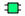|Component/Top Level Macro|Represents a Design Component or Top level  macro that has a lower level macro.|
||Comb/Seq Element|Represents the lowest level element  associated with a fabric resource.|
||Input Port Macro|Represents a macro associated with an Input  port.|
||Output port macro|Represents a macro associated with an Output  port.|
||Bi-Directional port|Represents a macro associated with a  Bi-Directional port.|
||Global Resource|Represents a macro assigned to Global  Resources/Row Global Resources.|
|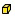|Block Element|Represents a design element associated with a  block or an IP interface.|
||White background|Represents a design element that is not  placed.|
|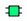|Green background|Represents a design element that is placed.|
||Blue tick mark|Represents a design element that has been assigned to a  region.|
||Lock Icon|Represents a design element that is fixed/locked to a  location.|

## Net View

The Net View displays a flattened net view of the design and all the nets  associated with the design. In addition to showing each net, this view shows the pins  connected to the net.

### Net Properties

Click to select the net. The net properties are displayed in the [Properties Window](GUID-FB359B49-296E-40DF-822B-F6D1F81EBA3B.md#). The selected net is also highlighted in  the Floorplanner View and the World View.

### User Actions in Net View

From the Net view, you can:

-   Change Net Color—Right click a net and choose **Net Color**to change the net color. This opens a color palette from which you can assign the desired color to the selected net.
-   Region Assign—Right click a design element and choose **Region Assign**. The Select Region dialog opens, and shows the regions available to assign that element. This dialog box opens even if there are no User regions to which the selected item can be assigned. See the following example.

    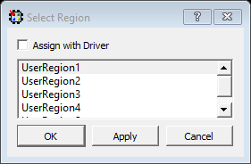

-   Check the **Assign with Driver**check box to assign all the net macros including driver macros to a region. This option is enabled if there is a valid Region created over the required resources. You can select multiple nets and assign them to a region.
-   Unassign All—Right click the port and choose **Unassign All**to unassign all the nets that are assigned to regions.
-   Unassign Selected Nets—Right click the port and choose **Unassign Selected Nets**to unassign all the selected nets that are assigned to regions.

### Sorting

Sort the nets in ascending or descending order.

### **Filtering**

Enter a net name in the Filter text box to filter net names. From the pull-down menu of the Sort icon, choose either traditional match filtering, wildcard filtering, or Regular Expression match filtering. You can also filter with criteria specific to nets, such as fanout values, net types, and routing status \(routed or unrouted\).

#### Filter Criteria Based on Fanout Value

Options are:

-   Max Fanout—Enter a value to display nets with a maximum fanout value.
-   Min Fanout—Enter a value to display nets with a minimum fanout value.

**Note:** Max Fanout and Min Fanout are logical ANDed together. If the Max Fanout has a value of 10 and the Min Fanout has a value of 2, the Net View displays only nets that meet both conditions. In this case, only nets with a fanout range of 2 to 10 are displayed.

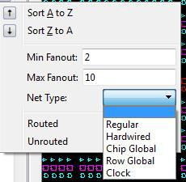

The following table lists the icons specific to the Net View.

<table id="ID-00000666"><thead><tr id="ID-0000066C"><th id="ID-0000066D">

**Icon**

</th><th id="ID-00000670">

**Name**

</th><th id="ID-00000673">

**Function**

</th></tr></thead><tbody><tr id="ID-00000676"><td id="ID-00000677">

  

 

</td><td id="ID-0000067C">

Regular/Hardwired Net

</td><td id="ID-0000067F">

Represents a regular or hardwired  net.

</td></tr><tr id="ID-00000682"><td id="ID-00000683">

  

 

</td><td id="ID-00000688">

Global Net

</td><td id="ID-0000068B">

Represents a net that is routed through  Chip Global/ Row global resources.

</td></tr><tr id="ID-0000068E"><td id="ID-0000068F">

  

 

</td><td id="ID-00000694">

Driven Macros

</td><td id="ID-00000697">

Represents a list of macros that are  driven by this net.

</td></tr><tr id="ID-0000069A"><td id="ID-0000069B">

  

 

</td><td id="ID-000006A0">

Driver Macros

</td><td id="ID-000006A3">

Represents a macro that is driving this  net.

</td></tr><tr id="ID-000006A6"><td id="ID-000006A7">

  

 

</td><td id="ID-000006AB">

Blue tick mark

</td><td id="ID-000006AE">

Represents a net that has been assigned to  a region.

</td></tr></tbody>
</table>#### Filter Criteria Based on Net Type

The net type and the filter list is family/die-specific. For the list of net filters  specific to the family/technology of your project, see [Cross-Probing from SmartTime to Chip View or Netlist Viewer](GUID-4A2AD403-2B0D-4A10-9C55-0ECF5229D726.md#).

#### Filter Criteria Based on Routing Status

Options are:

-   Routed—Displays all routed nets.
-   Unrouted—Displays all unrouted nets.

### Global Nets

A global net is a net that uses global routing resources for routing a  signal from source to destination logic clusters. These include Chip Globals  Resources/Global Buffers \(GB\), Row global resources/row global buffers \(RGB\), and  Half-Chip Globals \(HGB for RTG4\). Clocks, Async Reset, and nets with high fanout are  typically routed through these global routing resources.

Global signals \(G\[n:0\]\) reach the logic clusters through row global signals  \(RG\[7:0\]\) generated by an associated row global buffer \(RGB\). RGB are inferred by the  layout tool. Depending on the placement of the design elements, it distributes the  fanout of the global nets across multiple RGBs. The Net View shows this break-up for  such global nets.

The following figure shows an example of Global Nets with different  fanouts.

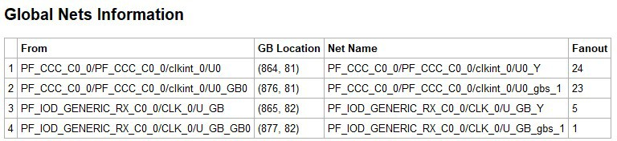

The following figure shows the Floorplanner View of the Global Net.

The following figure shows the Properties window of Global Nets, which  appears at the right side of the Floorplanner View.

## Region View

The Region View displays the regions you have created and all Components,  Macros, and Nets assigned to the region. When you create a region, by default the region is  named UserRegion1, UserRegion2, and so on. When you select in the Region View, the  properties of the Region you select are displayed in the [Properties Window](GUID-FB359B49-296E-40DF-822B-F6D1F81EBA3B.md#). When you  select an item in the hierarchical tree display, all sub-items are selected.

### User Regions and Region Types

Three types of regions are available for creation:

-   [Inclusive Region](GUID-4B6E196B-F860-44AB-8D9F-7E687564C43A.md#)
-   [Exclusive Region](GUID-4B6E196B-F860-44AB-8D9F-7E687564C43A.md#)
-   [Empty Region](GUID-4B6E196B-F860-44AB-8D9F-7E687564C43A.md#)

You can select a region to perform the following activities:

-   Delete—Deletes a selected region.
-   Clone—Clones a selected region.
-   Rename—Renames a selected region.
-   Merge—Merges two or more regions. This option is enabled if there are more than two regions selected.
-   Assign macros inside Region—Assigns macros that are part of a region area assigned to the selected region.
-   Unplace From location—Unassigns all design elements that are part of a selected region from their placed locations.
-   Lock Placement—Locks all macros that are part of a selected region.
-   Unlock Placement—Unlocks all macros that are part of a selected region.
-   Unassign All—Unassigns all the elements from a region.
-   Unassign Selected Ports—Unassigns all the selected ports from a region.
-   Unassign Selected Nets—Unassigns all the selected nets from a region.
-   Unassign Selected Components—Unassigns all the selected components from a region.

### User Actions on Regions in Floorplanner View

You can select a region in the Floorplanner View to perform the following  activities:

-   Delete—Deletes a selected region.
-   Clone—Clones a selected region.
-   Rename—Renames a selected region.
-   Merge—Merges two or more regions. This option is enabled if there are more than two regions selected.
-   Assign macros inside Region—Assigns macros that are part of a region area assigned to the selected region.
-   Unplace From location—Unassigns all design elements that are part of a selected region from their placed locations.
-   Lock Placement—Locks all macros that are part of a selected region.
-   Unlock Placement—Unlocks all macros that are part of a selected region.
-   Unassign All—Unassigns all the elements from a region.
-   Unassign Selected Ports—Unassigns all the selected ports from a region.
-   Unassign Selected Nets—Unassigns all the selected nets from a region.
-   Unassign Selected Components—Unassigns all the selected components from a region.

### **Region Properties**

Click the region in the Region View. The properties of the region you  selected are displayed in the [Properties Window](GUID-FB359B49-296E-40DF-822B-F6D1F81EBA3B.md#). The selected  region is also highlighted in the Floorplanner View and the World View.

### **Region Filtering**

Enter a region name in the Filter text box. From the pull-down menu of the Sort icon, choose traditional match filtering, wildcard filtering, or Regular Expression match filtering.

### Region Sorting

In addition to ascending or descending order display, a filter is  available for the Region View to display user regions based on region types:

-   Inclusive—Shows all inclusive regions.
-   Exclusive—Shows all exclusive regions.
-   Empty—Shows all empty regions.

    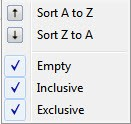

    The following table lists the icons specific to the Region View  Filter.

    |Icon|Name|Function|
    |----|----|--------|
    |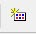|Inclusive|Represents an inclusive region.|
    |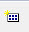|Exclusive Region|Represents an exclusive region.|
    ||Empty Region|Represents an empty region.|
    ||Nets|Represents a net associated with a  region.|
    ||Component/Top Level Macro|Represents a Design Component or Top  level macro that have lower level macros.|
    ||Comb / Seq Element|Represents the lowest level element  associated with a fabric resource.|
    ||Output port macro|Represents a macro associated with an  output port.|
    ||Input Port Macro|Represents a macro associated with an  Input port.|
    ||Green background|Represents a design element that is  placed.|
    ||Blue tick mark|Represents a design element that has  been assigned to a region.|
    ||Lock Icon|Represents a design element that is  fixed/locked to a location.|

## Block View

The block view displays the low-level design blocks \(\*.cxz files\) you have  imported into the Libero SoC project. This tab appears only when design blocks exist in the  project. These low-level design blocks may have completed the Place and Route step and met  the timing and power requirements of the design block.

The Block View displays all the design blocks in the project and displays the following design elements for each design block:

-   Macros
-   Nets
-   Ports

### **Block Properties**

Click to select the block in the Block View and the properties of the  block are displayed in the [Properties](GUID-FB359B49-296E-40DF-822B-F6D1F81EBA3B.md#)  [Window](GUID-FB359B49-296E-40DF-822B-F6D1F81EBA3B.md#). The  selected block is also highlighted in the Floorplanner View and the World View.

### **Block Filtering**

Enter a block name in the Filter text box to filter blocks. From the pull-down menu of the Sort icon, choose traditional regular match filtering, wildcard filtering or regular expression match filtering.

You can sort the blocks in ascending or descending order.

## Properties Window

The Properties window displays the properties of the design elements. The  items shown in the Properties window depends on what is selected in the design view.

### Properties of Logical View Elements

The Properties window displays the properties of a component or macro when it is selected in the Logical View. Properties displayed may include the following, depending on the type of design elements:

-   Macro/Component Name—Full macro or component name based on selection in logical view.
-   Cell Type—Resource type based on design element selection.
-   Placed \(Location\)—X-Y coordinates where device element is placed.
-   Resource Usage Table—Table showing resources based on component and macro selection.
-   Region Attached Table—Table showing region to which selected macro/component is assigned.
-   User region \(if any\) to which it is attached.
-   Nets Table—Table showing pins and nets associated with the selected macro along with fanout value.
-   Locked/Unlocked \(Placement\)—Selected port is locked or unlocked.
-   Port—Port name to which the I/O macro is assigned \(only shown for I/O port macros\).
-   I/O Technology Standard—I/O technology associated with the selected I/O macro \(shown only for I/O port macros\).
-   I/O Bank—I/O bank to which the selected I/O macro is assigned \(only shown for I/O port macros\).
-   Pin \(Package Pin\)—Pin to which the macro is assigned \(shown only for I/O port macros\).

**Note:** Not all properties in the list are displayed. The list of displayed properties varies with the type of design element selected in the Logical View.

")

### Properties of Port View Elements

When a design element \(I/O Bus or Scalar I/O\) is selected in the Port  View, the Properties window displays the properties of a bus \(for I/O bus\) or a macro \(for  scalar I/Os\).

For an I/O bus, the Properties window displays:

-   Resource Usage Table—Shows all resources associated with the selection.
-   Ports Table—Displays a table with I/O Bank, I/O Technology Standard, Package Pin, and Port Names of each individual member of the bus.

For scalar I/O ports, the Properties window displays the macro  information:

-   Port Name—Full Name of the selected port.
-   Macro—Name of the macro associated with the selected port.
-   Port Type of selected I/O.
-   Placed \(Location\)—X-Y coordinates where device element is placed.
-   Locked/Unlocked \(Placement\)—Selected port is locked or unlocked.
-   Pin \(Package Pin name\)—Pin name to which selected port is assigned.
-   I/O Technology Standard—I/O standard associated with the port.
-   I/O Bank—I/O bank associated with the selected port.
-   Resource Usage table.
-   Nets Table—Table showing pins and nets associated with the selected port along with fanout value.

    ")

### Properties of Nets

For nets selected in the Net view, the Properties window displays the following:

-   Net Name—Full name of the selected net.
-   Driver Name—Macro that is driving the selected net.
-   Fanout—Fanout value of the selected net.
-   Type—Regular, Hardwired, or Global for the selected net.
-   State—Routed or Unrouted net.

")

### Properties of Region

Region properties are displayed in the Properties window when a user region is selected in the Floorplanner View or in the Region View.

The properties window for a region displays the following:

-   Region Name—By default, the regions are named UserRegion1, UserRegion2, and so on when first created. You can change the region name by editing the Region name text box in the Properties window.
-   Type of Region—Inclusive, Exclusive, or Empty.
-   Routing Requirements

Constrain routing—Instructs the Place and Route tool to apply routing  restrictions, in addition to Placement restrictions, to the user regions.

-   Region Extents—Displays the X-Y coordinates of the origin \(lower left corner\) and the endpoint \(upper right corner\) and the width and height of the region.
-   Resources in the Region—Displays the logic resources in the region, including used \(Assigned\) resources and total available resources \(Capacity\) and a percentage of used resources \(Assigned\) relative to the total resources \(Capacity\). A percentage greater than 100 indicates resource overbooking, which is not allowed. The overbooked resource is highlighted in red.

    ")

### Properties of Blocks

When a block is selected in the Block View, the Properties window displays:

-   Block Name—Name of the selected block.
-   Module Name—Name of the block module.
-   Macro Count—Total number of macros in the block.
-   Net Count—Total number of nets in the block.
-   Locked Count—Total number of locked macros.

In addition, it specifies whether all the macros are placed and/or routed.

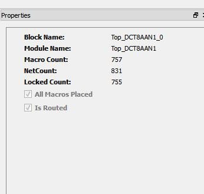

