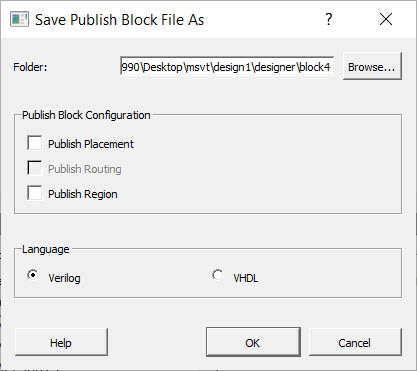
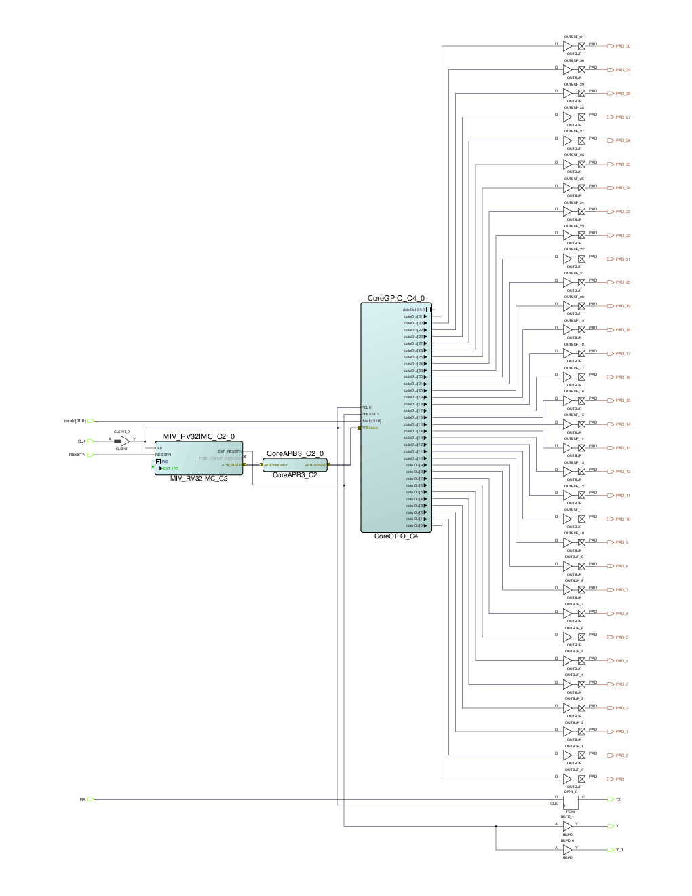
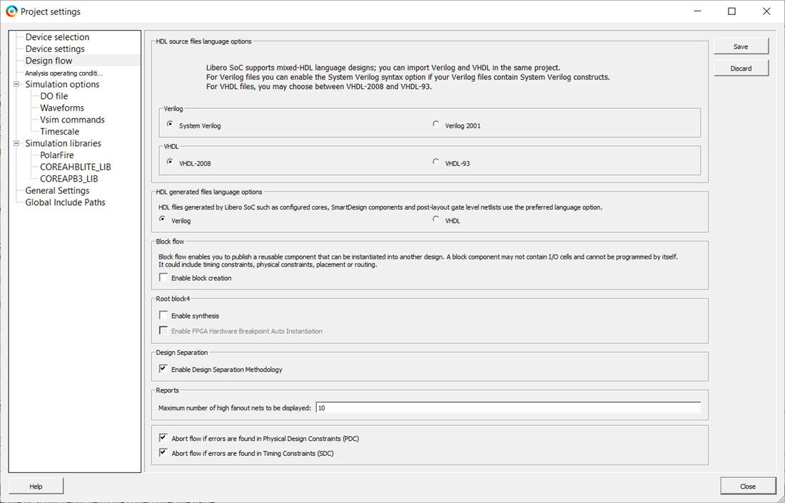
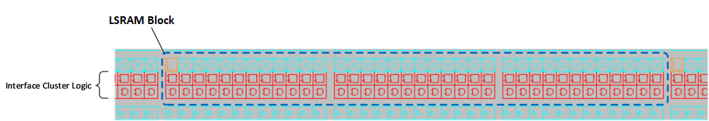
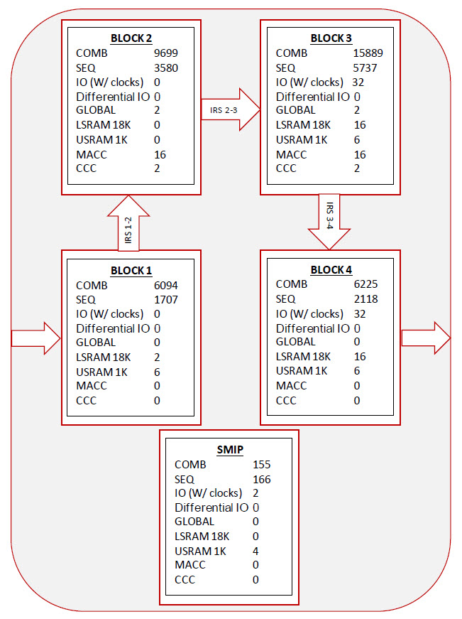
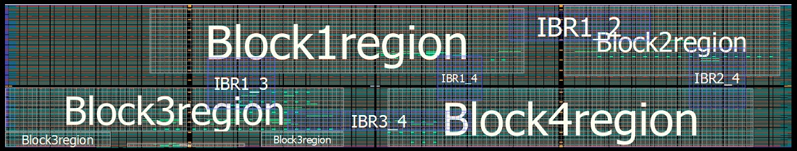

# Design Methodology

The following topics describe the design methodology.

## Design Separation Methodology Components

The Microchip Design Separation methodology comprises of the following features:

-   Ability to create independent subsystems.
-   Ability to validate that isolation.
-   Ability to monitor for faults.

The Design Separation methodology leverages an existing design methodology referred to as a “Block flow” to achieve isolated functions. Block flow is a bottom-up design methodology that allows an incremental design approach. In a Block flow compile, component modules in a design are compiled and optimized in independent stages from the rest of the project. After compiling, the component modules are published as a netlist \(or “Block”\), and then imported to a top-level project for integration with other modules in the larger system design.

Because the Block must be compiled with all the required physical resources, resource reservation<br /> is a key component of Block flow. Routing reservation and logic reservation are both<br /> constraint options available from the Block flow methodology. As a result, creating<br /> isolated subsystems for security and safety-critical applications is an application<br /> of Block flow. All critical subsystems are assigned to an exclusive region \(a region<br /> with strict resource reservation\) and floorplanned with a guard-band of unused<br /> clusters away from all other logic.

**Note:** The width of the guard-band depends on individual project requirements.

Signal connections to another<br /> module \(known as “Inter-Region Signals” within this flow\) are assigned to another<br /> resource-reserved region called the “IRS Region”. This region overlaps the source<br /> and sink regions. In this way, the Inter-Region Signals are members of the source<br /> region, the sink region, and the IRS Region. The IRS Region acts as a constrained<br /> routing channel.

A separate tool known as the Microchip Separation Verification Tool \(MSVT\) checks that a design meets the separation requirements defined by the system requirements of the design. MSVT is an independent tool included with the Libero installation. Libero SoC generates the parameter file `MSVT.param` automatically, which describes the Blocks in the design, and the number of signals entering and leaving a Block. MSVT checks the final design place-and-route against the `MSVT.param` file and reports any violations based on the separation requirement defined by the user.

Anti-Tamper \(AT\) must be considered in addition to the isolation of critical design subsystems.<br /> PolarFire®, SmartFusion® 2, and IGLOO® 2 devices come with standard robust design security, a<br /> critical portion of which is AT and fault detection. PolarFire, SmartFusion 2, and<br /> IGLOO 2 devices include mechanisms that allow an FPGA design to monitor the<br /> integrity of the device during operation.

Fault detection is a critical part of security-and safety-critical systems. To address this<br /> requirement, an IP core ties together the relevant AT hooks in CoreSMIP\_PF<br /> \(PolarFire\) and CoreSMIP \(SmartFusion 2 and IGLOO 2\) devices.

## Design Separation Methodology Steps

The following flow chart shows the various steps of the design separation methodology.

1.  

2.  Create an RTL description for each subsystem. Each subsystem should be independent from the others with its own logic resources. The RTL module defining each subsystem should be independent of other subsystems.

3.  Define each independent subsystem as a Block. The Block design flow creates logical partitions for the subsystems in question as a handle for place-and-route constraints in later stages of the design separation methodology.

4.  **Note:** All corresponding I/O ports of a subsystem should be assigned to the respective Block. In the design separation methodology, all logic must be a member of an isolated Block region.

5.  For each Block, run Synthesis and Compile. Assess the size and shape of suitable regions based on the types of I/O, count and length of cascaded Math blocks, RAM count, PLLs, peripherals and fabric resource usage. Publish the Block without place-and-route.

6.  Write a top-level module that only instantiates and connects all the Blocks. Import each published Block. Enable the Design Separation Methodology option in the **Project Settings... &gt; Design Flow &gt; Design Separation &gt; Enable Design Separation Methodology**.

7.  For each Block in the design, create separation regions by specifying region constraints using Chip Planner or defining regions in a PDC file.

8.  Assign Blocks to the isolated regions.

9.  If two Blocks interact with each other, create an overlapping IRS region constraint connecting the Blocks. These IRS regions should also be physically isolated from other blocks and IRS regions. Assign IRS nets to each respective IRS region.

10. Enter the necessary timing constraints. Perform design iterations to achieve timing closure.

11. Verify all aspects of timing and power.

12. Generate back-annotated files and perform post-layout simulations when required.

13. Configure security and programming options before generating the programming file. This step also exports information for MSVT.

14. Run MSVT from the command line. If MSVT fails, re-examine the floorplan and iterate the entire design flow with corrected region constraints.


## Creating Blocks

A security and safety-critical application may consist of one or more independent subsystems. Using Hardware Description Language \(HDL\), define each subsystem to be independent from the rest of the system.

Each subsystem should have its own resources, including I/O buffers for external FPGA signals. A Block element is created for each such subsystem, which is then instantiated in a top-level design.

To create a Block element for each subsystem:

1.  Right-click the target module in the **Design Hierarchy** tab and choose **Set as root**.

2.  **Enable block creation** from **Project Settings** \(see the following figure\).

    

    **Note:** Block flow is a bottom-up design methodology. The Block attribute in the Block flow identifies components in an HDL hierarchy to be reused within a team-based design flow as a modular resource.

3.  If a Block uses physical I/O pins, define those physical resources as part of that block. This requires explicit definition of I/O to be assigned to the Block using I/O pads. Use direct instantiation of an I/O buffer within the module in question or from the Catalog in Libero's SmartDesign tool.

4.  For each module that has its I/Os defined, run Synthesis and Compile. Analyze the Compile report to assess the size and shape of suitable regions based on types of I/O, count and length of cascaded Math blocks, RAM count, PLLs, peripherals and fabric resource usage.

5.  Optional: Enter timing constraints and run place-and-route followed by timing analysis to achieve timing closure for each individual Block. This step indicates the difficulty of timing closure at the top level of the design.

6.  The Block is ready to be published. Because these Blocks will be assigned to isolated separation regions \(explained in subsequent sections\), publish the Block without placement and routing information. Configure Publish Block options to exclude placement and routing information, as shown in the following figure.

    


Libero exports the `<block_name>.cxz` file to the `<project_path>/designer/<block_name>/export` directory when a Block is published. The `<block_name>.cxz` file is the published Block. This is the file you import into the top-level design to instantiate the Block.

## Assigning I/Os to the Block

Signals that route to physical I/O pins within each module should belong to the corresponding Block. For design separation, physical I/O resources must be associated with an isolation region. Enabling Block flow disables automatic I/O insertion by the Synthesis tool. Therefore, the design separation methodology requires explicit instantiation of I/O buffers that are required per Block. These I/O buffers can be inserted from the I/O Configurator in the SgCore Catalog or the Macro Library Catalog. For more information, see the SmartDesign sections in the Libero Online Help. These macros ensure that all design ports assigned to them infer an I/O port assigned to the given Block.

**Note:** Do not insert I/O buffer on ports that are used to interconnect with other blocks \(that is, IRS nets\).

To insert I/Os in a Block, Microchip recommends you use Libero’s SmartDesign tool. Follow these steps to create a SmartDesign component of the subsystem.

1.  Create a SmartDesign and instantiate the module in SmartDesign.

2.  Insert appropriate macros from the Macro library catalog for each type of port. The relevant macros are: INBUF, INBUF\_DIFF, OUTBUF, OUTBUF\_DIFF, TRIBUFF, TRIBUFF\_DIFF, BIBUF, and BIBUF\_DIFF.

3.  If ports belong to a bus, use the I/O configurator with required width and type of buffer.

4.  After required macros are instantiated in SmartDesign, connect the ports of the design with the respective macros.

5.  Rename the I/O pads with names defined in the module. Generate SmartDesign.

6.  Set the generated SmartDesign as the root module and create a Block using this module as described in [Creating Blocks](GUID-D782718B-3B21-4DDE-B53E-C560B69BA145.md#).

    The following figure shows a SmartDesign component in which a subsystem has<br /> been instantiated and top-level ports are assigned to its I/Os using OUTBUF<br /> macros.

    

    As an alternative to SmartDesign, you can instantiate the macros and connect<br /> them to the top-level ports of the design.

    Because lower level modules are compiled independently from the top-level<br /> design, ensure unique I/O pin names across the design are used in the lower<br /> level project. Microchip recommends checking the I/O pin names across the<br /> project to ensure uniqueness when building a lower level project. It is<br /> important to realize that some cores have pins that are not true single<br /> point inputs or outputs that can also be fed back internally. Therefore,<br /> they should be carefully placed between blocks.

    The cells connected to IRS regions must be isolated from other IRS regions<br /> connected to a different set of blocks. It is best to insert a buffer or<br /> register \(with only global clocks and resets\) at the source and sinks of<br /> IRS.


## Optional CoreSMIP Block

The Security Monitor IP \(CoreSMIP or CoreSMIP\_PF\) is a core provided by<br /> Microchip<br /> for tamper detection<br /> to<br /> enhance<br /> the security of the system.<br /> For more<br /> information,<br /> see<br /> the<br /> **CoreSMIP or CoreSMIP\_PF User Guide**. CoreSMIP and CoreSMIP\_PF<br /> are<br /> present in the catalog<br /> under<br /> the Tamper section.

The Design Separation methodology requires each subsystem to be defined as a Block. Therefore, if your design includes CoreSMIP or CoreSMIP\_PF, create such a block using the same steps as the other Blocks.

## Creating a Top-level Design

After all Blocks are published, create a new Libero project for the top-level design using the following steps.

1.  Create SmartDesign block where you instantiate all the individual blocks and connect their IRS signals. This top-level module should contain instantiations of all Blocks along with interconnects between them to replicate a complete system.

2.  Set this top-level module as the root module in Libero and disable Block Creation. Navigate to the **File &gt; Import &gt; Blocks** menu and import all published subsystem Blocks \(`<block_name>.cxz` files\) into this design. Typically, you need not run Synthesis, because all published Blocks have already completed Synthesis and have I/Os assigned to them.

    The following figure shows **Project Settings** required for top-level design with Block<br /> Creation and Synthesis disabled and **Enable Design Separation Methodology** enabled.

    


## FloorPlanning with Design Separation Regions

After you create the top-level design with subsystem Blocks, floorplan the design by defining separation regions and IRS regions. In a design that follows the Microchip Design Separation methodology, all logic should be contained in a logic region with dedicated place-and-route resources.

A logic region is a user-defined area on the device within which logic can be assigned. A Separation region is a logic region with the following features:

-   It is a resource reserved \(place-and-route\) region which may be an exclusive or inclusive constraint.
-   May be a non-rectangular region \(built from a union of multiple rectangular floorplan regions\).
-   Regions are separated from each other by reserving a perimeter of unused clusters.

You can use Chip Planner to create regions or create them with PDC commands. Chip Planner is the floorplanning tool used to create and edit regions on the chip and assign logic to these regions.

Create a Separation region for each Block present in the design. The size of and shape of the region should depend on quantity of fabric resources, I/O types, RAM, Math blocks, PLL and peripherals being used in each block.

Each Block region is a place-and-route constraint for logic elements that are associated with it. Physical separation is achieved by allowing some unused logic clusters as a guard-band around each Block region. The unused cluster spacing between regions is dependent upon final system requirements. Floorplan according to the guard-band that is appropriate for the security and safety requirements of the target design.

PolarFire, SmartFusion 2 and IGLOO 2 FPGA architecture is cluster-based. A cluster is made up of<br /> 12 Logic Elements. A Logic Element includes a 4 input-LUT, a register, and a carry<br /> chain. In the Chip Planner coordinate system, each Logic Element component has a unique<br /> coordinate. As such, each Cluster occupies an area of 12x3. The following figure shows a<br /> single cluster as shown in the Chip Planner with dimensions noted. The granularity of<br /> Chip Planner region sizes is one cluster.


You can define regions for each Block using either the Chip Planner or a Physical Design Constraints \(PDC\) file. The size of each region should accommodate all resources used by a given block, including all embedded hard blocks such as I/Os, RAM, Math blocks, PLL and peripheral blocks.

**Note:** LSRAM and Math blocks take up a footprint of three clusters in the FPGA floorplans. The makeup of such embedded blocks include the hard IP resource itself abutted to a set of Interface Clusters. The Interface Clusters help route signals to and from the embedded hard Block to the rest of the fabric array. The following figures provide details of the makeup of a embedded hard Block and its corresponding visualization within the Chip Planner floorplan, respectively.




An isolated region constraint must include the entire embedded hard Block resource within its boundaries for the resource to be usable within the target region. Use non-rectangular regions to efficiently allocate a floorplan to include these embedded hard blocks.

More information about the fabric architecture for FPGA devices can be found in the [PolarFire Family Fabric User Guide](https://ww1.microchip.com/downloads/aemDocuments/documents/FPGA/ProductDocuments/UserGuides/PolarFire_FPGA_PolarFire_SoC_FPGA_Fabric_UG_VD.pdf) and

[UG0445: SmartFusion2 SoC FPGA and IGLOO2 FPGA Fabric User Guide](https://ww1.microchip.com/downloads/aemDocuments/documents/FPGA/ProductDocuments/SoC/microsemi_smartfusion2_igloo2_fabric_user_guide_ug0445_v8.pdf).

The following figures provide a sample floorplan from a sample design using a PDC file and the<br /> floorplan as shown in the Chip Planner, respectively. The granularity of placement units<br /> are logic modules in the Chip Planner coordinate system and the granularity of region<br /> sizes is clusters. Therefore, regions must be a multiple of 12 in the horizontal<br /> direction and a multiple of 3 in the vertical direction.



Following are the details of Physical design constraints file of the top-level<br /> design.

**Note:** The regions are defined with `-route true` to constrain routing.

```

define_region -region_name Block1region -type exclusive -color 2143338688 -route true -push_place true -x1  456 -y1 195 -x2 1631 -y2 371
define_region -region_name Block2region -type exclusive -color 2143338688 -route true -push_place true -x1 1752 -y1 189 -x2 2435 -y2 377
define_region -region_name Block3region -type exclusive -color 2143338688 -route true -push_place true -x1    0 -y1   0 -x2  335 -y2  41 \
                                                                                                              -x1    0 -y1  42 -x2 1067 -y2 161 \  
                                                                                                              -x1  804 -y1   0 -x2 1067 -y2 41    
define_region -region_name Block4region -type exclusive -color 2143338688 -route true -push_place true -x1 1200 -y1   0 -x2 2351 -y2 158
define_region -region_name SMIPregion   -type exclusive -color 2143338688 -route true -push_place true -x1  384 -y1   0 -x2  755 -y2  11
define_region -region_name IBR1_2 -type inclusive -color 2147442270 -route true -push_place false -x1 1584 -y1 282 -x2 2027 -y2 362
define_region -region_name IBR1_3 -type inclusive -color 2147442270 -route true -push_place false -x1  636 -y1 102 -x2  851 -y2 239
define_region -region_name IBR1_4 -type inclusive -color 2143338688 -route true -push_place false -x1 1356 -y1 126 -x2 1499 -y2 245
define_region -region_name IBR2_4 -type inclusive -color 2147442270 -route true -push_place false -x1 2148 -y1 105 -x2 2327 -y2 266
define_region -region_name IBR3_4 -type inclusive -color 2147442270 -route true -push_place false -x1  888 -y1  45 -x2 1463 -y2  98
assign_region -region_name Block1region -inst_name block1_0
assign_region -region_name Block2region -inst_name block2_0
assign_region -region_name Block3region -inst_name block3_0
assign_region -region_name Block4region -inst_name block4_0
assign_region -region_name Block4region -inst_name RESETN_ibuf
assign_region -region_name SMIPregion   -inst_name pf_smip_0
assign_net_macros -region_name IBR1_2 -net_name block1_0_APBmslave0_PENABLE     -include_driver true
assign_net_macros -region_name IBR1_2 -net_name block1_0_APBmslave0_PSELx       -include_driver true
assign_net_macros -region_name IBR1_2 -net_name block1_0_APBmslave0_PWRITE      -include_driver true
assign_net_macros -region_name IBR1_2 -net_name block1_0_APBmslave0_PREADY      -include_driver true
assign_net_macros -region_name IBR1_2 -net_name {block1_0_APBmslave0_PADDR[*]}  -include_driver true
assign_net_macros -region_name IBR1_2 -net_name {block1_0_APBmslave0_PRDATA[*]} -include_driver true
assign_net_macros -region_name IBR1_2 -net_name {block1_0_APBmslave0_PWDATA[*]} -include_driver true
assign_net_macros -region_name IBR1_3 -net_name {block1_0_dataOut[*]}   -include_driver true
assign_net_macros -region_name IBR1_3 -net_name {block3_0_dataOut_0[*]} -include_driver true
assign_net_macros -region_name IBR1_4 -net_name block4_0_TX  -include_driver true
assign_net_macros -region_name IBR1_4 -net_name block4_0_Y_0 -include_driver true
assign_net_macros -region_name IBR1_4 -net_name block1_0_TX  -include_driver true
assign_net_macros -region_name IBR2_4 -net_name block4_0_Y -include_driver true
assign_net_macros -region_name IBR3_4 -net_name {block3_0_dataOut[*]} -include_driver true
```

For more information about floorplaning with the Chip Planner and PDC syntax, see the Chip Planner online help in Libero SoC.



## IRS Regions

Since each Block is defined in an isolated region, it must be ensured that a routing channel with valid inter-Block communication interconnect exists that is separated from other unrelated regions. These inter-Block interconnect channels are defined using IRS regions.

An IRS region is another routing region that overlaps with the isolated Block regions. All signals that have a valid connection point between the source and destination Blocks are explicitly assigned to the IRS routing region.

IRS regions have the same requirements as the separation regions mentioned in [FloorPlanning with Design Separation Regions](GUID-FDAEB233-DEC2-417A-BE54-07259F52AB82.md#). IRS regions should<br /> contain valid communication interconnect nets assigned to them. An IRS region overlaps<br /> with the separation regions being connected.

Each IRS region should connect only one set of connected Blocks. Each set of IRS regions should also be separated by a certain number of clusters from all other Blocks in all directions, both inside and outside the connected Blocks. The extent of separation required depends on your system requirements.

The cells connected to IRS regions must be isolated from other IRS regions connected to a different set of Blocks. It is best to insert a buffer or register \(with only global clocks and resets\) at the source and sinks of IRS.

## Considerations for Global Clock Resources

The global clock network on PolarFire, SmartFusion 2, and IGLOO 2 FPGA devices provide a<br /> dedicated low-skew, high-fanout network to all logic clusters within the fabric array.<br /> There are a number of global buffers per device with the following potential<br /> inputs:

-   Dedicated Global I/Os
-   Clock Conditioning Circuits \(inclusive of PLLs\)
-   On-Chip \(hardened\) oscillators
-   Transceivers

-   FPGA fabric routing

A detailed description of the clock distribution architecture and associated clocking resources<br /> can be found in the [PolarFire Family Clocking Resources User Guide](https://ww1.microchip.com/downloads/aemDocuments/documents/FPGA/ProductDocuments/UserGuides/Microchip_PolarFire_FPGA_and_PolarFire_SoC_FPGA_Clocking_Resources_User_Guide_VB.pdf) or the [UG0449: SmartFusion2 and IGLOO2 Clocking Resources User Guide](https://ww1.microchip.com/downloads/aemDocuments/documents/FPGA/ProductDocuments/SoC/microchip_smartfusion2_igloo2_clocking_resources_user_guide_ug0449_v9.pdf).

The design separation flow only considers physical isolation of the logic regions through the analysis of routing elements on the programmable switch fabric in the FPGA. Global networks, as it is a dedicated routing tree, are not analyzed as part of this flow. Hence, for design separation, global signals that are common to multiple regions \(such as clock and Reset\) need not be separated from any other signal. If the location of a global resource like PLL or CCC overlaps with a block region, you must make the type of the block region inclusive. Alternatively, you could include the global resource within the block and bring out the global net for distributing to other blocks.

**Note:** High fanout-signals from the fabric array often are promoted automatically to the global network. In such cases, you may want high fanout signals that are meant for a region to use local routing resources only. To understand which signals are promoted onto the global network, inspect the Compile log and Global Net report to confirm which nets get assigned to GB and which nets get implemented on Row Global Buffer \(RGB\) resources. You can control the promotion and demotion of signals using Synthesis attributes. You can also configure Synthesis options in Libero SoC to modify the threshold values where global promotion occurs.

As MSVT only audits the programmable switch fabric, any hard macro resources \(such as the CCC, PLL, DLL, clock divider, or an RC oscillator\) are not audited. Most inputs to the CCC are from hard blocks, such as from a dedicated I/O pin or the RC oscillator and are routed on dedicated metal traces. However, CCC inputs may also be driven from the fabric. If an input or output of a CCC is routed, then design separation constraints will apply. In such a case, the physical CCC resource must also be encapsulated within the same region as the source signal driving the CCC. The locations of the CCC may be restrictive for planning the regions—they occur in pairs in each quadrant and some quadrants may not have any CCCs.

RGB resources \(RCLKINT/RGCLKINT macros\), if used, must be included in a design separation region. Connectivity in the row served by a RGB is dictated by programmable switches, and therefore, is analyzed by the MSVT. RGBs are distributed along a few columns across the fabric array \(locations are device dependent\). You need to be aware of the location of the RGB columns. The width of such regions is determined by the span of the RGB output.

## Initialization of Hard ASIC Blocks

SmartFusion 2 and IGLOO 2 FPGA devices contain a number of hardened peripherals, such as SERDES<br /> blocks, and hardened memory controllers. These peripherals often rely on initialization<br /> routines, where register values are configured to the desired operational parameters. In<br /> the standard Libero flow, initialization of these hardened peripherals is controlled<br /> through a centralized initialization controller. Fabric routing resources are used to<br /> connect with the centralized configuration controller, and in such cases will cause a<br /> violation of design separation constraints. If hardened peripherals are used in the<br /> design, the standalone initialization flow must be used with the design separation<br /> flow.

For more information about standalone initialization of peripheral blocks, see the **Standalone Peripheral Initialization User Guide**.

## Complete Place-and-Route

After a floorplan of the entire design is complete with separation regions and IRS regions<br /> defined, run place-and-route and verify post-layout implementation as per the regular<br /> Libero design flow.

Verify that timing closure can be achieved for the design. If the design does not meet timing,<br /> clone, and modify the timing constraints scenario for Timing-Driven Place-and-Route<br /> \(TDPR\) and explore alternative optimization through High-effort or Power-driven options.<br /> You can also change the floorplan and iterate through the design. Standard FPGA design<br /> practices like incremental flow are available. Make sure all criteria required for<br /> separation of design remains intact while changing the design floorplan.

## Configuring Security Settings and Generating the Programming File

You can use the Security Policy Manager \(SPM\) to set design security attributes after completing<br /> place-and-route and before you generate programming files. This procedure includes<br /> setting user encryption keys and hardware access control policies. Configure the SPM as<br /> appropriate for the target system design. For more information about design security and<br /> the options available in the Security Policy Manager, see the [PolarFire Family Security User Guide](https://ww1.microchip.com/downloads/aemDocuments/documents/FPGA/ProductDocuments/UserGuides/Microchip_PolarFire_FPGA_and_PolarFire_SoC_FPGA_Security_User_Guide_VA+%282%29.pdf) or the [UG0594: SmartFusion2 Security Evaluation Kit User Guide](https://ww1.microchip.com/downloads/aemDocuments/documents/FPGA/ProductDocuments/UserGuides/microsemi_smartfusion2_security_evaluation_kit_user_guide_ug0594.pdf).

## Auditing by MSVT

MSVT is a standalone tool provided with the Libero installation. It is used to verify that the design meets design separation requirements.

The tool accepts as input the design database and a parameter file that is generated every time a programming file is generated. The parameter file describes the isolation regions in the design as well as the inter-region signals between isolation regions. This file is generated when the **Enable Design Separation Methodology** check box in the **Project Settings** dialog is enabled. This file is exported to the following location:

`<project_path>/designer/<Top_Level_Module>/msvt.param`

The tool can work on any placed and routed design which has a Block that requires a separation from all elements external to the block. The tool works iteratively on every Block to be verified. Internal signals and IRS are verified separately. The tool checks whether the separation criteria is satisfied for each Block and the corresponding sets of IRS signals.

MSVT prints a comprehensive report on each Block and the corresponding IRS regions being verified. If any Block or IRS signals do not satisfy minimum separation criteria, the tool reports details of affected instances. For more information about the MSVT output report, see the **MSVT User Guide**.

An MSVT failure indicates that the design has not met the design separation criteria and one or more sub-blocks \(or signals\) are not independent of rest of the system. In such a case, do the following:

-   Identify instances that cause violations in the MSVT output, and modify the design floorplan accordingly.
-   Recompile the design to generate a new place-and-routed netlist.
-   Verify the modified design using the MSVT tool.

If the design satisfies separation criteria, the MSVT output reports `MSVT Check succeeded` to indicate that the required design separation has been achieved in the design.

## Executing MSVT

The `msvt.param` file contains the parameters required by MSVT to verify design separation. The following shows a sample parameter file.```
//************************************************************************
//                                                                        
//  This is input parameters file for MSVT Check program                  
//                                                                        
//************************************************************************

DEVICE = MPF300TS
DESIGN = SD_Top.msvt
VERIFY_BLOCKS = block4_0 block2_0 block3_0 block1_0 pf_smip_0 // empty list means all blocks in design will be verified
REQUIRED_SEPARATION = 1
MAX_VIOLATIONS_PER_REPORT_SECTION = 1
IRS block4_0 block2_0 = block4_0_Y 
IRS block2_0 block4_0 = 
IRS block4_0 block3_0 = 
IRS block3_0 block4_0 = block3_0_dataOut[31] block3_0_dataOut[30] block3_0_dataOut[29] 
        block3_0_dataOut[28] block3_0_dataOut[27] block3_0_dataOut[26] block3_0_dataOut[25] 
        block3_0_dataOut[24] block3_0_dataOut[23] block3_0_dataOut[22] block3_0_dataOut[21] 
        block3_0_dataOut[20] block3_0_dataOut[19] block3_0_dataOut[18] block3_0_dataOut[17] 
        block3_0_dataOut[16] block3_0_dataOut[15] block3_0_dataOut[14] block3_0_dataOut[13] 
        block3_0_dataOut[12] block3_0_dataOut[11] block3_0_dataOut[10] block3_0_dataOut[9] 
        block3_0_dataOut[8] block3_0_dataOut[7] block3_0_dataOut[6] block3_0_dataOut[5] 
        block3_0_dataOut[4] block3_0_dataOut[3] block3_0_dataOut[2] block3_0_dataOut[1] 
        block3_0_dataOut[0] 
IRS block4_0 block1_0 = block4_0_TX block4_0_Y_0 
IRS block1_0 block4_0 = block1_0_TX 
IRS block4_0 pf_smip_0 = 
IRS pf_smip_0 block4_0 = 
IRS block2_0 block3_0 = 
IRS block3_0 block2_0 = 
IRS block2_0 block1_0 = block1_0_APBmslave0_PRDATA[31] block1_0_APBmslave0_PRDATA[30] 
        block1_0_APBmslave0_PRDATA[29] block1_0_APBmslave0_PRDATA[28] block1_0_APBmslave0_PRDATA[27] 
        block1_0_APBmslave0_PRDATA[26] block1_0_APBmslave0_PRDATA[25] block1_0_APBmslave0_PRDATA[24] 
        block1_0_APBmslave0_PRDATA[23] block1_0_APBmslave0_PRDATA[22] block1_0_APBmslave0_PRDATA[21] 
        block1_0_APBmslave0_PRDATA[20] block1_0_APBmslave0_PRDATA[19] block1_0_APBmslave0_PRDATA[18] 
        block1_0_APBmslave0_PRDATA[17] block1_0_APBmslave0_PRDATA[16] block1_0_APBmslave0_PRDATA[15] 
        block1_0_APBmslave0_PRDATA[14] block1_0_APBmslave0_PRDATA[13] block1_0_APBmslave0_PRDATA[12] 
        block1_0_APBmslave0_PRDATA[11] block1_0_APBmslave0_PRDATA[10] block1_0_APBmslave0_PRDATA[9] 
        block1_0_APBmslave0_PRDATA[8] block1_0_APBmslave0_PRDATA[7] block1_0_APBmslave0_PRDATA[6] 
        block1_0_APBmslave0_PRDATA[5] block1_0_APBmslave0_PRDATA[4] block1_0_APBmslave0_PRDATA[3] 
        block1_0_APBmslave0_PRDATA[2] block1_0_APBmslave0_PRDATA[1] block1_0_APBmslave0_PRDATA[0] 
        block1_0_APBmslave0_PREADY 
IRS block1_0 block2_0 = block1_0_APBmslave0_PADDR[11] block1_0_APBmslave0_PADDR[10] 
        block1_0_APBmslave0_PADDR[9] block1_0_APBmslave0_PADDR[8] block1_0_APBmslave0_PADDR[7] 
        block1_0_APBmslave0_PADDR[6] block1_0_APBmslave0_PADDR[5] block1_0_APBmslave0_PADDR[4] 
        block1_0_APBmslave0_PADDR[3] block1_0_APBmslave0_PADDR[2] block1_0_APBmslave0_PADDR[1] 
        block1_0_APBmslave0_PADDR[0] block1_0_APBmslave0_PWDATA[31] block1_0_APBmslave0_PWDATA[30] 
        block1_0_APBmslave0_PWDATA[29] block1_0_APBmslave0_PWDATA[28] block1_0_APBmslave0_PWDATA[27] 
        block1_0_APBmslave0_PWDATA[26] block1_0_APBmslave0_PWDATA[25] block1_0_APBmslave0_PWDATA[24] 
        block1_0_APBmslave0_PWDATA[23] block1_0_APBmslave0_PWDATA[22] block1_0_APBmslave0_PWDATA[21] 
        block1_0_APBmslave0_PWDATA[20] block1_0_APBmslave0_PWDATA[19] block1_0_APBmslave0_PWDATA[18] 
        block1_0_APBmslave0_PWDATA[17] block1_0_APBmslave0_PWDATA[16] block1_0_APBmslave0_PWDATA[15] 
        block1_0_APBmslave0_PWDATA[14] block1_0_APBmslave0_PWDATA[13] block1_0_APBmslave0_PWDATA[12] 
        block1_0_APBmslave0_PWDATA[11] block1_0_APBmslave0_PWDATA[10] block1_0_APBmslave0_PWDATA[9] 
        block1_0_APBmslave0_PWDATA[8] block1_0_APBmslave0_PWDATA[7] block1_0_APBmslave0_PWDATA[6] 
        block1_0_APBmslave0_PWDATA[5] block1_0_APBmslave0_PWDATA[4] block1_0_APBmslave0_PWDATA[3] 
        block1_0_APBmslave0_PWDATA[2] block1_0_APBmslave0_PWDATA[1] block1_0_APBmslave0_PWDATA[0] 
        block1_0_APBmslave0_PENABLE block1_0_APBmslave0_PSELx block1_0_APBmslave0_PWRITE 
IRS block2_0 pf_smip_0 = 
IRS pf_smip_0 block2_0 = 
IRS block3_0 block1_0 = block3_0_dataOut_0[7] block3_0_dataOut_0[6] block3_0_dataOut_0[5] 
        block3_0_dataOut_0[4] block3_0_dataOut_0[3] block3_0_dataOut_0[2] block3_0_dataOut_0[1] 
        block3_0_dataOut_0[0] 
IRS block1_0 block3_0 = block1_0_dataOut[7] block1_0_dataOut[6] block1_0_dataOut[5] 
        block1_0_dataOut[4] block1_0_dataOut[3] block1_0_dataOut[2] block1_0_dataOut[1] 
        block1_0_dataOut[0] 
IRS block3_0 pf_smip_0 = 
IRS pf_smip_0 block3_0 = 
IRS block1_0 pf_smip_0 = 
IRS pf_smip_0 block1_0 = 
REGIONS_VERBOSITY = 0

```


1.  Inspect the generated MSVT parameter file. Edit the required separation parameter per guideline requirements and adjust other parameters to refine the verification criteria. You can specify the blocks you want to verify and the names of each IRS signal, and limit the maximum number of violations to be reported. For more descriptions about each parameter, see the **MSVT User Guide**.

2.  To verify the design using MSVT for SmartFusion 2 and IGLOO 2 devices, issue the following command:

```
<Libero_path>/bin64/msvt_check –p <project_path>/designer/<Top_Level_Module>/msvt.param [–o msvt_check.log]
```

    To verify the design using MSVT for PolarFire devices, issue the following command:

    ```
    <Libero_path>/bin64/msvt_check_pf –p <project_path>/designer/<Top_Level_Module>/msvt.param [–o msvt_check.log]
    ```

    A comprehensive report is printed into the filename given with the `–o` argument or to `stdout` if `–o` is omitted. On successful completion of this command, the message “`MSVT Check failed`” indicates that the design failed to meet one or more of separation criteria and the message “`MSVT Check succeeded`” indicates that the design met all separation criteria.


## Further Considerations and Adjustments

-   It might be convenient to have the chip-level resources related to the global network at the top-level design; particularly, if they are connected to multiple blocks.
-   Certain PolarFire XCVR ERM related cells are automatically inserted or duplicated in the pre-placer that circumvent the floorplanning in the PDC. These instances do not appear in any of the user blocks and cannot be constrained by your region constraints.
-   See the following table of coordinate that spans per device to floorplan any of the indicated instances. Overlapping spans must belong to the same block.

    |Cell|MPF100T|MPF200T|MPF300T|MPF500T|
|Min-span X|Min-span Y|Min-span X|Min-span Y|Min-span X|Min-span Y|Min-span X|Min-span Y|
    |----|-------|-------|-------|-------|
    |----------|----------|----------|----------|----------|----------|----------|----------|
    |DRI|240 .. 408|0 .. 1|240 .. 408|0 .. 1|384 .. 552|0 .. 1|384 .. 552|0 .. 1|
    |APBM|240 .. 408|0 .. 1|240 .. 408|0 .. 1|384 .. 552|0 .. 1|384 .. 552|0 .. 1|
    |SCB|240 .. 363|0 .. 2|240 .. 363|0 .. 2|384 .. 507|0 .. 2|384 .. 507|0 .. 2|
    |ENFORCE|252 .. 362|0 .. 1|252 .. 362|0 .. 1|396 .. 506|0 .. 1|396 .. 506|0 .. 1|
    |DEBUG|252 .. 396|0 .. 2|252 .. 396|0 .. 2|396 .. 540|0 .. 2|396 .. 540|0 .. 2|
    |TVS|240 .. 371|0 .. 2|240 .. 371|0 .. 2|384 .. 515|0 .. 2|384 .. 515|0 .. 2|
    |OSC\_RC200MHZ|240 .. 368|0 .. 2|240 .. 368|0 .. 2|384 .. 512|0 .. 2|384 .. 512|0 .. 2|
    |PF\_SPI|240 .. 408|0 .. 2|240 .. 408|0 .. 2|384 .. 552|0 .. 2|384 .. 552|0 .. 2|
    |SC\_STATUS|252 .. 366|0 .. 2|252 .. 366|0 .. 2|396 .. 510|0 .. 2|396 .. 510|0 .. 2|
    |UJTAG\_SEC|240 .. 360|0 .. 2|240 .. 360|0 .. 2|384 .. 504|0 .. 2|384 .. 504|0 .. 2|
    |SYS\_SERVICES|240 .. 408|0 .. 2|240 .. 408|0 .. 2|384 .. 552|0 .. 2|384 .. 552|0 .. 2|
    |VOLTAGEDETECT|240 .. 363|0 .. 1|240 .. 363|0 .. 1|384 .. 507|0 .. 1|384 .. 507|0 .. 1|
    |OSC\_RC2MHZ|240 .. 367|0 .. 2|240 .. 367|0 .. 2|384 .. 511|0 .. 2|384 .. 511|0 .. 2|
    |INIT|240 .. 364|0 .. 2|240 .. 364|0 .. 2|384 .. 508|0 .. 2|384 .. 508|0 .. 2|
    |TAMPER|288 .. 408|0 .. 2|288 .. 408|0 .. 2|432 .. 552|0 .. 2|432 .. 552|0 .. 2|
    |PCIE|1572 .. 1596|92 .. 153|1572 .. 1596|180 .. 234|2436 .. 2460|180 .. 234|2724 .. 2748|261 .. 315|
    |PCIE|1572 .. 1596|159 .. 201|1572 .. 1597|227 .. 282|2436 .. 2460|240 .. 282|2724 .. 2748|321 .. 363|
    |XCVR\_PIPE\_AXI1|1572 .. 1596|159 .. 182|1572 .. 1598|236 .. 252|2436 .. 2462|236 .. 252|2724 .. 2748|321 .. 344|
    |XCVR\_PIPE\_AXI0|1572 .. 1596|111 .. 155|1572 .. 1597|192 .. 236|2436 .. 2461|192 .. 236|2724 .. 2748|273 .. 317|
    |XCVR\_PIPE\_AXI0|1572 .. 1597|159 .. 189|1572 .. 1599|236 .. 270|2436 .. 2463|236 .. 270|2724 .. 2749|321 .. 351|
    |XCVR\_PIPE\_AXI1|1572 .. 1596|128 .. 147|1572 .. 1596|210 .. 236|2436 .. 2460|210 .. 236|2724 .. 2748|290 .. 309|


