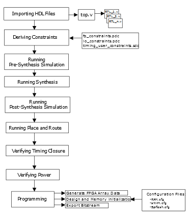

# HDL to Programming Flow

This section describes how the HDL to programming flow is executed in the Libero<br /> SoC Design Suite using Tcl. The following figure shows the Libero SoC HDL to<br /> programming flow.

As a best practice, the following resources are recommended in the top-level Tcl<br /> folder for building a Libero SoC project.



-   `parameters.tcl`: This Tcl file contains project variables as shown in the following snippet.

    ``` {#CODEBLOCK_D22_NYJ_4TB}
    
    set prj_family     "PolarFire";
    set prj_die        "MPF100T";
    set prj_package    "FCG484";
    set prj_speed      "-1";
    set prj_root       "top";
    ```

    **Tip:** Libero SoC tools profile can also be configured in the `parameters.tcl` file.

-   `src`: This folder contains all the required HDL, constraints, memory configuration, and stimulus source files required for a project.
-   `design.tcl`: This Tcl file imports all the HDL, constraints, memory configuration, and stimulus sources files. The following snippet shows a sample `design.tcl` file.

    ``` {#CODEBLOCK_L2T_S5R_4TB}
    
    import_files -hdl_source {./src/rtl_1.v} -library {work};
    import_files -hdl_source {./src/rtl2.v} -library {work};
    .
    .
    import_files -hdl_source {./src/top.v} -library {work};
    import_files -sdc {./src/constraint/timing_user_constraints.sdc};
    import_files -pdc {./src/constraint/io_constraints.pdc};
    import_files -pdc {./src/constraint/fp_constraints.pdc};
    import_files -stimulus {./src/stimulus/testbench_presynth.v} -library {stimulus};
    import_files -stimulus {./src/stimulus/testbench_postsynth.v} -library {stimulus};
    organize_tool_files -tool {SYNTHESIZE} \
     -file ./src/constraint/timing_user_constraints.sdc \
     -module {$prj_root} \
     -input_type {constraint}
    organize_tool_files -tool {PLACEROUTE} \
     -file ./src/constraint/timing_user_constraints.sdc \
     -file ./src/constraint/io_constraints.pdc \
     -file ./src/constraint/fp_constraints.pdc \
     -module {$prj_root} \
     -input_type {constraint}
    organize_tool_files -tool {VERIFYTIMING} \
     -file ./src/constraint/timing_user_constraints.sdc \
     -module {$prj_root} \
     -input_type {constraint}
    organize_tool_files \ 
    -tool {SIM_PRESYNTH} \
    -file {./src/stimulus/testbench_presynth.v}
    
    organize_tool_files \ 
    -tool {SIM_POSTSYNTH} \
    -file {./src/stimulus/testbench_postsynth.v}
    configure_ram -cfg_file {./src/src_cfg/RAM.cfg}
    configure_tool \
             -name {GENERATEPROGRAMMINGFILE} \
             -params {program_fabric:true} \
             -params {program_security:false} \
    	 -params {sanitize_snvm:false}
    associate_stimulus -file testbench.v -mode new -module stimulus
    ```

-   `libero.tcl`: This Tcl file executes the HDL to programming flow in Libero SoC.

**Tip:** In the `design.tcl` file, parameters for all the Libero SoC tools can be configured using the [configure\_tool](GUID-4CDDE07D-D551-40D3-935C-B898C0C5E53B.md) command.

**Parent topic:**[Building a Libero Design Using Tcl](GUID-05F3AA42-6941-47FC-B42B-E644BD610E81.md)

## Importing HDL Files

In this step, the following tasks are being executed:

1.  Creating a Libero SoC project.
2.  Importing all the HDL, constraints, and stimulus source files that are required for the project.
3.  Building the design hierarchy by defining the top module.

In `libero.tcl`, use the following commands to execute these tasks.

``` {#CODEBLOCK_TWV_5VJ_4TB}
source ./parameters.tcl;

set libero_cmd "new_project \
                -location {./exprj} -name {exprj} \
                -family {$prj_family} -die {$prj_die} -package {$prj_package} \
                -speed {$prj_speed} \
                -hdl {VERILOG}";

eval file delete -force ./exprj;

eval $libero_cmd;

source ./design.tcl;

build_design_hierarchy;

set_root $prj_root;
```

For more information about HDL commands, see the [HDL Tcl Commands](GUID-3294E455-71CE-460F-8C72-F36BDE261EA4.md).

## Deriving Constraints

In this step, timing constraints are derived. In `libero.tcl`, use the<br /> following command to derive timing constraints.

``` {#CODEBLOCK_CWL_FGK_4TB}
derive_constraints_sdc
```

For more information about applying constraints, see the [Derive Constraints Tcl Commands](GUID-EF4215C4-4E60-4551-BFBD-C4A85BEC13C2.md).

## Running Pre-Synthesis Simulation

In this step, the functionality of the HDL is verified before Synthesis using a test bench. In<br /> `libero.tcl`, use the following command to run pre-synthesis<br /> simulation.

``` {#CODEBLOCK_DFR_WCS_4TB}
run_tool -name {SIM_PRESYNTH}
```

As a best practice, use this command with the `catch` statement as shown<br /> in the following snippet.

``` {#CODEBLOCK_W4T_BKK_4TB}
if {[catch {run_tool -name {SIM_PRESYNTH}  }] } {
	  puts "SIM_PRESYNTH FAILED \n"
   } else {
	  puts "SIM_PRESYNTH PASSED \n"
   }  
```

For more information about adding pre-synthesis simulation parameters, see the [run\_tool](GUID-A66EA5DA-669A-4461-9639-D4E15DC41F3C.md) command.

## Running Synthesis

In this step, HDL is synthesized according to constraint files. In `libero.tcl`,<br /> use the following command to run Synthesis.

``` {#CODEBLOCK_DFR_WCS_4TB}
run_tool -name {SYNTHESIZE}
```

Use this command with the `catch` statement as shown in the following<br /> snippet.

``` {#CODEBLOCK_W4T_BKK_4TB}
if {[catch {run_tool -name {SYNTHESIZE}  }] } {
	  puts "SYNTHESIZE FAILED \n"
   } else {
	  puts "SYNTHESIZE PASSED \n"
   }  
```

For more information about adding Synthesis parameters, see the [run\_tool](GUID-A66EA5DA-669A-4461-9639-D4E15DC41F3C.md) command.

## Running Post-Synthesis Simulation

In this step, the functionality of the HDL is verified after Synthesis using a test bench. In<br /> `libero.tcl`, use the following command to run post-synthesis<br /> simulation.

``` {#CODEBLOCK_DFR_WCS_4TB}
run_tool -name {SIM_POSTSYNTH}
```

Use this command with the `catch` statement as shown in the following<br /> snippet.

``` {#CODEBLOCK_W4T_BKK_4TB}
if {[catch {run_tool -name {SYNTHESIZE}  }] } {
	  puts "SIM_POSTSYNTH FAILED \n"
   } else {
	  puts "SIM_POSTSYNTH PASSED \n"
   }  
```

For more information about adding Synthesis parameters, see the [run\_tool](GUID-A66EA5DA-669A-4461-9639-D4E15DC41F3C.md) command.

## Running Place and Route

In this step, HDL is placed and routed according to constraint files. In<br /> `libero.tcl`, use the following command to run Place and Route.

``` {#CODEBLOCK_ZJ1_JDS_4TB}
run_tool -name {PLACEROUTE}
```

Use this command with the `catch` statement as shown in the following<br /> snippet.

``` {#CODEBLOCK_W4T_BKK_4TB}
if {[catch {run_tool -name {PLACEROUTE}  }] } {
	  puts "PLACEROUTE FAILED \n"
   } else {
	  puts "PLACEROUTE PASSED \n"
   }   
```

For more information about adding Place and Route parameters, see the [run\_tool](GUID-A66EA5DA-669A-4461-9639-D4E15DC41F3C.md) command.

## Verifying Timing Closure

In this step, HDL is verified for timing closure. In `libero.tcl`, use the<br /> following command to run Timing Verification.

``` {#CODEBLOCK_YGJ_VDS_4TB}
run_tool -name {VERIFYTIMING}
```

Use this command with the catch statement as shown in the following snippet.

``` {#CODEBLOCK_W3X_SKK_4TB}
if {[catch {run_tool -name {VERIFYTIMING}  }] } {
	  puts "VERIFYTIMING FAILED \n"
   } else {
	  puts "VERIFYTIMING PASSED \n"
   }    
```

For more information about adding Verify Timing parameters, see the [run\_tool](GUID-A66EA5DA-669A-4461-9639-D4E15DC41F3C.md) command.

## Verifying Power

In this step, power verification is executed before generating the programming bit<br /> stream. In `libero.tcl`, use the following command for verifying the<br /> power consumption.

``` {#CODEBLOCK_RVH_HVK_4TB}
run_tool -name {VERIFYPOWER}
```

Use this command with the `catch` statement as shown in the following<br /> snippet.

``` {#CODEBLOCK_A25_22S_4TB}
if {[catch {run_tool -name {VERIFYPOWER}  }] } {
	  puts "VERIFYPOWER FAILED \n"
   } else {
	  puts "VERIFYPOWER PASSED \n"
   }  
```

For more information about adding Verify Power parameters, see the [run\_tool](GUID-A66EA5DA-669A-4461-9639-D4E15DC41F3C.md) command.

## Programming

In this step, the following tasks are executed:

1.  Generating the FPGA Array Data
2.  Configuring memories
3.  Generating initialization clients for configured memories
4.  Generating design initialization data
5.  Generating and exporting the programming bit stream \(`.stp` and `.job`\)

In `libero.tcl`, use the following commands to execute these tasks.

``` {#CODEBLOCK_C5J_KHS_4TB}
run_tool -name {GENERATEPROGRAMMINGDATA}
generate_design_initialization_data  
run_tool -name {GENERATEPROGRAMMINGFILE}

export_bitstream_file \
         -file_name {test} \
         -format {STP DAT PPD } \
         -limit_SVF_file_size 0 \
         -limit_SVF_file_by_max_filesize_or_vectors {SIZE} \
         -svf_max_filesize {1024} \
         -svf_max_vectors {1000} \
         -trusted_facility_file 1 \
         -trusted_facility_file_components {FABRIC SNVM} \
         -zeroization_likenew_action 0 \
         -zeroization_unrecoverable_action 0

export_prog_job \
         -job_file_name {test} \
         -bitstream_file_type {TRUSTED_FACILITY} \
         -bitstream_file_components {FABRIC SNVM} \
         -zeroization_likenew_action 0 \
         -zeroization_unrecoverable_action 0 \
         -program_design 1 \
         -program_spi_flash 0 \
         -design_bitstream_format {PPD}

close_project -save 1
```

Use these commands with the `catch` statement as shown in the following<br /> snippet.

``` {#CODEBLOCK_DVC_43S_4TB}
if {[catch {run_tool -name {GENERATEPROGRAMMINGDATA}  }] } {
	  puts "GENERATEPROGRAMMINGDATA FAILED \n"
   } else {
	  puts "GENERATEPROGRAMMINGDATA PASSED \n"
   }

if {[catch {generate_design_initialization_data}  }] } {
	  puts "DESIGN INITIALIZATION FAILED \n"
   } else {
	  puts "DESIGN INITIALIZATION PASSED \n"
   }        

if {[catch {run_tool -name {GENERATEPROGRAMMINGFILE}  }] } {
	  puts "GENERATEPROGRAMMINGFILE FAILED \n"
   } else {
	  puts "GENERATEPROGRAMMINGFILE PASSED \n"
   }
```

For more information about adding programming parameters, see the following.

-   [export\_bitstream\_file](GUID-6DCFF208-F1B4-464D-B861-5E946CF771E1.md)
-   [export\_prog\_job](GUID-E580E41E-F31C-4AC5-82E2-6E5B5A879B6B.md)
-   [run\_tool](GUID-A66EA5DA-669A-4461-9639-D4E15DC41F3C.md)
-   [generate\_design\_initialization\_data](GUID-29B0B2F1-E5DC-4F2B-BC7F-44EF742FDEEA.md)
-   [close\_project](GUID-A978A031-E455-4107-A0CA-62758AB277B0.md)

