# I/O

## BIBUF

Bidirectional Buffer.

 

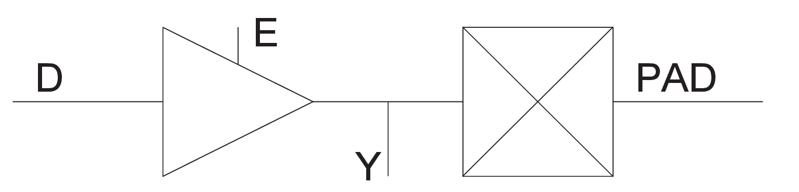

 

|Input|Output|
|-----|------|
|D, E, PAD|PAD, Y|

|MODE|E|D|PAD|Y|
|----|---|---|---|---|
|OUTPUT|1|D|D|D|
|INPUT|0|X|Z|X|
|INPUT|0|X|PAD|PAD|

## BIBUF\_DIFF

Bidirectional Buffer, Differential I/O.

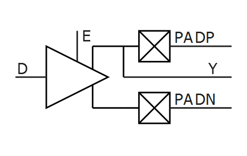

|Input|Output|
|-----|------|
|D, E, PADP, PADN|PADP, PADN, Y|

|MODE|E|D|PADP|PADN|Y|
|----|---|---|----|----|---|
|OUTPUT|1|0|0|1|0|
|OUTPUT|1|1|1|0|1|
|INPUT|0|X|Z|Z|X|
|INPUT|0|X|0|0|X|
|INPUT|0|X|1|1|X|
|INPUT|0|X|0|1|0|
|INPUT|0|X|1|0|1|

## CLKBIBUF

Bidirectional Buffer with Input to the global network.

 

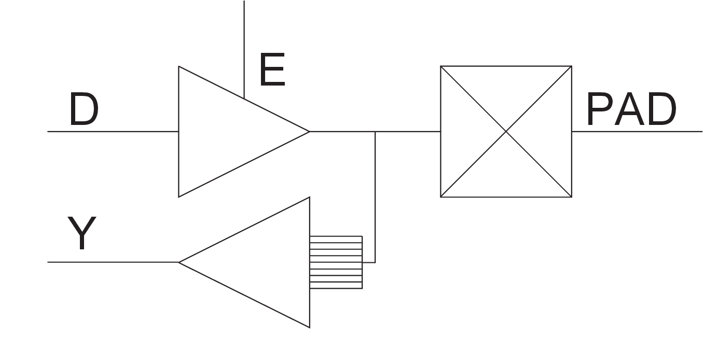

 

|Input|Output|
|-----|------|
|D, E, PAD|PAD, Y|

|D|E|PAD|Y|
|---|---|---|---|
|X|0|Z|X|
|X|0|0|0|
|X|0|1|1|
|0|1|0|0|
|1|1|1|1|

## CLKBUF

Input Buffer to the global network.

 

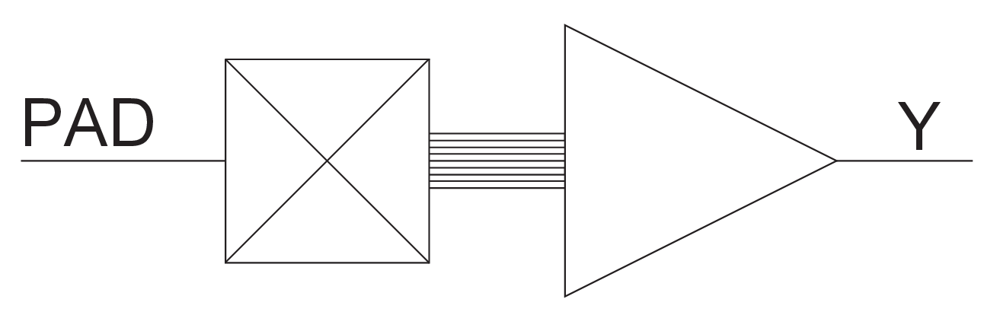

 

|Input|Output|
|-----|------|
|PAD|Y|

|PAD|Y|
|---|---|
|0|0|
|1|1|

## CLKBUF\_DIFF

Differential I/O macro to the global network, Differential I/O.

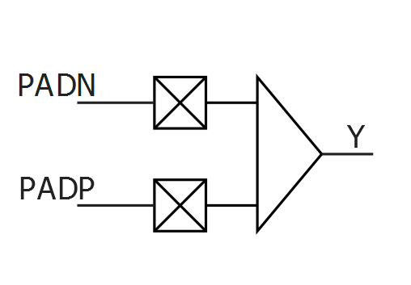

|Input|Output|
|-----|------|
|PADP, PADN|Y|

|PADP|PADN|Y|
|----|----|---|
|Z|Z|Y|
|0|0|X|
|1|1|X|
|0|1|0|
|1|0|1|

## DDR\_IN

The DDR\_IN macro is available for both pre-layout and post-layout simulation flows. It consists of two SLE macros and a latch.

The input D must be connected to an I/O.

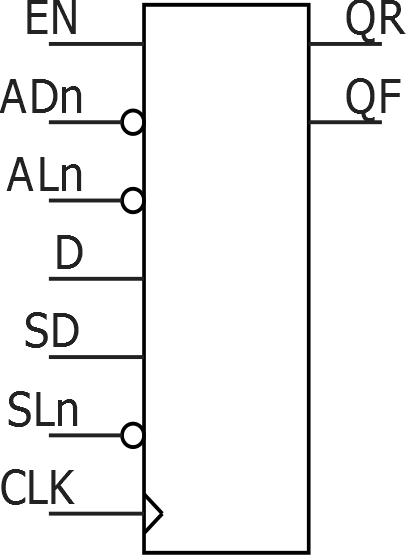

|Input|Output|
|Name|Function|Name|
|-----|------|
|----|--------|----|
|D|Data input|QRQF|
|CLK|Clock input|
|EN|Active-High CLK enable|
|ALn|Asynchronous load. This active-low signal either sets the register or clears the register depending on the value of ADn.|
|ADn[1](#GUID-462AB87F-B720-4C85-A5E6-CFCBFFCADD40)|Static asynchronous load data. When ALn is active, QR and QF go to the complement of ADn.|
|SLn|Synchronous load. This active-low signal either sets the register or clears the register depending on the value of SD, at the rising edge of CLK.|
|SD[1](#GUID-462AB87F-B720-4C85-A5E6-CFCBFFCADD40)|Static synchronous load data. When SLn is active \(low\), QR and QF go to the value of SD at the rising edge of CLK.|

1.  ADn and SD are static inputs defined at design time and must be tied to 0 or 1.

|ALn|CLK|EN|SLn|dfn+1 \(Internal Signal\)|QRn+1|QFn+1|
|---|---|---|---|-------------------------|-----|-----|
|0|X|X|X|!ADn|!ADn|!ADn|
|1|Not rising|X|X|dfn|QRn|QFn|
|1|—|0|X|dfn|QRn|QFn|
|1|—|1|0|dfn|SD|SD|
|1|—|1|1|dfn|D|dfn|
|1|↓|X|X|D|QRn|QFn|

## DDR\_OE\_UNIT

The DDR\_OE\_UNIT macro is an output DDR cell that is only available for  post-layout simulations. Every DDR\_OUT instance is replaced by DDR\_OE\_UNIT during compile.  The DDR\_OE\_UNIT macro consists of a DDR\_OUT macro with inverted data inputs and SDR  control.

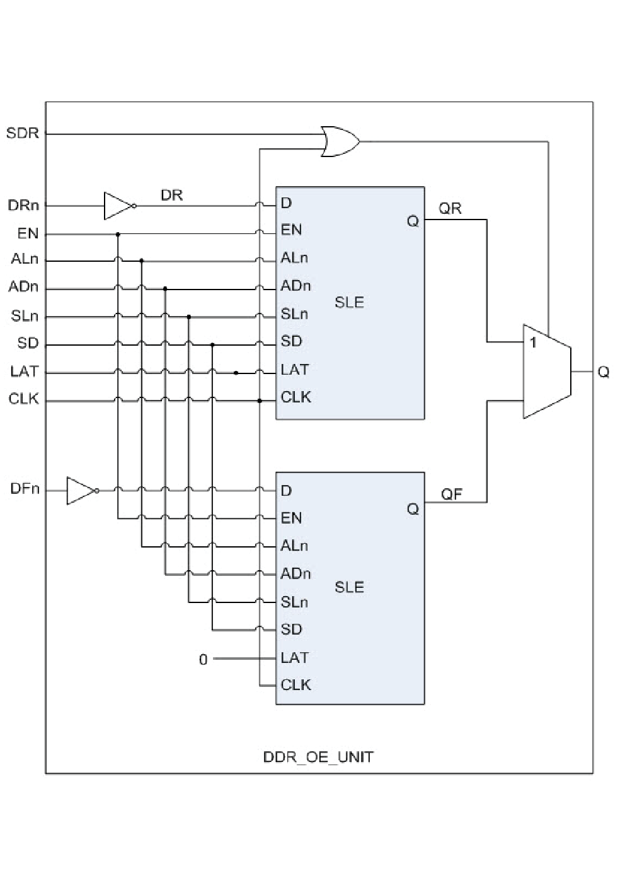

|Input|Output|
|Name|Function| |
|-----|------|
|----|--------|---|
|DRn|Data input \(Rising Edge\)|Q|
|DFn|Data input \(Falling Edge\)|
|CLK|Clock input|
|EN|Active-High CLK enable|
|ALn|Asynchronous load. This active-low signal  either sets the register or clears the register depending on the value of  ADn.|
|ADn|Static asynchronous load data. When ALn is active, Q goes to the complement of ADn.|
|SLn|Synchronous load. This active-Low signal  either sets the register or clears the register depending on the value of SD,  at the rising edge of CLK.|
|SD|Static synchronous load data. When SLn is  active \(low\), Q goes to the value of SD at the rising edge of CLK.|
|SDR|Controls whether the cell operates in DDR \(SDR = 0\) or SDR \(SDR = 1\) modes.|

|SDR|ALn|CLK|EN|SLn|QRn+1|QFn+1|Qn+1|
|---|---|---|---|---|-----|-----|----|
|0|0|X|X|X|!ADn|!ADn|!ADn|
|0|1|1|X|X|QRn|QFn|QRn|
|0|1|—|0|X|QRn|QFn|QRn+1|
|0|1|—|1|0|SD|SD|QRn+1|
|0|1|—|1|1|!DRn|!DFn|QRn+1|
|0|1|0|X|X|QRn|QFn|QFn|

## DDR\_OUT

The DDR\_OUT macro is an output DDR cell and is available for pre-layout  simulation. It consists of two SLE macros. The output Q must be connected to an I/O.

|Input|Output|
|Name|Function| |
|-----|------|
|----|--------|---|
|DR|Data input \(Rising Edge\)|Q|
|DF|Data input \(Falling Edge\)|
|CLK|Clock input|
|EN|Active-High CLK enable|
|ALn|Asynchronous load. This active-low signal either sets the  register or clears the register depending on the value of ADn.|
|ADn[1](#GUID-530909B6-40C9-423A-BC49-AC827AA2A26B)|Static asynchronous load data. When ALn is active, Q goes to the complement of ADn.|
|SLn|Synchronous load. This active-low signal either sets the  register or clears the register depending on the value of SD, at the  rising edge of CLK.|
|SD[1](#GUID-530909B6-40C9-423A-BC49-AC827AA2A26B)|Static synchronous load data. When SLn is active \(that is,  low\), Q goes to the value of SD at the rising edge of CLK.|

1.  ADn and SD are static inputs defined at design time and need to be tied to 0 or 1.

|ALn|CLK|EN|SLn|QRn+1|QFn+1|Qn+1|
|---|---|---|---|-----|-----|----|
|0|X|X|X|!ADn|!ADn|!ADn|
|1|1|X|X|QRn|QFn|QRn|
|1|—|0|X|QRn|QFn|QRn+1|
|1|—|1|0|SD|SD|QRn+1|
|1|—|1|1|DR|DF|QRn+1|
|1|0|X|X|QRn|QFn|QFn|

## GCLKBIBUF

Bidirectional I/O macro with gated input to the global network; the Enable  signal can be used to turn off the global network to save power.

 

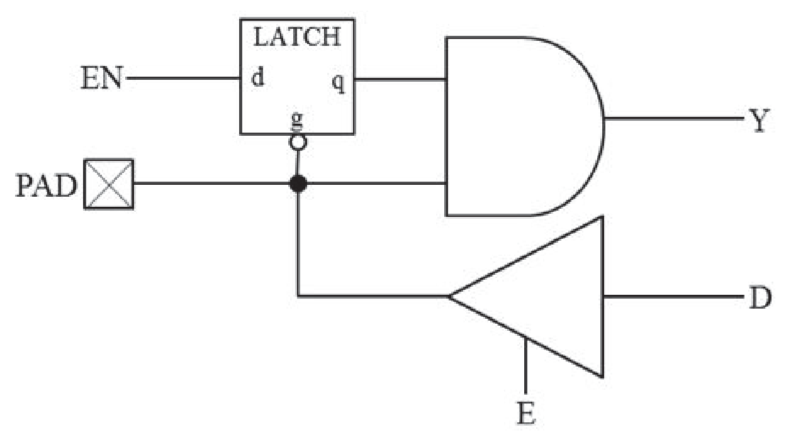

 

|Input|Output|
|-----|------|
|D, E, EN, PAD|Y, PAD|

|D|E|EN|PAD|q|Y|
|---|---|---|---|---|---|
|X|0|0|0|0|0|
|X|0|1|0|1|0|
|X|0|X|1|q|q|
|X|0|X|Z|X|X|
|0|1|0|0|0|0|
|0|1|1|0|1|0|
|1|1|X|1|q|q|

## GCLKBUF

Gated input I/O macro to the global network. The Enable signal can turn off the global network to save power.

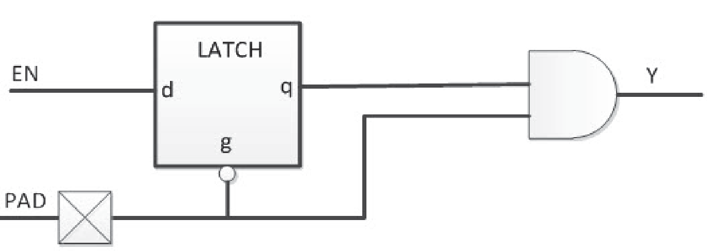

|Input|Output|
|-----|------|
|PAD, EN|Y|

|PAD|EN|q|Y|
|---|---|---|---|
|0|0|0|0|
|0|1|1|0|
|1|X|q|q|
|Z|X|X|X|

## GCLKBUF\_DIFF

Gated differential I/O macro to global network; the Enable signal can be  used to turn off the global network.

 

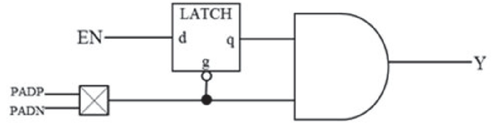

 

Differential

|Input|Output|
|-----|------|
|PADP, PADN, EN|Y|

|PADP|PADN|EN|q|Y|
|----|----|---|---|---|
|0|1|0|0|0|
|0|1|1|1|0|
|1|0|X|q|q|
|0|0|X|X|X|
|1|1|X|X|X|
|Z|Z|X|X|X|

## INBUF

Input Buffer.

 

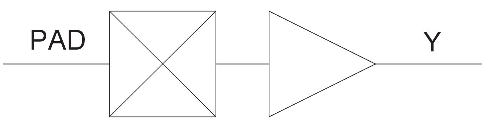

 

|Input|Output|
|-----|------|
|PAD|Y|

|PAD|Y|
|---|---|
|Z|X|
|0|0|
|1|1|

## INBUF\_DIFF

Input Buffer, Differential I/O.

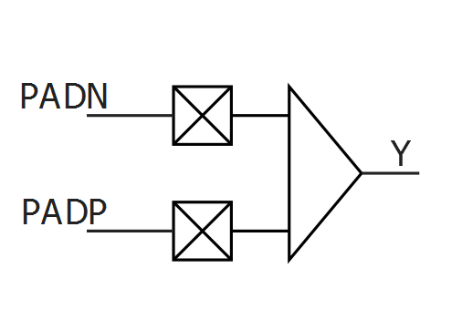

|Input|Output|
|-----|------|
|PADP, PADN|Y|

|PADP|PADN|Y|
|----|----|---|
|Z|Z|X|
|0|0|X|
|1|1|X|
|0|1|0|
|1|0|1|

## IOIN\_IB

Buffer macro available in post-layout netlist only.

 

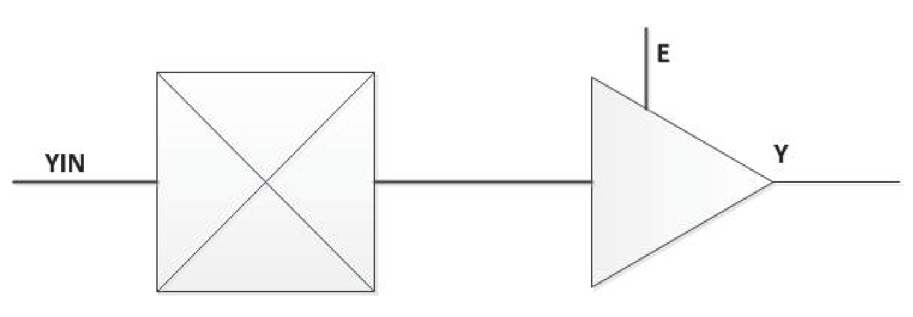

 

|Input|Output|
|-----|------|
|YIN, E|Y|

E input is not used.

|YIN|Y|
|---|---|
|Z|X|
|0|0|
|1|1|

## IOINFF

Registered input I/O macro available in post-layout netlist only.

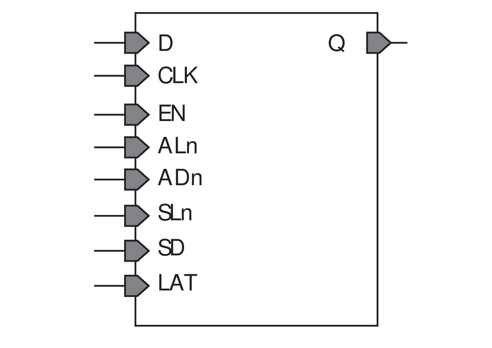

|Input|Output|
|-----|------|
|Name|Function|Q|
|D|Data|
|CLK|Clock|
|EN|Enable|
|ALn|Asynchronous Load \(Active-Low\)|
|ADn[1](#GUID-530909B6-40C9-423A-BC49-AC827AA2A26B)|Asynchronous Data \(Active-Low\)|
|SLn|Synchronous Load \(Active-Low\)|
|SD[1](#GUID-530909B6-40C9-423A-BC49-AC827AA2A26B)|Synchronous Data|
|LAT[1](#GUID-530909B6-40C9-423A-BC49-AC827AA2A26B)|Latch Enable|

1.  ADn, SD, and LAT are static signals defined at design time and must be tied to 0 or 1.

|ALn|ADn|LAT|CLK|EN|SLn|SD|D|Qn+1|
|---|---|---|---|---|---|---|---|----|
|0|ADn|X|X|X|X|X|X|!ADn|
|1|X|0|Not rising|X|X|X|X|Qn|
|1|X|0|—|0|X|X|X|Qn|
|1|X|0|—|1|0|SD|X|SD|
|1|X|0|—|1|1|X|D|D|
|1|X|1|0|X|X|X|X|Qn|
|1|X|1|1|0|X|X|X|Qn|
|1|X|1|1|1|0|SD|X|SD|
|1|X|1|1|1|1|X|D|D|

## IOOEFF

Registered output I/O macro available only in post-layout netlist. The  IOOEFF is an SLE with an inverted data input.

 

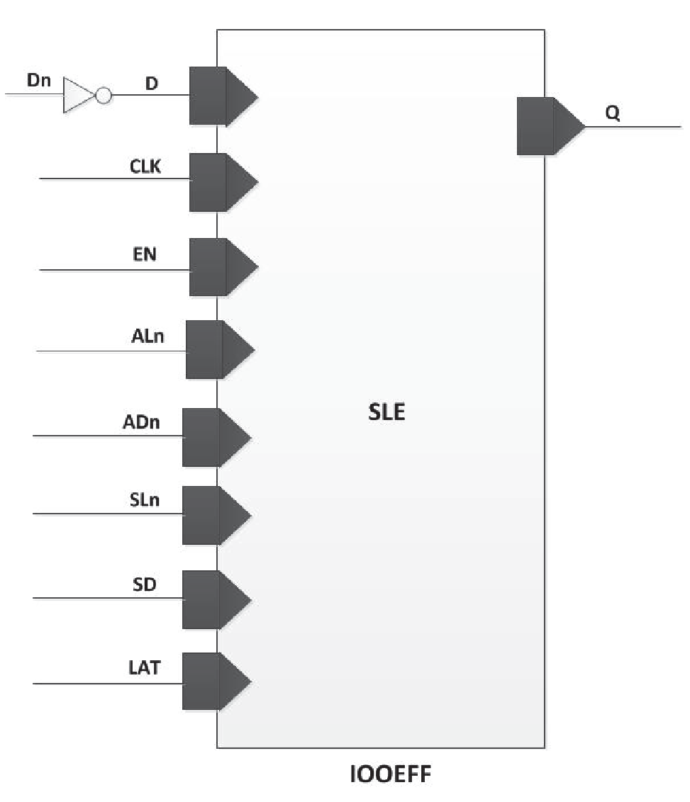

 

|Input|Output|
|-----|------|
|Name|Function|Q|
|D|Data|
|CLK|Clock|
|EN|Enable|
|ALn|Asynchronous Load \(Active Low\)|
|ADn[1](#GUID-3920B032-1A95-4362-8501-2BFBA553E09A)|Asynchronous Data \(Active Low\)|
|SLn|Synchronous Load \(Active Low\)|
|SD[1](#GUID-3920B032-1A95-4362-8501-2BFBA553E09A)|Synchronous Data|
|LAT[1](#GUID-3920B032-1A95-4362-8501-2BFBA553E09A)|Latch Enable|

**Note:**

1.  ADn, SD, and LAT are static signals defined at design time and need to be tied to 0 or 1.

|ALn|LAT|CLK|EN|SLn|Q|
|---|---|---|---|---|---|
|1|0|not rising|X|X|Q|
|1|0|rising|0|X|Q|
|1|0|rising|1|1|!Dn|
|1|0|rising|1|0|SD|
|0|0|X|X|X|!ADn|
|1|1|0|X|X|Q|
|1|1|1|0|X|Q|
|1|1|1|1|1|!Dn|
|1|1|1|1|0|SD|
|0|1|X|X|X|!ADn|

## IOPAD\_IN

Input I/O macro available in post-layout netlist only.

 

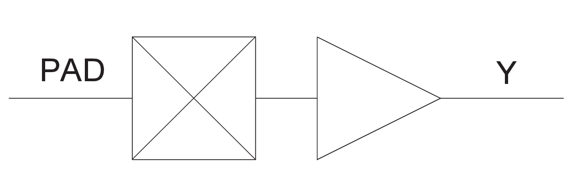

 

|Input|Output|
|-----|------|
|PAD|Y|

|PAD|Y|
|---|---|
|Z|X|
|0|0|
|1|1|

## IOPAD\_TRI

Tri-state output buffer available in post-layout netlist only.

 

 

|Input|Output|
|-----|------|
|D, E|PAD|

|D|E|PAD|
|---|---|---|
|X|0|Z|
|0|1|0|
|1|1|1|

## OUTBUF

Output buffer.

 

 

|Input|Output|
|-----|------|
|D|PAD|

|D|PAD|
|---|---|
|0|0|
|1|1|

## OUTBUF\_DIFF

Output buffer, Differential I/O.

|Input|Output|
|-----|------|
|D|PADP, PADN|

|D|PADP|PADN|
|---|----|----|
|0|0|1|
|1|1|0|

## TRIBUFF

Tristate output buffer.

 

 

|Input|Output|
|-----|------|
|D, E|PAD|

|D|E|PAD|
|---|---|---|
|X|0|Z|
|D|1|D|

## TRIBUFF\_DIFF

Tristate output buffer, Differential I/O.

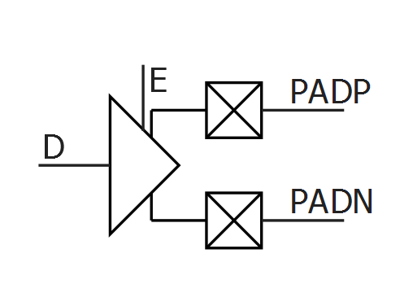

|Input|Output|
|-----|------|
|D, E|PADP, PADN|

|D|E|PADP|PADN|
|---|---|----|----|
|X|0|Z|Z|
|0|1|0|1|
|1|1|1|0|

## UJTAG

The UJTAG macro is a special purpose macro. It allows access to the user JTAG circuitry on board the chip.

You must instantiate a UJTAG macro in your design if you plan to make use of the user JTAG feature. The TMS, TDI, TCK, TRSTB, and TDO pins of the macro must be connected to top level ports of the design.

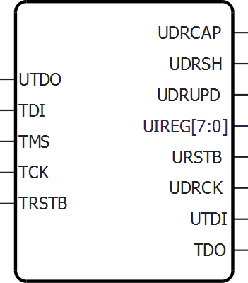

<table id="ID-00000EFB"><thead><tr id="ID-00000F06"><th id="ID-00000F07">

Port

</th><th id="ID-00000F09">

Direction

</th><th id="ID-00000F0B">

Polarity

</th><th id="ID-00000F0D">

Description

</th></tr></thead><tbody><tr id="ID-00000F10"><td id="ID-00000F11">

UIREG\[7:0\]

</td><td id="ID-00000F13">

Output

</td><td id="ID-00000F15">

—

</td><td id="ID-00000F17">

This 8-bit bus carries the contents of the JTAG instruction register of each device. Instruction values 16 to 127 are not reserved and can be employed as user-defined instructions.

</td></tr><tr id="ID-00000F19"><td id="ID-00000F1A">

URSTB

</td><td id="ID-00000F1C">

Output

</td><td id="ID-00000F1E">

Low

</td><td id="ID-00000F20">

URSTB is an Active-Low signal and is asserted when the TAP controller is in Test-Logic-Reset mode. URSTB is asserted at power-up, and a Power-on Reset signal resets the TAP controller state.

</td></tr><tr id="ID-00000F22"><td id="ID-00000F23">

UTDI

</td><td id="ID-00000F25">

Output

</td><td id="ID-00000F27">

—

</td><td id="ID-00000F29">

This port is directly connected to the TAP's TDI signal.

</td></tr><tr id="ID-00000F2B"><td id="ID-00000F2C">

UTDO

</td><td id="ID-00000F2E">

Input

</td><td id="ID-00000F30">

—

</td><td id="ID-00000F32">

This port is the user TDO output. Inputs to the UTDO port are sent to the TAP TDO output MUX when the IR addess is in user range.

</td></tr><tr id="ID-00000F34"><td id="ID-00000F35">

UDRSH

</td><td id="ID-00000F37">

Output

</td><td id="ID-00000F39">

High

</td><td id="ID-00000F3B">

Active-High signal enabled in the Shift\_DR TAP state.

</td></tr><tr id="ID-00000F3D"><td id="ID-00000F3E">

UDRCAP

</td><td id="ID-00000F40">

Output

</td><td id="ID-00000F42">

High

</td><td id="ID-00000F44">

Active-High signal enabled in the Capture\_DR\_TAP state.

</td></tr><tr id="ID-00000F46"><td id="ID-00000F47">

UDRCK

</td><td id="ID-00000F49">

Output

</td><td id="ID-00000F4B">

—

</td><td id="ID-00000F4D">

This port is directly connected to the TAP's TCK signal.**Note:** UDRCK must be connected to a global macro such as CLKINT. If this is not done, Synthesis/Compile will add it to the netlist to legalize it.

</td></tr><tr id="ID-00000F50"><td id="ID-00000F51">

UDRUPD

</td><td id="ID-00000F53">

Output

</td><td id="ID-00000F55">

High

</td><td id="ID-00000F57">

Active-High signal enabled in the Update\_DR\_TAP state.

</td></tr><tr id="ID-00000F59"><td id="ID-00000F5A">

TCK

</td><td id="ID-00000F5C">

Input

</td><td id="ID-00000F5E">

—

</td><td id="ID-00000F60">

Test Clock. Serial input for JTAG boundary scan, ISP, and  UJTAG. The TCK pin does not have an internal pull-up/pull-down resistor.  Connect TCK to GND or +3.3V through a resistor \(500-1 KΩ\) placed closed  to the FPGA pin to prevent totem-pole current on the input buffer and  TMS from entering into an undesired state.If JTAG is  not used, connect it to GND.

</td></tr><tr id="ID-00000F64"><td id="ID-00000F65">

TDI

</td><td id="ID-00000F67">

Input

</td><td id="ID-00000F69">

—

</td><td id="ID-00000F6B">

Test Data In. Serial input for JTAG boundary scan. There is an internal weak pull-up resistor on the TDI pin.

</td></tr><tr id="ID-00000F6D"><td id="ID-00000F6E">

TDO

</td><td id="ID-00000F70">

Output

</td><td id="ID-00000F72">

—

</td><td id="ID-00000F74">

Test Data Out. Serial output for JTAG boundary scan. The TDO pin does not have an internal pull-up/pull-down resistor.

</td></tr><tr id="ID-00000F76"><td id="ID-00000F77">

TMS

</td><td id="ID-00000F79">

Input

</td><td id="ID-00000F7B">

—

</td><td id="ID-00000F7D">

Test mode select. The TMS pin controls the use of the IEEE®1532 boundary scan pins \(TCK, TDI, TDO, and TRST\).  There is an internal weak pull-up resistor on the TMS pin.

</td></tr><tr id="ID-00000F7F"><td id="ID-00000F80">

TRSTB

</td><td id="ID-00000F82">

Input

</td><td id="ID-00000F84">

Low

</td><td id="ID-00000F86">

Test reset. The TRSTB pin is an active-low input. It  synchronously initializes \(or resets\) the boundary scan circuitry. There  is an internal weak pull-up resistor on the TRSTB pin.To hold the JTAG in reset mode and prevent it from  entering into undesired states in critical applications, connect  TRSTB to GND through a 1 KΩ resistor \(placed close to the FPGA  pin\).

</td></tr></tbody>
</table>