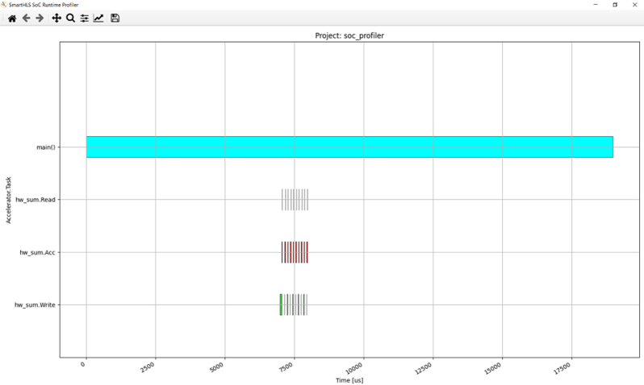
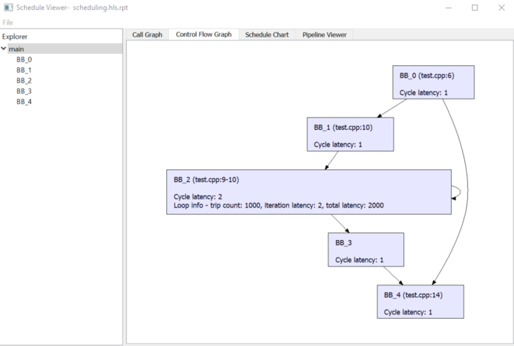
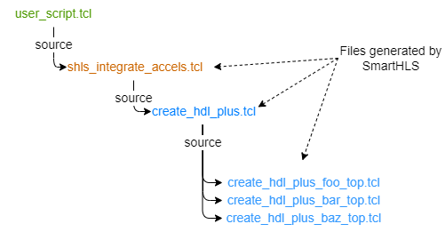

# User Guide

## Introduction to High-Level Synthesis

High-level synthesis \(HLS\) refers to the synthesis of a hardware circuit from a software program specified in a high-level language, where the hardware circuit performs the same functionality as the software program. For SmartHLS™, the input is a C/C++-language program, and the output is a circuit specification in the Verilog hardware description language. The SmartHLS-generated Verilog can be given to Libero to be programmed on a Microchip FPGA. The underlying motivation for HLS is to raise the level of abstraction for hardware design, by allowing software methodologies to be used to design hardware. This can help to shorten design cycles, improve design productivity and reduce time-to-market.

While a detailed knowledge of HLS is not required to use SmartHLS, it is worthwhile to highlight the key steps involved in converting software to hardware. The four main steps involved in HLS are allocation, scheduling, binding, and RTL generation, which runs one after another \(for example, binding runs after scheduling is done\).

Allocation
:   The allocation step defines the constraints on the generated hardware, including the number of hardware resources of a given type that are used \(for example, how many divider units are used, the number of RAM ports and so on\), as well as the target clock period for the hardware, and other user-supplied constraints.

Scheduling
:   Software programs are written without any notion of a clock or finite state machine \(FSM\). The scheduling step of HLS bridges this gap, by assigning the computations in the software to occur in specific clock cycles in hardware. With the user-provided target clock period constraint \(for example, 10 ns\) scheduling will assign operations into clock cycles such that the operations in each cycle does not exceed the target clock period, in order to meet the user constraint. In addition, the scheduling step will ensure that the data-dependencies between the operations are met.

Binding
:   While a software program contains an arbitrary number of operations of a given type \(for example, multiplications\), the hardware contains only a limited number of units capable of performing such a computation. The binding step of HLS is to associate \(bind\) each computation in the software with a specific unit in the hardware.

RTL generation
:   Using the analysis from the previous steps, the final step of HLS is to generate a description of the circuit in a hardware description language \(Verilog\).

Executing computations in hardware brings speed and energy advantages over performing the same computations in software running on a processor. The underlying reason for this is that the hardware is dedicated to the computational work being performed, whereas a processor is generic and has the inherent overheads of fetching/decoding instructions, loading/storing from/to memory, etc. Further acceleration is possible by exploiting hardware parallelism, where computations can concurrently. With SmartHLS, one can exploit four styles of hardware parallelism, which are instruction-level, loop-level, thread-level, and function-level parallelism.

### Instruction-level Parallelism

Instruction-level parallelism allows for the simultaneous execution of computations for instructions by analyzing data dependencies. Computations that are independent of each other can be executed concurrently. For example, the following code snippet performs three addition operations:

``` {#CODEBLOCK_ZM5_VNP_BYB .language-cpp}
z = a + b;
x = c + d;
q = z + x;
...
```

Observe that the first and second additions do not depend on one another. These additions can therefore be executed concurrently, as long as there are two adder units available in the hardware. SmartHLS™ automatically analyzes the dependencies between computations in the software to exploit instruction-level parallelism in the generated hardware. The user does not need to do anything. In the above example, the third addition operation depends on the results of the first two, and hence, its execution cannot be done in parallel with the others. Instruction-level parallelism is referred to as fine-grained parallelism, as concurrency is achieved at a fine-grained level \(instruction-level\) of granularity.

### Loop-level Parallelism

In software, the majority of runtime can be spent on loops, where loop iterations execute<br /> sequentially. That is, loop iteration *i* needs to finish before iteration *i + 1* can start. With SmartHLS™, it is possible to overlap the<br /> execution of a loop iteration with another iterations using a technique called *loop pipelining* \(see [Loop Pipelining](Chunk120481216.md#)\). Now, imagine a<br /> loop with *N* iterations, where each iteration takes 100 clock cycles to complete.<br /> In software, this loop would take *100N* clock cycles to execute. With loop<br /> pipelining in hardware, the idea is to execute a portion of a loop iteration *i*<br /> and then commence executing iteration *i + 1* even before iteration *i* is<br /> complete. If loop pipelining can commence a new loop iteration *every* clock<br /> cycles, then the total number of clock cycles required to execute the entire loop will<br /> be *100 + \(N-1\)* cycles -- a significant reduction relative to *100N*. The<br /> \(N-1\) cycles is because each successive loop iteration start 1 cycle after the previous<br /> iteration, hence the last loop starts after \(N-1\) cycles.

A user can specify a loop to be pipelined with the use of the loop pipeline pragma. By default, a loop is not pipelined automatically.

### Thread-level Parallelism

Modern CPUs have multiple cores that can be used to concurrently execute multiple threads in software. Threads are widely used in C/C++, where, parallelism is realized at the granularity of entire C/C++ functions. Hence thread-level parallelism is referred to as coarse-grained parallelism since one or more functions execute in parallel. SmartHLS™ supports hardware synthesis of `hls::threads`, where concurrently executing threads in software are synthesized into concurrently executing hardware units \(see [Multi-threading with SmartHLS Threads](Chunk120481216.md#)\). This allows a software developer to take advantage of spatial parallelism in hardware using a familiar parallel programming paradigm in software. Moreover, the parallel execution behaviour of threads can be debugged in software, it is considerably easier than debugging in hardware.

In a multi-threaded software program, synchronization between the threads can be important, with the most commonly used synchronization constructs being mutexes and barriers. SmartHLS supports the synthesis of mutexes and barriers into hardware.

### Data Flow \(Streaming\) Parallelism

The second style of coarse-grained parallelism is referred to as *data flow* parallelism. This form of parallelism arises frequently in *streaming* applications, and are commonly used for video/audio processing, machine learning, and computational finance. In such applications, there is a stream of input data that is fed into the application at regular intervals. For example, in an audio processing application, a digital audio sample may be given to the circuit every clock cycle. In streaming applications, a succession of computational tasks is executed on the stream of input data, producing a stream of output data. For example, the first task may be to filter the input audio to remove high-frequency components. Subsequently, a second task may receive the filtered audio, and boost the bass low-frequency components. Observe that, in such a scenario, the two tasks may be overlapped with one another. Input samples are continuously received by the first task and given to the second task.

SmartHLS™ provides a way for a developer to specify data flow parallelism through the use of function pipelining \(see [Function Pipelining](Chunk120481216.md#)\) and/or threads \(see [Data Flow Parallelism with SmartHLS Threads](Chunk120481216.md#)\) with SmartHLS's FIFO library \(see [Streaming Library](Chunk120481216.md#)\) used to connect the streaming modules.

## SmartHLS Overview

SmartHLS™ accepts a C/C++ software program as input and automatically generates hardware described in Verilog HDL \(hardware description language\) that can be programmed onto a Microchip FPGA. The generated hardware can be imported as an HDL+ component into SmartDesign with a Tcl script that is also generated by SmartHLS. SmartHLS also generates a C++ accelerator driver API that can be used to control the generated hardware from an embedded processor. Optionally, SmartHLS can combine user code with the accelerator driver API and cross-compile it into a binary that can run on a RISC-V processor in an SoC design.


In a software program, user first needs to specify a top-level function \(during project creation in the SmartHLS IDE or in the source code with our pragma, `#pragma HLS function top` \). Please refer to the [Specifying the Top-level Function](Chunk120481216.md#) section for more details on specifying the top-level function.

Then the following button, `Compile Software to Hardware` can be clicked to compile software to hardware:


This will compile the top-level function and all of its descendant functions into hardware. The rest of the program \(outside the top-level function\) is considered as the software test bench, to give inputs into the top-level function and verify outputs from the top-level function \(and its descendants\). The software testbench is used to automatically generate the RTL testbench and stimulus for [Simulate HLS Hardware \(SW/HW Co-Simulation\)](Chunk120481216.md#).

Alongside the generated hardware, the `Compile Software to HLS Hardware` button will also generate the C++ driver functions \(see [API Driver Functions for AXI4 Target](Chunk120481216.md#)\), which can be combined with the software test bench and to produce code that can run on the processor in an SoC system and control the generated hardware. There are also optional SoC-related features offered by SmartHLS, such as generation of a reference SoC and automatic combination and cross-compilation of the software test bench and accelerator drivers for that reference SoC.

**Related Links**  


[Simulate HLS Hardware \(SW/HW Co-Simulation\)](Chunk120481216.md#)

[API Driver Functions for AXI4 Target](Chunk120481216.md#)

## SmartHLS SoC Flow

SmartHLS™ automatically generates a RISC-V processor/accelerator SoC for the PolarFire® SoC device on the Icicle Kit and the PolarFire Video<br /> Kit.

**Related Links**  


[SoC Features](Chunk120481216.md#)

## SmartHLS Pragmas

Pragmas are applied to the software code by the user to apply HLS optimization techniques and/or guide the compiler for hardware generation. They are applied directly on the applicable software construct \(for example, function, loop, argument, array\) to specify a certain optimization for them. For example, to apply pipelining on a loop:

```language-cpp
#pragma HLS loop pipeline
for (i = 1; i < N; i++) {
    a[i] = a[i-1] + 2
}
```

For more information on the supported pragmas, see [SmartHLS Pragmas Manual](Chunk1258399261.md#). For more information on loop pipelining, see [Loop Pipelining](Chunk120481216.md#).

## SmartHLS Constraints

SmartHLS™ also supports user constraints to guide hardware generation. Whereas pragmas are applied directly on the source code for optimizations that are specific and local to the software construct that it is being applied on \(function, loop, memory, argument, and so on\), constraints are used for settings that will be globally applied to the entire program \(for example setting the target FPGA, target clock period\).

Each project specifies its constraints in the<br /> `config.tcl` file in the project<br /> directory. This file is automatically generated by<br /> the SmartHLS IDE. To modify the constraints,<br /> click the `HLS Constraints`<br /> button:


The following window will open:


You can add, edit, or remove constraints from this window.<br /> Select a constraint type from the first drop-down<br /> menu. If you want more information about a<br /> constraint, click the Help button, which will open<br /> the corresponding [Constraints Manual](Chunk1590600802.md#)<br /> page.

An important constraint is the target clock period \(shown as `Set target clock period` in the drop-down menu\). With this constraint, SmartHLS schedules the operations of a program to meet the specified clock period. When this constraint is not given, SmartHLS uses the default clock period for each device, as shown below.

|FPGA Vendor|Device|Default Clock Frequency \(MHz\)|Default Clock Period \(ns\)|
|-----------|------|-------------------------------|---------------------------|
|Microchip|PolarFire®|100|10|
|Microchip|SmartFusion2|100|10|

Details of all SmartHLS constraints are given in the [Constraints Manual](Chunk1590600802.md#).

## Specifying the Top-level Function

When compiling software to HLS hardware with SmartHLS™, you must specify the top-level function for your program. Then SmartHLS will compile the specified top-level function and all of its descendant functions to hardware. The remainder of the program \(for example, parent functions of the top-level function, typically the `main` function\) becomes a software testbench that is used for [Simulate HLS Hardware \(SW/HW Co-Simulation\)](Chunk120481216.md#). The top-level function is specified with the pragma, `#pragma HLS function top`, directly on the source code, below the function prototype, as shown below:

``` {#PRE_U5B_WBB_DZB .language-cpp}
void hw_top(int a, int b) {
   #pragma HLS function top
   ...
   ...
}
```

## Simulate HLS Hardware \(SW/HW Co-Simulation\)

The circuit generated by SmartHLS™ should be functionally equivalent to the input software. Users should not modify the generated Verilog, as it is overwritten every time SmartHLS is recompiled.

SW/HW co-simulation can be used to verify that the generated hardware produces the same outputs for the same inputs as software. With SW/HW co-simulation, user does not have to write their own RTL testbench, as it is automatically generated. If user already has their own custom RTL testbench, one can optionally choose their custom RTL testbench \([Specifying a Custom Test Bench](Chunk120481216.md#)\) and not use SW/HW co-simulation.

To use SW/HW co-simulation, the input software program will be composed of two parts,

-   A top-level function \(and its descendant functions\) to be synthesized to hardware by SmartHLS,
-   A C/C++ testbench \(the parent functions of the top-level function, typically `main()`\) that invokes the top-level function with test inputs and verifies outputs.

SW/HW co-simulation consists of the following automated steps:

1.  SmartHLS runs your software program and saves all the inputs passed to the top-level function.

2.  SmartHLS automatically creates an RTL testbench that reads in the inputs from step 1 and passes them into the SmartHLS-generated hardware module.

3.  ModelSim simulates the testbench and saves the SmartHLS-generated module outputs.

4.  SmartHLS runs your software program again, but uses the simulation outputs as the output of your top-level function.


You should write your C/C++ test bench such that the `main()` function returns a 0 when all outputs from the top-level function are as expected and otherwise return a nonzero value up to 255. We use this return value to determine whether the SW/HW co-simulation has passed.

In Step 1, we verify that the program returns 0.

In Step 4, we run the program using the outputs from simulation and if the SmartHLS-generated circuit matches the C program then `main()` should still return 0.

If the C/C++ program matches the RTL simulation then you should see: `SW/HW co-simulation: PASS`

**Warning:** The return value of the `main()` function must be within the range of 0 to 255. If the return value is greater than 255, only the lower 8 bits will be used as the return code. For example, a return value of 257 or 1025 will be considered as failed since their lower 8 bits equal to 1, but values such as 256, 512 and 1024 will be considered as passed since their lower 8 bits equal to 0.

For any values that are shared between software test bench and hardware functions \(top-level and descendants\), you can either pass in as arguments into the top-level function, or if it is a global variable, it can be directly accessed without being passed in as an argument. Any variables that are accessed by both software test bench and hardware functions will create an interface at the top-level module. For example, if there is an array that is initialized in the software test bench and is used as an input to the hardware function, you may pass the array as an argument into the top-level function, which will create a memory interface for the array in the hardware core generated by SmartHLS. Arguments into the top-level function can be constants, pointers, arrays, and FIFO data types. The top-level function can also have a return value.

For more information,see SmartHLS IDE, `C++ Canny Edge Detection (SW/HW Co-Simulation)`, as a reference.

If a top-level argument is coming from a dynamically allocated array \(for example, malloc\), the size of the array \(in bytes\) must be specified with our `interface` pragma \(for example,`#pragma HLS interface argument(<arg_name>) depth(<int>)`\). For more information, see [Memory Interface for Pointer Argument/Global Variable](Chunk1258399261.md#). The sizes of arrays that are statically allocated do not need to be specified with the pragma, as SmartHLS will automatically determine them.

For debugging purposes, SmartHLS converts any C `printf` statements into Verilog `$write` statements so that values printed during software execution will also be printed during hardware simulation. This allows easy verification of the correctness of the hardware circuit. Verilog `$write` statements are unsynthesizable and will not affect the final FPGA hardware.

To specify the arguments to be passed to the software test bench \(for example, `int main(int argc, char *argv[])`\), a Makefile argument `PROGRAM_ARGUMENTS` can be defined in a `makefile.user` file \(you need to create the file in the SmartHLS project folder\). For example, if a software test bench takes in two arguments, an input BMP file and a golden output BMP file, you would specify the following in the `makefile.user` file.

```language-cpp
PROGRAM_ARGUMENTS = input_file.bmp golden_output_file.bmp
```

**Important:** Co-simulating multiple top-level modules:

-   Co-simulation supports verifying multiple top-level modules simultaneously. Each top-level module is verified solely based on the corresponding top-level function's input and expected output gathered from the software test bench. However the Co-simulation test bench will simulate all top-level modules simultaneously with the same clock.
-   If the user wants to verify a single top-level module, the `top` pragma should be only added for the desired function in the source code.

**Important:** Limitations:

-   When function pipelining is used, the top-level function cannot have array interfaces \(array arguments or global arrays that are accessed from both SW test bench and HW functions\).
-   When multi-threading is used \(For more information,see [Multi-threading with SmartHLS Threads](Chunk120481216.md#)\), Co-Simulation can only support the case when all threads are joined in the functions where the threads are forked. Free-running threads \(that are continuously running and never joined\) are not supported by SW/HW Co-Simulation.

## Automatic On-Chip Instrumentation

### Introduction

SmartHLS™ introduces the Automatic On-Chip Instrumentation feature, which streamlines the instrumentation process, enhancing visibility into HLS-generated modules for effective debugging and verification. This feature also offers valuable insights into the design's operation.

On-Chip debugging serves as a vital complement to simulation debugging, enabling the detection of errors that occur with real data inputs, which may not be anticipated when using simulation test vectors. This is particularly useful when dealing with extensive datasets, such as prolonged video sequences. Additionally, it accounts for physical variables that only impact a design when executed on an actual board, such as temperature fluctuations, voltage changes, and interactions with other board components \(e.g., DDR chips, Ethernet, HDMI cables, power regulators\) or with other modules during system-level integration.

On-Chip debugging is an established method typically involving the deployment of probes or on-chip logic analyzers connected to specific design signals for waveform analysis. SmartHLS's Automatic On-Chip Instrumentation simplifies this process by providing a high-level instrumentation abstraction that integrates with existing tools like Synopsys Identify. \(For more information, see [Microchip Products page](https://www.microchip.com/en-us/products/fpgas-and-plds/fpga-and-soc-design-tools/programming-and-debug/identify-me).\)

SmartHLS now offers automatic instrumentation capabilities for:

-   The input and output ports of modules generated by SmartHLS.
-   The input and output ports, as well as the occupancy levels, of all FIFOs within the SmartHLS design.

This feature enables users to monitor the data exchange within SmartHLS modules and observe the information flow through function pipelines<br /> and dataflow designs that communicate via FIFOs. The following diagram illustrates the<br /> potential instrumentation points within the HLS-generated design, including AXI Stream,<br /> AXI Memory Mapped and Simple ports, as well as internal FIFO signals.


**Tip:** A full example showing how to use the SmartHLS Automatic On-Chip Instrumentation feature is available on Github at [https://github.com/MicrochipTech/fpga-hls-examples/tree/main/auto\_instrument](https://github.com/MicrochipTech/fpga-hls-examples/tree/main/auto_instrument).

#### Configuration File

To simplify the instrumentation process, SmartHLS takes inspiration from the software debugging technique that allow users to pass command-line options, such as `-v, -vv, -vvv` for "verbose", "very verbose" or "very very verbose". In software, increasing the verbosity will print an increasing number of debug messages. Similarly, SmartHLS uses log levels to determine how much instrumentation is required. This provides an easy and convenient way to adjust the trade-off between resources and visibility because the more instrumentation is requested the more resources on the FPGA will be required for instrumentation. This log level is specified in a configuration file called `instrument_init.json`that must be placed under the SmartHLS project directory.

Instrumentation can be enabled by running the `shls instrument_init` command, which will automatically generate the instrumentation configuration file with some default values that can be adjusted manually by the user as required. Here is an example of the file assuming there are two SmartHLS top-level modules called "my\_top\_level\_module\_1" and "my\_top\_level\_module\_2":

```language-cpp
{
    "modules": {
        "my_top_level_module_1": {
            "log_level": "1",
            "fifo_log_level": "0"
        },
        "my_top_level_module_2": {
            "log_level": "2",
            "fifo_log_level": "1"
        }
    },
    "dashboard": {
        "max_iterations": -1,
        "show_markers": 1,
        "monitoring_mode": 0,
        "waveform_period": "5"
    },
    "iice_options": {
        "sample_buffer_depth": 1024,
        "iice_name": "my_dbg_hls_IICE"
    }
}
```

The following table describes the parameters of the `instrument_init.json` file.

|Option|Description|
|------|-----------|
|modules|Group all the settings for each top-level module|
|log\_level|Specifies what in/out ports of the module get instrumented:0: No instrumentation.1: The tool instruments all simple ports and only AXI handshaking signals \(i.e. valid/ready\). Tries to reduce resource overhead when using AXI interfaces.2: \(Default\) the tool instruments all the ports from log level 1, plus the AXI data and address ports. Meant to provide a balanced approach.3: In log level 3, the tool instruments all the ports of the module. Will require the most resources but provides maximum visibility on all ports.See Table   2<br /> for a list of AXI signals that will be instrumented at each<br /> log level.By default, this is set to 2 for all modules.|
|fifo\_log\_level|Specifies what visibility is desired for all FIFOs in the SmartHLS modules.0: \(Default\) No instrumentation. 1: Only FIFO full, empty and occupancy \(number of words in the FIFO\) are instrumented.2: Signals included in FIFO\_LOG\_LEVEL=1 plus FIFO write\_enable, read\_enable, write\_data and read\_data.3: All FIFO signals. This include almost\_full, almost\_empty, among others. By default, this is set to 0 for all modules.|
|dashboard|Group all monitoring mode related settings. For more information on the monitoring mode, see [Modes](Chunk120481216.md#).|
|max\_iterations|Specifies how many times the debugger should be run. If set to -1, the debugger will run infinitely. Only applicable when using the monitoring mode. The default value is -1.|
|show\_markers|Toggles whether markers should be drawn in the waveform when a captured sample dump ends. Only applicable when using the monitoring mode.The default value is 1.|
|monitoring\_mode|1: Monitoring mode0: \(Default\) Debugging modeSee the Monitoring/Debugging modes section for more information.|
|waveform\_period|The waveform period in nanoseconds that Identify will use when writing captured samples to a VCD file. By default, this is set to the period of the HLS module.|
|iice\_options|Group all settings related to the automatically generated IICE|
|sample\_buffer\_depth|The depth \(number of samples\) of the IICE generated for the HLS project. There is one IICE per SmartHLS project. The default value is 1024.|
|iice\_name|The name of the IICE generated for the SmartHLS project. If this is an empty string, the name of the IICE will be IICE\_\[HLS project folder name\].This is left empty by default.|

For the AXI standard interfaces used in the SmartHLS-generated Verilog module, the following table shows the list of AXI signals that will be instrumented at each log level.

|Log Level|AXI Memory-Map and AXI Stream Signals that will be Instrumented|
|---------|---------------------------------------------------------------|
|1|valid, ready|
|2|addr, data, len, burst, size, strb|
|3|All the signals|

### Modes

SmartHLS™ supports two debugging modes, the **debugging mode**and the **monitoring mode**. These two modes are mutually exclusive, and users can toggle between both modes by changing the `monitoring_mode` variable in `update_vcd.tcl` to 1 for monitoring mode and to 0 for debugging mode.

#### Debugging Mode

This mode is for interactive on-chip debugging, which is the most common and typical way to interact with on-chip instrumentation. In this mode, users are responsible for running the debugger, setting, and arming triggers in the Identify\_debugger tool. For example, a trigger condition could be set when an AXI valid signal is asserted high. Once the trigger happens, Identify\_debugger will generate `.vcd` file\(s\) and SmartHLS users can source the `update_vcd.tcl` script in ModelSim to refresh the newly captured samples. To make the refreshing process simpler, we have added a ModelSim keyboard shortcut, `vsim_keyboard_shortcut` that refreshes the waveform when Ctrl+R is pressed. SmartHLS also generates the `wave_template.do` file that can be used by ModelSim and it includes the selected signals grouped by top-level module.

The following image shows the signals of an example design organized based on the waveform template generated by SmartHLS.


#### Monitoring Mode

This mode is for long-term monitoring of the design. This mode will continuously trigger all the IICEs in the FPGA design. When sourcing the `update_vcd.tcl` script in this mode, ModelSim will refresh with the newly captured samples automatically as soon as there are new `.vcd` files produced by Identify\_debugger tool.

The monitoring process can be started by running the following command from the command-line :

``` {#CODEBLOCK_HXR_S5G_YBC}
identify_debugger_shell -licensetype identdebugger_actel
                          hls_output/scripts/instrument/monitor.tcl [YOUR PROGRAMMER_ID HERE, OR *
                          TO LET IDENTIFY DECIDE]
```

This mode is especially helpful for monitoring the occupancy levels of FIFOs.

SmartHLS provides an example of a dashboard that can be used in this mode that visualizes the FIFO occupancy levels as a bar plot. After starting the monitoring process, calling `shls instrument_monitor_fifos` will generate a plot \(see the following image\) showing the average occupancy over the last sample dump of each FIFO in your HLS design.


Please note that this command has `shls soc_accel_proj_program` as a dependency. If you are not programming using your board using `shls soc_accel_proj_program`, run `shls -s instrument_monitor_fifos` to skip all dependencies. By default, this command assumes that the project's synthesis directory is under `hls_output/soc/synthesis`, which is true if the project uses the SoC Flow. If your synthesis directory is elsewhere, you must run:

``` {#CODEBLOCK_TXX_T1H_YBC}
shls instrument_monitor_fifos INSTRUMENT_SYNTH_PATH=[YOUR PATH TO THE
                          SYNTHESIS DIRECTORY HERE]
```

The dashboard generation Python scripts are in `lib/python/instrumentation`. You can use these scripts to create your own dashboards, or run the existing scripts in Jupyter notebooks.

For detailed examples, refer to the following link: [https://github.com/MicrochipTech/fpga-hls-examples/tree/main/auto\_instrument](https://github.com/MicrochipTech/fpga-hls-examples/tree/main/auto_instrument).

### Instrumentation Flows

While the auto-instrumentation tool can be used with the fully-automated Icicle Kit SoC flow, you<br /> can also call it in your own custom flow. For examples for both, refer to [https://github.com/MicrochipTech/fpga-hls-examples/tree/main/auto\_instrument](https://github.com/MicrochipTech/fpga-hls-examples/tree/main/auto_instrument).

#### Using Instrumentation in the SmartHLS SoC Flow

To enable SmartHLS Automatic On-Chip Instrumentation when<br /> using the SoC Flow:

1.  Run the following in the SmartHLS project directory:`shls instrument_init`. This will generate the `instrument_conf.json` file with all the default values but you can customize which modules get instrumented and to what extent. For more information, see [Table   1](Chunk120481216.md#GUID-F622374A-37E3-440B-922A-7980536D3130).
2.  Add the following to the `Makefile` file in your SmartHLSproject directory: `HLS_INSTRUMENT_ENABLE=1`
3.  Generate the bit stream as usual using the following command: `shls soc_accel_proj_pnr`

    The generated bit stream will be<br /> instrumented and ready for debugging using SynpIify's Identify\_debugger<br /> tool.


#### Using a Custom Instrumentation Flow

To use the SmartHLS Automatic On-Chip Instrumentation tool<br /> while using a custom flow:

1.  Run the following command from your SmartHLS project directory to generate the `instrument_conf.json` file which you can use to customize which modules get instrumented and to what extent: `shls instrument_init`
2.  Run synthesis on your design.
3.  After synthesis, run from the command-line, or from within a TCL script, the following command to generate the scripts required to instrument your design. These scripts will be stored under the `hls_output/instrument/identify` directory:

    ```
    synplify_pro -batch [PATH TO
          SMARTHLS]/examples/scripts/utils/instrument/generate_identify_instrumentation_files.tcl [PATH
          TO YOUR SMARTHLS PROJECT] [PATH TO THE SYNTHESIS DIRECTORY OF YOUR
        PROJECT]
    ```

4.  Instrument the design by running the following command:

    ```
    identify_instrumentor_shell  [PATH TO YOUR SMARTHLS
                              PROJECT]/hls_output/scripts/instrument/prj_[HLS
                              PROJECT_NAME]_hls_identify.tcl
    ```


#### User-defined instrumentation script

Users that have a custom, manual instrumentation script for other non-HLS signals<br /> \(e.g. instrument a hand-written RTL module\) can source any SmartHLS-generated<br /> instrumentation TCL command file in their custom instrumentation script as<br /> follows:

```
#
# my_custom_instrumentation_script.tcl
#
...
 
iice new {IICE} -type regular -mode {none}
iice sampler -iice {IICE} -depth 2048 -qualified_sampling 1 -always_armed 1 -compression 0 {behavioral}
iice clock -iice {IICE}  -edge positive {/path/to/my/axis_clk}
iice controller -iice {IICE}  none
 
#
# Instrumenting user custom signals here
#
signals add -iice {IICE} -sample -trigger {/MSS/FIC_0_DLL_LOCK_M2F}
signals add -iice {IICE} -sample -trigger {/MSS/GPIO_2_M2F_4}
signals add -iice {IICE} -sample -trigger {/MSS/GPIO_2_M2F_8}
 
#
# Source the automatically-generated HLS Identify script(s) here:
#
source  [PATH TO YOUR SMARTHLS PROJECT]/hls_output/scripts/instrument/[HLS PROJECT_NAME]_hls_identify.tcl
```

Then run the custom script using the Synplify's Identify\_Instrumentor. For<br /> example:

```
identify_instrumentor_shell -licensetype identinstrumentor_actel
                          my_custom_instrumentation_script.tcl
```

You can verify that the instrumentation has run successfully by going to<br /> `[SYNTHESIS DIRECTORY]/identify.idc`, and checking that the<br /> signals you intend to instrument have been indeed instrumented.

### Generated Files

To aid in the process of instrumentation and debugging, the SmartHLS™ Automatic On-Chip Instrumentation feature<br /> generates the following files under the `hls_output/scripts/instrument`<br /> directory:

|File|Purpose|
|----|-------|
|fifo\_list|File with a list of all the FIFOs in the design, as well as their<br /> almost\_full and almost\_empty values.|
|instrument\_config.tcl|Configuration file with information required by both the monitoring<br /> script and visualizing scripts.|
|monitor.tcl|Script that repeatedly runs the debugger for the purpose of<br /> monitoring. This should be run by identify\_debugger.|
|prj\_&lt;HLS PROJECT\_NAME&gt;\_hls\_identify.tcl|Instrumentation script that opens the Synplify synthesis project, and<br /> then instruments the SmartHLS modules by<br /> sourcing &lt;HLS PROJECT\_NAME&gt;\_hls\_identify.tcl|
|&lt;HLS PROJECT\_NAME&gt;\_hls\_identify.tcl|Instrumentation script that creates the IICE for the SmartHLS project. Then it sources all the<br /> identify\_instrument\_&lt;TOP LEVEL MODULE NAME&gt;.tcl files.|
|identify\_instrument\_&lt;TOP LEVEL MODULE NAME&gt;.tcl|Script to instrument \(add\) all the selected signals based on the<br /> selected log level for the TOP LEVEL MODULE NAME. One of these files is<br /> generated for every top-level module in your SmartHLS project.|
|update\_vcd.tcl|Script used to refresh the waveform viewer with new samples<br /> \(debugging mode\), or append new samples on the existing waveform<br /> \(monitoring mode\).|
|wave\_template.do|Waveform template that automatically groups the instrumented HLS<br /> signals. This should be run in your ModelSim<br /> waveform viewer.|
|fifo\_dashboard\_wave\_template.do|Waveform template that arranges all the FIFOs' occupancy \(usedw<br /> signals\) at the bottom of the waveform for easy viewing. This should be<br /> run in ModelSim waveform viewer.|
|vsim\_keyboard\_binding|Keyboard binding for ModelSim that<br /> refreshes the waveform with newly captured signals every time Ctrl+R is<br /> pressed for convenience.|

Examples of how to use each script while debugging are in the Github example available at<br /> the following location: [https://github.com/MicrochipTech/fpga-hls-examples/tree/main/auto\_instrument](https://github.com/MicrochipTech/fpga-hls-examples/tree/main/auto_instrument)

## Loop Pipelining

Loop pipelining is an optimization that can automatically extract loop-level parallelism to create an efficient hardware pipeline. It allows executing multiple loop iterations concurrently on the same pipelined hardware.

To use loop pipelining, the user needs to specify the loop pipeline pragma above the applicable loop:

``` {#CODEBLOCK_TSM_LKQ_ZYB .language-cpp}
#pragma HLS loop pipeline
for (i = 1; i < N; i++) {
    a[i] = a[i-1] + 2
}
```

An important concept in loop pipelining is the *initiation interval \(II\)*, which is the cycle interval between starting successive iterations of the loop. The best performance and hardware usage is achieved when II=1, which means that successive iterations of the loop can begin every clock cycle. A pipelined loop with an II=2 means that successive iterations of the loop can begin every two clock cycles, corresponding to half of the throughput of an II=1 loop.

By default, SmartHLS™ always attempts to create a pipeline with an II=1. However, this is not possible in some cases due to resource constraints or cross-iteration dependencies. Refer to [Optimization Guide](Chunk1781955906.md#) for more examples and details on loop pipelining. When II=1 cannot be met, SmartHLS's pipeline scheduling algorithm will try to find the smallest possible II that satisfies the constraints and dependencies.

## Loop Dependence

SmartHLS™<br /> [Loop Dependence](Chunk1258399261.md#)<br /> can be applied to specify the loop-carried dependence of a variable to eliminate false<br /> dependency and improve pipeline initiation interval \(II\). The example below illustrates a<br /> read-after-write case. Without knowing the run time value of `offset`, this<br /> loop can only achieve `II=2`. If user knows that `offset` is<br /> always 0, and indicates that there is no loop-carried dependence with the pragma, then<br /> `II=1` can be achieved.

```language-cpp
void dut( int a[N], int b[N], int offset ) {
#pragma HLS function top
 
    #pragma HLS loop pipeline
    #pragma HLS loop dependence argument(a) type(inter) direction(RAW) dependent(false)
    for (int i = 0; i<N; i++) {
      b[i] = a[i];
      a[i+offset] = 0;
    }
}
```

## Function Pipelining

Loop pipelining is one way to exploit pipeline parallelism in a circuit. An alternative way is to use `Function Pipelining`. When a function is marked to be pipelined \(by using the [Pipeline Function](Chunk1258399261.md#) pragma\), SmartHLS™ will implement the function as a pipelined circuit that can start a new invocation every `II` cycles. That is, the circuit can execute again while its previous invocation is still executing, allowing it to continuously process incoming data in a pipelined fashion. Typically a pipelined function is called together with other pipelined functions, and these are called from within a parent "dataflow function", specified as [Dataflow](Chunk1258399261.md#) pragma.

## Data Flow Parallelism

Data Flow or "dataflow" parallelism is another commonly used technique to improve hardware throughout. In dataflow parallelism, a succession of computational tasks which process continuous streams of data can execute in parallel. These tasks are called dataflow sub-functions. A function is declared as a dataflow function using the pragma `#pragma HLS function dataflow` \(see [Dataflow](Chunk1258399261.md#)\). Within this dataflow function, the called functions, or sub-functions, will execute with dataflow parallelism. If the dataflow function contains loops or control-flow, each top-level loop nest or control-flow region will be extracted into a new sub-function.

In a dataflow circuit, synchronization will be required for passing intermediate data between the sub-functions that can run in parallel. For instance, a producer sub-function can write to an array for another consumer sub-function to read. In this case, the consumer sub-function needs to "know" that the producer has finished writing the array in order to start. SmartHLS™ can convert such intermediate data into double/shared buffer or FIFOs. By default, intermediate data is converted into double buffer. see [Dataflow Channel](Chunk1258399261.md#) pragma.

**Important:** Dataflow functions and sub-functions have the following restrictions or properties:

1.  The dataflow function and all its sub-functions must have `void` return type, with output data passed by pointer or by reference.
2.  Nested dataflow functions must have the parent dataflow function directly calling the child dataflow function. That is, it is supported for a dataflow function to call another dataflow function; however it is not allowed to have a dataflow function, calling a non-dataflow function, which further calls a dataflow function.
3.  Sub-functions cannot contain SmartHLS Threads \(to use SmartHLS Threads, see [Multi-threading with SmartHLS Threads](Chunk120481216.md#)\).
4.  When a dataflow function is called from within a loop, the loop body can only contain that call in order for SmartHLS to overlap the invocations of the dataflow function; otherwise the dataflow function will still run in a non-overlapped manner.

5.  Data external to the dataflow function \(declared outside of the dataflow function and its sub-functions\) can only be accessed by 1 sub-function, unless the data is of FIFO type.
6.  All intermediate data should have exactly one producer and one consumer sub-function.
7.  When configuring an intermediate data variable, that is, an array or single-element memory to be implemented as a FIFO channel using the [Dataflow Channel](Chunk1258399261.md#) pragma, it is only correct to use the `fifo` type when:
    -   The producer function only writes to the variable in a sequential manner.
    -   The consumer function only reads from the variable in a sequential manner.
8.  If a sub-function calls another synthesizable sub-sub-function, the sub-sub-function will be automatically inlined by SmartHLS.
9.  If a sub-function is called in more than one location inside a dataflow function, the sub-function will be automatically replicated by SmartHLS.

**Important:** If a dataflow function contains conditionally executed tasks, the generated circuit may mismatch with the software and may need to be free-running on hardware for the circuit to work properly. To make the generated circuit free-running, tie the start signal to 1. For more information, see [COSIM\_FREE\_RUNNING\_DATAFLOW\_TOP](Chunk1590600802.md#) for how to keep the start signal at 1 during simulation.

Dataflow parallelism can be used to overlap sub-functions which run in sequence, or to run independent sub-functions in parallel.

### Dataflow Example: Canny with FIFOs

To see this complete code example, please refer to the *C++ Canny Edge Detection \(SW/HW Co-Simulation\)* example included in the SmartHLS™ IDE.

An example of overlapping sequential sub-functions is an image processing pipeline, such as Canny edge detection. Canny edge detection runs 4 image processing algorithms sequentially.

``` {#CODEBLOCK_NXS_3HY_2ZB .language-cpp}
void canny(unsigned char *input_frame,
           unsigned char *output_frame) {
#pragma HLS function dataflow

#pragma HLS dataflow_channel variable(output_gf) type(double_buffer)
    unsigned char output_gf [HEIGHT * WIDTH];
#pragma HLS dataflow_channel variable(output_sf) type(double_buffer)
    unsigned short output_sf [HEIGHT * WIDTH];
#pragma HLS dataflow_channel variable(output_nm) type(double_buffer)
    unsigned char output_nm [HEIGHT * WIDTH];

    gaussian_filter(input_frame, output_gf);
    sobel_filter(output_gf, output_sf);
    nonmaximum_suppression(output_sf, output_nm);
    hysteresis_filter(output_nm, output_frame);
}
```

These can overlap using dataflow parallelism to operate as a single pipeline. Each time the `canny` function is called, one new piece of data will enter the pipeline. In the example above, the granularity of data is an entire image, of size HEIGHT \* WIDTH pixels. After the fourth call, the pipeline will be in steady-state, and all 4 sub-functions will be executing in parallel on 4 separate images. The intermediate data arrays are double-buffered as specified [Dataflow Channel](Chunk1258399261.md#) pragma.


Because the Canny pipeline processes the image data in sequential order, however, the granularity of data entering the pipeline each function call does not need to be an entire image. Instead, it can be a single pixel. The intermediate channels could then be FIFOs.

``` {#CODEBLOCK_WB3_21J_K1C .language-cpp}
void canny_fifo(hls::FIFO<unsigned char> &input_fifo,
                hls::FIFO<unsigned char> &output_fifo) {
#pragma HLS function top
#pragma HLS function dataflow

    hls::FIFO<unsigned char> output_fifo_gf(/* depth = */ 2);
    hls::FIFO<unsigned short> output_fifo_sf(/* depth = */ 2);
    hls::FIFO<unsigned char> output_fifo_nm(/* depth = */ 2);

    gaussian_filter(input_fifo, output_fifo_gf);
    sobel_filter(output_fifo_gf, output_fifo_sf);
    nonmaximum_suppression(output_fifo_sf, output_fifo_nm);
    hysteresis_filter(output_fifo_nm, output_fifo);
}
```

In this case, the FIFO only needs to be as deep as 2 elements to accommodate the dataflow. By using FIFO rather than double/shared buffer, we can significantly save resource usage as well as achieve better performance by allowing the pipeline to be in steady state faster.


Another way to implement these as fifo channels would be to use the hls::FIFO library. This final version is included as a complete code example. Please refer to the *C++ Canny Edge Detection \(SW/HW Co-Simulation\)* example in the SmartHLS IDE.

``` {#CODEBLOCK_KPB_F1J_K1C .language-cpp}
void canny_fifo(hls::FIFO<unsigned char> &input_fifo,
                hls::FIFO<unsigned char> &output_fifo) {
#pragma HLS function top
#pragma HLS function dataflow

    hls::FIFO<unsigned char> output_fifo_gf(/* depth = */ 2);
    hls::FIFO<unsigned short> output_fifo_sf(/* depth = */ 2);
    hls::FIFO<unsigned char> output_fifo_nm(/* depth = */ 2);

    gaussian_filter(input_fifo, output_fifo_gf);
    sobel_filter(output_fifo_gf, output_fifo_sf);
    nonmaximum_suppression(output_fifo_sf, output_fifo_nm);
    hysteresis_filter(output_fifo_nm, output_fifo);
} 
```

The top-level function has been specified with `#pragma HLS function top`. The top-level function calls the four sub-functions, `gaussian_filter`, `sobel_filter`, `nonmaximum_suppression`, and `hysteresis_filter`, each of which are specified to be function pipelined with `#pragma HLS function pipeline`. The top-level arguments are `input_fifo` and `output_fifo`. The `input_fifo` is given as an argument into the first sub-function, `gaussian_filter`, and gives the inputs into the overall circuit. The `output_fifo` is given as an argument into the last sub-function, `hysteresis_filter`, and receives the outputs of the overall circuit. There are also intermediate FIFOs, `output_fifo_gf`, `output_fifo_sf`, and `output_fifo_nm`, which are given as arguments into the sub-function and thus connect them \(i.e., outputs of `gaussian_filter` is given as inputs to `sobel_filter`\).

When synthesizing a function with multiple pipelined sub-functions, specifying `#pragma HLS function dataflow` causes SmartHLS to parallelize the execution of all sub-functions, forming a streaming circuit with dataflow parallelism. In this case `gaussian_filter` executes as soon as there is data in the `input_fifo`, and `sobel_filter` starts running as soon as there is data in the `output_fifo_sf`. In other words, a sub-function does not wait for its previous sub-function to completely finish running before it starts to execute, but rather, it starts running as early as possible. Each sub-function also starts working on the next data while the previous data is being processed \(in a pipelined fashion\). If the initiation interval \(II\) is 1, a sub-function starts processing new data every clock cycle. Once the sub-functions reach steady-state, all sub-functions execute concurrently. This example showcases the synthesis of a streaming circuit that consists of a succession of concurrently executing dataflow sub-functions.

### Dataflow Example: Diamond

Next, consider an example in which there are sub-functions without dependencies.


The sub-functions B and C can execute in parallel, starting when A is finished. Once both B and C are finished, D will begin. An implementation of the dataflow function is shown below.

``` {#CODEBLOCK_QCW_11J_K1C .language-cpp}
void diamond(int in1[128], int in2[128], int out[128]) {
#pragma HLS function top
#pragma HLS function dataflow

#pragma HLS dataflow_channel variable(tmp1_0) type(double_buffer)
#pragma HLS dataflow_channel variable(tmp2_0) type(double_buffer)
#pragma HLS dataflow_channel variable(tmp1_1) type(double_buffer)
#pragma HLS dataflow_channel variable(tmp2_1) type(double_buffer)

    int tmp1_0[128], tmp2_0[128], tmp1_1[128], tmp2_1[128];
    subfunction_A(in1, in2, tmp1_0, tmp2_0);
    subfunction_B(tmp1_0, tmp1_1);
    subfunction_C(tmp2_0, tmp2_1);
    subfunction_D(tmp1_1, tmp2_1, out);
}
```

## Multi-threading with SmartHLS Threads

In an FPGA hardware system, the same module can be instantiated multiple times to exploit spatial parallelism, where all module instances execute in parallel to achieve higher throughput. SmartHLS™ allows easily inferring such parallelism with the use of SmartHLS Threads which is a simplified API of `std::thread` commonly used in software. Parallelism described in software with SmartHLS threads is automatically compiled to parallel hardware with SmartHLS. Each thread in software becomes an independent module that concurrently executes in hardware.

For example, the code snippet below creates `N` threads running the `Foo` function in software. SmartHLS will correspondingly create `N` hardware instances all implementing the `Foo` function, and parallelize their executions. SmartHLS also supports mutex and barrier APIs so that synchronization between threads can be specified using locks and barriers.

```language-cpp
void Foo (int* arg);

for (i = 0; i < N; i++) {
    thread[i] = hls::thread<void>(Foo, &args[i]);
}
```

SmartHLS supports `hls::thread` APIs, which are listed below in [Supported HLS Thread APIs](Chunk120481216.md#).

Note that for a `hls::thread` kernel, SmartHLS will automatically in-line any of its descendant functions. The inlining cannot be overridden with the `noinline` pragma \(see [SmartHLS Pragmas Manual](Chunk1258399261.md#)\).

## Supported HLS Thread APIs

You can use HLS thread library by including the header file:

```language-cpp
#include "hls/thread.hpp" 
```

The thread library is provided as a C++ template class. The template argument of `hls::thread<T>` object specifies the return type `T` of the threaded function. For example, `hls::thread<int>` is a thread that can invoke a function with `int` return type, and `hls::thread<void>` is a thread that can invoke a function that returns `void`.

To start the parallel execution of a function, we will pass the function and function call arguments to the constructor of a new thread instance,

```language-cpp
// f1 is a function that we would like to execute concurrently.
void f1(int a);

// Create a new thread 't1' with the function 'f1' and argument 'm'.
// - <void> corresponds to the return type of 'f1'.
// - Argument 'm' corresponds to the parameter 'a' of 'f1'.
// - In software, this line creates a parallel thread to run the f1 function.
// - In hardware, this line means a dedicated hardware module for f1 should
// be created for this specific thread call, and the dedicated hardware
// module will start the execution right here.
hls::thread<void> t1(f1, m);


// Another way to create a parallel thread:
int f2();                     // f2 has no argument and the return type is <int>.
hls::thread<int> t2;        // Create a thread 't2' instance first.
t2 = hls::thread<int>(f2);  // Assign 't2' later with the function and arguments.
```

The code below shows how to join a thread \(For example, wait for the thread completion\), and optionally retrieve a non-void return value. Note that joining a thread will block the execution until the threaded function finishes.

```language-cpp
hls::thread<void> t1(f1, m);
t1.join();  // The program will block here until thread 't1' finishes running 'f1'.

hls::thread<int> t2 = hls::thread<int>(f2);
int ret = t2.join();  // The program will wait for t2 to finish and retrieve the return value.   
 
```

If you have used `std::thread`, you may know passing an argument by reference requires a `std::ref` wrapper around the argument. Similarly, `hls::ref` is used to wrap the passed-in by reference argument when the `hls::thread` is created:

```language-cpp
int f(int &a);

int x;
hls::thread<int> t = hls::thread<int>(f, hls::ref(x));
```

**Important:** SmartHLS™ threads differs from `std::thread` in a few aspects:

-   SmartHLS threads support retrieving the return value from the threaded function \(this functionality is only supported using `std::future` in the standard threading library\).
-   SmartHLS threads use templates to specify the return type of the threaded function.
-   SmartHLS threads are auto-detaching, which means if the function where the thread is created is exited without using `join`, the thread will be detached when destructed. But the threaded function can continue executing.

SmartHLS thread library also supports `mutex` and `barrier` as synchronization primitives.

`mutex` can be used to protect shared data from being simultaneously accessed by multiple threads. `hls::mutex` has `lock()` and `unlock()` methods.

`barrier` provides a thread-coordination mechanism that allows at most an expected number of threads to block until the expected number of threads arrive at the barrier. `hls::barrier` has `init()` and `wait()` methods.

The following example illustrates the use of `hls::mutex` and `hls::barrier`:

```language-cpp
#define ARRAY_SIZE 20

#include <hls/thread.hpp>
#include <stdio.h>

volatile int input[ARRAY_SIZE] = {1,  2,  3,  4,  5,  6,  7,  8,  9,  10,
                         11, 12, 13, 14, 15, 16, 17, 18, 19, 20};

hls::mutex mutex;
hls::barrier barr;

int add(int &final_result, int thread_no) {
    int result = 0;
    for (int i = 0; i < ARRAY_SIZE; i++)
        result += input[i];

    // Use mutex so that only 1 thread can write at any time
    mutex.lock();
    final_result += result;
    mutex.unlock();

    // Wait for all threads to reach this point
    barr.wait();
    // Print the result after all threads update final_result
    printf("thread %d: final_result = %d\n", thread_no, final_result);

    return result;
}

int main() {
#pragma HLS function top
    // Initialize the barrier.
    barr.init(2);

    // Start the threads.
    int final_result = 0;
    hls::thread<int> thread1(add, hls::ref<int>(final_result), /*thread_no*/ 1);
    hls::thread<int> thread2(add, hls::ref<int>(final_result), /*thread_no*/ 2);

    // Join the threads.
    int result[2] = {0, 0};
    result[0] = thread1.join();
    result[1] = thread2.join();

    // Check result.
    int result_matches = 0;
    for (int i = 0; i < 2; i++) {
        printf("result[%d] = %d\n", i, result[i]);
        result_matches += (result[i] == 210);
    }
    // Check final_result is correct
    result_matches += (result[0] + result[1]) == final_result;

    printf("MATCHES: %d\n", result_matches);
    if (result_matches == 3) {
        printf("PASS\n");
        return 0;
    }

    printf("FAIL\n");
    return 1;
}

```

## Data Flow Parallelism with SmartHLS Threads

Most of the time a dataflow design can be implemented with the [Dataflow](Chunk1258399261.md#) pragma that requires minimal code change. However, for more complex parallelism, for example, with feedback/cycles between sub-functions, multi-threading APIs may be needed to explicitly describe the parallelism between the functions.

The concurrent execution of computational tasks can also be accurately described in software using `hls::thread` APIs. In addition, the continuous streams of data flowing through the tasks can be inferred using SmartHLS's built-in FIFO data structure \(For more information, see [Streaming Library](Chunk120481216.md#)\).

**Important:** Also see [Using DoubleBuffer and SharedBuffer in a multi-threaded dataflow design](Chunk120481216.md#) for another example that uses data buffer instead of FIFO to pass data between threads.

Let's take a look at the code snippet below, which is from the example project, "Fir Filter \(Loop Pipelining with `hls::thread`\)", included in the SmartHLS IDE. In the example, the `main` function contains the following code snippet:

```language-cpp
// Create input and output FIFOs
hls::FIFO<int> input_fifo(/*depth*/ 2);
hls::FIFO<int> output_fifo(/*depth*/ 2);

// Launch thread kernels.
hls::thread<void> thread_var_fir(FIRFilterStreaming, &input_fifo, &output_fifo);
hls::thread<void> thread_var_injector(test_input_injector, &input_fifo);
hls::thread<void> thread_var_checker(test_output_checker, &output_fifo);

// Join threads.
thread_var_injector.join()
thread_var_checker.join();
```

The corresponding hardware is illustrated in the figure below.


The two hls::FIFO&lt;int&gt;s in the C++ code corresponds to the creation of the two FIFOs, where the bit-width is set according to the type shown in the constructor argument &lt;int&gt;. The three `hls::thread<void>` calls initiate and parallelize the executions of three computational tasks, where each task is passed in a FIFO \(or a pointer to a struct containing more than one FIFO pointers\) as its argument.

The FIFO connections and data flow directions are implied by the uses of FIFO `read()` and `write()` APIs. For example, the `test_input_injector` function has a `write()` call writing data into the `input_fifo`, and the `FIRFilterStreaming` function uses a `read()` call to read data out from the `input_fifo`. This means that the data flows through the `input_fifo` from `test_input_injector` to `FIRFilterStreaming`.

The `join()` API is called to wait for the completion of `test_input_injector` and `test_output_checker`. We do not "join" the `FIRFilterStreaming` thread since it contains an infinite loop \(see code below\) that is always active and processes incoming data from `input_fifo` whenever the FIFO is not empty. This closely matches the *always running* behaviour of streaming hardware, where hardware is constantly running and processing data..

Now let's take a look at the implementation of the main computational task \(for example, `FIRFilterStreaming` threading function\).

```language-cpp
void FIRFilterStreaming(hls::FIFO<int> *input_fifo,
                         hls::FIFO<int> *output_fifo) {
     // This loop is pipelined and will be "always running", just like how a
     // streaming module always runs when new input is available.
     #pragma HLS loop pipeline
     while (1) {
         // Read from input FIFO.
         int in = input_fifo->read();

         printf("FIRFilterStreaming input: %d - %d\n", i, in);
         static int previous[TAPS] = {0}; // Need to store the last TAPS -1 samples.
         const int coefficients[TAPS] = {0, 1, 2,  3,  4,  5,  6,  7,
                                         8, 9, 10, 11, 12, 13, 14, 15};

         int j = 0, temp = 0;

         for (j = (TAPS - 1); j >= 1; j -= 1)
             previous[j] = previous[j - 1];
         previous[0] = in;

         for (j = 0; j < TAPS; j++)
             temp += previous[TAPS - j - 1] * coefficients[j];

         int output = (previous[TAPS - 1] == 0) ? 0 : temp;

         // Write to output FIFO.
         output_fifo->write(output);
    }
}
      
```

In the code shown in the example project, you will notice that all three threading functions contain a loop, which repeatedly reads and/or writes data from/to FIFOs to perform processing. In SmartHLS, this is how one can specify that functions are continuously processing data streams that are flowing through FIFOs.

### Further Throughput Enhancement with Loop Pipelining

In this example, the throughput of the streaming circuit will be limited by how frequently the functions can start processing new data \(for example, how frequently the new loop iterations can be started\). For instance, if the slowest function among the three functions can only start a new loop iteration every 4 cycles, then the throughput of the entire streaming circuit will be limited to processing one piece of data every 4 cycles. Therefore, as you may have guessed, we can further improve the circuit throughput by pipelining the loops in the three functions. If you run SmartHLS™ synthesis for the example \(`Compile Software to Hardware`\), you should see in the `Pipeline Result` section of our report file, `summary.hls.<top_level>.rpt`, that all loops can be pipelined with an initiation interval of 1. That means all functions can start a new iteration every clock cycle, and hence the entire streaming circuit can process one piece of data every clock cycle. Now run the simulation \(`Simulate Hardware`\) to confirm our expected throughput. The reported cycle latency should be just slightly more than the number of data samples to be processed \(`INPUTSIZE` is set to 128; the extra cycles are spent on activating the parallel accelerators, flushing out the pipelines, and verifying the results\).

## Memory Partitioning

Memory Partitioning is an optimization where aggregate types such as arrays and structs are partitioned into smaller pieces allowing for a greater number of reads and writes \(accesses\) per cycle. SmartHLS™ instantiates a RAM for each aggregate type where each RAM has up to two ports \(allowing up to two reads/writes per cycle\). Partitioning aggregate types into smaller memories or into its individual elements allows for more accesses per cycle and improves memory bandwidth.

**Important:** There are two flavors of memory partitioning, access-based partitioning and user-specified partitioning.

-   Accessing memory outside of an array dimension is not supported by memory partitioning and will sometimes cause incorrect circuit behavior. An example of this is casting a 2-d array to a pointer and iterating through the size of the 2-d array.
-   Pointers that alias to different memories \(e.g. a function called with different memories\) or different sections of the same memory \(for example, a pointer that is assigned to multiple memories based on a condition\) can be partitioned if the aliased memories/sections have the same partitions. Otherwise, access-based partitioning will not partition the aliased memories, or a warning will be displayed for user-specified partitioning. The following example shows an unsupported aliasing case:

    ```language-cpp
    int sum_array(int *z) {
    #pragma HLS function noinline
      int sum = 0;
      for (int i = 0; i < 100; i++)
        sum += z[i];
      return sum;
    }
    
    int main() {
    #pragma HLS function top
    #pragma HLS memory partition variable(x) type(block) dim(1) factor(2)
      int x[100];   // x should be partitioned into 2 partitions
    #pragma HLS memory partition variable(x) type(cyclic) dim(1) factor(4)
      int y[100];   // x should be partitioned into 4 partitions
      // ...
      int sum_x = sum_array(x);
      int sum_y = sum_array(y);
      // ...
    }
                      
                   
    ```

    SmartHLS will output a warning:

    ```language-cmd
    Warning: The user specified memory "x" on line 80 of test.cpp could not be partitioned because the memory aliases with another memory at line 71 of test.cpp that has a different partitioning.
    Warning: The user specified memory "y" on line 82 of test.cpp could not be partitioned because the memory aliases with another memory at line 71 of test.cpp that has a different partitioning.
    ```

-   Partitions with no accesses are discarded.

### Access-Based Memory Partitioning

Access-based partitioning is automatically applied to all memories except for those at the top-level interfaces \(see [I/O Memory](Chunk2006016459.md#)\). This flavor of memory partitioning will analyze the ranges of all accesses to a memory and create partitions based on these accesses. After analyzing all memory accesses, independent partitions will be implemented in independent memories. If two partitions overlap in what they access, they will be merged into one partition. If there are any sections of the memory that is not accessed, it will be discarded to reduce memory usage. For example, if there are two loops, where one loop accesses the first half of an array and the second loop accesses the second half of the array, the accesses to the array from the two loops are completely independent. In this case the array will be partitioned into two and be implemented in two memories, one that holds the first half of the array and another that holds the second half of the array. However, if both loops access the entire array, their accesses overlap, hence the two partitions will be merged into one and the array will just be implemented in a single memory \(without being partitioned\). Access-based partitioning is done automatically without needing any memory partition pragmas, in order to automatically improve memory bandwidth and reduce memory usage whenever possible.

**Example**

Access-based partitioning is automatically applied to all memories by SmartHLS™ except for interface memories \(top-level function<br /> arguments and global variables accessed by both software testbench and hardware<br /> functions\) to the top-level function. Interface memories need to be partitioned with the<br /> memory partition pragma. See the code snippet below that illustrate an example of<br /> accessed-based<br /> partitioning.

``` {#CODEBLOCK_ZQG_TZ3_K1C .language-cpp}
int array[1000];
int result = 0;
```

``` {#CODEBLOCK_YXM_5Z3_K1C .language-cpp}
    //...
```

``` {#CODEBLOCK_DQ1_VZ3_K1C .language-cpp}
#pragma HLS loop unroll
    for (i = 0; i < 1000; i++) {
        result += array[i];
    }
```

In the example above, each iteration of the loop access an element of `array` and adds it to `result`. The `unroll` pragma is applied to completely unroll the loop. Without partitioning, SmartHLS will implement this array in a RAM \(with 1000 elements\), where an FPGA RAM can have up to two read/write ports. In this case, the loop will take 500 cycles, as 1000 reads are needed from the RAM and up to two reads can be performed per cycle with a two ported memory.

With access-based partitioning, the accesses to the above array will be analyzed. With unrolling, there will be 1000 load instructions, each of which will access a single array element, with no overlaps in accesses between the load instructions \(For example, the accesses of each load instruction are independent\). This creates 1000 partitions, with one array element in each partition. After partitioning, all 1000 reads can occur in the same clock cycle, as each memory will only need one memory access. Hence the entire loop can finish in a single cycle. With this example, we can see that memory partitioning can help to improve memory bandwidth and improve performance.

With access-based partitioning, SmartHLS outputs messages to the console specifying which memory has been partitioned into how many partitions, as shown below:

``` {#CODEBLOCK_WCC_WZ3_K1C .language-cpp}
Info: Partitioning memory: array into 1000 partitions.
```

Please refer to the [Optimization Guide](Chunk1781955906.md#) for more examples and details.

### User-Specified Memory Partitioning

The user can explicitly specify a memory to be partitioned via the `memory partition` pragma \(`#pragma HLS memory partition variable`, `#pragma HLS memory partition argument`\). See [Partition Top-Level Interface](Chunk1258399261.md#) and [Partition Memory](Chunk1258399261.md#) for more details. User-specified partitioning also analyzes accesses but partitions based on a predefined structure and array dimension. SmartHLS™ supports `block`, `cyclic` and `complete` types for arrays, and `struct_fields` and `complete` partitioning for `struct`. Specifying the type to be `none` prevents partitioning the specified memory.

The memory partition pragma has optional arguments `type` and `dim` that specifies the partition type and dimension to partition, respectively. The default type is `complete` which means to partition the array into individual elements, and the default dimension is `0` which means to partition all dimensions. The `factor` argument is required for `block` and `cyclic` types to specify the partitioning factor, i.e. the number of partitions. Note that the pragma will be ignored if the `factor <= 1`.

**Important:** Lower numbered dimensions correspond to left-ward dimensions of the array and higher numbered dimensions correspond to right-ward dimensions of the array. For an a 2d array `A[N][M]`, `dim(1)` refers to the dimension with `N` elements, and `dim(2)` refers to the dimension with `M` elements.

With user-specified partitioning, SmartHLS outputs messages to the console stating the variable set to be partitioned and its settings. SmartHLS also outputs messages specifying if a memory has been partitioned and into how many partitions. If a memory is specified to be partitioned but cannot be partitioned, SmartHLS will output a warning.

```
Info: Found user-specified memory: "array" on line 6 of test.c, with partition type: Complete, partition dimension: 0.
Info: Found user-specified memory: "array3d" on line 27 of test.c, with partition type: Block, partition dimension: 1, partition factor 2.
Warning: The user-specified memory "array3d" on line 27 of test.c could not be partitioned because a loop variable indexing into a multi-dimenional array comes from a loop variable and goes out of the array dimension bounds. Going outside of array dimension bounds is not supported for memory partitioning.
Info: Partitioning memory: array into 8 partitions.
```

For more examples and details, see [Optimization Guide](Chunk1781955906.md#).

#### Block Partitioning

Block partitioning aggregates consecutive elements of the original array into partitions.<br /> The number of partitions \(blocks\) is defined by the `factor` argument.

```language-cpp
#pragma HLS memory partition variable(array2d) type(block) dim(1) factor(2)
int array2d[10][20];
```

For example, in the above code snippet `array2d` is specified to partition<br /> dimension `1` with factor `2`. The result is two<br /> `int[5][20]` partitions where the first partitions has elements<br /> `0, 1, 2, 3, 4`, and the second has elements `5, 6, 7, 8, 9` of dimension `1`.

**Important:** If the number of elements `N` in the specified dimension is not divisible by `factor`, all the partitions will have the same size `B = ceil(N/factor)`, except the last partition which will have the remaining elements `N - (factor - 1) * B`. For example, if `N = 10` and `factor = 3`, the resulting partitions will have `4`, `4` and `2` elements respectively.

#### Cyclic Partitioning

Cyclic partitioning interleaves elements from the original array into partitions. The<br /> number of interleaved partitions is defined by the `factor` argument. The<br /> array is partitioned cyclically by arbitrating the elements between the partitions, putting<br /> one element into each partition before coming back to the first one until the array is<br /> fully partitioned.

```language-cpp
#pragma HLS memory partition variable(array2d) type(cyclic) dim(2) factor(2)
int array2d[10][10];
```

For example, in the above code snippet `array2d` is specified to partition<br /> dimension `2` with factor `2`. The result is two<br /> `int[10][5]` partitions where the first partition has elements `0, 2, 4, 6, 8`, and the second has elements `1, 3, 5, 7, 9` of<br /> dimension `2`.

**Important:** If the number of elements `N` in the specified dimension is not divisible by `factor`, the number of complete partitions with `B = ceil(N/factor)` elements will be `M = N % factor`, and the rest of partitions will have `B-1` elements. For example, if `N = 10` and `factor = 3`, the resulting partitions will have `4`, `3` and `3` elements respectively.

#### Complete Partitioning

Complete partitioning deconstructs the array into individual elements along the specified<br /> dimension. For a multi-dimensional array, each element of the specified dimension will<br /> correspond to a partition with the rest of the dimensions preserved. For a one-dimensional<br /> array, individual elements are mapped to registers. If `dim(0)` is<br /> specified, complete partitioning is applied across all dimensions resulting in scalar<br /> elements.

**Important:** Applying complete partitioning on a \(array of\) struct, partitions all struct fields \(including nested struct elements\) and array dimensions.

<br /> **Example**<br />

``` {#CODEBLOCK_K22_4Z3_K1C .language-cpp}
#pragma HLS memory partition variable(_array)
int _array[8];
int _result = 0;
//...
```

``` {#CODEBLOCK_FBS_4Z3_K1C .language-cpp}
    for (i = 0; i < 8; i++) {
        _result += _array[i];
    }
```

The example above shows the same example that was shown for access-based partitioning,<br /> however, the loop is not unrolled in this case. Access-based partitioning will try to<br /> partition the array but will only find one load instruction in the loop that accesses the<br /> entire array. This preventing access-based partitioning as all eight accesses come from the<br /> same load instruction.

User-specified partitioning can be used to force partitioning of this array with a<br /> predefined structure. In the example above, the memory partition pragma specifies the array<br /> to be partitioned completely into eight individual elements.

``` {#CODEBLOCK_OQG_PZ3_K1C .language-cpp}
Info: Partitioning memory: _array into 8 partitions.
```

The benefit in this case is that the loop does not have to be unrolled, which can be useful<br /> in cases like when the loop is pipelined and cannot be unrolled \(see [Loop Pipelining](Chunk120481216.md#)\).

#### Struct-Fields Partitioning

Struct-fields partitioning partitions a \(array of\) struct argument / variable into its individual fields such that each field is a partition. Unlike complete partitioning, if a field in the partitioned struct is an aggregate type \(struct or array\), the field is not further partitioned to its elements. Note that applying Struct-fields partitioning to an array-of-struct creates an array for each field in the struct. Unaccessed partitions \(fields\) are discarded, but the unaccessed elements in an aggreagte partition \(field\) are not discarded.

**Example**

``` {#CODEBLOCK_C55_3Z3_K1C .language-cpp}
struct Ty {
    struct SubTy {
        int a;
        int b;
    };
    char x;
    short y[2];
    SubTy z;
};

```

``` {#CODEBLOCK_PQK_JZ3_K1C .language-cpp}
int sum(Ty array[8]) {
#pragma HLS function top
#pragma HLS memory partition argument(array) type(struct_fields)
    int result = 0;
    for (int i = 0; i < 8; i++) {
        result += array[i].x + array[i].y[0] + array[i].z.a;
    }
    return result;
}
```

The example above shows `array`, an array of struct of type *Ty*, is partitioned using Struct-fields partitioning. With the user-specified partitioning, SmartHLS™ outputs messages to the console stating that the argument set to be partitioned and how many partitions are created. The three partitions are `array.x[8]`, `array.y[8][2]`, and `array.z[8]`, where the 8-element dimensions are inherited from the original array size.

``` {#CODEBLOCK_IZC_KZ3_K1C}
Info: Found user specified memory: "array" on line 15 of struct_sum.cpp, with partition type: Fields, partition dimension: 0.
Info: Partitioning memory: array into 3 partitions.
```

The summary report from SmartHLS lists the 3 partitions created from the fields of the struct. Note that the array field *Ty.y* has one partition, and similarly the struct field *Ty.z*

``` {#CODEBLOCK_YCS_KZ3_K1C}
+---------------------------------------------------------------------------+
| I/O Memories                                                              |
+---------+-----------------------+------+-------------+------------+-------+
| Name    | Accessing Function(s) | Type | Size [Bits] | Data Width | Depth |
+---------+-----------------------+------+-------------+------------+-------+
| array_x | sum                   | ROM  | -           | 8          | -     |
| array_y | sum                   | ROM  | -           | 16         | -     |
| array_z | sum                   | ROM  | -           | 64         | -     |
+---------+-----------------------+------+-------------+------------+-------+

```

## Struct Support

A C++ `struct` is a user-defined data type that is used to group several fields, possibly with different data types. Using `struct` allows passing a set of variables around the design together while retaining the readability and accessibility of each of these variables. In this section, we will discuss how interfaces and memories with `struct` types are handled in SmartHLS™ including partitioning, packing, and returning by value.

### Example

This example will be used in the following sub-sections to show the different interfaces. There are three `struct` types in the code below:

-   `Account`: represents a bank account with checking and savings balances.
-   `Client`: represents a bank client with an ID `id` and an account `acc` . Note that `id` has a 6-bit unsigned integer type to demonstrate `struct` packing.
-   `UpdateResult`: used as a return type for the top-level function `update` to report if the update was completed and the final account balance.

The top-level function `update` of the example takes a clients' list `clients` , an ID `id` and an account balance `acc` to be added to the client's balance. It returns `UpdateResult` with `updated = 1` and the final balance `acc` if an account with ID `id` is found in the client's list `clients` , otherwise it returns `updated = 0`.

To demonstrate another advantage of using `struct`, `Account` has a member function `add` that is used to update the balances which makes the code more readable in `update` function.

Another function `find` is used to search for an account with ID `id` in the clients' list. Notice that this function has `noinline` attribute. This is intended to demonstrate how `struct` types are passed through RTL modules after synthesizing the design.

```language-cpp
#include <hls/ap_int.hpp>
#include <stdint.h>
#include <stdio.h>
#include <string.h>

#define N 4

using namespace hls;
struct Account {
    uint64_t checking;
    uint64_t savings;

    void add(const Account &acc) {
        checking += acc.checking;
        savings += acc.savings;
    }
};

struct Client {
    ap_uint<6> id;
    Account acc;
};

struct UpdateResult {
    ap_uint<1> updated;
    Account acc;
};

int find(Client clients[N], ap_uint<6> id) {
#pragma HLS function noinline
    for (int i = 0; i < N; i++)
        if (clients[i].id == id)
            return i;
    return -1;
}

UpdateResult update(Client clients[N], ap_uint<6> id, Account acc) {
#pragma HLS function top
    UpdateResult ret{};
    int idx = find(clients, id);
    if (idx != -1) {
        clients[idx].acc.add(acc);
        ret.acc = clients[idx].acc;
        ret.updated = 1;
    }
    return ret;
}

Client clients[N];

int main() {
    for (int i = 0; i < N; i++) {
        clients[i].id = i;
        clients[i].acc.checking = 0;
        clients[i].acc.savings = 0;
    }
    Account test_acc{100, 100};
    int passes = 0;
    UpdateResult test_ret{};
    for (int j = 0; j < N; j++) {
        test_ret = update(clients, j, test_acc);
        if (test_ret.updated == 1) {
            if (clients[j].acc.checking == 100 && clients[j].acc.savings == 100)
                passes++;
        }
    }
    // Should return 0 if passes == N
    return (passes != N);
}

```

### Struct Packing

Packing a `struct` creates a single scalar with a wide word width. All the `struct` members are placed in the scalar with their order in the `struct` definition such that the first element is the least significant part of the vector and the last element is the most significant part of the vector. Packing allows all the `struct` elements to be read and written simultaneously. There are two packing options in SmartHLS™: bit-packing and byte-packing. A pragma is specified for the argument / variable to be packed with the packing option. Note that packing an array of `struct` results in an array with each element as a wide-vector representing the packed `struct`.

**Important:** Struct packing supports casting a `struct` to another type only if the packed type is the same as the cast type. For example, the following code shows a supproted cast for `struct s` because packing the two `uint8_t` members is the same as `uint16_t`:

``` {#CODEBLOCK_SMD_BTT_JZB .language-cpp}
struct S {
  uint8_t a;
  uint8_t b
};

#pragma HLS memory impl variable(s) pack(bit)
S s;
uint16_t &cast = (uint16_t &)s;  
            
```

Bit-Packing
:   Bit-packing uses the bit-width of each of element of the `struct`. In our example, `clients` argument can be bit-packed as following:

    ``` {#CODEBLOCK_GTG_NY3_K1C .language-cpp}
    int find(Client clients[N], ap_uint<6> id) {
    #pragma HLS function noinline
        //...
    ```

    ``` {#CODEBLOCK_WTZ_NY3_K1C .language-cpp}
    }
    
    UpdateResult update(Client clients[N], ap_uint<6> id, Account acc) {
    #pragma HLS function top
    #pragma HLS memory impl argument(clients) pack(bit)
        //...
    ```

    ``` {#CODEBLOCK_AVT_4Y3_K1C .language-cpp}
    }
    ```

    In the HLS summary report, the interface for `clients` has a data width of 134, which is the sum of the `id` \(6-bits\), `acc.checking` \(64-bits\), and `acc.savings` \(64-bits\). The following layout of packed `struct` follows the order of the fields such that the first field is the least significant part of the layout.

    ``` {#CODEBLOCK_SXN_KTT_JZB}
    |133 .......... 70|69 .......... 6|5 .. 0|
    |-----------------|---------------|------|
    |   acc.savings   |  acc.checking |  id  |
    ```

    ``` {#CODEBLOCK_FP5_PY3_K1C}
    | RTL Interface Generated by SmartHLS                                                                |
    +----------+-----------------+---------------------------------+------------------+------------------+
    | C++ Name | Interface Type  | Signal Name                     | Signal Bit-width | Signal Direction |
    +----------+-----------------+---------------------------------+------------------+------------------+
    |          | Clock & Reset   | clk (positive edge)             | 1                | input            |
    ```

    ``` {#CODEBLOCK_MXK_RY3_K1C .language-cpp}
    |          |                 | clients_address_b               | 2                | output           |
    |          |                 | clients_clken                   | 1                | output           |
    |          |                 | clients_read_data_a             | 134              | input            |
    |          |                 | clients_read_data_b             | 134              | input            |
    |          |                 | clients_read_en_a               | 1                | output           |
    |          |                 | clients_read_en_b               | 1                | output           |
    |          |                 | clients_write_data_a            | 134              | output           |
    |          |                 | clients_write_data_b            | 134              | output           |
    |          |                 | clients_write_en_a              | 1                | output           |
    |          |                 | clients_write_en_b              | 1                | output           |
    +----------+-----------------+---------------------------------+------------------+------------------+
    | acc      | Scalar Memory   | acc_read_data                   | 128              | input            |
    ```

Byte-Packing
:   Byte-packing is similar to bit-packing except that each element of the `struct` is aligned to 8-bits. In our example, `clients` can be byte-packed as following:

    ``` {#CODEBLOCK_Q13_SY3_K1C .language-cpp}
    int find(Client clients[N], ap_uint<6> id) {
    #pragma HLS function noinline
        //...
    ```

    ``` {#CODEBLOCK_ZBC_TY3_K1C .language-cpp}
    }
    
    UpdateResult update(Client clients[N], ap_uint<6> id, Account acc) {
    #pragma HLS function top
    #pragma HLS memory impl argument(clients) pack(byte)
        //...
    ```

    ``` {#CODEBLOCK_ANR_TY3_K1C .language-cpp}
    }
    ```

    In the HLS summary report, the interface for `clients` has a data width of 136, which is the sum of the `id` \(8-bits\), `acc.checking` \(64-bits\), and `acc.savings` \(64-bits\). The following layout of packed `struct` follows the order of the fields such that the first field is the least significant part of the layout.

    ``` {#CODEBLOCK_VKT_PTT_JZB}
    |135 .......... 72|71 .......... 8|7 .. 0|
    |-----------------|---------------|------|
    |   acc.savings   |  acc.checking |  id  |
    ```

    ``` {#CODEBLOCK_SGW_5Y3_K1C}
    | RTL Interface Generated by SmartHLS                                                                |
    +----------+-----------------+---------------------------------+------------------+------------------+
    | C++ Name | Interface Type  | Signal Name                     | Signal Bit-width | Signal Direction |
    +----------+-----------------+---------------------------------+------------------+------------------+
    |          | Clock & Reset   | clk (positive edge)             | 1                | input            |
    ```

    ``` {#CODEBLOCK_NZX_WY3_K1C}
    |          |                 | clients_address_b               | 2                | output           |
    |          |                 | clients_clken                   | 1                | output           |
    |          |                 | clients_read_data_a             | 136              | input            |
    |          |                 | clients_read_data_b             | 136              | input            |
    |          |                 | clients_read_en_a               | 1                | output           |
    |          |                 | clients_read_en_b               | 1                | output           |
    |          |                 | clients_write_data_a            | 136              | output           |
    |          |                 | clients_write_data_b            | 136              | output           |
    |          |                 | clients_write_en_a              | 1                | output           |
    |          |                 | clients_write_en_b              | 1                | output           |
    +----------+-----------------+---------------------------------+------------------+------------------+
    | acc      | Scalar Memory   | acc_read_data                   | 128              | input            |
    ```

    For byte-packing, the interface can either use byte-enable to write individual fields or it can be a wide scalar as shown before. To use byte-enable signals, `byte_enable` parameter should be set to `true` in the packing pragma:

    ``` {#CODEBLOCK_FNN_XY3_K1C .language-cpp}
    int find(Client clients[N], ap_uint<6> id) {
    #pragma HLS function noinline
        //...
    ```

    ``` {#CODEBLOCK_CVF_YY3_K1C .language-cpp}
    }
    
    UpdateResult update(Client clients[N], ap_uint<6> id, Account acc) {
    #pragma HLS function top
    #pragma HLS memory impl argument(clients) pack(byte) byte_enable(true)
        //...
    ```

    ``` {#CODEBLOCK_BVZ_YY3_K1C .language-cpp}
    }
    ```

    The HLS summary report will show `clients_byte_en_a` and `clients_byte_en_b` signals that are added to the interface.

    **Important:** `byte_enable` parameter is default to `false` and can only be specified with `pack(byte)`, i.e. using it with `pack(bit)` will error during compilation.

    ``` {#CODEBLOCK_ADR_ZY3_K1C}
    | RTL Interface Generated by SmartHLS                                                                |
    +----------+-----------------+---------------------------------+------------------+------------------+
    | C++ Name | Interface Type  | Signal Name                     | Signal Bit-width | Signal Direction |
    +----------+-----------------+---------------------------------+------------------+------------------+
    |          | Clock & Reset   | clk (positive edge)             | 1                | input            |
    ```

    ``` {#CODEBLOCK_EH2_BZ3_K1C .language-cpp}
    |          |                 | clients_address_b               | 2                | output           |
    |          |                 | clients_byte_en_a               | 17               | output           |
    |          |                 | clients_byte_en_b               | 17               | output           |
    |          |                 | clients_clken                   | 1                | output           |
    |          |                 | clients_read_data_a             | 136              | input            |
    |          |                 | clients_read_data_b             | 136              | input            |
    |          |                 | clients_read_en_a               | 1                | output           |
    |          |                 | clients_read_en_b               | 1                | output           |
    |          |                 | clients_write_data_a            | 136              | output           |
    |          |                 | clients_write_data_b            | 136              | output           |
    |          |                 | clients_write_en_a              | 1                | output           |
    |          |                 | clients_write_en_b              | 1                | output           |
    +----------+-----------------+---------------------------------+------------------+------------------+
    | acc      | Scalar Memory   | acc_read_data                   | 128              | input            |
    ```

### Struct Partitioning

Partitioning a `struct` creates a separate interface / memory for each<br /> field in the `struct`. Two partitioning types are supported for<br /> `struct` types: fields and complete.

Fields Partitioning
:   Fields partitioning acts on 1-level of nested `struct` types, i.e. only the fields in the top `struct` type are disaggregated. In our example, to partition `clients` into its fields, `partition` pragma with `struct_fields` type is used:

    ``` {#CODEBLOCK_VHT_QX3_K1C .language-cpp}
    UpdateResult update(Client clients[N], ap_uint<6> id, Account acc) {
    #pragma HLS function top
    #pragma HLS memory partition argument(clients) type(struct_fields)
        //...
    ```

    ``` {#CODEBLOCK_HNR_RX3_K1C .language-cpp}
    }
    ```

    In the HLS summary report, `clients` result in 2 memory interfaces `acc` and `id`. Notice that the inner `struct` member `acc` is not partitioned into its members and kept as a single interface.

    ``` {#CODEBLOCK_XGT_SX3_K1C .language-cpp}
    | RTL Interface Generated by SmartHLS                                                                |
    +----------+-----------------+---------------------------------+------------------+------------------+
    | C++ Name | Interface Type  | Signal Name                     | Signal Bit-width | Signal Direction |
    +----------+-----------------+---------------------------------+------------------+------------------+
    |          | Clock & Reset   | clk (positive edge)             | 1                | input            |
    ```

    ``` {#CODEBLOCK_MKR_CY3_K1C .language-cpp}
    |          |                 | clients_acc_address_b           | 2                | output           |
    |          |                 | clients_acc_clken               | 1                | output           |
    |          |                 | clients_acc_read_data_a         | 128              | input            |
    |          |                 | clients_acc_read_data_b         | 128              | input            |
    |          |                 | clients_acc_read_en_a           | 1                | output           |
    |          |                 | clients_acc_read_en_b           | 1                | output           |
    |          |                 | clients_acc_write_data_a        | 128              | output           |
    |          |                 | clients_acc_write_data_b        | 128              | output           |
    |          |                 | clients_acc_write_en_a          | 1                | output           |
    |          |                 | clients_acc_write_en_b          | 1                | output           |
    |          |                 | clients_id_address_a            | 2                | output           |
    |          |                 | clients_id_address_b            | 2                | output           |
    |          |                 | clients_id_clken                | 1                | output           |
    |          |                 | clients_id_read_data_a          | 6                | input            |
    |          |                 | clients_id_read_data_b          | 6                | input            |
    |          |                 | clients_id_read_en_a            | 1                | output           |
    |          |                 | clients_id_read_en_b            | 1                | output           |
    +----------+-----------------+---------------------------------+------------------+------------------+
    | acc      | Scalar Memory   | acc_read_data                   | 128              | input            |
    ```

    **Important:**

    -   Fields partitioning keeps the inner aggregate types \(arrays and structs\) without partitioning.
    -   Fields partitioning an array of `struct` results in an array for each field in the `struct`.

Complete Partitioning
:   Complete partitioning of a `struct` type creates a separate interface / memory for each primitive element in the `struct`. This implies that partitioning is applied recursively on the `struct` or a array of `struct`. In our example, to partition `clients` into its fields, `partition` pragma with `complete` type is used:

    ``` {#CODEBLOCK_MSN_DY3_K1C .language-cpp}
    UpdateResult update(Client clients[N], ap_uint<6> id, Account acc) {
    #pragma HLS function top
    #pragma HLS memory partition argument(clients) type(complete)
        //...
    ```

    ``` {#CODEBLOCK_ONB_2Y3_K1C .language-cpp}
    }
    ```

    In the HLS summary report, `clients` result in 12 interfaces which is 4 array elements with 3 fields for each element.

    ``` {#CODEBLOCK_RRD_FY3_K1C}
    | RTL Interface Generated by SmartHLS                                                                   |
    +----------+-----------------+------------------------------------+------------------+------------------+
    | C++ Name | Interface Type  | Signal Name                        | Signal Bit-width | Signal Direction |
    +----------+-----------------+------------------------------------+------------------+------------------+
    |          | Clock & Reset   | clk (positive edge)                | 1                | input            |
    ```

    ``` {#CODEBLOCK_ORX_GY3_K1C .language-cpp}
    |          |                 | clients_a0_acc_checking_write_data | 64               | output           |
    |          |                 | clients_a0_acc_checking_write_en   | 1                | output           |
    |          |                 | clients_a0_acc_savings_read_data   | 64               | input            |
    |          |                 | clients_a0_acc_savings_write_data  | 64               | output           |
    |          |                 | clients_a0_acc_savings_write_en    | 1                | output           |
    |          |                 | clients_a0_id_read_data            | 6                | input            |
    |          |                 | clients_a1_acc_checking_read_data  | 64               | input            |
    |          |                 | clients_a1_acc_checking_write_data | 64               | output           |
    |          |                 | clients_a1_acc_checking_write_en   | 1                | output           |
    |          |                 | clients_a1_acc_savings_read_data   | 64               | input            |
    |          |                 | clients_a1_acc_savings_write_data  | 64               | output           |
    |          |                 | clients_a1_acc_savings_write_en    | 1                | output           |
    |          |                 | clients_a1_id_read_data            | 6                | input            |
    |          |                 | clients_a2_acc_checking_read_data  | 64               | input            |
    |          |                 | clients_a2_acc_checking_write_data | 64               | output           |
    |          |                 | clients_a2_acc_checking_write_en   | 1                | output           |
    |          |                 | clients_a2_acc_savings_read_data   | 64               | input            |
    |          |                 | clients_a2_acc_savings_write_data  | 64               | output           |
    |          |                 | clients_a2_acc_savings_write_en    | 1                | output           |
    |          |                 | clients_a2_id_read_data            | 6                | input            |
    |          |                 | clients_a3_acc_checking_read_data  | 64               | input            |
    |          |                 | clients_a3_acc_checking_write_data | 64               | output           |
    |          |                 | clients_a3_acc_checking_write_en   | 1                | output           |
    |          |                 | clients_a3_acc_savings_read_data   | 64               | input            |
    |          |                 | clients_a3_acc_savings_write_data  | 64               | output           |
    |          |                 | clients_a3_acc_savings_write_en    | 1                | output           |
    |          |                 | clients_a3_id_read_data            | 6                | input            |
    +----------+-----------------+------------------------------------+------------------+------------------+
    
    ```

### Return Struct By Value

SmartHLS™ supports returning a `struct` by value from the top-level function. In this case, the return value is always bit-packed resulting in a scalar interface. In our example, the RTL module will have a `return_val` port with 129 bit width \(`updated` = 1-bit, `acc` = 128-bits\):

```language-cpp
module update_top
(
        clk,
        reset,
        start,
        ready,
        finish,
        return_val,
        ...
)

input  clk;
input  reset;
input  start;
output reg  ready;
output reg  finish;
output reg [128:0] return_val;
...  
      
```

### Default Struct Modes

The default `struct` mode in SmartHLS™ is applied when no pragma is specified for the argument / variable. The default mode differs between interfaces and local memories:

-   For interfaces \(top-level argument / global variable interface\), bit-packing is the default.For local memories, automatic partitioning is applied to optimize the design. If partitioning is not possible, bit-packing is applied.

### Limitations

There are some limitations for `struct` support that can prevent<br /> partitioning / packing. The unsupported cases are generally not used in HLS designs:

-   `struct` interfaces with pointer fields.

```language-cpp
struct S {
  int a;
  char *b;
};

```

-   Casting a `struct` to another type.

```language-cpp
struct S {
  char a;
  int b;
};

S s;
char *t = (char *)(&s);
char c = t[0];
      
```

-   Storing the address of a `struct` field.

```language-cpp
struct S {
  char a;
  int b;
};

S s;
int *t = (int *)(&s.b);
foo(t);
      
```

## Error Correction Code

Error Correction Code \(ECC\) protected memory uses error correction code bits to detect and correct data corruption which occurs in memory. RTG4™ and PolarFire® devices support single-bit \(SB\) error correction and double-bit \(DB\) error detection for the embedded memory blocks. For more details, please refer to the [RTG4 Fabric User Guide](https://ww1.microchip.com/downloads/aemDocuments/documents/FPGA/ProductDocuments/UserGuides/RTG4_FPGA_Fabric_User_Guide_UG0574_V6.pdf) and the [PolarFire Family Fabric User Guide](https://ww1.microchip.com/downloads/aemDocuments/documents/FPGA/ProductDocuments/UserGuides/PolarFire_FPGA_PolarFire_SoC_FPGA_Fabric_UG_VD.pdf).

SmartHLS™ supports instantiating ECC memory using memory pragma parameter `ecc(true|false)` \(see [Error Correction Code](Chunk1258399261.md#) in SmartHLS Pragmas Manual\).

```
#pragma HLS memory impl variable(x) ecc(true)
int x[100];
```

When a variable is specified to use ECC, uses Libero® SoC's RAM block<br /> memory configurator to instantiate the memory blocks. Detailed configuration of the<br /> generated RAM block will be displayed in the summary report from SmartHLS. For example, the report below shows that variable `x`<br /> is generated as a LSRAM with Non-Pipelined ECC mode enabled.

```
+------------------------------------------------------------------------------------------------------------------+
| Local Memories                                                                                                   |
+------+-----------------------+---------------------------------+-------------+------------+-------+--------------+
| Name | Accessing Function(s) | Type                            | Size [Bits] | Data Width | Depth | Read Latency |
+------+-----------------------+---------------------------------+-------------+------------+-------+--------------+
| x    | fct                   | RAM (LSRAM - Non-Pipelined ECC) | 3200        | 32         | 100   | 1            |
+------+-----------------------+---------------------------------+-------------+------------+-------+--------------+
```

CAUTION:

Unaligned read/write access to ECC RAM will lead to undefined behavior and is not supported by SmartHLS. ECC feature only works for full words read/write.

### SmartHLS ECC Library

SmartHLS exposes the ECC signals for the instantiated ECC memories<br /> through its C++ [Error Correction Code \(ECC\) Library](Chunk120481216.md#). The library APIs<br /> automatically read the ECC signals along with the data. Exposing these signals directly<br /> in the C++ code is a powerful feature that allows the user to implement the logic to<br /> handle the errors as part of their algorithm.

### Error Emulation

The ECC memory simulation models can emulate errors by randomly asserting the ECC signals based<br /> on a user-defined probability. For more details on SRAM ECC emulation, see **Table 4-9. Vsim Command Options** in [Libero® SoC Design Flow User Guide](https://coredocs.s3.amazonaws.com/Libero/2023_2/Tool/libero_ecf_ug.pdf). SmartHLS™ provides Tcl commands to emulate the errors in both software and<br /> hardware:

`ECC_ERROR_PROBABILITY`
:   A value between 0.0 and 1.0 that represents the error probability \(single or double-bit errors\) in software and simulation.

`ECC_CORRECTION_PROBABILITY`
:   A value between 0.0 and 1.0 that represents the probability of a single-bit error when an error is detected in software and simulation.

`ECC_WARNING_MSGS_ON`
:   Enable messages from the memory RTL model when an error is detected.

For more details and examples of the above Tcl commands, check out [ECC\_ERROR\_PROBABILITY](Chunk1590600802.md#), [ECC\_CORRECTION\_PROBABILITY](Chunk1590600802.md#), and [ECC\_WARNING\_MSGS\_ON](Chunk1590600802.md#) in Constraints Manual.

**Warning:** Due to using a random function to emulate the error/correction behavior, the error location and number of errors/corrections can be different between software and simulation.

### Error Simulation

**Important:** ECC error simulation support is an alpha feature in SmartHLS™, and is under active development. ECC error injection feature is not supported for external memories, FIFOs and Line Buffers in this release.

SmartHLS supports ECC error simulation for RTG4 LSRAM, where error can be injected to a specific address based on user provided address and data mask bits. ECC flags will be asserted depending on the data mask bits. For more information on RTG4 LSRAM error simulation, refer to the **Verilog Task-Based Flag Assertion** and **Simulation Flow Example** sections of the [RTG4 Fabric User Guide](https://ww1.microchip.com/downloads/aemdocuments/documents/fpga/ProductDocuments/UserGuides/rtg4_fpga_fabric_user_guide_ug0574_v6.pdf).

See [Inject ECC Error for Error Simulation](Chunk120481216.md#GUID-E750D85F-B4AF-447D-814C-D16B6A5AFFF7) in[Error Correction Code \(ECC\) Library](Chunk120481216.md#) for information about the C++ API for ECC error injection in both software and hardware.

**Important:** To use ECC error simulation, probability-based error emulation must be disabled.

### ECC Support Status

The following is a summary of supported features and limitations in the current release:

-   If you use an ECC memory, SmartHLS™ will always instantiate an LSRAM block. uSRAM blocks with ECC \(only available for RTG4™ devices\) are currently not supported \(Planned for future releases\).
-   Byte-write enable memories with ECC \(only available for PolarFire® devices\) are not supported \(Planned for future releases\).
-   Only non-pipelined ECC mode is supported \(Pipelined ECC is planned for future releases\).
-   Only local ECC memories instantiated by SmartHLS are supported \(External ECC memories are planned for future releases\).
-   If memory is partitioned into individual elements \(registers\), ECC logic will be optimized away.
-   ECC with memory controllers are not supported in current release \(Planned for future releases\).
-   Memory initialization for RTG4™ devices need to be configured manually. For more details, see [AN4892: RTG4 SRAM Initialization After Powerup Using μPROM Application Note](https://ww1.microchip.com/downloads/aemDocuments/documents/FPGA/ApplicationNotes/ApplicationNotes/RTG4_SRAM_Initialization_After_Powerup_Using_%CE%BCPROM_AN4892.pdf).

## SmartHLS C/C++ Library

SmartHLS includes a number of C/C++ libraries that allow creation of efficient hardware.

### Streaming Library

The streaming library includes the FIFO \(first-in first-out\) data structure along with its associated API functions. The library can be compiled in software to run on the host machine \(e.g., x86\). Each FIFO instance in software is implemented as a First Word Fall Through \(FWFT\) FIFO in hardware.

The FIFO library is provided as a C++ template class. The FIFO data type can be flexibly defined and specified as a template argument of the FIFO object. For example, the FIFO data type could be defined as a struct containing multiple integers:

``` {#CODEBLOCK_NKK_B4Y_2ZB .language-cpp}
struct AxisWord { ap_uint<64> data; ap_uint<8> keep; ap_uint<1> last; };

hls::FIFO<AxisWord> my_axi_stream_interface_fifo;
```

**Important:** A valid data type could be any of the 1\) C/C++ primitive integer types, 2\) SmartHLS™'s [C++ Arbitrary Precision Data Types Library](Chunk120481216.md#) \(ap\_int, ap\_uint, ap\_fixpt, ap\_ufixpt\), or 3\) a struct containing primitive integer types or SmartHLS's C++ arbitrary Precision Data Types. In the case of a struct type, it is prohibited to use 'ready' or 'valid' as the name of a struct field. This is because in the generated Verilog, a FIFO object will introduce an AXI-stream interface associated with valid/ready handshaking signals and the names will overlap.

You can use the C++ streaming library by including the header file:

``` {#CODEBLOCK_UZM_C4Y_2ZB .language-cpp}
#include "hls/streaming.hpp"
```

**Important:** Users should always use the APIs below to create and access FIFOs. Any other uses of FIFOs are not supported in SmartHLS.

|Class Method|Description|
|------------|-----------|
|`FIFO<T> (unsigned depth=2)`|Create a new FIFO with the specified `depth` or depth<br /> of 2 if not specified.|
|`void setDepth(unsigned depth)`<br />|Change the FIFO's depth. Will not be synthesized, it's used for<br /> simulation only.|
|`void write(T data)`<br />|<br /> Write data into the FIFO.<br /> Using this API implies the FIFO is accessed as an output FIFO.<br />|
|`T read()`|<br /> Read an element from the FIFO.<br /> Using this API implies the FIFO is accessed as an input FIFO.<br />|
|`bool full()`<br />|<br /> Checks if the FIFO is full.<br /> Using this API implies the FIFO is accessed as an output FIFO.<br />|
|`bool empty()`<br />|<br /> Checks if the FIFO is empty.<br /> Using this API implies the FIFO is accessed as an input FIFO.<br />|

An example code for using the streaming library is shown below.

```

#include <hls/streaming.hpp>

void write(hls::FIFO<unsigned> *my_fifo, unsigned data) {
    // write to the fifo
    my_fifo->write(data);
}

void read_write(hls::FIFO<unsigned> *my_fifo, hls::FIFO<unsigned> *out_fifo) {
#pragma HLS function top
    // read from the fifo
    unsigned data = my_fifo->read();
    out_fifo->write(data);
}

int main() {
    // declare a 32-bit wide fifo
    hls::FIFO<unsigned> my_fifo;
    // set the fifo's depth to 10
    my_fifo.setDepth(10);

    // declare a 32-bit wide fifo with a depth of 10
    hls::FIFO<unsigned> my_fifo_depth_10(10);

    write(&my_fifo, 10);
    read_write(&my_fifo, &my_fifo_depth_10);

    // check if my_fifo is empty - should be empty since we read from it in
    // read_write (is_empty = 1)
    bool is_empty = my_fifo.empty();

    // check if my_fifo_depth_10 is empty - should not be empty since we write
    // to it in read_write (is_empty = 0)
    bool is_second_empty = my_fifo_depth_10.empty();

    // We will use the fail variable to check for any failures. fail will become
    // 1 if is_empty != 1 and is_second_empty != 0
    int fail = (is_empty == 1) ? ((is_second_empty == 0) ? 0 : 1) : 1;
    // If fail is 1, test will fail.

    return fail;
}

```

As shown above, there are two ways of creating a FIFO \(`hls::FIFO<unsigned> my_fifo` and `hls::FIFO<unsigned> my_fifo_depth_10(10)`\). The width of the FIFO is determined based on the templated data type of the FIFO. For example, `FIFO<unsigned> my_fifo` creates a FIFO that is 32 bits wide. The FIFO's data type can be any primitive type or arbitrary bitwidth types \(ap\_int/ap\_uint/ap\_fixpt/ap\_ufixpt\), or a struct of primitive/arbitrary bitwidth types \(or nested structs of those types\) but cannot be a pointer or an array \(or a struct with a pointer/array\). An array or a struct of FIFOs is supported.

The depth of the FIFO can be provided by the user as a constructor argument when the FIFO is declared, or it can also be set afterwards with the `setDepth(unsigned depth)` function. If the depth is not provided by the user, SmartHLS uses a default FIFO depth of 2. The depth of a FIFO can also be set to 0, in which case SmartHLS will create direct ready/valid/data wire connections \(without a FIFO\) between the source and the sink.

#### Streaming Library - Blocking Behaviour

Note that the FIFO `read()` and `write()` calls are blocking. Hence<br /> if a module attempts to read from an input FIFO that is empty, it will be stalled. Similarly,<br /> if it attempts to write to an output FIFO that is full, it will be stalled. If you want<br /> non-blocking behaviour, you can check if the input FIFO is empty \(with<br /> `empty()`\) before calling `read()`, and likewise, check if the<br /> output FIFO is full \(with `full()`\) before calling `write()`<br /> \(see [Streaming Library - Non-Blocking Behaviour](Chunk120481216.md#)\).

With the blocking behaviour, if the depths of FIFOs are not sized properly, it can cause a deadlock. SmartHLS™ prints out messages to alert the user that a FIFO is causing stalls.

In hardware simulation, the following messages are shown.

``` {#CODEBLOCK_NFP_Q4Y_2ZB .language-cpp}
Warning: fifo_write() has been stalled for     1000000 cycles due to FIFO being full.
Warning: fifo_read() has been stalled for     1000000 cycles due to FIFO being empty.
Warning: fifo_read() has been stalled for     1000000 cycles due to FIFO being empty.
Warning: fifo_write() has been stalled for     1000000 cycles due to FIFO being full.
Warning: fifo_read() has been stalled for     1000000 cycles due to FIFO being empty.
Warning: fifo_read() has been stalled for     1000000 cycles due to FIFO being empty.
```

If you continue to see these messages, you can suspect that there is a deadlock. In this case, we recommend making sure there is no blocking read from an empty FIFO or blocking write to a full FIFO, and potentially increasing the depth of the FIFOs.

**Important:** We recommend the minimum depth of a FIFO to be 2, as a depth of 1 FIFO can cause excessive stalls.

#### Streaming Library - Non-Blocking Behaviour

As mentioned above, non-blocking FIFO behaviour can be created with the use of<br /> `empty()` and `full()` functions. Non-blocking FIFO read<br /> and write can be achieved as shown below.

``` {#CODEBLOCK_BSL_S4Y_2ZB .language-cpp}
if (!fifo_a.empty())
    unsigned data_in = fifo_a.read();

if (!fifo_b.full())
    fifo_b.write(data_out);
```

**Important:**

A deadlock may occur if a fifo with a depth of 0 uses non-blocking write on its source<br /> and non-block read on its sink.

#### Streaming Library - FIFO Debugging

A name can be assigned to a FIFO and displayed in any stall messages pertinent to that FIFO<br /> when running `shls sw`. One way of doing this is explicitly using the<br /> `setName()`<br /> method:

```language-cpp
hls::FIFO<int> myFifo(5);
x.setName("myFifo");  // NOTE: The name here does not need to match the identifier name of the FIFO
```

If this FIFO stalls, the warning messages will look like<br /> this:

```
Warning: myFifo.read() has been stalled for 5 seconds due to FIFO being empty.
```

Alternatively, a shorter syntax exists to create a FIFO with a specified depth, bind it to an<br /> identifier, and set its name to the identifier<br /> string.

```language-cpp
HLS_FIFO_DECL(identifier, type, depth)
```

For example, the code above where we explicitly called `setName()` can be<br /> replaced with the<br /> following:

```language-cpp
HLS_FIFO_DECL(myFifo, int, 5);
```

If a name is not specified \(whether explicitly through `setName()` or through<br /> `HLS_FIFO_DECL()`\), it will default to `UNNAMED_FIFO`.

SmartHLS™ also allows tracking elements<br /> flowing in and out of FIFOs, as well as the fullness, emptyness, and occupancy of each FIFO.<br /> To enable this feature, specify the following in the project's<br /> Makefile:

```
USER_CXX_FLAG += -DHLS_FIFO_DEBUG_PRINT_ENABLE=1
```

SmartHLS, for every FIFO transaction, will print some additional<br /> details about the relevant FIFO. For example, say the FIFO `myFifo` is defined<br /> in your project with name "myFifo", then some example messages could look like the<br /> following:

```
myFifo.W:1 (E=0,F=0,O=1)
myFifo.W:2 (E=0,F=1,O=2)
myFifo.R:1 (E=0,F=0,O=1)
myFifo.R:2 (E=1,F=0,O=0)
```

Here, `myFifo.W:1` means a write transaction was just performed on<br /> `myFifo`, and the integer 1 was written. Similarly,<br /> `myFifo.R:1` indicates a read transaction was performed, and the integer 1<br /> was read. The details in the brackets can be read as follows:

-   E: 1 if the FIFO is empty *after*the transaction, 0 otherwise.
-   F: 1 if the FIFO is full *after*the transaction, 0 otherwise.
-   O: The occupancy of the FIFO *after*the transaction.

Similar to stall messages, the name of a FIFO that is not named will default to<br /> `UNNAMED_FIFO` for the purposes of these debug messages.

### C++ Arbitrary Precision Data Types Library

The C++ Arbitrary Precision Data Types Library provides numeric types<br /> `ap_[u]int` and `ap_[u]fixpt`, which can be used to<br /> specify data types of arbitrary bitwidths in software \(e.g., ap\_int&lt;9&gt; for a 9-bit<br /> integer variable\). These data types will be efficiently translated to create hardware with<br /> the exact widths. The data types also come with bit manipulation utilities, such as bit<br /> range selection and concatenation.

### C++ Arbitrary Precision Integer Library

The C++ `ap_[u]int` type allows specifying signed and unsigned data types<br /> of any bitwidth. They can be used for arithmetic, concatenation, and bit level<br /> operations. You can use the `ap_[u]int` type by including the following<br /> header file.

``` {#CODEBLOCK_GYH_JX3_K1C .language-cpp}
#include "hls/ap_int.hpp"
```

The desired width of the `ap_[u]int` can be specified as a template<br /> parameter, `ap_[u]int<W>`, allowing for wider types than the<br /> existing C arbitrary bit-width library.

An example using the C++ library is shown below.

``` {#CODEBLOCK_RGT_JX3_K1C .language-cpp}
#include "hls/ap_int.hpp"
```

``` {#CODEBLOCK_ZTJ_KX3_K1C .language-cpp}
#include <iostream>
```

``` {#CODEBLOCK_YNX_KX3_K1C .language-cpp}
using namespace hls;
```

``` {#CODEBLOCK_ZSQ_LX3_K1C .language-cpp}
int main() {

    ap_uint<128> data("0123456789ABCDEF0123456789ABCDEF");
    ap_int<4> res(0);

    for (ap_uint<8> i = 0; i < data.length(); i += 4) {
        // If this four bit range of data is <= 7
        if (data(i + 3, i) <= 7) {
            res -= 1;
        } else {
            res += 1;
        }
    }
// iostream doesn't synthesize to hardware, so only include this
// line in software compilation. Any block surrounded by this ifdef
// will be ignored when compiling to hardware.
#ifndef __SYNTHESIS__
    std::cout << res << std::endl;
#endif
```

``` {#CODEBLOCK_MJF_MX3_K1C .language-cpp}
}
```

In the above code we iterate through a 128 bit unsigned integer in four bit segments, and<br /> track the difference between how many segments are above and below 7. All variables have<br /> been reduced to their specified minimum widths.

#### Printing Arbitrary Precision integers

The C++ Arbitrary Precision Integer Library provides some utilities for printing<br /> `ap_[u]int` types. The `to_string(base, signedness)`<br /> function takes an optional base argument \(one of 2, 10, and 16\) which defaults to 16, as<br /> well as an optional signedness argument which determines if the data should be printed as<br /> signed or unsigned, which defaults to false. The output stream operator<br /> `<<` is also overloaded to put arbitrary precision integer types in<br /> the output stream as if they were called with the default `to_string`<br /> arguments.

Some example code using these utilities is shown below.

``` {#CODEBLOCK_JKP_FX3_K1C .language-cpp}
#include "hls/ap_int.hpp"
#include <iostream>
#include <stdio.h>

using namespace hls;
```

``` {#CODEBLOCK_FXD_GX3_K1C .language-cpp}
    //...
    ap_uint<8> ap_u = 21;
    ap_int<8> ap = -22;

    // prints: 0x15
    std::cout << "ap_u = 0x" << ap_u << std::endl;

    // prints: -22
    std::cout << "ap.to_string(10,true) = " << ap.to_string(10, true)
              << std::endl;

    // prints: 234
    std::cout << "ap.to_string(10) = " << ap.to_string(10) << std::endl;

    // prints 00010101
    printf("ap_u.to_string(2) = %s\n", ap_u.to_string(2).c_str());
```

#### Initializing Arbitrary Precision integers

The `ap_[u]int` types can be constructed and assigned to from other<br /> arbitrary precision integers, C++ integral types, `ap_[u]fixpt` types, as<br /> well as concatenations and bit selections. They can also be initialized from a hexadecimal<br /> string describing the exact bits.

Some examples of initializing arbitrary precision integer types are show below.

``` {#CODEBLOCK_BMS_BX3_K1C .language-cpp}
#include "hls/ap_fixpt.hpp"
#include "hls/ap_int.hpp"
#include <iostream>
#include <stdio.h>

using namespace hls;
```

``` {#CODEBLOCK_B12_CX3_K1C .language-cpp}
    //...
    // Initialized to -7
    ap_int<4> int1 = -7;
    std::cout << "int1 = " << int1 << std::endl;

    // Initialized to 15
    // The bits below the decimal are truncated.
    ap_uint<4> int2 = ap_ufixpt<5, 4, AP_RND, AP_SAT>(15.5);
    std::cout << "int2 = " << int2 << std::endl;

    // Initialized to 132
    // Could also write "0x84"
    // The 0x is optional
    ap_uint<8> int3("84");
    std::cout << "int3 = " << int3 << std::endl;

    // Initialized to 4
    // Bit selections are zero extended to match widths
    ap_int<4> int4 = int3(2, 0);
    std::cout << "int4 = " << int4 << std::endl;

    // Initialized to 128
    // ap_uint types are zero extended to match widths
    // ap_int types are sign extended to match widths
    ap_int<16> int5 = ap_uint<8>("80");
    std::cout << "int5 = " << int5 << std::endl;

    // Initialized to 2
    // The value 4098 (= 4096 + 2) is wrapped to 2
    ap_uint<12> int6 = 4098;
    std::cout << "int6 = " << int6 << std::endl;
```

#### C++ Arbitrary Precision Integer Arithmetic

The C++ Arbitrary Precision Integer library supports all standard arithmetic, logical<br /> bitwise, shifts, and comparison operations. Note that for shifting that &gt;&gt; and<br /> &lt;&lt; are logical, and the .ashr\(x\) function implements arithmetic right shift. The<br /> output types of an operation are wider than their operands as necessary to hold the result.<br /> Operands of ap\_int, and ap\_uint type, as well as operands of different widths can be mixed<br /> freely. By default ap\_int will be self-extended to the appropriate width for an operation,<br /> while ap\_uint will be zero-extended. When mixing ap\_int and ap\_uint in an arithmetic<br /> operation the resulting type will always be ap\_int. Some of this behaviour is demonstrated<br /> in the example below.

``` {#CODEBLOCK_G2N_VW3_K1C .language-cpp}
#include "hls/ap_fixpt.hpp"
#include "hls/ap_int.hpp"
#include <iostream>
#include <stdio.h>

using namespace hls;
```

``` {#CODEBLOCK_HSB_WW3_K1C .language-cpp}
    //...
    ap_int<8> a = 7;
    ap_int<12> b = 100;
    ap_uint<7> c = 3;

    // Multiply expands to the sum of a and b's width
    ap_int<20> d = a * b;
    std::cout << "d = " << d << std::endl;

    // Add result in max of widths + 1
    ap_int<13> e = a + b;
    std::cout << "e = " << e << std::endl;

    // Logical bitwise ops result in max of widths
    ap_int<12> f = a & b;
    std::cout << "f = " << f << std::endl;

    // Mixing ap_int and ap_uint results in ap_int
    ap_int<9> g = a + c;
    std::cout << "g = " << g << std::endl;

    // ap_(u)int types can be mixed freely with integral types
    ap_int<33> h = -1 - a;
    std::cout << "h = " << h << std::endl;
```

#### C++ Arbitrary Precision Integer Explicit Conversions

The `ap_[u]int` types support several explicit conversion functions which<br /> allow the value to be interpreted in different ways. The `to_uint64()`<br /> function will return a 64 bit `unsigned long long` with the same bits as the<br /> original `ap_[u]int`, zero extending and wrapping as necessary. Assigning an<br /> `ap_[u]int` wider than 64 bits to an `unsigned long long`<br /> would also wrap to match widths, without needing to call `to_uint64()`. The<br /> `to_int64()` function will return a 64 bit `signed long long` and will sign extend as necessary.

An arbitrary precision integer data type can be casted to an arbitrary precision<br /> fixed-point data type with the `to_fixpt<I_W>()` and<br /> `to_ufixpt<I_W>()` functions \(returns `ap_fixpt<W, I_W>` and `ap_ufixpt<W, I_W>` types respectively\), with<br /> the same bits as the original `ap_[u]int<W>`. For more on the<br /> `ap_[u]fixpt` template, please refer to the [C++ Arbitrary Precision Fixed Point Library](Chunk120481216.md#) section.

An example demonstrating these functions is shown below.

``` {#CODEBLOCK_MNG_RW3_K1C .language-cpp}
#include "hls/ap_int.hpp"
#include <iostream>
#include <stdio.h>

using namespace hls;
```

``` {#CODEBLOCK_Y35_RW3_K1C .language-cpp}
    //...
    // zero extend 16 bit -32768 to 64 bit 32768
    unsigned long long A = ap_int<16>(-32768).to_uint64();
    std::cout << "A = " << A << std::endl;

    // wrap from 65 bit 2**64 + 1 to 64 bit 1
    unsigned long long B = ap_uint<65>("10000000000000001").to_uint64();
    std::cout << "B = " << B << std::endl;

    // interpret 8 bit uint as 8 bit ufixpt with four bits above decimal
    // by value 248 becomes 15.5 (== 248 / 2**4)
    ap_ufixpt<8, 4> C = ap_uint<8>(248).to_ufixpt<4>();
    std::cout << "C = " << C << std::endl;

    // interpret 4 bit int as 4 bit fixpt with leading bit 8 bits above decimal
    // by value -8 becomes -128 (== -8 * 2**4)
    ap_fixpt<4, 8> D = ap_int<4>(-8).to_fixpt<8>();
    std::cout << "D = " << D << std::endl;

    // interpret 6 bit int as 6 bit ufixpt with 6 bits above decimal
    // by value 8 becomes 8
    ap_ufixpt<6, 6> E = ap_int<6>(8).to_ufixpt<6>();
    std::cout << "E = " << E << std::endl;
```

### C++ Arbitrary Precision Bit-level Operations

The C++ Arbitrary Precision Library provides utilities to select, and update ranges of<br /> arbitrary precision data, as well as perform concatenation.

Bit selection and updating is defined for all C++ arbitrary precision numeric types.<br /> Concatenation is defined on all C++ Arbitrary Precision Library constructs including<br /> arbitrary precision numeric types, as well as bit selections, and other concatenations.

#### Selecting and Assigning to a Range of Bits

``` {#CODEBLOCK_YV4_FW3_K1C .language-cpp}
#include "hls/ap_int.hpp"
#include <iostream>
#include <stdio.h>

using namespace hls;
```

``` {#CODEBLOCK_KXY_FW3_K1C .language-cpp}
    //...
    ap_uint<8> Aa(0xBC);
    std::cout << "Aa = " << Aa << std::endl;
    ap_int<4> Bb = Aa(7, 4); // Bb initialized as 0xB; "Aa(7, 4)" is equivalent
                             // to "Aa.range(7, 4)"
    std::cout << "Bb = " << Bb << std::endl;
    ap_int<4> Cc = Aa[2]; // Cc initialized as 0x1
                          // Aa[2] is zero extended to match widths
    std::cout << "Cc = " << Cc << std::endl;

    Aa(3, 0) =
        0xA; // Aa becomes 0xBA; "Aa(3, 0) is equivalent to "Aa.range(3, 0)"
    std::cout << "Aa = " << Aa << std::endl;

    Aa.byte(1, 4) = 0xC; // Aa becomes 0xCA;
    std::cout << "Aa = " << Aa << std::endl;

    Aa.bytes(3, 2, 2) = 0xD; // AA becomes 0xDA
    std::cout << "Aa = " << Aa << std::endl;
```

On C++ arbitrary precision types `num(a, b)` \(or `num.range(a, b)`\) will select and create a reference to the underlying arbitrary precision<br /> value. The operator `num[a]` selects and creates a reference to a single<br /> bit. This reference can be assigned to, and used to access the underlying data. The<br /> arbitrary precision `num.byte(n, s = 8)` function selects and creates a<br /> reference to the `n-th` byte of the number which can be assigned to and used<br /> to access the underlying data. Similarly, the `num.bytes(m, n, s = 8)`<br /> function selects and creates a reference to a range of bytes from the `m-th`<br /> to the `n-th` byte \(inclusive\) of the number. In both functions, the last<br /> argument is an optional argument which defines the number of bits per byte, and defaults to<br /> 8.

#### Bit Concatenation

``` {#CODEBLOCK_GSH_1W3_K1C .language-cpp}
#include "hls/ap_int.hpp"
#include <iostream>
#include <stdio.h>

using namespace hls;
```

``` {#CODEBLOCK_WLV_1W3_K1C .language-cpp}
    //...
    ap_uint<4> AA(0xA);
    std::cout << "AA = " << AA << std::endl;
    ap_uint<8> BB(0xCB);
    std::cout << "BB = " << BB << std::endl;
    ap_uint<8> AB((AA, BB(3, 0))); // AB initialized as 0xAB
    std::cout << "AB = " << AB << std::endl;
    ap_uint<12> ABC(
        (AA, ap_uint<4>(0xB), BB(7, 4))); // ABC initialized as 0xABC
    std::cout << "ABC = " << ABC << std::endl;
```

Putting any C++ arbitrary precision types in a comma separated list will generate a<br /> concatenation. The concatenation can currently be used to create arbitrary precision types<br /> \(zero extending or truncating to match widths\), but can not be assigned to.

### C++ Arbitrary Precision Fixed Point Library

The C++ Arbitrary Precision Fixed Point library provides fast bit accurate software<br /> simulation, and efficient equivalent hardware generation. The C++<br /> `ap_[u]fixpt` types allow specifying signed and unsigned<br /> fixed point numbers of arbitrary width, and arbitrary fixed position relative to<br /> the decimal. They can be used for arithmetic, concatenation, and bit level<br /> operations. You can use the `ap_[u]fixpt` type by including the<br /> following header file.

``` {#CODEBLOCK_KZG_TV3_K1C .language-cpp}
#include "hls/ap_fixpt.hpp"
```

The `ap_[u]fixpt` template allows specifying the width of the type,<br /> how far the most significant bit is above the decimal, as well as several<br /> quantization and overflow modes.

Quantization and overflow handling is triggered during assignment and construction.<br /> The policies used for quantization and overflow are based on the quantization and<br /> overflow modes of the left-hand side of an assignment, or of the value being<br /> constructed.

The template `ap_[u]fixpt<W, I_W, Q_M, O_M>` is described in the<br /> following table. The last two template parameters are optional.

|Parameter|Description|
|---------|-----------|
|W|The width of the word in<br /> bits.|
|I\_W|<br /> How far the most significant bit is above the decimal.<br /> I\_W can be negative. I\_W &gt; 0 implies the MSB is<br /> above the decimal. I\_W &lt;= 0 implies the MSB is<br /> below the decimal.<br /> If W &gt;= I\_W &gt;= 0, then I\_W is the number of bits<br /> used for the integer portion.<br />|
|Q\_M|<br /> The Quantization\(rounding\) mode used when a result has<br /> precision below the least significant bit.<br /> Defaults to AP\_TRN.<br />|
|AP\_TRN|Truncate bits below the LSB bringing the result closer to<br /> -∞.|
|AP\_TRN\_ZERO|Truncate bits below the LSB bringing the result closer to<br /> zero.|
|AP\_RND|Round to the nearest representable value with the<br /> mid-point going towards +∞.|
|AP\_RND\_INF|Round to the nearest representable value with the<br /> mid-point going towards -∞ for negative numbers, and +∞<br /> for positive numbers.|
|AP\_RND\_MIN\_INF|Round to the nearest representable value with the<br /> mid-point going towards -∞.|
|AP\_RND\_ZERO|Round to the nearest representable value with the<br /> mid-point going towards 0.|
|AP\_RND\_CONV|Round to the nearest representable value with the<br /> mid-point going towards the nearest even multiple of the<br /> quantum. \(This helps to remove bias in rounding\).|
|O\_M|<br /> The Overflow mode used when a result exceeds the<br /> maximum or minimum representable value.<br /> Defaults to AP\_WRAP.<br />|
|AP\_WRAP|Wraparound between the minimum and maximum representable<br /> values in the range.|
|AP\_SAT|On positive and negative overflow saturate the result to<br /> the maximum or minimum value in the range<br /> respectively.|
|AP\_SAT\_ZERO|On any overflow set the result to zero.|
|AP\_SAT\_SYM|<br /> On positive and negative overflow saturate the result<br /> to the maximum or minimum value in the range<br /> symmetrically about zero.<br /> For ap\_ufixpt this is the same as AP\_SAT.<br />|

An `ap_[u]fixpt` is a W bit wide integer, in 2's complement for the<br /> signed case, which has some fixed position relative to the decimal. This means<br /> that arithmetic is efficiently implemented as integer operations with some<br /> shifting to line up decimals. Generally a fixed point number can be thought of as<br /> a signed or unsigned integer word multiplied by `2^(I_W - W)`. The<br /> range of values that an `ap_[u]fixpt` can take on, as well as the<br /> quantum that separates those values is determined by the W, and I\_W template<br /> parameters. The AP\_SAT\_SYM overflow mode forces the range to be symmetrical about<br /> zero for signed fixed point types. This information is described in the following<br /> table. Q here represents the quantum.

|Type|Quantum|Range|AP\_SAT\_SYM Range|
|----|-------|-----|------------------|
|ap\_ufixpt|2^\(I\_W - W\)|<br /> 0<br /> to<br /> 2^\(I\_W\) - Q<br />|<br /> 0<br /> to<br /> 2^\(I\_W\) - Q<br />|
|ap\_fixpt|2^\(I\_W - W\)|<br /> -2^\(I\_W - 1\)<br /> to<br /> 2^\(I\_W - 1\) - Q<br />|<br /> -2^\(I\_W - 1\) + Q<br /> to<br /> 2^\(I\_W - 1\) - Q<br />|

Some `ap_[u]fixpt` ranges are demonstrated in the following table.

|Type|Quantum|Range|
|----|-------|-----|
|ap\_fixpt&lt;8, 4&gt;|0.0625|-8 to 7.9375|
|ap\_ufixpt&lt;4, 12&gt;|256|0 to 3840|
|ap\_ufixpt&lt;4, -2&gt;|0.015625|0 to 0.234375|

An example using `ap_fixpt` is show below.

``` {#CODEBLOCK_A3C_5V3_K1C .language-csharp}
#include "hls/ap_fixpt.hpp"
#include "hls/streaming.hpp"
```

``` {#CODEBLOCK_MT5_5V3_K1C .language-cpp}
#define TAPS 8

// A signed fixed point type with 10 integer bits and 6 fractional bits
// It employs convergent rounding for quantization, and saturation for overflow.
typedef hls::ap_fixpt<16, 10, hls::AP_RND_CONV, hls::AP_SAT> fixpt_t;

// A signed fixed point type with 3 integer bits and 1 fractional bit
// It uses the default truncation, and wrapping modes.
typedef hls::ap_fixpt<4, 3> fixpt_s_t;

```

``` {#CODEBLOCK_WS4_VV3_K1C .language-cpp}
void fir(hls::FIFO<fixpt_t> &input_fifo, hls::FIFO<fixpt_t> &output_fifo) {
#pragma HLS function top
#pragma HLS function pipeline
    fixpt_t in = input_fifo.read();

    static fixpt_t previous[TAPS] = {0};
    const fixpt_s_t coefficients[TAPS] = {-2, -1.5, -1, -0.5, 0.5, 1, 1.5, 2};

    for (unsigned i = (TAPS - 1); i > 0; --i) {
        previous[i] = previous[i - 1];
    }

    previous[0] = in;

    fixpt_t accumulate[TAPS];
    for (unsigned i = 0; i < TAPS; ++i) {
        accumulate[i] = previous[i] * coefficients[i];
    }

    // Accumulate results, doing adds and saturation in
    // a binary tree to reduce the number of serial saturation
    // checks. This significantly improves pipelining results
    // over serially adding results together when saturation
    // is required.
    for (unsigned i = TAPS >> 1; i > 0; i >>= 1) {
        for (unsigned j = 0; j < i; ++j) {
            accumulate[j] += accumulate[j + i];
        }
    }

    output_fifo.write(accumulate[0]);
}
```

This example implements a streaming FIR filter with 8 taps. Using the minimum width<br /> `ap_fixpt` to represent the constant coefficients allows the<br /> multiply to happen at a smaller width than if they were the same \(wider\) type as<br /> the inputs. This example ensures that no overflows occur by always assigning to an<br /> `ap_fixpt` that uses the AP\_SAT overflow mode. This does<br /> incur a performance penalty, but this is minimized here by accumulating the<br /> results in a binary fashion, such that there are only log\(TAPS\) = 3 saturating<br /> operations that depend on each other. If the results were accumulated in a single<br /> variable in one loop then there would be TAPS = 8 saturating operations depending<br /> on each other. Having more saturating operations in a row is slower because at<br /> each step overflow needs to be checked before the next operation can occur.

#### Printing ap\_\[u\]fixpt Types

The Arbitrary Precision Fixed Point Library provides some utilities for printing `ap_[u]fixpt` types in software, demonstrated below. The `to_fixpt_string(base, signedness)` function takes an optional base argument which is one of 2, 10, or 16, and defaults to 10, as well as an optional signedness argument which determines if the data should be treated as signed or unsigned. The signedness argument defaults to false for ap\_ufixpt, and true for ap\_fixpt.

The output stream operator `<<` can be used to put a fixed point number into an output stream as if it were called with the default `to_fixpt_string` arguments.

The `to_double()` function can be useful for printing, but it can lose precision over a wide fixed point. It can be used in hardware, but this is expensive, and should be avoided when possible.

```language-cpp
#include "hls/ap_fixpt.hpp"
#include <iostream>
#include <stdio.h>

using namespace hls;

```

``` {#CODEBLOCK_EMD_1L4_RZB .language-cpp}
    //...
    ap_ufixpt<8, 4> fixed = 12.75;
    ap_fixpt<8, 4> s_fixed("CC");

    // prints: -52 * 2^-4
    // Read -52 * 0.0625 = -3.25
    std::cout << s_fixed << std::endl;

    // prints: 11001100 * 2^-4
    // Read unsigned 11001100 * 2^-4 = 204 * 0.0625
    // = 12.75
    printf("%s\n", fixed.to_fixpt_string(2).c_str());

    // prints: CC * 2^-4
    // Read signed CC * 2^-4 = -52 * 0.0625
    // = -3.25
    std::cout << s_fixed.to_fixpt_string(16, false) << std::endl;

    // prints: -3.25
    printf("%.2f\n", s_fixed.to_double());
```

**Tip:**

The [SmartHLS Fixed-Point Math Library](https://github.com/MicrochipTech/fpga-hls-libraries/tree/main/math) includes a gdb pretty-printer that simplifies the debugging of applications that use ap\_fixpt datatypes. Once the application is stopped under the the gdb prompt, simply source the file as follows:

`(gdb) source <SHLS_ROOT_DIR>/smarthls-library/external/math/utils/gdb-pretty-printers/ap_fixed.py`

After that you can visualize any ap\_\[u\]fixpt variable using the print \(p\) command. The pretty-printer will display the Real value, the hexadecimal representation, the word width \(W\) and the width of the integer part \(IW\):

```
(gdb) print x
$2 = 0.49999999906867743 [0xfffffff8] <W:34,IW:1>
```

For mor information, see [Setup SmartHLS GDB pretty-printer](https://github.com/MicrochipTech/fpga-hls-libraries/tree/main/math/utils/gdb-pretty-printers) site on GitHub.

#### Initializing ap\_\[u\]fixpt Types

The `ap_[u]fixpt` types can be constructed and assigned from other fixed<br /> points, the `ap_[u]int` types, C++ integer and floating point types, as well<br /> as concatenations and bit selections. They can also be initialized from a hexadecimal<br /> string describing the exact bits. Note that construction and assignment will always trigger<br /> the quantization and overflow handling of the `ap_[u]fixpt` being<br /> constructed or assigned to, except when copying from the exact same type, or initializing<br /> from a hexadecimal string. For logical assignments of bits, bit selection assignments can<br /> be used, as well as the `from_raw_bits` function, or the<br /> `ap_[u]int`<br /> `to_fixpt<I_W>()` functions in the case of `ap_[u]int`<br /> types.

**Note:** Close the dialog and remain on the same page.

Initializing `ap_[u]fixpt` types from floating point types in<br /> hardware is expensive, and should be avoided when possible. However, initializing<br /> `ap_[u]fixpt` from floating point literals is free, and happens at<br /> compile time.

Some examples of initializing fixed point types are shown in the following code<br /> snippet.

``` {#CODEBLOCK_V55_KV3_K1C .language-cpp}
#include "hls/ap_int.hpp"
#include "hls/ap_fixpt.hpp"
#include <iostream>
#include <stdio.h>

using namespace hls;

```

``` {#CODEBLOCK_SS3_LV3_K1C .language-cpp}
    //...
    // Initialized to -13.75
    ap_fixpt<8, 4> fixed1 = -13.75;
    std::cout << "fixed1 = " << fixed1 << std::endl;
    // Initialized to 135
    ap_ufixpt<8, 8> fixed2 = 135;
    std::cout << "fixed2 = " << fixed2 << std::endl;
    // Initialized to -112
    // Could also write "0x9"
    // 0x is optional
    ap_fixpt<4, 8> fixed3("9");
    std::cout << "fixed3 = " << fixed3 << std::endl;
    // Initialized to 14
    ap_ufixpt<10, 4> fixed4 = ap_uint<16>(14);
    std::cout << "fixed4 = " << fixed4 << std::endl;
    // Initialized to -1 (AP_SAT triggered)
    ap_fixpt<4, 1, AP_TRN, AP_SAT> fixed5 = -4;
    std::cout << "fixed5 = " << fixed5 << std::endl;
    // Initialized to 1.5 (AP_RND triggered)
    ap_ufixpt<4, 3, AP_RND> fixed6 = 1.25;
    std::cout << "fixed6 = " << fixed6 << std::endl;
    // Initialized to 15.75 from a logical string of bits
    ap_ufixpt<8, 4> fixed7;
    fixed7(7, 0) = ap_uint<8>("FC");
    std::cout << "fixed7 = " << fixed7 << std::endl;
    // Assign an existing ap_uint variable to an ap_ufixpt variable
    ap_uint<8> ap_uint_var = 15;
    ap_ufixpt<8, 4> fixed8;
    fixed8(7, 0) = ap_uint_var;
    std::cout << "fixed8 = " << fixed8 << std::endl;
    // Initialize to 13 from a logical string of bits
    ap_fixpt<6, 5> fixed9;
    fixed9.from_raw_bits(ap_uint<6>(26));
    std::cout << "fixed9 = " << fixed9 << std::endl;
    // Initialize to -32 from a logical string of bits
    // (First convert ap_uint<4> to ap_fixpt<4, 6> logically,
    // then perform fixed point assignment)
    ap_fixpt<1, 6> fixed10 = ap_uint<4>("8").to_fixpt<6>();
    std::cout << "fixed10 = " << fixed10 << std::endl;
    // Initialize to 32 from a logical string of bits
    // (First convert ap_int<4> to ap_ufixpt<4, 6> logically,
    // then perform fixed point assignment)
    ap_ufixpt<1, 6> fixed11 = ap_int<4>("8").to_ufixpt<6>();
    std::cout << "fixed11 = " << fixed1 << std::endl;
```

#### Arithmetic With ap\_\[u\]fixpt Types

The Arbitrary Precision Fixed Point library supports all standard arithmetic, logical<br /> bitwise, shifts, and comparison operations. During arithmetic intermediate results are kept<br /> in a wide enough type to hold all of the possible resulting values. Operands are shifted to<br /> line up decimal points, and sign or zero-extended to match widths before an operation is<br /> performed. For fixed point arithmetic, whenever the result of a calculation can be negative<br /> the intermediate type is an `ap_fixpt` instead of `ap_ufixpt`<br /> regardless of whether any of the operands were ap\_fixpt. Overflow and quantization handling<br /> only happen when the result is assigned to a fixed point type.

**Important:** Overflow and quantization handling is not performed for any assigning shifting operations \(&lt;&lt;=, &gt;&gt;=\) on `ap_[u]fixpt` types. Also, non-assigning shifts \(&lt;&lt;, &gt;&gt;, .ashr\(x\)\) do not change the width or type of the fixed point they are applied to. This means that bits can be shifted out of range.

Fixed point types can be mixed freely with other arbitrary precision and c++ numeric types<br /> for arithmetic, logical bitwise, and comparison operations, with some caveats for floating<br /> point types.

**Important:** For arithmetic and logical bitwise operations floating point types **must** be explicitly cast to an `ap_[u]fixpt` type before being used, because of the wide range of possible values the floating point type could represent. It is also a good idea, but not required, to use `ap_[u]int` types in place of C++ integers when less width is required.

**Important:** For convenience floating point types can be used directly in fixed point comparisons, however floating points are truncated and wrapped as if they were assigned to a signed `ap_fixpt` just big enough to hold all values of the `ap_[u]fixpt` type being compared against, with the AP\_TRN and AP\_WRAP modes on.

An example demonstrating some of this behaviour is show<br /> below.

``` {#CODEBLOCK_M4P_453_K1C .language-cpp}
#include "hls/ap_fixpt.hpp"
#include <iostream>
#include <stdio.h>

using namespace hls;

```

``` {#CODEBLOCK_FBC_P53_K1C .language-cpp}
    //...
    ap_ufixpt<65, 14> a = 32.5714285713620483875274658203125;
    ap_ufixpt<15, 15> b = 7;
    ap_fixpt<8, 4> c = -3.125;

    // the resulting type is wide enough to hold all
    // 51 fractional bits of a, and 15 integer bits of b
    // the width, and integer width are increased by 1 to hold
    // all possible results of the addition
    ap_ufixpt<67, 16> d = a + b; // 39.5714285713620483875274658203125
    std::cout << "d = " << d << std::endl;
    // the resulting type is a signed fixed point
    // with width, and integer width that are the sum
    // of the two operands' widths
    ap_fixpt<23, 19> e = b * c; // -21.875
    std::cout << "e = " << e << std::endl;
    // Assignment triggers the AP_TRN_ZERO quantization mode
    ap_fixpt<8, 7, AP_TRN_ZERO> f = e; // -21.5
    std::cout << "f = " << f << std::endl;
    // Mask out bits above the decimal
    f &= 0xFF; // -22
    std::cout << "f = " << f << std::endl;
    // Assignment triggers the AP_SAT overflow mode,
    // and saturates the negative result to 0
    ap_ufixpt<8, 4, AP_TRN, AP_SAT> g = b * d; // 0
    std::cout << "g = " << g << std::endl;
```

#### Explicit Conversions of ap\_\[u\]fixpt

There are several functions to explicitly convert `ap_[u]fixpt` types into<br /> other types, besides value based assignments. The `raw_bits` function<br /> produces a uint of the same width as the ap\_\[u\]fixpt with the same raw data, and to\_double<br /> returns a double representing the value of the ap\_\[u\]fixpt. Note that for wide enough<br /> ap\_\[u\]fixpt to\_double can lose precision, and can be inefficient in hardware. These are<br /> demonstrated in the following code<br /> snippet.

``` {#CODEBLOCK_BPY_J53_K1C .language-cpp}
#include "hls/ap_fixpt.hpp"
#include <iostream>
#include <stdio.h>

using namespace hls;

```

``` {#CODEBLOCK_EHQ_K53_K1C .language-cpp}
    //...
    ap_fixpt<12, 5> ffixed("898");

    ap_uint<12> logical_fixed = ffixed.raw_bits();
    logical_fixed == 0x898; // true

    double double_fixed = ffixed.to_double();
    double_fixed == -14.8125; // true
```

### Supported Operations in ap\_\[u\]int, ap\_\[u\]fixpt, and floating-point

The table below shows all the standard arithmetic operations that are supported in our Arbitrary Precision Integer and Fixed Point Libraries as well as for floating-point data types. It also shows some useful APIs that can be used to convert from one type to another or to convert to standard integral types or strings.

|Type|Operator|Description|ap\_\[u\]int|ap\_\[u\]fixpt|floating|
|----|--------|-----------|------------|--------------|--------|
|Arithmetic|+|Addition|Y|Y|Y|
|-|Subtraction|Y|Y|Y|
|\*|Multiplication|Y|Y|Y|
|/|Division|Y|Y|Y|
|%|Modulo|Y|Y|Note Below|
|++|Increment|Y|Y|Y|
|–|Decrement|Y|Y|Y|
|Assignment|=|Assignment|Y|Y|Y|
|+=|Add and assign|Y|Y|Y|
|-=|Sub and assign|Y|Y|Y|
|\*=|Mult and assign|Y|Y|Y|
|/=|Div and assign|Y|Y|Y|
|%=|Mod and assign|Y|Y|Note Below|
|&amp;=|bitwise AND and assign|Y|Y|N/A|
|\|=|Bitwise OR and assign|Y|Y|N/A|
|^=|Bitwise XOR and assign|Y|Y|N/A|
|&gt;&gt;=|SHR and assign|Y|Y|N/A|
|&lt;&lt;=|SHL and assign|Y|Y|N/A|
|Comparison|==|Equal to|Y|Y|Y|
|!=|Not equal to|Y|Y|Y|
|&gt;|Greater than|Y|Y|Y|
|&lt;|Less than|Y|Y|Y|
|&gt;=|Greater than or equal to|Y|Y|Y|
|&lt;=|Less than or equal to|Y|Y|Y|
|Bitwise|&amp;|Bitwise AND|Y|Y|N/A|
|^|Bitwise XOR|Y|Y|N/A|
|\||Bitwise OR|Y|Y|N/A|
|~|Bitwise Not|Y|Y|N/A|
|.or\_reduce\(\)|Bitwise OR reduction|Y|Y|N/A|
|Shift|&lt;&lt;|Shift left|Y|Y|N/A|
|&gt;&gt;|Shift right \(Signed: `ashr`, unsigned: `lshr`\)|Y|Y|N/A|
|.lshr\(ap\_uint numbits\)|Logical shift right|Y|Y|N/A|
|.ashr\(ap\_uint numbits\)|Arithmetic shift right|Y|Y|N/A|
|Bit level access|num\(a, b\)|Range selection|Y|Y|N/A|
|num.range\(a, b\)|Range selection|Y|Y|N/A|
|num\[a\]|Bit selection|Y|Y|N/A|
|num.byte\(n, s = 8\)|Select `n-th` byte with `s` bits per byte|Y|Y|N/A|
|num.bytes\(m, n, s = 8\)|Select `m-th` to `n-th` byte \(inclusive\) with `s` bits per byte|Y|Y|N/A|
|\(numa, numb, numc\)|Concat|Y|Y|N/A|
|Explicit Conversion|.to\_ufixpt\(\)|Convert to ap\_ufixpt|Y|N/A|N/A|
|.to\_fixpt\(\)|Convert to ap\_fixt|Y|N/A|N/A|
|.to\_uint64\(\)|Convert to uint64|Y|N/A|N/A|
|.to\_int64\(\)|Convert to int64|Y|N/A|N/A|
|.raw\_bits\(\)|Convert to raw bits|N/A|Y|N/A|
|.from\_raw\_bits\(\)|Convert from raw bits|N/A|Y|N/A|
|.to\_double\(\)|Convert to double|N/A|Y|N/A|
|String Conversion|.to\_fixpt\_string\(\)|Convert to fixpt string|N/A|Y|N/A|
|.to\_string\(\)|Convert to int string|Y|Y|N/A|

**Important:**

To use floating point remainder, call the `fmod` or `fmodf` function from the &lt;math.h&gt; header.

Note that the floating-point remainder core can be very large when used in a pipeline, so it should be used with care. For the same reason, floating point remainder is only directly supported for the float type. For double, the inputs to the core will be cast down to float, and the result will be cast back to double. This can result in a loss of precision, or incorrect results when the double input is not representable in the range of float.

**Note:** The C++ Arbitrary Precision Fixed Point Library provides the basic operations for the ap\_\[u\]fixpt data type. SmartHLS includes an open source Fixed Point Math Library that includes tanscendental and trigonometric functions such as sin\(\), cos\(\), sqrt\(\), etc. See [SmartHLS Open Source Libraries](Chunk120481216.md#) for more information.

### C++ Double Buffer and Shared Buffer

With SmartHLS™'s [Multi-threading with SmartHLS Threads](Chunk120481216.md#) feature, you can create a dataflow design where producer and consumer functions/threads execute simultaneously with data flowing from producer to consumer \(also see [Data Flow Parallelism with SmartHLS Threads](Chunk120481216.md#)\). Multi-threaded dataflow designs typically need some form of buffering and handshaking to pass intermediate data from producer thread to consumer thread. For example, SmartHLS's [FIFO](Chunk120481216.md#) class allows to buffer intermediate data and the blocking `write()` and `read()` methods implement the handshaking for data passing. However, the FIFO construct is not suitable for the scenarios where the producer and consumer access the data in different orders, or require repeated accesses to the data. In this case, SmartHLS's `DoubleBuffer` and `SharedBuffer` classes can be useful alternatives.

The `DoubleBuffer<T>` \(or `SharedBuffer<T>`\) class contains two copies of storage \(or one copy for `SharedBuffer`\) for buffering the data of type `T`, which is specified as a template argument of the class. Each class object is expected to be accessed by two functions, typically two threads, one producer writing data to the buffer, and one consumer reading data from the buffer. The producer and consumer functions will use the following class methods to access the buffer and perform synchronization.

|Producer Side Methods|Description|
|---------------------|-----------|
|`T &producer()`|Returns a reference to the buffer that should be used exclusively by the producer function. The reference stays unchanged throughout the entire lifetime of the buffer object. Hence the producer function typically only needs to call this method once. Although the producer function is meant to store output to the buffer, the producer function can still read back the self-written data via the reference.|
|`void producer_acquire()`|Acquires a buffer for producer to store the output. After this function returns, the producer may start writing to the buffer. This method is a blocking call – if there is an available buffer, the method returns immediately; otherwise the method blocks until a buffer becomes available, after the consumer side calls the `consumer_release()` method to release a buffer. Initially all buffers \(2 for `DoubleBuffer`, 1 for `SharedBuffer`\) are available for the producer function to acquire.|
|`void producer_release()`|Releases the previously acquired buffer after finish writing output. The released buffer can then be acquired by the consumer to access as input. This method is not a blocking call and returns immediately. If the producer does not have an acquired buffer when calling this release method, the method simply returns with no operation, no buffer will be released.|
|Consumer Side Methods|
|`T &consumer()`|Returns a reference to the buffer that should be used exclusively by the consumer function. The reference stays unchanged throughout the entire lifetime of the buffer object. Hence the consumer function typically only needs to call this method once. Although the consumer function is meant to read the buffer as input, the consumer function can also write data to the buffer via the reference. However the data written by the consumer function won’t be visible to the producer function.|
|`void consumer_acquire()`|Acquires a producer-released buffer in the `DoubleBuffer` or `SharedBuffer` for the consumer to access as input. This method is a blocking call – if there is a producer-released buffer available, the method returns immediately; otherwise the method blocks until a buffer becomes available, after the producer side calls the `producer_release()` method to release a buffer.|
|`void consumer_release()`|Releases the previously acquired buffer after finish reading input. The released buffer is returned back to the producer side for producer to write the next set of data. This method is not a blocking call and returns immediately. If the consumer does not have an acquired buffer when calling this release method, the method simply returns with no operation, no buffer will be released.|

Let's use an example to illustrate the usage of these class methods. Say we have a `CopyArray` function that copies from array A to array B. If we want to overlap `CopyArray` function's execution with its upstream function \(who produces A\) and downstream function \(who consumes B\), we can invoke the upstream, `CopyArray` and downstream functions as threads, and change the intermediate arrays to `DoubleBuffer` data type to implement shared storage and synchronization between threads. The `CopyArray` function would be the consumer of input array A and the producer of output array B. The code below demonstrates the changes to access input and output arrays as `DoubleBuffer` type. To use `SharedBuffer` instead, the only change in the code below is to use `SharedBuffer<int[100]>`; all other class methods stay the same.

``` {#CODEBLOCK_RR2_SMZ_2ZB .language-cpp}
void CopyArray(int A[100], int B[100]) {
    for (int i = 0; i < 100; i++) B[i] = A[i];
}

//=== Change to use DoubleBuffer: ===

void CopyArray(hls::DoubleBuffer<int[100]> &BufferA, hls::DoubleBuffer<int[100]> &BufferB) {
    auto &A = BufferA.consumer(); // Obtain the reference to input buffer.
    auto &B = BufferB.producer(); // Obtain the reference to output buffer.

    BufferA.consumer_acquire();  // Acquire input buffer from upstream.
    BufferB.producer_acquire();  // Acquire buffer for output.

    // Note that the original code reading/writing the data
    // stays unchanged via the references with 'T&' type.
    for (int i = 0; i < 100; i++) B[i] = A[i];

    BufferA.consumer_release();  // Release input buffer back to upstream.
    BufferB.producer_release();  // Release output buffer to downstream.
}
```

#### Using `DoubleBuffer` and `SharedBuffer` in a multi-threaded dataflow design

We will use a more complete example to further demonstrate how to use `DoubleBuffer` and `SharedBuffer` in a multi-threaded dataflow design, and how the buffer classes enable parallelism between the dataflow threads.

Say we have a continuous input stream, every 2048 elements in the stream is considered as a segment. We are going to sort each 2048-element segment of the input stream and write the sorted segments to an output stream.

As we know, no algorithm can sort with an O\(n\) runtime performance. That is, a sorting algorithm needs to visit each element more than once, and hence the sorting algorithm cannot process the data stream at line rate and cannot work on the streaming FIFO interfaces directly. A dataflow design in this case can be composed of three stages, 1\) store each 2048-element segment of input stream into a buffer, 2\) sort the elements in the buffer, and 3\) stream out the sorted elements. The three processing stages form a dataflow design, where the output produced by the earlier stage is consumed by the next stage.


For better throughput, we can overlap the three processing stages with multi-threading, and use `DoubleBuffer` or `SharedBuffer` to synchronize the accesses to the shared buffer between upstream and downstream threads. Compared to `SharedBuffer`, each `DoubleBuffer` contains two copies of storage instead of one, which reduces the delay that a processing stage waits for the buffer to become available.

The code below describes the design in C++:

``` {#CODEBLOCK_KDQ_D53_K1C .language-cpp}
#include <hls/data_buffer.hpp>
#include <hls/streaming.hpp>
#include <stdio.h>

#define N 2048

using hls::DoubleBuffer;
using hls::FIFO;
using hls::ref;
using hls::thread;

// Reads input stream into array.
void StreamToBuffer(FIFO<int> &in_fifo, DoubleBuffer<int[N]> &in_buffer) {
    auto &buf_array = in_buffer.producer(); // Obtain the reference to buffer.
    while (1) {
        in_buffer.producer_acquire(); // Acquire buffer to write output data.

#pragma HLS loop pipeline
        for (int i = 0; i < N; i++)
            buf_array[i] = in_fifo.read();

        in_buffer.producer_release(); // Release buffer to downstream.
    }
}

// Forward declare the MergeSortArray function. Implementation is shown below.
void MergeSortArray(int in[N], int out[N]);

// Performs merge sort whenever the input and output buffers become available.
void MergeSort(DoubleBuffer<int[N]> &in_buffer, DoubleBuffer<int[N]> &out_buffer) {
    auto &in = in_buffer.consumer();   // Obtain the reference to input buffer.
    auto &out = out_buffer.producer(); // Obtain the reference to output buffer.

    while (1) {
        in_buffer.consumer_acquire();  // Acquire input buffer from upstream.
        out_buffer.producer_acquire(); // Acquire buffer for output.

        MergeSortArray(in, out);

        out_buffer.producer_release(); // Release output buffer to downstream.
        in_buffer.consumer_release();  // Release input buffer back to upstream.
    }
}

// Writes array into output stream.
void BufferToStream(DoubleBuffer<int[N]> &out_buffer, FIFO<int> &out_fifo) {
    auto &buf_array = out_buffer.consumer(); // Obtain the reference to buffer.
    while (1) {
        out_buffer.consumer_acquire(); // Acquire buffer to read data from upstream.

#pragma HLS loop pipeline
        for (int i = 0; i < N; i++)
            out_fifo.write(buf_array[i]);

        out_buffer.consumer_release(); // Release buffer back to upstream.
    }
}

// Top-level function implementing a pipeline that sorts data stream.
void MergeSortPipeline(FIFO<int> &in_fifo, FIFO<int> &out_fifo) {
    // Create two buffers as the intermediate storage for the three threads/functions.
    DoubleBuffer<int[N]> in_buffer, out_buffer;

    thread<void>(StreamToBuffer, ref(in_fifo), ref(in_buffer));
    thread<void>(MergeSort, ref(in_buffer), ref(out_buffer));
    thread<void>(BufferToStream, ref(out_buffer), ref(out_fifo));
}
```

-   The `StreamToBuffer`, `MergeSort`, and `BufferToStream` functions correspond to the blue function blocks in the above diagram.

    -   `StreamToBuffer` reads `in_fifo` stream and writes to `in_buffer`, `MergeSort` reads `in_buffer` and writes to `out_buffer`, `BufferToStream` reads `out_buffer` and writes to `out_fifo` stream,each function calls the corresponding producer or consumer side methods to access the shared `DoubleBuffer`, as described in the above section.
    The `MergeSortPipeline` function implements the dataflow pipeline,

-   -   the `in_fifo` and `out_fifo` arguments correspond to the input and output streams of the pipeline,the intermediate `DoubleBuffer` are instantiated: `in_buffer` and `out_buffer`, corresponding to the gray buffer blocks in the above diagram,the three processing functions are then invoked as parallel threads, and the input and output data are passed by reference to the threads \(also see [Supported HLS Thread APIs](Chunk120481216.md#)\).
    Since we want the pipeline to continuously process the data stream, the three processing threads are made free-running. To achieve this,

-   -   in each of the three processing functions, wrap the operations inside an infinite `while (1)` loop; each loop iteration processes one segment of data,the three threads forked in `MergeSortPipeline` function are never joined and left constantly running.
-   Now we have three free-running threads, each can start processing a new segment of data whenever the input/output storage becomes available to acquire via the `<producer|consumer>_acquire()` methods.

In this design, each of the input and output buffers has two copies of storage for the 2048-element segment. By having two copies of storage in a double buffer, the upstream producer can write a new batch of output to one copy of storage, while the downstream consumer simultaneously processes the previous batch stored in the other copy of storage as input.

The figure below illustrates how `DoubleBuffer` allows to overlap the executions of upstream and downstream threads.


At time a, `Str2Buf` starts to receive input stream and store every 2048 input elements to storage A of input buffer \(annotated as "in/A" in the figure\).

-   At time b, when `Str2Buf` finishes storing the first segment,

    -   `Sort` starts working on the input stored in storage A of input buffer, and saves sorted result into storage A of output buffer,meanwhile `Str2Buf` can start storing the second segment to storage B of input buffer.
    At time c, when `Sort` finishes sorting the first segment,

-   -   output buffer's storage A is released for `Buf2Str` to send sorted segment to output stream,input buffer's storage A is freed up for `Str2Buf` to store the next segment \(segment 3\),and by this time, `Str2Buf` has finished storing segment 2 into input buffer's storage B, so `Sort` can immediately start working on segment 2.
-   -   We assume `Sort` takes more time than `Str2Buf`.
    From this point on, the dataflow pipeline enters steady state -- whenever `Sort` finishes \(e.g., at time c, d, and e\),

-   -   one input storage is released to the upstream `Str2Buf` to store a new input segment,one output storage is released to the downstream `Buf2Str` to stream out the sorted segment,the `Sort` stage itself can work on the next segment immediately, the throughput of the dataflow pipeline is determined by the most time-consuming stage, i.e., `Sort` in this case.

The above C++ code can be easily changed to use `SharedBuffer`, by simply replacing all `DoubleBuffer` type with `SharedBuffer` type. When using `SharedBuffer`, each buffer has only one copy of storage, which can only be accessed by one function at a time. So two adjacent upstream and downstream functions cannot be both active simultaneously. The figure below shows the timeline when using `SharedBuffer`:


Notice at time b, when `Str2Buf` finishes writing a segment to input buffer, `Str2Buf` cannot immediately start writing the next segment as in the `DoubleBuffer` case. `Str2Buf` needs to wait until `Sort` finishes sorting at time c and releases the only input buffer storage, in order to start storing the next segment. Similarly, when `Sort` is running and has the output buffer acquired, the downstream `Buf2Str` has to wait.

In short, when `Sort` is running, its upstream `Str2Buf` and downstream `Buf2Str` have no available buffers to continue processing and have to wait; when `Sort` finishes, `Str2Buf` and `Buf2Str` can be both active \(e.g., from time c to d\), because they do not access common buffers.

In this case, the throughput of the dataflow pipeline is determined by the latency of `Sort` plus `Str2Buf` \(or `Buf2Str`, whichever is longer\).

For completeness, the code below implements the merge sort algorithm \(`MergeSortArray`\) and a main function injecting input and checking output to/from the dataflow pipeline. Note that,

-   The `MergeOnePass` function merges the multiple pairs of halves from one array into another array. The `MergeSortArray` calls `MergeOnePass` repeatedly with a doubling partition size, and alternates the input and output array arguments between calls to reuse memory. The two arrays are the storage inside the input and output buffers. As you can see, the sort function, being the consumer of the input buffer, can also write to the buffer; and being the producer of the output buffer, can also read from the buffer. Since free-running threads \(that are continuously running and never joined\) are not supported by SW/HW Co-Simulation \(limitation listed in [Simulate HLS Hardware \(SW/HW Co-Simulation\)](Chunk120481216.md#)\), we make the `main` function as the top-level to generate hardware for the entire program, so that the `Simulate Hardware` \(`shls sim`\) feature can run directly without a custom testbench.

``` {#CODEBLOCK_Q4R_253_K1C .language-cpp}
// One pass of merge with partition_size -- merging multiple pairs of halves
// across the whole array.
// For each pair, merges the two haves in[l .. m] and in[m + 1 .. r] into out[l
// .. r], where m = l + partition_size - 1, r = l + 2 * partition_size - 1
// Assume the array size is a power of 2.
void MergeOnePass(int in[N], int out[N], int partition_size) {
    for (unsigned left_idx = 0; left_idx < N; left_idx += 2 * partition_size) {
        int m = left_idx + partition_size - 1, r = m + partition_size;
        // Indices in the input and output arrays.
        int i = left_idx, j = m + 1;

#pragma HLS loop pipeline
        for (int k = left_idx; k < left_idx + 2 * partition_size; k++) {
            bool copy_i = (i > m) ? false : (j > r) ? true : in[i] < in[j];
            if (copy_i) {
                out[k] = in[i];
                i++;
            } else {
                out[k] = in[j];
                j++;
            }
        }
    }
}

// Merge sort is done in multiple steps, each step merges on two partitions with
// twice bigger the size of previous step.
void MergeSortArray(int in[N], int out[N]) {
    // Each MergeOnePass merges from halves in array 'in' to 'out', then
    // alternates to merge halves in array 'out' to 'in'.
    // We can reuse the memory by alternating the in and out arrays.
    MergeOnePass(in, out, 1);
    MergeOnePass(out, in, 2);
    MergeOnePass(in, out, 4);
    MergeOnePass(out, in, 8);
    MergeOnePass(in, out, 16);
    MergeOnePass(out, in, 32);
    MergeOnePass(in, out, 64);
    MergeOnePass(out, in, 128);
    MergeOnePass(in, out, 256);
    MergeOnePass(out, in, 512);
    MergeOnePass(in, out, 1024);
}

#define TEST_ITERATIONS 10
int main() {
#pragma HLS function top
    FIFO<int> in_fifo(TEST_ITERATIONS * N), out_fifo(TEST_ITERATIONS * N);
    for (int i = 0; i < TEST_ITERATIONS * N; i++)
        in_fifo.write(TEST_ITERATIONS * N - 1);

    MergeSortPipeline(in_fifo, out_fifo);

    unsigned err_cnt = 0;
    for (int n = 0; n < TEST_ITERATIONS; n++) {
        int last = out_fifo.read();
        for (int i = 1; i < N; i++) {
            int cur = out_fifo.read();
            if (last > cur) {
                printf("i: %d, last (%d) > cur (%d)\n", i, last, cur);
                err_cnt += 1;
            }
            last = cur;
        }
    }

    if (err_cnt)
        printf("FAIL. err_cnt = %d\n", err_cnt);
    else
        printf("PASS. err_cnt = %d\n", err_cnt);
    return err_cnt;
}
```

### Image Processing Library

The SmartHLS image processing library provides C++ class/function APIs for a number of commonly used image processing operations. You can use these class/function APIs by including the following header file,

``` {#CODEBLOCK_I4D_HNZ_2ZB .language-cpp}
#include "hls/image_processing.hpp"
```

#### Line Buffer

The `LineBuffer` class implements the line buffer structure that is commonly<br /> seen in image convolution \(filtering\) operations, where a filter kernel is "slided" over an<br /> input image and is applied on a local window \(e.g., a square\) of pixels at every sliding<br /> location. As the filter is slided across the image, the line buffer is fed with a new pixel<br /> at every new sliding location while retaining the pixels of the previous image rows that<br /> can be covered for the sliding window. The public interface of the<br /> `LineBuffer` class is shown below,

``` {#CODEBLOCK_FW3_3NZ_2ZB .language-cpp}
template <typename PixelType, unsigned ImageWidth, unsigned WindowSize>
class LineBuffer {
  public:
    PixelType window[WindowSize][WindowSize];
    void ShiftInPixel(PixelType input_pixel);
};
```

Below shows an example usage of the `LineBuffer` class:

-   Instantiate the line buffer in your C++ code, with template arguments being the pixel data type, input image width, and sliding window size. The window maintained by the line buffer assumes a square `WindowSize x WindowSize` window. If you are instantiating the line buffer inside a pipelined function \(accepting a new pixel in every function call\), you will need to add 'static' to make the line buffer static.

    ``` {#CODEBLOCK_RBH_MNZ_2ZB .language-cpp}
    static hls::LineBuffer<unsigned char, ImageWidth, WindowSize> line_buffer;
    ```

-   Shift in a new pixel by calling the `ShiftInPixel` method:

    ``` {#CODEBLOCK_IHT_MNZ_2ZB .language-cpp}
    line_buffer.ShiftInPixel(input_pixel);
    ```

-   Then your filter can access any pixels in the `window` by:

    ``` {#CODEBLOCK_PZ1_NNZ_2ZB .language-cpp}
    line_buffer.window[i][j]
    ```


The figure below illustrates how the line buffer `window` is being updated<br /> after each call of `ShiftInPixel`. You will notice that the *window*<br /> can contain out-of-bound pixels at certain sliding locations.


For more details about when/why to use the `LineBuffer` class, see [Inferring a Line Buffer](Chunk1781955906.md#).

##### Error Correction Code for Line Buffer

SmartHLS™ also offers an [Error Correction Code](Chunk120481216.md#) \(ECC\) version for Line Buffer. ECC<br /> feature is enabled for the private class member `prev_rows[]` \(see [Inferring a Line Buffer](Chunk1781955906.md#) in Optimization Guide for more<br /> details\). The public interface of `LineBuffer_ECC` class is shown<br /> below:

``` {#CODEBLOCK_HKR_QYZ_XBC .language-cpp}
template <typename PixelType, unsigned ImageWidth, unsigned WindowSize,
          bool SB_WRITE_BACK = false, bool DB_OVERRIDE = false,
          PixelType DB_DEFAULT = PixelType()>
class LineBuffer_ECC{
  public:
    PixelType window[WindowSize][WindowSize];
    void ShiftInPixel(PixelType input_pixel);
    int sb_count();
    int db_count();
    int reset_counters();
    void scrub();
};
```

`LineBuffer_ECC` uses the following additional template parameters to<br /> configure the memory and error handling:

`SB_WRITE_BACK`
:   If true, when a single-bit error is detected, the corrected value is immediately written-back to correct the corrupted data in the memory.

    **Warning:** Enabling immediate write-back using `SB_WRITE_BACK`can affect the performance since the load operation can invoke an immediate store to the same address. This should be taken into consideration if the latency is critical \(e.g. in a loop pipeline\).

`DB_OVERRIDE`
:   If true, instead of using the corrupted data when double-bit error is detected, a default value is used.

`DB_DEFAULT`
:   A default value is used when double-bit error is detected.

The following table outlines the additional API functions in<br /> `LineBuffer_ECC`.

|Class Method|Description|
|:-----------|:----------|
|`int sb_count()`|Return the number of single-bit error detected and corrected.|
|`int db_count()`|Return the number of double-bit error detected.|
|`void reset_counters()`|Reset both single-bit and double-bit counters to 0.|
|`void scrub()`|Read the memory element-by-element and write them back. Note that<br /> `scrub()`automatically calls<br /> `reset_counters()` to reset the error counters.|

### Standard C Math Library \(math.h\)

SmartHLS™ supports a subset of the C Math Library. These functions are supported for functionality, however, may not lead to an efficient hardware implementation. If you require high performance, we recommend restructuring your software code to not call these math functions. For example, you can use the [SmartHLS Fixed-Point Math Library](https://github.com/MicrochipTech/fpga-hls-libraries/tree/main/math) \(see the next section.\) The table below shows supported math functions.

|Function Types|Function Names|
|--------------|--------------|
|Trigonometric functions|cos, cosf, sin, sinf, tan, tanf, acos, acosf, asin, asinf, atan, atanf, atan2|
|Hyperbolic functions|cosh, coshf, sinh, sinhf, tanh, tanhf, acosh, acoshf, asinh, asinhf, atanh, atanhf|
|Exponential and logarithmic functions|exp, expf, frexp, log, logf, log10, modf, exp2, expm1, ilogb, log1p, log2, logb, scalbn, scalbln|
|Power functions|pow, powf, sqrt, hypot, cbrt|
|Error and gamma functions|erf, erfc, tgamma|
|Rounding and remainder functions|ceil, floor, fmod, fmodf, trunc, round, lround, llround, rint, lrint, llrint, nearbyint, remainder, remquo|
|Floating-point manipulation functions|copysign, nan, nextafter|
|Minimum, maximum, difference functions|fdim, fmax, fmin|
|Other functions|fabs, fabsf, fma|
|Implemented as macros in C and as functions in C++|Classification macros or functions|isinf, isnan|
|Comparison macros or functions|isgreater, isgreaterequal, isless, islessequal, islessgreater|

### Standard C Library Assertions \(assert.h\)

The assertion support enables the SmartHLS™ to convert the assertion statements in `.cpp` to the equivalent checking logic in Verilog.

If you write the following code in the input `.cpp` file:

``` {#CODEBLOCK_D5B_ZB3_YBC .language-cpp}
#include <assert.h>

int main() {
#pragma HLS function top
    int a = 7, b = 5;
    assert(a < b);
    return 0;
}
```

will generate the following Verilog with a `$fatal` statement.

``` {#CODEBLOCK_CLF_CC3_YBC .language-cpp}
// Unsynthesizable Statements
// synthesis translate_off
always @(posedge clk)
    if (...) begin
        // Terminate simulation and print diagnostic message with level 1
        $fatal(1, "[%s:%d] (a < b) failed to be met!\n",`__FILE__, `__LINE__ );
    end
end
// synthesis translate_on
```

**Important:** SmartHLS will optimize away assertion statements that are always True at compile time.

#### User Example

Given a test program where the assertion evaluates to False, the assertion failure will be caught in SW/HW Co-simulation.

Let's use the C++ code below as the example input for SmartHLS to synthesize:

``` {#CODEBLOCK_ZTQ_HC3_YBC .language-cpp}
#include <assert.h>

int main() {
#pragma HLS function top
    int a = 7, b = 5;
    assert(a < b);
    return 0;
}
```

When we run SW/HW Co-simulation, the assert will fail and print the following information for the designers to troubleshoot:

-   RTL file location and line number
-   Assertion expression that triggered the failure


### SmartHLS Open Source Libraries

Microchip provides open source libraries that complement and expand the functionality of the SmartHLS tool. These libraries are published in [Microchip's GitHub site](https://github.com/MicrochipTech/fpga-hls-libraries) and can be freely downloaded.

A stable copy of the libraries is included with the SmartHLS installer under the `[INSTALLATION_DIR]/smarthls-library/external` directory. The snapshot of the library is taken at the time when SmartHLS is released, therefore, the online version can include bug fixes and new functionality that may not be present in the installed copy.

To use the latest version of the library users should clone the library from [Microchip's GitHub site](https://github.com/MicrochipTech/fpga-hls-libraries), then update their designs to include the path where the libraries have been cloned. This can be done by either running `export USER_CXX_FLAG=-I/path/to/cloned/library` , or by adding `USER_CXX_FLAG+=-I/path/to/cloned/library`  to their Makefile.

#### SmartHLS Fixed-Point Math Library \(hls\_fixpt\_math.hpp\)

This library provides transcendental and trigonometric functions such as sine, cosine, square root, logarithm, etc. using SmartHLS Fixed Point ap\_\[u\]fixpt data types. The library includes examples, documentation, resource usage reports for each function \(some functions with multiple implementations with different characteristics\), error plots comparing the inherent approximations of fixed point against floating point form the standard C math library.

The latest version of the library can be found at the [Fixed-Point Math Library site on Github](https://github.com/MicrochipTech/fpga-hls-libraries/tree/main/math).

#### SmartHLS Vision Library \(vision.hpp\)

The SmartHLS Vision Library is designed to simplify the development of video processing solutions on Microchip FPGA devices. The library provides pre-optimized HLS C++ functions for fast algorithm prototyping of video applications. OpenCV-based designs can be ported onto FPGAs with a faster time to market thanks to the equivalent functions in this Vision library.

The Vision library also aims to make the verification process easy. Developers can use OpenCV and the provided test utility functions to create the software testbench, making it convenient to verify the HLS C++ implementation against OpenCV reference in software.

The latest version of the library includes documentation and usage examples can be found at the [Vision Library site on Github](https://github.com/MicrochipTech/fpga-hls-libraries/tree/main/vision).

### Memory Allocation Library

For SoC designs on platforms running Linux, the SmartHLS Memory Allocation Library can be used to allocate memory in special areas outside of the areas normally used by the operating system. Memory in these areas is ensured to be physically contiguous and free from the virtual-physical mapping that is normally imposed by the operating system. Having contiguous, physically pinned down memory is required for efficient memory transfers between DDR and components on the FPGA fabric, since it avoids issues such as paging and virtual-to-physical address translation. The SmartHLS memory allocation library should be used for any accelerator arguments that use DMA Copy or Accelerator Direct Access [SoC Data Transfer Methods](Chunk120481216.md#). An Example of how to use the library is shown below:

``` {#CODEBLOCK_ONB_C4Z_2ZB .language-cpp}
#include "hls/hls_alloc.h"

// Allocate enough memory for an array of 8 32-bit numbers in the default memory
// region using hls_malloc. This call has the same function signature as
// standard C malloc().
uint32_t array_size = 8 * sizeof(uint32_t);
uint32_t *array_ptr = (uint32_t *)hls_malloc(array_size);

// Allocate the same amount of memory in the non-cached DDR region. The second
// optional argument is used to specify which memory region to use.
uint32_t *noncached_array_ptr =
(uint32_t *)hls_malloc(array_size, HLS_ALLOC_NONCACHED);

// Use hls_memcpy to move data from one array to another. This call has the same
// signature as standard C memcpy(), with additional arguments to specify where
// the transfer is going and what method to use. In this example, we move data
// from one array in MSS DDR to another array in MSS DDR, using the hard DMA
// controller in the MSS.
hls_memcpy(noncached_array_ptr, array_ptr, array_size, HLS_ALLOC_MSS_TO_MSS,
HLS_ALLOC_PDMA);

// Free the allocated buffers using hls_free, has the same function signuture as
// standard C free().
hls_free(array_ptr);
hls_free(noncached_array_ptr);
```

The optional second argument in `hls_malloc` defines what memory region memory should be allocated in, and is of type `hls_alloc_memory_type_t`, defined in the `hls_alloc.h`. Using the SmartHLS reference SoC linux image, there are three memory regions available for use with the Memory Allocation Library, oulined in the table below. The address and size of each region can be modified to fit other Linux images by changing the `hls_alloc_buffer_regions` struct in `hls_alloc.h` and recompiling the library.

|Region|Address|Size \(bytes\)|Description|
|------|-------|--------------|-----------|
|HLS\_ALLOC\_CACHED|0xae000000|0x02000000|Cached DDR. Default if region unspecified. Recommended for best overall transfer times.|
|HLS\_ALLOC\_NONCACHED\_WCB|0xd8000000|0x08000000|Non-cached DDR with write-combine buffer. Slightly better performance than Cached DDR for writes, but worse for reads.|
|HLS\_ALLOC\_NONCACHED|0xc0000000|0x08000000|Non-cached DDR. Not recommended \(lower performance than other options\).|

There are two extra arguments in `hls_memcpy` compared to the standard C `memcpy`. The first extra argument is of type `hls_alloc_direction_t`, and describes the direction in which data is moving, which is required by the underlying library to properly move data between the MSS DDR and buffers on the FPGA fabric. The second extra argument is of type `hls_alloc_transfer_type_t`, and allows the user to choose between two transfer methods. Selecting `HLS_ALLOC_MEMCPY` will invoke `memcpy` under the hood, and let the OS choose the best way to move the data. Selecting `HLS_ALLOC_PDMA` will use the platform DMA engine in the MSS to move the data. Argument types are defined as enums in `hls_alloc.h`.

**Note:** The `hls_memcpy` function is automatically used as part of the accelerator driver generated by SmartHLS. Users are not expected to have to invoke this function to use SmartHLS accelerators.

### Error Correction Code \(ECC\) Library

The Error Correction Code \(ECC\) library offers API functions for exposing ECC signals from the hardware memory. To use the ECC library, include the header file:

```language-cpp
#include "hls/ecc.hpp"
```

#### **Accessing ECC Signals**

ECC signals can be accessed through the API function `read_ecc`. `read_ecc` will take in a pointer to the array element or the FIFO as the argument and returns a data wrapper that contains 3 elements:

`data`
:   The data read from the address of the array element. When a single-bit error is detected, the data output is automatically corrected.

`sb_correct`
:   True if a single-bit error was detected and corrected.

`db_detect`
:   True if a double-bit error was detected.

In RTL simulation waveform, both the `db_detect` and<br /> `sb_correct` flags are asserted when a multi-bit error occurs,<br /> and only the `sb_correct` flag is asserted for single-bit error<br /> \(refer to the [RTG4 FPGA Fabric User Guide](https://ww1.microchip.com/downloads/aemdocuments/documents/fpga/ProductDocuments/UserGuides/rtg4_fpga_fabric_user_guide_ug0574_v6.pdf) and the [PolarFire Family Fabric User Guide](https://ww1.microchip.com/downloads/aemDocuments/documents/FPGA/ProductDocuments/UserGuides/PolarFire_FPGA_PolarFire_SoC_FPGA_Fabric_UG_VD.pdf) for more details\). To<br /> simplify the C++ design, SmartHLS™<br /> automatically handled this pattern. The user only needs to check for<br /> `sb_correct=1` for single-bit errors and<br /> `db_detect=1` for multi-bit errors

**Important:** ECC memory in Microchip devices does not automatically write-back corrected data when a single-bit error is detected.

The following is an example of how the API is used.

``` {#CODEBLOCK_Z4M_ZJN_CFC .language-cpp}
#include <stdio.h>
#include "hls/ecc.hpp"
#define SIZE 100

using namespace hls;
 
#pragma HLS memory impl variable(x) ecc(true)
int x[SIZE];
 
int f(int c) {
#pragma HLS function top
    int sb_count = 0;
    int db_count = 0;
 
    // Initialize the memory
    for (int i = 0; i < SIZE; i++)
        x[i] = c;
 
    int sum = 0;
    for (int i = 0; i < SIZE; i++) {
        auto ecc_out = read_ecc(&x[i]);
 
        // Check for single-bit error (corrected)
        if(ecc_out.sb_correct) {
            // Write back to correct the contents of the RAM
            x[i] = ecc_out.data;
            sb_count++;
        }
        // Check for double-bit error (detected)
        if(ecc_out.db_detect)
            db_count++;
 
        sum += ecc_out.data;
    }
 
    printf("sb_count: %d\n", sb_count);
    printf("db_count: %d\n", db_count);
    return sum;
}
```

In the example, variable `x` has ECC enabled by<br /> setting `ecc(true)` in the memory pragma. In the top-level function<br /> `f`, the elements of `x` are initialized using the<br /> argument `c`. After the initialization, `x` is read<br /> element-by-element using `read_ecc(&x[i])` instead of directly<br /> using `x[i]`. The call to `read_ecc` returns a data<br /> wrapper `ecc_out` that contains the data read from memory and the ECC<br /> signals. The ECC signals are used to increment the corresponding counters<br /> `sb_count`, `db_count`, and the read data is added<br /> to `sum`.

Note that when a single-bit error was detected<br /> \(`sb_correct = true`\), the read data output is corrected but data<br /> in the RAM location is not updated. Thus, in the example, corrected data is manually<br /> written back to the RAM for single-bit errors.

#### Inject ECC Error for Error Simulation

**Important:** ECC error simulation support is an alpha feature in SmartHLS, and is under active development. ECC error injection feature is not supported for external memories, FIFOs and Line Buffers in this release.

SmartHLS provides the API function `inject_ecc_error` for simulating ECC error. `inject_ecc_error` takes in 2 parameters:

`address`
:   Pointer to the array element

`mask`
:   -   Masking bit that will be applied to read data output at the given address
-   Read data bit is flipped where masking bit is 1
    -   single-bit error if `mask` has only one non-zero bit
    -   multi-bit error if `mask` has more than one non-zero bits

**Important:** `address` and `mask` must be compile-time constants. Input of `address` and `mask` as variables is not supported. For example, `inject_ecc_error(&x[i], mask);` is not supported because `i` and `mask`are variables.

The generated Verilog file that contains all the error injection<br /> tasks is located in<br /> `hls_output/simulation/generated_include_file.v`.

The following<br /> example shows how ECC error simulation works.

<br />

```language-cpp
#include <stdio.h>
#include "hls/ecc.hpp"
#define SIZE 100
 
using namespace hls;
 
int fct(int &sb_count, int &db_count) {
#pragma HLS function top
 
    #pragma HLS memory impl variable(x) ecc(true)
    int x[SIZE];
    for (int i = 0; i < SIZE; i++) {
        x[i] = i;
    }
 
    inject_ecc_error(&x[3], /*mask 'b1*/ 1);
    inject_ecc_error(&x[4], /*mask 'b11*/ 3);
    inject_ecc_error(&x[99], /*mask 'b10001*/ 17);
 
    int sum = 0;
    for (int i = 0; i < SIZE; i++) {
        auto ecc_info = read_ecc(&x[i]);
        if( ecc_info.sb_correct){
            sb_count++;
            printf("sb_correct at x[%d], data = %d\n", i,  ecc_info.data);
        }
        else if(ecc_data_x.db_detect){
            db_count++;
            printf("db_detect  at x[%d], data = %d\n", i, ecc_data_x.data);
        }
 
        sum += ecc_data_x.data;
    }
    return sum;
}
```

<br />

In this example, `x` is a local memory with ECC enabled and<br /> initialized with incremental data. In the top-level function `fct`,<br /> `inject_ecc_error`is called 3 times to set error masks for<br /> `x[3]`, `x[4]` and `x[99]`.<br /> Single-bit or double-bit errors are injected to the given address based on the<br /> masking value \(see code comments\). In the next `for` loop,<br /> `x` is read element-by-element using<br /> `read_ecc(&x[i])`. A message would be printed when a<br /> single-bit error or double-bit error is detected and the read data is added to<br /> `sum.`

Output of the example is shown below. Note the read<br /> data have been changed based on the mask set in `inject_ecc_error`.<br />

```language-cpp
# sb_correct at x[  3], data =           3
# db_detect  at x[  4], data =           7
# db_detect  at x[ 99], data =         114
```

**Working with ECC Enabled Structs**

SmartHLS<br /> provides memory optimization for structs such as packing and partition by struct<br /> fields. These optimizations may be tricky to handle with error injections.

If<br /> struct is partitioned by struct fields, the recommended approach is to inject error<br /> per struct field. The following example show the case when `struct ST` is automatically partitioned by struct fields \(see [Access-Based Memory Partitioning](Chunk120481216.md#) fore more<br /> details\). `inject_ecc_error` is applied on each struct field to match<br /> with the RTL behavior.

```language-cpp

struct ST {
    int a;
    int b;
};

int fct(int &sb_count, int &db_count) {
#pragma HLS function top

    // 'x' is expected to be splitted into 2 RAM modules, one per struct
    // field element (a, b).
    #pragma HLS memory impl variable(x) ecc(true) ecc_pipeline(false)
    ST x[SIZE];
    for (int i = 0; i < SIZE; i++) {
        x[i].a = i;
        x[i].b = i+1;
    }
 inject_ecc_error(&(x[2].a), /*mask 'b11*/ 3); //db, x[2].a = 1
 inject_ecc_error(&(x[4].b), /*mask 'b11*/ 3); //db, x[4].b = 6
}
```

On the other hand, when enabling<br /> bit-packing on ECC structs, all struct fields will be merged into one RAM block. It<br /> is recommended to inject error per struct to match the RTL behavior. In the example<br /> below, mask `0x300000003ULL` is applied on the entire<br /> struct.

```language-cpp

struct ST {
    int a;
    int b;
};

int fct(int &sb_count, int &db_count) {
#pragma HLS function top

    // 'x' is struct packed and expected to be implemented with 1 ECC RAM module
    #pragma HLS memory impl variable(x) ecc(true) ecc_pipeline(false)
    #pragma HLS memory impl variable(x) pack(bit)
    ST x[SIZE];
    for (int i = 0; i < SIZE; i++) {
        x[i].a = i;
        x[i].b = i+1;
    }
    inject_ecc_error(&x[2], /*mask 2^33 + 2^32 + 'b11*/ 0x300000003ULL); //db

}
```

#### Limitations

The limitations of error injection are as follows:

-   On the software side, error injection mask will only be applied to read data when accessing the RAM with `read_ecc`. Access with `operator[]` will return the original value without any error. To ensure that the SW/HW Co-Simulation behaves correctly, it is recommend to use ECC\_RAM or always access the RAM with `read_ecc` to avoid mismatch between software and hardware results.
-   Currently, error injection calls are only supported in hardware top-level function and all of its descendant functions. Error injection calls in the software testbench will be ignored. See [Specifying the Top-level Function](Chunk120481216.md#) for details on software testbench and top-level function.
-   ECC error injection calls may have effect on number of simulation cycles, depending on the memory access pattern. All `inject_ecc_error` are treated as a write operation.
-   `address` and `mask` must be compile-time constants and the maximum supported size for error injection mask is 64 bits. Input of `address` and `mask` as variables is not supported. For example, consider the following: `inject_ecc_error(&x[i], mask);`. In this case, `i` and `mask` are variables and are not supported.
-   If memory is partitioned into individual elements \(registers\), ECC error injection logic will be optimized away. This may result in mismatch between software and hardware read data.

#### **ECC RAM Wrapper**

The ECC library also offers a C++ wrapper to encapsulate some of the common functionality to handle errors using `ECC_RAM`. `ECC_RAM` is a pure C++ implementation using `read_ecc` to showcase case how the access to the low-level ECC signals can be abstracted and used seamlessly in the design.

```language-cpp
ECC_RAM<data_type, depth, SB_WRITE_BACK, DB_OVERRIDE, DB_DEFAULT> ecc_ram
```

`ECC_RAM` uses template parameters to configure the memory and error handling:

`Data type`
:   the element type of the memory.

`Depth`
:   the number of elements in the memory.

`SB_WRITE_BACK`
:   if true, when a single-bit error is detected, the corrected value is immediately written back to correct the corrupted data in the memory.

    CAUTION:

    Enabling immediate write-back using `SB_WRITE_BACK` can affect the performance since the load operation can invoke an immediate store to the same address. This should be taken into consideration if the latency is critical \(e.g. in a loop pipeline\).

`DB_OVERRIDE`
:   if true, instead of returning the corrupted data when a double-bit error is detected, a default value is used.

`DB_DEFAULT`
:   a default value when a double-bit error is detected.

The example below illustrates error handling using `ECC_RAM`.

```language-cpp
#define __REPORT_ECC__
#include <hls/ecc.hpp>
#include <stdio.h>
 
using namespace hls;
 
#define N 1000
#pragma HLS memory impl variable(ecc_ram) ecc(true)
ECC_RAM<int,  // data type
        N,    // depth
        true, // SB_WRITE_BACK
        true, // DB_OVERRIDE
        -1    // DB_DEFAULT
        >
    ecc_ram;
 
// ----- Top function: Read i, j and write to k
int f(int i, int j, int k, int val) {
#pragma HLS function top
 
    // ----- Reading and handling errors implicitly
    int d_i = ecc_ram[i];
 
    // ----- Reading and handling errors explicitly
    int d_j = 0;
    if (!ecc_ram.read(j, d_j))
      d_j = -2;
 
    // ----- Writing
    ecc_ram[k] = val;
 
    // ----- Reporting
    // ----- Scrubbing after a certain number of SB errors
    if (ecc_ram.sb_count() > N / 2)
        ecc_ram.scrub();
 
    return d_i + d_j;
}

```

In the example, `ecc_ram` uses<br /> `ECC_RAM` to instantiate an `int` array with 1000<br /> elements.

`ECC_RAM` can be accessed similar to a C++ array<br /> using `[]`, however the implementation uses `read_ecc`<br /> to access data and the ECC signals, and handle the errors based on the template<br /> configuration. With the configuration in the example:

-   `ecc_ram[i]` will read the data and implicitly handle errors:
    -   If a single-bit error is detected, write back the corrected data to the RAM and return the corrected data
    -   If a double-bit error is detected, discard the read data and return the `DB_DEFAULT` value `-1`.
-   `ecc_ram.read(j, d_j)` will read the data at `j` and return the RAM data in `d_j` \(correct or erroneous\) to the caller:
    -   If a single-bit error is detected, write back the corrected data to the RAM and set `d_j` to the read data
    -   If a double-bit error is detected, set `d_j` to the erroneous read data.
    -   Return `true` if the data is correct, `false` if a double-bit error is detected.

`ECC_RAM` has an internal counter that counts the number of<br /> single-bit and double-bit errors for any read operation. The counters can be<br /> accessed using `ecc_ram.sb_count()` and<br /> `ecc_ram.db_count()`. The counters can be reset using<br /> `ecc_ram.reset_counters()`.

`ecc_ram.scrub()`<br /> will scrub the memory by reading element-by-element and writing them back. This can<br /> be useful when there are many errors to refresh the entries with single-bit errors<br /> and avoid further corruption.

`ECC_RAM` can report the error<br /> handling process to the standard output when `__REPORT_ECC__` is<br /> defined.

```
-- DB error detected at 0       Overriding with default value -1
- SB error corrected at 2       Writing back corrected value
```

**Warning:** `ECC_RAM` is a wrapper around the array that represents the actual memory. In this release, it is not possible to apply memory optimizations on the underlying data \(e.g. partitioning\).

Here is a summary of all the API functions:

|Class Method|Description|
|------------|-----------|
|`ECC_RAM<data_type, depth, SB_WRITE_BACK, DB_OVERRIDE, DB_DEFAULT>()`|Create a new ECC RAM with the specified parameters.|
|`operator[i]`|Read/write data at index `i` and handle errors<br /> based on the configuration.|
|`bool read(i, d_i)`|Read data at index `i` and save the read data from<br /> memory into `d_i`. Return `true` if<br /> the data is correct, `false` otherwise.|
|`int sb_count()`|Return the number of single-bit errors detected and<br /> corrected.|
|`int db_count()`|Return the number of double-bit errors detected.|
|`void reset_counters()`|Reset both single-bit and double-bit counters to 0.|
|`void scrub()`|Read the memory element-by-element and write them back. Note that<br /> `scrub()` automatically calls<br /> `reset_counters()` to reset the error<br /> counters.|
|`void inject_error(addr, mask)`|Inject error at the given address based on the masking bits.<br />|

## Top-Level RTL Interface

The SmartHLS-generated top-level RTL module can be instantiated and integrated with other HDL blocks, by following the protocols used by the SmartHLS's RTL interface. This section describes the types of interfaces that are supported by SmartHLS, the default interface for each data type in C/C++, and how to customize the interface.

### Module Control Interface

The top-level Verilog module generated by SmartHLS™ is always associated with a module control interface to start the HLS module, read completion status and retrieve return data. Two interface protocols are available for module control, `simple` and `axi_target`. The default interface is `simple`. The module control interface can be explicitly specified via an `interface` pragma at the beginning of the top-level function's definition body:

```language-cpp
// Add at the beginning of the function definition
#pragma HLS interface control type(<simple|axi_target>)
        
```

#### Simple Module Control Interface

|Port Name|Direction|Description|
|---------|---------|-----------|
|*clock*|IN|The input clock signal to the RTL module.|
|*reset*|IN|The input reset signal to the RTL module.|
|*ready*|OUT|Indicates the readiness of the RTL module. *ready* is set to 1 when<br /> the RTL module is ready to start a new iteration \(invocation\) with a new set of<br /> inputs.|
|*start*|IN|When *ready* is 1, setting *start* to 1 will start the execution<br /> of the RTL module; When *ready* is 0, the *start* signal is ignored<br /> by the RTL module.|
|*finish*|OUT|*finish* is set to 1 for one clock cycle when the RTL module<br /> finishes.|
|*return\_val*|OUT|Holds the valid return value when *finish* is asserted. This signal<br /> does not exist if the top-level function has a void return type.|

**Important:**

-   The top-level module starts a new iteration of execution upon the handshaking when both *ready* and *start* are high at a positive edge clock.
-   For a circuit containing pipelined functions, the *ready* signal can be high before the previous invocations have finished, allowing multiple invocations to overlap and run in parallel.
-   For circuits without pipelined functions, the *ready* signal is only asserted when the last invocation has finished.
-   The scalar arguments \(described in the next section\) should be provided at the same time when the *start* signal is set to high.

##### Timing Diagram \(No Pipeline Functions\)


The timing diagram above illustrates the behaviour of the module control interface when the<br /> generated circuit contains no pipelined circuits.

-   First, the *ready* signal comes out high after reset \(label 0\).When the *start* signal becomes high at the next cycle \(label a\), the handshaking between *ready* and *start* \(label 1 &amp; a\) occurs and the top-level module starts running.
-   -   Notice that at the same time as the *start* signal is asserted \(label a\), the argument inputs \(i.e., *arg\_X* and *arg\_Y*\) should also be provided to the top-level module. The scalar argument inputs are sampled by the top-level module when the handshaking occurs and will be used as the input for the current invocation.
-   Then the *ready* signal goes to low at the next cycle \(label 2\) to indicate the top-level module cannot accept a new invocation.
-   When the *ready* signal is low, the *start* signal is ignored by the top-level module. For example, the *start* signal becomes high at label b. The *ready* signal from the top-level module is still low at this cycle and hence a new function invocation won't be started yet.
-   At label x, when the previous invocation finishes, the top-level module sets *finish* signal high for one clock cycle. In this clock cycle, the return value of the top-level function is available on the *return\_val* port.
-   Meanwhile, the *ready* signal becomes high as the previous invocation finishes \(label 3\). A new handshaking with *start* occurs \(label 3 &amp; c\), then the top-level function starts the second invocation and finishes at label y.

##### Timing Diagram \(Pipeline Functions\)


The timing diagram above illustrates the module control interface when the generated circuit contains pipelined function\(s\). In this case, the SmartHLS circuit can overlap the execution of multiple invocations, by starting a new invocation with a new set of inputs before previous invocations have finished.

-   There are a total of five invocations \(or five *ready* and *start* handshakings, label 0-4 &amp; a-e\). As shown in the diagram, the new invocations can start without waiting for the prior invocations to finish.
-   Although the SmartHLS circuit can process multiple invocations in parallel, there are times when the SmartHLS circuit cannot start a new invocation. Such case can happen when the pipeline initiation internal is not 1 \(i.e., the SmartHLS circuit cannot start a new invocation every clock cycle\), or when the circuit is stalled waiting for resource/data to become available \(e.g., waiting to read from an input FIFO\). When the SmartHLS circuit can not start a new invocation, the *ready* signal will be set to low.
    -   For example, the *ready* signal is low for one cycle before label 2, postponing the start of the third invocation until the *ready* signal is back to high at label 2 &amp; c.
-   The external logic of the SmartHLS circuit can also lower the *start* signal to delay the start of a new invocation, as shown in the cycle before label d.
-   The invocations are always finished in the same order as they started. That is, the handshakings at label 0 &amp; a, 1 &amp; b, 2 &amp; c, 3 &amp; d, 4 &amp; e, are corresponding to the completion at label o, p, q, r, s, respectively.

#### AXI4 Target for Module Control

The HLS module can also be controlled via an AXI4 target interface in a memory-mapped<br /> manner. When `axi_target` interface type is specified in the pragma, a<br /> *module control register* and a *return value register* will be created and<br /> made accessible behind the HLS module’s AXI4 target interface. The AXI4 target interface’s<br /> associated ports are named as `axi4target_*`. Writing a value of 1 to the<br /> *module control register* will start the HLS module. When reading from the<br /> *module control register*, a value of 1 means the HLS module is still running; a<br /> value of 0 means the HLS module is idle \(or has finished running\). When the HLS module<br /> finishes, the return value of the top-level function \(if not `void` type\)<br /> can be retrieved by reading the *return value register*. The memory-mapped address<br /> offsets of these registers can be found in the [AXI4 Target Interface Address Map](Chunk120481216.md#) section of the [SmartHLS Report](Chunk120481216.md#). In addition, driver functions are<br /> generated for convenient module control from an attached processor \(see [Module Control Driver Functions](Chunk120481216.md#) \).

Note that to use AXI4 target interface for module control, the top-level function's return<br /> type must be a C primitive data type \(e.g., char, unsigned int, double, and etc; cannot be<br /> a struct or `ap_int` type\). Using AXI4 target interface for module control<br /> is not suitable for designs with pipeline functions.

### Scalar Argument

Scalar arguments of the top-level function \(e.g., `void MyTopFunc(int MyScalarArg)`;\) can also be configured via an interface pragma, with the two<br /> supported interface types, `simple` \(default\) or<br /> `axi_target`.

``` {#CODEBLOCK_DVR_1WZ_2ZB .language-cpp}
// Add at the beginning of the function definition
// Note that the stable option is only available for simple type.
#pragma HLS interface argument(<SCALAR_ARGUMENT_NAME>) type(<simple|axi_target>) stable(<false|true>)
```

#### Simple Scalar Interface

A scalar argument with a `simple` interface type becomes an input port of the top-level RTL module. Valid argument values should be provided on these input ports when the HLS module starts \(i.e., when *start* signal is asserted, or when the `MyTopFunc_start()` driver function is called\). If the input port can be held valid and unchanged throughout the whole iteration of the execution, a *stable* option can be specified using the following pragma to inform SmartHLS™ and potentially save register usage in the generated module.

As shown in the table below, each scalar argument corresponds to an input port of the top-level module.

|Port Name|Direction|Description|
|---------|---------|-----------|
|*&lt;ARGUMENT\_NAME&gt;*|IN|The input value of the scalar argument. This input port is sampled by the SmartHLS module when both *start* and *ready* signals are 1.|

#### AXI4 Target for Scalar Argument

When a scalar argument's interface type is configured to `axi_target`, a register corresponding to the scalar argument will be made accessible behind the HLS module's AXI4 target interface. Typically, a write operation to the AXI4 target interface is performed to update the scalar argument value before starting the HLS module. The register value stays unchanged until next write to the register, so no need to update the scalar argument register again if a new invocation of the HLS module uses the same value for the scalar argument as the last invocation. The scalar argument registers are also readable via the AXI4 target interface. The corresponding memory-mapped address offset of the scalar argument register can be found in the [AXI4 Target Interface Address Map](Chunk120481216.md#) section of the [SmartHLS Report](Chunk120481216.md#). In addition, SmartHLS™ generates driver functions for convenient write and read to the scalar argument \(see [API Driver Functions for AXI4 Target](Chunk120481216.md#)\).

Note that to use AXI4 target interface for a scalar argument, the argument type needs to be a C primitive data type \(e.g., char, unsigned int, double, and etc; cannot be a struct or `ap_int` type\).

### Pointer Argument and Shared Global Variable

Pointer arguments and global variables are considered as "memories" that maintain states in the circuit. The "memories" may be implemented inside or outside of the SmartHLS-generated circuit, depending on the specified interface type. For a global variable, a top-level RTL interface is only created if the variable is shared/accessed by both the software test bench and the HLS function. If the global variable is only accessed by the HLS function, the "memory" will be implemented inside the generated circuit and has no top-level interface.

There are four interface types for pointer arguments and shared global variables: memory, AXI4 initiator, AXI4 target and legacy AXI4 slave. As shown in the table below, the available interface types vary depending on the data type of the pointer or global variable. We will explain each interface type in the sections below.

|Data Type|Interface Type|
|Memory \(default\)|AXI4 Initiator|AXI4 Target|Legacy AXI4 Slave|
|---------|--------------|
|------------------|--------------|-----------|-----------------|
|Array|Pointer arguments and global variables of these data types are supported.|Pointer arguments of these data types are supported, but not for global variables.|n/a|
|Struct|Supports global struct only.|
|Scalar|n/a|

#### Memory Interface

The memory interface can be used for any pointer arguments or global variables \(including<br /> array and struct types\). The memory interface can be connected to an external RAM module<br /> that stores the corresponding data so that the HLS module can access the data in the<br /> external RAM. The pragma below specifies the memory interface type for a given argument or<br /> global variable,

``` {#CODEBLOCK_HZ2_XWZ_2ZB .language-cpp}
// For top-level function arguments:
// Add at the beginning of the function definition
#pragma HLS interface argument(<ARGUMENT_NAME>) type(memory) num_elements(<NUM_ARRAY_ELEMENTS>)

// For shared global variables:
// Add before the variable definition
#pragma HLS interface variable(<ARGUMENT_NAME>) type(memory) num_elements(<NUM_ARRAY_ELEMENTS>)
```

The *num\_elements* option is only available for array type arguments. The array size<br /> can be specified or overridden \(over the declared size in C++\) by specifying the<br /> *num\_elements* option.

**Important:**

The specified *num\_elements* will represent the total number of elements of the<br /> array. In the case of multi-dimensional array, the size of the outermost dimension will<br /> be overrided to \(*num\_elements*/ COMBINE\_DEPTH\_OF\_INNER\_DIMENSIONS\), and the sizes<br /> of inner dimensions will remain the same. For multi-dimensional arrays, the specified<br /> *num\_elements* has to be a multiple of the combined number of elements of all<br /> inner dimensions \(except the outermost dimension\). Meaning only the outermost<br /> dimension's size can be overrided.

##### Aggregate Memory Type \(array, struct, or class\)

When the memory has more than 1 elements \(not a scalar type memory\), SmartHLS™ creates an interface with two RAM ports. Each RAM port can do both read and write to the external RAM. A one cycle read latency is expected. Typically an external true dual-port RAM can be connected to the interface, allowing both ports to perform independent reads/writes simultaneously. The same port will not perform read and write at the same cycle. Simultaneous writes from both ports are ensured to be with different write addresses.

The table below lists the signals of each RAM port, with "\_a" and "\_b" suffixes respectively. Some signals are not available when the memory is read-only or write-only, i.e., when the top-level function \(and its descendant functions\) never write to or read from the memory.

|Port Name|Direction|Description|
|---------|---------|-----------|
|*&lt;ARG\_NAME&gt;\_address\_&lt;a\|b&gt;*|OUT|The address pointing to the RAM entry that SmartHLS module wants to access.|
|*&lt;ARG\_NAME&gt;\_read\_en\_&lt;a\|b&gt;*|OUT|Read enable port \(n/a for write-only memory\).|
|*&lt;ARG\_NAME&gt;\_read\_data\_&lt;a\|b&gt;*|IN|Read data port \(n/a for write-only memory\).|
|*&lt;ARG\_NAME&gt;\_write\_en\_&lt;a\|b&gt;*|OUT|Write enable port \(n/a for read-only memory\).|
|*&lt;ARG\_NAME&gt;\_byte\_en\_&lt;a\|b&gt;*|OUT|Byte-enable port. Only available if the memory requires writes to partial bytes of a memory word. \(n/a for read-only memory, or when all write operations update the whole memory words\).|
|*&lt;ARG\_NAME&gt;\_write\_data\_&lt;a\|b&gt;*|OUT|Write data port \(n/a for read-only memory\).|

The timing diagram shows the memory interface behaviour expected by the SmartHLS-generated module.


-   At Cycle a, the top-level module performs a write operation to the connected external memory, by setting the*arg\_write\_en* port to high and providing the address "A0" and write data "D0" on the *arg\_address* and*arg\_write\_data* ports respectively.
-   At Cycle b, the top-level module issues a read from the connected external memory by setting *arg\_address* to the read address "A0" and *arg\_read\_en* to high. SmartHLS module expects the read data "D0" to be available on the*arg\_read\_data* port in the subsequent cycle \(i.e., Cycle c\).
-   At Cycle d, the top-level module writes "D1" to address "A1"
-   Keeping the address port the same and setting *arg\_read\_en* high at the next cycle, the top-level module reads from address "A1" at Cycle e, and expects to receive "D1" at the right next cycle at Cycle f.

##### Scalar Memory Type

When the pointer argument is referencing a single element scalar, or the global variable is of a scalar type, this means the external memory has only one element. In these cases, the HLS module uses the scalar memory interface, which can be thought of as a special memory interface that has no address port and expects a 0-cycle read latency.

Note that specifying an array / struct data type to be partitioned into individual elements using *\#pragma HLS memory partition* \(see [Memory Partitioning](Chunk120481216.md#) for details\) can create scalar interfaces. The following example has an array interface *array* that is partitioned completely into 10 elements, each element is a scalar memory.

``` {#CODEBLOCK_FMH_4XZ_2ZB}
int kernel(int array[10]) {
#pragma HLS function top
#pragma HLS memory partition argument(array) type(complete)
  ...
}
```

The table below lists the associated RTL module ports for each scalar memory interface. Some signals are not available when the memory is read-only or write-only, i.e., when the top-level function \(and its descendant functions\) never write to or read from the memory.

|Port Name|Direction|Description|
|---------|---------|-----------|
|*&lt;ARG\_NAME&gt;\_read\_data*|IN|The input value of the argument \(n/a for write-only memory\). The signal is not sampled at the start of circuit execution. The external logic needs to keep the signal stable and valid at any given time during the circuit execution.|
|*&lt;ARG\_NAME&gt;\_write\_data*|OUT|The output value of the argument \(n/a for read-only memory\). The *write\_data* port has valid value only when the *write\_en* signal is high. This port is not available if the SmartHLS circuit never writes to the pointer argument \(or global variable\).|
|*&lt;ARG\_NAME&gt;\_write\_en*|OUT|Indicates the write\_data is valid \(n/a for read-only memory\). This port is not available if the SmartHLS circuit never writes to the pointer argument \(or global variable\).|

Note that SmartHLS circuit expects a 0-cycle read latency. This is, the *&lt;ARG\_NAME&gt;\_read\_data* port is expected to always hold the valid data for the pointer argument such that the SmartHLS circuit can use its value at any time.

One way of using the scalar memory interface is to connect the scalar memory interface to a register outside of the SmartHLS module. The *read\_data* port can be connected to the register itself. The *write\_en* and *write\_data* ports will be used to update the register.


The timing diagram gives an example of how the scalar memory interface would behave when it is connected to an external register. Initially the external register is holding a value of "D0" and providing the value to the *arg\_read\_data* port. At Cycle a, the top-level module writes to the register by asserting *arg\_write\_en* and setting *arg\_write\_data* to "D1". Then at the next cycle, Cycle b, the register value is updated, and the *arg\_read\_data* is also immediately updated to the new value.

Note that the scalar memory interface does not always have to be connected to an external register. One use case of the scalar memory interface could be to connect the *arg\_read\_data* port to an input signal that is changing while the SmartHLS circuit runs, allowing the SmartHLS circuit to read the up-to-date value from the input. Typically, the pointer argument is read-only by the SmartHLS circuit in such case.

Similarly, the *arg\_write\_data* can be connected to an output that needs to be updated in real-time. In this case, the pointer argument is normally only written to by the SmartHLS circuit \(with no read access\).

#### AXI4 Initiator Interface

When AXI4 initiator is used for a pointer argument \(not available for global variable\), the HLS module will include an AXI4 initiator interface, with the associated ports named as `axi4initiator_*`. The "memory" referenced by the pointer argument is considered external to the HLS module. All memory accesses to the pointer argument will be translated into read or write AXI4 transactions through the AXI4 initiator interface. The pragma below specifies the AXI4 initiator interface type for a pointer argument \(including array, struct, class types\),

``` {#CODEBLOCK_NRN_CBH_FZB .language-cpp}
#pragma HLS interface argument(<ARGUMENT_NAME>) type(axi_initiator) \
                      ptr_addr_interface(<simple|axi_target>) \
                      num_elements(<NUM_ARRAY_ELEMENTS>) \
                      max_burst_len(<AXI4I_MAX_BURST_LENGTH>) \
                      max_outstanding_reads(<AXI4I_MAX_OUTSTANDING_READS>) \
                      max_outstanding_writes(<AXI4I_MAX_OUTSTANDING_WRITE>)
```

Typically the AXI4 initiator interface is connected to the AXI4 target \(or AXI4 slave\) interface of a memory block like DDR. The external logic would need to inform the HLS module where in the memory block to access the data referenced by the pointer argument. This is the same concept as a pointer argument of a software function that runs on a processor --- consider invoking a function `void foo(int *ptr_arg)` in software, the `ptr_arg` is essentially the address in processor memory for function `foo` to access. Hence each argument using AXI4 initiator interface is associated with a *pointer address interface* for specifying the base address in the connected memory block that the HLS module will access. The *pointer address interface* can be configured via the `ptr_addr_interface` option with two modes, `simple` and `axi_target`.

-   For `simple`: the HLS module will have a simple input port with the same name as the pointer argument. The external logic should set the base pointer address on the input port before the HLS module starts.
-   For `axi_target`: the HLS module will create a register behind the AXI4 target interface. The external logic should use AXI4 write transaction to set the base pointer address via the AXI4 target interface. The address offset of the register can be found in the [AXI4 Target Interface Address Map](Chunk120481216.md#) section of the [SmartHLS Report](Chunk120481216.md#). A driver function will be generated to set the register \(see ref:[AXI4 Initiator Argument's Pointer Address Driver Functions](Chunk120481216.md#)\).
-   The default `ptr_addr_interface` is `simple`; but when the default-to-`axi_target` interface pragma is used, the default `ptr_addr_interface` becomes `axi_target`.

To illustrate further about pointer address, consider the following example,

``` {#CODEBLOCK_SWP_YBH_FZB .language-cpp}
void incr(char *ptr) {
    #pragma HLS interface argument(ptr) type(axi_initiator) ptr_addr_interface(axi_target)
    for (int i = 0; i < 10; i++) {
        *ptr = *ptr + 3;
        ptr++;  // Increment the pointer by 1 byte.
    }
}
```

In this example, when we start the incr hardware block, we need to pass the base pointer address using the AXI4 target interface, as specified by the `ptr_addr_interface(axi_target)`. Assuming we write a base address of 0xFFFF0000 to the AXI4 target interface, then this module will read the data, increment by 3, and write back new data, for each of the ten `char` from memory address 0xFFFF0000 to 0xFFFF0009.

The *num\_elements* option is only available for array type arguments. The array size can be specified or overridden \(over the declared size in C++\) by specifying the *num\_elements* option. This option is needed by the [Simulate HLS Hardware \(SW/HW Co-Simulation\)](Chunk120481216.md#) feature to know the size of the external memory to be modelled in the simulation testbench; this option does not affect the HLS-generated RTL/circuit.

**Important:**

AXI4 initiator burst support is currently a beta feature in SmartHLS™, and is under active development. Data transfer throughput will be improved and<br /> additional features will be added in subsequent SmartHLS<br /> releases.

By default, each read or write to an AXI4 initiator pointer argument in the C++ will become a non-burst AXI4 transaction. However, when the read or write is inside a loop, SmartHLS can detect when a burst transaction can be used instead, and SmartHLS will combine the reads or writes that occur over multiple loop iterations into an AXI4 burst transaction. In order to use a loop to infer an AXI4 burst transfer, the loop should have the following properties:

-   The loop should be pipelined \(see [Loop Pipelining](Chunk120481216.md#)\).
-   The loop bound should be known before the loop executes.
-   The loop should have no more than 1 read and no more than 1 write to AXI4 initiator pointer arguments.
-   The addressing for the reads and writes should be incrementing by 1 word per loop iteration.
-   The reads and writes should not be inside conditional statements.

If the user expects a burst read or write to an AXI4 initiator pointer argument, they can use the<br /> `max_burst_len` option in the interface pragma to specify the burst<br /> length to use when doing a burst read or write transaction for that argument. If the<br /> `max_burst_len` is unspecified, SmartHLS<br /> will use a default value of `16`. An example of using a loop that meets<br /> all the criteria to infer an AXI4 initiator burst is shown<br /> below:

``` {#CODEBLOCK_XSV_LT3_K1C .language-cpp}
#define NUM_ELEMENTS 1000

void init_array(int *out_array) {
#pragma HLS function top
// In the interface argument, set the max burst length to 64
#pragma HLS interface argument(out_array) type(axi_initiator)                  \
    ptr_addr_interface(axi_target) num_elements(NUM_ELEMENTS)                  \
        max_burst_len(64)

```

``` {#CODEBLOCK_LXJ_MT3_K1C .language-cpp}
// Burstable
#pragma HLS loop pipeline
    for (unsigned idx = 0; idx < NUM_ELEMENTS; ++idx) {
        out_array[idx] = idx;
    }
}
```

An example of loops that do not meet the burst criteria \(and will produce warnings if pipelined\)<br /> is shown<br /> below:

``` {#CODEBLOCK_LJ2_NT3_K1C .language-cpp}
#define NUM_ELEMENTS 1000

void init_array(int *out_array) {
#pragma HLS function top
// In the interface argument, set the max burst length to 64
#pragma HLS interface argument(out_array) type(axi_initiator)                  \
    ptr_addr_interface(axi_target) num_elements(NUM_ELEMENTS)                  \
        max_burst_len(64)

// Not burstable - two writes per iteration
#pragma HLS loop pipeline
    for (unsigned idx = 0; idx < NUM_ELEMENTS / 2; ++idx) {
        out_array[idx] = idx;
        out_array[idx * 2] = idx + 1;
    }

// Not burstable - address is not incrementing by one
#pragma HLS loop pipeline
    for (unsigned idx = 0; idx < NUM_ELEMENTS / 2; ++idx) {
        out_array[idx * 2] = idx + 1;
    }

// Not burstable - write is inside conditional code
#pragma HLS loop pipeline
    for (unsigned idx = 0; idx < NUM_ELEMENTS; ++idx) {
        if (idx % 10)
            out_array[idx] = idx;
    }
```

``` {#CODEBLOCK_MDC_4T3_K1C .language-cpp}
}
```

SmartHLS also supports allowing multiple AXI4 Initiator burst requests to be left outstanding without stalling the accelerator. By sending more burst requests in advance, the AXI4 target can have more time to respond, potentially reducing the time the SmartHLS accelerator needs to wait. Using this feature infers internal FIFOs in the design, of size `max_ouststanding_<reads/writes> * addr_size` for the ARADDR and AWADDR channels and `max_outstanding_<reads/writes> * max_burst_len * word_size` for RDATA and WDATA channels. The `max_burst_len` and `max_outstanding_<reads/writes>` can be set separately for input and output AXI4 Initiator arguments, allowing the user to optimize their read and write burst transactions separately. An example of how to use the interface pragmas to specify this behaviour is shown below. In this example, `addr_size` depends on the AXI4 interface address width \(SmartHLS will generate an interface with address width `64`\), and `word_size` depends on the argument type \(in this case since the argument is an `int` pointer, the word size is `32`.

``` {#CODEBLOCK_J3R_4T3_K1C .language-cpp}
#define NUM_ELEMENTS 10000
#define USE_OPTIMIZED 1

// Use AXI initiator to copy from one external memory to another.
void copy_array(unsigned *in_array, unsigned *out_array, unsigned num_elements) {
#ifndef USE_OPTIMIZED
#pragma HLS function top
#pragma HLS interface default type(axi_target)
#pragma HLS interface argument(in_array) type(axi_initiator)                   \
    num_elements(NUM_ELEMENTS)
#pragma HLS interface argument(out_array) type(axi_initiator)                  \
    num_elements(NUM_ELEMENTS)
#endif
    for (unsigned idx = 0; idx < num_elements; ++idx) {
        out_array[idx] = in_array[idx];
```

The values specified for these interface pragmas can be tuned to optimize the throughput of the<br /> AXI4 Initiator interface. For more information on how to pick these values to improve<br /> performance, see [Optimizing AXI4 Initiator Performance](Chunk1781955906.md#). For more information on the semantics<br /> of the interface pragmas themselves, see the relevant Pragma Guide section: [AXI4 Initiator Interface for Pointer Argument](Chunk1258399261.md#). If finer control of the burst<br /> transfer is required, consider [Implementing A Custom AXI4 Master/Slave Using hls::FIFO](Chunk120481216.md#).

#### AXI4 Target Interface

In contrast to the memory interface and AXI4 initiator interface, when the AXI4 target \(or the legacy AXI4 slave below\) interface is used, the "memories" for storing the data is inside the SmartHLS-generated RTL module rather than outside. The logic outside of SmartHLS module is responsible for initializing and/or retrieving the memory content before and/or after the execution of SmartHLS module. For example, when a `int32_t array[128]` argument is configured to use AXI4 target interface, the HLS module will include a 32-bit wide, 128-element deep on-chip buffer for the `array` argument. If the argument is an input to the top-level function, initialization of the on-chip buffer should be performed before the HLS module starts execution. If the argument is an output, the external logic can retrieve the output value from the on-chip buffer after HLS module's execution. An argument can be both input and output to the top-level function, in which case the data initialization and retrieval are done before and after the execution. The memory-mapped address offset and size of the on-chip buffer can be found in the [AXI4 Target Interface Address Map](Chunk120481216.md#) section of the [SmartHLS Report](Chunk120481216.md#). Driver functions will be also generated to facilitate data transfer to/from the on-chip buffer from software \(see [Pointer Argument Driver Functions](Chunk120481216.md#)\)

The pragma below specifies an AXI4 target interface for a pointer argument \(including array, struct, class types\),

``` {#CODEBLOCK_QN4_C3H_FZB .language-cpp}
// The axi_target interface type can only be used for function arguments, not for global variables.
// Add at the beginning of the function definition
#pragma HLS interface argument(<ARGUMENT_NAME>) type(axi_target) \
                      num_elements(<NUM_ARRAY_ELEMENTS>) dma(true|false) requires_copy_in(true|false)
```

The *num\_elements* option is only available for array type arguments. The array size can be specified or overridden \(over the declared size in C++\) by specifying the *num\_elements* option.

The *dma* and *requires\_copy\_in* options are to configure the behaviour of the top-level driver function, and do not affect the HLS-generated hardware. See [Top-level Driver Options in Pointer Arguments' AXI4 Target Interface Pragma](Chunk120481216.md#) for details about how these two options affect the top-level driver functions.

When accessing the on-chip buffer via the AXI4 target interface, incremental burst transfer can be used for better transfer throughput. However, an AXI4 transaction can not cover addresses that belong to more than one on-chip buffers \(i.e., access more than one arguments in one AXI4 transfer\).

Note that the AXI4 target interface can not be applied to a global variable.

#### Legacy AXI4 Slave Interface

The legacy AXI4 slave interface is similar to the AXI4 target interface in hardware. The legacy AXI4 slave interface can only be applied to a global variable with a struct data type, where each struct element becomes a memory-mapped register or RAM that can be accessed via the AXI4 slave interface. The pragma below specifies an AXI4 slave interface,

``` {#CODEBLOCK_S5H_43H_FZB .language-cpp}
// For shared global variables:
// Add before the variable definition
#pragma HLS interface variable(<GLOBAL_VARIABLE_NAME>) type(axi_slave) concurrent_access(true|false)
```

When the *concurrent\_access* option is set to true \(default to false\), the external logic can read/write the AXI4 slave interface while the SmartHLS module is running. The concurrent access will however reduce the SmartHLS module's throughput to access the memory.

After compilation, SmartHLS will generate a report file \(`hls_output/reports/axi_slave_memory_map.hls.rpt`\) to specify the address map for each struct element. Here is an example struct and its corresponding memory map.

``` {#CODEBLOCK_GVV_Q3H_FZB .language-cpp}

#ifndef __SLAVE_LAYOUT_H__
#define __SLAVE_LAYOUT_H__

#include <stdint.h>

// Define the AXI slave memory layout as a struct in a header file.
struct SlaveLayout {
    uint16_t array[8];
    uint32_t a, b;
    uint64_t sum_result;
    uint32_t xor_result, or_result;
};

#endif
```

``` {#CODEBLOCK_ISD_R3H_FZB .language-cpp}

// Declare a 'SlaveLayout' type global variable in C++ source file (.cpp).
// Use HLS interface pragma with axi_slave type to specify an AXI4 slave interface.
#pragma HLS interface variable(global_var) type(axi_slave) concurrent_access(true)
SlaveLayout global_var;
```

The corresponding address map report \(`hls_output/reports/axi_slave_memory_map.hls.rpt`\) is shown below.

```

Address Map for AXI Slave Interface: global_var

+--------------+-----------+-------------------+----------+
| Word Address | Bit Range | Variables         | Removed? |
+--------------+-----------+-------------------+----------+
| 0            |  15 :  0  | memory.array[0]   |          |
|              |  31 : 16  | memory.array[1]   |          |
|              |  47 : 32  | memory.array[2]   |          |
|              |  63 : 48  | memory.array[3]   |          |
| 1            |  15 :  0  | memory.array[4]   |          |
|              |  31 : 16  | memory.array[5]   |          |
|              |  47 : 32  | memory.array[6]   |          |
|              |  63 : 48  | memory.array[7]   |          |
| 2            |  31 :  0  | memory.a          |          |
|              |  63 : 32  | memory.b          |          |
| 3            |  63 :  0  | memory.sum_result |          |
| 4            |  31 :  0  | memory.xor_result |          |
|              |  63 : 32  | memory.or_result  |          |
| 5            |   0 :  0  | slave_memory_ctrl |          |
+--------------+-----------+-------------------+----------+
```

-   Note that the first column in the report shows the word-address -- multiply by 8 to get the byte-address.
-   The last column will indicate the struct elements that are optimized away from compilation because the SmartHLS module does not access them.
-   Notice that the last element in the table, `slave_memory_ctrl`, is not part of the struct definition. This is a special status control register for the SmartHLS module. Writing to the address of `slave_memory_ctrl` will start the SmartHLS module \(if the module was not running\), and reading the register can poll the status, a value of 1 indicates the SmartHLS module has finished running, and 0 otherwise. This memory-mapped control interface can be useful for an AXI4 master to control the SmartHLS-generated module's execution \(e.g., a processor controlling the SmartHLS-generated module\).

**Important:** **The legacy AXI4 slave has some restrictions**,

-   A SmartHLS module can have at most one AXI4 slave interface, and the AXI4 slave interface type can only be specified for a global variable with a struct data type.
    -   If multiple data need to be placed behind the AXI4 slave interface, you can define a new struct type to include all the data, then instantiate a global variable with the struct type, and specify the above pragma for the global variable.
-   AXI4 slave interface is incompatible with any top-level that has [AXI4 Target for Module Control](Chunk120481216.md#). If your design uses any AXI4 slave interface, you can't use [AXI4 Target for Module Control](Chunk120481216.md#) for any top-level.
-   The AXI4 slave interface always uses 32-bit address and 64-bit data width.
-   The AXI4 slave interface only supports the AXI4-lite protocol with additional support for incremental bursting.
-   The AxBURST and AxSIZE input signals are ignored by the slave logic.
    -   Regardless of the actual input values of the AxBURST and AxSIZE signals, the AXI4 slave always uses the incremental burst type \(AxBURST == 1\) with a size of 8 bytes per transfer \(AxSIZE == 3\).
-   Byte-enable write \(via WSTRB port\) must be aligned to the elements in the struct.
    -   For the WSTRB bits corresponding to \(different bytes of\) a common struct element, these WSTRB bits must be all 1s or all 0s.
    -   For example, if we are writing to a word address that maps to two 'int' type integers \(4 bytes each, packed together as one 64-bit AXI word\), the upper 4 bits of the WSTRB port must be all 1s or 0s, and the same applies to the lower 4 bits of the WSTRB port. That is, we cannot update partial bytes of either 'int' type integers, but updating all bytes of one of the two 'int' type integers is allowed.
-   The SW/HW Co-Simulation is only supported if the top level function is not pipelined.
-   When AXI4 slave interface is used, the top-level function must use void return type.

### hls::FIFO Argument

SmartHLS™ provides a [Streaming Library](Chunk120481216.md#) which includes a FIFO template class for inferring the AXI4-stream like, ready-valid-data \(RVD\) interface. When a `hls::FIFO` type argument is used by the top-level function, a corresponding RVD interface is always generated.

The RVD interface is useful to transfer data from an upstream producer to a downstream consumer. The upstream sends the data along with a valid signal to indicate the data validity, while the downstream controls a ready signal to indicate its readiness to consume the data. A data is only transferred when both valid and ready signals are high at a positive clock edge.


As shown in the above timing diagram, three sets of data are transferred at the second, fourth, and sixth positive clock edges. No data transfer occurs at the third positive clock edge because the upstream does not assert the valid signal. The data "D2" is also not transferred at the fifth positive clock edge because the downstream back-pressures the upstream by lowering the ready signal.

The `hls::FIFO` template class is declared as

```language-cpp
template<class T, bool pack = false> class FIFO;
```

The template argument `T` defines the data type, which can be a scalar data type or a struct of multiple scalar types. The template argument `pack` defines whether the scalar elements inside the struct should be packed into a single data port. When `pack` is false, each scalar element has its own data port, and all scalar elements in the struct share the same pair of ready and valid ports. A `hls::FIFO` argument must be either write-only or read-only. The data and valid ports always have the same direction \(output if write-only, input if read-only\), while the ready port has the opposite direction. The following table shows the interface ports of the `hls::FIFO` argument depending on the template parameters.

|Template Parameter|Port Name|
|------------------|---------|
|`T` is a scalar data type \(`pack` is ignored\)|&lt;ARG\_NAME&gt;&lt;ARG\_NAME&gt;\_valid&lt;ARG\_NAME&gt;\_ready|
|T is a struct of scalars, e.g.,struct MyAxiStream \{ ap\_uint&lt;32&gt; data; ap\_uint&lt;8&gt; keep; ap\_uint&lt;1&gt; last; \};|`pack` = false|&lt;ARG\_NAME&gt;\_data&lt;ARG\_NAME&gt;\_keep&lt;ARG\_NAME&gt;\_last&lt;ARG\_NAME&gt;\_valid&lt;ARG\_NAME&gt;\_ready|
|`pack` = true|&lt;ARG\_NAME&gt; // 41-bit wide.&lt;ARG\_NAME&gt;\_valid&lt;ARG\_NAME&gt;\_ready|

In the struct type example above, the `ap_uint` template class is from [C++ Arbitrary Precision Data Types Library](Chunk120481216.md#), which allows you to define custom bit-width integers.

If you are familiar with the AXI4-stream interface, you may already notice that the struct example \(non-pack case\) yields an AXI4-stream interface. Indeed, this is how to infer AXI4-stream interface using `hls::FIFO` library.

#### Implementing A Custom AXI4 Master/Slave Using hls::FIFO

In addition to inferring an AXI4-stream interface as shown in the example above,<br /> `hls::FIFO` can also be used to implement a custom AXI4 slave or AXI4 master.<br /> The AXI4 interface protocol has 5 channels, read address \(AR\), read data \(R\), write address<br /> \(AW\), write data \(W\), and write response \(B\). Each channel is an AXI4 stream interface and can<br /> be described in C++ as a `hls::FIFO` object. For example, the read address<br /> channel has an address signal and a length signal. The AXI4 channel can be implemented as<br /> following in C++ to get the corresponding AR channel in the RTL interface.

``` {#CODEBLOCK_XF5_5JH_FZB .language-cpp}
struct RdAddrSignals { uint32_t addr;  uint8_t len; };

void MyTopFunctoin (hls::FIFO<RdAddrSignals> ar) {
  RdAddrSignals ar_sig;
  ar_sig.addr = 0x2000;
  ar_sig.len = 7;  // 8-beat burst.
  ar.write(ar_sig);
}
```

``` {#CODEBLOCK_C53_VJH_FZB .language-cpp}
module MyTopFunction (
  input clock,
  input reset,
  input         ar_ready,
  output        ar_valid,
  output [31:0] ar_addr,
  output [7:0]  ar_len
);
```

#### C++ Library for Custom AXI Master Interface

SmartHLS™ provides a C++ library for implementing the AXI4 master interfaces. The library defines the AXI4 master interface in C++ and provides several API functions for typical operations. For advanced users hoping to have more fine-grained custom control, or additional AXI4 interface signals that are not included in the library, the library can serve as a reference implementation for customization \(create your own AXI4 master library based on SmartHLS's `axi_interface.hpp` header file\).

To create an AXI4 master interface using SmartHLS's library, include the header file:

``` {#CODEBLOCK_LTH_XJH_FZB .language-cpp}
#include <hls/axi_interface.hpp>
```

To add an AXI4 master interface, you will need to:

1.  Create an instance of the `AxiInterface` class and specify the address width, data width and wstrb width through template parameters.
2.  Pass the created instance by reference to the top-level function. E.g., `void MyTop(AxiInterface</* ADDR: */ ap_uint<32>, /* DATA: */ ap_uint<64>, /* WSTRB: */ ap_uint<8>> &master);`
3.  Use the utility functions \(APIs\) defined in the header to control the AXI master interface.

The following are the API functions to access the AXI master interface.

``` {#CODEBLOCK_SV2_ZJH_FZB .language-cpp}
/*
Send a read request starting from 'byte_addr' for 'burst_len' number of transfers.
- 'burst_len' can not be greater than 256 (max: 256) according to AXI4 specification.
- 'burst_type' is optional. The default value is 1 (incremental).
- 'transfer_size' is optional. The default value is automatically set to the full size matching T_DATA.
  - The byte size per transfer equals to 2 to the power of transfer_size.
  - e.g., if T_DATA is of an ap_uint<64> or uint64 type, the default transfer_size is 3.
*/
template <class T_ADDR, class T_DATA, class T_WSTRB>
void axi_m_read_req(AxiInterface<T_ADDR, T_DATA, T_WSTRB> &m,
                    T_ADDR byte_addr, ap_uint<9> burst_len,
                    ap_uint<2> burst_type = 1,
                    ap_uint<3> transfer_size = <SIZE_MATCHING_T_DATA>);

/*
Receive the read data (return value) for one read transfer.
- The function should be called after a read request is sent by 'axi_m_read_req'.
- For a read request with 'burst_len' number of transfers, this function
  should be called for 'burst_len' number of times to receive all read data.
*/
template <class T_ADDR, class T_DATA, class T_WSTRB>
T_DATA axi_m_read_data(AxiInterface<T_ADDR, T_DATA, T_WSTRB> &m);

/*
Send a write request starting from 'byte_addr' for 'burst_len' number of transfers.
- 'burst_len' can not be greater than 256 (max: 256) according to AXI4 specification.
- 'burst_type' is optional. The default value is 1 (incremental).
- 'transfer_size' is optional. The default value is automatically set to the full size matching T_DATA.
  - The byte size per transfer equals to 2 to the power of transfer_size.
  - e.g., if T_DATA is of an ap_uint<64> or uint64 type, the default transfer_size is 3.
*/
template <class T_ADDR, class T_DATA, class T_WSTRB>
void axi_m_write_req(AxiInterface<T_ADDR, T_DATA, T_WSTRB> &m,
                     T_ADDR byte_addr, ap_uint<9> burst_len,
                     ap_uint<2> burst_type = 1,
                     ap_uint<3> transfer_size = <SIZE_MATCHING_T_DATA>);

/*
Send the write data 'val' for one write transfer.
- The function should be called after a write request is sent by 'axi_m_write_req'.
- For a write request with 'burst_len' number of transfers, this function
  should be called for 'burst_len' number of times to send all write data.
  - 'strb' acts as the byte-enable with each bit corresponds to a byte of the data.
  - 'last' should be set to 1 if and only if the current function call
    corresponds to the last transfer of the current write request.
*/
template <class T_ADDR, class T_DATA, class T_WSTRB>
void axi_m_write_data(AxiInterface<T_ADDR, T_DATA, T_WSTRB> &m,
                      T_DATA val, T_WSTRB strb, bool last);

/*
Receive the response acknowledgement for the last write request from the slave.
- The function should be called after all write data are sent by 'axi_m_write_data'.
- A return value of 0 means 'OK'; otherwise indicates an error.
*/
template <class T_ADDR, class T_DATA, class T_WSTRB>
ap_uint<2> axi_m_write_resp(AxiInterface<T_ADDR, T_DATA, T_WSTRB> &m);
```

The read and write operations are independent and therefore can be executed in parallel at the same time.

Same as the AXI4 slave interface, this AXI4 master interface library only supports the AXI4-lite protocol with additional support for bursting.

Simulation of HLS Hardware \(SW/HW Co-Simulation\) is supported for AXI master, but requires<br /> modeling the AXI slave's responses to the AXI master in software before the kernel is called.<br /> An example of an AXI4 master interface tested with CoSim is shown<br /> below.

```language-cpp

#include <hls/axi_interface.hpp>
#include <hls/ap_int.hpp>
#include <stdio.h>

using namespace hls;

void simple_master(AxiInterface<ap_uint<32>, ap_uint<64>, ap_uint<8>> &master) {
#pragma HLS function top
    ap_uint<9> remaining = AXIM_MAX_BURST_LEN;
    ap_uint<32> r_addr = 0;
    ap_uint<32> w_addr = AXIM_MAX_BURST_LEN * 8;

#pragma HLS loop pipeline
    for (; remaining != 0; --remaining) {
        bool is_last = remaining == 1;

        if (remaining == AXIM_MAX_BURST_LEN) {
            // Request to read data in burst.
            axi_m_read_req<ap_uint<32>, ap_uint<64>, ap_uint<8>>(
                master, r_addr, AXIM_MAX_BURST_LEN);

            // Request to write data in burst.
            axi_m_write_req<ap_uint<32>, ap_uint<64>, ap_uint<8>>(
                master, w_addr, AXIM_MAX_BURST_LEN);
        }

        // Write back the data we read + 1.
        ap_uint<64> data = axi_m_read_data<ap_uint<32>, ap_uint<64>>(master);
        axi_m_write_data<ap_uint<32>, ap_uint<64>, ap_uint<8>>(master, data + 1,
                                                               0xFF, is_last);
    }
    // After the last write, read the response code.
    ap_uint<2> bresp = axi_m_write_resp(master);
}

int main() {
    AxiInterface<ap_uint<32>, ap_uint<64>, ap_uint<8>> axi_if(
        AXIM_MAX_BURST_LEN);

    // Prepare the data to be read by the AXI master.
    for (int i = 0; i < AXIM_MAX_BURST_LEN; i++) {
        RdDataSignals<ap_uint<64>> r_sig;
        r_sig.data = i;
        r_sig.resp = 0;
        r_sig.last = i == AXIM_MAX_BURST_LEN - 1;
        axi_if.r.write(r_sig);
    }

    // Prepare the write response for the write from AXI master.
    WrRespSignals b_sig;
    axi_if.b.write(b_sig);

    // Run the top-level function that will be synthesize to hardware.
    simple_master(axi_if);

    bool failed = false;

    // Clear the write and read request.
    ap_uint<32> r_addr = axi_if.ar.read().addr;
    ap_uint<32> w_addr = axi_if.aw.read().addr;

    // Check that the read and write addresses were as expected.
    failed |= r_addr != 0;
    failed |= w_addr != AXIM_MAX_BURST_LEN * 8;

    // Read all of write data.
    for (int i = 0; i < AXIM_MAX_BURST_LEN; ++i) {
        // Check that write data is i + 1.
        failed |= axi_if.w.read().data != i + 1;
    }

    // Now that all FIFOs have been cleared, the AXI interface could be prepared
    // for more calls to the kernel..

    if (!failed)
        printf("PASS!\n");
    else
        printf("FAILED!\n");

    return failed;
}
```

### AXI4 Target Interface vs Legacy AXI4 Slave Interface

The AXI4 target interface and the legacy AXI4 slave interface are similar features --- implement memories \(in the form of RAMs or registers\) behind the interfaces, and allow an AXI4 initiator \(or called AXI4 master/manager\) to access the memories in a memory-mapped manner. There are however some differences in their limitations and where the interface pragmas can be applied,

-   The `axi_target` interface pragma can be applied to [module control](Chunk120481216.md#), [scalar arguments](Chunk120481216.md#), and [pointer arguments](Chunk120481216.md#) but cannot be applied to global variables. The legacy `axi_slave` interface pragma can only be applied to [at most one global struct variable](Chunk120481216.md#) \(all memories that need to be made accessible through the legacy AXI4 slave interface must be "wrapped" in the same struct variable\).
-   Both interfaces support incremental burst transfer \(fixed burst and wrapping burst are not supported\). For the AXI4 target interface, a burst transaction cannot access more than one argument. For the legacy AXI4 slave interface, a burst transaction can cover any continuous addresses within the address range of the interface.
-   The AXI4 target interface is only accessible when the HLS module is not running. The legacy AXI4 slave interface's `concurrent_access` option can allow the external logic to read/write the AXI4 slave interface while the SmartHLS module is running.
-   Byte-enable writes \(via the WSTRB port\) are supported by both interfaces, however the legacy AXI4 slave interface requires the write strobe to be aligned to the struct elements \(see [Legacy AXI4 Slave Interface](Chunk120481216.md#) for more details\).
-   The legacy AXI4 slave interface ignores the AxSIZE signal and always assumes an AxSIZE value of 3 \(8 bytes per transfer\). The AXI4 target interface supports any AxSIZE that is not bigger than 3 \(because the data bus width is 64-bit, or 8-bytes wide\).
-   When the AXI4 target interface is used, are generated to allow convenient accesses from an attached processor. There is no driver functions for the legacy AXI4 slave interface.

## API Driver Functions for AXI4 Target

SmartHLS™ offers a comprehensive suite<br /> of C/C++ functions that serve as an Application Program Interface \(API\) to interface<br /> with the RTL modules produced by the SmartHLS tool. This API<br /> is dynamically tailored to accommodate different operating environments, whether the CPU<br /> is operating under a Linux-based system or in a bare-metal context. The generated API<br /> functions are reflective of the top-level functions defined within SmartHLS, adhering to naming conventions that incorporate the original<br /> function name, the data transfer type, and the specific argument types and names.

For systems running Linux, the API is designed to interact with virtual memory addresses,<br /> providing a layer of abstraction that facilitates ease of use within the operating<br /> system's memory management framework. Conversely, for bare-metal systems, the API<br /> functions are mapped directly to the physical base addresses of the RTL modules within<br /> the CPU's memory map, ensuring direct and efficient access to the hardware.

The distinction between axi target and axi initiator argument types further influences<br /> the API's structure, ensuring that the interface is optimized for the intended data<br /> transfer operations. Each top-level function's API is meticulously crafted to provide<br /> robust control, drive functionality, and enable status monitoring of the corresponding<br /> RTL module, thereby streamlining the integration of SmartHLS-generated hardware accelerators into a variety of computational<br /> environments.

<br />

**Important:** The convention followed by the API driver functions is as follows: if the CPU is running a Linux operating system \(e.g when using an Icicle\_SoC project\), the functions use a virtual memory address as an argument to determine which SmartHLS module to control. However, if the CPU runs in a baremetal context \(e.g. when using a MiV\_SoC project\) the functions use a physical base address as the SmartHLS module selector because there is no virtual memory management. In the later case, the physical base address is known at compile time therefore the API has a default assignment making it an optional argument.

<br />

### Module Setup Functions

When a top-level function is configured to use AXI4 target interface for either module control or<br /> any argument of the function, and the SoC CPU is running Linux \(e.g. Icicle\_SoC\), the<br /> following functions are generated:

|Function Signature|Description|
|------------------|-----------|
|`void * <TopFunc>_setup(uint32_t base_addr = <TopFunc>_BASE_ADDR);`|Registers the &lt;TopFunc&gt; module in a list, and maps the<br /> physical address &lt;TopFunc&gt;\_BASE\_ADDR to a virtual memory address,<br /> which is returned for further access by other API functions.|
|`void <TopFunc>_teardown( );`|Deregister the &lt;TopFunc&gt; module and un-map the associated<br /> virtual memory address.|

### Module Control Driver Functions

When a top-level function is configured to use AXI4 target interface for module control \(see<br /> [Module Control Interface](Chunk120481216.md#)\), SmartHLS™ generates the following<br /> module control driver functions based on the target SoC platform:

|Operating System|Function Signature|Description|
|----------------|------------------|-----------|
|Linux|`int <TopFunc>_is_idle(void *virt_addr);`|This function returns 1 if the SmartHLS module is idle or has finished the latest invocation.<br />|
|Baremetal|`int <TopFunc>_is_idle(uint32_t base_addr = <TopFunc>_BASE_ADDR);`|
|Linux|`void <TopFunc>_start(void *virt_addr);`|This function starts the SmartHLS module. Input arguments including the module's<br /> memory-mapped virtual address are expected to have been set before this<br /> function is called.|
|Baremetal|`void <TopFunc>_start(uint32_t base_addr = <TopFunc>_BASE_ADDR);`|
|Linux|`RETYPE <TopFunc>_join(void *virt_addr);`|This is a blocking function that waits for the<br /> completion of the HLS module. The function returns the return value of<br /> the SmartHLS function/module \(if not void\).<br /> The RETYPE is a placeholder for the return type of the function.<br />|
|Baremetal|`RETYPE <TopFunc>_join(uint32_t base_addr = <TopFunc>_BASE_ADDR);`|

### Scalar Argument Driver Functions

When a scalar argument is configured to use AXI4 target interface \(see [Scalar Argument](Chunk120481216.md#)\), SmartHLS™ generates the following<br /> driver functions for the CPU to write and read the argument into and from the SmartHLS module, respectively.

|Operating System|Function Signature|Description|
|----------------|------------------|-----------|
|Linux|`void <TopFunc>_write_<ArgName>(TYPE val, void *virt_addr);`|This function writes the value 'val' to the scalar<br /> argument &lt;ArgName&gt;. This essentially causes an AXI Memory Map<br /> write transaction into the SmartHLS<br /> module's on-chip storage.|
|Baremetal|`void <TopFunc>_write_<ArgName>(TYPE val, uint32_t base_addr = <TopFunc>_BASE_ADDR);`|
|Linux|`RETYPE <TopFunc>_read_<ArgName>(void *virt_addr);`|This function reads the value of the &lt;ArgName&gt;.<br /> This is causes an AXI Memory Map read transaction from the SmartHLS module's on-chip<br /> storage.|
|Baremetal|`RETYPE <TopFunc>_read_<ArgName>(uint32_t base_addr = MYTOPFUNC_BASE_ADDR);`|

### Pointer Argument Driver Functions

For each pointer \(including array, struct types\) argument that is configured to use AXI4 target<br /> interface \(see [AXI4 Target Interface](Chunk120481216.md#)\), SmartHLS™ generates driver functions for the CPU to write and<br /> read the argument into and from the SmartHLS module, respectively.<br /> The type of transfer is also reflected in the signature by using`*_memcpy_*`or `*_dma_*`.

|Operating System|Function Signature|Description|
|----------------|------------------|-----------|
|Linux|`void <TopFunc>_memcpy_write_<PtrArg>(void* <PtrArg>, uint64_t byte_size, void *virt_addr);`|These functions perform memory-mapped write/read operations \(using<br /> the standard `memcpy` function\). It is the CPU who copies the data<br /> from its memory as pointed to by &lt;PtrArg&gt; and the SmartHLS module's on-chip storage. The total size to transfer is defined by<br /> the 'byte\_size' argument. These functions do NOT use DMA.|
|Baremetal|`void <TopFunc>_memcpy_write_<PtrArg>(void* <PtrArg>, uint64_t byte_size, uint32_t base_addr);`|
|Linux|`void <TopFunc>_memcpy_read_<PtrArg> (void* <PtrArg>, uint64_t byte_size, void *virt_addr);`|
|Baremetal|`void <TopFunc>_memcpy_read_<PtrArg> (void* <PtrArg>, uint64_t byte_size, uint32_t base_addr);`|
|Linux|`void <TopFunc>_dma_write_<PtrArg>(void* <PtrArg>, uint64_t byte_size, void *virt_addr);`|These functions perform memory-mapped write/read operations using<br /> the DMA engine in the HSS to move data between the CPU's memory at &lt;PtrArg&gt; and<br /> the SmartHLS module's on-chip storage. The total size to<br /> transfer is defined by the 'byte\_size' argument.|
|Baremetal|`void <TopFunc>_dma_write_<PtrArg>(void* <PtrArg>, uint64_t byte_size, uint32_t base_addr);`|
|Linux|`void <TopFunc>_dma_read_<PtrArg> (void* <PtrArg>, uint64_t byte_size, void *virt_addr);`|
|Baremetal|`void <TopFunc>_dma_read_<PtrArg> (void* <PtrArg>, uint64_t byte_size, uint32_t base_addr);`|

<br />

The DMA driver functions can use one of two different DMA<br /> engines depending on the target FPGA family and HLS project settings. Note that when the HLS<br /> project's target flow is set to `Icicle_SoC` \(see [set\_project](Chunk1590600802.md#)\), SmartHLS™ by default<br /> uses the harden platform DMA \(PDMA\) engine in the Microprocessor Sub-System \(MSS\). In this<br /> case, the DMA driver functions are expected to run on a Linux Operating System \(see [Step 5: Flashing the Linux Image to the Board](Chunk377344541.md#)\), and the processor memory referenced by the pointer argument<br /> \(`PtrArg`\) must be allocated by the `hls_malloc` function \(see<br /> [Memory Allocation Library](Chunk120481216.md#)\). On PolarFire® SoC devices, it is recommended to use<br /> the PDMA engine for data transfer when the transfer size is equal to or bigger than 16KB, and<br /> use the `memcpy` driver functions when the transfer size is smaller than<br /> 16KB.

When targeting a Soft-MiV CPU or other FPGA device families,SmartHLS assumes that a Soft-DMA core IP [CoreAXI4DMAController](https://www.microchip.com/en-us/products/fpgas-and-plds/ip-core-tools/coreaxi4dmacontroller) is implemented in FPGA Fabric and is connected<br /> with the processor memory and the HLS accelerator's AXI4 target interface. When using a<br /> project type `MiV_SoC` then SmartHLS SoC flow will<br /> automatically instantiate and connect the Soft-DMA core. For the IP flow or a Custom Flow, it<br /> is the user's responsibility to instantiate the Soft-DMA module, if the DMA APIs are to be<br /> used. In this case, the `DMA_BASE_ADDR` macro in the accelerator driver header<br /> file \(i.e.,<br /> `hls_output/accelerator_drivers/<PROJ_NAME>_accelerator_driver.h`\)<br /> should be updated to the base address of the DMA IP's AXI4-lite control interface.

### AXI4 Initiator Argument's Pointer Address Driver Functions

As explained in [AXI4 Initiator Interface](Chunk120481216.md#), an argument using<br /> AXI4 initiator interface will have an associated interface for setting the base pointer<br /> address. The base pointer address is where the argument data can be found by the<br /> accelerator. Typically the pointer address is an address in the processor memory that<br /> the accelerator will directly access via the AXI4 initiator interface. When this pointer<br /> address interface is configured to AXI4 target, the driver function below is generated<br /> for setting the pointer address:

|Operating System|Function Signature|Description|
|----------------|------------------|-----------|
|Linux|`void <TopFunc>_write_<PtrArg>_ptr_addr(void* arg_virt_addr, void *virt_addr);`|<br /> This function sets the address for &lt;PtrArg&gt; using<br /> arg\_virt\_addr. The<br /> virt\_addr argument is the memory-mapped<br /> virtual base address of the top-level module. <br /> arg\_virt\_addr is a virtual address and<br /> internally it will be mapped to a physical address before<br /> sending it to the SmartHLS module, which uses that address to<br /> access the content of &lt;PtrArg&gt;. <br /> When the SmartHLS project's type is<br /> set to Icicle\_SoC \(see set\_project\), the<br /> driver is assumed to run on a Linux Operating System and the<br /> CPU's memory referenced by the pointer argument &lt;PtrArg&gt; must<br /> be allocated using hls\_malloc\(\) function \(see<br /> Memory Allocation Library\)<br /> and released using hls\_free\(\).<br />|
|Baremetal|<br /> `void <TopFunc>_write_<PtrArg>_ptr_addr(void* arg_virt_addr, uint32_t base_addr);`|This function sets the address for &lt;PtrArg&gt; using<br /> `arg_virt_addr`, and the<br /> `base_addr` argument is the physical memory base<br /> address of the top-level module.|

Note that when the HLS project's target flow is set to `Icicle_SoC` \(see [set\_project](Chunk1590600802.md#)\), the driver is assumed to run on a Linux Operating System \(see [Step 5: Flashing the Linux Image to the Board](Chunk377344541.md#)\), and the processor memory referenced by the pointer argument \(`MyPtrArg`\) must be allocated by the `hls_malloc` function \(see [Memory Allocation Library](Chunk120481216.md#)\).

### Top-level Driver Functions

When all interfaces of a HLS module are either AXI4 target or AXI4 initiator, that means an<br /> attached CPU can initialize/retrieve all input/output data of the SmartHLS™ module and control its<br /> execution. SmartHLS will also generate the following driver<br /> functions to make it convenient for replacing the original top-level function in a<br /> software program.

**Tip:** In this table, the ellipsis \(...\) indicate the arguments originally described in the top-level function signature by the user.

|Operating System|Function Signature|Description|
|----------------|------------------|-----------|
|Linux|`RETYPE <TopFunc>_hls_driver(..., uint32_t base_addr = <TopFunc>_BASE_ADDR);`|This function initializes all input argument data,<br /> starts the SmartHLS module, waits for its<br /> completion, and retrieves the output argument data and return value<br /> of the function. It can be used as a direct replacement to the<br /> original top-level function, and has the same arguments and return<br /> type as the top-level function.|
|Baremetal|
|Linux|`void <TopFunc>_write_input_and_start(..., void *virt_addr);`|<br /> This function initializes all input argument data and starts the<br /> SmartHLS module. It is a<br /> non-blocking call that can be used to start the SmartHLS module and continue to<br /> execute other parts of the software while the SmartHLS module is running. <br /> The arguments of this function include the input arguments of the<br /> top-level function.<br /> When DMA is used for Baremetal, the physical base address of the<br /> Soft-DMA core IP \(DMA\_ADDR\_&lt;HLS\_PROJ\_NAME&gt;\)<br /> is also passed as an argument.<br />|
|Baremetal|<br /> Without DMA:<br /> void &lt;TopFunc&gt;\_write\_input\_and\_start\(..., uint32\_t<br /> base\_addr = &lt;TopFunc&gt;\_BASE\_ADDR\);<br /> <br />|
|<br /> With DMA:<br /> void &lt;TopFunc&gt;\_write\_input\_and\_start\(..., uint32\_t<br /> base\_addr = &lt;TopFunc&gt;\_BASE\_ADDR, uint32\_t dma\_addr =<br /> DMA\_ADDR\_&lt;HLS\_PROJ\_NAME&gt;\);<br />|
|Linux|`RETYPE <TopFunc>_join_and_read_output(..., void *virt_addr);`|This blocking function waits for the SmartHLS module to finish the execution,<br /> and retrieves output argument data and return value \(if not void\).<br /> The arguments are the same arguments of the top-level function. When<br /> DMA is used for Baremetal, the physical base address of the Soft-DMA<br /> core IP \(`DMA_ADDR_<HLS_PROJ_NAME>`\) is also<br /> passed as an argument.|
|Baremetal|<br /> Without DMA:<br /> RETYPE &lt;TopFunc&gt;\_join\_and\_read\_output\(..., uint32\_t<br /> base\_addr = &lt;TopFunc&gt;\_BASE\_ADDR\);<br />|
|<br /> With DMA:<br /> RETYPE &lt;TopFunc&gt;\_join\_and\_read\_output\(..., uint32\_t<br /> base\_addr = &lt;TopFunc&gt;\_BASE\_ADDR, uint32\_t dma\_addr =<br /> DMA\_ADDR\_&lt;HLS\_PROJ\_NAME&gt;\);<br />|

The above top-level driver functions use the individual argument or module control drivers \(as described in above sections\) under the hood.

To make all interfaces accessible by an attached processor, one can use the default interface pragma to set the default interface to AXI4 target for all arguments and module control \(see [Default All Interfaces to Use AXI4 Target](Chunk1258399261.md#)\), and then add pragmas for `axi_initiator` interface or to configure non-default options.

#### Top-level Driver Options in Pointer Arguments' AXI4 Target Interface Pragma

For a pointer argument, the top-level driver functions will use 'memcpy' or DMA transfer functions based on the `dma(<true|false>)` option of the argument's interface pragma. If the option is not specified, the top-level driver functions will use 'memcpy' transfer by default.

SmartHLS™ determines the input and/or output direction for a pointer argument based on the read and write accesses of the pointer argument in the C++ implementation. That is,

-   If the pointer argument is only being read in the C++ code, then the direction is input and the top-level driver functions will only transfer the data into the HLS module's corresponding buffer before starting the HLS module;

-   If the pointer argument is write-only, then its direction is output and the top-level driver functions will only transfer the data back from the HLS module's corresponding buffer after the HLS module finishes execution;

-   If the pointer argument is both read and written by the C++ code, then its direction is inout and data transfer happens before and after the HLS module execution.


However, there can be cases where the direction analysis is not accurate and requires user intervention to specify a `requires_copy_in` option in the interface pragma,

##### Case 1

The C++ implementation only writes to a pointer argument, but doesn't write to all elements \("partial update to a write-only memory"\).

-   For example, say we have an `int array[100]` argument configured to use AXI4 target interface, and the C++ implementation never reads from the array, and only writes to one element of the array \(e.g., `array[k]`, imagine `k` is another argument that changes between invocations\). SmartHLS will create a depth-100 buffer for the argument.
-   Since the argument is write-only, by default SmartHLS considers the argument as an "output" and the top-level drivers will not initialize the buffer by transferring data from processor memory to the buffer before the HLS module starts. As only one element of the array is updated, the rest of the 99 elements are left uninitialized in the buffer. When HLS module finishes execution, the top-level drivers transfer all data in buffer back to processor memory for the "output" argument.
-   Now the problem is the 99 uninitialized elements are also copied and will overwrite the correct-yet-supposedly-unchanged elements in the processor memory.
-   To avoid this issue, it is required to add a `requires_copy_in(true)` option to the pointer argument's AXI4 target interface pragma. With this option specified, the top-level drivers will make sure to initialize the buffer by copying data from processor memory, before starting the HLS module's execution. Here is an example pragma:

    ``` {#CODEBLOCK_ANF_DPB_3ZB .language-cpp}
    #pragma HLS interface argument(array) type(axi_target) requires_copy_in(true)
    ```

-   We will improve the direction analysis to detect such case in a future release.

##### Case 2

The C++ implementation reads and writes to a pointer argument, but only reads the elements that have first been written to.

-   For example, let's consider this simple matrix multiple function:

    ``` {#CODEBLOCK_GZN_HPB_3ZB .language-cpp}
    void matrix_multiply(int in_A[M][K], int in_B[K][N], int out_C[M][N]) {
        for (int m = 0; m < M; m++) {
            for (int n = 0; n < N; n++) {
                out_C[m][n] = 0;
                for (int k = 0; k < K; k++)
                    out_C[m][n] = out_C[m][n] + in_A[m][k] * in_B[k][n];
            }
        }
    }
    ```

-   The `out_C` argument is both read and written by the algorithm as part of the accumulate operation. By default SmartHLS will consider `out_C` as "inout" based on the read and write accesses. The top-level driver functions will therefore transfer data to/from the corresponding buffer before and after HLS module execution.
-   However, we can observe that all writes to `out_C[m][n]` happen after `out_C[m][n]` have been first written with an initial value of 0. This means the initial copy-in transfer to the buffer is not necessary.
-   In this case, user can explicitly add the `requires_copy_in(false)` option to the interface pragma, such that the top-level driver functions will skip the copy-in transfer prior to HLS module's execution:

    ``` {#CODEBLOCK_OP2_JPB_3ZB .language-cpp}
    #pragma HLS interface argument(out_C) type(axi_target) requires_copy_in(false)
    ```


**Important:** Some AXI4 Target arguments can be accessed concurrently while the accelerator is running. For this feature to work the argument must be single-element, passed by reference or by pointer. See examples below on how to do this. If both accelerator and CPU happen to write the same argument at the same time, then the accelerator has higher priority than the CPU.

### Memory Map

Apart from the auto-generation of driver functions, SmartHLS™ also generates the memory map header file to provide the following<br /> macros to be used by the driver functions:

|Macro Name|Description|
|----------|-----------|
|DMA\_ADDR\_&lt;HLS\_PROJ\_NAME&gt;|The physical address of the Soft-DMA IP core. This definition is only generated<br /> if the SmartHLS project includes the Soft-DMA IP core,<br /> for example, when the project type is MiV\_SoC. When using the RISC-V processors in<br /> the HSS, SmartHLS will use the built-in hardened DMA<br /> engine in the HSS.|
|&lt;TopFunc&gt;\_BASE\_ADDR|The physical base address of the SmartHLS module<br /> &lt;TopFunc&gt;. This address is automatically computed by SmartHLS for each top-level function in the HLS project if using the SmartHLS SoC Flow.|
|&lt;TopFunc&gt;\_SPAN\_ADDR|The address span or address space size required for the SmartHLS module &lt;TopFunc&gt;. The address space required for a given SmartHLS module depends on the number and type of arguments<br /> in the C++ top-level function.|

The following is an example of the memory map file auto-generated when generating the driver<br /> functions for three HLS top modules:

```language-cpp
#ifndef _MULTIPLE_ACCEL_TEST_MEMORY_MAP_H
#define _MULTIPLE_ACCEL_TEST_MEMORY_MAP_H
 
#ifdef __cplusplus
extern "C" {
#endif
 
#define DMA_ADDR_MULTIPLE_ACCEL_TEST 0x80100000
#define HW_CONST_ADD_BASE_ADDR 0x80101000
#define HW_CONST_ADD_SPAN_ADDR 0x3c0
 
#define HW_CONST_MULT_BASE_ADDR 0x80101400
#define HW_CONST_MULT_SPAN_ADDR 0x3c0
 
#define HW_SUM_BASE_ADDR 0x80101800
#define HW_SUM_SPAN_ADDR 0x200
 
#ifdef __cplusplus
}
#endif
 
#endif
```

### Example Usage of the Driver Functions

When using the SmartHLS™-generated API directly, as opposed to the transformed top-level function, users may have more flexibility to exchange data and control over the generated hardware modules. Let's use the following example code to demonstrate a few concepts when using the API:

-   Use of the blocking top-level control driver function.
-   Use of non-blocking calls.
-   Manually write/read arguments.
-   Control of multiple copies of the *same*SmartHLS-generated module. Note that this not the equivalent to having two *different* SmartHLS modules.

Below is the example for simple top-level function that adds two numbers and return the result. This function will be converted to Verilog and an HDL+ component for Libero® SmartDesign will be generated.

``` {#CODEBLOCK_S1G_VKK_ZBC .language-cpp}
int add(int a, int b) {
#pragma HLS function top
#pragma HLS interface default type(axi_target)
#pragma HLS interface argument(a) type(axi_target) num_elements(1)
#pragma HLS interface argument(b) type(axi_target) num_elements(1)
 
    return (a + b);
}
```

Once the module is generated, users can make a copy of the module to have two instances of the same module. Below is the code where the top-level driver functions are used to initialize, start and wait for the completion of both instances of the `add(..)` module . While the top-level driver function \(`add_hls_driver(..., SUM0_BASE_ADDR`\) is called, the processor has to wait for it to complete before starting the second instance. Note that the difference is the base address assigned to each module.

``` {#CODEBLOCK_UYW_LLK_ZBC .language-cpp}
// use the top-level driver
sums[0] = add_hls_driver(tv1[0], tv1[1], SUM0_BASE_ADDR);
sums[1] = add_hls_driver(tv1[2], tv1[3], SUM1_BASE_ADDR);
```

To avoid the blocking behavior, a program can use the non-blocking API functions for each instance of the module. The following code shows that the inputs are initialized and the SmartHLS modules are started one after the other via `<TopFunc>_write_input_and_start( )` and read the outputs via `<TopFunc>_join_and_read_output( )`. The use of these two functions allow the program to perform other tasks between the calls to start and join while the HLS module are processing in parallel.

``` {#CODEBLOCK_O5T_SLK_ZBC .language-cpp}
// use individual control drivers
add_write_input_and_start(tv2[0], tv2[1], SUM0_BASE_ADDR);
add_write_input_and_start(tv2[2], tv2[3], SUM1_BASE_ADDR);
sums[0] = add_join_and_read_output(SUM0_BASE_ADDR);
sums[1] = add_join_and_read_output(SUM1_BASE_ADDR);
```

Finally, the following example shows updates to individual input arguments via scalar input driver functions. In this case, the program writes to the arguments `a` and `b` prior to calling `add_start( )`. It also shows that the values written can also be read back. This provides more flexibility when transferring data to and from the SmartHLS modules.

``` {#CODEBLOCK_P51_XLK_ZBC .language-cpp}
add_write_a(tv3[0], SUM0_BASE_ADDR);
if(tv3[0] != add_read_a(SUM0_BASE_ADDR)){
    PRINTF("Test 3: adder at %#x writing and reading a FAIL\r\n", SUM0_BASE_ADDR);
    err++;
}
add_write_b(tv3[1], SUM0_BASE_ADDR);
if(tv3[1] != add_read_b(SUM0_BASE_ADDR)){
    PRINTF("Test 3: adder at %#x writing and reading a FAIL\r\n", SUM0_BASE_ADDR);
    err++;
}
 
add_write_a(tv3[2], SUM1_BASE_ADDR);
if(tv3[2] != add_read_a(SUM1_BASE_ADDR)){
    PRINTF("Test 3: adder at %#x writing and reading a FAIL\r\n", SUM1_BASE_ADDR);
    err++;
}
add_write_b(tv3[3], SUM1_BASE_ADDR);
if(tv3[3] != add_read_b(SUM1_BASE_ADDR)){
    PRINTF("Test 3: adder at %#x writing and reading a FAIL\r\n", SUM1_BASE_ADDR);
    err++;
}
 
add_start(SUM0_BASE_ADDR);
add_start(SUM1_BASE_ADDR);
 
sums[0] = add_join(SUM0_BASE_ADDR);
sums[1] = add_join(SUM1_BASE_ADDR);
```

The corresponding Libero SoC design associated to the code snippets above is shown in the<br /> following diagram where the two copies of the same `add()` module are<br /> instantiated and accessible by the CPU.


## Specifying a Custom Test Bench

SmartHLS™ allows one to use a custom test bench to simulate the hardware generated by SmartHLS. When a top-level function other than `main` is specified by the user, there are two options for simulation:

-   Use [Simulate HLS Hardware \(SW/HW Co-Simulation\)](Chunk120481216.md#).
-   A custom test bench must be provided by the user.

A custom test bench can be specified to SmartHLS via the `HLS Constraints` window:


One must specify both the name of custom Verilog module as well as the name of the custom test<br /> bench file . It can also be specified directly in the `config.tcl` file as the following:

This constraint is also described in [set\_custom\_test\_bench\_module](Chunk1590600802.md#) and [set\_custom\_test\_bench\_file](Chunk1590600802.md#).

## Synthesize Hardware to FPGA

SmartHLS™ can run Libero to report FPGA resource and timing information. There<br /> are two options for `Synthesize Hardware to FPGA`:

1.  RTL synthesis only for resource results \(faster runtime\).
2.  RTL synthesis, place and route, for resource and timing results \(slower runtime\).

The following synthesis settings are used by SmartHLS:

Enable Retiming
:   Yes

Map ROM components to
:   RAM

Additional options for Synplify
:   set\_option -maxfan 30

The following place and route settings are used by SmartHLS:

High effort layout
:   Yes

The Libero project will use block flow \(-block\_mode 1\) to compile the generated IP core in isolation. For more details, see the`<SMARTHLS_INSTALLATION_DIR>\SmartHLS\examples\synthesize_libero.tcl` Tcl script that SmartHLS uses to run Libero synthesis, place and route.

## SoC Features

SmartHLS™ can generate a RISC-V processor/accelerator reference design where the<br /> hardware accelerators are automatically integrated into Microprocessor Sub-System. The<br /> SoC features target both the [PolarFire SoC Icicle Kit](https://www.microchip.com/en-us/development-tool/MPFS-ICICLE-KIT-ES), and the [PolarFire Video Kit](https://www.microchip.com/en-us/development-tool/MPF300-VIDEO-KIT-NS) and are described in the following<br /> sections.

**Important:** To use SmartHLS with the PolarFire SoC Icicle Kit, certain setup steps are required. Specifically, variables `BOARD_IP` and `PROGRAMMER_ID` need to be properly specified as environment variables \(for command-line projects\) or as Makefile variable specified in `makefile.user` file \(for GUI projects\), and the Icicle Kit must be properly configured. For more details on the setup steps, please see [Icicle Kit Setup Instructions](Chunk377344541.md#).

**Important:** For the MiV\_RV32 Reference Design, the `BOARD_IP` is not required, and the following are required:

-   `PROGRAMMER_ID`
-   `SERIAL_PORT`
-   `OPENOCD_TOOL_PATH`

The `SERIAL_PORT` and `OPENOCD_TOOL_PATH` are only<br /> useful if using SmartHLS 2025.1 on Linux via command lines.

The following table lists the environment variables and their descriptions. These can be defined either as environment variables or in Makefile for a given SmartHLS project:

|Variable Name|Description|
|-------------|-----------|
|SERIAL\_PORT|The UART port of the FPGA device being used. This port is<br /> primarily used to load and run the RISC-V binary on processor, as<br /> well as check the execution output.|
|PROGRAMMER\_ID|The programmer ID of the FPGA device being used.|
|OPENOCD\_TOOL\_PATH|The openOCD binary path to program RISC-V binary on the FPGA<br /> fabric.|

For information on the setup instructions, see [PolarFire Video Kit Setup Instructions](Chunk2018178330.md#).

### SoC Flow Overview

The high-level steps for SmartHLS™ to generate a RISC-V reference SoC is shown below. It receives a C/C++ program as input, where user has specified one or more functions to accelerate in hardware with the pragma, `#pragma HLS function top`. Clang, the frontend compiler, transforms the input program to call the generated software drivers functions. The software driver functions handle data transfers from DDR to hardware accelerators, invoke the hardware accelerators, and retrieve any computed results. The transformed software and generated software driver functions form the software partition, which is compiled with the RISC-V compiler toolchain into a software binary to execute on the RISC-V MSS. The hardware partition goes through a series of compiler optimizations that optimize the partition for hardware acceleration. The hardware generation step generates hardware accelerators in Verilog. It also generates Tcl scripts that contains commands for SmartDesign, which is run to integrate the hardware accelerators and any additional IPs to generate a complete SoC comprising the RISC-V MSS, interconnect, and hardware accelerators.


#### Automated MiV SoC Flow Overview

SmartHLS™ 2025.1 introduced a Beta feature<br /> **Automated MiV SoC Flow** that is available on the Linux platform where users can run<br /> the following steps in a single command `shls soc_accel_proj_run:`

1.  Cross-compile software program
2.  Initialize the processor memory with RISC-V binary
3.  Run the firmware on the RISC-V processor
4.  Capture the program output via UART

In addition, adding `-a` option to the command \(i.e. `shls -a soc_accel_proj_run`\) enables SmartHLS to run all the following steps<br /> automatically:

1.  Compile the `hw_add` function into a Verilog module.
2.  Integrate the module into the MiV\_RV32 Reference Design.
3.  Run RTL synthesis.
4.  Run place and route.
5.  Check timing.
6.  Program the FPGA.
7.  Cross-compile software program.
8.  Initialize the processor memory with RISC-V binary.
9.  Run the firmware on the RISC-V processor.
10. Capture the program output via UART.

To see the detailed guide about using automated MiV SoC flow on the PolarFire Video Kit, see<br /> [PolarFire Video Kit Setup Instructions](Chunk2018178330.md#).

### SoC Data Transfer Methods

There are three data transfer methods provided to transfer data between processor memory and HLS accelerators.

CPU Copy
:   The RISC-V CPU handles the data transfer between memory and the accelerator’s on-chip memory buffer. This transfer method is available for pointer arguments specified with the [AXI4 Target Interface for Pointer Argument](Chunk1258399261.md#) \(e.g., `#pragma HLS interface argument(<ARGUMENT_NAME>) type(axi_target)`\). The `memcpy_write` and `memcpy_read` driver functions are used to initiate the CPU Copy transfers in and out of the accelerator’s on-chip memory buffer \(see [Pointer Argument Driver Functions](Chunk120481216.md#)\). The CPU copy method is used when the `dma` option of the AXI4 target interface pragma is unspecified or is set to false, where the [Top-level Driver Functions](Chunk120481216.md#) call the `memcpy_write` function for the RISC-V CPU to transfer argument data from processor memory to the accelerator’s on-chip memory buffer before the accelerator starts executing \(if data is used as an input to the accelerator\), and call the `memcpy_read` function for the RISC-V CPU to copy data from the accelerator’s on-chip memory buffer back to processor memory after accelerator finishes execution \(if data is used as an output from the accelerator\). If data is used as both input and output, both `memcpy_read` and `memcpy_write` are called \(see [Top-level Driver Options in Pointer Arguments' AXI4 Target Interface Pragma](Chunk120481216.md#)\).

DMA Copy
:   A DMA core transfers data between processor memory and accelerator’s on-chip memory buffer in bursts to achieve high bandwidth data transfer. As in the CPU Copy method, this transfer method is available for pointer arguments specified with the [AXI4 Target Interface for Pointer Argument](Chunk1258399261.md#) and is used when the `dma` option is set to true \(e.g., `#pragma HLS interface argument(<ARGUMENT_NAME>) type(axi_target) dma(true)`\). The `dma_write` and `dma_read` driver functions are used to initiate DMA Copy transfers in and out of the accelerator’s on-chip memory buffer \(see [Pointer Argument Driver Functions](Chunk120481216.md#)\). When the DMA Copy method is used, the [Top-level Driver Functions](Chunk120481216.md#) call the `dma_write` and `dma_read` functions to copy data in and out of the accelerator’s on-chip memory buffer depending on the argument’s direction \(also see [Top-level Driver Options in Pointer Arguments' AXI4 Target Interface Pragma](Chunk120481216.md#)\).

    **Important:**

    For pointer arguments specified with AXI4 target interface pragma, both CPU and DMA Copy transfer methods can be used. The generated accelerator architecture is the same for both transfer methods, with the difference being the driver functions that are used to perform the data transfers. Users can call the appropriate driver functions or simply change the `dma` option in the interface pragma to configure the transfer method used by the [Top-level Driver Functions](Chunk120481216.md#) and no hardware recompilation would be required.

Accelerator Direct Access
:   This method can only be used when an AXI4 Initiator interface is specified for a pointer argument with the `#pragma HLS interface argument(<ARGUMENT_NAME>) type(axi_initiator)` pragma \(see [AXI4 Initiator Interface for Pointer Argument](Chunk1258399261.md#)\). In this case, the accelerator will directly access the processor memory This method has the advantage that no on-chip memory buffer is required in the accelerator as it accesses data directly without it being copied, resulting in lower on-chip memory usage. This method is recommended when data is not accessed frequently, as the latency for the accelerator to access processor memory will be higher than accessing accelerator’s on-chip memory buffer, and is not recommended when large amounts of data needs to be accessed.

    As described above, the accelerator’s architecture will be different depending on which data transfer method is being used. Using CPU Copy and DMA Copy will result in on-chip memory buffer being created for AXI Target interface to store the copied data, and using Accelerator Direct Access will not create on-chip memory buffer for AXI Initiator interface.

### Running SoC Features

#### Base SoC Project Programming / Cross-Compilation

SmartHLS™ comes with a pre-built bitstream for PolarFire® SoC Icicle Kit and PolarFire Video Kit, containing a base SoC design. The base SoC design can be programmed to a board in order to cross-compile and test user software on Linux running on the board for the Icicle Kit, and baremetal for the MiV\_RV32 on the PolarFire FPGA. . To program this base SoC, navigate to the SmartHLS tab, and select **RISC-V SoC Features** &gt; **Base SoC with no SoC Accelerators** &gt; **Program board with prebuilt bitstream**.


In the same sub-menu, there is an option to cross-compile the project software into a binary for RISC-V \(**Cross-compile software for RISC-V**\), as well as an option to move this binary to an attached Icicle Kit and run it \(**Run software without accelerators**\). In order to run software on an attached Icicle Kit, some preliminary setup steps are required, see [Icicle Kit Setup Instructions](Chunk377344541.md#).

#### Reference SoC Generation

SmartHLS™ is also capable of taking the hardware accelerators it generates, and integrating them with the Microprocessor Sub-System \(MSS\) on a PolarFire® SoC FPGA \(currently only supports [PolarFire SoC Icicle Kit](https://www.microchip.com/en-us/development-tool/MPFS-ICICLE-KIT-ES) to create a reference SoC design in SmartDesign. This is done by taking the base SoC project, adding hardware accelerators as SmartDesign HDL+ cores, and connecting the components using an AXI4 interconnect. To generate this reference SoC design, navigate to the SmartHLS tab, and select **RISC-V SoC Features** &gt; **Reference SoC with HLS Accelerator\(s\)** &gt; **Generate Libero Design**. For more information on the architecture of this reference SoC, see [SmartHLS Reference SoC](Chunk2006016459.md#).


**Important:**

In order for accelerators to be automatically integrated into a reference SoC, they must have only AXI4 Target and AXI4 Initiator hardware interfaces. This can be accomplished by specifying the correct interface pragmas \(see interface pragmas section in the [Pragmas Manual](Chunk1258399261.md#)\). For more information on the accelerator hardware interface see [Top-Level RTL Interface](Chunk120481216.md#).

#### Running the Reference SoC

In the same sub-menu, there are also options to run synthesis and place and route for the reference SoC, which can be used to check timing and resource usage of each accelerator as well as the whole SoC. There are also options to generate a bitstream and program it to an attached Icicle Kit. Finally, the `Run software with accelerators` option combines the input software with the generated accelerator drivers, and creates a software binary that can run on Linux in the Icicle MSS and drive the SmartHLS™ accelerators on the fabric. In order to run software on an attached Icicle Kit, some preliminary steps are required, see [Icicle Kit Setup Instructions](Chunk377344541.md#). For an example on how to do this with the MiV\_RV32 on the PolarFire® Video Kit, see [PolarFire Video Kit Setup Instructions](Chunk2018178330.md#).

### SoC Profiler

SmartHLS™ includes a lightweight profiler that allows the measurement of the amount of time spent transferring data between the CPU and the generated hardware modules. Ideally we want to have a high computation-to-communication ratio to maximize the use of a hardware accelerator. In other words, minimize the amount of communication \(time sending and receiving data\), and maximize the amount of time the hardware modules are actively processing data.

The SmartHLS soc profiler allows a breakdown analysis of the application runtime to identify potential optimizations. For example, depending on the application, sometimes we can run concurrently multiple hardware modules instead of a sequential execution. Another example is we can try to overlap communication and computation time to make more efficient use of hardware resources.

#### SoC Profiler Overview

In general, when profiling an application there are overheads in the form of storage \(for profiling timestamp samples\) and runtime caused by timestamp acquisition. SmartHLS™ tries to minimize this by instantiating a simple 48-bit cycle counter in the FPGA fabric to read the timestamps from and store them in CPU memory. In this context a *timestamp sample* is the value read from the 48-bit cycle counter at a point in time. Obtaining a timestamp this way is as fast as a memory-mapped register read to the cycle counter and the timestamp samples do not use on-chip memory for storage. SmartHLS also automatically instruments the autogenerated driver API functions to read the timestamps. The figure below shows these three aspects of the profiler architecture: the storage, the instrumented software API driver and the cycle counter. In this case foo\(\) and bar\(\) are the functions to be profiled after being compiled to hardware modules.


#### SoC Profiling process

The profiling process is very simple, it does not require the user to manually change the C++ code, just set a few configuration parameters for the profiler. The process has 3 steps:

1.  Enable hardware counter and software driver API instrumentation
2.  Run the application
3.  Collect and visualize the results

The first step is to tell SmartHLS™ that we need the *soc cycle counter* hardware module to be instantiated as part of the SmartHLS subsystem and to instrument the API software driver to collect the timestamps. This is done by adding the following line in the `config.tcl` file.

``` {#CODEBLOCK_ADP_KZW_3ZB .language-cpp}
set_parameter SOC_PROFILER_COUNTER 1
```

This is an example of the instrumented code added to the software API driver:

``` {#CODEBLOCK_NLT_LZW_3ZB .language-cpp}
void foo_start() {
#ifdef HLS_PROFILER_ENABLE
    // Add the "start" event to the profiler
    foo_prof.timestamp_start();
#endif
    // Run accelerator
    ...
}
```

Note that the timestamp collection only happens if the *HLS\_PROFLIER\_ENABLED* constant is defined during the software compilation process. This flag can be defined in the `Makefile` \(or `Makefile.user` for IDE projects\) like this:

``` {#CODEBLOCK_AN5_NZW_3ZB .language-cpp}
USER_CXX_FLAG+=-DHLS_PROFILER_ENABLE
USER_CXX_FLAG+=-DHLS_PROFILER_SAMPLES=500
```

`HLS_PROFILER_SAMPLES` is an *optional* software compile parameter used to specify the maximum number of samples to store - in this example we store up to 500 samples. If not specified the default value is set to 100 samples. If the hardware module runs for more than the maximum number of samples it will not cause a buffer overflow, the profiling would stop once the sample is full and some sample data would be lost. When this happens a warning message will be printed to the standard output suggesting to increase the sample buffer capacity.

After an application with profiling enabled completes its execution on the FPGA board, the profiler will generate one *.prof* file per top level module in the SmartHLS project, plus one more *.prof* file for the *main\(\)* function. These files follow this naming convention: `hls_<functionName>.prof`. All the `*.prof` files must be copied from the board to the local host computer into the `hls_output/files` directory in order to analyze and visualize them. This copying will be done automatically if you use the `shls` command from the command-line or the SmartHLS GUI to launch/run the application on the board, otherwise, those files will have to be copied over manually.

#### Compiling and running the profiled application

The second step is to compile the hardware and software, and then run the application on the board to collect the results. You can do this in the SmartHLS™ IDE by selecting **RISC-V SoC Features** &gt; **Reference SoC with HLS Accelerator\(s\)** &gt; **Run software with Accelerators**; or from the command-line using the following command.

``` {#CODEBLOCK_WCG_ZZW_3ZB .language-cpp}
shls soc_accel_proj_run
```

This will go through RTL generation, synthesis, place and route, FPGA programming, compiling software and running the application on the board. After this you should see the *.prof* files under `hls_output/files` on the host machine.

After the FPGA has been configured, and assuming there are no changes to the hardware, you can change the software part, compile it and rerun the executable without having to reprogram the FPGA. In the IDE, you can click the same `Run software with accelerators` button as above, skip the hardware part \(i.e. compile software to hardware, generate SoC, place-and-route, program board etc\), and run the software part \(transform C++ source to invoke accelerator, and cross-compile software with accelerator drivers\). You can also explicitly click the Cross-compile software with accelerator drivers button, and then Run software with accelerators \(and skip all steps\). Alternatively, from command-line, you could just run:

``` {#CODEBLOCK_PWP_C1X_3ZB .language-cpp}
shls soc_sw_compile_accel
shls run_on_board
```

This will regenerate and copy again the *\*.prof* files from the board to the host machine and visualize the results as described in the next section.

#### Visualizing the profiled data

Finally, the third step in the profiling process is to parse the generated .prof files and<br /> visualize them. This can be done from the IDE by clicking on **RISC-V SoC Features** &gt; **Reference SoC with HLS Accelerator\(s\)** &gt; **Run SoC Profiler Viewer**; or from the command-line, simply type:

``` {#CODEBLOCK_SZL_41X_3ZB .language-cpp}
shls soc_profiler_view
```

This command will print on the terminal a table with the summary of the runtime execution<br /> per module displaying the number of samples captured \(i.e. the number of times the hardware<br /> module was called\) minimum, maximum, average and aggregate runtimes per hardware module. By<br /> default the units are in microseconds. In this example, the table shows the profiling<br /> summary for a project with four hardware functions: hw\_const\_add\(\), hw\_const\_mult\(\),<br /> hw\_sum\(\), and hw\_delay\(\). A copy of this summary will be stored in a file under this<br /> directory:<br /> `hls_output/reports/hls_soc_profiler.summary.rpt`.

``` {#CODEBLOCK_ACH_BT3_K1C .language-cpp}
Project: soc_profiler

---------------------------------
Statistics (units in [us]):


--------[ main ]--------
main start      : 0.19 us
main finish     : 11747.38 us
main Delta Time : 11747.19 us

--------[ hw_const_add ]--------
Number of samples: 10
+-------------+-------+--------+-------+-----------+
|             | min   | max    | avg   | aggregate |
+-------------+-------+--------+-------+-----------+
| Write       | 50.76 | 208.28 | 69.08 | 690.76    |
| Accelerator | 5.42  | 6.62   | 5.59  | 55.94     |
| Total       |       |        |       | 746.7     |
+-------------+-------+--------+-------+-----------+

--------[ hw_const_mult ]--------
Number of samples: 10
+-------------+------+-------+-------+-----------+
|             | min  | max   | avg   | aggregate |
+-------------+------+-------+-------+-----------+
| Write       | 3.82 | 7.74  | 4.3   | 42.98     |
| Accelerator | 4.74 | 4.83  | 4.77  | 47.7      |
| Read        | 40.3 | 52.18 | 47.31 | 473.1     |
| Total       |      |       |       | 563.78    |
+-------------+------+-------+-------+-----------+

--------[ hw_delay ]--------
Number of samples: 100
+-------------+------+---------+------+-----------+
|             | min  | max     | avg  | aggregate |
+-------------+------+---------+------+-----------+
| Write       | 0.44 | 3.25    | 0.48 | 48.36     |
| Accelerator | 2.7  | 2000.96 | 22.7 | 2270.25   |
| Read        | 0.46 | 0.88    | 0.47 | 47.03     |
| Total       |      |         |      | 2365.64   |
+-------------+------+---------+------+-----------+

--------[ hw_sum ]--------
Number of samples: 10
+-------------+-------+-------+-------+-----------+
|             | min   | max   | avg   | aggregate |
+-------------+-------+-------+-------+-----------+
| Write       | 3.62  | 6.79  | 4.09  | 40.88     |
| Accelerator | 23.12 | 23.71 | 23.21 | 232.11    |
| Read        | 0.46  | 0.68  | 0.48  | 4.81      |
| Total       |       |       |       | 277.8     |
+-------------+-------+-------+-------+-----------+
```

In this context, the word `Write` refers to the time that the CPU spent<br /> *writing* data to the hardware module. The word `Accelerator` \(or<br /> `Acc` in the plot below\) refers to the time the hardware module was<br /> active. And finally, the word `Read` refers to the time that the CPU spent<br /> reading data from the hardware module's on-chip buffers. The command `shls soc_profiler_view` will also open up a GUI that shows a plot of the runtime. The<br /> GUI has a way to zoom-in to specific region of the plot. Also, the mouse pointer can hover<br /> over specific bar on the plot and the corresponding annotated data will be displayed.


By default, the plot will display the timelines for all the hardware modules in the project<br /> by including all the *\*.prof* files in the plot. However, a single timeline for a<br /> specific hardware module can be displayed using the *SOC\_PROFILER\_FILENAME* makefile<br /> variable and assign to it the specific *.prof* file to visualize. For example, to<br /> display only the time line for the hardware module `hw_const_sum()` you can<br /> type this:

``` {#CODEBLOCK_WCJ_1BX_3ZB .language-cpp}
shls soc_profiler_view  SOC_PROFILER_FILENAME=./hls_output/files/hls_hw_const_sum.prof

```

Note the `hls_` prefix in the filename. The plot will look like this:



**Important:** Currently this feature to selectively show a single timeline is only available via the command-line.

In some cases, such as in automated regression tests, an interactive GUI is not required or<br /> not even desired. The profiler can be run in non-interactive mode like this:

``` {#CODEBLOCK_RMD_MBX_3ZB .language-cpp}
shls soc_profiler_view SOC_PROFILER_INTERACTIVE=0
```

In this case the summary file is still generated and printed to the terminal but the GUI<br /> plot will not be displayed. Instead an image file with *.png* format will be generated<br /> under `hls_output/reports/hls_soc_profiler.png`. Note that this<br /> non-interactive option is only available from the command-line.

**Important:**

At the moment, the SoC Profiler only measures the time for arguments declared as<br /> `AXI Target`, with or without DMA. Arguments defined as `AXI Initiator` will only show a small bar in the *write* timeline<br /> representing the CPU passing the pointer address from which the hardware module will<br /> initiate read or write requests. The `AXI Initiator` transfer time is<br /> implicitly considered as part of the hardware module runtime \(i.e. *Acc* timeline\).<br /> In the example above, the *hw\_const\_add\(\)* module has no *read* time. That is<br /> because the CPU is not reading the on-chip buffer, the hardware module itself is<br /> transferring the data back to the CPU memory directly and therefore the time consumed is<br /> considered as part of the module execution runtime.

## Report Files

### SmartHLS Report

After compiling software to hardware, SmartHLS generates one summary report file for each top-level function \(`hls_output/reports/summary.hls.<top_level>.rpt`\) to show some insights about the generated RTL circuit, such as the top-level module interface, scheduling information, memory usage, and so on. The following will explain each section of the report file.

#### RTL Interface Section

The RTL Interface section shows the interfaces used by the top-level module. Below is an example of the RTL interface report table:

```language-cmd
+----------------------------------------------------------------------------------------------------------+
| RTL Interface Generated by SmartHLS                                                                      |
+-------------+--------------------+---------------------------------+------------------+------------------+
| C++ Name    | Interface Type     | Signal Name                     | Signal Bit-width | Signal Direction |
+-------------+--------------------+---------------------------------+------------------+------------------+
|             | Clock & Reset      | clk (positive edge)             | 1                | input            |
|             |                    | reset (synchronous active high) | 1                | input            |
+-------------+--------------------+---------------------------------+------------------+------------------+
|             | Control            | finish                          | 1                | output           |
|             |                    | ready                           | 1                | output           |
|             |                    | start                           | 1                | input            |
+-------------+--------------------+---------------------------------+------------------+------------------+
| input_fifo  | Input AXI4 Stream  | input_fifo_ready                | 1                | output           |
|             |                    | input_fifo_valid                | 1                | input            |
|             |                    | input_fifo                      | 8                | input            |
+-------------+--------------------+---------------------------------+------------------+------------------+
```

The table shows the interface for each top-level function argument \(or global variable accessed by both the SW testbench and the top-level function - see [Pointer Argument and Shared Global Variable](Chunk120481216.md#)\).

-   The first column of the table shows the C++ source name of the argument or global variable.
-   The second column shows the interface types used for this argument or global variable.
-   The last three columns list the names, bit-widths, and directions for all the signals that are included in the interface. For example, the AXI4 Stream interface has three signals in this case, *input\_fifo* for the 8-bit data, with associated valid and ready signals.

Note that the *Clock &amp; Reset* and the *Control* interfaces are the standard module control interfaces that are always used by any SmartHLS-generated module, and hence there is no C++ name attached to them.

For more details about the RTL interface, please refer to [Top-Level RTL Interface](Chunk120481216.md#).

##### AXI4 Initiator/Target Interface in the RTL Interface Report

As described in [Top-Level RTL Interface](Chunk120481216.md#), AXI4 Initiator/Target can be used for many different types of interfaces. For example, let's say we have the following top-level function:

``` {#CODEBLOCK_YJ5_F2X_3ZB .language-cpp}
#define SIZE 16

int top(int *arg1, int *arg2, int *arg3) {
#pragma HLS function top
#pragma HLS interface control          type(axi_target)
#pragma HLS interface argument(arg1)   type(axi_initiator) ptr_addr_interface(axi_target) num_elements(SIZE)
#pragma HLS interface argument(arg2)   type(axi_initiator) ptr_addr_interface(simple)     num_elements(SIZE)
#pragma HLS interface argument(arg3)   type(axi_target)                                   num_elements(SIZE)
    ...
}
```

The corresponding RTL interface report will be:

``` {#CODEBLOCK_LZJ_H2X_3ZB .language-cmd}
+------------------------------------------------------------------------------------------------------------------------+
| RTL Interface Generated by SmartHLS                                                                                    |
+----------+-------------------------------------+---------------------------------+------------------+------------------+
| C++ Name | Interface Type                      | Signal Name                     | Signal Bit-width | Signal Direction |
+----------+-------------------------------------+---------------------------------+------------------+------------------+
|          | Clock & Reset                       | clk (positive edge)             | 1                | input            |
|          |                                     | reset (synchronous active high) | 1                | input            |
+----------+-------------------------------------+---------------------------------+------------------+------------------+
|          | Control via AXI4 Target             | axi4target_*                    |                  |                  |
+----------+-------------------------------------+---------------------------------+------------------+------------------+
| arg1     | AXI4 Initiator                      | axi4initiator_*                 |                  |                  |
|          | with ptr_addr_interface(axi_target) | axi4target_*                    |                  |                  |
+----------+-------------------------------------+---------------------------------+------------------+------------------+
| arg2     | AXI4 Initiator                      | axi4initiator_*                 |                  |                  |
|          | with ptr_addr_interface(simple)     | arg2                            | 64               | input            |
+----------+-------------------------------------+---------------------------------+------------------+------------------+
| arg3     | AXI4 Target                         | axi4target_*                    |                  |                  |
+----------+-------------------------------------+---------------------------------+------------------+------------------+
```

When the top-level module uses AXI4 Initiator/Target, it will have many `axi4initiator_*`/`axi4target_*` ports respectively, with varying widths and directions. As a result, the `Signal Bit-width` and the `Signal Direction` columns for the ports are left blanked. These ports are commonly used by all AXI4 Initiator/Target interfaces of the top-level module.

In the above example:

-   [AXI4 Target for Module Control](Chunk120481216.md#) is used. The `Signal Name` no longer shows `finish`, `ready`, and `start` as in the case of [Simple Module Control Interface](Chunk120481216.md#).
-   `arg1` and `arg2` are [AXI4 Initiator Interfaces for Pointer Argument](Chunk120481216.md#), with the pointer address interface being `axi_target` and `simple` respectively. These 2 arguments each corresponds to 2 lines in the report, one for the AXI4 Initiator argument itself and the other for the corresponding pointer address interface. Note that for the case of `ptr_addr_interface(simple)`, the HLS module will have a simple input port with the same name as the pointer argument \(in this example, the port is `arg2`\) with a well-defined bit-width and direction \(`64` and `input` in this case\).
-   `arg3` is an [AXI4 Target Interfaces for Pointer Argument](Chunk120481216.md#), although an argument that's [AXI4 Target for Scalar Argument](Chunk120481216.md#) will also show a similar line.

#### Scheduling Result

The scheduling result section shows trip count, iteration time, total time, and initiation<br /> interval \(II\) for any pipelined or unpipelined loops, or functions. The loops are grouped<br /> under their parent function in a tree structure to show the hierarchy.

The descriptions for these columns are as follows:

Trip Count
:   The number of iterations of the loop.

Iteration Latency
:   The number of clock cycles one iteration takes.

II \(Initiation Interval\)
:   For pipelined loops, the number of cycles between the initiation of successive loop iterations. Since loop iterations can overlap, this value is chosen to avoid violating data dependencies or resource constraints in the pipeline. The II is "undef" \(undefined\) for loops that are not pipelined.

Total Latency
:   Total number of clock cycles counted from the first cycle of the first loop iteration to the last cycle of the final loop iteration.

As example table is as follow:

```

      +---------------------------------------------------------------------------------------------------------+ 
      | Function: row_cumulative_sum takes 40804 cycles                                                         | 
      +---------------------------+--------------------+------------+-------------------+-------+---------------+ 
      | Loop                      | Location In Source | Trip Count | Iteration Latency | II    | Total Latency | 
      +---------------------------+--------------------+------------+-------------------+-------+---------------+ 
      | for.loop:main.cpp:7:5     | line 7 of main.cpp | 200        | 204               | undef | 40800         | 
      | |__ for.loop:main.cpp:9:9 | line 9 of main.cpp | 199        | 3                 | 1     | 201           | 
      +---------------------------+--------------------+------------+-------------------+-------+---------------+ 

```

SmartHLS™<br /> *Schedule Viewer* also shows the same information.

#### Pipeline Result

The pipeline result section reports the initiation interval, pipeline length, iteration count, and latency for each pipelined loop or function.

```language-cmd
+--------------------+---------------------+-------------+--------------------------------+---------------------+-----------------+-----------------+---------+
| Label              | Function            | Basic Block | Location in Source Code        | Initiation Interval | Pipeline Length | Iteration Count | Latency |
+--------------------+---------------------+-------------+--------------------------------+---------------------+-----------------+-----------------+---------+
| gaussian_loop      | gaussian_filter     | while_body  | line 63 of gaussian_filter.cpp | 1                   | 7               | n/a             | n/a     |
| loop_test_checker  | test_output_checker | for_body    | line 39 of test_util.cpp       | 1                   | 3               | 262144          | 262146  |
| loop_test_injector | test_input_injector | for_body    | line 19 of test_util.cpp       | 1                   | 2               | 262144          | 262145  |
+--------------------+---------------------+-------------+--------------------------------+---------------------+-----------------+-----------------+---------+
```

The iteration count and latency may not be available for a pipelined function or a pipelined loop with non-deterministic loop bound. Please refer to [Loop Pipelining](Chunk120481216.md#) and [Function Pipelining](Chunk120481216.md#) for more details. SmartHLS's *Schedule Viewer* also gives more details about how individual instructions are scheduled inside each pipeline.

#### Memory Usage

The memory usage section lists the memories used by the generated circuit, grouped by the type of memory architecture. Please refer to [Memory Architecture](Chunk2006016459.md#) section for more details about the memory architecture used by SmartHLS™.

```language-cmd
+-------------------------------------------------------------------------------------------------------------------------+
| Local Constant Memories                                                                                                 |
+-------+--------------------------------------------------------+------+-------------+------------+-------+--------------+
| Name  | Accessing Function(s)                                  | Type | Size [Bits] | Data Width | Depth | Read Latency |
+-------+--------------------------------------------------------+------+-------------+------------+-------+--------------+
| gauss | blackscholes_hw (concurrent access through an arbiter) | ROM  | 8192        | 32         | 256   | 1            |
+-------+--------------------------------------------------------+------+-------------+------------+-------+--------------+

+---------------------------------------------------------------------------------------------------------------------------------------------------------------------+
| Shared Local Memories                                                                                                                                               |
+-------------+-------------------------------------------------------------------------------------+---------------+-------------+------------+-------+--------------+
| Name        | Accessing Function(s)                                                               | Type          | Size [Bits] | Data Width | Depth | Read Latency |
+-------------+-------------------------------------------------------------------------------------+---------------+-------------+------------+-------+--------------+
| bdata_0     | blackscholes_hw, option_pricing (concurrent access through an arbiter)              | Register      | 32          | 32         | 1     | 0            |
| bdata_1     | blackscholes_hw, option_pricing (concurrent access through an arbiter)              | Register      | 32          | 32         | 1     | 0            |
| idata_0     | mersenne_twister_init_hw, option_pricing (concurrent access through an arbiter)     | Register      | 1           | 1          | 1     | 0            |
| idata_1     | mersenne_twister_init_hw, option_pricing (concurrent access through an arbiter)     | Register      | 32          | 32         | 1     | 0            |
| init_fifo   | mersenne_twister_generate_hw, mersenne_twister_init_hw                              | FIFO (LUTRAM) | 64          | 32         | 2     | 1            |
| random_fifo | blackscholes_hw, mersenne_twister_generate_hw                                       | FIFO (LUTRAM) | 64          | 32         | 2     | 1            |
| tdata_0     | mersenne_twister_generate_hw, option_pricing (concurrent access through an arbiter) | Register      | 32          | 32         | 1     | 0            |
| tdata_1     | mersenne_twister_generate_hw, option_pricing (concurrent access through an arbiter) | Register      | 32          | 32         | 1     | 0            |
+-------------+-------------------------------------------------------------------------------------+---------------+-------------+------------+-------+--------------+

+-------------------------------------------------------------------------------------------------------------------------------+
| Aliased Memories                                                                                                              |
+------------------------+---------------------+-----------------------+------+-------------+------------+-------+--------------+
| Name                   | Memory Controller   | Accessing Function(s) | Type | Size [Bits] | Data Width | Depth | Read Latency |
+------------------------+---------------------+-----------------------+------+-------------+------------+-------+--------------+
| foo_entry_local_array1 | memory_controller_0 | foo, foo_sub          | RAM  | 160         | 32         | 5     | 1            |
| foo_entry_local_array2 | memory_controller_0 | foo, foo_sub          | RAM  | 160         | 32         | 5     | 1            |
+------------------------+---------------------+-----------------------+------+-------------+------------+-------+--------------+

+---------------------------------------------------------------------------------------------------------+
| I/O Memories                                                                                            |
+--------+-----------------------+----------------------+-------------+------------+-------+--------------+
| Name   | Accessing Function(s) | Type                 | Size [Bits] | Data Width | Depth | Read Latency |
+--------+-----------------------+----------------------+-------------+------------+-------+--------------+
| rd_arr | kernel                | ROM                  | undef       | 16         | undef | 1            |
| rd_reg | kernel                | Register (Read-Only) | undef       | 16         | undef | 0            |
| wr_arr | kernel                | RAM                  | undef       | 16         | undef | 1            |
| wr_reg | kernel                | Register             | undef       | 16         | undef | 0            |
+--------+-----------------------+----------------------+-------------+------------+-------+--------------+
```

The example tables above show the accessing functions and the hardware implementation of each "memory" in the software.

-   The *Type* column shows how a memory is implemented in hardware, which could be in RAM, ROM \(read-only\), register or FIFO \(only applicable to `hls::FIFO` type variables in C++\).
-   The *Size* column reports the total size of the memory in bits, equals to *Data Width \* Depth*.
-   The *Data Width* refers to the bit-width of the data ports of a RAM/FIFO, or the bit-width of a register.
-   The *Depth* field represents the depth of a RAM or FIFO, and it is always 1 for register.
-   *Aliased Memories* have an additional column showing the name of the *Memory Controller* of which the memory is being placed behind. So you can see which memories are aliasing and being put behind the same memory controller to support aliased memory accesses.
-   *I/O Memories* have *Size* and *Depth* to be undef. This is because I/O interface memories are not instantiated inside the SmartHLS-generated circuit.

#### AXI4 Target Interface Address Map

This section shows the memory-mapped address offsets, sizes, and directions of all AXI4 Target interfaces. We will use the same example as in the [AXI4 Initiator/Target Interface in the RTL Interface Report](Chunk120481216.md#) section to demonstrate:

```language-cpp
#define SIZE 16

int top(int *arg1, int *arg2, int *arg3) {
#pragma HLS function top
#pragma HLS interface control          type(axi_target)
#pragma HLS interface argument(arg1)   type(axi_initiator) ptr_addr_interface(axi_target) num_elements(SIZE)
#pragma HLS interface argument(arg2)   type(axi_initiator) ptr_addr_interface(simple)     num_elements(SIZE)
#pragma HLS interface argument(arg3)   type(axi_target)                                   num_elements(SIZE)
    ...
}
```

```language-cpp
====== 5. AXI4 Target Interface Address Map ======

Compatibility of HLS accelerator with reference SoC features: No.
SoC feature is only supported for PolarFire SoC Icicle Kit, and all accelerator interfaces need to be either axi_target or axi_initiator:
  - The interfaces of the following argument(s), global variable(s), and/or module control are not axi_target or axi_initiator:
    arg2 (pointer address interface).

+-----------------------------------------------------------------------------+
| Accelerator Function: top (Address Space Range: 0x80)                       |
+---------------------------------+----------------+--------------+-----------+
| Argument                        | Address Offset | Size [Bytes] | Direction |
+---------------------------------+----------------+--------------+-----------+
| Return Value                    | 0x00           | 8            | output    |
| Module Control                  | 0x08           | 4            | inout     |
| arg1 (pointer address register) | 0x10           | 4            | input**   |
| arg3                            | 0x40           | 64*          | output    |
+---------------------------------+----------------+--------------+-----------+

* On PolarFire SoC devices, it is recommended to use the PDMA engine for data transfer when the transfer size is bigger than 16KB, and use the memcpy driver functions when the transfer size is smaller than 16KB.
See memcpy and dma transfer driver functions in hls_output/accelerator_drivers/vector_add_soc_accelerator_driver.[h|cpp]

** The base pointer address of axi_initiator interface argument is an input to the accelerator. The actual direction of the argument can be different, depending on the read/write accesses through the pointer (or array/struct) argument in the C++ implementation.
```

Firstly, this section prints whether the top-level module is compatible with the SmartHLS-generated reference SoC \(see [SoC Features](Chunk120481216.md#)\). For a top-level module to be compatible and thus can be integrated into the reference SoC, it needs to satisfy the following conditions:

-   The project has to be an `Icicle_SoC` project.
-   All interfaces of the top-level has to be either `type(axi_target)`, or `type(axi_initiator) ptr_addr_interface(axi_target)`. This includes the module control. This section will print out all the SoC incompatible interfaces. In this example, since `arg2` has a simple pointer address interface, it is incompatible with the reference SoC.

If all interfaces are SoC-compatible, the report will print the default base address of the top-level module in the reference SoC instead e.g.

```language-cpp
====== 5. AXI4 Target Interface Address Map ======

Compatibility of HLS accelerator with reference SoC features: Yes.
Default base address in reference SoC: 0x70000000.
```

Secondly, this section prints the table containing the memory-mapped address offset, size, and direction of all arguments using AXI4 Target.

-   In this example, since `top()` has an `int` return type which is non-void, the table will show a row for `Return Value`, which is always at offset 0x0, of size 8, and with `output` direction. For top-level functions that have `void` return type, there will be no `Return Value` row in the table.
-   Since the Module Control uses AXI4 Target, there will be a row for `Module Control` which is always at offset 0x8 \(regardless of whether the return type is `void` or not\), of size 4, and with `inout` direction. For top-level functions that have simple module control, there will be no `Module Control` row in the table.
-   `arg1` is `type(axi_initiator) ptr_addr_interface(axi_target)`, so there will be a row for the AXI4 Target pointer address register.
-   `arg2` is `type(axi_initiator) ptr_addr_interface(simple)`, so there will NOT be a row for it in this table because it doesn't use AXI4 Target pointer address register.
-   `arg3` is `type(axi_target)` so there will be a row for the corresponding register/on-chip buffer.
-   Any arguments with other interface types will not appear in this table since they do not use AXI4 Target.

### Simulation and RTL Synthesis, Place and Route Report

SmartHLS™ also generates a summary report \(`hls_output/reports/summary.results.rpt`\) to show the results of simulation and RTL synthesis + Place &amp; Route. Below is an example report:

```language-cmd
====== 1. Simulation Cycle Latency ======

Number of calls:        6,105
Cycle latency:        6,134
SW/HW co-simulation: PASS

====== 2. Timing Result ======

+--------------+---------------+-------------+-------------+----------+-------------+
| Clock Domain | Target Period | Target Fmax | Worst Slack | Period   | Fmax        |
+--------------+---------------+-------------+-------------+----------+-------------+
| clk          | 10.000 ns     | 100.000 MHz | 5.775 ns    | 4.225 ns | 236.686 MHz |
+--------------+---------------+-------------+-------------+----------+-------------+

The reported Fmax is for the HLS core in isolation (from Libero's post-place-and-route timing analysis).
When the HLS core is integrated into a larger system, the system Fmax may be lower depending on the critical path of the system.

====== 3. Resource Usage ======

+--------------------------+----------+--------+------------+
| Resource Type            | Used     | Total  | Percentage |
+--------------------------+----------+--------+------------+
| Fabric + Interface 4LUT* | 488 + 72 | 108600 | 0.52       |
| Fabric + Interface DFF*  | 397 + 72 | 108600 | 0.43       |
| I/O Register             | 0        | 852    | 0.00       |
| User I/O                 | 0        | 284    | 0.00       |
| uSRAM                    | 0        | 1008   | 0.00       |
| LSRAM                    | 2        | 352    | 0.57       |
| Math                     | 0        | 336    | 0.00       |
+--------------------------+----------+--------+------------+

* Interface 4LUTs and DFFs are occupied due to the uses of LSRAM, Math, and uSRAM.
  Number of interface 4LUTs/DFFs = (36 * #.LSRAM) + (36 * #.Math) + (12 * #.uSRAM) = (36 * 2) + (36 * 0) + (12 * 0) = 72.
```

The first section shows the result of *SW/HW co-simulation*, including the number of calls of the top-level function, the total cycle latency for running the whole simulation, and whether the SW/HW co-simulation has passed.

Note that when [Function Pipelining](Chunk120481216.md#) is used, the auto-generated RTL test bench for SW/HW co-simulation can inject a new set of inputs to the top-level module without waiting for the previous "function calls" to finish. And because of this overlapped execution, you could see the average cycle per call being close to the reported initiation interval of the pipelined function. For instance, the example report above is from a pipelined function with an initiation interval of 1, and we can see that the average cycle per call is very close to 1 \(6,134/6,105\) .

### Logic Level Distribution

The number of levels of logic \(or logic levels\) in a design is an indication of how much combinatorial logic \(e.g. LUTs, carry-chains\) there is between registers \(Flip-Flops\). The more pipelined the design is, the lower the number of logic levels will be and higher frequencies may be achieved. However, more registers will be required. In general, having lower logic levels is a good practice specially when a design needs to run at higher frequencies.

Different algorithm implementations, HLS \#pragmas or even project settings will impact the number of logic levels differently. A logic level distribution plot can help you visualize the impact of those options and assess any tradeoffs. Considering the number of levels of logic early in the design flow allows easier modifications upfront rather than in later stages of the design during the more time-consuming place &amp; route and timing closure processes.

The logic level distribution histogram can easily be generated from the IDE by clicking on `SmartHLS -> Plot Logic Level Distribution`; or from the command-line by just typing this:

```language-cpp
shls logic_level_histogram
```

This command will run RTL synthesis first, which is required before generating the logic level histogram. After synthesis this command will generate a timing analysis report from which the logic levels are extracted. As an example, for Part1 of the [SmartHLS Sobel Tutorial](https://www.microsemi.com/document-portal/doc_download/1245532-legup-hls-tutorial) the histogram looks like this:


Two files are generated under the `hls_output/reports/` directory:
:   -   `logic_level_hist.ta.hist` - it is a plain text file that contains the raw histogram data. First column is the logic level, the second column is the number of paths in that level.
-   `logic_level_hist.ta.png` - the plot file in `.png` format.

The plot shows a gradient from green \(left\) to red \(right\) indicating that it would be better for Place &amp; Route and timing purposes to have as many paths towards the left much as possible and minimize those with higher logic levels.

## Schedule Viewer

The Schedule Viewer shows information on how the top-level function was scheduled in hardware by SmartHLS™. This includes information on the flow of control between different functions and blocks of execution, as well as the cycle by cycle schedule of the operations in hardware.

The Schedule Viewer can be launched by clicking the "Launch Schedule Viewer" button in the SmartHLS IDE.


Alternatively, if using the Linux command-line, you can run the Schedule Viewer command.

```
$ shls scheduleviewer
```

The Schedule Viewer has the **Explorer** tab and four views: the Call Graph, Control Flow Graph, Schedule Chart and Pipeline Viewer. The Explorer tab lets you navigate between the functions and blocks within the design. The Call Graph contains the directed graph of which software functions are called by which other software functions within the top-level function. The Control Flow Graph shows the control flow of execution between the blocks within each function for if/else conditionals and loops. The Schedule Chart and Pipeline Viewer shows the scheduling of instructions within a block or a pipeline on a cycle-by-cycle basis.


### Background: LLVM Internal Representation used by SmartHLS

The instructions displayed in the Schedule Viewer are from the LLVM compiler that SmartHLS is built on. These assembly-like instructions are called [LLVM intermediate representation \(IR\)](https://llvm.org/docs/LangRef.html) . Some understanding of the LLVM IR is beneficial when using the Schedule Viewer.

For example, given the 32-bit code:

```language-cpp
result = a + b - 5 
```

This C++ code could be represented as instructions in LLVM IR as:

```language-cpp
%0 = add i32 %a, %b
%result = sub i32 %0, 5
```

In LLVM IR, intermediate variables are prefixed with a “%”. Each operation \(add/sub\) includes the bitwidth “i32” indicating 32-bit integer. The add operands are %a + %b and the result is stored in a temporary 32-bit variable %0. The subtract operands are %0 – 5 and the result is stored in the variable %result.

Basic blocks are also important concepts in LLVM IR. A basic block is a group of instructions that always run together with a single entry point at the beginning and a single exit point at the end. A basic block in LLVM IR always has a label at the beginning and a branching instruction at the end \(`br`, `ret`, etc.\). Control flow occurs between basic blocks.

Here the `body.0` basic block performs some operations and then branches unconditionally to another basic block labeled `body.1`.

```language-cpp
body.0:
  %0 = add i32 %a, %b
  %result = sub i32 %0, 5
  br label %body.1
```

All of the basic blocks and instructions shown in the Scheduler Viewer are directly from the LLVM IR optimized by SmartHLS before being compiled into Verilog.

### Call Graph

When you open the Scheduler Viewer, the default view is of the Call Graph. You can also click on the “Call Graph” tab at the top. The Call Graph shows the top-level function and all of the sub-functions that are called.

For example the following code has a function `main` which calls `top_level` which in turn calls `helper_func_0` and `helper_func_1`. The `noinline` attributes makes sure that SmartHLS™ does not in-line these small functions into the main function body, making sure we can see them in the Call Graph.

```language-cpp
__attribute__((noinline))
void helper_func_0(int a) {
    gv += a;
}

__attribute__((noinline))
void helper_func_1(int a) {
    gv -= a;
}

__attribute__((noinline))
void top_level() {
    helper_func_0(10);
    helper_func_1(5);
}

int main() {
    top_level();
    return 0;
}
```

This will generate the Call Graph shown below. The Call Graph shows that `main` calls `top_level`, which in turn calls `helper_func_0` and `helper_function_1`.


### Control Flow Graph

The Control Flow Graph can be brought up by clicking on any function in the Explorer tab. The Control Flow Graph shows the connections between basic blocks and shows which basic blocks can branch to which other basic blocks. Each basic block in graph is showed with the corresponding source location consists of the filename and line numbers. The cycle latency of the basic block is also showed in the graph.

For example the following code has an if/else statement and then a for-loop in the else body. This has multiple code blocks and branches to different sections of the code.

```language-cpp
volatile int gv = 1;
#define N 1000

int main() {
    if (gv) {
        return 0;
    } else {
        for (int i = 0; i < N; i++) {
            gv++;
        }
        return 0;
    }
}
```

This Control Flow Graph shows the two paths of the if statement on the right and the else statement on the left, and the for-loop in the left middle bubbles. Control flow is represented by an arrow, where a basic block will only branch into another basic block that it points to.



### Schedule Chart

If you click on a non-pipelined block, the Schedule Chart will open. This shows the scheduling of instructions within a block on a cycle-by-cycle basis.

For the following example, two multiplies are made then added and stored to a variable.

```language-cpp
int mult1 = coeff1 * coeff1;
int mult2 = coeff2 * coeff2;
gv = mult1 + mult2; 
```

In the Schedule Chart, we can see the instructions that these lines of code turn into and the cycles they are scheduled for. For example, we can see the add is scheduled for cycle 4 and takes 1 cycle. You can mouse over the scheduled instructions in the Schedule Chart and the selected instruction will be highlighted in yellow. Instructions that the highlighted instruction depend on will be outlined in red and the instructions that depend on the highlighted instruction will be outlined in orange. Here the add depends on the two multiplies highlighted in red. The store highlighted in orange depends on this add.


### Pipeline Viewer

If you click on a pipelined block, the Pipeline Viewer will open. This shows the scheduling of instructions within a pipelined block on a cycle-by-cycle basis.

For the following example a value is loaded an array, added to a value, then it is stored back into the array. This is done repeatedly in a loop and the loop is pipelined.

```language-cpp
#pragma HLS loop pipeline
for (int i = 0; i < N; i++) {
    array[i] = array[i] + coeff1;
}
```

In the Pipeline Viewer, we find the name and initiation interval \(II\) for the pipeline at the top. The column headings in the first row show the clock cycle and pipeline stages for each column. The remaining rows show the instructions that run in the pipeline at each stage. The left-most column indicates the loop iteration for the instructions in the row starting from Iteration 0. For function pipelines, Iteration 0 corresponds to the first input. If you hold your mouse over an instruction you will see more details about the operation type. In the pipeline viewer, the right-most column highlighted in a thick black box shows the behavior of the pipeline in steady state. The last row shown in the pipeline viewer \(Iteration 1\) is the first iteration of the pipeline in steady state.


## Instantiating SmartHLS IP Core in Libero

After we use SmartHLS™ to<br /> design a hardware IP component, we will want to instantiate the component into Libero and integrate this core into our larger system. When<br /> SmartHLS generates the hardware, SmartHLS will also generate \(under `hls_output/scripts` directory\) a<br /> root `create_hdl_plus.tcl` script and one<br /> `create_hdl_plus_<top_level>_top.tcl` script for each top-level<br /> function in your C++ design. These scripts can be used to easily instantiate the SmartHLS-generated IP core\(s\) into Libero. For example, let's say we have a design with 3 top-level functions<br /> `foo`, `bar`, and `baz`. The root<br /> `create_hdl_plus.tcl` is used to source all top-level specific HDL+<br /> scripts:

-   `create_hdl_plus_foo_top.tcl`
-   `create_hdl_plus_bar_top.tcl`
-   `create_hdl_plus_baz_top.tcl`

If you want to instantiate all 3 SmartHLS-generated IP cores in Libero, you can run the root `create_hdl_plus.tcl`. Otherwise, if you only want to instantiate a single IP core of a particular top-level e.g. `foo`, you can run just run the `create_hdl_plus_foo_top.tcl`.


Now, let's consider a simple example with only one top-level `sobel_filter()` to demonstrate how you can run the tcl script. Firstly, when SmartHLS finishes generating the hardware, you will see the log message in the console which includes the full path to the root `create_hdl_plus.tcl` like this:

```
Info: Generating HDL+ Tcl script to be imported in SmartDesign: C:\Users\<username>\hls_workspace\sobel_part3\create_hdl_plus.tcl.
```

Now we can use Libero to open a Libero project, create a new SmartDesign, and give the newly created SmartDesign a suitable name. Alternatively, we can also open an existing SmartDesign.


We now go to the Libero `Project` menu and select `Execute Script` and give the path to the generated `create_hdl_plus.tcl` script as shown in the figures below. Then click `Run`. Running the Tcl script will add the SmartHLS-generated HDL+ component \(`sobel_filter_top` in this example\), all required Verilog files, memory initialization files, and other dependencies to the Libero project. Alternatively, because this design only has 1 top-level, running the top-level specific `create_hdl_plus_sobel_filter_top.tcl` will achieve the same effect.


As shown in the figures below, we can now instantiate the component in SmartDesign by right-clicking on the HDL+ component \(`sobel_filter_top` in this example\) in the `Design Hiearchy` panel on the left and selecting `Instantiate in system`. In the SmartDesignsystem we will now see the new IP component \(`sobel_filter_top_0` in this example\).


The generated `create_hdl_plus_sobel_filter_top.tcl` script will automatically group ports as AXI4 Master, AXI4 Slave or AXI4 Stream interfaces if they match the corresponding AXI4 specifications. In this example, since the `sobel_filter_top` IP component used SmartHLS FIFOs as top-level arguments and they match AXI4 Stream specifications, SmartHLS has automatically grouped the `output_fifo` and `input_fifo` data/ready/valid ports as AXI4 Stream interfaces.

Similarly, if your top-level uses either AXI4 Initiator or AXI4 Target interfaces, the script will group all AXI4 Initiator signals `axi4initiator_*` into a bus, and all AXI4 Target signals `axi4target_*` into a bus, if applicable. \(For more details about the different types of AXI4 interfaces, please refer to [Top-Level RTL Interface](Chunk120481216.md#)\).

We also have the option to expose the sub-signals under the AXI4 bus. This will allow us to connect individual ports instead of the entire bus. To do this, right click on the AXI4 bus on the SmartHLS-generated IP component and choose `Show/Hide BIF Pins`. Then choose the sub-signals as appropriate. For example, in the figures below, if we choose all 3 sub-signals of the AXI4 Stream interface and press OK, we will see the 3 corresponding ports in the IP component: `output_fifo_ready` as an input, and `output_fifo[7:0]` and `output_fifo_axi4stream` as the outputs.


## Hardware Integration of SmartHLS modules into SoC SmartDesign

As described before in [Instantiating SmartHLS IP Core in Libero](Chunk120481216.md#), HDL+ cores can be created for each module generated by SmartHLS. However, there is still a need to connect those cores to the rest of the system.

SmartHLS simplifies hardware/software design partition and exploration by making it easy to add or remove functions \(verilog/VHDL modules\), or to split a large function into smaller ones to improve timing and modularity. However, this flexibility moves the focus to system-level integration because it produces a very dynamic address mapping and decoding while exploring options and architectures. It is often necessary to connect \(or disconnect\) a variable number of modules into a larger project including their corresponding reset, clock and AXI interface signals for each module.

Integration greatly depends on the overall system architecture and is usually performed manually by a system architect. However, under certain assumptions integration of all the generated SmartHLS cores can be done automatically.

On the hardware side, the automated integration process is performed by a Tcl script called `hls_ouput/scripts/shls_integrate_accels.tcl`, which performs the following steps:

1.  Call the create\_hdl\_plus.tcl script \(as described in [Instantiating SmartHLS IP Core in Libero](Chunk120481216.md#)\)Create the HLS subsystem:
2.  1.  Instantiate the HLS AXI Interconnect and configure the address decoding
2.  Connect the created HDL+ cores in step 1 to the HLS AXI interconnect
3.  Connect the reset and clock signals
4.  Connect the HLS AXI Interconnect to the upstream AXI interface

As mentioned in the [SmartHLS Reference SoC](Chunk2006016459.md#), SmartHLS uses the [Icicle Kit Reference Design](https://github.com/polarfire-soc/icicle-kit-reference-design/) featuring a PolarFire® SoC Microprocessor Sub-System \(MSS\) to which the generated SmartHLS IP modules are automatically attached to via AXI interconnects.

## User-defined SmartDesign

The automatic integration of SmartHLS™ cores can also be applied to user-defined SmartDesign, not just the Icicle Kit Reference Design included with SmartHLS as long as some integration parameters are specified as shown in the following image:


This image shows the integration parameters \(underlined\) that are used by SmartHLS to automate the integration of three hardware modules, in this example: foo\(\), bar\(\) and baz\(\). These parameters have default values based on the *Icicle\_SoC* reference design included in SmartHLS but can be overridden as necessary in the `config.tcl` file to adapt to user-defined designs.

The following table further describes the integration parameters:

<table id="ID25"><thead><tr><th>

Parameter name

</th><th>

Default value

</th><th>

Description

</th></tr></thead><tbody><tr><td>

SOC\_BD\_NAME

</td><td>

FIC\_0\_PERIPHERALS

</td><td>

The name of the SmartDesign project into which the SmartHLS IP modules will be integrated.

</td></tr><tr><td>

SOC\_DMA\_ENGINE

</td><td>

HARD\_DMA

</td><td>

Determines the type of DMA engine to use.HARD\_DMA: will use the DMA available in the PolarFire SoC MSS. This implies that the CPUs to be used are the RISC-V U54 application cores in the MSS.SOFT\_DMA: will automatically instantiate a DMA engine on the FPGA fabric and be connected to the SmartHLS AXI interconnect along with the SmartHLS IP modules. Currently this option is not enabled, but will be in a future release.

</td></tr><tr><td>

SOC\_AXI\_INITIATOR

</td><td>

AXI2AXI\_TO\_HLS:AXI4\_MASTER

</td><td>

Identifies the downstream AXI interface to use. This is used for register control and any data write and read transfers initiated by the CPU down to the SmartHLS IP modules.

</td></tr><tr><td>

SOC\_AXI\_TARGET

</td><td>

AXI2AXI\_FROM\_HLS:AXI4\_SLAVE

</td><td>

Identifies the upstream AXI interface to use. This is used for write and read transfer requests issued by the SmartHLS IP modules targeting the CPU memory.

</td></tr><tr><td>

SOC\_RESET

</td><td>

ARESETN

</td><td>

Identifies the reset signal to be used.**Important:** reset polarity must be active-High.

</td></tr><tr><td>

SOC\_CLOCK

</td><td>

ACLK

</td><td>

Identifies the clock to use for the SmartHLS IP modules. Currently, the same clock is used for all modules.

</td></tr><tr><td>

SOC\_FABRIC\_BASE\_ADDRESS

</td><td>

0x70000000

</td><td>

This is the base address of a memory window in the CPU memory address space that is reserved for all SmartHLS modules instantiated on the FPGA fabric. Control registers and on-chip memory buffers are allocated and mapped from this memory window. This address is also used to configure the HLS AXI interconnect to allow AXI transactions to move downstream from the CPU towards the SmartHLS IP modules.**Important:** The address is hexadecimal value and the ‘0x’ prefix must be included.

</td></tr><tr><td>

SOC\_FABRIC\_SIZE

</td><td>

0x400000

</td><td>

Determines the size of the memory window used for mapping control registers and on-chip buffers for ALL modules in a given SmartHLS project instantiated on the fabric. The size can be larger than what a specific function may need. For example, a 4MB memory window could be reserved but the IP module may only use half ot if, leaving the other half for future use. Reserving a larger window does not mean more on-chip memory will be used.**Important:** The size is a hexadecimal value and the ‘0x’ prefix must be included.

</td></tr><tr><td>

SOC\_CPU\_MEM\_BASE\_ADDRESS

</td><td>

0x80000000

</td><td>

This base address identifies the beginning of a memory window in the CPU physical memory address space that the SmartHLS IP modules can use when they are AXI Initiators. This address is used to configure the HLS AXI interconnect and allow transactions to move upstream towards the CPU’s memory.**Important:** The size is a hexadecimal value and the ‘0x’ prefix must be included.

</td></tr><tr><td>

SOC\_CPU\_MEM\_SIZE

</td><td>

0x60000000

</td><td>

This is size of the CPU memory window used when the SmartHLS IP modules act as AXI initiators.**Important:** The size is a hexadecimal value and the ‘0x’ prefix must be included.

</td></tr><tr><td>

SOC\_POLL\_DELAY

</td><td>

0

</td><td>

Controls how often the hardware driver polls the modules to check for completion. The value is in microseconds.

</td></tr></tbody>
</table>Once the SmartHLS IP modules have been generated, for example after running the command `shls hw` from the terminal, the generated RTL code for all modules can be integrated by sourcing the `shls_integrate_accels.tcl` script. This can be done from Libero's GUI or sourced from a user Tcl script:



The `shls_integrate_accels.tcl` can also be called from the command-line. For example, you can create a script like this:

user\_script.tcl:

``` {#CODEBLOCK_SVY_MLT_JZB .language-cpp}
open_project -file path/to/my_project.prjx
source path/to/hls/project/hls_output/scripts/shls_integrate_accels.tcl
close_project -save 1
```

Then on the terminal:

``` {#CODEBLOCK_L1M_NLT_JZB .language-bourne}
$> libero script:user_script.tcl
```

This will integrate all the SmartHLS IP modules into the user-defined project. After this, the system can be synthesized and run through place and route.

## SmartHLS Output Files

After compiling software to hardware, SmartHLS™ produces multiple output files. This section will describe the location<br /> and purpose for each one.

### Verilog Files

The generated hardware module\(s\) are produced in the sub-directory `hls_output/rtl`. By default, each<br /> top-level module, along with all its child modules, will be printed to a separate Verilog<br /> file \(`<Project Name>_<Top Level Name>.v`\). If it is desired to<br /> print all Verilog into a single file \(`<Project Name>.v`\), users can<br /> configure the [SINGLE\_HDL\_OUTPUT\_FILE](Chunk1590600802.md#) parameter.

### VHDL Wrapper Files

SmartHLS produces VHDL wrapper files which contain a top-level VHDL<br /> entity that wraps a corresponding Verilog top-level module. By default, there will be a<br /> single VHDL file for each Verilog top-level module \(`<Project Name>_<Top Level name>.vhd`\). If it is desired to print all VHDL into a single file<br /> \(`<Project Name>.vhd`\), users can configure the [SINGLE\_HDL\_OUTPUT\_FILE](Chunk1590600802.md#) parameter.

### Reports

Multiple report files are produced in the sub-directory `hls_output/reports`. For more information on these reports please see [Report Files](Chunk120481216.md#).

### Scripts

SmartHLS produces multiple Tcl scripts in the sub-directory `hls_outputs/scripts`. These scripts can be passed to Libero to automate the process of integrating SmartHLS accelerators with user designs. There are four types of scripts produced:

-   `create_hdl_plus_<top_level>_top.tcl`: For each top-level function, SmartHLS generates a Tcl script that can be called by Libero to create an HDL+ component containing the accelerator module of that top-level function. The HDL+ core can then be instantiated in SmartDesign and connected to the rest of the user’s design.
-   `create_hdl_plus.tcl`: This script invokes creates HDL+ cores for all accelerators by sourcing each `create_hdl_plus_<top_level>_top.tcl` script.
-   `hierarchy.tcl`: This script can be invoked by ModelSim, and will automatically add relevant signals to the waveform viewer, used for debugging in simulation.
-   `shls_integrate_accels.tcl`: This script invokes the `create_hdl_plus.tcl` script and then connects the generated HDL+ modules to the [SmartHLS Reference SoC](Chunk2006016459.md#). It can be used as a reference for how the user can integrate generated hardware in their own SmartDesign project.

For more information on using these scripts to integrate SmartHLS accelerators with existing designs, please see [Hardware Integration of SmartHLS modules into SoC SmartDesign](Chunk120481216.md#).

### Accelerator Driver Code

SmartHLS produces C++ code that the can be used to control the generated hardware from an attached processor in an SoC design. This accelerator driver code can be found in the sub-directory `hls_output/accelerator_drivers`. In the header file in that directory, there is a set of user-callable functions that can be used to control each accelerator. For a description of the accelerator driver functions, see [API Driver Functions for AXI4 Target](Chunk120481216.md#).

### Reference SoC Design

SmartHLS can optionally generate a reference SoC design inside the *hls\_output/soc* directory, containing a RISCV processor and the generated accelerators. For more details on this reference design, please see [SmartHLS Reference SoC](Chunk2006016459.md#).

## SmartHLS Command-Line Interface

In addition to the SmartHLS IDE, there is also a command-line tool \(shls\) available to call SmartHLS from a terminal, or from a user script for the purposes of automation.

On Windows just launch the Command Prompt terminal \(cmd.exe\).

### Setup

To run SmartHLS from the command-line, your `PATH` environment variable should contain the paths to:

-   > `shls`: SmartHLS executable.
-   > `vsim`: ModelSim’s executable for HW simulation and SW/HW co-simulation.
-   > `libero`: Liberos executable for synthesis and Place &amp; Route.

For Windows, SmartHLS provides scripts for setting up<br /> `PATH` environment variable for SmartHLS, Libero and ModelSim. These scripts can be found under `SmartHLS-<version2025.1>\SmartHLS\bin`.

You can either run the scripts manually in Powershell/Command Prompt/WSL to set up<br /> the `PATH` variable, or you can use the SmartHLS IDE to do it automatically.

To do it automatically, in the Windows SmartHLS IDE, click<br /> **SmartHLS** &gt; **Launch SmartHLS Command Line \(Powershell\)**. This starts a Windows Powershell window with the<br /> correct `PATH` setting.

The following image displays the option in Windows IDE:


Here’s an example that you can adapt to your system:

``` {#CODEBLOCK_FTG_DMT_JZB}
export PATH=<SMARTHLS_INSTALLATION_DIR>/SmartHLS/bin:$PATH
################################ For Windows ################################
export PATH= <LIBERO_SOC_INSTALLATION_DIR>/QuestaSim/win64:$PATH
export PATH=<LIBERO_SOC_INSTALLATION_DIR>/Designer/bin:$PATH
################################# For Linux #################################
export PATH=<LIBERO_SOC_INSTALLATION_DIR>/QuestaSim/questasim_mcoem/bin:$PATH
export PATH=<LIBERO_SOC_INSTALLATION_DIR>/Libero/bin64:$PATH
```

SmartHLS comes with a bash script to provide auto-completion when<br /> using the command-line on a Linux terminal. It can be sourced like this:

``` {#CODEBLOCK_FSF_FMT_JZB}
source <SMARTHLS_INSTALLATION_DIR>/SmartHLS/examples/scripts/utils/autocomplete/bash_autocomplete.sh
```

After that you can start typing `shls` plus a space, then hit the<br /> `<TAB>` key and a list of available commands will be<br /> displayed. If you continue typing the command and hit the<br /> `<TAB>` key again the command will be auto-completed.

### Commands

Here is the list of available commands:

``` {#PRE_WGB_B5J_NYB}
shls [-h] <cmd>

```

Where `<cmd>` can be one of the following:

init
:   Create a new SmartHLS project by generating a `Makefile` and a `config.tcl` file.

    -   `Makefile` - this file has the following variables

        -   `SRCS`: This variable should list all the source files \(`.cpp` or `.c`\). Header files should not be added to `SRCS`, but should be properly included by the source files. `shls init` will automatically add the file names for the existing source files in the current directory. If source files are created after `shls init`, please update `SRCS` \(e.g., `SRCS = foo.cpp bar.cpp`\).
        -   `NAME`: This variable stands for the project name, e.g., `NAME = MY_PROJECT`. The default project name is the current directory name when `NAME` is not specified in `Makefile`.
        -   `PROGRAM_ARGUMENTS`: This variable can be used to specify the arguments for the main\(\) function, which can be used for the software testbench \(i.e., `int main(int argc, char *argv[])`\). Here is an example: `PROGRAM_ARGUMENTS = input_file.bmp golden_output_file.bmp`. More details can be found in [SW/HW Co-Simulation](https://microchiptech.github.io/fpga-hls-docs/userguide.html#sw-hw-cosimulation).
        **Important:** The above variables should be specified before the last line in `Makefile: include $(LEVEL)/Makefile.common`.

    -   `config.tcl` - this file contains the project’s configuration settings. Project parameters and constraints can be specified in this file as necessary. Please refer to the [Constraints Manual](https://microchiptech.github.io/fpga-hls-docs/constraintsmanual.html#constraints) page.

-g
:   Launch SmartHLS IDE from command-line.

sw
:   Compile and run the program in software on your host machine. The compilation step is skipped if no change is detected in source/header files, `Makefile` and `config.tcl`.

sw\_compile
:   Compile the program in software, the output is an executable file \(`hls_output/.hls/<NAME>.sw_binary`\).

sw\_run
:   Run the compiled executable \(`hls_output/.hls/<NAME>.sw_binary`\) on your host machine.

hw \(default\)
:   Compile the software to hardware, the output is a set of Verilog HDL file \(the HLS-generated IP core is in `hls_output/rtl/<NAME>.v`, with additional RTL IP sub-modules named `hls_output/rtl/<NAME>_*.v`\).

cosim
:   Run [Simulate HLS Hardware \(SW/HW Co-Simulation\)](Chunk120481216.md#) to verify the generated circuit.

cosim\_wave
:   Same as `cosim` but with ModelSim waveform.

sim
:   Simulate the generated hardware in ModelSim \(for an input software that has no top-level function specified, which is uncommon\).

wave
:   Same as above but with ModelSim waveform.

fpga
:   Synthesize the generated hardware to target FPGA. This runs RTL synthesis and place-and-route for resource and timing results.

rtl\_synth
:   Run RTL synthesis for resource results. This will take less time than **fpga.**

scheduleviewer
:   Show the scheduler viewer.

logic\_level\_histogram
:   Generates a plot of the logic levels distribution of the synthesized design based on the timing analysis report.

clean
:   Delete files generated by SmartHLS.

instrument\_init
:   Generates the instrumentation configuration file \(`instrument_conf.json`\) in the SmartHLS project directory with some default values that can be adjusted manually by the user as required. For more information on the configuration file, see [Configuration File](Chunk120481216.md#GUID-0E09913C-B743-4F4C-BDD1-386B5DE84F69).

soc\_\*
:   SoC-specific commands are prefixed with “soc\_” and are outlined in the table below:

|Command|Description|
|-------|-----------|
|*soc\_base\_proj\_program*|Programs a pre-built base project bit stream to an attached<br /> Icicle Kit or PolarFire Video Kit.|
|*soc\_sw\_compile\_no\_accel*|Cross-compiles user software \(with no accelerators\) to a binary<br /> targeting the RISC-V processor on PolarFire® SoC.|
|*soc\_base\_proj\_run*|<br /> Runs the RISC-V binary \(.elf\) as compiled with<br /> soc\_sw\_compile\_no\_accel on board. The word<br /> \_base\_ in the command refers to the reference design<br /> without a hardware accelerator, the top-level function will run<br /> on the RISC-V CPU.<br /> For the icicle kit, the binary is copied over the network and<br /> requires the BOARD\_IP environment variable to be set.<br /> For the PolarFire Video kit, this command initializes the MiV<br /> RV32's memory using OpenOCD. This command is only supported on<br /> Linux via command lines starting from SmartHLSv2025.1. This<br /> command requires the SERIAL\_PORT, OPENOCD\_TOOL\_PATH and<br /> PROGRAMMER\_ID environment variables to be set.<br />|
|*soc\_accel\_proj\_generate*|Generates a reference SoC LiberoLibero/SmartDesignSmartDesign<br /> project, containing an MSS connected to SmartHLS™-generated hardware<br /> accelerators. Please see [SmartHLS Reference SoC](Chunk2006016459.md#) for more information.|
|*soc\_accel\_proj\_rtl\_synth*|Runs RTL synthesis on the generated reference SoC project.<br /> Reports resource utilization \(see [Report Files](Chunk120481216.md#)\).|
|*soc\_accel\_proj\_pnr*|Runs place and route on the generated reference SoC project.<br /> Reports resource utilization and timing result \(see [Report Files](Chunk120481216.md#)\).|
|*soc\_accel\_proj\_program*|Programs the generated reference SoC project to an attached<br /> Icicle Kit or PolarFire Video Kit. Requires PROGRAMMER\_ID<br /> environment variable to be set.|
|*soc\_sw\_compile\_accel*|Transforms user software by replacing top-level function calls<br /> with calls to the [Top-level Driver Functions](Chunk120481216.md#),<br /> and cross-compiles the transformed software to a binary targeting<br /> the RISC-V processor on PolarFire SoC.|
|*soc\_accel\_proj\_run*|<br /> Runs the RISC-V binary \(.elf\) as compiled with<br /> soc\_sw\_compile\_accel on board. The word<br /> \_accel\_ in the command refers to the reference design<br /> with the hardware accelerator attached to it, the top-level<br /> function will only run on the FPGA fabric.<br /> For the icicle kit, the binary is copied over the network and<br /> requires the BOARD\_IP environment variable to be set.<br /> For the PolarFire Video kit, this command initializes the MiV<br /> RV32's memory using OpenOCD. This command is only supported on<br /> Linux via command lines starting from SmartHLSv2025.1. This<br /> command requires the SERIAL\_PORT, OPENOCD\_TOOL\_PATH and<br /> PROGRAMMER\_ID environment variables to be set.<br />|
|*soc\_profiler\_view*|Displays a runtime plot and prints a summary table of the<br /> profiling data gathered during runtime execution for each<br /> accelerator in the project.|

## Software Macros

### `__SYNTHESIS__` Macro

The `__SYNTHESIS__` macro is defined in SmartHLS™ during synthesis. This provides a convenient way to<br /> exclude non-synthesizable code without removing/commenting the code itself. In the following<br /> example, the assertion header and statement are ignored during<br /> synthesis:

``` {#CODEBLOCK_P4J_NJN_TYB .language-cpp}
#ifndef __SYNTHESIS__
#include <assert.h>
#endif

void func(int A[10], int N) {
#pragma HLS function top

#ifndef __SYNTHESIS__
  assert(N < 10);
#endif

  return A[N];
}
```

**Important:** While the `__SYNTHESIS__` macro is useful to exclude debugging and system calls, it can change the results between the software and the synthesized Verilog if the excluded code changes the functionality. This can introduce errors or unexpected behaviour in simulation / co-simulation. Use the `__SYNTHESIS__` macro carefully and make sure it does not change the functionality.

### `HAS_ACCELERATOR` Macro

For SoC projects where different code needs to be called depending on if hardware accelerators are used, the `HAS_ACCELERATOR` macro can be used. For example, SoC accelerators using DMA transfer need their argument buffers to be initialized using `hls_alloc` \(see [Memory Allocation Library](Chunk120481216.md#)\), where as when the function is not accelerated \(the software version is run\), a simple `malloc` will suffice.

``` {#PRE_ZMS_QTJ_NYB .language-cpp}
#ifdef HAS_ACCELERATOR
// Set up a hardware-specific buffer
int * InputBuffer = hls_alloc(...);
...
#else
// Set up a software-specific buffer
int * InputBuffer = malloc(...);
...
#endif

accelearted_function(InputBuffer);
```

### `COSIM_EARLY_EXIT` Macro

For projects that invoke accelerated functions many times, Co-Simulation can take a long time due to simulating each accelerated function call. The `COSIM_EARLY_EXIT` macro can be used to trigger an early exit for Co-Simulation only. For example, in the following code, Co-Simulation will only run the accelerator 10 times, while running in softwareor SoC-specific features will run the accelerator 100 times.

``` {#PRE_BNS_QTJ_NYB .language-cpp}
for (int i = 0; i < 100; i++) {
#ifdef COSIM_EARLY_EXIT
        if (i == 10) break;
#endif
        // Call the accelerated function
        accelerated_function(...);
        ...
}
```

## HLS Makefile

All SmartHLS™ projects have a Makefile that can<br /> contain variables that affect the SmartHLS compilation flow.

**Makefile Supported Syntax**

SmartHLS only supports a subset of Makefile syntax described in the<br /> table below. Otherwise, SmartHLS will fail with a "HLS Makefile<br /> parsing error" with the details of the unsupported Makefile syntax.

Variable assignment operators
:   `=`, `?=`, `+=`

Variable interpolation
:   `$(VAR)`

Supported Code blocks
:   ``` {#CODEBLOCK_P4J_NJN_TYB .language-cpp}
ifdef VAR
...
#endif
#ifndef VAR
...
#endif

```

    Nested ``ifdef`` blocks and `else` are not supported.

Include statements
:   `include Makefile.user`

Comments
:   `# put your comments here`

Multi-line statements
:   Multi-line statements with lines ending in `\`

### MakeFile Variables

There are several Makefile variables that the user can assign to change the SmartHLS compilation. The description of each variable is listed below:

|Variable|Description|
|--------|-----------|
|SRCS|The `SRCS` variable in `Makefile` should list<br /> all the source files \(`.cpp` or `.c`\).Header files<br /> should not be added to `SRCS`, but should be properly included by the<br /> source files. `shls init` will<br /> automatically add the file names for the existing source files in the current<br /> directory. If source files are created after `shls init`, please update `SRCS` \(e.g.,<br /> `SRCS = foo.cpp bar.cpp`\).|
|NAME|The `NAME` variable stands for the project name, e.g., `NAME = MY_PROJECT`.The default project name is the current directory name when `NAME` is not specified in `Makefile`.|
|BOARD\_PATH|Specify the path where the test will be run on board. The default is `/home/root/`.`BOARD_PATH` is always prefixed by `/home/root/` as programs are run as root on the board.|
|PROGRAM\_ARGUMENTS|`PROGRAM_ARGUMENTS` can be used to specify the arguments of the software testbench \(i.e., `int main(int argc, char *argv[])`\).Here is an example: `PROGRAM_ARGUMENTS = input_file.bmp golden_output_file.bmp`. More details can be found in [Simulate HLS Hardware \(SW/HW Co-Simulation\)](Chunk120481216.md#).|
|NUM\_LIBERO\_PnR\_PASSES|Defines the maximum number of Place and Route passes to go through in order to meet the timing requirement.|
|INPUT\_FILES\_RISCV|Specifies the input files to the program to be copied to the development board, separated by a space. The path used for the files should be based on the path on the development local machine. For example:`INPUT_FILES_RISCV = lane3.avi lane3_golden.txt``This will copy `lane3.avi` and `lane3_golden.txt` from the project folder to the Icicle board before running the program on board.|
|OUTPUT\_FILES\_RISCV|Specifies the output files of the program ran on the development board, separated by a space. The path used for the files should be based on the path on the development board. Example:`OUTPUT_FILES_RISCV = output.avi output.txt` will copy `output.avi` and `output.txt`This will copy `output.avi` and `output.txt` from the the Icicle board to the project folder after running the program on board.|
|USER\_CXX\_FLAG|Additional flags used for compilation such as `-I`.Example:`USER_CXX_FLAG = -I$(OPENCV_PATH)/include/opencv4`The above compiler option will be added to all the compile command to include the OpenCV include directory.|
|USER\_CXX\_FLAG\_RISCV|Additional flags used for compilation such as `-I`.USER\_CXX\_FLAG\_RISCV is defaulted to USER\_CXX\_FLAG. Defining USER\_CXX\_FLAG\_RISCV will override the default, including when it is defined but empty. User can define this flag for adding specific flags for compiling the binary running on the on-board RISCV processor. Example:`USER_CXX_FLAG_RISCV = -I$(OPENCV_PATH)/include/opencv4`The above compiler option will added to all the compile command to include the OpenCV include directory.|
|CXX\_STANDARD|Specifies the C++ standard to be used in the compilation. Set as '14' by<br /> default. This results in adding compilation flag '`-std=c++$(CXX_STANDARD) -std=gnu++$(CXX_STANDARD)`'. Since `CXX_STANDARD` was<br /> hardcoded as '11' before SmartHLS 2025.1, users are<br /> suggested to try setting `CXX_STANDARD=11` if they encounter any<br /> design code that fails to compile correctly after switching to SmartHLS 2025.1 or newer.|
|USER\_LINK\_FLAG|Flags for linking dynamic libraries such as `-L` and<br /> `-l`. Example:USER\_LINK\_FLAG = -L$\(FFMPEG\_PATH\)/lib<br /> -lavcodec The above compiler option will link FFMPEG’s avcodec<br /> library.|
|USER\_LINK\_FLAG\_RISCV|Flags for linking dynamic libraries such as `-L` and<br /> `-l`.USER\_LINK\_FLAG\_RISCV is defaulted to USER\_LINK\_FLAG. Defining<br /> USER\_LINK\_FLAG\_RISCV will override the default, including when it is defined but<br /> empty. User can define this flag for adding specific flags for linking the binary<br /> running on the on-board RISCV processor. Example:USER\_LINK\_FLAG\_RISCV =<br /> -L$\(FFMPEG\_PATH\)/lib -lavcodec The above compiler option will link<br /> FFMPEG’s avcodec library for the RISCV processor.|
|USER\_ENV\_VARS|Set the environment variable used for running the program on development host.<br /> Example:`USER_ENV_VARS = LD_LIBRARY_PATH=$(OPENCV_PATH)/lib`The<br /> above compiler option will set LD\_LIBRARY\_PATH to<br /> $\(OPENCV\_PATH\)/lib when running the program. Windows users<br /> should specify PATH instead of LD\_LIBRARY\_PATH<br /> for linking libraries, like so:USER\_ENV\_VARS =<br /> PATH=$\(OPENCV\_PATH\)/bin|
|USER\_ENV\_VARS\_RISCV|Set the environment variable used for running the program on RISCV on the<br /> development board. USER\_ENV\_VARS\_RISCV is defaulted to USER\_ENV\_VARS. Defining<br /> USER\_ENV\_VARS\_RISCV will override the default, including when it is defined but<br /> empty. Example:`USER_ENV_VARS_RISCV = LD_LIBRARY_PATH=$(OPENCV_PATH)/lib`The above compiler option will set<br /> LD\_LIBRARY\_PATH to $\(OPENCV\_PATH\)/lib when<br /> running the program.|
|HLS\_PATH\_SEP|Automatically set to `:` when running on Linux or<br /> `;` when running on Windows.|
|HLS\_OS|Automatically set to `linux` when running on Linux or<br /> `win` when running on Windows.|
|HLS\_INSTRUMENT\_ENABLE|<br /> Used to enable instrumentation when using the<br /> SmartHLS SoC flow. When set to 1 and shls<br /> soc\_accel\_proj\_pnr is run, SmartHLS will<br /> check if an instrument\_conf.json file exists. If it does not<br /> exist, a new file is created with a default log level of 2 and default FIFO log<br /> level of 0 for all modules.<br /> See Using a Custom Instrumentation Flow when using SmartHLS IP flow.<br />|

### Makefile Example

The example below shows how to define some of the above Makefile variables.

For IDE projects, you should create a new `Makefile.user` file and put your custom Makefile settings there \(any changes in the `makefile` of an IDE project will be overwritten\).

``` {#CODEBLOCK_BPT_5S3_K1C .language-cpp}
# Path to place files on the Icicle kit, relative to root home dir.
BOARD_PATH=tests/lane-detection-shls

# To pass timing for this project, we require more PnR passes
NUM_LIBERO_PnR_PASSES = 10

# Extra defines to include shared opencv/ffmpeg libraries below:
OPENCV_PATH_RISCV = $(SHLS_ROOT_DIR)/smarthls-library/external/vision/precompiled_sw_libraries/opencv4.5.4-riscv_64
FFMPEG_PATH_RISCV = $(SHLS_ROOT_DIR)/smarthls-library/external/vision/precompiled_sw_libraries/ffmpeg4.4-riscv_64
OPENCV_PATH = $(SHLS_ROOT_DIR)/smarthls-library/external/vision/precompiled_sw_libraries/opencv4.5.4-x86_64
FFMPEG_PATH = $(SHLS_ROOT_DIR)/smarthls-library/external/vision/precompiled_sw_libraries/ffmpeg4.4-x86_64

###########################################################################################
# User Define variables

# Specify input and optput files to copy to and from the board.
# INPUT_FILES_RISCV should use host paths.
# OUTPUT_FILES should use on-board paths.
INPUT_FILES_RISCV = lane3.avi lane3_golden.txt
OUTPUT_FILES_RISCV = outputlane3.avi lane3_lane_distances.txt

# Secify input arguments
PROGRAM_ARGUMENTS = lane3.avi lane3_golden.txt

# Additional flags used for compilation, such as -I
USER_CXX_FLAG += -I$(OPENCV_PATH)/include/opencv4 -fexceptions \
                 -Wno-sign-compare -Wno-unused-function        \
                 -Wno-unused-variable

# Flags for additional link libraries such as -L and -l
# This variable is for running on local host machine (i.e., x86 target).
# -B/usr/lib/x86_64-linux-gnu specifies which library to reference
# when your platform has cross platform compilation capability
# Specify opencv and ffmpeg libs.
USER_LINK_FLAG += -B/usr/lib/x86_64-linux-gnu \
                  -L$(OPENCV_PATH)/lib \
                  -lopencv_videoio -lopencv_core -lopencv_imgcodecs -lopencv_imgproc \
                  -L$(FFMPEG_PATH)/lib \
                  -lavcodec -lavformat -lavutil -lswscale -lswresample \
                  -Wl,-rpath,$(FFMPEG_PATH)/lib

# Flags for additional link libraries such as -L and -l for
# This variable is for running on the SOC.
# Include opencv and ffmpeg libs in the cross compiler linker.
USER_LINK_FLAG_RISCV = -L$(OPENCV_PATH_RISCV)/lib \
                       -lopencv_videoio -lopencv_core -lopencv_imgcodecs -lopencv_imgproc -latomic \
                       -L$(FFMPEG_PATH_RISCV)/lib \
                       -lavcodec -lavformat -lavutil -lswscale -lswresample \
                       -Wl,-rpath-link,$(FFMPEG_PATH_RISCV)/lib

# Additional user-defined environment variables that user might need to run their program

# This variable is for running on local host machine
# Windows needs libraries on PATH
USER_ENV_VARS = PATH=$(OPENCV_PATH)/lib$(HLS_PATH_SEP)$(FFMPEG_PATH)/bin$(HLS_PATH_SEP)/usr/x86_64-w64-mingw32/sys-root/mingw/bin$(HLS_PATH_SEP)$$PATH
# Linux needs libraries on LD_LIBRARY_PATH
USER_ENV_VARS += LD_LIBRARY_PATH=$(OPENCV_PATH)/lib$(HLS_PATH_SEP)$(FFMPEG_PATH)/lib

# Additional user-defined environment variables that user might need to run their program
# This variable is for running on the SOC
# LD_LIBRARY_PATH is needed for dynamically linking OpenCV
USER_ENV_VARS_RISCV = LD_LIBRARY_PATH=/home/root/shls_sw_dependencies/opencv4.5.4-riscv_64/lib:/home/root/shls_sw_dependencies/ffmpeg4.4-riscv_64/lib

# The IP adddress of the ethernet-cable-connected Icicle kit.
BOARD_IP ?= 192.168.X.X

# The programmer ID for programming the Icicle kit.
PROGRAMMER_ID ?= 445F3438
```

