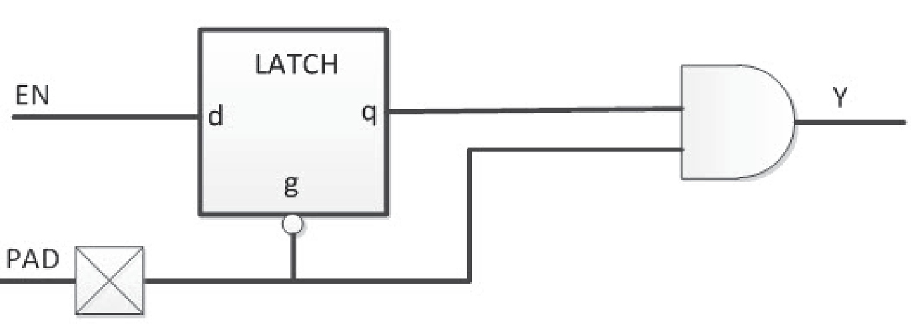

# Clocking

## CLKBIBUF

Bidirectional Buffer with Input to the global network.

 

 

|Input|Output|
|-----|------|
|D, E, PAD|PAD, Y|

|D|E|PAD|Y|
|---|---|---|---|
|X|0|Z|X|
|X|0|0|0|
|X|0|1|1|
|0|1|0|0|
|1|1|1|1|

## CLKBUF

Input Buffer to the global network.

 

 

|Input|Output|
|-----|------|
|PAD|Y|

|PAD|Y|
|---|---|
|0|0|
|1|1|

## CLKBUF\_DIFF

Differential I/O macro to the global network, Differential I/O.

|Input|Output|
|-----|------|
|PADP, PADN|Y|

|PADP|PADN|Y|
|----|----|---|
|Z|Z|Y|
|0|0|X|
|1|1|X|
|0|1|0|
|1|0|1|

## CLKINT

This macro routes an internal fabric signal to the global network.

|Input|Output|
|-----|------|
|A|Y|

|A|Y|
|---|---|
|0|0|
|1|1|

## CLKINT\_PRESERVE

This Macro routes an internal fabric signal to the global network. It has  the same functionality as CLKINT except that this clock always stays on the global clock  network and will not be demoted during design implementation.

|Input|Output|
|-----|------|
|A|Y|

|A|Y|
|---|---|
|0|0|
|1|1|

## GB

Back-annotated macro that routes an internal fabric signal to the global network.

|Input|Output|
|-----|------|
|An, ENn|YNn, YSn|

|An|ENn|q \(internal signal\)|YNn|YSn|
|---|---|---------------------|---|---|
|1|0|1|1|1|
|1|1|0|1|1|
|0|X|q|!q|!q|

## GB\_NG

Back-annotated macro that routes an internal fabric signal to the global network.

|Input|Output|
|-----|------|
|An, ENn|YNn, YSn|

|An|ENn|YNn|YSn|
|---|---|---|---|
|0|0|0|0|
|1|0|1|1|
|X|1|X|X|

## GBM

Back-annotated macro that routes an internal fabric signal to the global network.

|Input|Output|
|-----|------|
|An, ENn|YEn, YWn|

|An|ENn|q \(internal signal\)|YEn|YWn|
|---|---|---------------------|---|---|
|1|0|1|1|1|
|1|1|0|1|1|
|0|X|q|!q|!q|

## GBM\_NG

Back-annotated macro that routes an internal fabric signal to the global network.

|Input|Output|
|-----|------|
|An, ENn|YEn, YWn|

|An|ENn|YEn|YWn|
|---|---|---|---|
|0|0|0|0|
|1|0|1|1|
|X|1|X|X|

## GCLKBIBUF

Bidirectional I/O macro with gated input to the global network; the Enable  signal can be used to turn off the global network to save power.

 

 

|Input|Output|
|-----|------|
|D, E, EN, PAD|Y, PAD|

|D|E|EN|PAD|q|Y|
|---|---|---|---|---|---|
|X|0|0|0|0|0|
|X|0|1|0|1|0|
|X|0|X|1|q|q|
|X|0|X|Z|X|X|
|0|1|0|0|0|0|
|0|1|1|0|1|0|
|1|1|X|1|q|q|

## GCLKBUF

Gated input I/O macro to the global network. The Enable signal can turn off the global network to save power.

|Input|Output|
|-----|------|
|PAD, EN|Y|

|PAD|EN|q|Y|
|---|---|---|---|
|0|0|0|0|
|0|1|1|0|
|1|X|q|q|
|Z|X|X|X|

## GCLKBUF\_DIFF

Gated differential I/O macro to global network; the Enable signal can be  used to turn off the global network.

 

 

Differential

|Input|Output|
|-----|------|
|PADP, PADN, EN|Y|

|PADP|PADN|EN|q|Y|
|----|----|---|---|---|
|0|1|0|0|0|
|0|1|1|1|0|
|1|0|X|q|q|
|0|0|X|X|X|
|1|1|X|X|X|
|Z|Z|X|X|X|

## GCLKINT

Gated macro used to route an internal fabric signal to the global network.  The Enable signal can be used to turn off the global network to save power.

 

 

|Input|Output|
|-----|------|
|A, EN|Y|

|A|EN|q \(Internal Signal\)|Y|
|---|---|---------------------|---|
|0|0|0|0|
|0|1|1|0|
|1|X|q|q|

## IOINFF

Registered input I/O macro available in post-layout netlist only.

|Input|Output|
|-----|------|
|Name|Function|Q|
|D|Data|
|CLK|Clock|
|EN|Enable|
|ALn|Asynchronous Load \(Active-Low\)|
|ADn[1](Chunk1143553917.md#GUID-530909B6-40C9-423A-BC49-AC827AA2A26B)|Asynchronous Data \(Active-Low\)|
|SLn|Synchronous Load \(Active-Low\)|
|SD[1](Chunk1143553917.md#GUID-530909B6-40C9-423A-BC49-AC827AA2A26B)|Synchronous Data|
|LAT[1](Chunk1143553917.md#GUID-530909B6-40C9-423A-BC49-AC827AA2A26B)|Latch Enable|

1.  ADn, SD, and LAT are static signals defined at design time and must be tied to 0 or 1.

|ALn|ADn|LAT|CLK|EN|SLn|SD|D|Qn+1|
|---|---|---|---|---|---|---|---|----|
|0|ADn|X|X|X|X|X|X|!ADn|
|1|X|0|Not rising|X|X|X|X|Qn|
|1|X|0|—|0|X|X|X|Qn|
|1|X|0|—|1|0|SD|X|SD|
|1|X|0|—|1|1|X|D|D|
|1|X|1|0|X|X|X|X|Qn|
|1|X|1|1|0|X|X|X|Qn|
|1|X|1|1|1|0|SD|X|SD|
|1|X|1|1|1|1|X|D|D|

## RCLKINT

Macro used to route an internal fabric signal to a row global buffer, thus  creating a local clock.

|Input|Output|
|-----|------|
|A|Y|

|A|Y|
|---|---|
|0|0|
|1|1|

## RGB

Back-annotated macro used to route an internal fabric signal to row the  global network buffer.

 

 

|Input|Output|
|-----|------|
|An, ENn|YL, YR|

|An|ENn|q \(internal signal\)|YL|YR|
|---|---|---------------------|---|---|
|1|0|1|0|0|
|1|1|0|0|0|
|0|X|q|q|q|

## RGB\_NG

Back-annotated macro used to route an internal fabric signal to a row  global buffer.

 

 

|Input|Output|
|-----|------|
|An, ENn|YL, YR|

|An|ENn|YL|YR|
|---|---|---|---|
|0|0|1|1|
|1|0|0|0|
|X|1|X|X|

## RGCLKINT

Gated macro used to route an internal fabric signal to a row global  buffer, thus creating a local clock. The Enable signal can be used to turn off the local  clock to save power.

 

 

|Input|Output|
|-----|------|
|A, EN|Y|

|A|EN|q \(Internal Signal\)|Y|
|---|---|---------------------|---|
|0|0|0|0|
|0|1|1|0|
|1|X|q|q|

