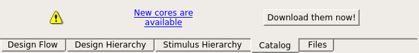

# Getting Started

Information and resources to help you get started using SmartHLS as quickly as possible.

## License Setup

Starting version 2024.2, SmartHLS no longer requires a separate<br /> license. SmartHLS is now supported using the Libero SoC<br /> Design Suite license.

For SmartHLS 2024.1 and earlier, you need to upgrade your<br /> Libero license. Your upgraded Libero license is available for download after the release<br /> of Libero SoC 2024.2. With the upgraded Libero license, you can use SmartHLS 2024.1 and earlier without a separate SmartHLS license.

To download your upgraded Libero license, log on to your [Microchip Direct](https://www.microchipdirect.com/fpga-software-products) account. For instructions on how to setup a<br /> Libero license, see the Libero SoC Software Download and License Installation Guide<br /> [License Installation](GUID-40BFB012-128A-4850-8C3C-FE907B6FCD5D.md).

For information about when a license is checked, see [When is the License Checked?](Chunk511006050.md#).

## Installation

SmartHLS™ supports all the operating systems that are supported by the<br /> corresponding Libero version.

### Windows

Run the Windows installer program, `SmartHLS-2025.1-Win64-Setup.exe`, and go through the steps in the<br /> installer.

### Linux

#### CentOS

The CentOS installer is packaged as a self-extracting shell script that can be installed to a local directory. To run the installer:

```
cd $(INSTALLATION_DIRECTORY)
sh /path/to/smarthls-`2025.1`-centos-installer.run
```

This will install SmartHLS™ into the INSTALLATION\_DIRECTORY. After the installation is completed, please add the SmartHLS bin directory to your path:

```
export PATH=$(INSTALLATION_DIRECTORY)/SmartHLS-`2025.1`/SmartHLS/bin:$PATH
```

## Launching SmartHLS IDE

On Windows or Linux, you can launch the SmartHLS IDE by running the `shls -g` command from the terminal.

## Libero and ModelSim

You will need to install the [Libero SoC software](https://www.microchip.com/en-us/products/fpgas-and-plds/fpga-and-soc-design-tools/fpga/libero-software-later-versions) to synthesize the generated hardware for Microchip FPGAs. After installing Libero, please make sure to download all of new IP cores \(open a Libero project, go to the Catalog pane, and click on "Download them now!", as shown below\), as some IPs may be needed for SmartHLS™.



Libero also comes with ModelSim which is used by SmartHLS to simulate the generated Verilog.

Users should add the path to ModelSim and Libero® in the SmartHLS™ IDE using the menu setting under `SmartHLS -> Tool Path Setting` or add them to the PATH environment when using the [SmartHLS command-line interface](Chunk120481216.md#).

