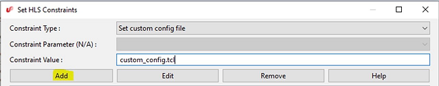
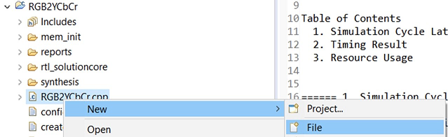
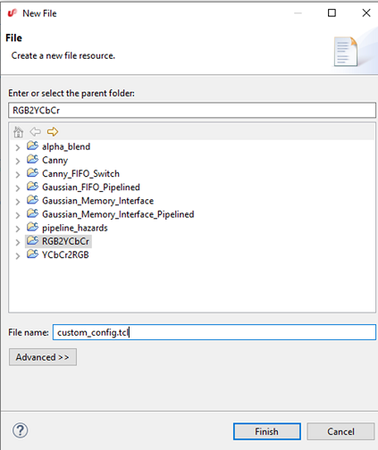
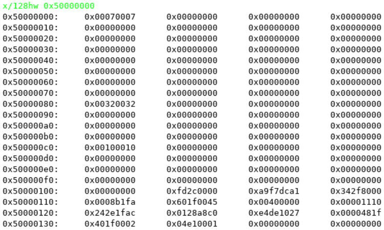

# Constraints Manual

Learn more about the constraints available for SmartHLS.

## Constraints Manual

SmartHLS™ accepts user-provided constraints that impact the automatically generated hardware. These constraints can be specified using the SmartHLS IDEand are stored in the Tcl configuration file `config.tcl` located in your project directory. This section provides information about the constraints available for SmartHLS. The main constraints available from the SmartHLS IDE are:

-   Set target clock period: [CLOCK\_PERIOD](Chunk1590600802.md#)
-   Print the HDL output to a single output file: [SINGLE\_HDL\_OUTPUT\_FILE](Chunk1590600802.md#)
-   Set custom config file: [set\_custom\_config\_file](Chunk1590600802.md#)
-   Set test bench file: [set\_custom\_test\_bench\_file](Chunk1590600802.md#)
-   Set test bench module: [set\_custom\_test\_bench\_module](Chunk1590600802.md#)
-   Set operation latency: [set\_operation\_latency](Chunk1590600802.md#)
-   Set FPGA family and device: [set\_project](Chunk1590600802.md#)
-   Set resource constraint: [set\_resource\_constraint](Chunk1590600802.md#)
-   Set FPGA synthesis top-level module: [set\_synthesis\_top\_module](Chunk1590600802.md#)
-   Set FPGA synthesis top-level file: [set\_synthesis\_top\_module\_file](Chunk1590600802.md#)

A few debugging constraints are available from the SmartHLS IDE:

-   Stalling input/output FIFOs in CoSimulation: [COSIM&lt;INPUT\|OUTPUT&gt;\_FIFO\_STALL\_PROB](Chunk1590600802.md#)
-   Keep signals with no fanout: [KEEP\_SIGNALS\_WITH\_NO\_FANOUT](Chunk1590600802.md#)
-   Insert simulation assertions \(for debugging\): [VSIM\_ASSERT](Chunk1590600802.md#)

## Commonly Used Constraints

### CLOCK\_PERIOD

This is a widely used constraint that allows the user to set the target clock period for a design. The clock period is specified in nanoseconds.

It has a significant impact on scheduling: the scheduler will schedule operators into clock cycles using delay estimates for each operator, such that the specified clock period is honored. In other words, operators will be chained together combinationally to the extent allowed by the value of the CLOCK\_PERIOD parameter.

SmartHLS™ has a default CLOCK\_PERIOD value for each device family that is supported \(see table in [SmartHLS Constraints](Chunk120481216.md#)\).

Category
:   HLS Constraints

Value Type
:   Integer represent a value in nanoseconds

Valid Values
:   Integer

Default Value
:   Depends on the target device

Dependencies
:   None

Applicable Flows
:   All devices and flows

Test Status
:   Actively in-use

Examples
:   `set_parameter CLOCK_PERIOD 15`

### SINGLE\_HDL\_OUTPUT\_FILE

When set to `1`, this Tcl parameter constrains<br /> SmartHLS-generated Verilog RTL and VHDL wrapper modules to a<br /> single Verilog file \(`<Project Name>.v`\) and a single VHDL file<br /> \(`<Project Name>.vhd`\) respectively. By default, each Verilog<br /> top-level module \(and its child modules\) is printed to a separate output file<br /> \(`<Project Name>_<Top-Level Name>.v`\), and each VHDL<br /> wrapper module of a top-level is printed to a separate VHDL file \(`<Project Name>_<Top-Level Name>.vhd`\).

Category
:   HLS Constraints

Value Type
:   Boolean

Valid Values
:   0, 1

Default Value
:   `SINGLE_HDL_OUTPUT_FILE 0`

Dependencies
:   None

Applicable Flows
:   All devices and flows

Test Status
:   Actively in-use

Examples
:   `set_parameter SINGLE_HDL_OUTPUT_FILE 1`

### set\_custom\_config\_file

If you want to add advanced SmartHLS™ Tcl constraints that are not listed in the SmartHLS IDE constraints dialog you need to use a custom config file. Be careful not to modify the config.tcl constraints file directly, since config.tcl will be overwritten whenever you make changes in the SmartHLSIDE constraints dialog.

To add a custom config file:

1.  Open the SmartHLS Constraints Menu.
2.  Select `Set custom config file` from the dropdown and enter the Constraint Value as "custom\_config.tcl".
3.  Click **Add**:

    

4.  Now click **OK**:

    

5.  Now in the Project Explorer, right click and select **New** &gt; **File**:

    

6.  Enter the name of "custom\_config.tcl". This should match the file name entered in the Set HLS Constraints previously. Click **Finish**:

    


### set\_custom\_test\_bench\_file

This Tcl command is to specify the user-provided custom testbench file that defines the<br /> custom testbench module, which is set via `set_custom_test_bench_module`.<br /> This is not needed for SW/HW co-simulation.

Category
:   Simulation

Value Type
:   String

Dependencies
:   `set_custom_test_bench_module "user_tb"`

Applicable Flows
:   All devices and flows

Test Status
:   Actively in-use

Examples
:   `set_custom_test_bench_file user_tb.v`

### set\_custom\_test\_bench\_module

This Tcl command is to specify the name of the user-provided testbench module to be using<br /> for RTL simulation. The testbench file must also be specified with[set\_custom\_test\_bench\_file](Chunk1590600802.md#) .

Category
:   Simulation

Value Type
:   String

Dependencies
:   `set_custom_test_bench_file user_tb.v`

Applicable Flows
:   All devices and flows

Test Status
:   Actively in-use

Examples
:   `set_custom_test_bench_module "user_tb"`

### set\_operation\_latency

This Tcl command sets the latency of a given operation.Latency refers to the number of clock cycles required to complete<br /> the computation; an operation with latency one requires one cycle, while zero-latency<br /> operations are completely combinational, meaning multiple such operations can be chained<br /> together in a single clock cycle. This command is used to schedule each type operation<br /> to take the specified number of cycles.

This Tcl command should only be used by advanced SmartHLS™ users.

Category
:   HLS Constraints

Value Type
:   `set_operation_latency <operation> <constraint>`, in which `<operation>` is a string and `<constraint>` is an integer

Valid Values
:   See Default and Examples.

:   **Note:** Operator name should match the operation database file: `devices/Microchip.tcl` or `devices/set_operation_latency.tcl`

:   See [ENABLE\_AUTOMATIC\_MEMORY\_LATENCY\_SETTING](Chunk1590600802.md#) for<br /> information on default latency for memory latency.

    See [FORCED\_MATH\_BLOCK\_PIPELINE\_DEPTH](Chunk1590600802.md#) for information on<br /> latency control per Math \(DSP\) block.

:   Negative values will let HLS determines the best values.

:   Zero will turn the logic to completely combinational.

:   Positives values will set the operation latency for the specified operation.

Default Values
:   ```language-cpp
fp_add_64 12
fp_add_32 11
fp_subtract_64 12
fp_subtract_32 11
fp_multiply_64 8
fp_multiply_32 5
fp_divide_32 33
fp_divide_64 61
fp_truncate_64 5
fp_extend_32 4
fp_signed_comp_o 3
fp_signed_comp_u 3
fp_sitofp_32_32 4
fp_sitofp_32_64 5
fp_sitofp_64_32 5
fp_sitofp_64_64 5
fp_uitofp_32_32 4
fp_uitofp_32_64 4
fp_uitofp_64_32 5
fp_uitofp_64_64 4
fp_fptosi_32_32 4
fp_fptosi_32_64 5
fp_fptosi_64_32 4
fp_fptosi_64_64 5
fp_fptoui_32_32 4
fp_fptoui_32_64 5
fp_fptoui_64_32 4
fp_fptoui_64_64 5
reg 2
external_memory_port 1

```

Location Where Default is Specified
:   `devices/Microchip.tcl`

    and<br />

    `devices/set_operation_latency.tcl`

Dependencies
:   None

Applicable Flows
:   All devices and flows

Test Status
:   Actively in-use

Examples
:   `# set memory operations to take 3 cycles`

:   `set_operation_latency memory_port 3`

### set\_project

This parameter sets the default target project, or device, used. Changing the project also updates the associated family and board parameters.

This parameter has 3 arguments:

-   **FPGA Family** \(e.g. PolarFire®\).
-   **FPGA Device:** This can either be the board name \(e.g. MPF300\), or the device number \(e.g. MPF300TS-1FCG1152I\).
-   **Flow:** `hw_only`, `Icicle_SoC` or `MiV_SoC`.
    -   **`hw_only`:** SmartHLS only generates an IP core.
    -   **`Icicle_SoC`:** SmartHLS SoC commands generate a reference design targeting the PolarFire® SoC Icicle kit devices.
    -   `**MiV\_SoC**`: SmartHLS SoC commands generate a MiV RV32 reference design targeting the PolarFire® Video Kit board.

Category
:   Board and Device Specification

Value Type
:   String

Valid Values
:   See Examples

Default Value
:   `PolarFire MPF300 hw_only`

Location Where Default is Specified
:   `examples/legup.tcl`

Dependencies
:   None

Applicable Flows
:   All devices and flows

Test Status
:   Actively in-use

Examples
:   `set_project PolarFire MPF300 hw_only`

:   `set_project PolarFire MPF300T-1FCG1152I hw_only`

:   `set_project SmartFusion2 FUTUREM2SF hw_only`

:   `set_project SmartFusion2 M2S025T-FG484I hw_only`

:   `set_project IGLOO2 M2GL005-1FG484 hw_only`

### set\_resource\_constraint

This Tcl command constrains the resource allocated by SmartHLS™. For instance, to only have a single divider in the entire circuit, user can specify: `set_resource_constraint divide 1`. This makes SmartHLS instantiate a maximum of 1 divider in the circuit, and if there are multiple division operations required, they will share the same divider.

**Important:** A constraint on "divide" will apply to:

-   signed\_divide\_8
-   signed\_divide\_16
-   signed\_divide\_32
-   signed\_divide\_64
-   unsigned\_divide\_8
-   unsigned\_divide\_16
-   unsigned\_divide\_32
-   unsigned\_divide\_64

It can also be used to constrain the number of memory ports. To make all memories single-ported: `set_resource_constraint memory_port 1` For memory ports, only 1 and 2 are valid values, as FPGA RAMs have up to 2 ports.

This Tcl command should only be used by advanced SmartHLS users.

Category
:   HLS Constraints

Value Type
:   `set_resource_constraint <operation> <constraint>`, in which `<operation>` is a string and `<constraint>` is an integer

Valid Values
:   See Default and Examples

    **Important:** Operator name should match the device family operation database file: `boards/PolarFire/PolarFire.tcl`

Default Values
:   ```
memory_port 2
divide 1
modulus 1
fp_add 1
fp_subtract 1
fp_multiply 1
fp_divide 1
fp_truncate 1
fp_extend 1
fp_fptosi 1
fp_sitofp 1
```

Location Where Default is Specified
:   `examples/legup.tcl`

Dependencies
:   None

Applicable Flows
:   All devices and flows

Test Status
:   Actively in-use

Examples
:   `set_resource_constraint signed_divide_16 3`

:   `set_resource_constraint signed_divide 2`

:   `set_resource_constraint divide 1`

**Important:**

The multiply splitting feature \(see [ENABLE\_MULTIPLY\_SPLITTING](Chunk1590600802.md#)\) does not support multiplier<br /> sharing. Therefore, if a user specifies `set_resource_constraint multiply X`, multiplication splitting will be disabled, regardless of the value<br /> set to `ENABLE_MULTIPLY_SPLITTING`. In such cases, SmartHLS will issue a warning message: *Warning: Detected set\_resource\_constraint setting for integer multiplier. However, multiplier sharing is incompatible with the multiply splitting feature. Disabling multiply splitting feature and the normal multiplier modules will be used.*

In this case, the latency of all multiplication operations will be determined by the<br /> value set in the `set_operation_latency multiply X` command. If this<br /> command is not used, latency will default to 2.

### set\_synthesis\_top\_module

This Tcl command specifies the name of the Verilog module that will be set as the top-level module when creating a Libero project for synthesis, place and route. By default, the top-level function \(see [Specifying the Top-level Function](Chunk120481216.md#)\) is set as the top-level module for the Libero project, however user may want to provide wrapper HDL module that instantiates the SmartHLS-generate top-level module. In this case, this Tcl command can be used to give the name of the wrapper module.

Category
:   Libero

Value Type
:   String

Dependencies
:   None

Applicable Flows
:   All devices and flows

Test Status
:   Actively in-use

Examples
:   `set_synthesis_top_module "wrapper_top"`

### set\_synthesis\_top\_module\_file

When `set_synthesis_top_module` is used to set a different wrapper module as the top-level for synthesis, place &amp; route, use this command to specify the file that defines the wrapper module.

Category
:   Libero

Value Type
:   String

Dependencies
:   `set_synthesis_top_module "wrapper_top"`

Applicable Flows
:   All devices and flows

Test Status
:   Actively in use

Examples
:   `set_synthesis_top_module_file custom_synthesis_top.v`

## Debugging Constraints

### COSIM&lt;INPUT\|OUTPUT&gt;\_FIFO\_STALL\_PROB

The `COSIM_INPUT_FIFO_STALL_PROB` and `COSIM_OUTPUT_FIFO_STALL_PROB` parameters can be used to exercise halting data injecting to input FIFO or backpressuring the output FIFO during [Simulate HLS Hardware \(SW/HW Co-Simulation\)](Chunk120481216.md#). When the parameter is set to a value between 1 and 99, representing the probablity to halt input FIFO or backpressure output FIFO, the SmartHLS-generated CoSimulation testbench will randomly halt the data injectiion to input FIFO or backpressure output FIFO, which will then cause the SmartHLS-generated circuit to stall during simulation.

Category
:   HLS Constraint

Value Type
:   Integer

Valid Values
:   0-99

Default Value
:   0: disabled

Location Where Default is Specified
:   `examples/legup.tcl`

Dependencies
:   None

Applicable Flows
:   All devices and flows

Test Status
:   Actively in use

Examples
:   `set_parameter COSIM_INPUT_FIFO_STALL_PROB 50`

:   `set_parameter COSIM_OUTPUT_FIFO_STALL_PROB 40`

### KEEP\_SIGNALS\_WITH\_NO\_FANOUT

If this parameter is enabled, all signals will be printed to the output Verilog file,<br /> even if they don't drive any outputs.

Category
:   HLS Constraint

Value Type
:   Integer

Valid Values
:   0, 1

Default Value
:   0

Location Where Default is Specified
:   `examples/legup.tcl`

Dependencies
:   None

Applicable Flows
:   All devices and flows

Test Status
:   Actively in use

Examples
:   `set_parameter KEEP_SIGNALS_WITH_NO_FANOUT 1`

### VSIM\_ASSERT

When set to 1, this constraint causes assertions to be inserted in the Verilog produced by SmartHLS™. This is useful for debugging the circuit to see where invalid values \(X's\) are being assigned.

Category
:   Simulation

Value Type
:   Integer

Valid Values
:   0, 1

Default Value
:   0

Location Where Default is Specified
:   `examples/legup.tcl`

Dependencies
:   None

Applicable Flows
:   All devices and flows

Test Status
:   Actively in use

Examples
:   `set_parameter VSIM_ASSERT 1`

## Advanced Constraints

### IFCONV\_PREDICATE\_LOADS

This constraint sets whether load instructions should be predicated during if-conversion.<br /> By default, it is set to 1 to predicate load instructions to avoid resource contention<br /> between mutually exclusive loads. If there is no resource contention between mutually<br /> exclusive loads, it can set to 0 avoid inserting predication logic.

Category
:   HLS Constraints

Value Type
:   Boolean

Valid Values
:   0, 1

Default Value
:   1

Location Where Default is Specified
:   `examples/legup.tcl`

Dependencies
:   None

Applicable Flows
:   All devices and flows

Test Status
:   Actively in use

Examples
:   `set_parameter IFCONV_PREDICATE_LOADS 1`

### LATENCY\_REDUCTION

The LATENCY\_REDUCTION settings control the SmartHLS's expression balancing optimization, of which the objective is to reduce the circuit latency. Below are the related settings:

|Parameter Name|Default Value|Description|
|--------------|-------------|-----------|
|LATENCY\_REDUCTION|1|The main switch that enables or disables expression balancing. Setting to 0 disables all expression balancing optimizations.|
|LATENCY\_REDUCTION\_ALLOW\_FP\_REORDERING|0|By default, expression balancing does not re-order floating-point operations to prevent loss<br /> of precisions.Setting to 1 allows to re-order floating-point operations if the<br /> circuit latency can be reduced.Because the floating point operations may lose<br /> their commutativity and associativity with finite precision, this optimization may<br /> result in the failure of the co-simulation.This is an unsafe optimization.<br /> Users should only enable this option on error tolerant designs.|
|LATENCY\_REDUCTION\_REDUCE\_FP\_CONVERSIONS|0|Setting to 1 will allow SmartHLS to cancel out back-and-forth conversion between floating-point and integer, with potential variations in numerical values.For example, the following conversions can be cancelled when this setting is 1.int a = \(int\)\(float\)\(3\); // a == 3.float b = \(float\)\(int\)\(1.2\); // b == 1.2 instead of 1.<br /> Level of accuracy loss caused by this optimization is run-time value dependent.<br /> Therefore, carefully examine the potential value sets of the associated operations<br /> as well as your design tolerance before enabling this option.This is an unsafe optimization.<br /> Users should only enable this option on error tolerant designs.|
|LATENCY\_REDUCTION\_BALANCE\_MULTI\_USE\_NODE|0|By default expression balancing does not optimize the intermediate operations that have multiple uses, to avoid potential increase of resource usage.Setting to 1 allows to re-order intermediate operations that have multiple uses and more latency reduction could be achieved.|

Category
:   HLS Constraints

Value Type
:   Integer

Valid Values
:   0, 1

Default Value
:   As listed in the table above.

Location Where Default is Specified
:   `examples/legup.tcl`

Dependencies
:   None

Applicable Flows
:   All devices and flows

Test Status
:   Actively in-use

Examples
:   `set_parameter LATENCY_REDUCTION 1`

:   `set_parameter LATENCY_REDUCTION_ALLOW_FP_REORDERING 0`

:   `set_parameter LATENCY_REDUCTION_REDUCE_FP_CONVERSIONS 0`

:   `set_parameter LATENCY_REDUCTION_BALANCE_MULTI_USE_NODE 0`

### ENABLE\_AUTOMATIC\_MEMORY\_LATENCY\_SETTING

Enable determining memory latency for reads automatically according to the target clock period and timing model of the board. Memory latency is set to 2 when the target clock period is less than the delay of memory for the target device, otherwise is set to 1. Increasing the memory latency can result in higher circuit Fmax at the expense of higher circuit latency. The auto-determined latency can be found in the [Memory Usage](Chunk120481216.md#) section of SmartHLS™ report.

Setting the operation latency for a RAM will override the latency automatically calculated. See [set\_operation\_latency](Chunk1590600802.md#) for a list of valid memory port latency. The threshold for switching are listed in the table below.

|Device|Use Memory Latency of 2 when Target Period is less than \(ns\)|
|------|--------------------------------------------------------------|
|PolarFire, PolarFire SoC|4.167|
|IGLOO2, SmartFusion2|4.167|
|PolarFire 2|4.167|

ENABLE\_AUTOMATIC\_MEMORY\_LATENCY\_SETTING controls the latency for the following memory constraints. Each constraint can be used with `set_operation_latency <Name> <latency>` to override the auto-determined latency.

|Name|Description|
|----|-----------|
|`local_memory_port`|Controls the memory latency of [Local Memory](Chunk2006016459.md#) used<br /> by a single function.|
|`shared_local_memory_port`|Controls the memory latency of [Shared-Local Memory](Chunk2006016459.md#)<br /> shared by multiple functions.|
|`axi_slave_ram_memory_port`|Controls the memory latency of [Legacy AXI4 Slave Interface](Chunk120481216.md#)|
|`memory_port`|Controls the memory latency of [Memory Controller](Chunk2006016459.md#)|

SmartHLS does not automatically determine the latency for `external_memory_port` as it is only for creating an interface with the RAMs outside of the circuit. However, for [SmartHLS SoC Flow](Chunk120481216.md#), `external_memory_port` controls the latency for the on-chip memory buffers.

Category
:   HLS Constraints

Value Type
:   Boolean

Valid Values
:   0, 1

Default Value
:   1

Location Where Default is Specified
:   `examples/legup.tcl`

Dependencies
:   None

Applicable Flows
:   All devices and flows

Test Status
:   Actively in-use

Examples
:   `set_parameter ENABLE_AUTOMATIC_MEMORY_LATENCY_SETTING 1`

### ENABLE\_MULTIPLY\_SPLITTING

SmartHLS™'s default behavior is to map<br /> multiplication operations to Math blocks \(DSPs\). When a multiplication operation's width<br /> exceeds the maximum width that the target device's DSPs can support, SmartHLS automatically splits the operation across multiple DSPs. The internal<br /> pipeline registers within these DSPs are configured to meet the user-defined timing<br /> requirements \(Fmax\) while minimizing the execution latency or cycle count. Multiplication<br /> splitting is enabled by default and users have the option to disable it by setting this<br /> parameter to 0.

Category
:   HLS constraint

Value Type
:   Boolean

Valid Values
:   0, 1

Default Value
:   1: enabled

Dependencies
:   None

Test Status
:   Actively in-use

Examples
:   ```language-cpp
set_parameter ENABLE_MULTIPLY_SPLITTING 0 

```

### FORCED\_MATH\_BLOCK\_PIPELINE\_DEPTH

Multipliers are implemented in Math \(DSP\) blocks. When this constraint is set to 0, the<br /> pipelining depth configuration, or latency, of each Math block is automatically calculated<br /> given the target clock frequency; the faster the clock, the deeper the pipeline. User can<br /> override the latency of each math block by setting<br /> `FORCED_MATH_BLOCK_PIPELINE_DEPTH` to a non-zero value, constrained by the<br /> target architecture.

**Important:** With `ENABLE_AUTOMATIC_MULTIPLY_MODE_SETTING` and `MULTIPLY_SPLITTING_FULLY_PIPELINED` removed since SmartHLS™ 2025.1, this constraint can be used to have more precise control of Math block pipelining depth.

Category
:   HLS Constraints

Value Type
:   Integer

Valid Values
:   0, 1, 2

Default Value
:   0

Dependencies
:   None

Test Status
:   Actively in use

Examples
:   `set_parameter FORCED_MATH_BLOCK_PIPELINE_DEPTH 1`

### SOC\_AXI\_INITIATOR

This is an SoC integration parameter to allow integrating HLS-generated modules into a<br /> custom user-defined SmartDesign system. The parameter specifies the AXI initiator<br /> interface used by the processor in the user-defined SmartDesign system to connect to the<br /> HLS module's AXI target interface. This AXI initiator interface is used by the processor<br /> to control and transfer data to/from the HLS modules.

Please refer to **Soc Integration Parameters** in [User-defined SmartDesign](Chunk120481216.md#) for more details on using this<br /> Tcl parameter.

Category
:   HLS Constraints

Value Type
:   String

Default Value \(Based on Icicle SoC reference design\)
:   AXI2AXI\_TO\_HLS:AXI4\_MASTER

Dependencies
:   None

Applicable Flows
:   SoC Flow Only

Test Status
:   Actively in-use

Examples
:   `set_parameter SOC_AXI_INITIATOR AXI2AXI_TO_HLS:AXI4_MASTER`

### SOC\_AXI\_TARGET

This is an SoC integration parameter to allow integrating HLS-generated modules into a<br /> custom user-defined SmartDesign system. The parameter specifies the AXI target interface<br /> in the user-defined SmartDesign system where the HLS module's AXI initiator interface<br /> can connect to. This AXI target interface is used by the HLS modules to access shared<br /> memory \(DDR\) directly.

Please refer to **Soc Integration Parameters** in [User-defined SmartDesign](Chunk120481216.md#) for more details on using this<br /> Tcl parameter.

Category
:   HLS Constraints

Value Type
:   String

Default Value \(Based on Icicle SoC reference design\)
:   AXI2AXI\_FROM\_HLS:AXI4\_SLAVE

Dependencies
:   None

Applicable Flows
:   SoC Flow Only

Test Status
:   Actively in-use

Examples
:   `set_parameter SOC_AXI_TARGET AXI2AXI_FROM_HLS:AXI4_SLAVE`

### SOC\_BD\_NAME

This is an SoC integration parameter to allow integrating HLS-generated modules into a<br /> custom user-defined SmartDesign system. The parameter specifies the name of the<br /> SmartDesign system to integrate the HLS modules into.

Please refer to **Soc Integration Parameters** in [User-defined SmartDesign](Chunk120481216.md#) for more details on how to use<br /> this Tcl parameter.

Category
:   HLS Constraints

Value Type
:   String

Default Value \(Based on Icicle SoC reference design\)
:   FIC\_0\_PERIPHERALS

Dependencies
:   None

Applicable Flows
:   SoC Flow Only

Test Status
:   Actively in-use

Examples
:   `set_parameter SOC_BD_NAME FIC_0_PERIPHERALS`

### SOC\_CLOCK

This is an SoC integration parameter to allow integrating HLS-generated modules into a<br /> custom user-defined SmartDesign system. The parameter specifies the name of the clock to<br /> connect to the HLS modules. Currently, all HLS modules use the same clock.

Please refer to **Soc Integration Parameters** in [User-defined SmartDesign](Chunk120481216.md#) for more details on how to use<br /> this Tcl parameter.

Category
:   HLS Constraints

Value Type
:   String

Default Value \(Based on Icicle SoC reference design\)
:   ACLK

Dependencies
:   None

Applicable Flows
:   SoC Flow Only

Test Status
:   Actively in-use

Examples
:   `set_parameter SOC_CLOCK ACLK`

### SOC\_CPU\_MEM\_BASE\_ADDRESS

This is an SoC integration parameter to allow integrating HLS-generated modules into a<br /> custom user-defined SmartDesign system. The parameter specifies the base address of the<br /> memory window in the shared memory space \(DDR\) that can be accessed by the HLS module's<br /> AXI initiator interfaces. This address is used to configure the AXI interconnect that<br /> HLS modules connect to for accessing the shared memory.

Note that the value for the parameter is specified in hexadecimal format and must be<br /> prefixed with 0x.

Please refer to **Soc Integration Parameters** in [User-defined SmartDesign](Chunk120481216.md#) for more details on how to use<br /> this Tcl parameter.

Category
:   HLS Constraints

Value Type
:   Hexadecimal

Default Value \(Based on Icicle SoC reference design\)
:   0x80000000

Dependencies
:   None

Applicable Flows
:   SoC Flow Only

Test Status
:   Actively in-use

Examples
:   `set_parameter SOC_CPU_MEM_BASE_ADDRESS 0x80000000`

### SOC\_CPU\_MEM\_SIZE

This is an SoC integration parameter to allow integrating HLS-generated modules into a<br /> custom user-defined SmartDesign system. The parameter specifies the size of the shared<br /> memory \(DDR\) space that the HLS module's AXI initiator interfaces can access.

Note that the value for the parameter is specified in hexadecimal format and must be<br /> prefixed with 0x.

Please refer to **Soc Integration Parameters** in [User-defined SmartDesign](Chunk120481216.md#) for more details on how to use<br /> this Tcl parameter.

Category
:   HLS Constraints

Value Type
:   Hexadecimal

Default Value \(Based on Icicle SoC reference design\)
:   0x60000000

Dependencies
:   None

Applicable Flows
:   SoC Flow Only

Test Status
:   Actively in-use

Examples
:   `set_parameter SOC_CPU_MEM_SIZE 0x60000000`

### SOC\_DMA\_ENGINE

This is an SoC integration parameter to allow integrating HLS-generated modules into a custom user-defined SmartDesign system. The parameter specifies the type of DMA engine to use in the system for transferring data to/from HLS modules.

|DMA Engine|Description|
|----------|-----------|
|HARD\_DMA|Uses the DMA available in the PolarFire® SoC MSS. This implies that the CPUs to be used are the RISC-V U54 application cores in the MSS.|
|SOFT\_DMA|Automatically instantiates a DMA engine on the FPGA fabric and be connected to the SmartHLS AXI interconnect along with the SmartHLS IP modules.Currently this option is not enabled, but will be in a future release.|

Please refer to **Soc Integration Parameters** in [User-defined SmartDesign](Chunk120481216.md#) for more details on how to use this Tcl parameter.

Category
:   HLS Constraints

Value Type
:   String

Default Value \(Based on Icicle SoC reference design\)
:   HARD\_DMA

Dependencies
:   None

Applicable Flows
:   SoC Flow Only

Test Status
:   HARD\_DMA is actively in-use; SOFT\_DMA will be made available in a future release

Examples
:   `set_parameter SOC_DMA_ENGINE HARD_DMA`

### SOC\_FABRIC\_BASE\_ADDRESS

This is an SoC integration parameter to allow integrating HLS-generated modules into a<br /> custom user-defined SmartDesign system. The parameter specifies the base address of the<br /> CPU memory space that is reserved for all HLS modules. The control registers and on-chip<br /> memory buffers of HLS modules are allocated and mapped within this memory window. This<br /> address is also used to configure the AXI interconnect that HLS modules connect to.

Note that the value for the parameter is specified in hexadecimal format and must be<br /> prefixed with 0x.

Please refer to **Soc Integration Parameters** in [User-defined SmartDesign](Chunk120481216.md#) for more details on how to use<br /> this Tcl parameter.

Category
:   HLS Constraints

Value Type
:   Hexadecimal

Default Value \(Based on Icicle SoC reference design\)
:   0x70000000

Dependencies
:   None

Applicable Flows
:   SoC Flow Only

Test Status
:   Actively in-use

Examples
:   `set_parameter SOC_FABRIC_BASE_ADDRESS 0x70000000`

### SOC\_FABRIC\_SIZE

This is an SoC integration parameter to allow integrating HLS-generated modules into a<br /> custom user-defined SmartDesign system. The parameter specifies the size of the CPU<br /> memory space that is reserved for all HLS modules. The control registers and on-chip<br /> memory buffers of HLS modules are allocated and mapped within this memory window. This<br /> address is also used to configure the AXI interconnect that HLS modules connect to.

Note that the value for the parameter is specified in hexadecimal format and must be<br /> prefixed with 0x.

By default, 4MB of size is reserved. If this is larger than what HLS modules require, it<br /> can just be left for future use. Reserving a larger window does not mean more on-chip<br /> memory will be used.

Please refer to **Soc Integration Parameters** in [User-defined SmartDesign](Chunk120481216.md#) for more details on how to use<br /> this Tcl parameter.

Category
:   HLS Constraints

Value Type
:   Hexadecimal

Default Value \(Based on Icicle SoC reference design\)
:   0x400000

Dependencies
:   None

Applicable Flows
:   SoC Flow Only

Test Status
:   Actively in-use

Examples
:   `set_parameter SOC_FABRIC_SIZE 0x400000`

### SOC\_POLL\_DELAY

This parameter controls how often an accelerator driver function polls the status<br /> register of an HLS module to check for its completion. By default, the delay is set to<br /> 0, which means the processor will continuously poll the status. However, it may be<br /> beneficial to insert a delay in polling to reduce CPU usage and power consumption. The<br /> poll delay is specified in microseconds.

Please refer to **Soc Integration Parameters** in [User-defined SmartDesign](Chunk120481216.md#) for more details on how to use<br /> this Tcl parameter.

Category
:   HLS Constraints

Value Type
:   Integer; represents a value in microseconds

Valid Values
:   Integer

Default Value \(Based on Icicle SoC reference design\)
:   0

Dependencies
:   None

Applicable Flows
:   SoC Flow Only

Test Status
:   Actively in-use

Examples
:   `set_parameter SOC_POLL_DELAY 10`

### SOC\_PROFILER\_COUNTER

This parameter specifies whether or not to include a hardware counter to help profile<br /> SoC-based designs. The counter is not included by default.

For more information, see [SoC Profiler](Chunk120481216.md#).

Category
:   HLS Constraints

Value Type
:   Boolean

Valid Values
:   0, 1

Default Value
:   0

Dependencies
:   None

Applicable Flows
:   SoC Flow Only

Test Status
:   Actively in-use

Examples
:   `set_parameter SOC_PROFILER_COUNTER 1`

### SOC\_RESET

This is an SoC integration parameter to allow integrating HLS-generated modules into a<br /> custom user-defined SmartDesign system. The parameter specifies the name of the reset<br /> signal to connect to the HLS modules. Currently, all HLS modules use the same reset.<br /> Note that the reset polarity must be active-high.

Please refer to **Soc Integration Parameters** in [User-defined SmartDesign](Chunk120481216.md#) for more details on how to use<br /> this Tcl parameter.

Category
:   HLS Constraints

Value Type
:   String

Default Value \(Based on Icicle SoC reference design\)
:   ARESETN

Dependencies
:   None

Applicable Flows
:   SoC Flow Only

Test Status
:   Actively in-use

Examples
:   `set_parameter SOC_RESET ARESETN`

### STRENGTH\_REDUCTION

Strength reduction is an optimization that converts multiply-by-constant into shifts and<br /> additions:

```
Info: StrengthReduction: Replacing multiply by constant (i26 33038) with 3 adders:
        - (1 << 1) + (1 << 4) + (1 << 8) + (1 << 15)
Info: StrengthReduction: Replacing multiply by constant (i26 6416) with 3 adders:
        + (1 << 4) + (1 << 8) + (1 << 11) + (1 << 12)
Info: StrengthReduction: Replacing multiply by constant (i26 28784) with 3 adders:
        - (1 << 4) + (1 << 7) - (1 << 12) + (1 << 15)
Info: StrengthReduction: Replacing multiply by constant (i26 4680) with 3 adders:
        + (1 << 3) + (1 << 6) + (1 << 9) + (1 << 12)
Info: StrengthReduction: Replacing multiply by constant (i26 33024) with 1 adder:
        + (1 << 8) + (1 << 15)

```

This optimization saves DSP blocks on the FPGA but can also increase LUT usage in the<br /> design.

You can tune the number of adders allowed per multiplier with the constraint: [STRENGTH\_REDUCTION\_ADDERS\_ALLOWED\_PER\_MULTIPLIER](Chunk1590600802.md#)

Category
:   HLS Constraints

Value Type
:   Integer

Valid Values
:   0, 1

Default Value
:   1

Location Where Default is Specified
:   `examples/legup.tcl`

Dependencies
:   None

Applicable Flows
:   All devices and flows

Test Status
:   Actively in-use

Examples
:   `set_parameter STRENGTH_REDUCTION 1`

### STRENGTH\_REDUCTION\_ADDERS\_ALLOWED\_PER\_MULTIPLIER

Strength reduction is an optimization that converts multiply-by-constant into shifts and additions:

```
Info: StrengthReduction: Replacing multiply by constant (i26 33038) with 3 adders:
        - (1 << 1) + (1 << 4) + (1 << 8) + (1 << 15)

```

The STRENGTH\_REDUCTION\_ADDERS\_ALLOWED\_PER\_MULTIPLIER constraint allows you to tune the number of adders allowed per multiplier \(default is 3\). Strength reduction for multiply-by-constants will not be performed if this requires more adders than allowed:

```
i26 16828 is composed of 4 adders:
- (1 << 2) + (1 << 6) + (1 << 7) + (1 << 8) + (1 << 14)
Skipping conversion otherwise would need too many additions.

```

In this example, we would need 4 adders which is more than the default of 3, meaning strength reduction will not occur and SmartHLS™ will keep the multiplier.

Category
:   HLS Constraints

Value Type
:   Integer

Valid Values
:   Positive Integer

Default Value
:   3

Location Where Default is Specified
:   `examples/legup.tcl`

Dependencies
:   [STRENGTH\_REDUCTION](Chunk1590600802.md#)must be on

Applicable Flows
:   All devices and flows

Test Status
:   Actively in-use

Examples
:   `set_parameter STRENGTH_REDUCTION_ADDERS_ALLOWED_PER_MULTIPLIER 3`

### SYNTHESIS\_CLOCK\_PERIOD

This constraint allows the user to override the SDC clock period constraint for<br /> synthesis, P&amp;R, and timing analysis.

By default, when this constraint is not specified, the same CLOCK\_PERIOD constraint for<br /> HLS is used for the SDC clock period constraint. However, it may be useful to give a<br /> tighter SDC clock period constraint to close timing.

The clock period is specified in nanoseconds.

Category
:   HLS Constraints

Value Type
:   Integer; represents a value in nanoseconds

Valid Values
:   Integer

Default Value
:   N/A

Dependencies
:   None

Applicable Flows
:   All devices and flows

Test Status
:   Actively in-use

Examples
:   `set_parameter SYNTHESIS_CLOCK_PERIOD 10`

### USE\_FIFO\_FOR\_PIPELINE\_REG

In a pipeline circuit where multiple stages of the circuit are concurrently active and processing different loop iterations \(or function calls\), *pipeline registers* are used to retain and propagate a variable value from the value-producing stage to the value-use stage. The pipeline registers are essentially a chain of shift registers with additional control logic. When the chain of pipeline registers is long, it may be more resource-efficient to implement the pipeline registers as a block-RAM FIFO rather than shift registers.

When this parameter is enabled, SmartHLS™ will examine each chain of pipeline registers and use the implementation \(FIFO or shift register\) that is estimated to be more resource-efficient.

Category
:   HLS Constraint

Value Type
:   Integer

Valid Values
:   0, 1

Default Value
:   1

Location Where Default is Specified
:   `examples/legup.tcl`

Dependencies
:   None

Applicable Flows
:   All devices and flows

Test Status
:   Actively in-use

Examples
:   `set_parameter USE_FIFO_FOR_PIPELINE_REG 1`

### COSIM\_FREE\_RUNNING\_DATAFLOW\_TOP

The `COSIM_FREE_RUNNING_DATAFLOW_TOP` parameter can be useful for dataflow<br /> designs which contain conditionally-executed tasks. When the top-level module uses<br /> dataflow, this parameter will make the top-level module free-running, i.e., its start<br /> signal will be tied to 1. This parameter should not be enabled if an AXI Target<br /> interface is used.

Category
:   HLS Constraint

Value Type
:   Boolean

Valid Values
:   0, 1

Default Value
:   0: disabled

Location Where Default is Specified
:   `examples/legup.tcl`

Dependencies
:   None

Applicable Flows
:   All devices and flows

Test Status
:   Alpha release

Examples
:   `set_parameter COSIM_FREE_RUNNING_DATAFLOW_TOP 1`

### AXI\_RRESP\_ALWAYS\_ZERO

The `AXI_RRESP_ALWAYS_ZERO` parameter determines how the HLS module will respond when it receives an AXI read requests to an address that is not used within its address map; essentially an address decoding error. These gaps within the addresses map occur due to address alignments in the AXI target register interface for the function arguments.

By default the module will return AXI RRESP=2'b10 \(slave error\) when an address decoding error is detected. It is the responsibility of the initiator of the AXI read request to process the response accordingly and the returned value \(AXI RDATA\) will be undefined although most likely it will be zero.

This response code can be forced to always zero by setting AXI\_RRESP\_ALWAYS\_ZERO = 1 constraint, essentially ignoring any address decoding error. One reason to ignore this error is to perform memory monitoring or memory readout of the entire address space of a given HLS module for debugging purposes. This can be done in SoftConsole or with debuggers like gdb as can be seen in the following image using the command `x/128hw 0x50000000`, which means "read 128 words and print them in hex format starting at address 0x50000000", which would be the base address of the HLS module:



**Important:** From the CPU perspective, the SmartHLS™ autogenerated driver API will never generate AXI read requests that result in address decoding errors, unless the generated API and the generated RTL are out of sync.

Category
:   HLS Constraint

Value Type
:   Boolean

Valid Values
:   0, 1

Default Value
:   0: disabled

Location Where Default is Specified
:   `examples/legup.tcl`

Dependencies
:   None

Applicable Flows
:   All devices and flows

Test Status
:   Alpha release

Examples
:   `set_parameter AXI_RRESP_ALWAYS_ZERO 1`

### SYNTHESIS\_FSM\_ENCODING

This constraint allows users override the default finite state machine encoding chosen by the synthesis tools with the specified encoding style.

The style string value specified in this parameter will be used to generate a Synopsys synthesis attribute for each state machine register in the compiled design.

Category
:   HLS Constraints

Value Type
:   String

Valid Values
:   `"onehot"`, `"gray"`, `"sequential"`, `"safe"`, `"original"` and combination of multiple valid values separated by comma.

Default Values
:   "onehot"

Location Where Default is Specified
:   `examples/legup.tcl`

Dependencies
:   None

Applicable Flows
:   All devices and flows

Test Status
:   Actively in-use

Examples
:   `set_parameter SYNTHESIS_FSM_ENCODING "onehot,safe"`

    Synthesis attribute for the state machine register will be generated at the output Verilog code, as follows.

    ```
    reg [`W-1:0] cur_state /* synthesis syn_encoding="onehot,safe" */;
    ```

### SYNTHESIS\_ENABLE\_TMR

This constraint is used to direct synthesis tools to use triple-modular redundancy \(TMR\) technique in the register implementation.

When this option is enabled, Synopsys attribute `/* synthesis syn_radhardlevel="tmr" */` will be applied globally to the compiled design.

Category
:   HLS Constraints

Value Type
:   Boolean

Valid Values
:   0, 1

Default Value
:   0: disabled

Location Where Default is Specified
:   `examples/legup.tcl`

Dependencies
:   None

Applicable Flows
:   All devices and flows

Test Status
:   Actively in-use

Examples
:   `set_parameter SYNTHESIS_ENABLE_TMR 1`

### SYNTHESIS\_FORCE\_LOGIC\_MULT

This constraint is used to force all multipliers in the compiled design to be implemented as logic, to avoid any multiplier occupies dedicated hardware DSP block resource.

When this option is enabled, Synopsys attribute `/* synthesis syn_multstyle="logic" */` will be applied globally to the compiled design.

Category
:   HLS Constraints

Value Type
:   Boolean

Valid Values
:   1, 0

Default Value
:   0: disabled

Location Where Default is Specified
:   `examples/legup.tcl`

Dependencies
:   None

Applicable Flows
:   All devices and flows

Test Status
:   Actively in-use

Examples
:   `set_parameter SYNTHESIS_FORCE_LOGIC_MULT 1`

### ADD\_SYNTHESIS\_GLOBAL\_ATTRIBUTE

This command allows users add any Synopsys global attribute setting to the compiled design.

Category
:   HLS Constraints

Value Type
:   String

Valid Values
:   Any legal Synopsys global attribute setting string in Verilog format

Dependencies
:   None

Applicable Flows
:   All devices and flows

Test Status
:   Actively in-use

Examples
:   `add_synthesis_global_attribute {syn_hier="fixed"}`

    Attribute `/* synthesis syn_hier="fixed" */` will be generated and applied globally to the compiled design.

### MINIMIZE\_MATH\_BLOCKS

This constraint is used to enable optimizations targeting the reduction of math blocks usage. It mainly affects 2 optimizations: wide-multiplication split algorithm, and multiplication by constant strength reduction. By setting this constraint to 1, SmartHLS will try to minimize the number of math blocks which can increase the latency and/or the logic elements \(LUTs, DFFs\) usage.

Category
:   HLS Constraint

Value Type
:   Boolean

Valid Values
:   0, 1

Default Values
:   0: disabled

Location Where Default is Specified
:   `examples/legup.tcl`

Dependencies
:   None

Applicable Flows
:   All devices and flows

Test Status
:   Actively in-use

Examples
:   `set_parameter MINIMIZE_MATH_BLOCKS 1`

### READONLY\_RAM\_TO\_ROM

When `READONLY_RAM_TO_ROM` is set to 1, SmartHLS™ would analyze memory access patterns and generate read-only RAM as ROM \(Read Only Memory\). This constraint is enabled by default.

Category
:   HLS constraint

Value Type
:   Boolean

Valid Values
:   0, 1

Default Value
:   1

Dependencies
:   None

Applicable Flows
:   All devices and flows

Test Status
:   Actively in-use

Examples
:   `set_parameter READONLY_RAM_TO_ROM 0`

### ECC\_ERROR\_PROBABILITY

This constraint is used for Error Correction Code error emulation. It represents the error probability \(single or double-bit errors\) in software and simulation.

Category
:   HLS constraint

Value Type
:   Decimal

Valid Values
:   A value between 0.0 and 1.0

Default Value
:   0

Dependencies
:   None

Applicable Flows
:   RTG4™ and PolarFire® devices

Test Status
:   Actively in-use

Examples
:   `set_parameter ECC_ERROR_PROBABILITY 1.0`

### ECC\_CORRECTION\_PROBABILITY

This constraint is used for Error Correction Code error emulation. It represents the probability of a single-bit error when an error is detected in software and simulation.

Category
:   HLS constraint

Value Type
:   Decimal

Valid Values
:   A value between 0.0 and 1.0

Default Value
:   0

Dependencies
:   None

Applicable Flows
:   RTG4™ and PolarFire® devices

Test Status
:   Actively in-use

Examples
:   `set_parameter ECC_CORRECTION_PROBABILITY 0.5`

### ECC\_WARNING\_MSGS\_ON

This constraint is used for Error Correction Code error emulation. It enable messages from the memory RTL model when an error is detected.

Category
:   HLS constraint

Value Type
:   Boolean

Valid Values
:   0, 1

Default Value
:   0

Dependencies
:   None

Applicable Flows
:   RTG4™ and PolarFire® devices

Test Status
:   Actively in-use

Examples
:   `set_parameter ECC_WARNING_MSGS_ON 1`

### ECC\_ERROR\_INJECTION\_ON

This constraint is used for enable the [Error Simulation](Chunk120481216.md#)<br /> feature for Error Correction Code.

**Important:** To use ECC error injection, the [ECC\_ERROR\_PROBABILITY](Chunk1590600802.md#) and [ECC\_CORRECTION\_PROBABILITY](Chunk1590600802.md#) constraints must be removed.

Category
:   HLS constraint

Value Type
:   Boolean

Default Value
:   0

Dependencies
:   None

Applicable Flows
:   RTG4™

Test Status
:   Actively in-use

Examples
:   `set_parameter ECC_ERROR_INJECTION_ON 1`

### ACTIVE\_LOW\_RESET

This constraint is used for enable active low reset for the generated RTL modules. Default is 0 \(active high reset\).

Category
:   HLS constraint

Value Type
:   Boolean

Valid Values
:   0, 1

Default Value
:   0

Dependencies
:   None

Applicable Flows
:   All devices and flows

Test Status
:   Actively in-use

Examples
:   `set_parameter ACTIVE_LOW_RESET 1`

