# Combinatorial Logic

## AND2

2-Input AND.

 

 

|Inputs|Output|
|------|------|
|A, B|Y|

|A|B|Y|
|---|---|---|
|X|0|0|
|0|X|0|
|1|1|1|

## AND3

3-Input AND.

 

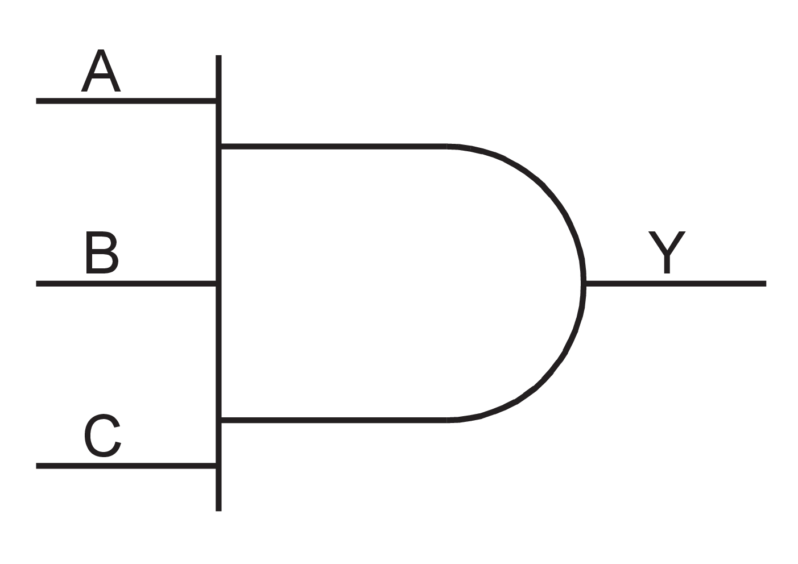

 

|Input|Output|
|-----|------|
|A, B, C|Y|

|A|B|C|Y|
|---|---|---|---|
|X|X|0|0|
|X|0|X|0|
|0|X|X|0|
|1|1|1|1|

## AND4

4-Input AND.

 

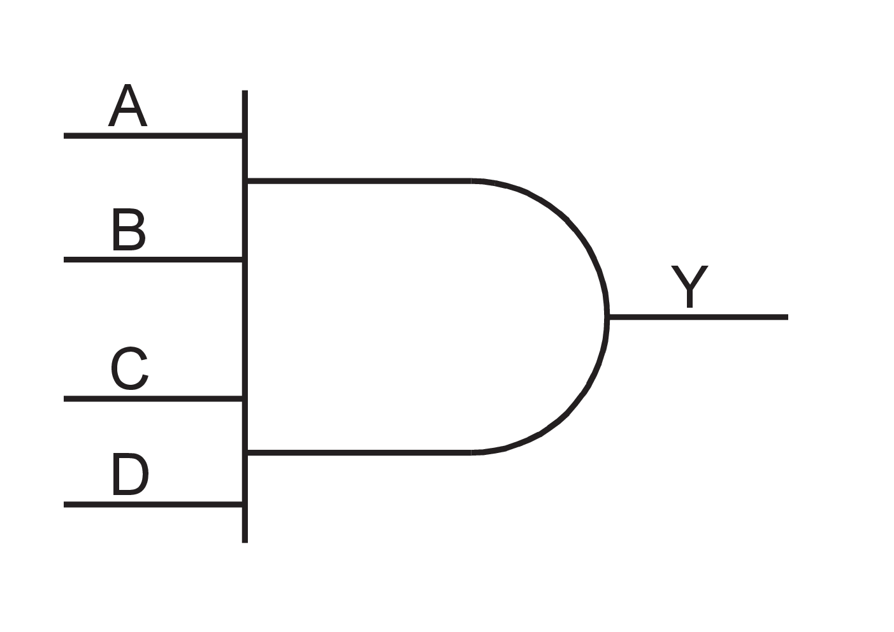

 

|Input|Output|
|-----|------|
|A, B, C, D|Y|

|A|B|C|D|Y|
|---|---|---|---|---|
|X|X|X|0|0|
|X|X|0|X|0|
|X|0|X|X|0|
|0|X|X|X|0|
|1|1|1|1|1|

## ARI1

The ARI1 macro is responsible for representing all arithmetic operations in the pre-layout phase.

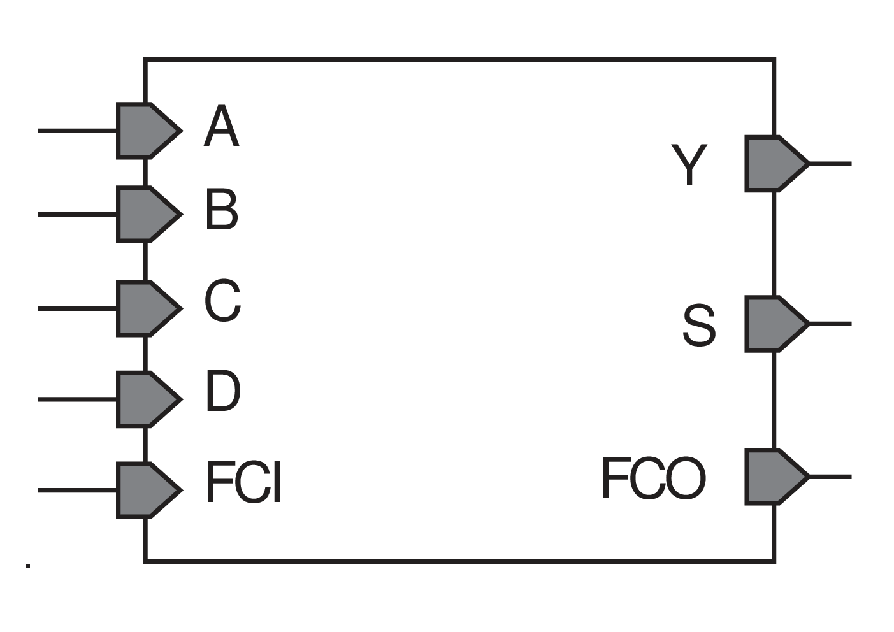

|Input|Output|
|-----|------|
|A, B, C, D, FCI|Y, S, FCO|

The ARI1 cell has a 20 bit INIT string parameter that is used to configure its functionality. The interpretation of the 16 LSB of the INIT string is shown in the following table. F0 is the value of Y when A = 0 and F1 is the value of Y when A = 1.

|ADCB|Y| |
|----|---|---|
|0000|INIT\[0\]|F0|
|0001|INIT\[1\]|
|0010|INIT\[2\]|
|0011|INIT\[3\]|
|0100|INIT\[4\]|
|0101|INIT\[5\]|
|0110|INIT\[6\]|
|0111|INIT\[7\]|
|1000|INIT\[8\]|F1|
|1001|INIT\[9\]|
|1010|INIT\[10\]|
|1011|INIT\[11\]|
|1100|INIT\[12\]|
|1101|INIT\[13\]|
|1110|INIT\[14\]|
|1111|INIT\[15\]|

|Y|FCI|S|
|---|---|---|
|0|0|0|
|0|1|1|
|1|0|1|
|1|1|0|

ARI1 LOGIC

The 4 MSB of the INIT string controls the output of the carry bits. The carry is  generated using carry propagation and generation bits, which are evaluated according to  the following tables.

|INIT\[17\]|INIT\[16\]|G|
|----------|----------|---|
|0|0|0|
|0|1|F0|
|1|0|1|
|1|1|F1|

|INIT\[19\]|INIT\[18\]|P|
|----------|----------|---|
|0|0|0|
|0|1|Y|
|1|X|1|

|P|G|FCI|FCO|
|---|---|---|---|
|0|G|X|G|
|1|X|FCI|FCI|

## ARI1\_CC

The ARI1\_CC macro is responsible for representing all arithmetic operations in the post-layout phase. It performs all the functions of the ARI1 maco except that it does not generate the Final Carry Out \(FCO\).

**Note:** FC1 and FC0 do not perform any functions.

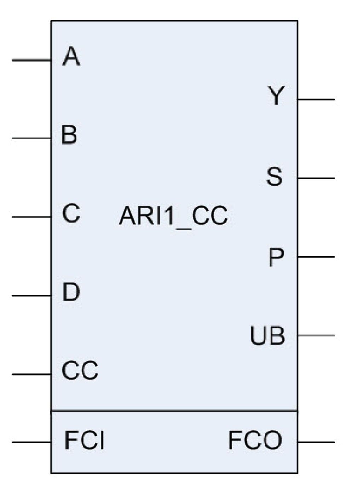

|Input|Output|
|-----|------|
|A, B, C, D,CC|Y, S, P, UB|

The ARI1\_CC cell has a 20-bit INIT string parameter that is used to configure  its functionality. The interpretation of 
the 16 LSB of the INIT string is shown in the  following table. F0 is the value of Y when A = 0 and F1 is the value of Y 
when A =  1.

|ADCB|Y| |
|----|---|---|
|0000|INIT\[0\]|F0|
|0001|INIT\[1\]|
|0010|INIT\[2\]|
|0011|INIT\[3\]|
|0100|INIT\[4\]|
|0101|INIT\[5\]|
|0110|INIT\[6\]|
|0111|INIT\[7\]|
|1000|INIT\[8\]|F1|
|1001|INIT\[9\]|
|1010|INIT\[10\]|
|1011|INIT\[11\]|
|1100|INIT\[12\]|
|1101|INIT\[13\]|
|1110|INIT\[14\]|
|1111|INIT\[15\]|

The 4 MSB of the INIT string controls the output of the carry bits. The carry is  generated using carry propagation and generation bits, which are evaluated according to  the following tables.

|INIT\[17\]|INIT\[16\]|UB|
|----------|----------|---|
|0|0|1|
|0|1|!F0|
|1|0|0|
|1|1|!F1|

|INIT\[19\]|INIT\[18\]|P|
|----------|----------|---|
|0|0|0|
|0|1|Y|
|1|X|1|

The equation of S is given by:

S = Y^CC

## BUFD

Buffer.

**Note:** The compile optimization does not remove this macro.

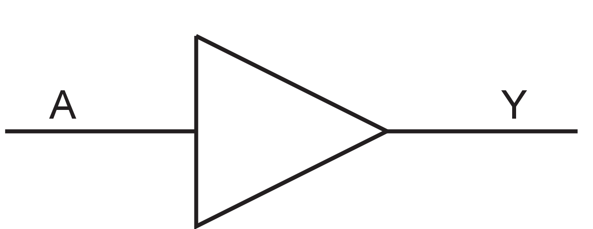

|Input|Output|
|-----|------|
|A|Y|

|A|Y|
|---|---|
|0|0|
|1|1|

## BUFF

Buffer.

 

 

|Input|Output|
|-----|------|
|A|Y|

|A|Y|
|---|---|
|0|0|
|1|1|

## CFG1/2/3/4 and Look-Up Tables \(LUTs\)

CFG1, CFG2, CFG3, and CFG4 are post-layout LUTs that implement any 1-input, 2-input, 3-input, and 4-input combinational logic functions respectively. Each of the CFG1/2/3/4 macros has an INIT string parameter that determines the logic functions of the macro. The output Y is dependent on the INIT string parameter and the values of the inputs.

## CFG2

Post-layout macro implements any 2-input combinational logic function.  Output Y is dependent on the INIT string parameter and the value of A and B. The INIT  string parameter is 4 bits wide.

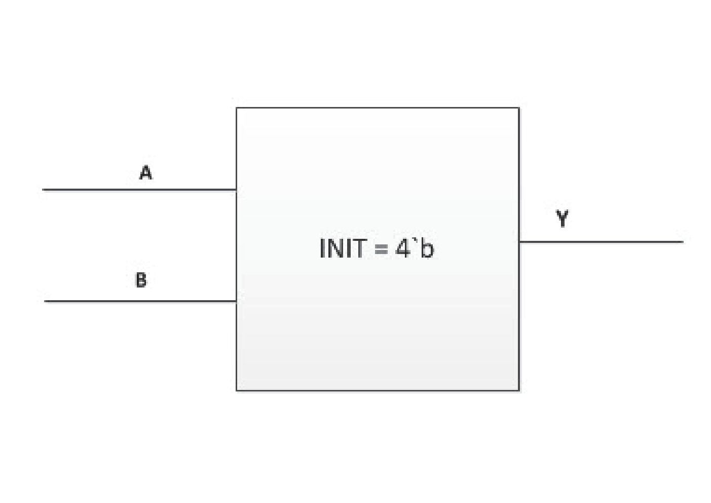

|Input|Output|
|-----|------|
|A,B|Y = f \(INIT, A, B\)|

|BA|Y|
|---|---|
|00|INIT\[0\]|
|01|INIT\[1\]|
|10|INIT\[2\]|
|11|INIT\[3\]|

## CFG3

Post-layout macro used to implement any 3-input combinational logic  function. Output Y is dependent on the INIT string parameter and the value of A, B, and C.  The INIT string parameter is 8 bits wide.

 

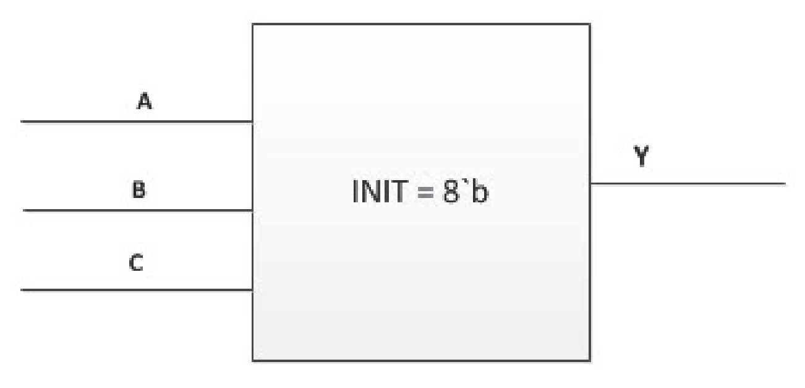

 

|Input|Output|
|-----|------|
|A, B, C|Y = f \(INIT, A,B, C\)|

|CBA|Y|
|---|---|
|000|INIT\[0\]|
|001|INIT\[1\]|
|010|INIT\[2\]|
|011|INIT\[3\]|
|100|INIT\[4\]|
|101|INIT\[5\]|
|110|INIT\[6\]|
|111|INIT\[7\]|

## CFG4

Post-layout macro used to implement any 4-input combinational logic  function. Output Y is dependent on the INIT string parameter and the value of A, B, C, and  D. The INIT string parameter is 16 bits wide.

 

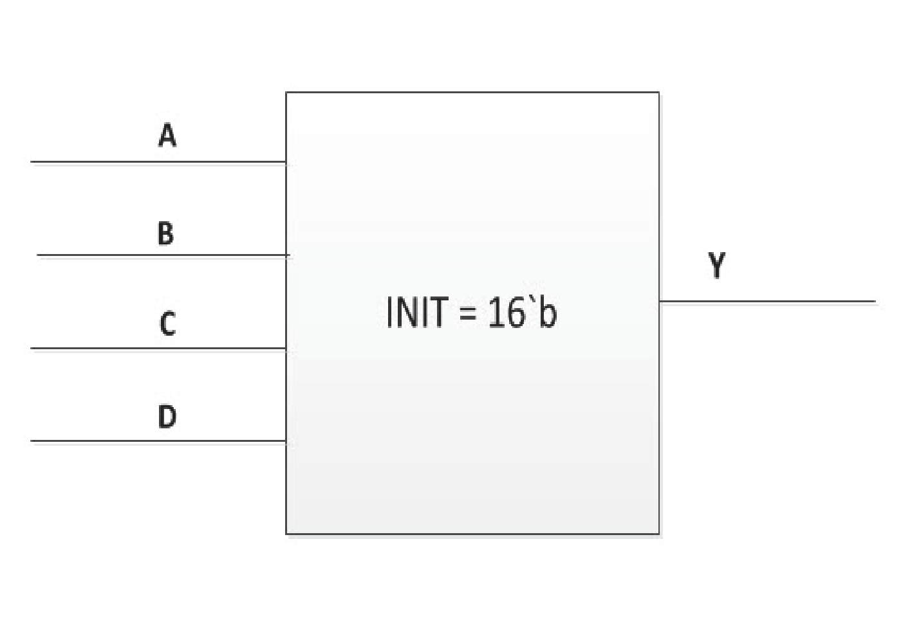

 

|Input|Output|
|-----|------|
|A, B, C, D|Y = f \(INIT, A,B, C, D\)|

|DCBA|Y|
|----|---|
|0000|INIT\[0\]|
|0001|INIT\[1\]|
|0010|INIT\[2\]|
|0011|INIT\[3\]|
|0100|INIT\[4\]|
|0101|INIT\[5\]|
|0110|INIT\[6\]|
|0111|INIT\[7\]|
|1000|INIT\[8\]|
|1001|INIT\[9\]|
|1010|INIT\[10\]|
|1011|INIT\[11\]|
|1100|INIT\[12\]|
|1101|INIT\[13\]|
|1110|INIT\[14\]|
|1111|INIT\[15\]|

## INV

Inverter.

 

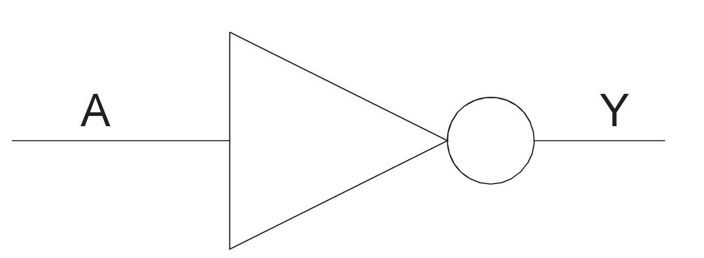

 

|Input|Output|
|-----|------|
|A|Y|

|A|Y|
|---|---|
|0|1|
|1|0|

## INVD

Inverter.

**Note:** Compile optimization does not remove this macro.

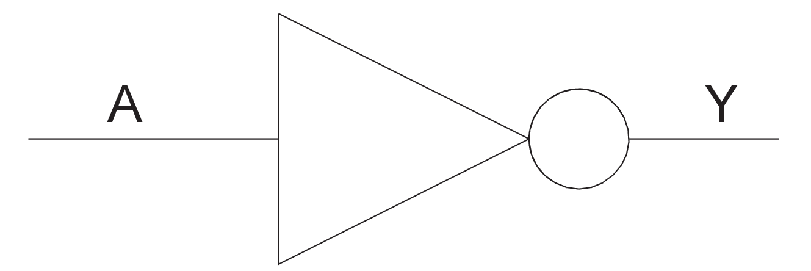

|Input|Output|
|-----|------|
|A|Y|

|A|Y|
|---|---|
|0|1|
|1|0|

## MX2

2 to 1 Multiplexer.

 

 

|Input|Output|
|-----|------|
|A, B, S|Y|

|A|B|S|Y|
|---|---|---|---|
|A|X|0|A|
|X|B|1|B|

## MX4

4 to 1 Multiplexer.

This macro uses two logic modules.

 

 

|Input|Output|
|-----|------|
|D0, D1, D2, D3, S0, S1|Y|

|D3|D2|D1|D0|S1|S0|Y|
|---|---|---|---|---|---|---|
|X|X|X|D0|0|0|D0|
|X|X|D1|X|0|1|D1|
|X|D2|X|X|1|0|D2|
|D3|X|X|X|1|1|D3|

## NAND2

2-Input NAND.

 

 

|Input|Output|
|-----|------|
|A, B|Y|

|A|B|Y|
|---|---|---|
|X|0|1|
|0|X|1|
|1|1|0|

## NAND3

3-Input NAND.

 

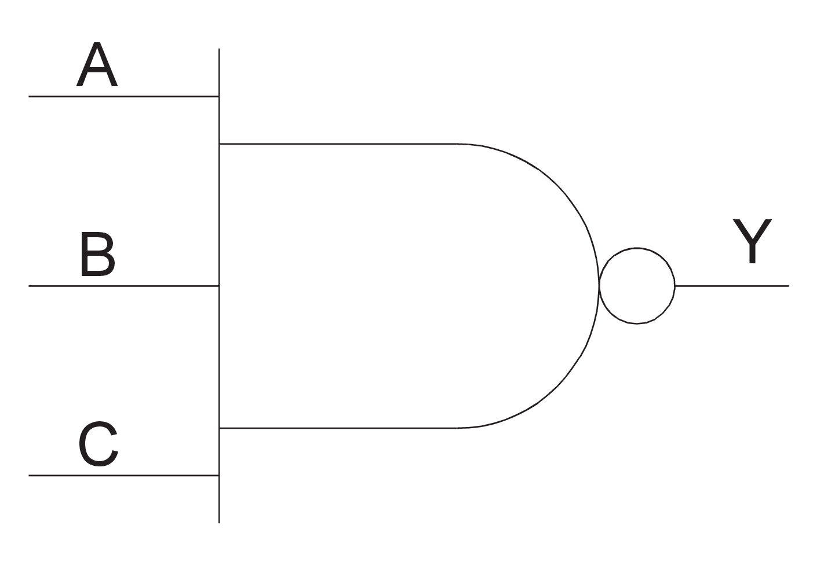

 

|Input|Output|
|-----|------|
|A, B, C|Y|

|A|B|C|Y|
|---|---|---|---|
|X|X|0|1|
|X|0|X|1|
|0|X|X|1|
|1|1|1|0|

## NAND4

4-input NAND.

 

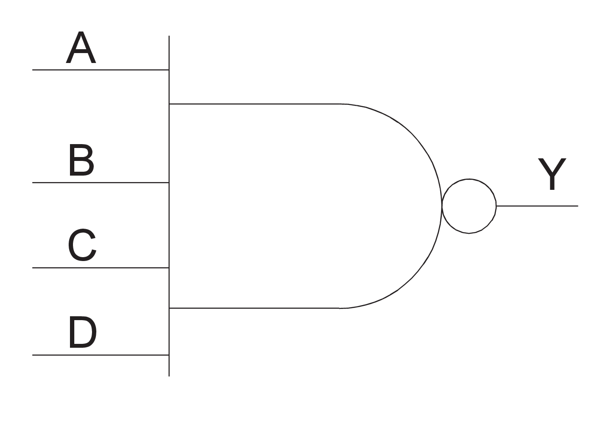

 

|Input|Output|
|-----|------|
|A, B, C, D|Y|

|A|B|C|D|Y|
|---|---|---|---|---|
|X|X|X|0|1|
|X|X|0|X|1|
|X|0|X|X|1|
|0|X|X|X|1|
|1|1|1|1|0|

## NOR2

2-input NOR.

 

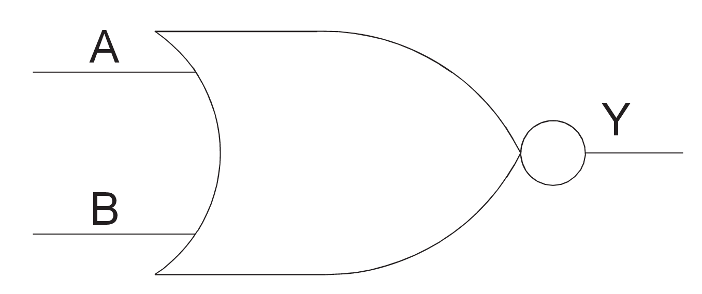

 

|Input|Output|
|-----|------|
|A, B|Y|

|A|B|Y|
|---|---|---|
|0|0|1|
|X|1|0|
|1|X|0|

## NOR3

3-input NOR.

 

 

|Input|Output|
|-----|------|
|A, B, C|Y|

|A|B|C|Y|
|---|---|---|---|
|0|0|0|1|
|X|X|1|0|
|X|1|X|0|
|1|X|X|0|

## NOR4

4-input NOR.

 

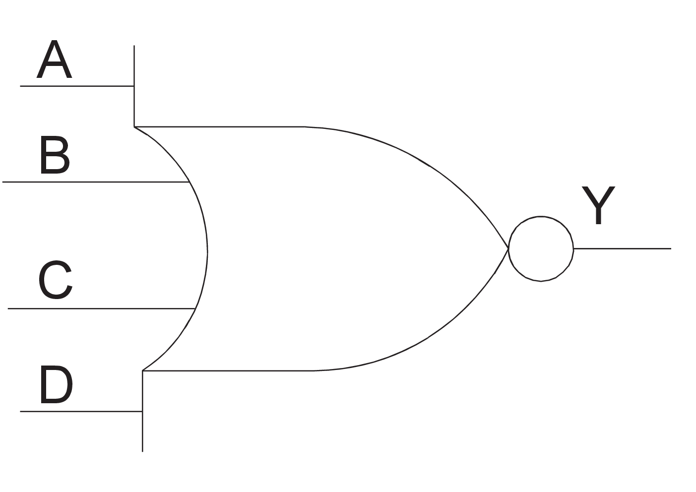

 

|Input|Output|
|-----|------|
|A, B, C, D|Y|

|A|B|C|D|Y|
|---|---|---|---|---|
|0|0|0|0|1|
|1|X|X|X|0|
|X|1|X|X|0|
|X|X|1|X|0|
|X|X|X|1|0|

## OR2

2-input OR.

 

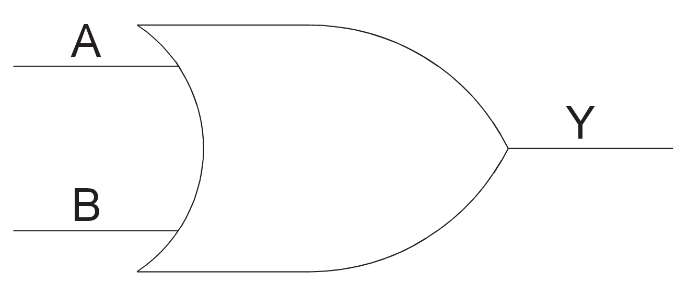

 

|Input|Output|
|-----|------|
|A, B|Y|

|A|B|Y|
|---|---|---|
|0|0|0|
|X|1|1|
|1|X|1|

## OR3

3-input OR.

 

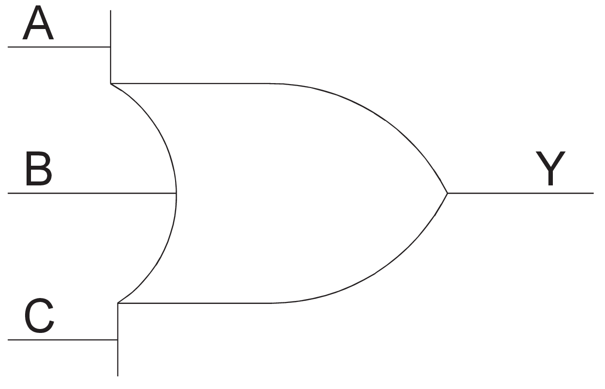

 

|Input|Output|
|-----|------|
|A, B, C|Y|

|A|B|C|Y|
|---|---|---|---|
|0|0|0|0|
|X|X|1|1|
|X|1|X|1|
|1|X|X|1|

## OR4

4-input OR.

 

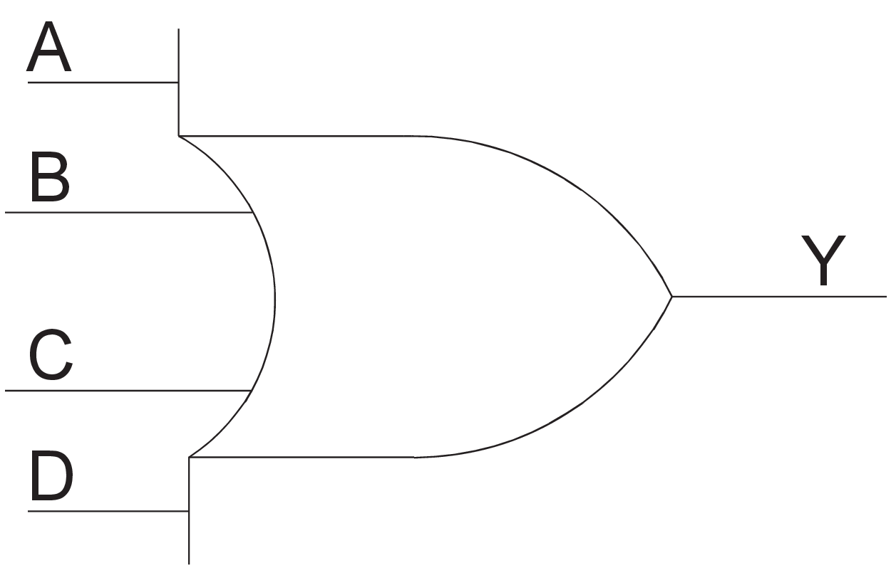

 

|Input|Output|
|-----|------|
|A, B, C, D|Y|

|A|B|C|D|Y|
|---|---|---|---|---|
|0|0|0|0|0|
|1|X|X|X|1|
|X|1|X|X|1|
|X|X|1|X|1|
|X|X|X|1|1|

## XOR2

2-input XOR.

 

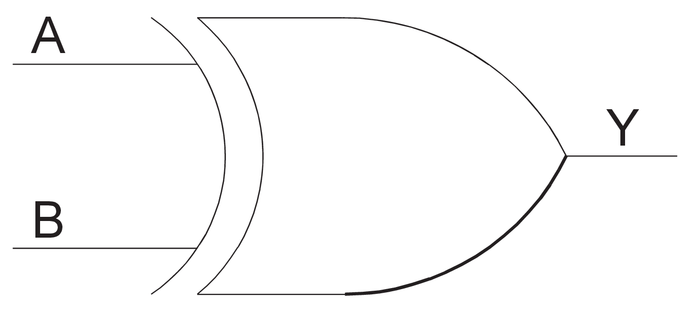

 

|Input|Output|
|-----|------|
|A, B|Y|

|A|B|Y|
|---|---|---|
|0|0|0|
|0|1|1|
|1|0|1|
|1|1|0|

## XOR3

3-input XOR.

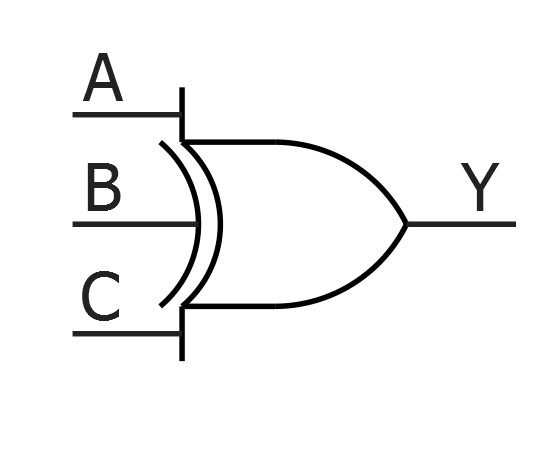

|Input|Output|
|-----|------|
|A, B, C|Y|

|A|B|C|Y|
|---|---|---|---|
|0|0|0|0|
|1|0|0|1|
|0|1|0|1|
|1|1|0|0|
|0|0|1|1|
|1|0|1|0|
|0|1|1|0|
|1|1|1|1|

## XOR4

4-input XOR.

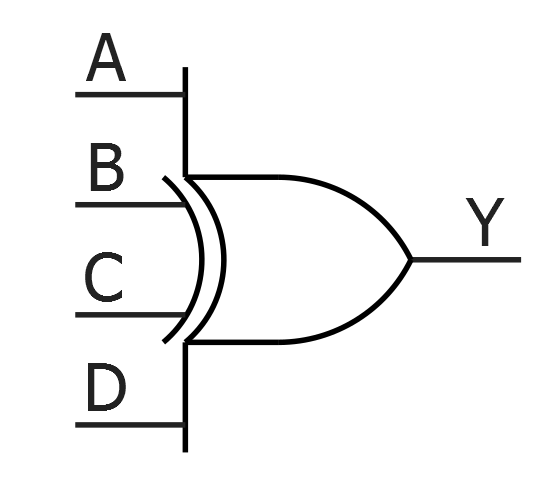

|Input|Output|
|-----|------|
|A, B, C, D|Y|

|A|B|C|D|Y|
|---|---|---|---|---|
|0|0|0|0|0|
|0|0|0|1|1|
|0|0|1|0|1|
|0|0|1|1|0|
|0|1|0|0|1|
|0|1|0|1|0|
|0|1|1|0|0|
|0|1|1|1|1|
|1|0|0|0|1|
|1|0|0|1|0|
|1|0|1|0|0|
|1|0|1|1|1|
|1|1|0|0|0|
|1|1|0|1|1|
|1|1|1|0|1|
|1|1|1|1|0|

## XOR8

8-input XOR.

This macro uses two logic modules.

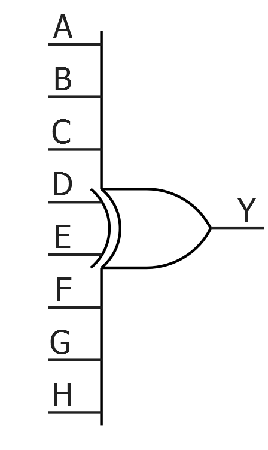

|Input|Output|
|-----|------|
|A, B, C, D, E, F, G, H|Y|

If you have an odd number of inputs that are High, the output is High \(1\).

If you have an even number of inputs that are High, the output is Low \(0\).

For example:

|A|B|C|D|E|F|G|H|Y|
|---|---|---|---|---|---|---|---|---|
|0|0|0|0|0|0|0|0|0|
|0|0|0|0|0|0|0|1|1|
|0|0|0|0|0|0|1|1|0|

## LIVE\_PROBE\_FB

This is a special-purpose macro that feeds the live probe signals back to the fabric. You can connect the PROBE\_A/PROBE\_B signals to any unused I/O during design generation. This is useful if PROBE\_A/PROBE\_B cannot be brought out for debugging due to board limitations. PROBE\_A and PROBE\_B pins must be reserved, if LIVE\_PROBE\_FB macro is used. This macro is not supported in simulation.

