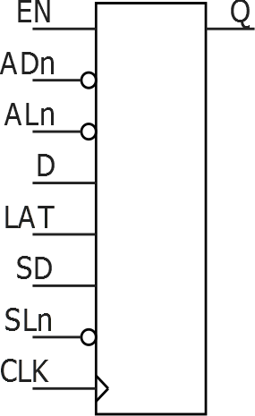

# Sequential Logic

**Important:** In SmartFusion 2 and IGLOO 2 devices, flip-flops do not power up in a known state. If no effective reset or set signal is applied to a flip-flop, the output state is considered indeterminate. This means the flip-flop could power up in either a '0' or '1' state, or even in a metastable state. It is recommended to initialize flip-flops to a known state using a reset signal at power-up.

## DFN1

D-Type Flip-Flop.

|Input|Output|
|-----|------|
|D, CLK|Q|

|CLK|D|Qn+1|
|---|---|----|
|not Rising|X|Qn|
|—|D|D|

## DFN1C0

D-Type Flip-Flop with active-low Clear.

|Input|Output|
|-----|------|
|D, CLK, CLR|Q|

|CLR|CLK|D|Qn+1|
|---|---|---|----|
|0|X|X|0|
|1|not Rising|X|Qn|
|1|—|D|D|

## DFN1E1

D-Type Flip-Flop with active high Enable.

 

 

|Input|Output|
|-----|------|
|D, E, CLK|Q|

|E|CLK|D|Qn+1|
|---|---|---|----|
|0|X|X|Qn|
|1|not Rising|X|Qn|
|1|—|D|D|

## DFN1E1C0

D-Type Flip-Flop, with active-high Enable and active-low Clear.

|Input|Output|
|-----|------|
|CLR, D, E, CLK|Q|

|CLR|E|CLK|D|Qn+1|
|---|---|---|---|----|
|0|X|X|X|0|
|1|0|X|X|Qn|
|1|1|not Rising|X|Qn|
|1|1|—|D|D|

## DFN1E1P0

D-Type Flip-Flop with active-high Enable and active-low Preset.

|Input|Output|
|-----|------|
|D, E, PRE, CLK|Q|

|PRE|E|CLK|D|Qn+1|
|---|---|---|---|----|
|0|X|X|X|1|
|1|0|X|X|Qn|
|1|1|not Rising|X|Qn|
|1|1|—|D|D|

## DLN1

Data Latch.

 

 

|Input|Output|
|-----|------|
|D, G|Q|

|G|D|Q|
|---|---|---|
|0|X|Q|
|1|D|D|

## DLN1C0

Data Latch with active-low Clear.

|Input|Output|
|-----|------|
|CLR, D, G|Q|

|CLR|G|D|Q|
|---|---|---|---|
|0|X|X|0|
|1|0|X|Q|
|1|1|D|D|

## DLN1P0

Data Latch with active-low Preset.

|Input|Output|
|-----|------|
|D, G, PRE|Q|

|PRE|G|D|Q|
|---|---|---|---|
|0|X|X|1|
|1|0|X|Q|
|1|1|D|D|

## SLE

Sequential Logic Element.

|Input|Output|
|-----|------|
|Name|Function|Q|
|D|Data input|
|CLK|Clock input|
|EN|Active-High CLK enable|
|ALn|Asynchronous Load. This active-Low signal  either sets the register or clears the register depending on the value of  ADn.|
|ADn[1](#ID-000013AB)|Static asynchronous load data. When ALn is active, Q goes to the complement of ADn.|
|SLn|Synchronous load. This active-Low signal  either sets the register or clears the register depending on the value of SD,  at the rising edge of clock.|
|SD[1](#ID-000013AB)|Static synchronous load data. When SLn is  active \(that is, low\), Q goes to the value of SD at the rising edge of  CLK.|
|LAT[1](#ID-000013AB)|Active-High Latch Enable. This signal enables  latch mode when high and register mode when low.|

 

1.  ADn, SD, and LAT are static signals defined at design time and need to be tied to 0 or 1.

 

|ALn|ADn|LAT|CLK|EN|SLn|SD|D|Qn+1|
|---|---|---|---|---|---|---|---|----|
|0|ADn|X|X|X|X|X|X|!ADn|
|1|X|0|Not rising|X|X|X|X|Qn|
|1|X|0|—|0|X|X|X|Qn|
|1|X|0|—|1|0|SD|X|SD|
|1|X|0|—|1|1|X|D|D|
|1|X|1|0|X|X|X|X|Qn|
|1|X|1|1|0|X|X|X|Qn|
|1|X|1|1|1|0|SD|X|SD|
|1|X|1|1|1|1|X|D|D|

