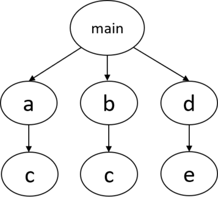
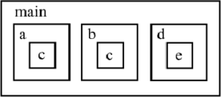
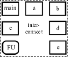
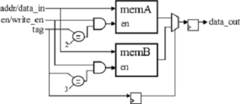
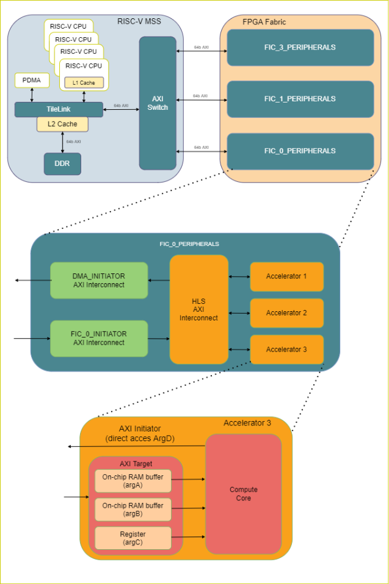
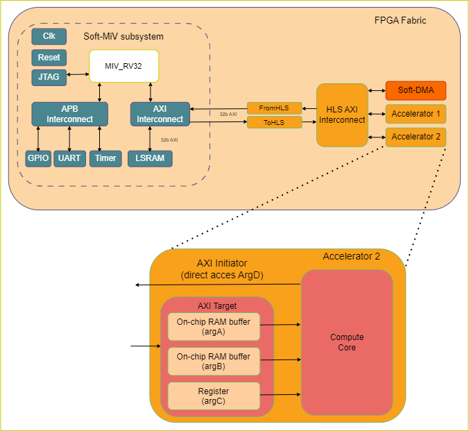

# Hardware Architecture

## Circuit Topology

Each C/C++ function corresponds to a hardware module in Verilog. For instance, if we have a software program with the following call graph:

where `main` calls `a`, `b`, and `d`, each of which calls `c`, `c`, and `e`, respectively. Notice that function `c` is called by both `a` and `b`. One way to create this system in hardware is to instantiate one module within another module, in a nested hierarchy, following how the functions are called in software:

This architecture is employed by some of the other HLS tools, but it can create an unnecessary replication of hardware. Notice how module `c` has to be created twice, since the function `c` is called from different parent functions. In SmartHLS™, we instantiate all modules at the same level of hierarchy, and automatically create the necessary interconnect to connect them together.

This prevents modules from being unnecessarily replicated, saving area. The hardware system may also use a functional unit \(denoted as `FU` in the figure\), such as a floating-point unit, which is also created at the same level. This architecture also allows such units, which typically consume a lot of area, to be shared between different modules.

**Important:**

For a small function, or for a function that is only called once in software, SmartHLS may decide to `inline` the function into its parent function to improve performance. Any inlined function is included as part of its parent function, so there will not be a separate module in the Verilog for the inlined function. Thus you may not find all the software functions in the generated hardware.

### Threaded Hardware Modules

When threads are used in software, SmartHLS™ automatically compiles them to concurrently executing modules. This is synonymous to how multiple threads are compiled to execute on multiple processor cores in software. By default, each thread in software becomes an independent hardware module. For example, forking three threads of function `a` in software creates three concurrently executing instances of module `a` in hardware.

## Memory Architecture

SmartHLS™ stores any arrays  \(local or global\) and global variables in a memory. We describe below what type of memories  they are, as well as where the memories are stored.

In SmartHLS, there exists four hierarchies of memories: 1\) Local memory, 2\) shared-local memory, 3\) aliased memory, and 4\) I/O memory. Local, shared-local, and aliased memories exist in the generated hardware. I/O memories are data that are inputs/output to/from the generated hardware. They exist outside of the generated hardware \(SmartHLS does not instantiate memories for them\), where top-level memory interfaces are created for them.

SmartHLS automatically determines the read latency for memories based  on the target clock period and timing model. User can disable this function by changing [ENABLE\_AUTOMATIC\_MEMORY\_LATENCY\_SETTING](Chunk1590600802.md#) Tcl parameter.  Alternatively, users can override the default values using [set\_operation\_latency](Chunk1590600802.md#) Tcl parameter  . The auto-determined  latency can be found in [Memory Usage](Chunk120481216.md#) section of SmartHLS report.

### Local Memory

SmartHLS™ uses points-to analysis to determine which memories are used by which functions. If a memory is determined to be used by a single function, where the function is to be compiled to hardware, that array is implemented as a local memory. A local memory is created and connected directly inside the module that accesses it.

The local memory read latency can be changed with the [set\_operation\_latency](Chunk1590600802.md#)Tcl parameter.

### Shared-Local Memory

If a memory is accessed by multiple functions, where all the functions that access it are to be compiled to hardware, the memory is designated as a shared-local memory. A shared-local memory is instantiated outside the modules \(at the same level of hierarchy as the modules themselves, as shown for functions and FU in the diagram above\), and memory ports are created for the modules to connect to the memory. Arbitration is automatically created to handle contention for a shared-local memory. SmartHLS™ automatically optimizes the arbitration logic, so that if the modules that access the memory are executing sequentially, a simple `OR` gate is used for arbitration \(which consumes only a small amount of area\), but if the accessing modules are executing concurrently \(with the use of `hls::thread`\), a round robin arbiter is automatically created to handle contention.

The read latency of shared-local memories are determined by [ENABLE\_AUTOMATIC\_MEMORY\_LATENCY\_SETTING](Chunk1590600802.md#) on default setting. The shared-local memory read latency can be changed with [set\_operation\_latency](Chunk1590600802.md#).

### Aliased Memory

There can be cases where a pointer can point to multiple arrays, causing pointer aliasing. These pointers need to be resolved at runtime. We designate the memories that such a pointer can refer to as aliased memories, which are stored in a memory controller \(described below\). A memory controller contains all memories that can alias to each other, and allows memory accesses to be steered to the correct memory at runtime. There can be multiple memory controllers in a system, each containing a set of memories that alias to each other.

Aliased memories have a read latency of 2 clock cycles. The aliased memory read latency can be  changed with the [set\_operation\_latency](Chunk1590600802.md#) Tcl parameter.

#### Memory Controller

The purpose of the memory controller is to automatically resolve pointer ambiguity at runtime. The memory controller is only created if there are aliased memories. The architecture of the memory controller is shown below:

For clarity, some of the signals are combined together in the figure. Even though the figure depicts a single-ported memory, all memories are dual-ported by default, unless only a single memory access is needed per cycle, in which case it will be single-ported memory. The memory controller steers memory accesses to the correct RAM, by using a tag, which is assigned to each aliased memory by SmartHLS™. At runtime, the tag is used to determine which memory block to enable, with all other memory blocks disabled. The same tag is used to select the correct output data between all memory blocks.

### I/O Memory

Any memory that is accessed by both the software testbench \(parent functions of the  top-level function\) and hardware functions \(the top-level functions and its descendants\)  becomes an I/O memory. These are any non-constant arguments for top-level function or  global variables that are accessed by both the software testbench and hardware functions.  I/O memories become memory interfaces of the top-level module for the generated hardware,  where no actual memories are instantiated within the generated hardware for them. For more  information on interfaces, please refer to [Top-Level RTL Interface](Chunk120481216.md#).

### Memory Implementation

By default, each local, shared-local, and aliased memories are stored in a separate  dual-ported on-chip RAM, where each RAM allows two accesses per clock cycle. All local  memories can be accessed in parallel. All shared-local memories can be accessed  concurrently when there are no accesses to same memory in the same clock cycle. If there  are concurrent accesses to the same RAM, arbitration logic handles the contention  automatically and stalls the appropriate modules. All independent memory controllers can  also be accessed in parallel, but aliased memories which belong to the same memory  controller will be accessed sequentially.

#### Memory Optimizations

SmartHLS™ automatically stores each single-element global variable \(non-array\) in a set of registers, rather than a block RAM, to reduce memory usage and improve performance. A block RAM has a minimum read latency of 1 clock cycle, where a register can be read in the same clock cycle \(0 cycle latency\). For small arrays, SmartHLS may decide to split them up and store individual elements in separate registers. This allows all elements to be accessed at the same time. If an array is accessed in a loop, and the loop is unrolled, SmartHLS also may decide to split up the array.

If only up to a single memory accessed is needed per cycle for a memory, SmartHLS will instantiate a single-ported RAM, otherwise a dual-ported RAM will be used. If a memory is only ever read from, SmartHLS will convert the memory to a read-only memory \(ROM\), even if the corresponding array is not declared as a constant in software. If a memory is not accessed at all, SmartHLS will automatically optimize away the memory.

## Interfaces

Please refer to the [Top-Level RTL Interface](Chunk120481216.md#) section for a detailed description on the interfaces that are created by SmartHLS™.

## SmartHLS Reference SoC

The SmartHLS SoC flow uses pre-existing reference designs that include  a microprocessor \(CPU\) as the basis to automatically integrate SmartHLS-generated hardware modules and make them available  to the processor.

Currently, SmartHLS uses the  [Icicle Kit Reference Design](https://github.com/polarfire-soc/icicle-kit-reference-design/), which is meant to showcase the  many features available in the PolarFire® SoC Icicle Kit, such as  the use of the hardened RISC-V Quad-core Microprocessor Subsystem, SPI, PCIe, soft and  hard DMA, inter-processor communications, etc. Explaining all these features is beyond  the scope of this document. For a complete description of the reference design check the  [Icicle Kit Reference Design](https://github.com/polarfire-soc/icicle-kit-reference-design/) documentation.

As an *ALPHA feature*, SmartHLS  also supports attaching HLS-generated modules to the MiV\_RV32 processor \(a.k.a.  Soft-MiV\). The reference design for the MiV\_RV32 processor targets the [PolarFire Video Kit](https://www.microchip.com/en-us/development-tool/MPF300-VIDEO-KIT-NS) .

This section presents an overview of how these two reference designs are used by SmartHLS to automatically connect hardware modules generated  from C++.

First we will describe the Icicle Kit Reference  architecture followed by the MiV\_RV32 Reference architecture.

## Icicle Kit Reference Design

The Icicle Kit Reference Design is described in the following image:

On the top left-hand side is the Microprocessor Sub-System \(MSS\). This is a hardened module on the PolarFireSoC devices. It contains four RISC-V cores, DDR memory, a hardened DMA controller, and related components. MSS components are connected internally with a TileLink switch, and interface with the FPGA fabric with both an AXI4 Initiator and AXI4 Target interface over an AXI switch. There are four available AXI Fabric Interface Controllers \(FIC\) available on the MSS. However, the reference design only uses three \(FIC0, FIC1 and FIC3\) as shown on the diagram. For more details on the MSS, please see the [PolarFire SoC MSS Technical Reference Manual](https://onlinedocs.microchip.com/pr/GUID-0E320577-28E6-4365-9BB8-9E1416A0A6E4-en-US-3/index.html).

On the top right-hand side of the diagram is the FPGA fabric. There are three sub-blocks created to group logic related to a specific FIC and keep the top-level design clean. SmartHLS™-generated hardware modules and accelerators are automatically instantiated and connected under the FIC\_0\_PERIPHERALS sub-module, which has three AXI interconnects: FIC\_0\_INITIATOR, DMA\_INITIATOR and HLS\_AXI\_INTERCONNECT. The first two are part of the Icicle Kit Reference Design and are used to demonstrate how to control a soft-DMA module and LSRAMs \(not shown in the diagram\) from the MSS. The FIC\_0\_INITIATOR is used to transfer data in the MSS to Fabric direction, and the DMA\_INITIATOR transfers data in the fabric to MSS direction. SmartHLS reuses those AXI interconnects to connect the HLS\_AXI\_INTERCONNECT and one or more accelerators in the design

An example architecture of a SmartHLS-generated module is shown at the bottom of the diagram. It has an AXI4 Target interface, and depending on the specified interface type, it can have an AXI4 Initiator interface as well. Each AXI target argument in the C++ function has a corresponding on-chip storage accessible to the MSS via AXI transactions and is also directly connected to the core of the hardware accelerator. In this case argA, argB and argC are AXI target arguments. The type of storage can be a local memory such as LSRAMs for pointer arguments \(argA and argB\), or simple flip-flop registers for scalar arguments \(argC\). AXI Initiator arguments \(argD\) do not require additional storage since they directly access the MSS memory, such as external DDR.

The interfaces are created based on the pragma, `#pragma HLS interface argument(<arg_name>) type(axi_target/axi_initiator)` \(see [AXI4 Target Interface for Pointer Argument](Chunk1258399261.md#), [AXI4 Initiator Interface for Pointer Argument](Chunk1258399261.md#)\). For details on the different data  transfer methods for the AXI Target/Initiator arguments, see [SoC Data Transfer Methods](Chunk120481216.md#).

## MiV\_RV32 Reference Design

**Note:** This feature is an alpha release.

The reference design for the MiV\_RV32 is simpler compared to the Icicle Kit Reference design. The processor is implemented on the FPGA fabric and it runs baremetal, i.e. without an operating system. However, as can be seen on the following image, the processor has a few peripherals, such as General Purpose I/O, UART and a Timer module, which are connected via an Advanced Peripheral Bus \(APB\).

The MiV\_RV32 also has an AXI interconnect which is connected to a LSRAM memory block to store instructions and data for the processor. Similar to the Icicle Kit Reference design, the SmartHLS-generated subsystem is also connected to this AXI interconnect. The architecture of the modules generated by SmartHLS is the same regardless of which reference design is used.

One difference compared to the Icicle Kit Refernce Design is the DMA. For the Icicle Kit Reference Design, SmartHLS uses the hardened DMA part of the MSS, but the MiV\_RV Reference DesignSmartHLS uses a Soft-DMA implemented on the FPGA fabric . When a C++ function argument is marked as AXI target with the DMA option set to true \(e.g. `#pragma HLS interface argument(<argname>) type(axi_target) dma(true)`\) SmartHLS will automatically instantiate the soft-DMA engine, connect it to the HLS AXI interconnect and generate the driver DMA API for the CPU to use it. If the DMA option is later disabled \(`dma(flase)`\) then the Soft-DMA engine will be automatically removed.

Finally, the MiV\_RV32 Reference Design also includes reset and clock circuitry, and most importantly, a JTAG module that allows the programming and debugging of the MiV\_RV32 processor via OpenOCD using SoftConsole or the GNU Debugger \(gdb\) from the command-line.

